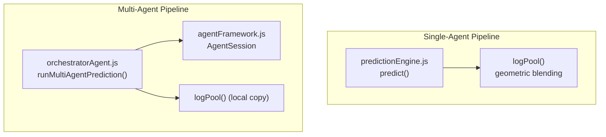
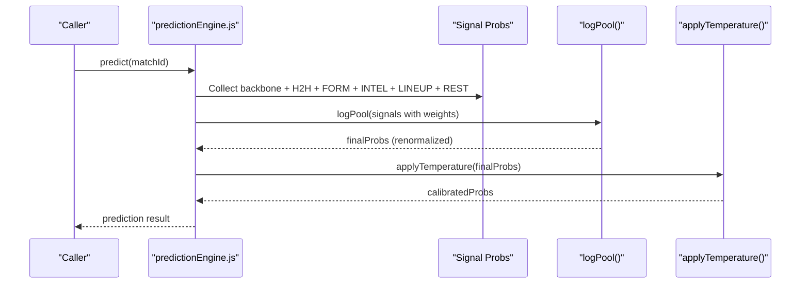
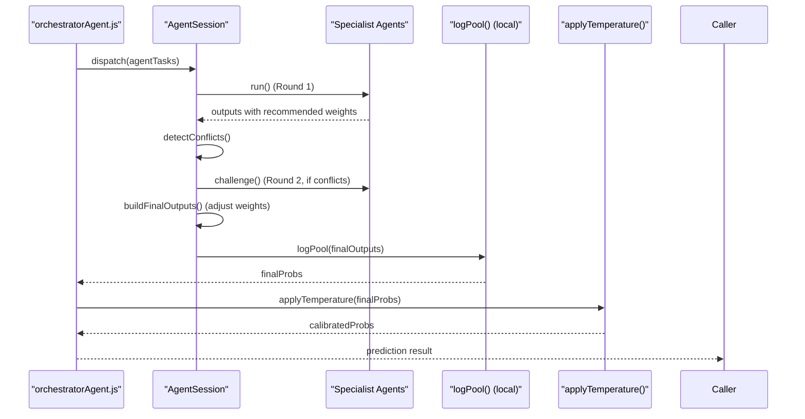
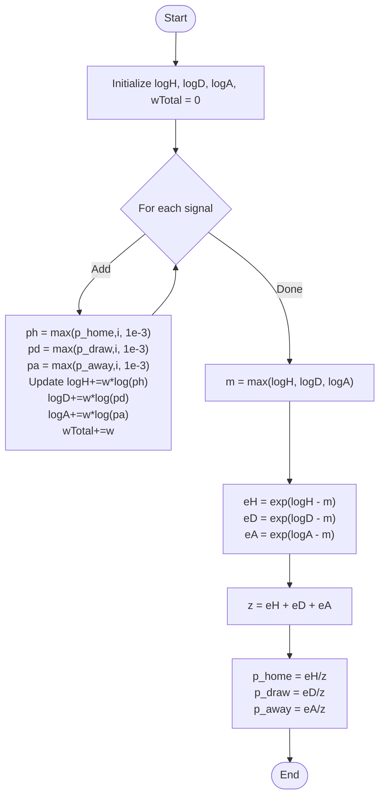
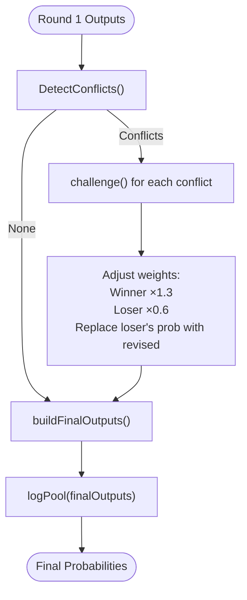
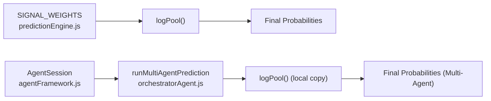

# Log-Pool Probability Blending

<cite>
**Referenced Files in This Document**
- [predictionEngine.js](file://backend/services/predictionEngine.js)
- [predictionEngine.test.js](file://backend/services/predictionEngine.test.js)
- [orchestratorAgent.js](file://backend/services/agents/orchestratorAgent.js)
- [agentFramework.js](file://backend/services/agents/agentFramework.js)
- [h2hAgent.js](file://backend/services/agents/h2hAgent.js)
- [formAgent.js](file://backend/services/agents/formAgent.js)
- [intelAgent.js](file://backend/services/agents/intelAgent.js)
</cite>

## Table of Contents
1. [Introduction](#introduction)
2. [Project Structure](#project-structure)
3. [Core Components](#core-components)
4. [Architecture Overview](#architecture-overview)
5. [Detailed Component Analysis](#detailed-component-analysis)
6. [Dependency Analysis](#dependency-analysis)
7. [Performance Considerations](#performance-considerations)
8. [Troubleshooting Guide](#troubleshooting-guide)
9. [Conclusion](#conclusion)

## Introduction
This document explains the log-pool probability blending technique used to combine multiple prediction signals into a final outcome distribution. The method computes a geometric mean over per-signal probability distributions raised to per-signal exponents, then renormalizes to preserve confidence. It contrasts with arithmetic averaging, which tends to collapse probabilities toward uniformity. The document covers the mathematical formulation, weight distribution, numerical stability measures, and practical examples of blending multiple signals.

## Project Structure
The blending logic is implemented in two primary locations:
- Single-agent pipeline: [predictionEngine.js](file://backend/services/predictionEngine.js)
- Multi-agent pipeline: [orchestratorAgent.js](file://backend/services/agents/orchestratorAgent.js) and [agentFramework.js](file://backend/services/agents/agentFramework.js)

**Diagram sources**
- [predictionEngine.js:835-845](file://backend/services/predictionEngine.js#L835-L845)
- [orchestratorAgent.js:41-55](file://backend/services/agents/orchestratorAgent.js#L41-L55)
- [agentFramework.js:455-503](file://backend/services/agents/agentFramework.js#L455-L503)

**Section sources**
- [predictionEngine.js:835-845](file://backend/services/predictionEngine.js#L835-L845)
- [orchestratorAgent.js:41-55](file://backend/services/agents/orchestratorAgent.js#L41-L55)
- [agentFramework.js:455-503](file://backend/services/agents/agentFramework.js#L455-L503)

## Core Components
- Geometric blending function: logPool()
- Signal weights: BACKBONE (1.0), H2H (0.30), FORM (0.20), INTEL (0.20), LINEUP (0.40), REST (0.10)
- Numerical stability: minimum probability floor of 1e-3 and log-sum-exp renormalization
- Confidence preservation: geometric mean avoids collapsing toward 1/3, 1/3, 1/3

Key implementation references:
- Weight constants and blending invocation: [predictionEngine.js:92-100](file://backend/services/predictionEngine.js#L92-L100), [predictionEngine.js:835-845](file://backend/services/predictionEngine.js#L835-L845)
- Geometric blending core: [predictionEngine.js:214-238](file://backend/services/predictionEngine.js#L214-L238)
- Test assertions for preservation and renormalization: [predictionEngine.test.js:90-121](file://backend/services/predictionEngine.test.js#L90-L121)

**Section sources**
- [predictionEngine.js:92-100](file://backend/services/predictionEngine.js#L92-L100)
- [predictionEngine.js:214-238](file://backend/services/predictionEngine.js#L214-L238)
- [predictionEngine.test.js:90-121](file://backend/services/predictionEngine.test.js#L90-L121)

## Architecture Overview
The blending architecture differs between single-agent and multi-agent modes:

**Diagram sources**
- [predictionEngine.js:835-845](file://backend/services/predictionEngine.js#L835-L845)
- [predictionEngine.js:691-922](file://backend/services/predictionEngine.js#L691-L922)

**Diagram sources**
- [orchestratorAgent.js:309-499](file://backend/services/agents/orchestratorAgent.js#L309-L499)
- [agentFramework.js:355-503](file://backend/services/agents/agentFramework.js#L355-L503)

## Detailed Component Analysis

### Mathematical Foundation: Log-Pool Blending
The geometric blending computes:
- For each signal i, a probability vector (p_home,i, p_draw,i, p_away,i) with weight w_i
- Renormalized log-space aggregation:
  - log(α) = Σ_i w_i · log(max(p_home,i, 1e-3))
  - log(β) = Σ_i w_i · log(max(p_draw,i, 1e-3))
  - log(γ) = Σ_i w_i · log(max(p_away,i, 1e-3))
- Renormalization: p_home = exp(log(α))/Z, p_draw = exp(log(β))/Z, p_away = exp(log(γ))/Z where Z = exp(log(α)) + exp(log(β)) + exp(log(γ))

This preserves confidence because extreme probabilities (near 0 or 1) dominate the weighted sum in log-space, preventing collapse to 1/3, 1/3, 1/3.

**Diagram sources**
- [predictionEngine.js:214-238](file://backend/services/predictionEngine.js#L214-L238)

**Section sources**
- [predictionEngine.js:214-238](file://backend/services/predictionEngine.js#L214-L238)
- [predictionEngine.test.js:90-121](file://backend/services/predictionEngine.test.js#L90-L121)

### Weight Distribution System
Weights used in the single-agent pipeline:
- BACKBONE: 1.0
- H2H: 0.30
- FORM: 0.20
- INTEL: 0.20
- LINEUP: 0.40
- REST: 0.10

These weights are defined centrally and applied when assembling the signal set for blending.

**Section sources**
- [predictionEngine.js:92-100](file://backend/services/predictionEngine.js#L92-L100)
- [predictionEngine.js:835-845](file://backend/services/predictionEngine.js#L835-L845)

### Numerical Stability Measures
- Minimum probability floor: 1e-3 prevents log(0) and maintains robustness
- Log-sum-exp renormalization: subtracting the maximum log-value before exponentiation avoids overflow and improves conditioning
- Zero-weight safety: returns uniform probabilities when total weight is zero

**Section sources**
- [predictionEngine.js:223-237](file://backend/services/predictionEngine.js#L223-L237)
- [predictionEngine.test.js:117-120](file://backend/services/predictionEngine.test.js#L117-L120)

### Preservation of Confidence vs Arithmetic Averaging
The log-pool approach avoids the “collapse” problem of arithmetic averaging:
- Arithmetic averaging pulls extreme probabilities toward 1/3, 1/3, 1/3
- Geometric averaging retains extremum tendencies, preserving high-confidence predictions when signals agree

Unit tests demonstrate:
- Agreement among confident signals remains confident
- Presence of a uniform side-signal does not easily overwhelm a strong signal

**Section sources**
- [predictionEngine.js:214-218](file://backend/services/predictionEngine.js#L214-L218)
- [predictionEngine.test.js:90-107](file://backend/services/predictionEngine.test.js#L90-L107)

### Examples of Blending Multiple Probability Vectors
Example scenarios (descriptive, not code):
- Scenario A: Backbone 0.6/0.2/0.2, H2H 0.7/0.2/0.1, LINEUP 0.5/0.3/0.2
  - The LINEUP signal’s higher weight for HOME increases the final HOME probability
- Scenario B: Uniform side-signal (1/3 each) with a strong confident signal
  - The confident signal dominates due to geometric averaging; final distribution remains skewed toward the confident outcome
- Scenario C: Multiple weak signals
  - Final distribution approaches backbone, with slight nudges from available signals

These examples illustrate how the weighted geometric mean resolves conflicts and amplifies strong signals.

[No sources needed since this subsection provides conceptual examples]

### Weight Adjustment Mechanisms (Multi-Agent Mode)
In the multi-agent pipeline, agents propose initial probability estimates with recommended weights. The framework detects conflicts (maximum probability delta ≥ 0.20) and negotiates:
- The agent that moves less is considered the winner and receives a 1.3× weight boost
- The agent that moves more is considered the loser and has its weight reduced to 0.6×
- The loser’s revised (conceded) probabilities replace its original in the final blend

**Diagram sources**
- [agentFramework.js:376-404](file://backend/services/agents/agentFramework.js#L376-L404)
- [agentFramework.js:406-445](file://backend/services/agents/agentFramework.js#L406-L445)
- [agentFramework.js:447-503](file://backend/services/agents/agentFramework.js#L447-L503)

**Section sources**
- [agentFramework.js:376-404](file://backend/services/agents/agentFramework.js#L376-L404)
- [agentFramework.js:406-445](file://backend/services/agents/agentFramework.js#L406-L445)
- [agentFramework.js:447-503](file://backend/services/agents/agentFramework.js#L447-L503)

### Impact of Each Signal Type
- BACKBONE: Base model (Dixon–Coles Poisson) with full weight (1.0)
- H2H: Historical head-to-head record; only included when ≥2 meetings
- FORM: Recent form with opponent-quality weighting
- INTEL: Pre-match intelligence (injuries, motivation, rotation)
- LINEUP: Confirmed lineup strength; highest weight (0.40) among auxiliary signals
- REST: Rest-day difference effect; included only when ≥1 day delta

**Section sources**
- [predictionEngine.js:801-833](file://backend/services/predictionEngine.js#L801-L833)
- [h2hAgent.js:52-61](file://backend/services/agents/h2hAgent.js#L52-L61)
- [formAgent.js:65-102](file://backend/services/agents/formAgent.js#L65-L102)
- [intelAgent.js:64-117](file://backend/services/agents/intelAgent.js#L64-L117)

## Dependency Analysis
The blending depends on:
- Centralized weights and blending logic in the single-agent pipeline
- Local copies of blending and temperature utilities in the multi-agent orchestrator to avoid circular dependencies
- AgentSession for conflict detection, negotiation, and final weight adjustments

**Diagram sources**
- [predictionEngine.js:92-100](file://backend/services/predictionEngine.js#L92-L100)
- [predictionEngine.js:214-238](file://backend/services/predictionEngine.js#L214-L238)
- [orchestratorAgent.js:41-55](file://backend/services/agents/orchestratorAgent.js#L41-L55)
- [agentFramework.js:355-503](file://backend/services/agents/agentFramework.js#L355-L503)

**Section sources**
- [predictionEngine.js:92-100](file://backend/services/predictionEngine.js#L92-L100)
- [predictionEngine.js:214-238](file://backend/services/predictionEngine.js#L214-L238)
- [orchestratorAgent.js:41-55](file://backend/services/agents/orchestratorAgent.js#L41-L55)
- [agentFramework.js:355-503](file://backend/services/agents/agentFramework.js#L355-L503)

## Performance Considerations
- Log-space computation avoids repeated multiplications and reduces numerical drift
- Renormalization via log-sum-exp ensures stability even with widely varying weights
- Multi-agent negotiation is parallelized to minimize latency while maintaining quality

[No sources needed since this section provides general guidance]

## Troubleshooting Guide
Common issues and remedies:
- Uniform output despite strong signals: verify that weights are nonzero and that signals are included (e.g., H2H requires ≥2 meetings)
- Numerical instability warnings: ensure probabilities exceed the minimum floor (1e-3) and that weights are positive
- Multi-agent disagreement: check conflict detection thresholds and negotiation outcomes; losers’ revised probabilities replace originals

**Section sources**
- [predictionEngine.js:223-237](file://backend/services/predictionEngine.js#L223-L237)
- [agentFramework.js:376-404](file://backend/services/agents/agentFramework.js#L376-L404)
- [agentFramework.js:406-445](file://backend/services/agents/agentFramework.js#L406-L445)

## Conclusion
The log-pool probability blending technique combines multiple prediction signals using a geometric mean with per-signal exponents, preserving confidence and avoiding collapse to uniform distributions. In the single-agent pipeline, weights are fixed and applied consistently. In the multi-agent pipeline, dynamic weight adjustments resolve conflicts and further refine the final distribution. Together, these mechanisms yield robust, interpretable predictions that reflect both statistical foundations and real-time signals.