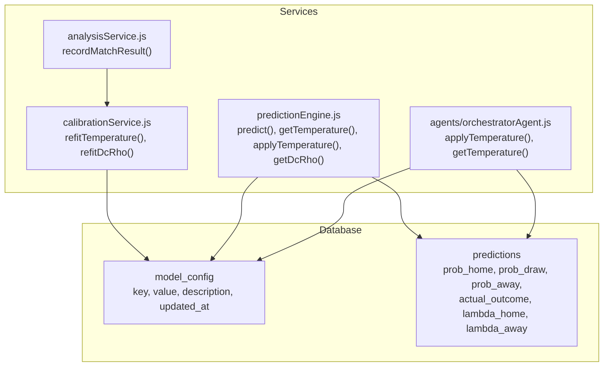
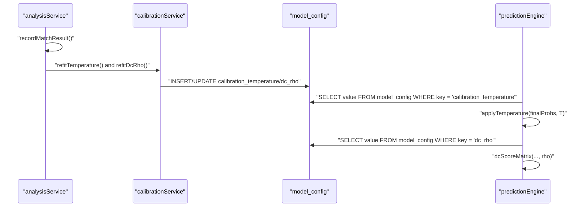
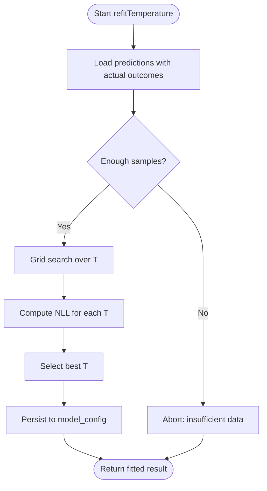
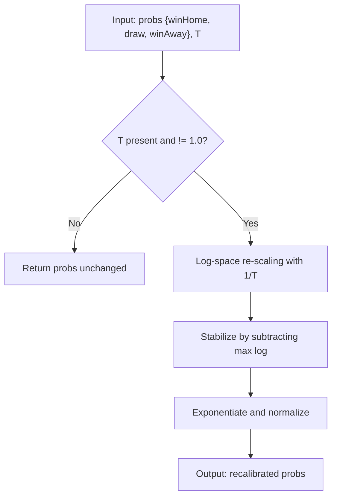
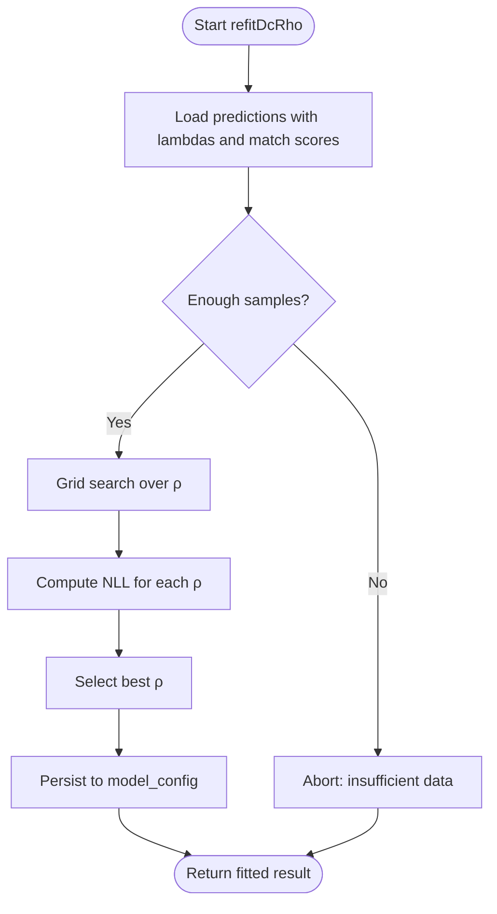
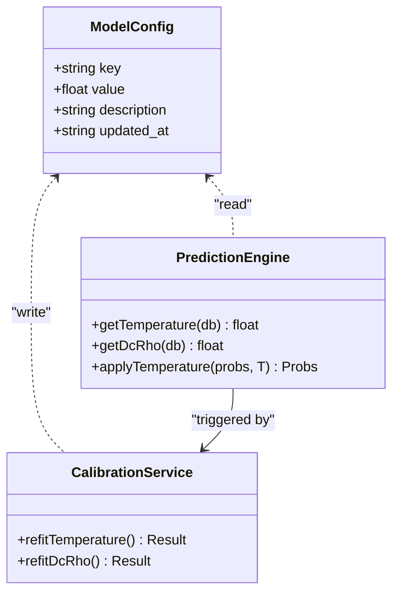
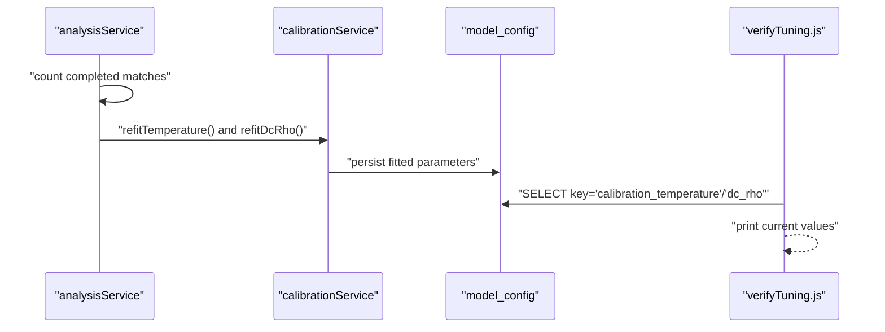
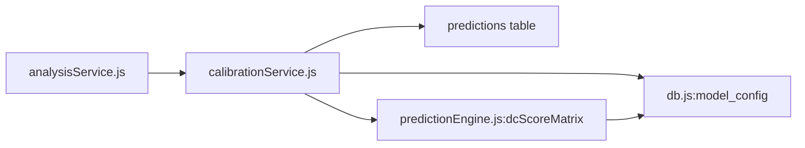

# Model Calibration and Temperature Scaling

<cite>
**Referenced Files in This Document**
- [calibrationService.js](file://backend/services/calibrationService.js)
- [analysisService.js](file://backend/services/analysisService.js)
- [predictionEngine.js](file://backend/services/predictionEngine.js)
- [db.js](file://backend/database/db.js)
- [orchestratorAgent.js](file://backend/services/agents/orchestratorAgent.js)
- [verifyTuning.js](file://backend/scripts/verifyTuning.js)
- [tuneV2.js](file://backend/scripts/tuneV2.js)
</cite>

## Table of Contents
1. [Introduction](#introduction)
2. [Project Structure](#project-structure)
3. [Core Components](#core-components)
4. [Architecture Overview](#architecture-overview)
5. [Detailed Component Analysis](#detailed-component-analysis)
6. [Dependency Analysis](#dependency-analysis)
7. [Performance Considerations](#performance-considerations)
8. [Troubleshooting Guide](#troubleshooting-guide)
9. [Conclusion](#conclusion)

## Introduction
This document explains the model calibration system used to improve prediction confidence reliability and accuracy. It covers:
- Temperature scaling to recalibrate output probabilities
- Storage and retrieval of calibration parameters in the model_config table
- Implementation of getTemperature and applyTemperature functions
- Dixon–Coles ρ parameter fitting for low-score correction
- Parameter optimization workflows and their impact on model performance

## Project Structure
The calibration system spans three primary areas:
- Database schema with model_config table for storing calibrated parameters
- Prediction engine that applies calibration during inference
- Analysis service that triggers periodic calibration updates

**Diagram sources**
- [db.js:160-165](file://backend/database/db.js#L160-L165)
- [predictionEngine.js:663-688](file://backend/services/predictionEngine.js#L663-L688)
- [calibrationService.js:53-82](file://backend/services/calibrationService.js#L53-L82)
- [analysisService.js:199-211](file://backend/services/analysisService.js#L199-L211)
- [orchestratorAgent.js:57-71](file://backend/services/agents/orchestratorAgent.js#L57-L71)

**Section sources**
- [db.js:160-165](file://backend/database/db.js#L160-L165)
- [predictionEngine.js:663-688](file://backend/services/predictionEngine.js#L663-L688)
- [calibrationService.js:53-82](file://backend/services/calibrationService.js#L53-L82)
- [analysisService.js:199-211](file://backend/services/analysisService.js#L199-L211)
- [orchestratorAgent.js:57-71](file://backend/services/agents/orchestratorAgent.js#L57-L71)

## Core Components
- model_config table: Stores calibrated parameters (e.g., calibration_temperature, dc_rho) with timestamps and descriptions.
- calibrationService: Periodically fits temperature scaling and Dixon–Coles ρ using historical predictions and outcomes.
- predictionEngine: Applies fitted parameters to adjust final prediction probabilities and scoreline matrices.
- analysisService: Triggers calibration updates after sufficient completed matches and computes performance metrics.

**Section sources**
- [db.js:160-165](file://backend/database/db.js#L160-L165)
- [calibrationService.js:18-27](file://backend/services/calibrationService.js#L18-L27)
- [predictionEngine.js:663-688](file://backend/services/predictionEngine.js#L663-L688)
- [analysisService.js:199-211](file://backend/services/analysisService.js#L199-L211)

## Architecture Overview
The calibration pipeline operates as follows:
- After each completed match, analysisService updates predictions and model_performance, then triggers calibration refits.
- calibrationService computes optimal temperature and ρ by minimizing negative log-likelihood on historical predictions.
- model_config persists the fitted parameters.
- predictionEngine loads the latest parameters and applies them to produce calibrated probabilities.

**Diagram sources**
- [analysisService.js:199-211](file://backend/services/analysisService.js#L199-L211)
- [calibrationService.js:53-82](file://backend/services/calibrationService.js#L53-L82)
- [calibrationService.js:88-129](file://backend/services/calibrationService.js#L88-L129)
- [db.js:160-165](file://backend/database/db.js#L160-L165)
- [predictionEngine.js:663-688](file://backend/services/predictionEngine.js#L663-L688)

## Detailed Component Analysis

### Temperature Scaling Calibration
Temperature scaling adjusts output probabilities by applying a power transform in log-space, controlled by the parameter T:
- T > 1 softens probabilities (less confident)
- T < 1 sharpens probabilities (more confident)
- The optimal T is found by grid-search minimizing negative log-likelihood on historical predictions.

Implementation highlights:
- Grid search bounds and steps define resolution and range for T.
- Softmax re-scaling in log-space prevents numerical overflow.
- Fitted T is persisted to model_config and loaded at inference time.

**Diagram sources**
- [calibrationService.js:53-82](file://backend/services/calibrationService.js#L53-L82)
- [calibrationService.js:28-51](file://backend/services/calibrationService.js#L28-L51)

**Section sources**
- [calibrationService.js:18-27](file://backend/services/calibrationService.js#L18-L27)
- [calibrationService.js:28-51](file://backend/services/calibrationService.js#L28-L51)
- [calibrationService.js:53-82](file://backend/services/calibrationService.js#L53-L82)

### Probability Recalibration Functions
Two functions implement the temperature application:
- getTemperature: Loads the latest calibration_temperature from model_config, defaulting to 1.0.
- applyTemperature: Re-normalizes probabilities in log-space using 1/T scaling.

**Diagram sources**
- [predictionEngine.js:663-688](file://backend/services/predictionEngine.js#L663-L688)
- [orchestratorAgent.js:57-66](file://backend/services/agents/orchestratorAgent.js#L57-L66)

**Section sources**
- [predictionEngine.js:663-688](file://backend/services/predictionEngine.js#L663-L688)
- [orchestratorAgent.js:57-66](file://backend/services/agents/orchestratorAgent.js#L57-L66)

### Dixon–Coles ρ Calibration
Low-score correction improves accuracy for 0–0, 1–0, 0–1, and 1–1 outcomes using the Dixon–Coles τ function. The ρ parameter is optimized by maximizing likelihood over observed scorelines:
- Grid search over ρ with bounds and step size
- Uses stored lambda_home and lambda_away from predictions
- Persists best ρ to model_config

**Diagram sources**
- [calibrationService.js:88-129](file://backend/services/calibrationService.js#L88-L129)
- [predictionEngine.js:151-163](file://backend/services/predictionEngine.js#L151-L163)

**Section sources**
- [calibrationService.js:23-26](file://backend/services/calibrationService.js#L23-L26)
- [calibrationService.js:88-129](file://backend/services/calibrationService.js#L88-L129)
- [predictionEngine.js:151-163](file://backend/services/predictionEngine.js#L151-L163)

### Runtime Parameter Loading and Application
- model_config table stores calibration_temperature and dc_rho with descriptions and timestamps.
- predictionEngine retrieves parameters at runtime and applies them:
  - getTemperature: loads T for probability recalibration
  - getDcRho: loads ρ for scoreline matrix construction
- Both functions gracefully handle missing values by falling back to defaults.

**Diagram sources**
- [db.js:160-165](file://backend/database/db.js#L160-L165)
- [predictionEngine.js:663-688](file://backend/services/predictionEngine.js#L663-L688)
- [calibrationService.js:53-82](file://backend/services/calibrationService.js#L53-L82)
- [calibrationService.js:88-129](file://backend/services/calibrationService.js#L88-L129)

**Section sources**
- [db.js:160-165](file://backend/database/db.js#L160-L165)
- [predictionEngine.js:663-688](file://backend/services/predictionEngine.js#L663-L688)
- [calibrationService.js:53-82](file://backend/services/calibrationService.js#L53-L82)
- [calibrationService.js:88-129](file://backend/services/calibrationService.js#L88-L129)

### Parameter Optimization Workflows
- Triggering: analysisService checks cumulative completed matches and triggers refitTemperature and refitDcRho every 10 matches beyond 20.
- Fitting: calibrationService performs grid search over predefined ranges and step sizes.
- Persistence: fitted parameters are inserted/upserted into model_config with updated timestamps.
- Verification: scripts read model_config to report current calibration parameters.

**Diagram sources**
- [analysisService.js:199-211](file://backend/services/analysisService.js#L199-L211)
- [calibrationService.js:53-82](file://backend/services/calibrationService.js#L53-L82)
- [calibrationService.js:88-129](file://backend/services/calibrationService.js#L88-L129)
- [verifyTuning.js:155-162](file://backend/scripts/verifyTuning.js#L155-L162)

**Section sources**
- [analysisService.js:199-211](file://backend/services/analysisService.js#L199-L211)
- [calibrationService.js:53-82](file://backend/services/calibrationService.js#L53-L82)
- [calibrationService.js:88-129](file://backend/services/calibrationService.js#L88-L129)
- [verifyTuning.js:155-162](file://backend/scripts/verifyTuning.js#L155-L162)

### Relationship Between Calibration Parameters and Accuracy Improvements
- Temperature scaling improves probability calibration quality by aligning predicted confidence with empirical accuracy, reducing Brier score and log-loss.
- Dixon–Coles ρ correction reduces bias in low-scoring outcomes, improving scoreline distribution fit and downstream point-based accuracy.
- Backtesting scripts demonstrate how parameter sweeps identify favorable configurations for Brier score and accuracy.

**Section sources**
- [analysisService.js:63-71](file://backend/services/analysisService.js#L63-L71)
- [tuneV2.js:16-55](file://backend/scripts/tuneV2.js#L16-L55)

## Dependency Analysis
- calibrationService depends on:
  - model_config schema for persistence
  - predictions table for historical data
  - predictionEngine.dcScoreMatrix for ρ fitting
- predictionEngine depends on:
  - model_config for runtime parameters
  - predictions for lambda_home and lambda_away (when available)
- analysisService coordinates triggering of calibration updates.

**Diagram sources**
- [calibrationService.js:15-16](file://backend/services/calibrationService.js#L15-L16)
- [db.js:160-165](file://backend/database/db.js#L160-L165)
- [predictionEngine.js:151-163](file://backend/services/predictionEngine.js#L151-L163)
- [analysisService.js:16-16](file://backend/services/analysisService.js#L16-L16)

**Section sources**
- [calibrationService.js:15-16](file://backend/services/calibrationService.js#L15-L16)
- [db.js:160-165](file://backend/database/db.js#L160-L165)
- [predictionEngine.js:151-163](file://backend/services/predictionEngine.js#L151-L163)
- [analysisService.js:16-16](file://backend/services/analysisService.js#L16-L16)

## Performance Considerations
- Grid search resolutions balance accuracy and computational cost; adjust T_STEPS and RHO_STEPS judiciously.
- Numerical stability: log-space re-scaling and small additive floors prevent overflow/underflow.
- Sampling thresholds ensure reliable estimates before updating parameters.

## Troubleshooting Guide
- Insufficient samples: Calibration aborts with reasons indicating minimum sample counts for T and ρ.
- Missing parameters: getTemperature/getDcRho fall back to safe defaults (1.0 for T, backbone DC_RHO for ρ).
- Parameter verification: Use verifyTuning script to confirm current values in model_config.

**Section sources**
- [calibrationService.js:61-63](file://backend/services/calibrationService.js#L61-L63)
- [calibrationService.js:103-105](file://backend/services/calibrationService.js#L103-L105)
- [predictionEngine.js:665-674](file://backend/services/predictionEngine.js#L665-L674)
- [verifyTuning.js:155-162](file://backend/scripts/verifyTuning.js#L155-L162)

## Conclusion
The calibration system integrates temperature scaling and Dixon–Coles ρ fitting into the prediction pipeline. By persisting fitted parameters to model_config and applying them at runtime, the model achieves improved probability calibration and more accurate scoreline distributions, validated through performance metrics and backtesting.