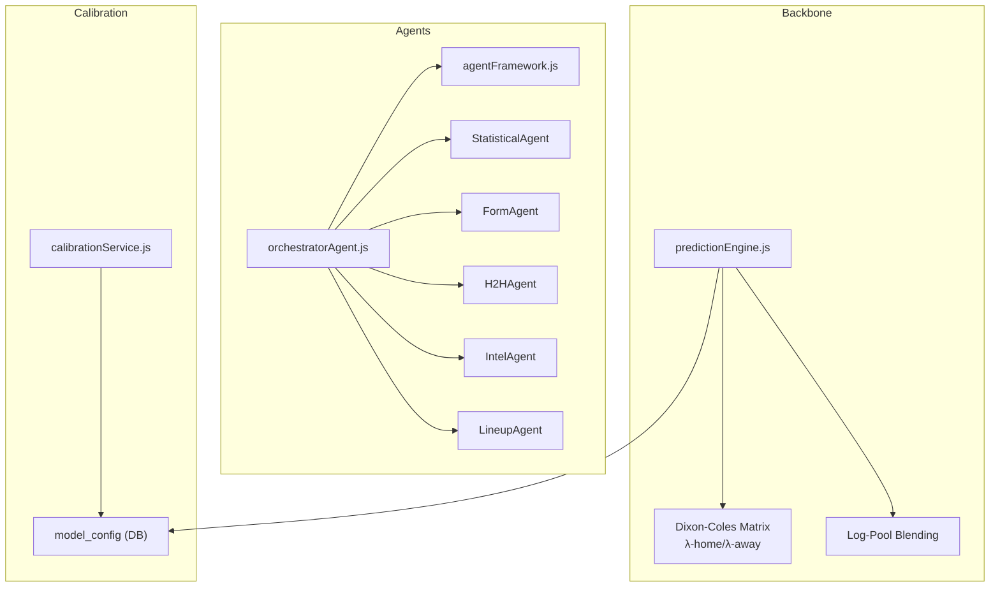
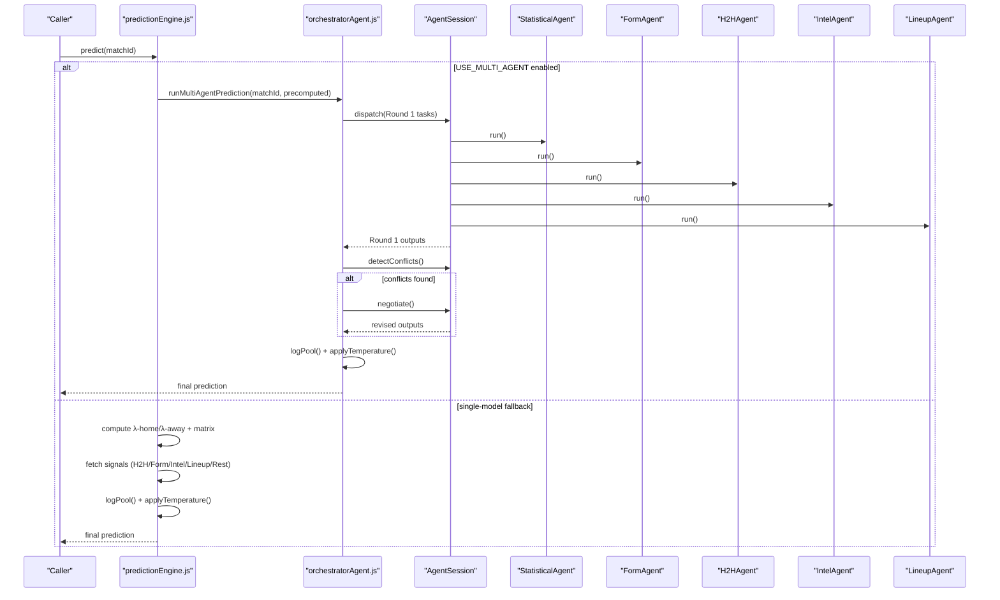
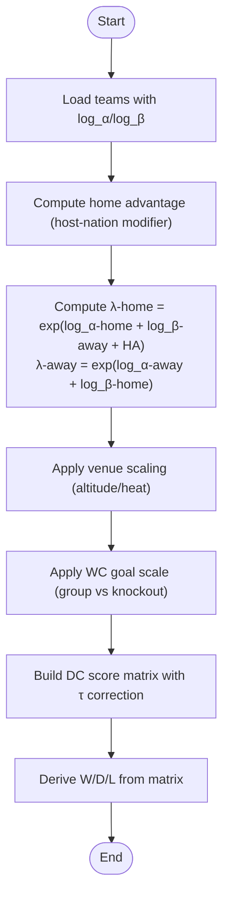
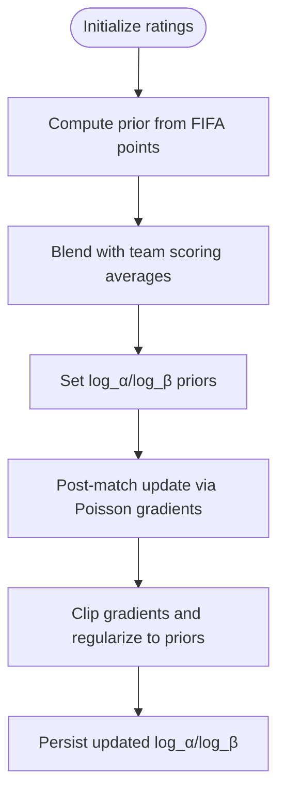
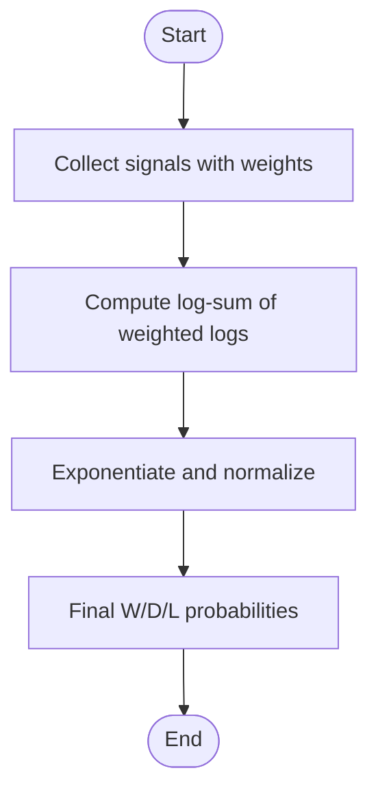
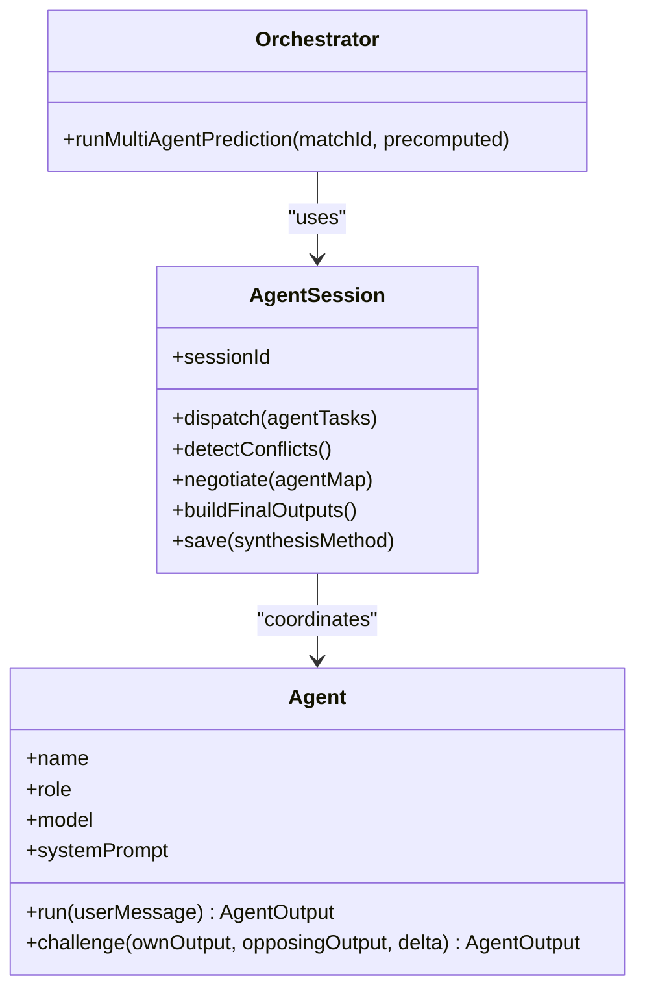
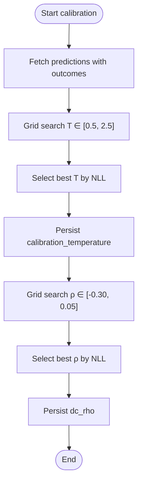
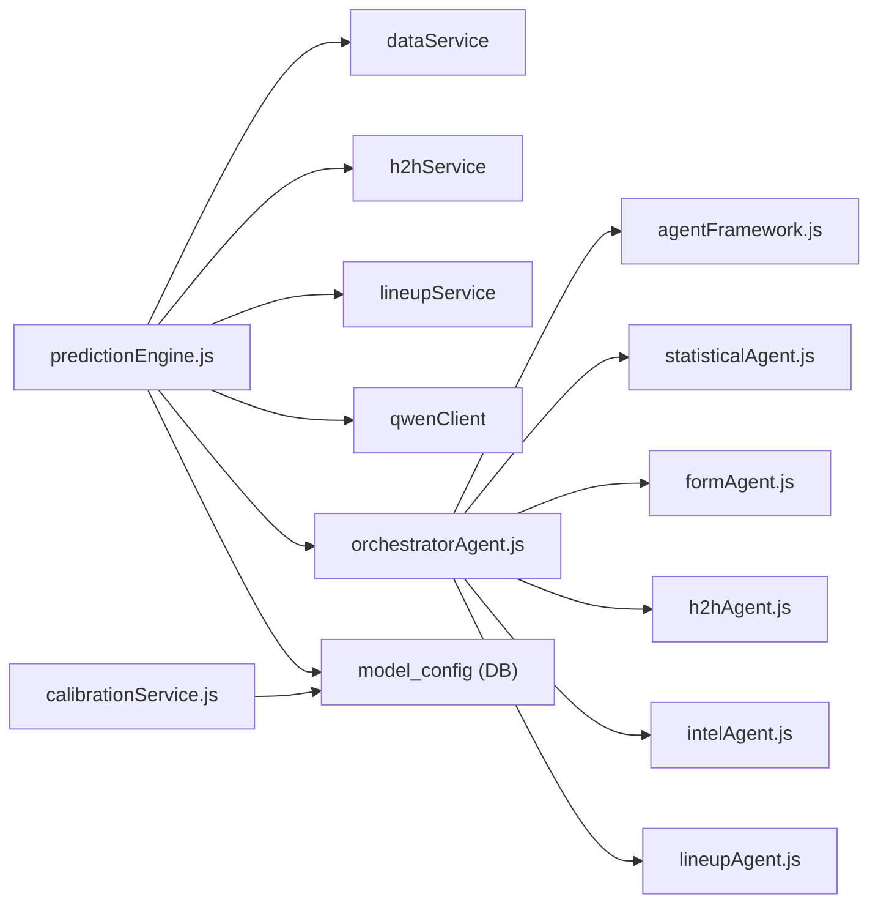

# Prediction Engine

<cite>
**Referenced Files in This Document**
- [predictionEngine.js](file://backend/services/predictionEngine.js)
- [agentFramework.js](file://backend/services/agents/agentFramework.js)
- [statisticalAgent.js](file://backend/services/agents/statisticalAgent.js)
- [formAgent.js](file://backend/services/agents/formAgent.js)
- [h2hAgent.js](file://backend/services/agents/h2hAgent.js)
- [intelAgent.js](file://backend/services/agents/intelAgent.js)
- [lineupAgent.js](file://backend/services/agents/lineupAgent.js)
- [orchestratorAgent.js](file://backend/services/agents/orchestratorAgent.js)
- [calibrationService.js](file://backend/services/calibrationService.js)
- [db.js](file://backend/database/db.js)
- [README.md](file://README.md)
- [SPEC-PREDICT.md](file://specs/SPEC-PREDICT.md)
</cite>

## Table of Contents
1. [Introduction](#introduction)
2. [Project Structure](#project-structure)
3. [Core Components](#core-components)
4. [Architecture Overview](#architecture-overview)
5. [Detailed Component Analysis](#detailed-component-analysis)
6. [Dependency Analysis](#dependency-analysis)
7. [Performance Considerations](#performance-considerations)
8. [Troubleshooting Guide](#troubleshooting-guide)
9. [Conclusion](#conclusion)
10. [Appendices](#appendices)

## Introduction
This document explains the World Cup 2026 Prediction Engine, focusing on the Dixon-Coles bivariate Poisson backbone, λ (lambda) attack/defense parameters, ELO ratings integration, and α/β ratings initialization. It documents the log-pool probability blending technique for combining multiple prediction sources, the multi-agent system with five specialized agents (Statistical, Form, H2H, Intel, and Lineup), the agent negotiation protocol with conflict detection thresholds, rebuttal rounds, and weight adjustment mechanisms. It also covers the single-model fallback system, calibration via temperature scaling and Dixon-Coles ρ refitting, and model accuracy tracking and performance monitoring.

## Project Structure
The prediction engine spans backend services, agent modules, and database schema:
- Prediction backbone and blending: [predictionEngine.js](file://backend/services/predictionEngine.js)
- Multi-agent framework and negotiation: [agentFramework.js](file://backend/services/agents/agentFramework.js), [orchestratorAgent.js](file://backend/services/agents/orchestratorAgent.js)
- Specialized agents: [statisticalAgent.js](file://backend/services/agents/statisticalAgent.js), [formAgent.js](file://backend/services/agents/formAgent.js), [h2hAgent.js](file://backend/services/agents/h2hAgent.js), [intelAgent.js](file://backend/services/agents/intelAgent.js), [lineupAgent.js](file://backend/services/agents/lineupAgent.js)
- Calibration and model config: [calibrationService.js](file://backend/services/calibrationService.js), [db.js](file://backend/database/db.js)
- Product and feature context: [README.md](file://README.md), [SPEC-PREDICT.md](file://specs/SPEC-PREDICT.md)

**Diagram sources**
- [predictionEngine.js:135-163](file://backend/services/predictionEngine.js#L135-L163)
- [agentFramework.js:1-50](file://backend/services/agents/agentFramework.js#L1-L50)
- [orchestratorAgent.js:309-502](file://backend/services/agents/orchestratorAgent.js#L309-L502)
- [calibrationService.js:1-132](file://backend/services/calibrationService.js#L1-L132)
- [db.js:160-249](file://backend/database/db.js#L160-L249)

**Section sources**
- [README.md:1-263](file://README.md#L1-L263)
- [SPEC-PREDICT.md:1-147](file://specs/SPEC-PREDICT.md#L1-L147)

## Core Components
- Dixon-Coles bivariate Poisson backbone with λ-home and λ-away computation, low-score correction τ, and scoreline matrix normalization.
- λ parameterization via ELO and α/β ratings: λ-home = exp(log_α-home + log_β-away + home_adv), λ-away = exp(log_α-away + log_β-home).
- Signal weights and log-pool blending: W/D/L vectors from multiple sources combined via geometric mean raised to per-signal exponents, then normalized.
- Multi-agent orchestration: parallel Round 1, conflict detection (Δ ≥ 20%), Round 2 rebuttal, and weight adjustments.
- Calibration: temperature scaling for output probabilities and Dixon-Coles ρ refit on observed scorelines.
- Accuracy tracking: model_performance table and predictions with correctness flags and Brier scores.

**Section sources**
- [predictionEngine.js:67-100](file://backend/services/predictionEngine.js#L67-L100)
- [predictionEngine.js:135-163](file://backend/services/predictionEngine.js#L135-L163)
- [predictionEngine.js:214-238](file://backend/services/predictionEngine.js#L214-L238)
- [agentFramework.js:19-35](file://backend/services/agents/agentFramework.js#L19-L35)
- [calibrationService.js:1-132](file://backend/services/calibrationService.js#L1-L132)
- [db.js:96-110](file://backend/database/db.js#L96-L110)

## Architecture Overview
The system supports two operational modes:
- Single-model mode: pure Dixon-Coles backbone with form/intel goal nudges and W/D/L-only signals blended via log-pool.
- Multi-agent mode: same backbone precomputed, then five agents interpret and assess signals, negotiate conflicts, and produce a final blended prediction.

**Diagram sources**
- [predictionEngine.js:691-922](file://backend/services/predictionEngine.js#L691-L922)
- [orchestratorAgent.js:309-502](file://backend/services/agents/orchestratorAgent.js#L309-L502)
- [agentFramework.js:350-503](file://backend/services/agents/agentFramework.js#L350-L503)

**Section sources**
- [predictionEngine.js:56-61](file://backend/services/predictionEngine.js#L56-L61)
- [predictionEngine.js:729-755](file://backend/services/predictionEngine.js#L729-L755)
- [README.md:18-105](file://README.md#L18-L105)

## Detailed Component Analysis

### Dixon-Coles Poisson Backbonne and λ Parameters
- λ-home and λ-away are derived from log_α (attack) and log_β (defence) parameters plus home advantage. λ values are scaled by venue conditions and tournament phase.
- The scoreline matrix uses the bivariate Poisson with Dixon-Coles τ correction for low scores to address over-dispersion typical in football scoring.
- Outcome probabilities are derived from the normalized matrix.

**Diagram sources**
- [predictionEngine.js:135-163](file://backend/services/predictionEngine.js#L135-L163)
- [predictionEngine.js:205-212](file://backend/services/predictionEngine.js#L205-L212)
- [predictionEngine.js:87-90](file://backend/services/predictionEngine.js#L87-L90)

**Section sources**
- [predictionEngine.js:67-83](file://backend/services/predictionEngine.js#L67-L83)
- [predictionEngine.js:135-163](file://backend/services/predictionEngine.js#L135-L163)
- [predictionEngine.js:205-212](file://backend/services/predictionEngine.js#L205-L212)

### ELO Ratings Integration and α/β Initialization
- ELO contributes to the statistical interpretation and historical weighting in agents.
- α and β ratings are initialized from FIFA points and per-team scoring averages, then updated post-match using a regularized Poisson gradient step with clipping and regularization.

**Diagram sources**
- [predictionEngine.js:177-203](file://backend/services/predictionEngine.js#L177-L203)
- [predictionEngine.js:927-989](file://backend/services/predictionEngine.js#L927-L989)

**Section sources**
- [predictionEngine.js:177-203](file://backend/services/predictionEngine.js#L177-L203)
- [predictionEngine.js:927-989](file://backend/services/predictionEngine.js#L927-L989)

### Log-Pool Probability Blending
- Each signal produces a W/D/L probability vector. The final probabilities are proportional to the geometric mean of individual probabilities raised to per-signal exponents, then normalized.
- Weights include BACKBONE, H2H, FORM, INTEL, LINEUP, and REST.

**Diagram sources**
- [predictionEngine.js:214-238](file://backend/services/predictionEngine.js#L214-L238)
- [predictionEngine.js:92-100](file://backend/services/predictionEngine.js#L92-L100)

**Section sources**
- [predictionEngine.js:214-238](file://backend/services/predictionEngine.js#L214-L238)
- [predictionEngine.js:835-846](file://backend/services/predictionEngine.js#L835-L846)

### Multi-Agent System and Negotiation Protocol
- Five agents interpret different aspects of the match:
  - Statistical: λ, ELO, α/β, venue/home advantage.
  - Form: last 10 matches with competition weighting.
  - H2H: real head-to-head record (skips if <2 meetings).
  - Intel: injuries, motivation, rotation from web intel.
  - Lineup: confirmed starting XI (~60–75 min before KO).
- Conflict detection: pairwise max probability delta ≥ 20% triggers negotiation.
- Round 2: agents challenge each other; the agent that moved less “wins,” gaining 1.3× weight, the loser’s weight becomes 0.6×.
- Final blend: log-pool of agent outputs with adjusted weights.

**Diagram sources**
- [agentFramework.js:211-330](file://backend/services/agents/agentFramework.js#L211-L330)
- [agentFramework.js:336-572](file://backend/services/agents/agentFramework.js#L336-L572)
- [orchestratorAgent.js:309-502](file://backend/services/agents/orchestratorAgent.js#L309-L502)

**Section sources**
- [agentFramework.js:19-35](file://backend/services/agents/agentFramework.js#L19-L35)
- [agentFramework.js:376-404](file://backend/services/agents/agentFramework.js#L376-L404)
- [agentFramework.js:406-445](file://backend/services/agents/agentFramework.js#L406-L445)
- [agentFramework.js:447-503](file://backend/services/agents/agentFramework.js#L447-L503)
- [orchestratorAgent.js:309-502](file://backend/services/agents/orchestratorAgent.js#L309-L502)

### Single-Model Fallback System
- When multi-agent is disabled, the engine computes λ-home/λ-away from the backbone, fetches W/D/L-only signals (H2H, Form, Intel, Lineup availability, Rest days), blends via log-pool, and applies temperature scaling.
- Insight generation uses a template fallback when LLM is unavailable.

**Section sources**
- [predictionEngine.js:729-755](file://backend/services/predictionEngine.js#L729-L755)
- [predictionEngine.js:835-846](file://backend/services/predictionEngine.js#L835-L846)
- [predictionEngine.js:585-661](file://backend/services/predictionEngine.js#L585-L661)

### Calibration Service: Temperature Scaling and Dixon-Coles ρ Refit
- Temperature scaling: minimize negative log-likelihood over stored predictions to find optimal T.
- Dixon-Coles ρ refit: maximize likelihood over observed scorelines using stored λ-home/λ-away to refine τ.
- Values are persisted to model_config for production use.

**Diagram sources**
- [calibrationService.js:53-82](file://backend/services/calibrationService.js#L53-L82)
- [calibrationService.js:88-129](file://backend/services/calibrationService.js#L88-L129)

**Section sources**
- [calibrationService.js:1-132](file://backend/services/calibrationService.js#L1-L132)
- [db.js:160-165](file://backend/database/db.js#L160-L165)

### Model Accuracy Tracking and Performance Monitoring
- Predictions include correctness flags and Brier scores; model_performance tracks outcomes, confidence tiers, and points under the 3/2/2/1/0 scoring rule.
- The Predictions page surfaces accuracy metrics and allows filtering by status and group.

**Section sources**
- [db.js:96-110](file://backend/database/db.js#L96-L110)
- [SPEC-PREDICT.md:28-51](file://specs/SPEC-PREDICT.md#L28-L51)

## Dependency Analysis
- predictionEngine depends on:
  - data services for form and intel
  - h2hService for head-to-head probabilities
  - lineupService for lineup-derived probabilities
  - qwenClient for insight generation
  - orchestratorAgent for multi-agent mode
- agentFramework defines the shared negotiation protocol and JSON schema for agent outputs.
- calibrationService reads from predictions and writes to model_config.

**Diagram sources**
- [predictionEngine.js:37-43](file://backend/services/predictionEngine.js#L37-L43)
- [orchestratorAgent.js:28-37](file://backend/services/agents/orchestratorAgent.js#L28-L37)
- [agentFramework.js:27-29](file://backend/services/agents/agentFramework.js#L27-L29)
- [calibrationService.js:15-16](file://backend/services/calibrationService.js#L15-L16)
- [db.js:160-165](file://backend/database/db.js#L160-L165)

**Section sources**
- [predictionEngine.js:37-43](file://backend/services/predictionEngine.js#L37-L43)
- [orchestratorAgent.js:28-37](file://backend/services/agents/orchestratorAgent.js#L28-L37)
- [agentFramework.js:27-29](file://backend/services/agents/agentFramework.js#L27-L29)
- [calibrationService.js:15-16](file://backend/services/calibrationService.js#L15-L16)
- [db.js:160-165](file://backend/database/db.js#L160-L165)

## Performance Considerations
- Multi-agent mode: parallel Round 1 dispatch reduces latency; negotiation adds overhead but improves robustness.
- Log-pool blending preserves confidence better than arithmetic averaging, reducing over-shrinking of extreme probabilities.
- Temperature scaling and ρ refit improve calibration on observed outcomes.
- Venue and phase scaling adjust λ expectations to tournament context, improving match-specific accuracy.

[No sources needed since this section provides general guidance]

## Troubleshooting Guide
- JSON parsing failures: agentFramework sanitizes and retries; outputs fall back to uniform priors with flags.
- LLM call failures: agents return Round 1 outputs unchanged in Round 2; orchestrator continues with available results.
- Missing signals: H2H requires ≥2 meetings; Lineup agent skips when unavailable; Rest days only applies when ≥1 day difference.
- Calibration not updating: requires minimum samples and appropriate thresholds.

**Section sources**
- [agentFramework.js:56-100](file://backend/services/agents/agentFramework.js#L56-L100)
- [agentFramework.js:122-156](file://backend/services/agents/agentFramework.js#L122-L156)
- [agentFramework.js:282-329](file://backend/services/agents/agentFramework.js#L282-L329)
- [h2hAgent.js:38-45](file://backend/services/agents/h2hAgent.js#L38-L45)
- [lineupAgent.js:44-51](file://backend/services/agents/lineupAgent.js#L44-L51)
- [calibrationService.js:53-82](file://backend/services/calibrationService.js#L53-L82)

## Conclusion
The Prediction Engine combines a robust Dixon-Coles Poisson backbone with ELO and α/β ratings, integrates multiple complementary signals via log-pool blending, and leverages a multi-agent negotiation protocol to produce calibrated, explainable match forecasts. The single-model fallback ensures fast operation when multi-agent is disabled, while calibration and performance tracking enable continuous refinement.

[No sources needed since this section summarizes without analyzing specific files]

## Appendices

### Mathematical Definitions and Algorithms
- Dixon-Coles τ correction:
  - τ(0,0) = 1 − λH λA ρ
  - τ(0,1) = 1 + λH ρ
  - τ(1,0) = 1 + λA ρ
  - τ(1,1) = 1 − ρ
- Poisson PMF: P(k; λ) ∝ e^−λ λ^k / k!
- Log-pool blending: p_final ∝ ∏ p_i^w_i, normalized.
- Confidence tiers: max probability thresholds define Very High, High, Medium, Low.

**Section sources**
- [predictionEngine.js:143-149](file://backend/services/predictionEngine.js#L143-L149)
- [predictionEngine.js:136-141](file://backend/services/predictionEngine.js#L136-L141)
- [predictionEngine.js:214-238](file://backend/services/predictionEngine.js#L214-L238)
- [predictionEngine.js:365-371](file://backend/services/predictionEngine.js#L365-L371)

### Example Prediction Outputs
- Win/Draw/Away probabilities, expected score, most likely and top-3 scorelines, confidence tier, methodology attribution, and factors list.
- Example insight: analyst commentary synthesizing top factors and outcomes.

**Section sources**
- [predictionEngine.js:861-882](file://backend/services/predictionEngine.js#L861-L882)
- [predictionEngine.js:585-661](file://backend/services/predictionEngine.js#L585-L661)
- [SPEC-PREDICT.md:96-98](file://specs/SPEC-PREDICT.md#L96-L98)