# Prediction Engine

<cite>
**Referenced Files in This Document**
- [predictionEngine.js](file://backend/services/predictionEngine.js)
- [calibrationService.js](file://backend/services/calibrationService.js)
- [agentFramework.js](file://backend/services/agents/agentFramework.js)
- [orchestratorAgent.js](file://backend/services/agents/orchestratorAgent.js)
- [statisticalAgent.js](file://backend/services/agents/statisticalAgent.js)
- [formAgent.js](file://backend/services/agents/formAgent.js)
- [h2hAgent.js](file://backend/services/agents/h2hAgent.js)
- [intelAgent.js](file://backend/services/agents/intelAgent.js)
- [lineupAgent.js](file://backend/services/agents/lineupAgent.js)
- [qwenClient.js](file://backend/services/qwenClient.js)
- [dataService.js](file://backend/services/dataService.js)
- [lineupService.js](file://backend/services/lineupService.js)
- [h2hService.js](file://backend/services/h2hService.js)
- [analysisService.js](file://backend/services/analysisService.js)
- [db.js](file://backend/database/db.js)
</cite>

## Table of Contents
1. [Introduction](#introduction)
2. [Project Structure](#project-structure)
3. [Core Components](#core-components)
4. [Architecture Overview](#architecture-overview)
5. [Detailed Component Analysis](#detailed-component-analysis)
6. [Dependency Analysis](#dependency-analysis)
7. [Performance Considerations](#performance-considerations)
8. [Troubleshooting Guide](#troubleshooting-guide)
9. [Conclusion](#conclusion)
10. [Appendices](#appendices)

## Introduction
This document describes the prediction engine system powering match outcome forecasts for the 2026 FIFA World Cup. It explains the Dixon-Coles bivariate Poisson backbone, temperature scaling for probability calibration, and ensemble prediction blending. It documents the multi-agent coordination workflow, conflict detection and negotiation protocols, and the agent framework design. It also covers session management, audit trails, and methodology tracking, along with fallback mechanisms when AI features are disabled and integration with external data sources.

## Project Structure
The prediction engine spans several backend services:
- Core prediction logic and blending: predictionEngine.js
- Calibration and tuning: calibrationService.js
- Multi-agent orchestration and agents: agentFramework.js, orchestratorAgent.js, and specialized agents
- Data acquisition and caching: dataService.js, lineupService.js, h2hService.js
- LLM client: qwenClient.js
- Analytics and learning: analysisService.js
- Database schema and migrations: db.js

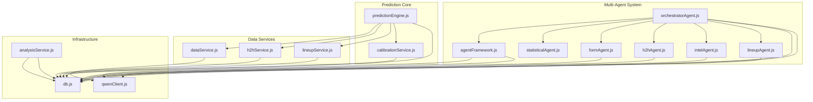

**Diagram sources**
- [predictionEngine.js:1-1020](file://backend/services/predictionEngine.js#L1-L1020)
- [calibrationService.js:1-132](file://backend/services/calibrationService.js#L1-L132)
- [agentFramework.js:1-576](file://backend/services/agents/agentFramework.js#L1-L576)
- [orchestratorAgent.js:1-471](file://backend/services/agents/orchestratorAgent.js#L1-L471)
- [statisticalAgent.js:1-98](file://backend/services/agents/statisticalAgent.js#L1-L98)
- [formAgent.js:1-113](file://backend/services/agents/formAgent.js#L1-L113)
- [h2hAgent.js:1-107](file://backend/services/agents/h2hAgent.js#L1-L107)
- [intelAgent.js:1-126](file://backend/services/agents/intelAgent.js#L1-L126)
- [lineupAgent.js:1-118](file://backend/services/agents/lineupAgent.js#L1-L118)
- [qwenClient.js:1-123](file://backend/services/qwenClient.js#L1-L123)
- [dataService.js:1-583](file://backend/services/dataService.js#L1-L583)
- [lineupService.js:1-425](file://backend/services/lineupService.js#L1-L425)
- [h2hService.js:1-315](file://backend/services/h2hService.js#L1-L315)
- [analysisService.js:1-422](file://backend/services/analysisService.js#L1-L422)
- [db.js:1-252](file://backend/database/db.js#L1-L252)

**Section sources**
- [predictionEngine.js:1-1020](file://backend/services/predictionEngine.js#L1-L1020)
- [agentFramework.js:1-576](file://backend/services/agents/agentFramework.js#L1-L576)
- [orchestratorAgent.js:1-471](file://backend/services/agents/orchestratorAgent.js#L1-L471)
- [db.js:1-252](file://backend/database/db.js#L1-L252)

## Core Components
- Dixon-Coles bivariate Poisson backbone: computes lambda-home and lambda-away from attack/defense ratings, home advantage, venue effects, and tournament-phase scaling; builds a scoreline matrix with low-score correction; derives outcome probabilities and expected goals.
- Adjustment signals: head-to-head, recent form, pre-match intelligence, confirmed lineup, and rest-days factors are blended via log-pool weighting.
- Temperature scaling: applies calibration to output probabilities using a tunable temperature parameter.
- Multi-agent orchestration: parallel agent runs, conflict detection, negotiation, and final weighted blending.
- Session management and audit trail: persistent logs of agent sessions, messages, conflicts, and resolutions.
- Data acquisition: live feeds, web scraping, and caching for form, H2H, intelligence, and lineups.
- Learning and calibration: post-match analysis, Brier scoring, and periodic refit of temperature and Dixon-Coles rho.

**Section sources**
- [predictionEngine.js:1-1020](file://backend/services/predictionEngine.js#L1-L1020)
- [calibrationService.js:1-132](file://backend/services/calibrationService.js#L1-L132)
- [agentFramework.js:1-576](file://backend/services/agents/agentFramework.js#L1-L576)
- [orchestratorAgent.js:1-471](file://backend/services/agents/orchestratorAgent.js#L1-L471)
- [analysisService.js:1-422](file://backend/services/analysisService.js#L1-L422)

## Architecture Overview
The system supports two prediction modes:
- Single-agent mode: predictionEngine.js computes the backbone, collects domain signals, blends via log-pool, applies temperature scaling, and saves results.
- Multi-agent mode: orchestratorAgent.js coordinates agents, detects conflicts, negotiates, merges outputs, applies temperature scaling, and persists sessions and results.

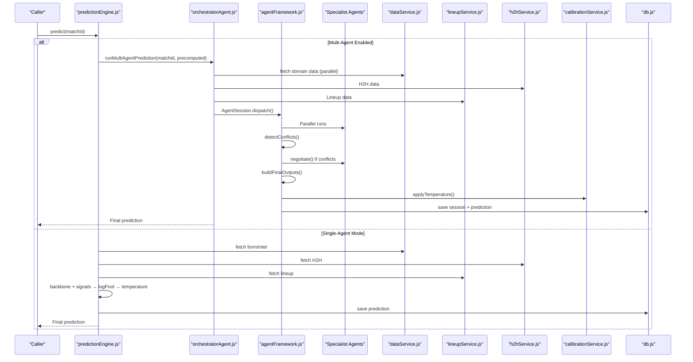

**Diagram sources**
- [predictionEngine.js:665-896](file://backend/services/predictionEngine.js#L665-L896)
- [orchestratorAgent.js:288-468](file://backend/services/agents/orchestratorAgent.js#L288-L468)
- [agentFramework.js:345-561](file://backend/services/agents/agentFramework.js#L345-L561)
- [calibrationService.js:53-82](file://backend/services/calibrationService.js#L53-L82)
- [dataService.js:68-133](file://backend/services/dataService.js#L68-L133)
- [lineupService.js:221-362](file://backend/services/lineupService.js#L221-L362)
- [h2hService.js:272-312](file://backend/services/h2hService.js#L272-L312)

## Detailed Component Analysis

### Dixon-Coles Bivariate Poisson Backbon
- Lambda computation: combines team attack/defense logs, home advantage, venue scaling, and tournament-phase scaling.
- Low-score correction: applies Dixon-Coles tau function to correct for over-dispersion at low scores.
- Outcome and scoreline derivation: computes W/D/L from the matrix and selects top scorelines by expected points under the tournament scoring rule.

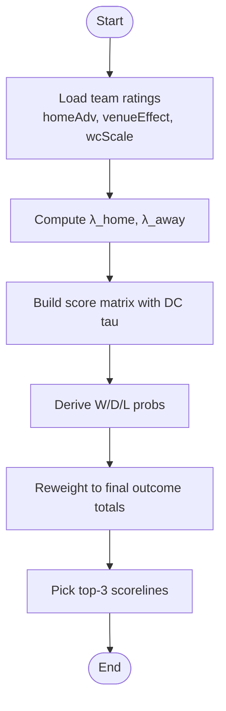

**Diagram sources**
- [predictionEngine.js:135-163](file://backend/services/predictionEngine.js#L135-L163)
- [predictionEngine.js:377-394](file://backend/services/predictionEngine.js#L377-L394)
- [predictionEngine.js:410-438](file://backend/services/predictionEngine.js#L410-L438)

**Section sources**
- [predictionEngine.js:67-134](file://backend/services/predictionEngine.js#L67-L134)
- [predictionEngine.js:135-163](file://backend/services/predictionEngine.js#L135-L163)
- [predictionEngine.js:377-394](file://backend/services/predictionEngine.js#L377-L394)
- [predictionEngine.js:410-438](file://backend/services/predictionEngine.js#L410-L438)

### Adjustment Signals and Log-Pool Blending
- Signal weights: backbone, H2H, form, intelligence, lineup, and rest-days.
- Goal-channel nudges: form and intelligence can adjust lambda before matrix building.
- Log-pool blending: geometric mean of probabilities raised to per-signal exponents, renormalized.

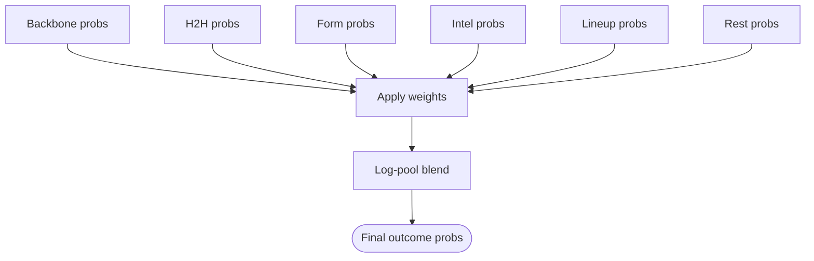

**Diagram sources**
- [predictionEngine.js:92-100](file://backend/services/predictionEngine.js#L92-L100)
- [predictionEngine.js:214-238](file://backend/services/predictionEngine.js#L214-L238)
- [predictionEngine.js:809-819](file://backend/services/predictionEngine.js#L809-L819)

**Section sources**
- [predictionEngine.js:240-362](file://backend/services/predictionEngine.js#L240-L362)
- [predictionEngine.js:214-238](file://backend/services/predictionEngine.js#L214-L238)
- [predictionEngine.js:809-819](file://backend/services/predictionEngine.js#L809-L819)

### Temperature Scaling for Probability Calibration
- Reads fitted temperature from model_config; defaults to 1.0 (no scaling).
- Applies softmax-like scaling with inverse temperature to calibrate output confidence.

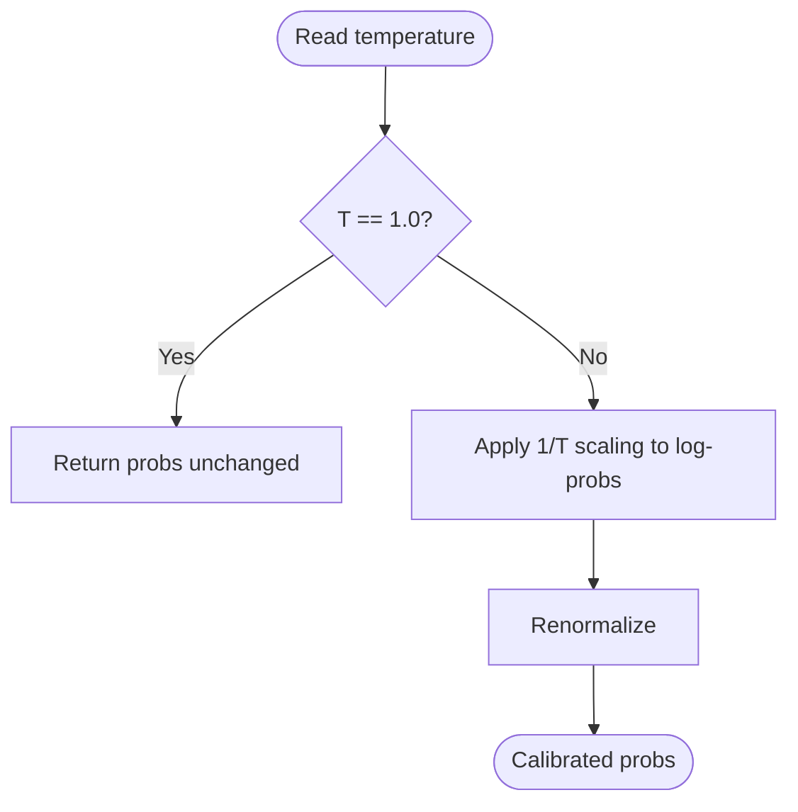

**Diagram sources**
- [calibrationService.js:639-648](file://backend/services/predictionEngine.js#L639-L648)
- [calibrationService.js:28-39](file://backend/services/calibrationService.js#L28-L39)
- [calibrationService.js:650-662](file://backend/services/predictionEngine.js#L650-L662)

**Section sources**
- [calibrationService.js:53-82](file://backend/services/calibrationService.js#L53-L82)
- [predictionEngine.js:637-662](file://backend/services/predictionEngine.js#L637-L662)

### Multi-Agent Coordination Workflow
- AgentSession manages lifecycle: dispatch, conflict detection, negotiation, final output assembly, and persistence.
- Conflict detection: pairwise comparison of max probability delta; thresholds trigger negotiation.
- Negotiation: agents challenge each other’s positions; the agent that moves less “wins” and gains a weight boost; the loser’s probability is replaced with their revised output.
- Final synthesis: log-pool blending of agent outputs with adjusted weights, followed by temperature scaling.

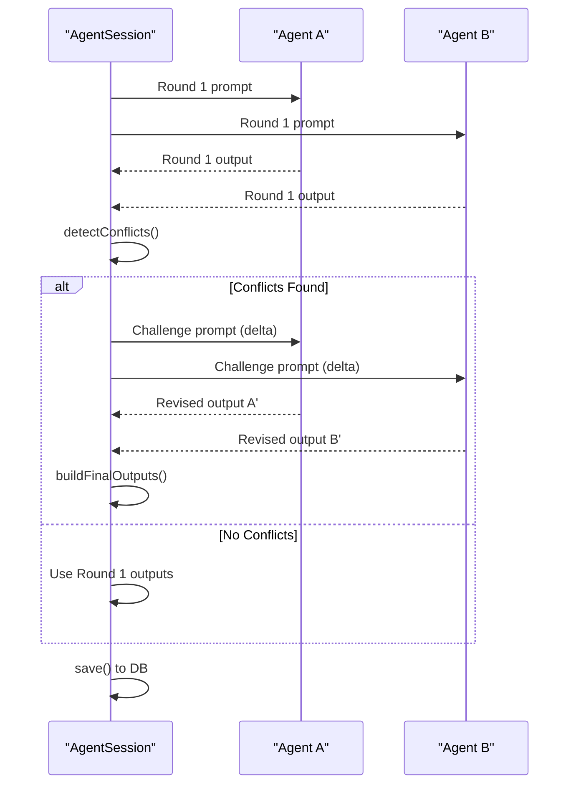

**Diagram sources**
- [agentFramework.js:345-561](file://backend/services/agents/agentFramework.js#L345-L561)
- [orchestratorAgent.js:367-468](file://backend/services/agents/orchestratorAgent.js#L367-L468)

**Section sources**
- [agentFramework.js:326-561](file://backend/services/agents/agentFramework.js#L326-L561)
- [orchestratorAgent.js:288-468](file://backend/services/agents/orchestratorAgent.js#L288-L468)

### Specialized Agents
- StatisticalAgent: interprets the backbone (lambda, ratings, venue) and flags anomalies.
- FormAgent: evaluates recent form with competition weighting and opponent quality.
- H2HAgent: uses a real historical dataset to derive weighted probabilities.
- IntelAgent: parses pre-match intelligence (injuries, motivation, rotation) and quantifies impact.
- LineupAgent: converts confirmed lineup strength into a high-weight probability adjustment.

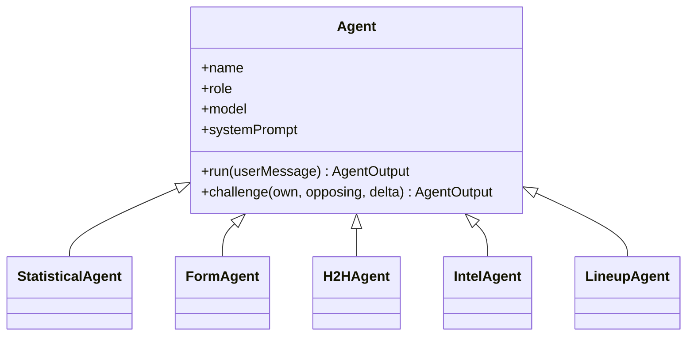

**Diagram sources**
- [agentFramework.js:201-320](file://backend/services/agents/agentFramework.js#L201-L320)
- [statisticalAgent.js:90-98](file://backend/services/agents/statisticalAgent.js#L90-L98)
- [formAgent.js:105-113](file://backend/services/agents/formAgent.js#L105-L113)
- [h2hAgent.js:99-107](file://backend/services/agents/h2hAgent.js#L99-L107)
- [intelAgent.js:118-126](file://backend/services/agents/intelAgent.js#L118-L126)
- [lineupAgent.js:110-118](file://backend/services/agents/lineupAgent.js#L110-L118)

**Section sources**
- [statisticalAgent.js:18-98](file://backend/services/agents/statisticalAgent.js#L18-L98)
- [formAgent.js:17-113](file://backend/services/agents/formAgent.js#L17-L113)
- [h2hAgent.js:18-107](file://backend/services/agents/h2hAgent.js#L18-L107)
- [intelAgent.js:20-126](file://backend/services/agents/intelAgent.js#L20-L126)
- [lineupAgent.js:18-118](file://backend/services/agents/lineupAgent.js#L18-L118)

### Session Management and Audit Trail
- AgentSession persists round 1 and round 2 messages, conflict detections and resolutions, and synthesis metadata.
- Database tables capture agent sessions, messages, conflicts, and prediction linkage to sessions.

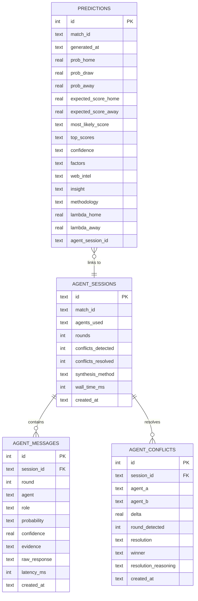

**Diagram sources**
- [db.js:167-207](file://backend/database/db.js#L167-L207)
- [agentFramework.js:500-561](file://backend/services/agents/agentFramework.js#L500-L561)
- [orchestratorAgent.js:242-272](file://backend/services/agents/orchestratorAgent.js#L242-L272)

**Section sources**
- [agentFramework.js:326-561](file://backend/services/agents/agentFramework.js#L326-L561)
- [db.js:167-207](file://backend/database/db.js#L167-L207)

### Data Acquisition and External Integrations
- Live results sync: fetches in-play and finished matches from an API, flips status to LIVE, and records final scores.
- Intelligence pipeline: web scraping of news, LLM extraction of structured intel, and anti-hallucination verification.
- Form and H2H: API-backed retrieval with fallbacks and seeding of large historical datasets.

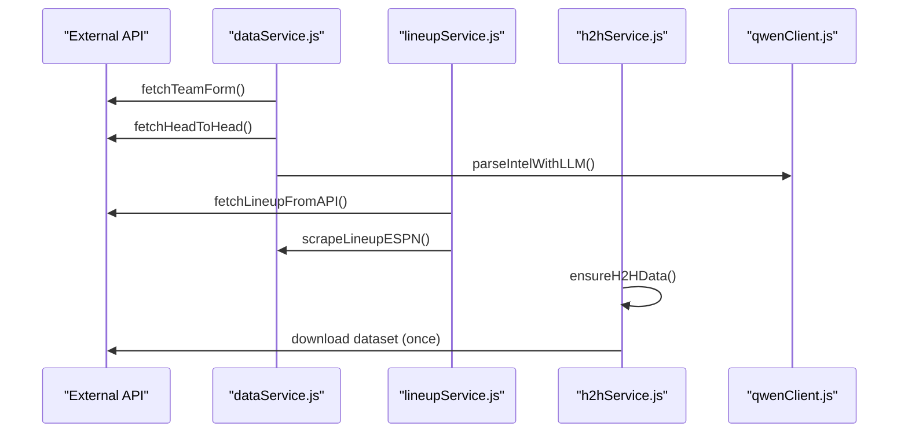

**Diagram sources**
- [dataService.js:68-133](file://backend/services/dataService.js#L68-L133)
- [dataService.js:190-265](file://backend/services/dataService.js#L190-L265)
- [dataService.js:413-490](file://backend/services/dataService.js#L413-L490)
- [lineupService.js:84-155](file://backend/services/lineupService.js#L84-L155)
- [h2hService.js:95-165](file://backend/services/h2hService.js#L95-L165)
- [qwenClient.js:53-101](file://backend/services/qwenClient.js#L53-L101)

**Section sources**
- [dataService.js:495-583](file://backend/services/dataService.js#L495-L583)
- [lineupService.js:221-362](file://backend/services/lineupService.js#L221-L362)
- [h2hService.js:272-312](file://backend/services/h2hService.js#L272-L312)

### Learning and Calibration
- Post-match analysis: compares prediction to actual outcome, computes Brier score, outcome correctness, and points.
- Calibration refit: periodically recomputes temperature and Dixon-Coles rho using stored predictions and observed scorelines.

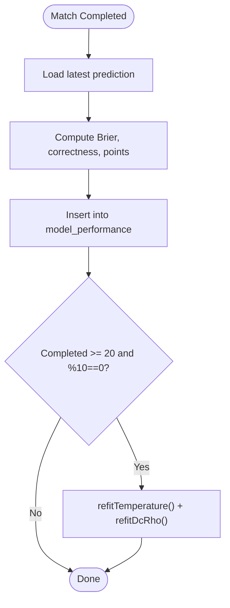

**Diagram sources**
- [analysisService.js:76-218](file://backend/services/analysisService.js#L76-L218)
- [calibrationService.js:53-129](file://backend/services/calibrationService.js#L53-L129)

**Section sources**
- [analysisService.js:76-218](file://backend/services/analysisService.js#L76-L218)
- [calibrationService.js:53-129](file://backend/services/calibrationService.js#L53-L129)

## Dependency Analysis
- predictionEngine depends on dataService, h2hService, lineupService, and qwenClient for multi-agent mode.
- agentFramework depends on qwenClient and db for persistence.
- orchestratorAgent composes agents and delegates to agentFramework.
- analysisService depends on predictionEngine for rating updates and on calibrationService for refits.

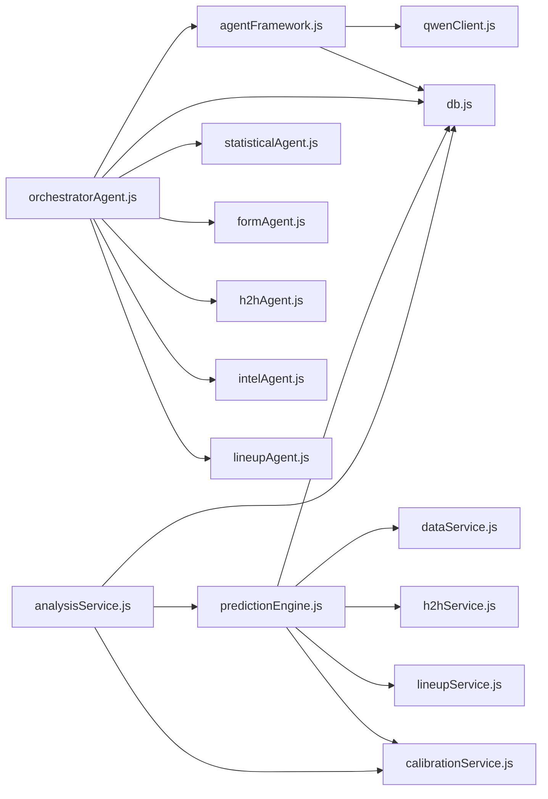

**Diagram sources**
- [predictionEngine.js:37-43](file://backend/services/predictionEngine.js#L37-L43)
- [agentFramework.js:27-29](file://backend/services/agents/agentFramework.js#L27-L29)
- [orchestratorAgent.js:28-30](file://backend/services/agents/orchestratorAgent.js#L28-L30)
- [analysisService.js:13-16](file://backend/services/analysisService.js#L13-L16)

**Section sources**
- [predictionEngine.js:37-43](file://backend/services/predictionEngine.js#L37-L43)
- [agentFramework.js:27-29](file://backend/services/agents/agentFramework.js#L27-L29)
- [orchestratorAgent.js:28-30](file://backend/services/agents/orchestratorAgent.js#L28-L30)
- [analysisService.js:13-16](file://backend/services/analysisService.js#L13-L16)

## Performance Considerations
- Parallelization: multi-agent dispatch and domain data fetching reduce latency.
- Caching: web_intel_cache and team form caches minimize repeated network calls.
- Numerical stability: log-space computations and renormalization prevent under/overflow.
- Early exits: skip agents when data is unavailable or insufficient (e.g., H2H with <2 meetings).
- Database tuning: pragmas and migrations optimized for concurrent access and schema evolution.

[No sources needed since this section provides general guidance]

## Troubleshooting Guide
- API keys missing: qwenClient throws if DASHSCOPE_API_KEY is not set; dataService warns on FOOTBALL_DATA_API_KEY absence.
- JSON parsing failures: agentFramework retries once and falls back to uniform priors; logs parse errors.
- Incomplete or missing data: agents return near-neutral outputs; orchestrator skips unavailable agents.
- Calibration not applied: if temperature remains at default 1.0, verify model_config and refit triggers.

**Section sources**
- [qwenClient.js:60-101](file://backend/services/qwenClient.js#L60-L101)
- [agentFramework.js:112-146](file://backend/services/agents/agentFramework.js#L112-L146)
- [orchestratorAgent.js:332-363](file://backend/services/agents/orchestratorAgent.js#L332-L363)
- [analysisService.js:202-211](file://backend/services/analysisService.js#L202-L211)

## Conclusion
The prediction engine combines a robust Dixon-Coles Poisson backbone with adaptive, multi-source signals and a principled multi-agent negotiation framework. Temperature scaling ensures well-calibrated probabilities, while comprehensive session logging enables transparency and auditability. The system gracefully handles missing data and integrates external sources to maintain reliable outputs across diverse scenarios.

## Appendices

### Mathematical Foundations and Algorithms
- Dixon-Coles Poisson: score matrix construction with low-score correction; outcome and expected score derivation.
- Log-pool blending: geometric mean of probabilities with per-signal exponents; preserves confidence.
- Temperature scaling: inverse-temperature softmax normalization for calibration.
- Conflict detection and negotiation: pairwise delta thresholds, iterative rebuttals, and weight adjustments.

**Section sources**
- [predictionEngine.js:135-163](file://backend/services/predictionEngine.js#L135-L163)
- [predictionEngine.js:214-238](file://backend/services/predictionEngine.js#L214-L238)
- [calibrationService.js:28-39](file://backend/services/calibrationService.js#L28-L39)
- [agentFramework.js:103-109](file://backend/services/agents/agentFramework.js#L103-L109)

### Methodology Tracking and Factors
- Factors list captures each signal’s impact, favor direction, and weight percentage.
- Methodology string summarizes the final blend composition.
- Confidence tiers derived from maximum outcome probability.

**Section sources**
- [predictionEngine.js:462-583](file://backend/services/predictionEngine.js#L462-L583)
- [orchestratorAgent.js:183-191](file://backend/services/agents/orchestratorAgent.js#L183-L191)
- [predictionEngine.js:365-371](file://backend/services/predictionEngine.js#L365-L371)

### Fallback Mechanisms
- When AI features disabled: feature flags control multi-agent enablement; single-agent path computes backbone and signals without LLM orchestration.
- Data fallbacks: web scraping for form/H2H/intel; default synthetic form generation; static H2H estimates.

**Section sources**
- [predictionEngine.js:55-61](file://backend/services/predictionEngine.js#L55-L61)
- [dataService.js:117-185](file://backend/services/dataService.js#L117-L185)
- [h2hService.js:235-265](file://backend/services/h2hService.js#L235-L265)