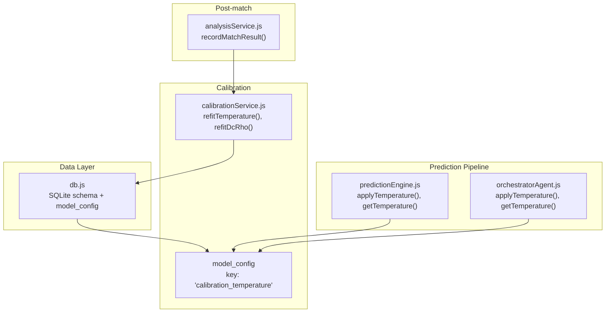
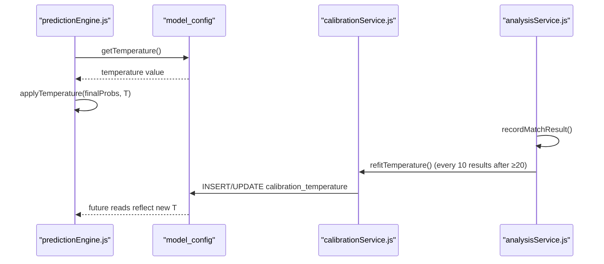
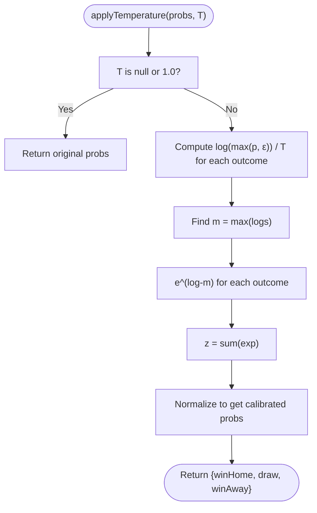
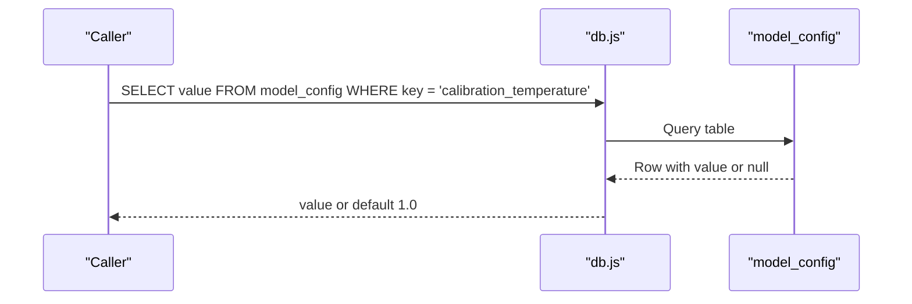
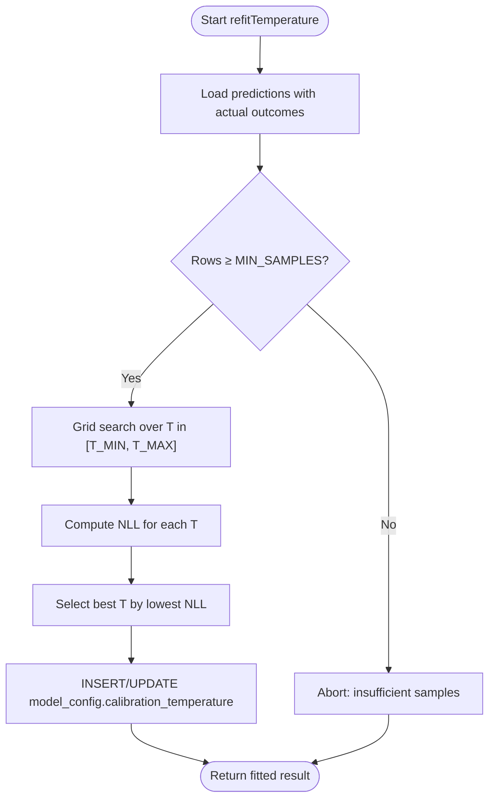
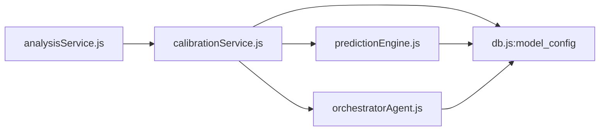
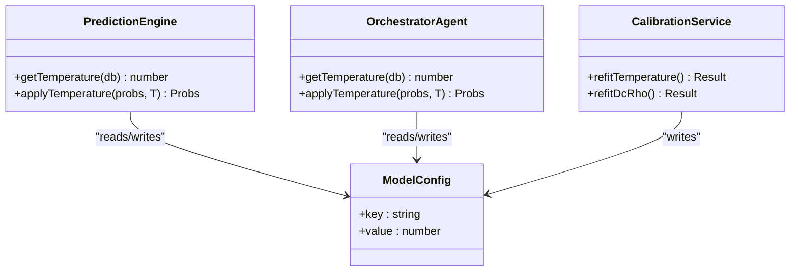

# Probability Calibration & Temperature Scaling

<cite>
**Referenced Files in This Document**
- [calibrationService.js](file://backend/services/calibrationService.js)
- [predictionEngine.js](file://backend/services/predictionEngine.js)
- [orchestratorAgent.js](file://backend/services/agents/orchestratorAgent.js)
- [analysisService.js](file://backend/services/analysisService.js)
- [db.js](file://backend/database/db.js)
- [README.md](file://README.md)
- [verifyTuning.js](file://backend/scripts/verifyTuning.js)
- [dryRunCompare.js](file://backend/scripts/dryRunCompare.js)
</cite>

## Table of Contents
1. [Introduction](#introduction)
2. [Project Structure](#project-structure)
3. [Core Components](#core-components)
4. [Architecture Overview](#architecture-overview)
5. [Detailed Component Analysis](#detailed-component-analysis)
6. [Dependency Analysis](#dependency-analysis)
7. [Performance Considerations](#performance-considerations)
8. [Troubleshooting Guide](#troubleshooting-guide)
9. [Conclusion](#conclusion)
10. [Appendices](#appendices)

## Introduction
This document explains the probability calibration system using temperature scaling in the prediction pipeline. It covers the mathematical foundation of temperature scaling, how the calibration temperature parameter is retrieved from model configuration, and how the softening/squeezing effect on probability distributions improves prediction reliability. It documents the implementation of the temperature scaling function, the relationship between temperature values and prediction confidence, the calibration process workflow, parameter tuning methods, and the impact of different temperature values on probability distributions. It also introduces the theoretical background of proper scoring rules and why temperature scaling is effective for improving prediction accuracy.

## Project Structure
The calibration system spans several backend services and scripts:
- Calibration fitting and storage: [calibrationService.js](file://backend/services/calibrationService.js)
- Prediction pipeline integration: [predictionEngine.js](file://backend/services/predictionEngine.js)
- Multi-agent orchestration integration: [orchestratorAgent.js](file://backend/services/agents/orchestratorAgent.js)
- Post-match calibration refit trigger: [analysisService.js](file://backend/services/analysisService.js)
- Model configuration storage: [db.js](file://backend/database/db.js)
- Parameter verification and diagnostics: [verifyTuning.js](file://backend/scripts/verifyTuning.js), [dryRunCompare.js](file://backend/scripts/dryRunCompare.js)
- System overview and multi-agent workflow: [README.md](file://README.md)

**Diagram sources**
- [calibrationService.js:53-82](file://backend/services/calibrationService.js#L53-L82)
- [predictionEngine.js:639-662](file://backend/services/predictionEngine.js#L639-L662)
- [orchestratorAgent.js:57-71](file://backend/services/agents/orchestratorAgent.js#L57-L71)
- [analysisService.js:199-210](file://backend/services/analysisService.js#L199-L210)
- [db.js:160-165](file://backend/database/db.js#L160-L165)

**Section sources**
- [README.md:18-95](file://README.md#L18-L95)
- [db.js:160-165](file://backend/database/db.js#L160-L165)

## Core Components
- Temperature scaling function: Applies a multiplicative inverse temperature exponentiation to logits, followed by softmax normalization, to soften or sharpen probability distributions.
- Calibration refit: Minimizes negative log-likelihood over historical predictions to estimate the optimal temperature parameter.
- Parameter storage: Stores the fitted temperature in the model configuration table for runtime retrieval.
- Runtime application: Retrieves the temperature and applies scaling to final blended probabilities before packaging predictions.

Key implementation references:
- Temperature scaling function: [applyTemperature:650-662](file://backend/services/predictionEngine.js#L650-L662), [applyTemperature:57-66](file://backend/services/agents/orchestratorAgent.js#L57-L66)
- Calibration refit: [refitTemperature:53-82](file://backend/services/calibrationService.js#L53-L82)
- Parameter retrieval: [getTemperature:639-642](file://backend/services/predictionEngine.js#L639-L642), [getTemperature:68-71](file://backend/services/agents/orchestratorAgent.js#L68-L71)
- Model config schema: [model_config:160-165](file://backend/database/db.js#L160-L165)

**Section sources**
- [calibrationService.js:28-51](file://backend/services/calibrationService.js#L28-L51)
- [predictionEngine.js:639-662](file://backend/services/predictionEngine.js#L639-L662)
- [orchestratorAgent.js:57-71](file://backend/services/agents/orchestratorAgent.js#L57-L71)
- [db.js:160-165](file://backend/database/db.js#L160-L165)

## Architecture Overview
The calibration system integrates with the prediction pipeline and post-match analysis:
- During prediction, final blended probabilities are scaled by the stored temperature.
- After sufficient completed matches, the system fits a new temperature by minimizing negative log-likelihood on historical predictions.
- The fitted temperature is persisted to model configuration and used by subsequent predictions.

**Diagram sources**
- [predictionEngine.js:639-662](file://backend/services/predictionEngine.js#L639-L662)
- [calibrationService.js:53-82](file://backend/services/calibrationService.js#L53-L82)
- [analysisService.js:199-210](file://backend/services/analysisService.js#L199-L210)
- [db.js:160-165](file://backend/database/db.js#L160-L165)

## Detailed Component Analysis

### Mathematical Foundation of Temperature Scaling
Temperature scaling transforms raw softmax probabilities by exponentiating logits with a multiplicative inverse temperature and renormalizing:
- Soft logits: l_i(T) = log(max(p_raw_i, ε)) / T
- Renormalized probabilities: p_calibrated_i = exp(l_i(T)) / Σ_j exp(l_j(T))

Behavior:
- T > 1: Softens probabilities (more uniform, lower confidence)
- T < 1: Sharpens probabilities (higher peaks, higher confidence)
- T = 1: No change (identity transform)

This transformation preserves ordering while adjusting calibration.

**Section sources**
- [calibrationService.js:28-39](file://backend/services/calibrationService.js#L28-L39)
- [predictionEngine.js:650-662](file://backend/services/predictionEngine.js#L650-L662)
- [orchestratorAgent.js:57-66](file://backend/services/agents/orchestratorAgent.js#L57-L66)

### Implementation of applyTemperature
Two identical implementations exist—one in the prediction pipeline and one in the multi-agent orchestrator—ensuring consistent calibration across both single-model and multi-agent workflows.

**Diagram sources**
- [predictionEngine.js:650-662](file://backend/services/predictionEngine.js#L650-L662)
- [orchestratorAgent.js:57-66](file://backend/services/agents/orchestratorAgent.js#L57-L66)

**Section sources**
- [predictionEngine.js:650-662](file://backend/services/predictionEngine.js#L650-L662)
- [orchestratorAgent.js:57-66](file://backend/services/agents/orchestratorAgent.js#L57-L66)

### Calibration Temperature Parameter Retrieval
The temperature is retrieved from the model configuration table. If unavailable, a default value of 1.0 is used (no scaling).

**Diagram sources**
- [predictionEngine.js:639-642](file://backend/services/predictionEngine.js#L639-L642)
- [orchestratorAgent.js:68-71](file://backend/services/agents/orchestratorAgent.js#L68-L71)
- [db.js:160-165](file://backend/database/db.js#L160-L165)

**Section sources**
- [predictionEngine.js:639-642](file://backend/services/predictionEngine.js#L639-L642)
- [orchestratorAgent.js:68-71](file://backend/services/agents/orchestratorAgent.js#L68-L71)
- [db.js:160-165](file://backend/database/db.js#L160-L165)

### Calibration Process Workflow
The system fits the temperature parameter by minimizing negative log-likelihood over historical predictions and persists it to model configuration.

**Diagram sources**
- [calibrationService.js:53-82](file://backend/services/calibrationService.js#L53-L82)
- [db.js:160-165](file://backend/database/db.js#L160-L165)

**Section sources**
- [calibrationService.js:53-82](file://backend/services/calibrationService.js#L53-L82)
- [analysisService.js:199-210](file://backend/services/analysisService.js#L199-L210)

### Relationship Between Temperature Values and Prediction Confidence
- Lower temperatures (T < 1): Sharpen probabilities, increasing peak magnitudes and reducing entropy, leading to higher confidence predictions.
- Higher temperatures (T > 1): Soften probabilities, decreasing peak magnitudes and increasing entropy, leading to more evenly distributed, lower confidence predictions.
- Temperature near 1.0: Minimal change, preserving original distribution shape.

Impact on reliability:
- Overconfident models benefit from T > 1 to reduce overconfidence.
- Underconfident models benefit from T < 1 to increase confidence alignment with outcomes.

**Section sources**
- [calibrationService.js:4-7](file://backend/services/calibrationService.js#L4-L7)
- [predictionEngine.js:650-662](file://backend/services/predictionEngine.js#L650-L662)

### Parameter Tuning Methods
- Grid search over temperature: Discretized range [T_MIN, T_MAX] with fixed step resolution.
- Objective: Minimize average negative log-likelihood across historical predictions.
- Trigger: Automatic refit every 10 completed matches after reaching a minimum threshold.
- Additional parameter: Dixon-Coles ρ refit for scoreline modeling, separate from temperature scaling.

**Section sources**
- [calibrationService.js:18-27](file://backend/services/calibrationService.js#L18-L27)
- [calibrationService.js:65-72](file://backend/services/calibrationService.js#L65-L72)
- [analysisService.js:199-210](file://backend/services/analysisService.js#L199-L210)

### Impact of Different Temperature Values on Probability Distributions
- T = 1.0: Identity scaling; no change to distribution.
- T < 1.0: Increased contrast among outcomes; higher peak probability for the favored outcome.
- T > 1.0: Reduced contrast; flatter distribution favoring calibration stability.

Empirical verification:
- Parameter inspection script reads the stored temperature and reports its value.
- Dry-run comparison script demonstrates how applying temperature affects scored outcomes and correctness metrics.

**Section sources**
- [verifyTuning.js:155-161](file://backend/scripts/verifyTuning.js#L155-L161)
- [dryRunCompare.js:106-128](file://backend/scripts/dryRunCompare.js#L106-L128)

### Theoretical Background: Proper Scoring Rules and Why Temperature Scaling Works
- Proper scoring rules incentivize honest probabilistic forecasts by rewarding accurate probability assignments.
- Negative log-likelihood serves as a proper scoring rule for categorical distributions.
- Temperature scaling adjusts the sharpness of predictions without altering rank order, aligning predictive distributions with observed frequencies and improving calibration.

**Section sources**
- [calibrationService.js:41-51](file://backend/services/calibrationService.js#L41-L51)
- [analysisService.js:300-316](file://backend/services/analysisService.js#L300-L316)

## Dependency Analysis
The calibration system depends on:
- Historical predictions with actual outcomes for fitting.
- Model configuration persistence for storing the temperature parameter.
- Prediction pipeline integration for runtime application.

**Diagram sources**
- [analysisService.js:199-210](file://backend/services/analysisService.js#L199-L210)
- [calibrationService.js:53-82](file://backend/services/calibrationService.js#L53-L82)
- [db.js:160-165](file://backend/database/db.js#L160-L165)
- [predictionEngine.js:639-662](file://backend/services/predictionEngine.js#L639-L662)
- [orchestratorAgent.js:57-71](file://backend/services/agents/orchestratorAgent.js#L57-L71)

**Section sources**
- [analysisService.js:199-210](file://backend/services/analysisService.js#L199-L210)
- [calibrationService.js:53-82](file://backend/services/calibrationService.js#L53-L82)
- [db.js:160-165](file://backend/database/db.js#L160-L165)

## Performance Considerations
- Computational cost: Temperature scaling is O(1) per outcome; negligible compared to prediction pipeline steps.
- Fitting cost: Grid search evaluates NLL over a fixed number of T steps; acceptable for periodic batch updates.
- Storage: Temperature stored as a single scalar in model configuration; minimal overhead.
- Practical guidance: Fit temperature periodically after sufficient completed matches to balance responsiveness and stability.

[No sources needed since this section provides general guidance]

## Troubleshooting Guide
Common issues and remedies:
- Insufficient samples for fitting: The refit function aborts early if the number of completed predictions is below the minimum threshold.
- Missing temperature in configuration: Retrieval defaults to 1.0, ensuring robust operation even if calibration has not yet been fitted.
- Parameter verification: Use the verification script to confirm the stored temperature and related parameters.

**Section sources**
- [calibrationService.js:61-63](file://backend/services/calibrationService.js#L61-L63)
- [predictionEngine.js:639-642](file://backend/services/predictionEngine.js#L639-L642)
- [verifyTuning.js:155-161](file://backend/scripts/verifyTuning.js#L155-L161)

## Conclusion
Temperature scaling provides a simple yet powerful method to recalibrate model probabilities, improving reliability and alignment with observed outcomes. By minimizing negative log-likelihood over historical predictions and persisting the optimal temperature, the system achieves better-calibrated outputs that enhance downstream decision-making. The dual implementation ensures consistent calibration across single-model and multi-agent prediction workflows.

[No sources needed since this section summarizes without analyzing specific files]

## Appendices

### Appendix A: Class Diagram of Temperature Scaling Functions

**Diagram sources**
- [predictionEngine.js:639-662](file://backend/services/predictionEngine.js#L639-L662)
- [orchestratorAgent.js:57-71](file://backend/services/agents/orchestratorAgent.js#L57-L71)
- [calibrationService.js:53-82](file://backend/services/calibrationService.js#L53-L82)
- [db.js:160-165](file://backend/database/db.js#L160-L165)