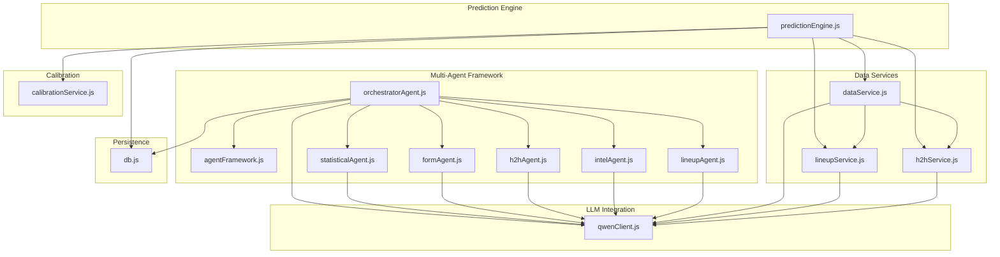
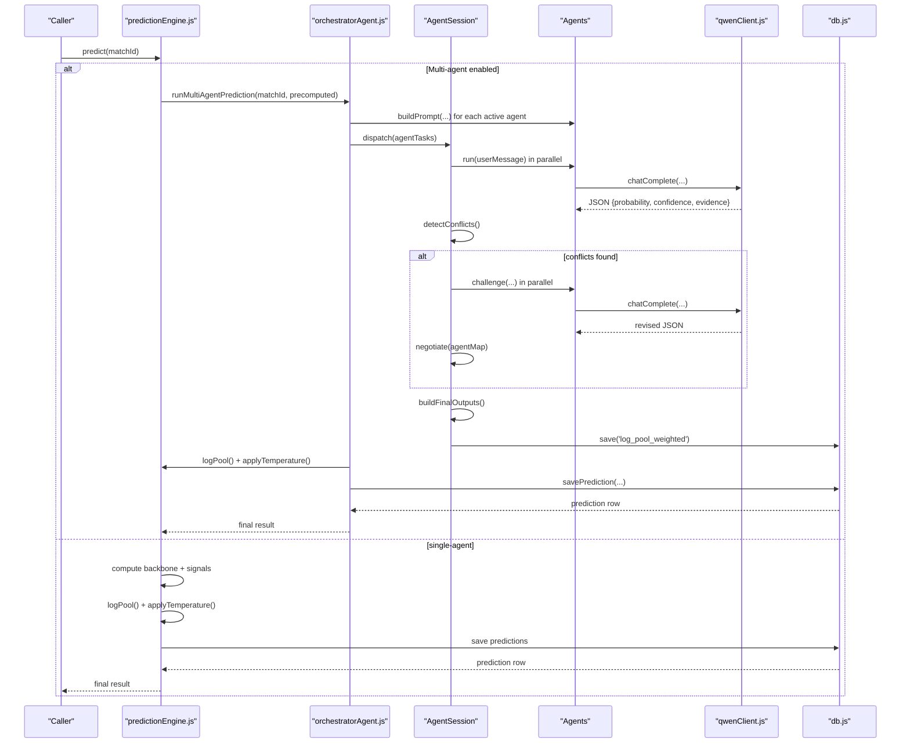
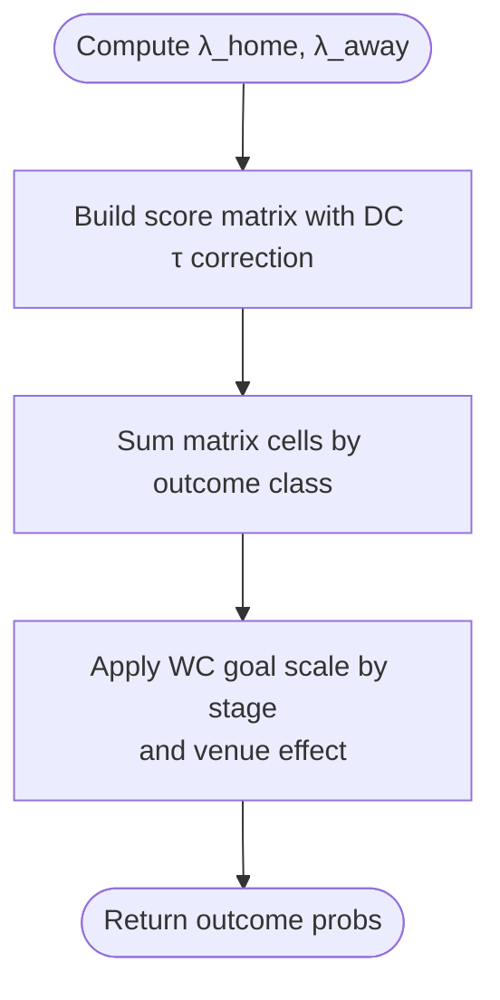
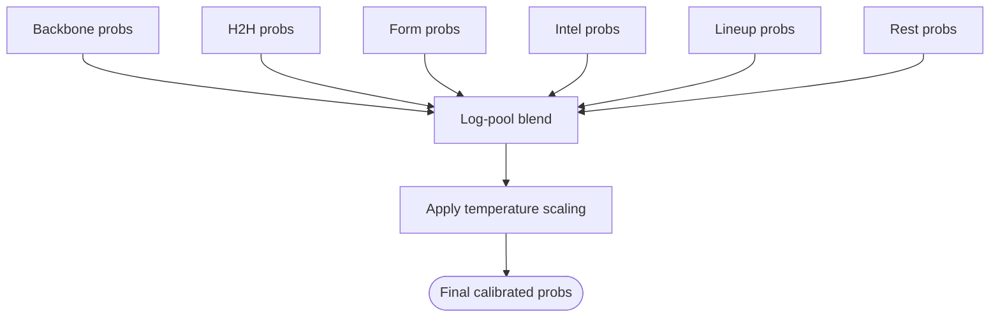
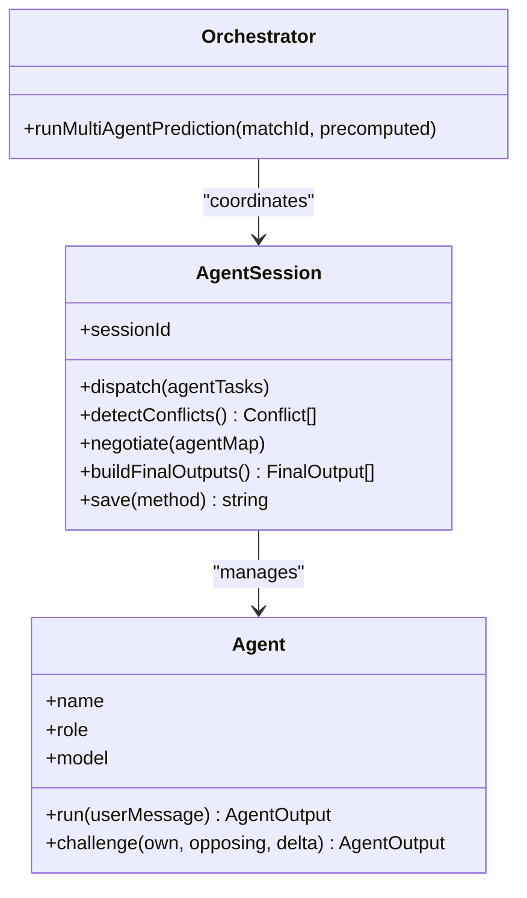
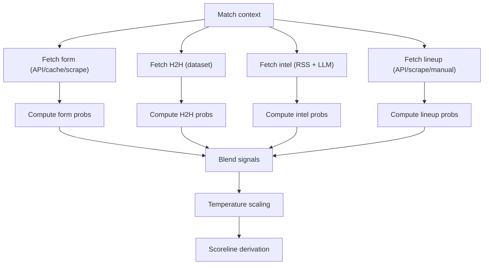
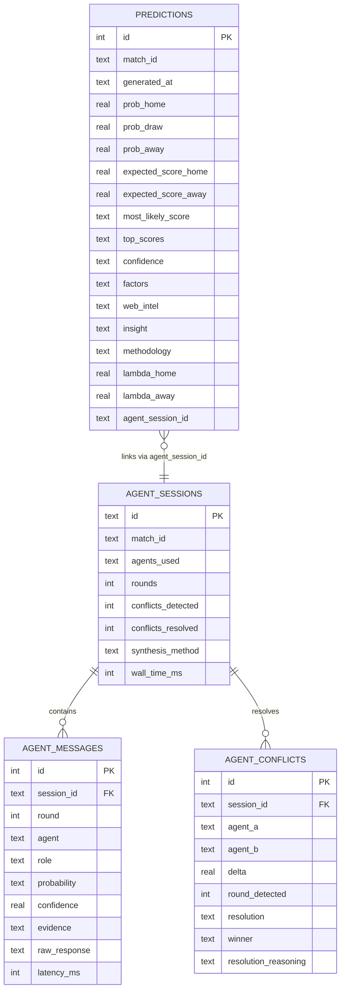
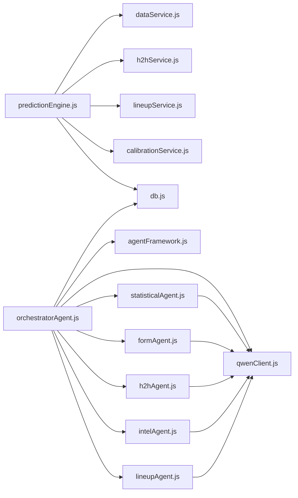

# AI Prediction System

<cite>
**Referenced Files in This Document**
- [predictionEngine.js](file://backend/services/predictionEngine.js)
- [orchestratorAgent.js](file://backend/services/agents/orchestratorAgent.js)
- [agentFramework.js](file://backend/services/agents/agentFramework.js)
- [statisticalAgent.js](file://backend/services/agents/statisticalAgent.js)
- [formAgent.js](file://backend/services/agents/formAgent.js)
- [h2hAgent.js](file://backend/services/agents/h2hAgent.js)
- [intelAgent.js](file://backend/services/agents/intelAgent.js)
- [lineupAgent.js](file://backend/services/agents/lineupAgent.js)
- [qwenClient.js](file://backend/services/qwenClient.js)
- [dataService.js](file://backend/services/dataService.js)
- [lineupService.js](file://backend/services/lineupService.js)
- [h2hService.js](file://backend/services/h2hService.js)
- [calibrationService.js](file://backend/services/calibrationService.js)
- [db.js](file://backend/database/db.js)
- [SPEC-PREDICT.md](file://specs/SPEC-PREDICT.md)
</cite>

## Table of Contents
1. [Introduction](#introduction)
2. [Project Structure](#project-structure)
3. [Core Components](#core-components)
4. [Architecture Overview](#architecture-overview)
5. [Detailed Component Analysis](#detailed-component-analysis)
6. [Dependency Analysis](#dependency-analysis)
7. [Performance Considerations](#performance-considerations)
8. [Troubleshooting Guide](#troubleshooting-guide)
9. [Conclusion](#conclusion)

## Introduction
This document describes the WC26-Qwen-Qoder AI prediction system, a sophisticated multi-agent architecture that combines a Dixon-Coles bivariate Poisson model with five specialized agents and temperature scaling for superior match outcome forecasting. The system integrates Qwen LLMs to interpret domain signals (form, head-to-head, intelligence, lineup, and venue/home factors) and synthesizes them into calibrated win/draw/lose probabilities and actionable insights.

## Project Structure
The prediction system spans backend services, agent modules, and persistent storage:
- Prediction engine computes the Dixon-Coles backbone and blends adjustment signals
- Multi-agent framework orchestrates five agents that analyze specialized inputs
- Qwen client handles LLM calls with retry/backoff logic
- Data services fetch live and historical data (form, H2H, intelligence, lineup)
- Calibration service refits temperature and Dixon-Coles ρ parameters
- Database schema persists predictions, agent sessions, and model configuration

**Diagram sources**
- [predictionEngine.js:1-1020](file://backend/services/predictionEngine.js#L1-L1020)
- [orchestratorAgent.js:1-471](file://backend/services/agents/orchestratorAgent.js#L1-L471)
- [agentFramework.js:1-576](file://backend/services/agents/agentFramework.js#L1-L576)
- [statisticalAgent.js:1-98](file://backend/services/agents/statisticalAgent.js#L1-L98)
- [formAgent.js:1-113](file://backend/services/agents/formAgent.js#L1-L113)
- [h2hAgent.js:1-107](file://backend/services/agents/h2hAgent.js#L1-L107)
- [intelAgent.js:1-126](file://backend/services/agents/intelAgent.js#L1-L126)
- [lineupAgent.js:1-118](file://backend/services/agents/lineupAgent.js#L1-L118)
- [qwenClient.js:1-123](file://backend/services/qwenClient.js#L1-L123)
- [dataService.js:1-583](file://backend/services/dataService.js#L1-L583)
- [lineupService.js:1-425](file://backend/services/lineupService.js#L1-L425)
- [h2hService.js:1-315](file://backend/services/h2hService.js#L1-L315)
- [calibrationService.js:1-132](file://backend/services/calibrationService.js#L1-L132)
- [db.js:1-252](file://backend/database/db.js#L1-L252)

**Section sources**
- [predictionEngine.js:1-1020](file://backend/services/predictionEngine.js#L1-L1020)
- [orchestratorAgent.js:1-471](file://backend/services/agents/orchestratorAgent.js#L1-L471)
- [agentFramework.js:1-576](file://backend/services/agents/agentFramework.js#L1-L576)
- [qwenClient.js:1-123](file://backend/services/qwenClient.js#L1-L123)
- [db.js:1-252](file://backend/database/db.js#L1-L252)

## Core Components
- Dixon-Coles Poisson backbone: computes expected goals and scoreline matrix with low-score correction
- Adjustment signals: H2H, form, intelligence, lineup, rest days, venue/home factors
- Log-pool blending: geometric combination of signals weighted by agent confidence
- Temperature scaling: calibrates output probabilities via grid-search refit
- Multi-agent orchestration: parallel analysis, conflict detection, negotiation, and final synthesis
- Session tracking and audit trail: persistent records of agent reasoning and resolutions

**Section sources**
- [predictionEngine.js:66-133](file://backend/services/predictionEngine.js#L66-L133)
- [predictionEngine.js:214-238](file://backend/services/predictionEngine.js#L214-L238)
- [predictionEngine.js:810-819](file://backend/services/predictionEngine.js#L810-L819)
- [calibrationService.js:53-82](file://backend/services/calibrationService.js#L53-L82)
- [orchestratorAgent.js:386-392](file://backend/services/agents/orchestratorAgent.js#L386-L392)
- [agentFramework.js:326-561](file://backend/services/agents/agentFramework.js#L326-L561)

## Architecture Overview
The system operates in two modes:
- Single-agent mode: predictionEngine computes the backbone and blends signals directly
- Multi-agent mode: orchestratorAgent coordinates five agents, detects conflicts, negotiates, and synthesizes outputs

**Diagram sources**
- [predictionEngine.js:665-896](file://backend/services/predictionEngine.js#L665-L896)
- [orchestratorAgent.js:288-468](file://backend/services/agents/orchestratorAgent.js#L288-L468)
- [agentFramework.js:345-493](file://backend/services/agents/agentFramework.js#L345-L493)
- [qwenClient.js:53-101](file://backend/services/qwenClient.js#L53-L101)
- [db.js:72-94](file://backend/database/db.js#L72-L94)

## Detailed Component Analysis

### Mathematical Backbone: Dixon-Coles Poisson
- Expected goals: λ_home = exp(α_home + β_away + home_adv), λ_away = exp(α_away + β_home)
- Score matrix: Poisson PMF × Dixon-Coles τ correction for low scores
- Outcome probabilities: sums over score matrix cells grouped by outcome class
- Goal scaling: adjusts for tournament phase (group vs knockout) and venue conditions

**Diagram sources**
- [predictionEngine.js:135-174](file://backend/services/predictionEngine.js#L135-L174)
- [predictionEngine.js:67-90](file://backend/services/predictionEngine.js#L67-L90)
- [predictionEngine.js:116-133](file://backend/services/predictionEngine.js#L116-L133)

**Section sources**
- [predictionEngine.js:66-133](file://backend/services/predictionEngine.js#L66-L133)
- [predictionEngine.js:135-174](file://backend/services/predictionEngine.js#L135-L174)

### Adjustment Signals and Blending
- Signal weights: backbone (1.0), H2H (0.30), form (0.20), intelligence (0.20), lineup (0.40), rest (0.10)
- Log-pool blending: ∏ p_i^(w_i), renormalized; preserves confidence unlike arithmetic averaging
- Temperature scaling: T > 1 softens, T < 1 sharpens; refitted via grid search minimizing NLL

**Diagram sources**
- [predictionEngine.js:92-100](file://backend/services/predictionEngine.js#L92-L100)
- [predictionEngine.js:214-238](file://backend/services/predictionEngine.js#L214-L238)
- [predictionEngine.js:637-662](file://backend/services/predictionEngine.js#L637-L662)
- [calibrationService.js:53-82](file://backend/services/calibrationService.js#L53-L82)

**Section sources**
- [predictionEngine.js:810-819](file://backend/services/predictionEngine.js#L810-L819)
- [predictionEngine.js:214-238](file://backend/services/predictionEngine.js#L214-L238)
- [calibrationService.js:53-82](file://backend/services/calibrationService.js#L53-L82)

### Multi-Agent Orchestration
- Agent roles: Statistical, Form, H2H, Intel, Lineup
- Parallel dispatch: all agents analyze in round 1
- Conflict detection: pairwise max-probability delta ≥ 0.20
- Negotiation: agents rebuttals in round 2; winner retains higher weight, loser’s weight reduced
- Final synthesis: log-pool of adjusted outputs, temperature scaling, scoreline derivation

**Diagram sources**
- [agentFramework.js:201-320](file://backend/services/agents/agentFramework.js#L201-L320)
- [agentFramework.js:326-561](file://backend/services/agents/agentFramework.js#L326-L561)
- [orchestratorAgent.js:288-468](file://backend/services/agents/orchestratorAgent.js#L288-L468)

**Section sources**
- [agentFramework.js:31-53](file://backend/services/agents/agentFramework.js#L31-L53)
- [agentFramework.js:366-394](file://backend/services/agents/agentFramework.js#L366-L394)
- [agentFramework.js:396-435](file://backend/services/agents/agentFramework.js#L396-L435)
- [agentFramework.js:437-493](file://backend/services/agents/agentFramework.js#L437-L493)
- [orchestratorAgent.js:367-384](file://backend/services/agents/orchestratorAgent.js#L367-L384)

### Specialized Agents

#### Statistical Agent
- Role: interprets Dixon-Coles backbone (λ, α/β, ELO, venue/home)
- Output: probability assessment anchored to backbone with statistical reasoning

**Section sources**
- [statisticalAgent.js:18-98](file://backend/services/agents/statisticalAgent.js#L18-L98)

#### Form Agent
- Role: evaluates recent form (last 10 matches), weighting by competition quality
- Output: form trend interpretation and confidence

**Section sources**
- [formAgent.js:17-113](file://backend/services/agents/formAgent.js#L17-L113)

#### H2H Agent
- Role: real head-to-head from martj42 dataset with competition-weighted recency
- Output: historical record interpretation and data quality assessment

**Section sources**
- [h2hAgent.js:18-107](file://backend/services/agents/h2hAgent.js#L18-L107)
- [h2hService.js:272-312](file://backend/services/h2hService.js#L272-L312)

#### Intel Agent
- Role: pre-match intelligence (injuries, motivation, rotation) parsed from web news
- Output: probability impact with confidence and LLM-parsed quality flag

**Section sources**
- [intelAgent.js:20-126](file://backend/services/agents/intelAgent.js#L20-L126)
- [dataService.js:413-490](file://backend/services/dataService.js#L413-L490)

#### Lineup Agent
- Role: confirmed starting XI analysis (strength delta, key absences)
- Output: high-confidence assessment when lineup available (weight ~0.40)

**Section sources**
- [lineupAgent.js:18-118](file://backend/services/agents/lineupAgent.js#L18-L118)
- [lineupService.js:220-362](file://backend/services/lineupService.js#L220-L362)

### Data Inputs and Processing
- Form: fetchTeamForm() from API or web scrape; cached with TTL
- H2H: real dataset from martj42, seeded once and queried efficiently
- Intelligence: Google News RSS scrape + Qwen LLM parsing; fallback regex extraction
- Lineup: API or ESPN/BBC scrape; strength scoring and key absence detection
- Ratings: attack/defense log-α/log-β initialized from FIFA/ELO and updated post-match

**Diagram sources**
- [dataService.js:68-133](file://backend/services/dataService.js#L68-L133)
- [h2hService.js:192-266](file://backend/services/h2hService.js#L192-L266)
- [dataService.js:413-490](file://backend/services/dataService.js#L413-L490)
- [lineupService.js:220-362](file://backend/services/lineupService.js#L220-L362)
- [predictionEngine.js:734-807](file://backend/services/predictionEngine.js#L734-L807)

**Section sources**
- [dataService.js:68-133](file://backend/services/dataService.js#L68-L133)
- [h2hService.js:192-266](file://backend/services/h2hService.js#L192-L266)
- [dataService.js:413-490](file://backend/services/dataService.js#L413-L490)
- [lineupService.js:220-362](file://backend/services/lineupService.js#L220-L362)
- [predictionEngine.js:734-807](file://backend/services/predictionEngine.js#L734-L807)

### Session Tracking and Audit Trail
- Agent sessions capture round 1 analyses and round 2 rebuttals
- Conflict records include winner/loser and reasoning
- Predictions include methodology, factors, insight, and agent session linkage

**Diagram sources**
- [db.js:167-207](file://backend/database/db.js#L167-L207)
- [orchestratorAgent.js:415-428](file://backend/services/agents/orchestratorAgent.js#L415-L428)
- [agentFramework.js:500-561](file://backend/services/agents/agentFramework.js#L500-L561)

**Section sources**
- [db.js:167-207](file://backend/database/db.js#L167-L207)
- [agentFramework.js:500-561](file://backend/services/agents/agentFramework.js#L500-L561)
- [orchestratorAgent.js:415-428](file://backend/services/agents/orchestratorAgent.js#L415-L428)

### Qwen Model Integration
- Models: qwen-max (orchestrator), qwen-plus (agents), qwen-turbo (agents)
- Chat completion wrapper with retry/backoff, latency tracking, and usage reporting
- Structured JSON output enforced via schema and extraction helpers

**Section sources**
- [qwenClient.js:17-21](file://backend/services/qwenClient.js#L17-L21)
- [qwenClient.js:53-101](file://backend/services/qwenClient.js#L53-L101)
- [agentFramework.js:40-53](file://backend/services/agents/agentFramework.js#L40-L53)

### Prediction Output Formats
- Fields: match identifiers, probabilities, expected and most likely scores, confidence, factors, insight, methodology, agent session linkage
- Frontend consumption: predictions page displays outcomes and scorelines, with correctness indicators

**Section sources**
- [predictionEngine.js:857-895](file://backend/services/predictionEngine.js#L857-L895)
- [SPEC-PREDICT.md:14-147](file://specs/SPEC-PREDICT.md#L14-L147)

## Dependency Analysis
The system exhibits clear separation of concerns:
- predictionEngine depends on data services, H2H service, lineup service, calibration service, and database
- orchestratorAgent depends on agentFramework, agent modules, qwenClient, and database
- agent modules depend on qwenClient and share a common output schema
- data services depend on qwenClient and database caches

**Diagram sources**
- [predictionEngine.js:37-43](file://backend/services/predictionEngine.js#L37-L43)
- [orchestratorAgent.js:28-37](file://backend/services/agents/orchestratorAgent.js#L28-L37)
- [agentFramework.js:27-29](file://backend/services/agents/agentFramework.js#L27-L29)

**Section sources**
- [predictionEngine.js:37-43](file://backend/services/predictionEngine.js#L37-L43)
- [orchestratorAgent.js:28-37](file://backend/services/agents/orchestratorAgent.js#L28-L37)
- [agentFramework.js:27-29](file://backend/services/agents/agentFramework.js#L27-L29)

## Performance Considerations
- Parallelization: multi-agent dispatch and signal fetching minimize latency
- Caching: form/H2H/intel caches reduce repeated network calls
- Lightweight LLM calls: qwen-turbo for high-throughput agents; qwen-plus for reasoning agents
- Calibration: periodic refit of temperature and DC ρ improves reliability over time
- Database migrations: schema evolves without downtime; indexes optimize H2H queries

[No sources needed since this section provides general guidance]

## Troubleshooting Guide
- Missing API keys: qwenClient throws if DASHSCOPE_API_KEY is unset; ensure environment configuration
- LLM parsing failures: agentFramework retries once; outputs fallback to uniform priors with parse-error flags
- Data fetch failures: dataService and lineupService provide fallbacks (scraping, defaults, cached values)
- Calibration not applied: calibrationService requires sufficient completed matches; temperature remains at default until refit

**Section sources**
- [qwenClient.js:60-62](file://backend/services/qwenClient.js#L60-L62)
- [agentFramework.js:121-146](file://backend/services/agents/agentFramework.js#L121-L146)
- [dataService.js:117-132](file://backend/services/dataService.js#L117-L132)
- [lineupService.js:250-262](file://backend/services/lineupService.js#L250-L262)
- [calibrationService.js:61-63](file://backend/services/calibrationService.js#L61-L63)

## Conclusion
The WC26-Qwen-Qoder AI prediction system combines a robust Dixon-Coles Poisson foundation with a multi-agent LLM framework to deliver accurate, interpretable match forecasts. Through structured conflict detection, negotiation, and temperature calibration, the system balances statistical rigor with real-time intelligence, while maintaining a comprehensive audit trail for transparency and continuous improvement.