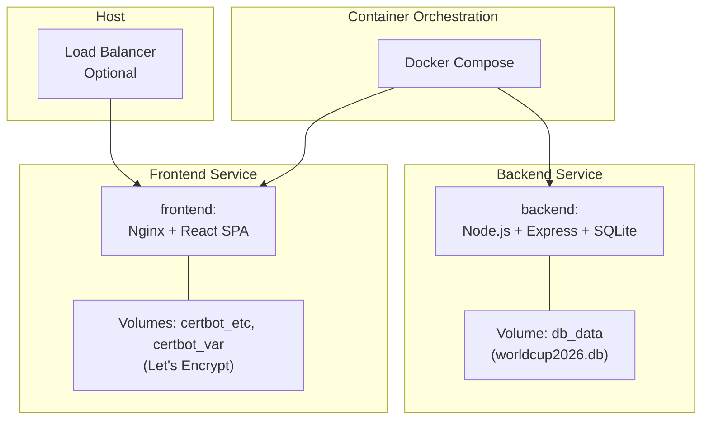
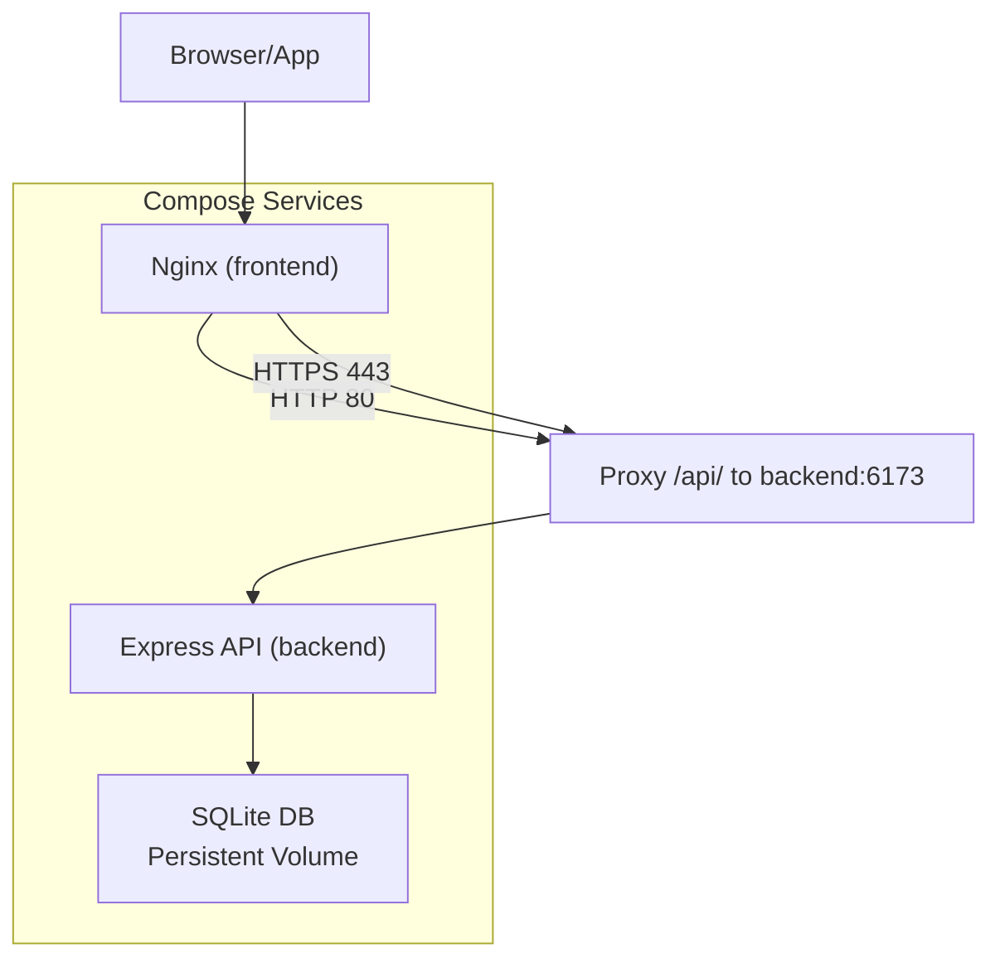
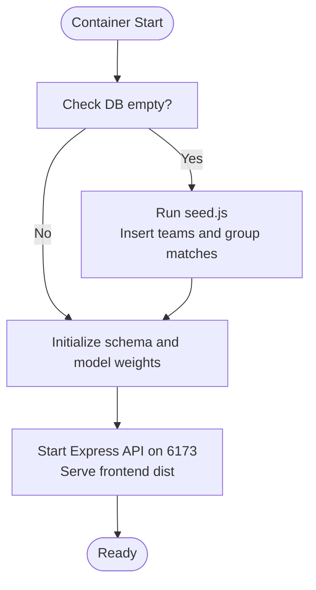
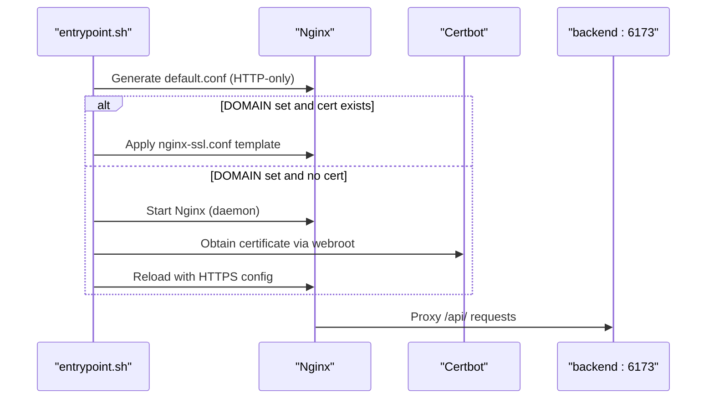
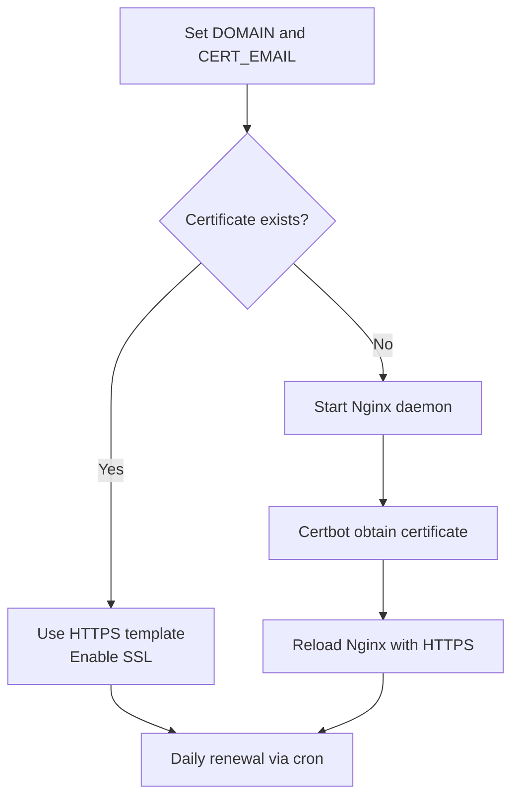
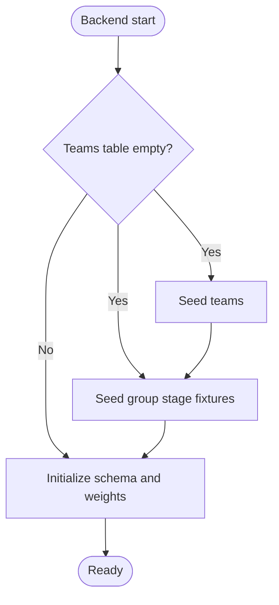
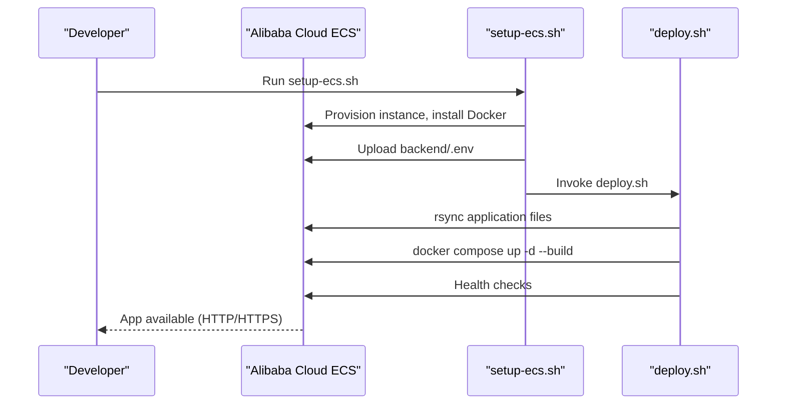
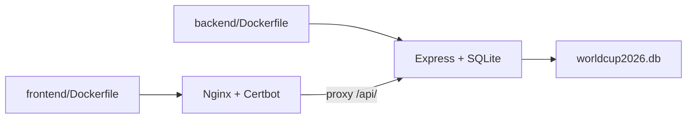

# Deployment Information

<cite>
**Referenced Files in This Document**
- [docker-compose.yml](file://docker-compose.yml)
- [deploy.sh](file://deploy.sh)
- [setup-ecs.sh](file://setup-ecs.sh)
- [backend/Dockerfile](file://backend/Dockerfile)
- [frontend/Dockerfile](file://frontend/Dockerfile)
- [frontend/entrypoint.sh](file://frontend/entrypoint.sh)
- [frontend/nginx.conf.template](file://frontend/nginx.conf.template)
- [frontend/nginx-ssl.conf.template](file://frontend/nginx-ssl.conf.template)
- [backend/server.js](file://backend/server.js)
- [backend/database/db.js](file://backend/database/db.js)
- [backend/database/seed.js](file://backend/database/seed.js)
- [backend/services/qwenClient.js](file://backend/services/qwenClient.js)
- [backend/package.json](file://backend/package.json)
- [frontend/package.json](file://frontend/package.json)
</cite>

## Table of Contents
1. [Introduction](#introduction)
2. [Project Structure](#project-structure)
3. [Core Components](#core-components)
4. [Architecture Overview](#architecture-overview)
5. [Detailed Component Analysis](#detailed-component-analysis)
6. [Dependency Analysis](#dependency-analysis)
7. [Performance Considerations](#performance-considerations)
8. [Troubleshooting Guide](#troubleshooting-guide)
9. [Conclusion](#conclusion)
10. [Appendices](#appendices)

## Introduction
This document provides comprehensive deployment guidance for the World Cup 2026 Prediction App. It covers containerized deployment using Docker and Docker Compose for both backend and frontend services, production deployment options (standalone containers, Docker Compose orchestration, and cloud deployment via ECS setup script), SSL/TLS configuration with Let's Encrypt and Nginx reverse proxy, environment variable configuration for API keys, database connections, and AI service credentials, database initialization and data seeding, a deployment checklist, troubleshooting guidance, performance optimization recommendations, CI/CD considerations, and scaling strategies for high-traffic World Cup periods.

## Project Structure
The repository is organized into two primary services:
- backend: Node.js/Express API with SQLite database and AI integration via Qwen/DashScope
- frontend: React SPA built with Vite and served via Nginx with optional HTTPS via Certbot/Let's Encrypt

Key deployment artifacts:
- docker-compose.yml: Orchestration for backend and frontend with shared volumes for DB persistence and SSL certificates
- setup-ecs.sh: Automated provisioning and deployment to Alibaba Cloud ECS
- deploy.sh: Remote rsync and Docker Compose deployment script
- frontend Dockerfile: Multi-stage build with Nginx and Certbot; entrypoint manages HTTP→HTTPS transition and certificate renewal
- backend Dockerfile: Minimal runtime image exposing port 6173
- Nginx templates: HTTP-only and HTTPS configurations with proxying to backend

**Diagram sources**
- [docker-compose.yml:1-34](file://docker-compose.yml#L1-L34)
- [backend/Dockerfile:1-8](file://backend/Dockerfile#L1-L8)
- [frontend/Dockerfile:1-18](file://frontend/Dockerfile#L1-L18)

**Section sources**
- [docker-compose.yml:1-34](file://docker-compose.yml#L1-L34)
- [backend/Dockerfile:1-8](file://backend/Dockerfile#L1-L8)
- [frontend/Dockerfile:1-18](file://frontend/Dockerfile#L1-L18)

## Core Components
- Backend API
  - Exposes REST endpoints for teams, groups, matches, predictions, suspensions, analytics, and synchronization
  - Integrates with Qwen/DashScope via an OpenAI-compatible endpoint
  - Uses SQLite via node-sqlite3-wasm with persistent volume storage
- Frontend
  - React SPA built with Vite and statically served by Nginx
  - Reverse proxy configuration for API passthrough and optional HTTPS
  - Automatic HTTP→HTTPS transition and certificate renewal via Certbot

Key runtime behaviors:
- Backend listens on port 6173; frontend proxies /api/ to backend
- On startup, backend seeds the database if empty and initializes schema
- Frontend entrypoint generates Nginx configs based on environment variables and obtains/renews certificates

**Section sources**
- [backend/server.js:1-723](file://backend/server.js#L1-L723)
- [backend/database/db.js:1-252](file://backend/database/db.js#L1-L252)
- [backend/database/seed.js:1-69](file://backend/database/seed.js#L1-L69)
- [backend/services/qwenClient.js:1-123](file://backend/services/qwenClient.js#L1-L123)
- [frontend/entrypoint.sh:1-48](file://frontend/entrypoint.sh#L1-L48)
- [frontend/nginx.conf.template:1-25](file://frontend/nginx.conf.template#L1-L25)
- [frontend/nginx-ssl.conf.template:1-45](file://frontend/nginx-ssl.conf.template#L1-L45)

## Architecture Overview
The deployment architecture uses Docker Compose to orchestrate:
- backend service: Node.js API with SQLite database persisted to a named volume
- frontend service: Nginx serving the React SPA, acting as a reverse proxy to backend and managing HTTPS via Certbot

**Diagram sources**
- [docker-compose.yml:1-34](file://docker-compose.yml#L1-L34)
- [frontend/nginx.conf.template:13-19](file://frontend/nginx.conf.template#L13-L19)
- [backend/server.js:18-22](file://backend/server.js#L18-L22)

## Detailed Component Analysis

### Backend Service
- Containerization
  - Base image: node:20-alpine
  - Working directory: /app
  - Installs production dependencies only
  - Exposes port 5173 (note: Compose overrides to 6173)
- Startup behavior
  - Seeds database on first run if empty
  - Initializes schema and model weights
  - Starts API server and serves static frontend dist
- Environment variables
  - NODE_ENV: production
  - DB_PATH: path to SQLite database file
  - DASHSCOPE_API_KEY: required for Qwen/DashScope integration
  - Optional: FRONTEND_URL for CORS origins
- Ports and volumes
  - Port 6173 mapped to host
  - Named volume db_data for persistent SQLite storage

**Diagram sources**
- [backend/Dockerfile:1-8](file://backend/Dockerfile#L1-L8)
- [backend/database/seed.js:1-69](file://backend/database/seed.js#L1-L69)
- [backend/database/db.js:23-249](file://backend/database/db.js#L23-L249)
- [backend/server.js:676-681](file://backend/server.js#L676-L681)

**Section sources**
- [backend/Dockerfile:1-8](file://backend/Dockerfile#L1-L8)
- [backend/server.js:1-723](file://backend/server.js#L1-L723)
- [backend/database/db.js:1-252](file://backend/database/db.js#L1-L252)
- [backend/database/seed.js:1-69](file://backend/database/seed.js#L1-L69)

### Frontend Service
- Containerization
  - Multi-stage build: build with Node, serve with Nginx alpine
  - Copies built SPA to /usr/share/nginx/html
  - Includes Certbot and Bash for certificate automation
  - Exposes ports 80 and 443
- Entrypoint logic
  - Generates HTTP-only config from template
  - If DOMAIN set and certificate exists, switches to HTTPS config
  - If DOMAIN set and no certificate, obtains via HTTP webroot challenge
  - Sets up daily cron job to renew certificates and reload Nginx
  - Runs Nginx in foreground
- Nginx templates
  - HTTP-only template: proxy /api/ to backend and serve SPA
  - HTTPS template: redirect HTTP to HTTPS, serve SSL with certs and proxy /api/

**Diagram sources**
- [frontend/entrypoint.sh:1-48](file://frontend/entrypoint.sh#L1-L48)
- [frontend/nginx.conf.template:1-25](file://frontend/nginx.conf.template#L1-L25)
- [frontend/nginx-ssl.conf.template:1-45](file://frontend/nginx-ssl.conf.template#L1-L45)
- [docker-compose.yml:14-29](file://docker-compose.yml#L14-L29)

**Section sources**
- [frontend/Dockerfile:1-18](file://frontend/Dockerfile#L1-L18)
- [frontend/entrypoint.sh:1-48](file://frontend/entrypoint.sh#L1-L48)
- [frontend/nginx.conf.template:1-25](file://frontend/nginx.conf.template#L1-L25)
- [frontend/nginx-ssl.conf.template:1-45](file://frontend/nginx-ssl.conf.template#L1-L45)
- [docker-compose.yml:14-29](file://docker-compose.yml#L14-L29)

### SSL and Nginx Reverse Proxy
- Let's Encrypt automation
  - Uses Certbot with webroot path mounted for ACME challenges
  - Automatically renews certificates and reloads Nginx
- Nginx configuration
  - HTTP-only template for initial boot and ACME challenges
  - HTTPS template with TLSv1.2+, SSL session cache, and proxy to backend
- Environment-driven behavior
  - BACKEND_URL injected into templates
  - DOMAIN and CERT_EMAIL control certificate acquisition and renewal

**Diagram sources**
- [frontend/entrypoint.sh:11-44](file://frontend/entrypoint.sh#L11-L44)
- [frontend/nginx-ssl.conf.template:17-44](file://frontend/nginx-ssl.conf.template#L17-L44)

**Section sources**
- [frontend/entrypoint.sh:1-48](file://frontend/entrypoint.sh#L1-L48)
- [frontend/nginx.conf.template:1-25](file://frontend/nginx.conf.template#L1-L25)
- [frontend/nginx-ssl.conf.template:1-45](file://frontend/nginx-ssl.conf.template#L1-L45)

### Database Initialization and Seeding
- Schema initialization
  - Creates tables for teams, matches, predictions, model performance, bracket slots, ELO history, suspensions, web intelligence cache, model configuration, and multi-agent tracking
  - Applies migrations to add new columns if missing
  - Seeds default model weights if not present
- Data seeding
  - Inserts teams and group stage fixtures if the teams table is empty
  - Runs within a transaction to ensure consistency
- Persistence
  - Named volume db_data persists the SQLite database file across container restarts

**Diagram sources**
- [backend/database/db.js:23-249](file://backend/database/db.js#L23-L249)
- [backend/database/seed.js:1-69](file://backend/database/seed.js#L1-L69)

**Section sources**
- [backend/database/db.js:1-252](file://backend/database/db.js#L1-L252)
- [backend/database/seed.js:1-69](file://backend/database/seed.js#L1-L69)

### Environment Variable Configuration
- Backend
  - NODE_ENV: production
  - DB_PATH: path to SQLite database file
  - DASHSCOPE_API_KEY: required for Qwen/DashScope integration
  - Optional: FRONTEND_URL for CORS origins
- Frontend
  - BACKEND_URL: URL to backend service (default set in Dockerfile)
  - DOMAIN: domain name for HTTPS and certificate acquisition
  - CERT_EMAIL: email for Let's Encrypt notifications

These variables are passed via docker-compose environment and env_file entries.

**Section sources**
- [docker-compose.yml:6-12](file://docker-compose.yml#L6-L12)
- [backend/Dockerfile:15-16](file://backend/Dockerfile#L15-L16)
- [frontend/Dockerfile:15-16](file://frontend/Dockerfile#L15-L16)
- [frontend/entrypoint.sh:24-31](file://frontend/entrypoint.sh#L24-L31)

### Production Deployment Options

#### Standalone Docker Containers
- Build images locally or pull from registry
- Run backend container with DB_PATH and env_file
- Run frontend container with ports 80/443, volumes for certs, and environment variables for DOMAIN and CERT_EMAIL
- Ensure backend and frontend containers are on the same network for inter-service communication

#### Docker Compose Orchestration
- Use docker-compose.yml to define services, environment variables, volumes, and port mappings
- Compose handles linking services and mounting volumes for DB and certificates

#### Cloud Deployment via ECS Setup Script
- setup-ecs.sh automates:
  - Provisioning Alibaba Cloud ECS instance with required ports (22, 80, 443)
  - Installing Docker and Docker Compose
  - Uploading backend/.env
  - Executing deploy.sh to synchronize files and start services
- deploy.sh performs:
  - rsync of application files excluding unnecessary directories and database files
  - Ensures backend/.env exists on remote host
  - Builds and restarts containers with Docker Compose
  - Performs health checks against backend API and HTTPS endpoint

**Diagram sources**
- [setup-ecs.sh:1-443](file://setup-ecs.sh#L1-L443)
- [deploy.sh:1-110](file://deploy.sh#L1-L110)

**Section sources**
- [docker-compose.yml:1-34](file://docker-compose.yml#L1-L34)
- [setup-ecs.sh:1-443](file://setup-ecs.sh#L1-L443)
- [deploy.sh:1-110](file://deploy.sh#L1-L110)

## Dependency Analysis
- Backend dependencies
  - Express for HTTP server and CORS
  - node-sqlite3-wasm for database
  - dotenv for environment configuration
  - node-cron for scheduled tasks
  - axios for external integrations
- Frontend dependencies
  - React ecosystem and Vite for building
  - react-snap for pre-rendering
  - TailwindCSS and PostCSS for styling
- Inter-service dependencies
  - Frontend Nginx proxies /api/ to backend service
  - Backend serves static frontend dist in production

**Diagram sources**
- [frontend/Dockerfile:1-18](file://frontend/Dockerfile#L1-L18)
- [backend/Dockerfile:1-8](file://backend/Dockerfile#L1-L8)
- [backend/server.js:676-681](file://backend/server.js#L676-L681)

**Section sources**
- [backend/package.json:14-30](file://backend/package.json#L14-L30)
- [frontend/package.json:38-71](file://frontend/package.json#L38-L71)

## Performance Considerations
- Database
  - Use persistent volume for SQLite to avoid rebuilds on restart
  - Keep DB_PATH aligned with mounted volume path
- API
  - Tune cron jobs for prediction regeneration and lineup fetching to balance freshness and cost
  - Consider increasing proxy_read_timeout if AI responses are slow
- Frontend
  - Enable HTTP/2 and appropriate SSL ciphers for faster delivery
  - Ensure static assets are cached appropriately
- AI Integration
  - Monitor DASHSCOPE_API_KEY quota and adjust model usage accordingly
  - Consider rate limiting and retries for Qwen API calls

[No sources needed since this section provides general guidance]

## Troubleshooting Guide
Common deployment issues and resolutions:
- Backend not responding
  - Check backend logs via Docker Compose logs
  - Verify DB_PATH and permissions for persistent volume
  - Confirm seed executed successfully on first run
- HTTPS not activating
  - Ensure DOMAIN is set and DNS points to server
  - Check Certbot logs and ACME challenge paths
  - Verify port 80 is reachable for certificate acquisition
- CORS errors
  - Set FRONTEND_URL environment variable to allowlist origin
- AI integration failures
  - Verify DASHSCOPE_API_KEY is present and valid
  - Check network connectivity and timeouts
- Health checks fail
  - Use deploy.sh health checks to confirm backend /api/teams and frontend HTTPS

**Section sources**
- [deploy.sh:82-96](file://deploy.sh#L82-L96)
- [backend/services/qwenClient.js:60-100](file://backend/services/qwenClient.js#L60-L100)
- [frontend/entrypoint.sh:24-37](file://frontend/entrypoint.sh#L24-L37)

## Conclusion
The World Cup 2026 Prediction App can be deployed using Docker and Docker Compose for local and cloud environments. The frontend Nginx service provides robust reverse proxying and automatic HTTPS via Let's Encrypt, while the backend API integrates SQLite and Qwen/DashScope for predictions. The provided scripts streamline provisioning and deployment to Alibaba Cloud ECS. Follow the deployment checklist, monitor health, and apply performance and scaling recommendations to handle high-traffic World Cup periods.

[No sources needed since this section summarizes without analyzing specific files]

## Appendices

### Deployment Checklist
- Prerequisites
  - Docker and Docker Compose installed locally or on target host
  - backend/.env configured with required API keys and settings
- Environment setup
  - Set NODE_ENV=production
  - Configure DB_PATH to persist SQLite data
  - Set FRONTEND_URL for CORS if needed
  - For HTTPS: set DOMAIN and CERT_EMAIL
- Verification
  - Confirm backend responds to /api/teams
  - Confirm frontend serves SPA and proxies /api/ correctly
  - Validate HTTPS certificate acquisition and renewal

**Section sources**
- [docker-compose.yml:6-25](file://docker-compose.yml#L6-L25)
- [deploy.sh:82-96](file://deploy.sh#L82-L96)

### CI/CD Pipeline Considerations
- Automated builds
  - Build backend and frontend images on push to main branch
  - Tag images with commit SHA or semantic version
- Automated deployment
  - Trigger deploy.sh or ECS setup on successful builds
  - Use secrets management for API keys and certificates
- Rollback strategy
  - Maintain previous image tags for quick rollback
  - Preserve db_data volume for zero-downtime deployments

[No sources needed since this section provides general guidance]

### Scaling and Load Balancing
- Horizontal scaling
  - Scale backend replicas behind a load balancer
  - Ensure shared persistent volume or centralized database for state
- Load balancing
  - Place a reverse proxy/load balancer in front of frontend instances
  - Enable sticky sessions if required by application state
- Monitoring
  - Track CPU, memory, and database I/O under load
  - Monitor Qwen/DashScope API quotas and latency

[No sources needed since this section provides general guidance]