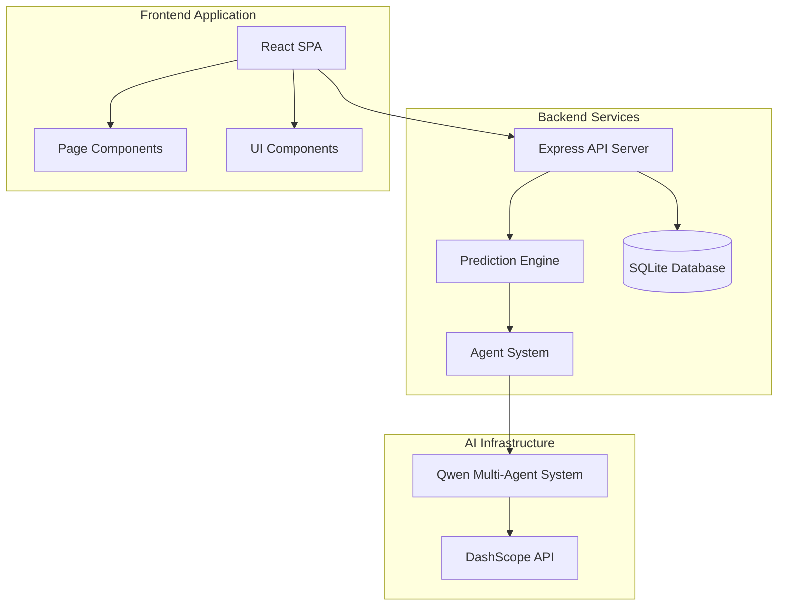
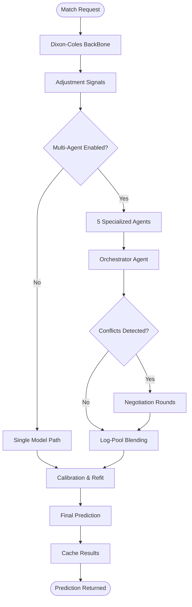
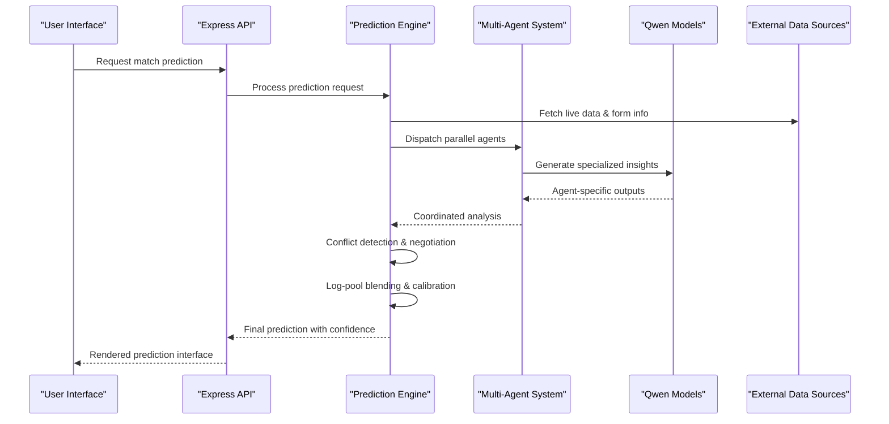
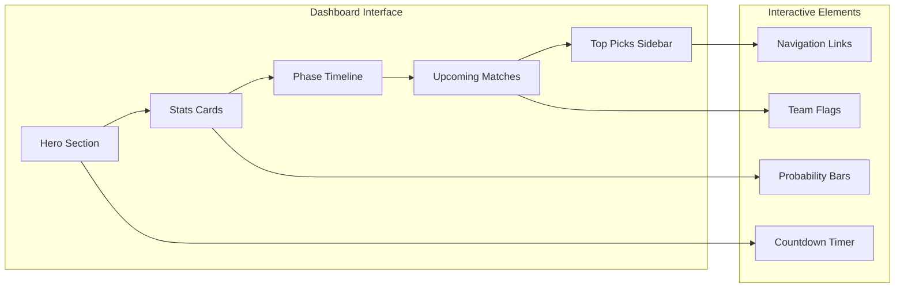
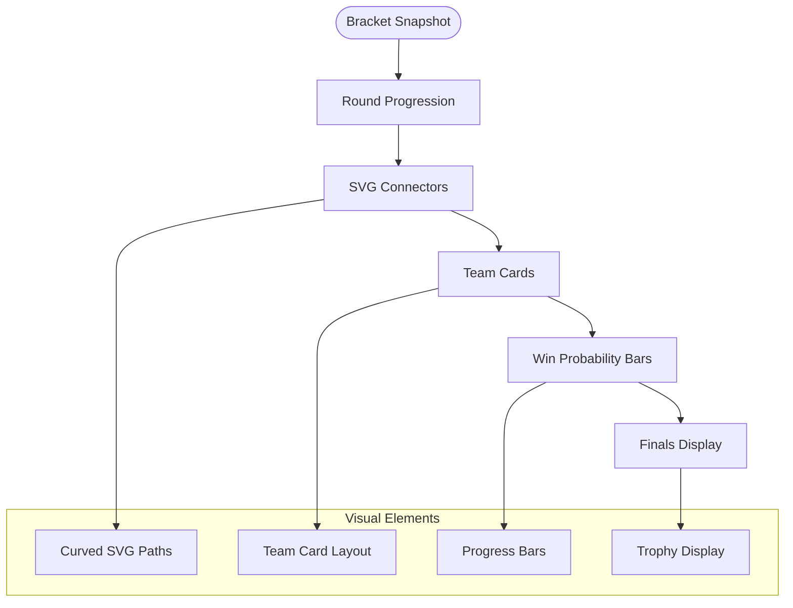
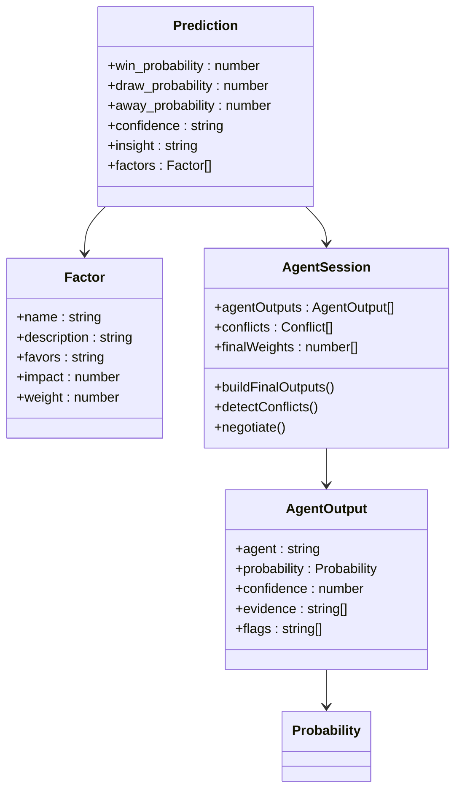
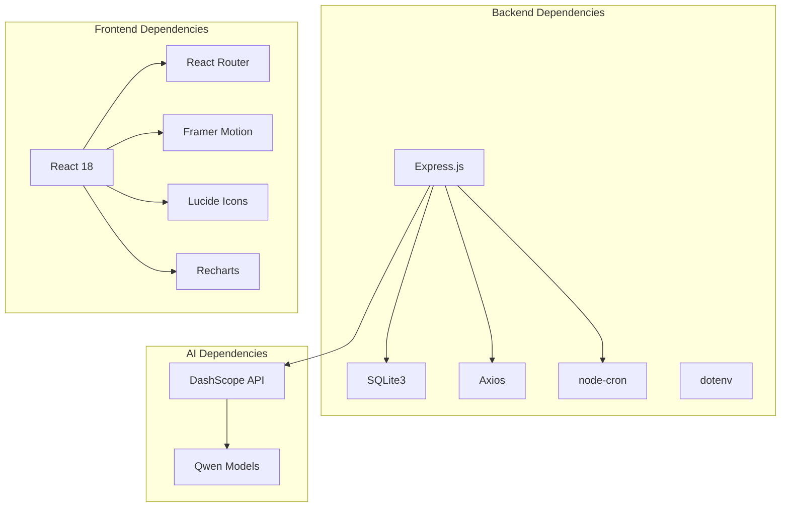

# Introduction and Goals

<cite>
**Referenced Files in This Document**
- [README.md](file://README.md)
- [SPEC.md](file://specs/SPEC.md)
- [SPEC-PREDICT.md](file://specs/SPEC-PREDICT.md)
- [SETUP.md](file://SETUP.md)
- [predictionEngine.js](file://backend/services/predictionEngine.js)
- [orchestratorAgent.js](file://backend/services/agents/orchestratorAgent.js)
- [statisticalAgent.js](file://backend/services/agents/statisticalAgent.js)
- [h2hAgent.js](file://backend/services/agents/h2hAgent.js)
- [formAgent.js](file://backend/services/agents/formAgent.js)
- [Dashboard.jsx](file://frontend/src/pages/Dashboard.jsx)
- [Tournament.jsx](file://frontend/src/pages/Tournament.jsx)
</cite>

## Table of Contents
1. [Introduction](#introduction)
2. [Project Structure](#project-structure)
3. [Core Components](#core-components)
4. [Architecture Overview](#architecture-overview)
5. [Detailed Component Analysis](#detailed-component-analysis)
6. [Dependency Analysis](#dependency-analysis)
7. [Performance Considerations](#performance-considerations)
8. [Troubleshooting Guide](#troubleshooting-guide)
9. [Conclusion](#conclusion)

## Introduction

WC26-Qwen-Qoder is an AI-powered sports prediction platform designed to deliver intelligent World Cup 2026 predictions using Alibaba Cloud's Qwen multi-agent AI system. The project transforms complex football analytics into accessible, transparent insights for fans, analysts, and researchers around the globe.

### Mission Statement

The platform's mission is to provide accurate, explainable, and continuously evolving match outcome predictions for the 2026 FIFA World Cup, which will be hosted across the United States, Canada, and Mexico from June 11 to July 19, 2026. By combining advanced statistical modeling with cutting-edge AI reasoning, WC26-Qwen-Qoder aims to become the definitive source for intelligent sports prediction analytics.

### Unique Value Proposition

WC26-Qwen-Qoder stands apart as the first AI-powered sports prediction platform to offer:
- **Transparent Multi-Agent Reasoning**: Five specialized Qwen agents work collaboratively, each bringing unique expertise to the prediction process
- **Real-Time Data Integration**: Seamless synchronization with live scores, team form data, and pre-match intelligence
- **Comprehensive Analytics**: From group stage to final, every match receives detailed statistical analysis with confidence metrics
- **Fan Engagement Platform**: Interactive dashboard, match-by-match breakdowns, and historical context that makes complex analytics accessible to all users

### Target Audience

The platform serves diverse stakeholders:
- **Sports Enthusiasts**: Casual fans seeking engaging predictions and match insights
- **Analysts and Researchers**: Sports scientists and data analysts requiring comprehensive statistical frameworks
- **Betters and Gamblers**: Individuals seeking informed betting strategies with transparent reasoning
- **Media Professionals**: Journalists and broadcasters needing reliable predictive analytics
- **Academic Institutions**: Students and educators studying sports analytics and AI applications

### Project Timeline Context

The World Cup 2026 represents a historic milestone in global sports, featuring 48 teams competing across 12 groups in 104 matches. WC26-Qwen-Qoder positions itself as a comprehensive predictive analytics platform that will evolve throughout the tournament, providing real-time insights and historical analysis that captures the full scope of this unprecedented sporting event.

## Project Structure

The WC26-Qwen-Qoder ecosystem consists of two primary components working in harmony:

**Diagram sources**
- [README.md:153-209](file://README.md#L153-L209)
- [SETUP.md:163-224](file://SETUP.md#L163-L224)

The backend employs a modular architecture with specialized services for prediction processing, agent coordination, and data management. The frontend utilizes modern React patterns with mobile-first design principles and comprehensive internationalization support.

**Section sources**
- [README.md:153-209](file://README.md#L153-L209)
- [SETUP.md:163-224](file://SETUP.md#L163-L224)

## Core Components

### Prediction Engine Architecture

The heart of WC26-Qwen-Qoder lies in its sophisticated prediction engine that combines statistical rigor with AI-powered reasoning:

**Diagram sources**
- [predictionEngine.js:665-800](file://backend/services/predictionEngine.js#L665-L800)
- [orchestratorAgent.js:288-468](file://backend/services/agents/orchestratorAgent.js#L288-L468)

### Multi-Agent System

The platform employs a sophisticated five-agent system that mirrors human analytical thinking:

| Agent | Model | Expertise | Data Source |
|-------|-------|-----------|-------------|
| **StatisticalAgent** | qwen-plus | Mathematical modeling | Dixon-Coles λ values, ELO ratings, home advantage |
| **H2HAgent** | qwen-turbo | Historical patterns | 47k+ international matches dataset |
| **FormAgent** | qwen-turbo | Recent performance | Last 10 matches with competition weighting |
| **IntelAgent** | qwen-plus | Pre-match intelligence | Injuries, rotation, motivation signals |
| **LineupAgent** | qwen-plus | Tactical analysis | Confirmed starting XI data |

**Section sources**
- [README.md:18-105](file://README.md#L18-L105)
- [SPEC.md:148-159](file://specs/SPEC.md#L148-L159)

## Architecture Overview

The WC26-Qwen-Qoder architecture demonstrates a clean separation of concerns with robust data flow and AI integration:

**Diagram sources**
- [orchestratorAgent.js:288-468](file://backend/services/agents/orchestratorAgent.js#L288-L468)
- [predictionEngine.js:665-800](file://backend/services/predictionEngine.js#L665-L800)

The architecture ensures scalability, transparency, and reliability through:
- **Parallel Processing**: Five agents operate simultaneously for comprehensive analysis
- **Conflict Resolution**: Built-in negotiation system handles contradictory signals
- **Real-Time Updates**: Live data integration maintains prediction accuracy
- **Model Calibration**: Continuous learning through match result feedback

## Detailed Component Analysis

### Frontend Dashboard Experience

The frontend delivers an immersive experience designed for both casual fans and serious analysts:

**Diagram sources**
- [Dashboard.jsx:137-600](file://frontend/src/pages/Dashboard.jsx#L137-L600)

The dashboard showcases the tournament's current phase, top contenders, accuracy metrics, and upcoming fixtures while maintaining visual appeal through culturally inspired design elements.

### Tournament Bracket Visualization

The knockout stage presentation provides sophisticated bracket visualization with predictive capabilities:

**Diagram sources**
- [Tournament.jsx:71-182](file://frontend/src/pages/Tournament.jsx#L71-L182)
- [Tournament.jsx:184-262](file://frontend/src/pages/Tournament.jsx#L184-L262)

**Section sources**
- [Dashboard.jsx:137-600](file://frontend/src/pages/Dashboard.jsx#L137-L600)
- [Tournament.jsx:71-182](file://frontend/src/pages/Tournament.jsx#L71-L182)

### Prediction Transparency System

WC26-Qwen-Qoder emphasizes transparency through detailed explanation of prediction methodologies:

**Diagram sources**
- [predictionEngine.js:462-583](file://backend/services/predictionEngine.js#L462-L583)
- [orchestratorAgent.js:158-191](file://backend/services/agents/orchestratorAgent.js#L158-L191)

**Section sources**
- [predictionEngine.js:462-583](file://backend/services/predictionEngine.js#L462-L583)
- [SPEC-PREDICT.md:8-47](file://specs/SPEC-PREDICT.md#L8-L47)

## Dependency Analysis

The project exhibits well-managed dependencies that balance functionality with maintainability:

**Diagram sources**
- [backend/package.json:14-31](file://backend/package.json#L14-L31)
- [frontend/package.json:38-71](file://frontend/package.json#L38-L71)

The dependency structure supports:
- **Scalable Backend**: Modular Express.js architecture with efficient database operations
- **Modern Frontend**: Component-based React design with smooth animations and transitions
- **AI Integration**: Clean separation between prediction logic and external AI services
- **Development Workflow**: Comprehensive testing and development tooling

**Section sources**
- [backend/package.json:14-31](file://backend/package.json#L14-L31)
- [frontend/package.json:38-71](file://frontend/package.json#L38-L71)

## Performance Considerations

WC26-Qwen-Qoder implements several performance optimization strategies:

### Prediction Processing Efficiency
- **Parallel Agent Execution**: Five agents process simultaneously, reducing prediction latency
- **Intelligent Caching**: Prediction results cached with automatic refresh mechanisms
- **Selective Model Loading**: Multi-agent system only activated when enabled via environment variable
- **Database Optimization**: SQLite with WAL mode for concurrent access and improved performance

### Frontend Performance
- **Code Splitting**: Route-based lazy loading reduces initial bundle size
- **Component Memoization**: React.memo usage for expensive components
- **SVG Optimizations**: Vector graphics for scalable team flags and decorative elements
- **Responsive Design**: Mobile-first approach with progressive enhancement

### Data Management
- **Incremental Updates**: Only active tournament stage predictions processed
- **Batch Operations**: Parallel data fetching for team form, H2H records, and lineup data
- **Efficient Rendering**: Virtualized lists for match schedules and group tables

## Troubleshooting Guide

### Common Issues and Solutions

**API Key Configuration**
- **Issue**: Predictions fail without AI insights
- **Solution**: Verify DASHSCOPE_API_KEY in .env file
- **Impact**: Falls back to template-based insights and basic statistical predictions

**Live Data Integration**
- **Issue**: Missing live scores or form data
- **Solution**: Configure FOOTBALL_DATA_API_KEY for enhanced predictions
- **Impact**: Uses synthetic data based on FIFA rankings and historical patterns

**Multi-Agent System**
- **Issue**: Slow prediction response times
- **Solution**: Set USE_MULTI_AGENT=false for faster single-model predictions
- **Impact**: Reduced accuracy but improved performance for high-volume scenarios

**Database Connectivity**
- **Issue**: Application fails to start
- **Solution**: Ensure database seeding completed successfully
- **Impact**: Initial data required for team information and fixture scheduling

**Section sources**
- [SETUP.md:53-63](file://SETUP.md#L53-L63)
- [README.md:139-151](file://README.md#L139-L151)

## Conclusion

WC26-Qwen-Qoder represents a paradigm shift in sports prediction analytics, combining rigorous statistical modeling with transparent AI reasoning to serve a diverse global audience. The platform's commitment to accuracy, transparency, and accessibility positions it as the premier destination for World Cup 2026 predictive analytics.

Through its innovative multi-agent architecture, comprehensive data integration, and user-centric design, WC26-Qwen-Qoder delivers not just predictions, but understanding—the essential ingredient for meaningful sports engagement in the AI era. As the world's attention turns to the 2026 FIFA World Cup, this platform stands ready to illuminate the beautiful game with intelligent, data-driven insights that honor both tradition and innovation.

The project's foundation in Alibaba Cloud's Qwen technology, combined with its modular architecture and comprehensive feature set, ensures sustainable growth and adaptation for future tournaments and sports analytics applications. WC26-Qwen-Qoder doesn't just predict outcomes—it explains the reasoning behind them, fostering deeper appreciation for the complexities of competitive football.