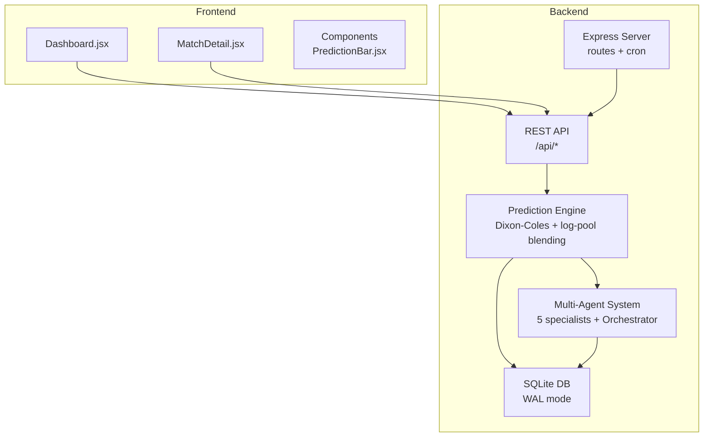
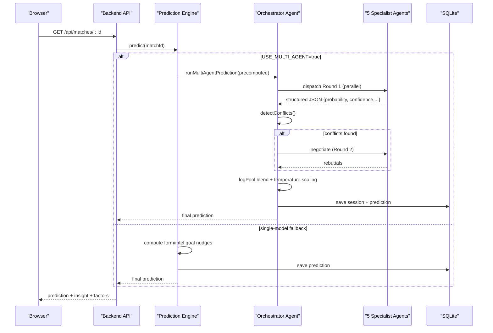
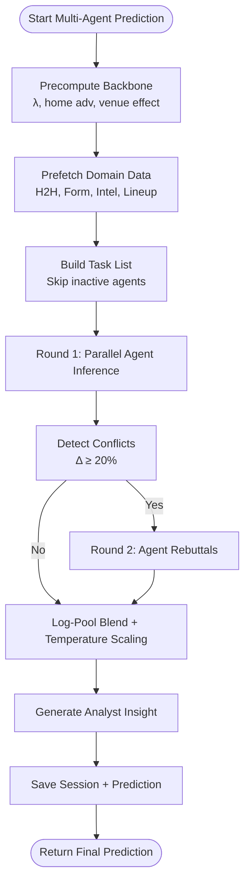
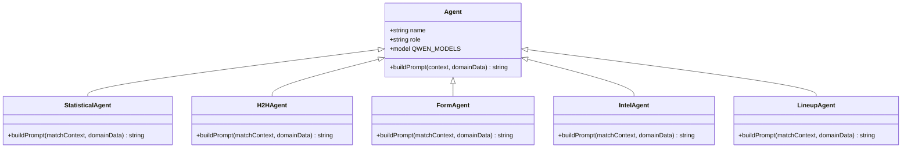
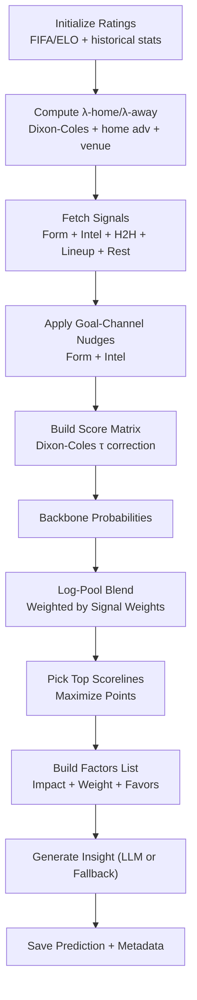
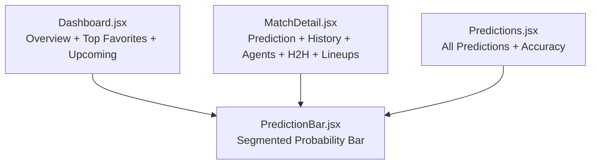
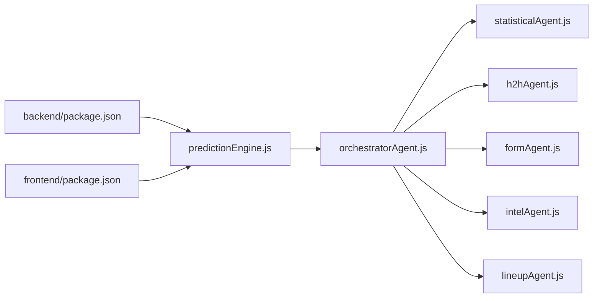

# Introduction and Purpose

<cite>
**Referenced Files in This Document**
- [README.md](file://README.md)
- [SPEC.md](file://specs/SPEC.md)
- [SPEC-PREDICT.md](file://specs/SPEC-PREDICT.md)
- [AGENTS.md](file://AGENTS.md)
- [predictionEngine.js](file://backend/services/predictionEngine.js)
- [orchestratorAgent.js](file://backend/services/agents/orchestratorAgent.js)
- [statisticalAgent.js](file://backend/services/agents/statisticalAgent.js)
- [formAgent.js](file://backend/services/agents/formAgent.js)
- [h2hAgent.js](file://backend/services/agents/h2hAgent.js)
- [intelAgent.js](file://backend/services/agents/intelAgent.js)
- [lineupAgent.js](file://backend/services/agents/lineupAgent.js)
- [Dashboard.jsx](file://frontend/src/pages/Dashboard.jsx)
- [MatchDetail.jsx](file://frontend/src/pages/MatchDetail.jsx)
- [PredictionBar.jsx](file://frontend/src/components/PredictionBar.jsx)
- [package.json](file://backend/package.json)
- [package.json](file://frontend/package.json)
</cite>

## Table of Contents
1. [Introduction](#introduction)
2. [Project Structure](#project-structure)
3. [Core Components](#core-components)
4. [Architecture Overview](#architecture-overview)
5. [Detailed Component Analysis](#detailed-component-analysis)
6. [Dependency Analysis](#dependency-analysis)
7. [Performance Considerations](#performance-considerations)
8. [Troubleshooting Guide](#troubleshooting-guide)
9. [Conclusion](#conclusion)
10. [Appendices](#appendices)

## Introduction
The World Cup 2026 Prediction App is an AI-powered platform designed to deliver comprehensive sports analytics for the FIFA World Cup 2026, spanning 48 teams, 72 group-stage fixtures, and a full knockout bracket culminating in the final. The project’s mission is to combine advanced statistical modeling with multi-agent artificial intelligence to provide accurate, explainable, and entertaining match outcome predictions. It serves three primary audiences:
- Entertainment: Engaging football fans with rich insights, interactive visuals, and narrative-driven analysis.
- Education: Demonstrating practical machine learning applications in sports forecasting, including hybrid modeling, calibration, and multi-agent reasoning.
- Research: Offering a reproducible, open-source foundation for sports analytics, with transparent methodologies and extensible architectures.

The platform blends a robust Dixon-Coles bivariate Poisson backbone with modern AI techniques, enabling nuanced probabilistic outcomes, top scoreline forecasts, and a human-readable analyst insight. It also supports a single-model fallback for environments without LLM access, ensuring usability across diverse deployment scenarios.

## Project Structure
The repository is organized into a full-stack application:
- Backend (Node.js/Express): Prediction engine, multi-agent orchestration, data services, and APIs.
- Frontend (React 18/Vite): Interactive dashboards, match detail views, and analytics displays.
- Specs: Product and prediction specifications for transparency and alignment.
- Scripts and DevOps: Seeding, testing, deployment automation, and ECS provisioning.

**Diagram sources**
- [README.md:153-210](file://README.md#L153-L210)
- [SPEC.md:31-122](file://specs/SPEC.md#L31-L122)
- [predictionEngine.js:1-120](file://backend/services/predictionEngine.js#L1-L120)
- [orchestratorAgent.js:1-60](file://backend/services/agents/orchestratorAgent.js#L1-L60)

**Section sources**
- [README.md:153-210](file://README.md#L153-L210)
- [SPEC.md:31-122](file://specs/SPEC.md#L31-L122)

## Core Components
- Prediction Engine (Dixon-Coles + log-pool blending): Computes baseline probabilities, adjusts for venue/home effects, and blends multiple signals into a coherent outcome.
- Multi-Agent Orchestration: Coordinates five specialized agents (Statistical, H2H, Form, Intel, Lineup) in parallel, detects conflicts, negotiates, and merges outputs via weighted log-pool blending.
- Frontend Dashboards: Provide real-time insights, match histories, and interactive visualizations for fans and analysts.
- Data Services: Integrate optional live feeds (football-data.org), web intelligence (Google News RSS), and lineup sourcing to enrich predictions.

Key capabilities:
- Win/draw/loss probabilities and top 3 scorelines with confidence tiers.
- Contributing factors and methodology transparency.
- Multi-agent dialogue panel for conflict detection and negotiation.
- Temperature scaling and Dixon-Coles ρ calibration for improved probability calibration.

**Section sources**
- [SPEC.md:125-177](file://specs/SPEC.md#L125-L177)
- [predictionEngine.js:1-120](file://backend/services/predictionEngine.js#L1-L120)
- [orchestratorAgent.js:1-120](file://backend/services/agents/orchestratorAgent.js#L1-L120)

## Architecture Overview
The system architecture integrates deterministic statistical modeling with AI-driven interpretation and synthesis. The backend’s prediction engine computes a baseline Dixon-Coles model, then applies adjustment signals (form, H2H, intel, lineup, rest days) via log-pool blending. When multi-agent mode is enabled, an orchestrator coordinates five agents that independently assess the same match, detect disagreements, negotiate, and converge to a final prediction.

**Diagram sources**
- [SPEC.md:148-158](file://specs/SPEC.md#L148-L158)
- [predictionEngine.js:690-800](file://backend/services/predictionEngine.js#L690-L800)
- [orchestratorAgent.js:309-500](file://backend/services/agents/orchestratorAgent.js#L309-L500)

## Detailed Component Analysis

### Multi-Agent Prediction System
The multi-agent system operates as follows:
- Precomputed backbone (Dixon-Coles λ values, home advantage, venue effects) is passed to the orchestrator.
- The orchestrator pre-fetches domain data (H2H, form, intel, lineup) and builds a task list for active agents.
- Round 1: All agents run in parallel, producing structured outputs with probabilities, confidence, evidence, and weight recommendations.
- Conflict detection: If pairwise probability deltas exceed a threshold, conflicts are flagged for negotiation.
- Round 2: Conflicting agents rebut each other’s arguments; winners retain higher weights, losers receive reduced weights.
- Final blend: Log-pool aggregation of agent probabilities, weighted by adjusted weights and confidence; temperature scaling is applied.
- Insight generation: A concise analyst commentary synthesizes the agents’ reasoning and outcomes.

**Diagram sources**
- [SPEC.md:148-158](file://specs/SPEC.md#L148-L158)
- [orchestratorAgent.js:398-469](file://backend/services/agents/orchestratorAgent.js#L398-L469)

**Section sources**
- [SPEC.md:148-158](file://specs/SPEC.md#L148-L158)
- [orchestratorAgent.js:1-120](file://backend/services/agents/orchestratorAgent.js#L1-L120)

### Specialist Agents
- Statistical Agent: Interprets the Dixon-Coles backbone (λ values, ELO gaps, α/β ratings) and contextualizes outcomes without recomputing Poisson math.
- H2H Agent: Analyzes a competition-weighted head-to-head dataset (~47k matches) and returns calibrated probabilities when sufficient meetings exist.
- Form Agent: Evaluates recent results with competition weighting and trend analysis.
- Intel Agent: Parses pre-match intelligence (injuries, motivation, rotation) and estimates probability shifts.
- Lineup Agent: Assesses confirmed starting XI strength and tactical matchups, activating only when lineup data is available.

**Diagram sources**
- [statisticalAgent.js:89-98](file://backend/services/agents/statisticalAgent.js#L89-L98)
- [h2hAgent.js:98-107](file://backend/services/agents/h2hAgent.js#L98-L107)
- [formAgent.js:104-113](file://backend/services/agents/formAgent.js#L104-L113)
- [intelAgent.js:118-128](file://backend/services/agents/intelAgent.js#L118-L128)
- [lineupAgent.js:108-118](file://backend/services/agents/lineupAgent.js#L108-L118)

**Section sources**
- [statisticalAgent.js:1-98](file://backend/services/agents/statisticalAgent.js#L1-L98)
- [h2hAgent.js:1-107](file://backend/services/agents/h2hAgent.js#L1-L107)
- [formAgent.js:1-113](file://backend/services/agents/formAgent.js#L1-L113)
- [intelAgent.js:1-128](file://backend/services/agents/intelAgent.js#L1-L128)
- [lineupAgent.js:1-118](file://backend/services/agents/lineupAgent.js#L1-L118)

### Prediction Engine (Dixon-Coles + Signals)
The prediction engine:
- Initializes team ratings from FIFA/ELO and historical scoring averages.
- Computes λ-home and λ-away using Dixon-Coles with home advantage and venue adjustments.
- Applies competition-weighted form and pre-match intelligence as goal-channel nudges.
- Blends signals via log-pool to preserve confidence and avoid arithmetic averaging artifacts.
- Derives top scorelines that maximize expected points under the scoring rule.
- Generates confidence tiers and a factors list for transparency.

**Diagram sources**
- [predictionEngine.js:135-238](file://backend/services/predictionEngine.js#L135-L238)
- [predictionEngine.js:461-604](file://backend/services/predictionEngine.js#L461-L604)

**Section sources**
- [predictionEngine.js:1-200](file://backend/services/predictionEngine.js#L1-L200)
- [SPEC.md:125-147](file://specs/SPEC.md#L125-L147)

### Frontend Dashboards and Educational Value
The frontend delivers:
- Dashboard: Tournament overview, top favorites, upcoming matches, and accuracy metrics.
- Match Detail: Full prediction breakdown, probability history, agent session viewer, H2H timeline, lineup formations, and suspensions.
- Predictions Page: Consolidated predictions vs actuals, accuracy stats, and filters.

These views serve educational goals by:
- Visualizing probability distributions and confidence levels.
- Exposing contributing factors and methodology weights.
- Showing prediction drift over time and agent negotiations.
- Providing a clean, mobile-first UX for global audiences.

**Diagram sources**
- [Dashboard.jsx:137-200](file://frontend/src/pages/Dashboard.jsx#L137-L200)
- [MatchDetail.jsx:723-800](file://frontend/src/pages/MatchDetail.jsx#L723-L800)
- [SPEC-PREDICT.md:1-147](file://specs/SPEC-PREDICT.md#L1-L147)
- [PredictionBar.jsx:1-51](file://frontend/src/components/PredictionBar.jsx#L1-L51)

**Section sources**
- [Dashboard.jsx:1-120](file://frontend/src/pages/Dashboard.jsx#L1-L120)
- [MatchDetail.jsx:1-120](file://frontend/src/pages/MatchDetail.jsx#L1-L120)
- [SPEC-PREDICT.md:1-147](file://specs/SPEC-PREDICT.md#L1-L147)

## Dependency Analysis
- Backend dependencies include Express, SQLite, Axios, Cheerio, CORS, dotenv, node-cron, and development tools.
- Frontend dependencies include React, React Router, Recharts, Tailwind, and testing libraries.
- The prediction engine depends on the orchestrator module and agent modules, which are lazily loaded to avoid circular dependencies.
- The orchestrator coordinates agent modules and saves session data to the database.

**Diagram sources**
- [package.json:1-32](file://backend/package.json#L1-L32)
- [package.json:1-72](file://frontend/package.json#L1-L72)
- [predictionEngine.js:45-53](file://backend/services/predictionEngine.js#L45-L53)
- [orchestratorAgent.js:28-38](file://backend/services/agents/orchestratorAgent.js#L28-L38)

**Section sources**
- [package.json:1-32](file://backend/package.json#L1-L32)
- [package.json:1-72](file://frontend/package.json#L1-L72)
- [predictionEngine.js:45-53](file://backend/services/predictionEngine.js#L45-L53)
- [orchestratorAgent.js:28-38](file://backend/services/agents/orchestratorAgent.js#L28-L38)

## Performance Considerations
- Multi-agent inference scales with the number of active agents and LLM calls; enable only when needed.
- Log-pool blending and temperature scaling improve probability calibration without heavy computation.
- Venue and home advantage adjustments are precomputed and cached to minimize runtime overhead.
- Frontend charts and grids are optimized for mobile-first rendering and lazy loading.

[No sources needed since this section provides general guidance]

## Troubleshooting Guide
Common operational checks:
- Verify environment variables for API keys and feature flags.
- Confirm database seeding and model configuration entries (e.g., temperature, Dixon-Coles ρ).
- Review agent session logs for parse errors or missing data.
- Ensure optional integrations (football-data.org, DashScope) are configured for full functionality.

**Section sources**
- [README.md:139-151](file://README.md#L139-L151)
- [SPEC.md:160-169](file://specs/SPEC.md#L160-L169)

## Conclusion
The World Cup 2026 Prediction App demonstrates an innovative hybrid approach that marries classical sports analytics (Dixon-Coles Poisson) with modern multi-agent AI. By combining deterministic modeling with interpretive agents, conflict detection, and negotiation, it achieves both accuracy and explainability. The platform offers educational value for learners, entertainment for fans, and analytical utility for researchers, while remaining adaptable to other tournaments and domains.

[No sources needed since this section summarizes without analyzing specific files]

## Appendices
- Open-source contribution: The project’s modular design, clear separation of concerns, and documented specs facilitate reuse and extension.
- Adaptability: The same framework can be adapted to other multi-team competitions by adjusting team pools, stages, and data sources.

[No sources needed since this section provides general guidance]