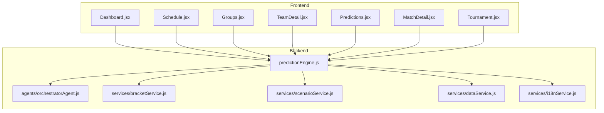
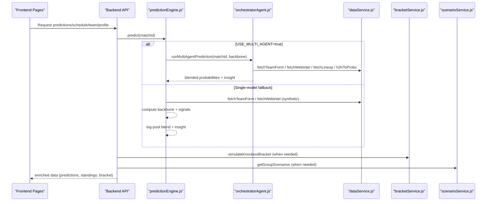
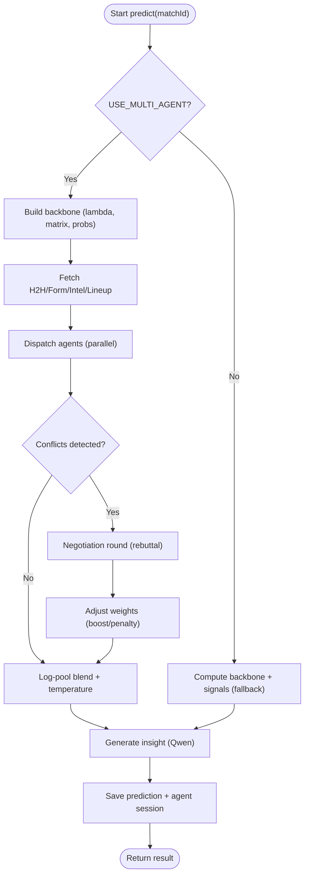
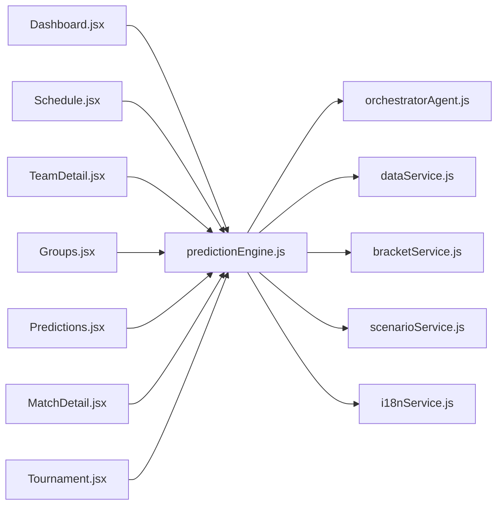

# Key Features

<cite>
**Referenced Files in This Document**
- [README.md](file://README.md)
- [predictionEngine.js](file://backend/services/predictionEngine.js)
- [orchestratorAgent.js](file://backend/services/agents/orchestratorAgent.js)
- [Dashboard.jsx](file://frontend/src/pages/Dashboard.jsx)
- [Schedule.jsx](file://frontend/src/pages/Schedule.jsx)
- [Groups.jsx](file://frontend/src/pages/Groups.jsx)
- [TeamDetail.jsx](file://frontend/src/pages/TeamDetail.jsx)
- [Predictions.jsx](file://frontend/src/pages/Predictions.jsx)
- [MatchDetail.jsx](file://frontend/src/pages/MatchDetail.jsx)
- [Tournament.jsx](file://frontend/src/pages/Tournament.jsx)
- [bracketService.js](file://backend/services/bracketService.js)
- [scenarioService.js](file://backend/services/scenarioService.js)
- [i18nService.js](file://backend/services/i18nService.js)
- [dataService.js](file://backend/services/dataService.js)
</cite>

## Table of Contents
1. [Introduction](#introduction)
2. [Project Structure](#project-structure)
3. [Core Components](#core-components)
4. [Architecture Overview](#architecture-overview)
5. [Detailed Component Analysis](#detailed-component-analysis)
6. [Dependency Analysis](#dependency-analysis)
7. [Performance Considerations](#performance-considerations)
8. [Troubleshooting Guide](#troubleshooting-guide)
9. [Conclusion](#conclusion)

## Introduction
This document presents the complete feature set of WC26-Qwen-Qoder, an AI-powered World Cup 2026 prediction platform. It focuses on how the multi-agent prediction engine, interactive dashboards, comprehensive schedule, team profiles, group stage tracking, knockout bracket visualization, prediction analytics, and multi-language support work together to deliver a rich analytical and user experience. Practical user workflows illustrate how each feature supports informed engagement with the tournament.

## Project Structure
The application is split into:
- Backend: Node.js/Express with SQLite, prediction engine, multi-agent orchestration, real-time data integration, and analytics services.
- Frontend: React 18 with Vite/Tailwind, localized UI, and modular pages for dashboard, schedule, groups, teams, predictions, and tournament bracket.

**Diagram sources**
- [predictionEngine.js:1-1020](file://backend/services/predictionEngine.js#L1-L1020)
- [orchestratorAgent.js:1-473](file://backend/services/agents/orchestratorAgent.js#L1-L473)
- [bracketService.js:1-1080](file://backend/services/bracketService.js#L1-L1080)
- [scenarioService.js:1-180](file://backend/services/scenarioService.js#L1-L180)
- [dataService.js:1-583](file://backend/services/dataService.js#L1-L583)
- [i18nService.js:1-116](file://backend/services/i18nService.js#L1-L116)
- [Dashboard.jsx:1-706](file://frontend/src/pages/Dashboard.jsx#L1-L706)
- [Schedule.jsx:1-494](file://frontend/src/pages/Schedule.jsx#L1-L494)
- [Groups.jsx:1-160](file://frontend/src/pages/Groups.jsx#L1-L160)
- [TeamDetail.jsx:1-392](file://frontend/src/pages/TeamDetail.jsx#L1-L392)
- [Predictions.jsx:1-514](file://frontend/src/pages/Predictions.jsx#L1-L514)
- [MatchDetail.jsx:1-800](file://frontend/src/pages/MatchDetail.jsx#L1-L800)
- [Tournament.jsx:1-444](file://frontend/src/pages/Tournament.jsx#L1-L444)

**Section sources**
- [README.md:1-263](file://README.md#L1-L263)

## Core Components
- AI-powered prediction engine with a multi-agent system that coordinates five specialized agents (Statistical, Form, H2H, Intel, Lineup) through an orchestrator with conflict detection and negotiation.
- Interactive dashboard showcasing today’s matches, tournament winner leaderboard, and progress indicators.
- Comprehensive match schedule with filtering, date grouping, and real-time status.
- Team profiles with ELO trajectories, group context, and upcoming fixtures.
- Group stage tracking with scenario analysis enumerating qualification possibilities.
- Knockout bracket visualization with predicted progression and Monte Carlo winner probabilities.
- Prediction analytics and historical accuracy tracking with scoring methodology.
- Multi-language support (English/Chinese) with on-demand translation of insights and factors.
- Real-time data integration from optional external sources (football-data.org) and web scraping.

**Section sources**
- [README.md:5-17](file://README.md#L5-L17)
- [predictionEngine.js:1-1020](file://backend/services/predictionEngine.js#L1-L1020)
- [orchestratorAgent.js:1-473](file://backend/services/agents/orchestratorAgent.js#L1-L473)
- [Dashboard.jsx:1-706](file://frontend/src/pages/Dashboard.jsx#L1-L706)
- [Schedule.jsx:1-494](file://frontend/src/pages/Schedule.jsx#L1-L494)
- [TeamDetail.jsx:1-392](file://frontend/src/pages/TeamDetail.jsx#L1-L392)
- [Groups.jsx:1-160](file://frontend/src/pages/Groups.jsx#L1-L160)
- [scenarioService.js:1-180](file://backend/services/scenarioService.js#L1-L180)
- [Tournament.jsx:1-444](file://frontend/src/pages/Tournament.jsx#L1-L444)
- [bracketService.js:1-1080](file://backend/services/bracketService.js#L1-L1080)
- [Predictions.jsx:1-514](file://frontend/src/pages/Predictions.jsx#L1-L514)
- [i18nService.js:1-116](file://backend/services/i18nService.js#L1-L116)
- [dataService.js:1-583](file://backend/services/dataService.js#L1-L583)

## Architecture Overview
The backend prediction pipeline builds deterministic probabilistic models enhanced by real-time signals. The multi-agent system parses structured outputs, detects conflicts, negotiates, and blends results using a log-pool method. The frontend renders dashboards and interactive views, while services integrate live data and compute analytics.

**Diagram sources**
- [predictionEngine.js:665-800](file://backend/services/predictionEngine.js#L665-L800)
- [orchestratorAgent.js:290-470](file://backend/services/agents/orchestratorAgent.js#L290-L470)
- [dataService.js:68-133](file://backend/services/dataService.js#L68-L133)
- [bracketService.js:485-704](file://backend/services/bracketService.js#L485-L704)
- [scenarioService.js:71-177](file://backend/services/scenarioService.js#L71-L177)

## Detailed Component Analysis

### AI-Powered Prediction Engine with Multi-Agent System
- Backbone: Dixon-Coles bivariate Poisson with online rating updates, venue and goal-rate adjustments, and log-pool blending of signals.
- Multi-agent system: Orchestrator dispatches agents in parallel, detects conflicts (≥20% delta), negotiates rebuttals, adjusts weights, and blends outputs with temperature scaling.
- Outputs: Probabilities, expected score, top-3 scorelines, confidence, factors, insight, and agent session metadata.
- Fallback: Single-model mode using synthetic signals when multi-agent is disabled.

**Diagram sources**
- [predictionEngine.js:665-800](file://backend/services/predictionEngine.js#L665-L800)
- [orchestratorAgent.js:290-470](file://backend/services/agents/orchestratorAgent.js#L290-L470)

**Section sources**
- [predictionEngine.js:1-1020](file://backend/services/predictionEngine.js#L1-L1020)
- [orchestratorAgent.js:1-473](file://backend/services/agents/orchestratorAgent.js#L1-L473)

### Interactive Dashboard
- Highlights today’s matches, tournament winner leaderboard, accuracy stats, and phase timeline.
- Provides quick access to top picks and navigation to the full bracket.
- Uses real-time data to reflect upcoming matches and live status.

Practical workflow:
- Open dashboard → review top teams and accuracy → browse upcoming matches → click a match to see detailed prediction.

**Section sources**
- [Dashboard.jsx:1-706](file://frontend/src/pages/Dashboard.jsx#L1-L706)

### Comprehensive Match Schedule
- Chronological list of all 104 matches with filtering by stage, group, status, and team.
- View modes: by date or by stage; includes live and completed indicators.
- Displays probabilities and confidence badges for quick assessment.

Practical workflow:
- Navigate to schedule → filter by group or status → sort by date → select a match → view prediction bar and details.

**Section sources**
- [Schedule.jsx:1-494](file://frontend/src/pages/Schedule.jsx#L1-L494)

### Team Profiles with Statistics
- ELO rating trajectory chart, group context, tournament stats, next match preview, and knockout journey.
- Live refresh for team pages on match days to reflect updated predictions.

Practical workflow:
- Go to teams → select a team → review ELO trend and stats → see group context and upcoming fixture → explore knockout path.

**Section sources**
- [TeamDetail.jsx:1-392](file://frontend/src/pages/TeamDetail.jsx#L1-L392)

### Group Stage Tracking with Scenario Analysis
- Enumerates qualification scenarios for groups with remaining matches, computing first/second/best-third outcomes across combinations.
- Provides summary metrics: always qualifies, never qualifies, qualify percentage.

Practical workflow:
- Open groups → select a group → review current standings → view scenario summary → explore remaining matches and outcomes.

**Section sources**
- [Groups.jsx:1-160](file://frontend/src/pages/Groups.jsx#L1-L160)
- [scenarioService.js:1-180](file://backend/services/scenarioService.js#L1-L180)

### Knockout Bracket Visualization with Simulation Capabilities
- Visual bracket with predicted winners from Round of 32 to Final, including third-place match.
- Monte Carlo simulations compute winner probabilities and generate “Road to Final” snapshots.
- Bracket service advances winners through rounds and resolves ties via H2H/ELO.

Practical workflow:
- Open tournament → switch between “Road to Final” and “Winner Probabilities” → compare predicted bracket with actual results → explore simulated paths.

**Section sources**
- [Tournament.jsx:1-444](file://frontend/src/pages/Tournament.jsx#L1-L444)
- [bracketService.js:1-1080](file://backend/services/bracketService.js#L1-L1080)

### Prediction Analytics and Historical Accuracy Tracking
- Consolidated predictions vs actual results with running accuracy stats and scoring methodology.
- Scoring rules reward exact score predictions and outcome correctness.

Practical workflow:
- Open predictions → filter by status/group → review match cards → compare predicted vs actual outcomes → track personal accuracy.

**Section sources**
- [Predictions.jsx:1-514](file://frontend/src/pages/Predictions.jsx#L1-L514)

### Multi-Language Support (English/Chinese)
- On-demand translation of insights, factors, and methodology using Qwen Turbo with in-memory caching.
- Maintains original numbers and team names; caches per match to minimize repeated calls.

Practical workflow:
- Switch language → view predictions and match details in Chinese → translations update dynamically.

**Section sources**
- [i18nService.js:1-116](file://backend/services/i18nService.js#L1-L116)

### Real-Time Data Integration from External Sources
- Optional integration with football-data.org for live scores and form data.
- Web scraping for injuries, suspensions, motivation, and squad rotation; LLM parsing with anti-hallucination verification.
- Live result synchronization and caching for performance.

Practical workflow:
- Enable API key → backend periodically syncs live results → frontend reflects live status and updated predictions.

**Section sources**
- [dataService.js:1-583](file://backend/services/dataService.js#L1-L583)

### Match Detail Deep Dive
- Prediction history panel with probability drift charts and snapshot logs.
- Agent session viewer showing parallel agent outputs, conflicts, and resolution.
- H2H timeline, suspensions panel, and lineup formation displays.

Practical workflow:
- Open match detail → review prediction history and confidence → inspect agent session and factors → check H2H and suspensions.

**Section sources**
- [MatchDetail.jsx:1-800](file://frontend/src/pages/MatchDetail.jsx#L1-L800)

## Dependency Analysis
The backend prediction engine depends on:
- Specialized agents orchestrated by the orchestrator.
- Data service for live signals (form, intel, H2H, lineups).
- Bracket and scenario services for tournament progression and analysis.
- i18n service for translation.

**Diagram sources**
- [predictionEngine.js:1-1020](file://backend/services/predictionEngine.js#L1-L1020)
- [orchestratorAgent.js:1-473](file://backend/services/agents/orchestratorAgent.js#L1-L473)
- [dataService.js:1-583](file://backend/services/dataService.js#L1-L583)
- [bracketService.js:1-1080](file://backend/services/bracketService.js#L1-L1080)
- [scenarioService.js:1-180](file://backend/services/scenarioService.js#L1-L180)
- [i18nService.js:1-116](file://backend/services/i18nService.js#L1-L116)
- [Dashboard.jsx:1-706](file://frontend/src/pages/Dashboard.jsx#L1-L706)
- [Schedule.jsx:1-494](file://frontend/src/pages/Schedule.jsx#L1-L494)
- [TeamDetail.jsx:1-392](file://frontend/src/pages/TeamDetail.jsx#L1-L392)
- [Groups.jsx:1-160](file://frontend/src/pages/Groups.jsx#L1-L160)
- [Predictions.jsx:1-514](file://frontend/src/pages/Predictions.jsx#L1-L514)
- [MatchDetail.jsx:1-800](file://frontend/src/pages/MatchDetail.jsx#L1-L800)
- [Tournament.jsx:1-444](file://frontend/src/pages/Tournament.jsx#L1-L444)

**Section sources**
- [README.md:153-209](file://README.md#L153-L209)

## Performance Considerations
- Multi-agent inference scales with parallel agent calls; use environment toggles to balance speed and nuance.
- Log-pool blending preserves confidence and avoids arithmetic averaging pitfalls.
- Caching for live data (form, H2H, intel) reduces repeated network calls.
- Monte Carlo simulations are configurable; cache invalidation ensures fresh results after model updates.

[No sources needed since this section provides general guidance]

## Troubleshooting Guide
- Multi-agent disabled: Set environment variable to enable multi-agent mode; otherwise, expect faster but less nuanced insights.
- Missing live data: Ensure API key is configured for football-data.org; otherwise, synthetic form and static H2H are used.
- Translation errors: i18n service falls back to English if LLM translation fails; verify API credentials and network connectivity.
- Bracket or scenario discrepancies: Confirm all group predictions exist before simulating knockout bracket; scenario counts cap at manageable limits.

**Section sources**
- [README.md:139-151](file://README.md#L139-L151)
- [i18nService.js:59-62](file://backend/services/i18nService.js#L59-L62)
- [bracketService.js:524-526](file://backend/services/bracketService.js#L524-L526)
- [scenarioService.js:7-9](file://backend/services/scenarioService.js#L7-L9)

## Conclusion
WC26-Qwen-Qoder combines a robust multi-agent prediction engine with intuitive, data-rich front-end experiences. Together, these features deliver actionable insights, real-time updates, and deep analytical capabilities that enhance fan engagement and strategic understanding of the tournament.