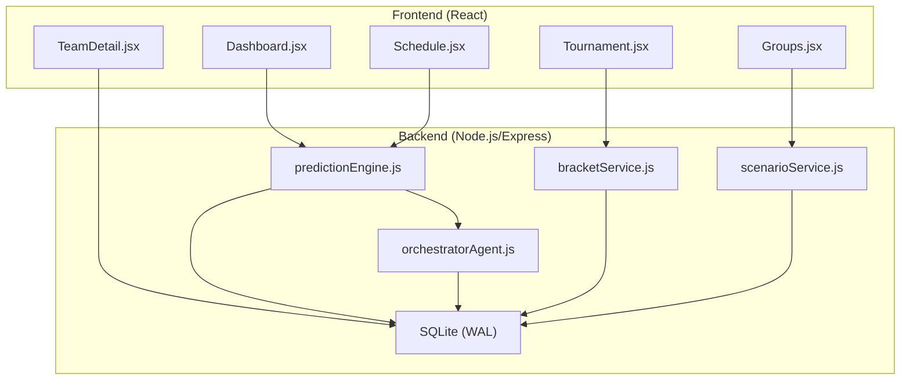
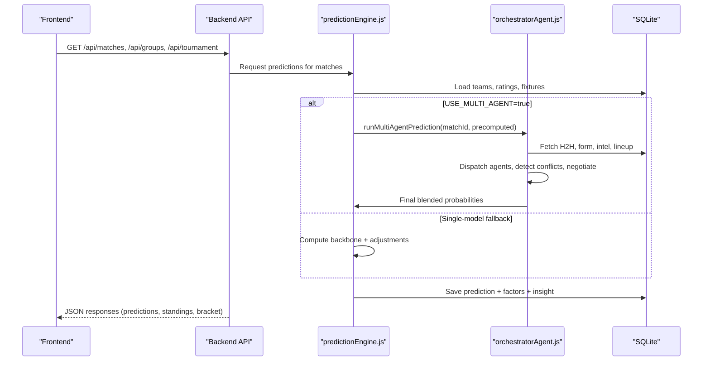
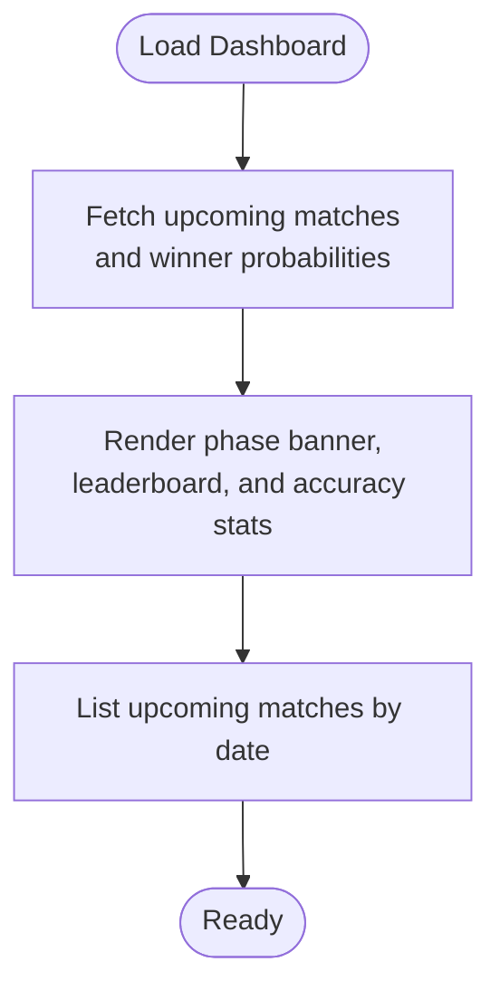
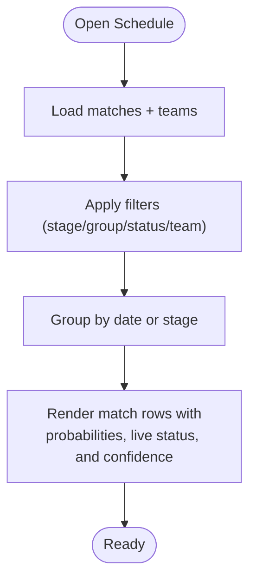
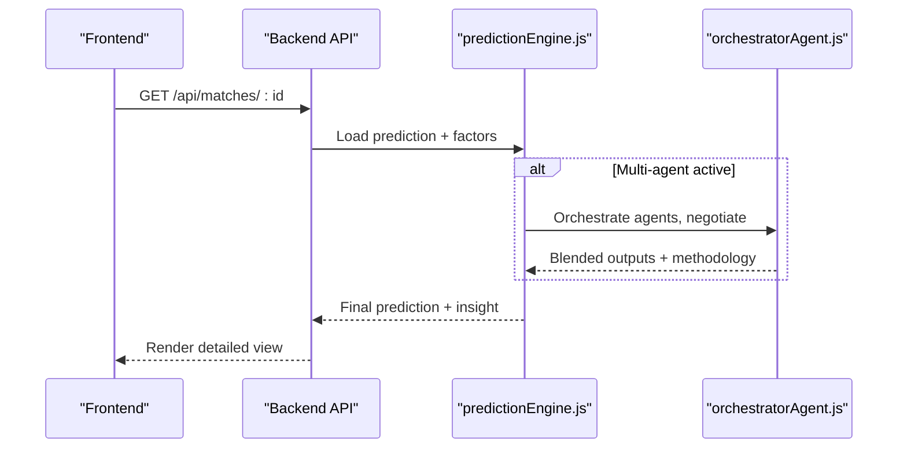
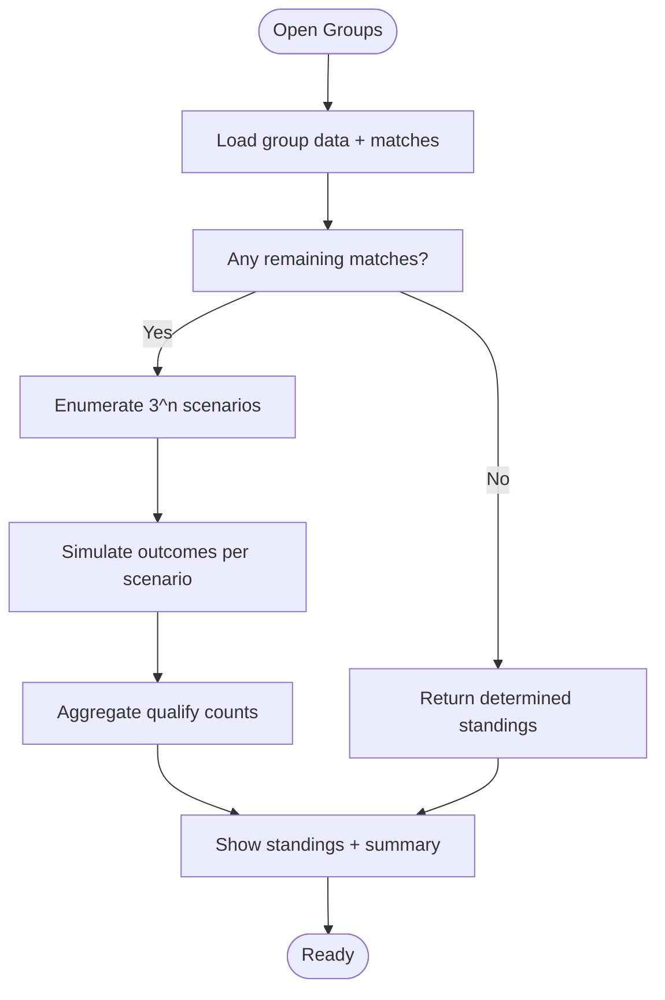
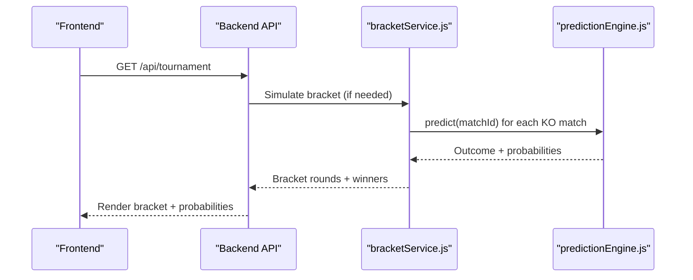
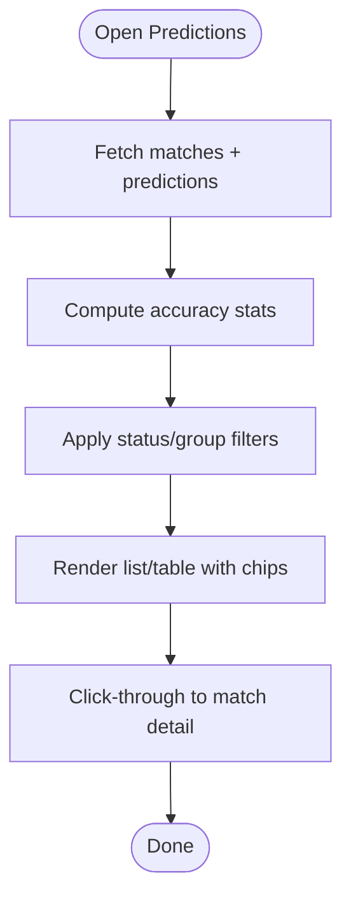
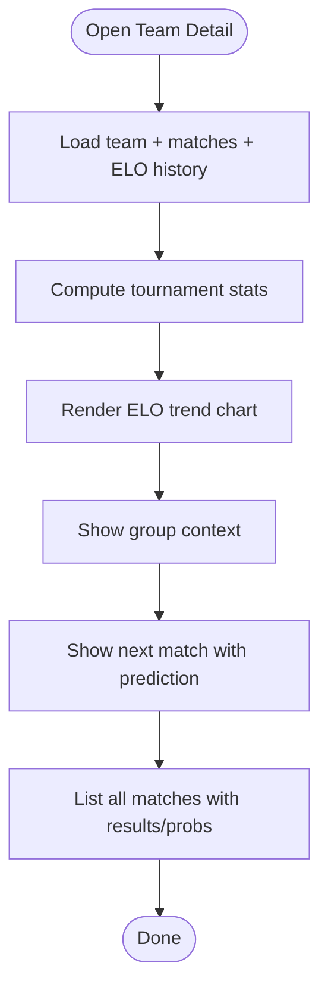
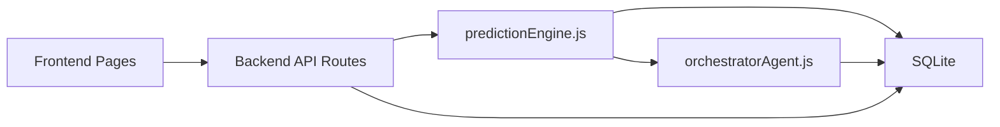

# Key Features

<cite>
**Referenced Files in This Document**
- [README.md](file://README.md)
- [SPEC.md](file://specs/SPEC.md)
- [SPEC-PREDICT.md](file://specs/SPEC-PREDICT.md)
- [backend/package.json](file://backend/package.json)
- [frontend/package.json](file://frontend/package.json)
- [frontend/src/pages/Dashboard.jsx](file://frontend/src/pages/Dashboard.jsx)
- [frontend/src/pages/Schedule.jsx](file://frontend/src/pages/Schedule.jsx)
- [frontend/src/pages/Groups.jsx](file://frontend/src/pages/Groups.jsx)
- [frontend/src/pages/Tournament.jsx](file://frontend/src/pages/Tournament.jsx)
- [frontend/src/pages/TeamDetail.jsx](file://frontend/src/pages/TeamDetail.jsx)
- [backend/services/predictionEngine.js](file://backend/services/predictionEngine.js)
- [backend/services/agents/orchestratorAgent.js](file://backend/services/agents/orchestratorAgent.js)
- [backend/services/bracketService.js](file://backend/services/bracketService.js)
- [backend/services/scenarioService.js](file://backend/services/scenarioService.js)
- [backend/data/teams.js](file://backend/data/teams.js)
</cite>

## Table of Contents
1. [Introduction](#introduction)
2. [Project Structure](#project-structure)
3. [Core Components](#core-components)
4. [Architecture Overview](#architecture-overview)
5. [Detailed Component Analysis](#detailed-component-analysis)
6. [Dependency Analysis](#dependency-analysis)
7. [Performance Considerations](#performance-considerations)
8. [Troubleshooting Guide](#troubleshooting-guide)
9. [Conclusion](#conclusion)

## Introduction
This document details the World Cup 2026 Prediction App’s key features and capabilities. It covers the comprehensive dashboard with real-time match updates and prediction insights, interactive schedule management with fixture tracking and result updates, the advanced prediction system with probability distributions and confidence levels, group stage standings with dynamic scenario analysis and qualification probability calculations, knockout bracket visualization with Monte Carlo simulation results and progression charts, the bilingual interface supporting both English and Chinese users, team detail pages with historical performance and upcoming fixture analysis, and predictive analytics with model accuracy metrics and performance tracking. Concrete user workflows are included to demonstrate how each feature enhances the overall user experience.

## Project Structure
The application follows a modern full-stack architecture:
- Frontend: React 18 with Vite, Tailwind CSS, and Recharts for data visualization
- Backend: Node.js/Express serving predictions, standings, and bracket simulations
- Data: SQLite (WAL mode) with seeded teams and fixtures; optional integrations for live scores and intelligence
- AI: Alibaba Cloud DashScope Qwen models powering the multi-agent prediction system

**Diagram sources**
- [frontend/src/pages/Dashboard.jsx](file://frontend/src/pages/Dashboard.jsx)
- [frontend/src/pages/Schedule.jsx](file://frontend/src/pages/Schedule.jsx)
- [frontend/src/pages/Groups.jsx](file://frontend/src/pages/Groups.jsx)
- [frontend/src/pages/Tournament.jsx](file://frontend/src/pages/Tournament.jsx)
- [frontend/src/pages/TeamDetail.jsx](file://frontend/src/pages/TeamDetail.jsx)
- [backend/services/predictionEngine.js](file://backend/services/predictionEngine.js)
- [backend/services/agents/orchestratorAgent.js](file://backend/services/agents/orchestratorAgent.js)
- [backend/services/bracketService.js](file://backend/services/bracketService.js)
- [backend/services/scenarioService.js](file://backend/services/scenarioService.js)

**Section sources**
- [README.md](file://README.md)
- [backend/package.json](file://backend/package.json)
- [frontend/package.json](file://frontend/package.json)

## Core Components
- Dashboard: Today’s matches, tournament winner leaderboard, overall accuracy, and phase progress
- Schedule: Chronological list of all 104 matches with filters by stage, group, status, and team
- Match Detail: Probabilities, top scorelines, confidence, factors, multi-agent dialogue, and insights
- Group Standings: Points table, qualification indicators, and “what-if” scenario calculator
- Knockout Bracket: Visual bracket with predicted winners, Monte Carlo simulations, and Road to Final
- Predictions: Consolidated view of every prediction vs actual result with accuracy stats
- Team Detail: Team identity, group context, match history, ELO trajectory, and upcoming fixtures
- Analytics: Model accuracy metrics and performance tracking

**Section sources**
- [README.md](file://README.md)
- [SPEC.md](file://specs/SPEC.md)

## Architecture Overview
The backend prediction pipeline integrates a robust Dixon-Coles Poisson backbone with optional multi-agent Qwen specialists. Predictions are blended via log-pooling, calibrated with temperature scaling, and saved with supporting metadata. The frontend consumes these APIs to render rich, real-time views.

**Diagram sources**
- [backend/services/predictionEngine.js](file://backend/services/predictionEngine.js)
- [backend/services/agents/orchestratorAgent.js](file://backend/services/agents/orchestratorAgent.js)
- [frontend/src/pages/Schedule.jsx](file://frontend/src/pages/Schedule.jsx)
- [frontend/src/pages/Groups.jsx](file://frontend/src/pages/Groups.jsx)
- [frontend/src/pages/Tournament.jsx](file://frontend/src/pages/Tournament.jsx)

## Detailed Component Analysis

### Dashboard — Real-Time Updates and Leaderboard
The dashboard highlights:
- Current tournament phase and countdown to the next match
- Top tournament winner probabilities (leaderboard)
- Overall prediction accuracy and outcome accuracy
- Upcoming matches grouped by date with quick prediction summaries

**Diagram sources**
- [frontend/src/pages/Dashboard.jsx](file://frontend/src/pages/Dashboard.jsx)

**Section sources**
- [frontend/src/pages/Dashboard.jsx](file://frontend/src/pages/Dashboard.jsx)
- [SPEC.md](file://specs/SPEC.md)

### Schedule — Interactive Fixture Tracking
The schedule page offers:
- Chronological list of all 104 matches
- Filters by stage, group, status, and team
- Search by team or venue
- View modes: date-based and stage-based
- Probability bars for upcoming matches and live badges

**Diagram sources**
- [frontend/src/pages/Schedule.jsx](file://frontend/src/pages/Schedule.jsx)

**Section sources**
- [frontend/src/pages/Schedule.jsx](file://frontend/src/pages/Schedule.jsx)
- [SPEC.md](file://specs/SPEC.md)

### Match Detail — Prediction Insights and Factors
The match detail page presents:
- Match header with flags, kickoff time (SGT), venue, and stage
- Full prediction: probabilities, top 3 scorelines, confidence
- Contributing factors and their impacts
- Multi-agent dialogue panel (when enabled)
- Historical prediction snapshots
- Head-to-head record, lineup strength, suspensions

**Diagram sources**
- [backend/services/predictionEngine.js](file://backend/services/predictionEngine.js)
- [backend/services/agents/orchestratorAgent.js](file://backend/services/agents/orchestratorAgent.js)
- [frontend/src/pages/Schedule.jsx](file://frontend/src/pages/Schedule.jsx)

**Section sources**
- [SPEC.md](file://specs/SPEC.md)
- [SPEC-PREDICT.md](file://specs/SPEC-PREDICT.md)

### Group Standings — Dynamic Scenario Analysis
Features:
- Points table with qualification indicators
- Remaining matches with predictions
- “What-if” scenario calculator enumerating possible outcomes and qualification probabilities
- Summary statistics per team (always qualifies, never qualifies, qualify count)

**Diagram sources**
- [frontend/src/pages/Groups.jsx](file://frontend/src/pages/Groups.jsx)
- [backend/services/scenarioService.js](file://backend/services/scenarioService.js)

**Section sources**
- [SPEC.md](file://specs/SPEC.md)
- [backend/services/scenarioService.js](file://backend/services/scenarioService.js)

### Knockout Bracket — Monte Carlo Simulation and Progression
Capabilities:
- Visual bracket from Round of 32 through Final
- Completed rounds show actual results; future rounds show predicted winners
- Tournament winner probabilities via Monte Carlo simulation
- Road to Final view with selectable snapshots
- Automatic bracket progression after each knockout match

**Diagram sources**
- [frontend/src/pages/Tournament.jsx](file://frontend/src/pages/Tournament.jsx)
- [backend/services/bracketService.js](file://backend/services/bracketService.js)
- [backend/services/predictionEngine.js](file://backend/services/predictionEngine.js)

**Section sources**
- [SPEC.md](file://specs/SPEC.md)
- [backend/services/bracketService.js](file://backend/services/bracketService.js)

### Predictions — Model Accuracy and Accountability
The predictions page:
- Shows every model forecast alongside actual results
- Provides summary stats: predictions made, correct count, accuracy percentage
- Supports filters by status and group
- Uses color-coded chips for predicted vs actual outcomes
- Links to match detail for deeper analysis

**Diagram sources**
- [SPEC-PREDICT.md](file://specs/SPEC-PREDICT.md)
- [frontend/src/pages/Schedule.jsx](file://frontend/src/pages/Schedule.jsx)

**Section sources**
- [SPEC-PREDICT.md](file://specs/SPEC-PREDICT.md)

### Team Detail — Performance and Upcoming Analysis
The team detail page:
- Team identity, group, FIFA rank, ELO rating
- Tournament stats (played, record, goals, points)
- ELO trajectory chart
- Group context and upcoming fixtures
- Knockout journey and all matches with results and probabilities

**Diagram sources**
- [frontend/src/pages/TeamDetail.jsx](file://frontend/src/pages/TeamDetail.jsx)
- [backend/data/teams.js](file://backend/data/teams.js)

**Section sources**
- [SPEC.md](file://specs/SPEC.md)
- [frontend/src/pages/TeamDetail.jsx](file://frontend/src/pages/TeamDetail.jsx)

### Bilingual Interface — English and Chinese Support
The app supports a bilingual interface:
- Language toggle between English and Chinese
- Translations integrated across UI components and pages
- Consistent i18n usage in components and pages

**Section sources**
- [README.md](file://README.md)
- [frontend/package.json](file://frontend/package.json)

### Predictive Analytics — Accuracy Metrics and Performance Tracking
The system tracks:
- Model accuracy using Brier score and outcome correctness
- Calibration via temperature scaling and Dixon-Coles ρ refit
- Periodic model retraining and evaluation windows
- Confidence levels and factor impacts for interpretability

**Section sources**
- [SPEC.md](file://specs/SPEC.md)
- [backend/services/predictionEngine.js](file://backend/services/predictionEngine.js)

## Dependency Analysis
The frontend and backend collaborate through well-defined APIs. The prediction engine depends on:
- SQLite for persistence
- Optional external integrations for live scores and intelligence
- Qwen models for multi-agent orchestration and insights

**Diagram sources**
- [frontend/src/pages/Dashboard.jsx](file://frontend/src/pages/Dashboard.jsx)
- [frontend/src/pages/Schedule.jsx](file://frontend/src/pages/Schedule.jsx)
- [frontend/src/pages/Groups.jsx](file://frontend/src/pages/Groups.jsx)
- [frontend/src/pages/Tournament.jsx](file://frontend/src/pages/Tournament.jsx)
- [frontend/src/pages/TeamDetail.jsx](file://frontend/src/pages/TeamDetail.jsx)
- [backend/services/predictionEngine.js](file://backend/services/predictionEngine.js)
- [backend/services/agents/orchestratorAgent.js](file://backend/services/agents/orchestratorAgent.js)

**Section sources**
- [backend/package.json](file://backend/package.json)
- [frontend/package.json](file://frontend/package.json)

## Performance Considerations
- Frontend: React components optimized with memoization and responsive charts; pre-rendering for static pages
- Backend: SQLite WAL mode for concurrent reads/writes; caching of predictions; parallel data fetching for schedules
- Prediction engine: Efficient Poisson matrix computation; log-pool blending; temperature scaling for calibration
- Multi-agent: Parallel agent dispatch with conflict detection and negotiation; session persistence for reproducibility

[No sources needed since this section provides general guidance]

## Troubleshooting Guide
Common issues and resolutions:
- Missing predictions for a match: Check if the match is scheduled and awaiting live data; predictions lock after kickoff
- No results shown in Predictions: Ensure matches have completed and predictions were generated
- Multi-agent disabled: Set USE_MULTI_AGENT=true and provide a DashScope API key for richer insights
- Live score integration: Enable FOOTBALL_DATA_API_KEY for automatic updates and standings recalculations
- Database initialization: Seed the database using the provided script to populate teams and fixtures

**Section sources**
- [SPEC.md](file://specs/SPEC.md)
- [README.md](file://README.md)

## Conclusion
The World Cup 2026 Prediction App delivers a comprehensive, real-time, and highly transparent prediction experience. Its multi-agent AI system, combined with rich visualizations and deep analytical tools, empowers fans to track the tournament, understand outcomes, and anticipate future results with confidence. The bilingual interface and performance-focused architecture ensure accessibility and responsiveness across diverse user needs.