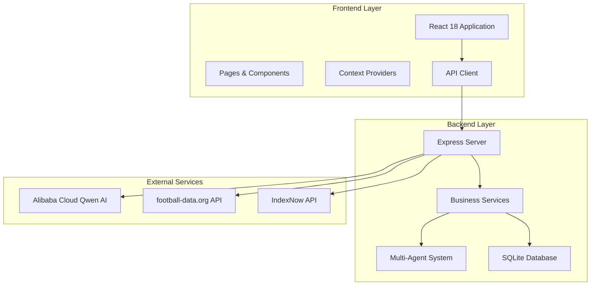
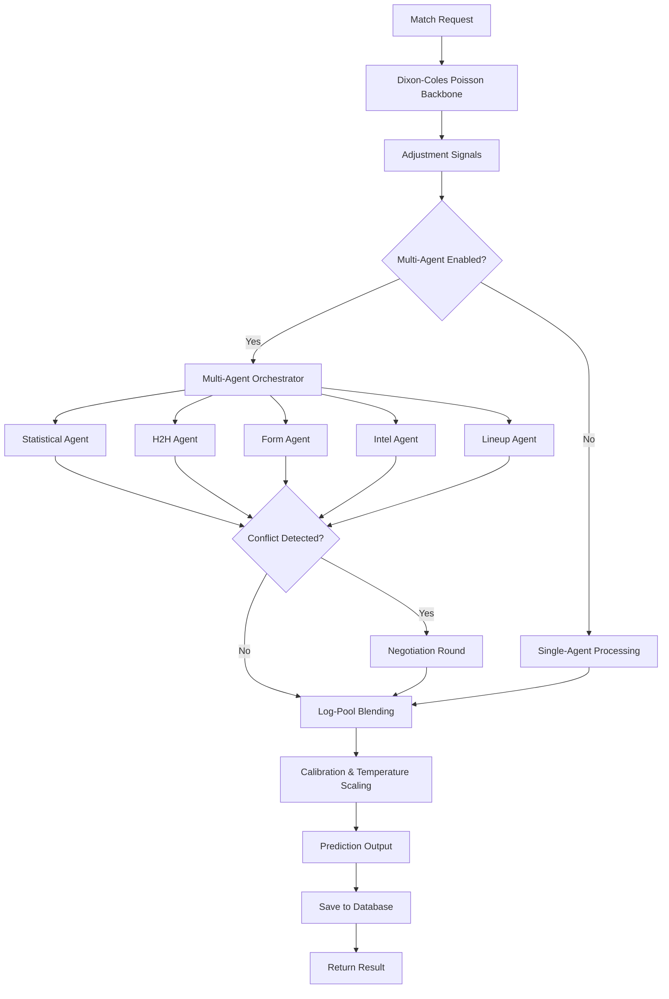
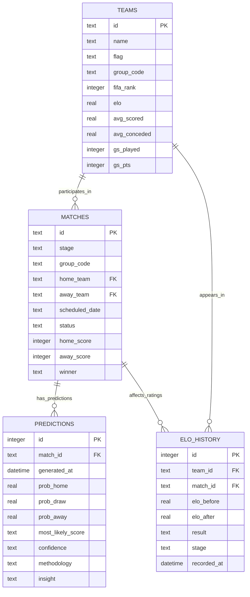
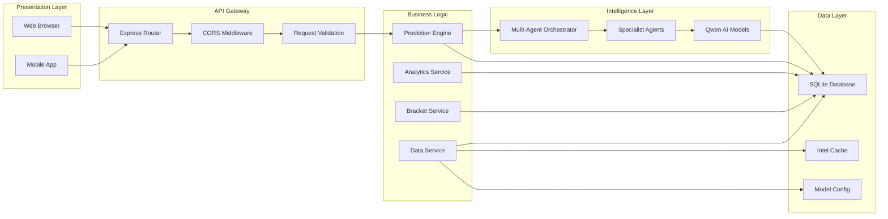
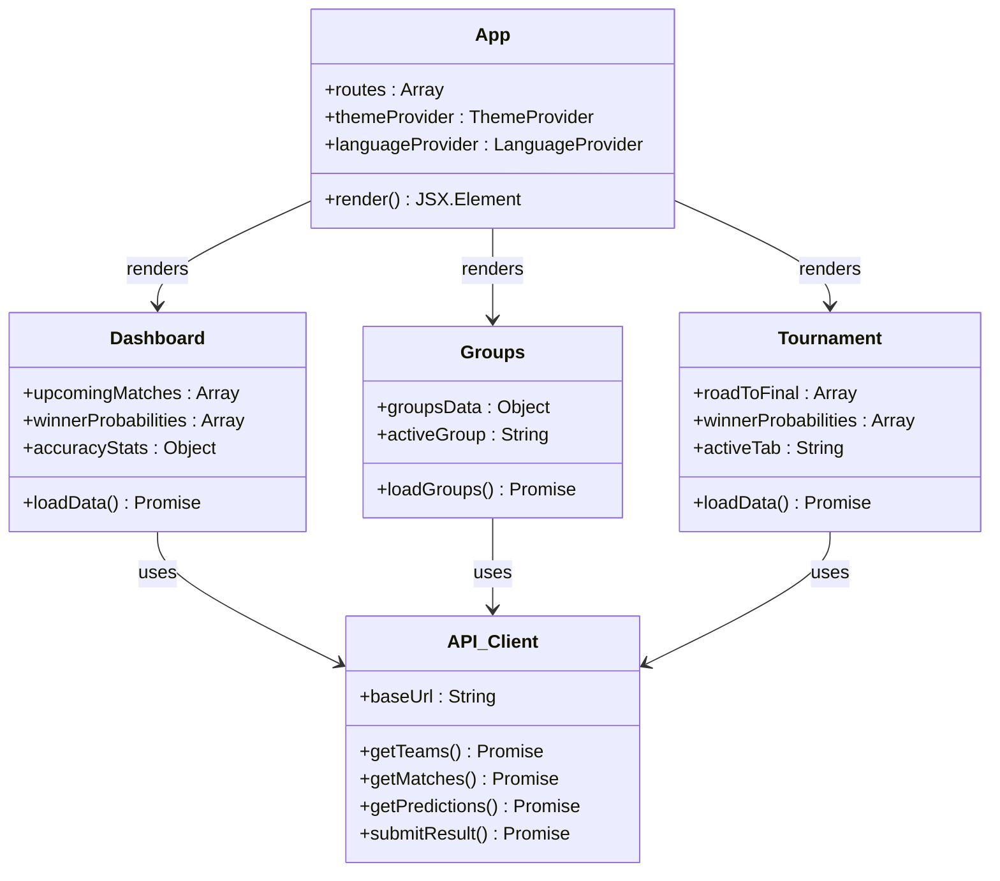
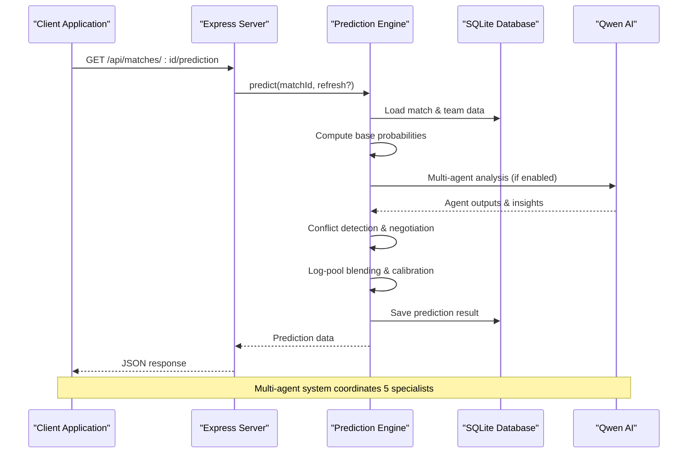
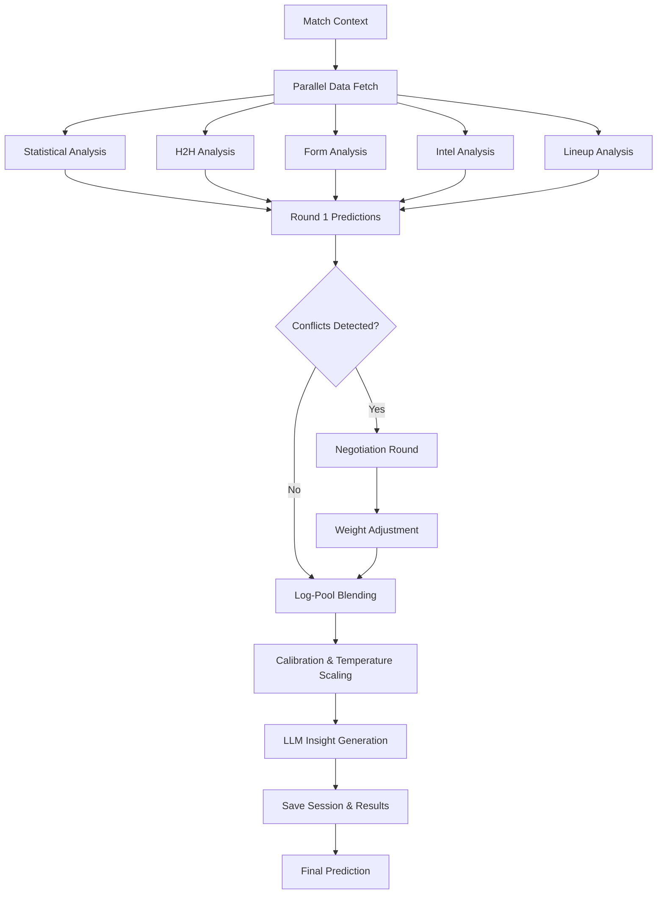
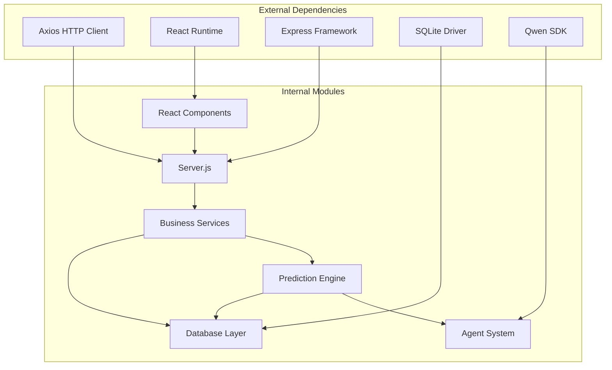

# Project Overview

<cite>
**Referenced Files in This Document**
- [README.md](file://README.md)
- [SPEC.md](file://specs/SPEC.md)
- [SPEC-PREDICT.md](file://specs/SPEC-PREDICT.md)
- [server.js](file://backend/server.js)
- [db.js](file://backend/database/db.js)
- [predictionEngine.js](file://backend/services/predictionEngine.js)
- [orchestratorAgent.js](file://backend/services/agents/orchestratorAgent.js)
- [App.jsx](file://frontend/src/App.jsx)
- [client.js](file://frontend/src/api/client.js)
- [Dashboard.jsx](file://frontend/src/pages/Dashboard.jsx)
- [Groups.jsx](file://frontend/src/pages/Groups.jsx)
- [Tournament.jsx](file://frontend/src/pages/Tournament.jsx)
- [GroupTable.jsx](file://frontend/src/components/GroupTable.jsx)
- [package.json](file://backend/package.json)
- [package.json](file://frontend/package.json)
</cite>

## Table of Contents
1. [Introduction](#introduction)
2. [Project Structure](#project-structure)
3. [Core Components](#core-components)
4. [Architecture Overview](#architecture-overview)
5. [Detailed Component Analysis](#detailed-component-analysis)
6. [Dependency Analysis](#dependency-analysis)
7. [Performance Considerations](#performance-considerations)
8. [Troubleshooting Guide](#troubleshooting-guide)
9. [Conclusion](#conclusion)

## Introduction

The World Cup 2026 Prediction App is an AI-powered sports analytics platform designed to deliver comprehensive coverage of the FIFA World Cup 2026 tournament. Built with a focus on transparency, accuracy, and accessibility, the platform combines advanced statistical modeling with a multi-agent AI system to provide pre-match predictions, live match tracking, and deep analytical insights.

The platform serves a diverse audience ranging from casual fans seeking entertaining predictions to serious sports analysts requiring detailed performance metrics. By leveraging cutting-edge AI technologies and maintaining strict data governance, the app transforms complex sports analytics into an intuitive, bilingual user experience.

## Project Structure

The application follows a modern full-stack architecture with clear separation between frontend and backend concerns:

**Diagram sources**
- [server.js:18-22](file://backend/server.js#L18-22)
- [client.js:1-50](file://frontend/src/api/client.js#L1-L50)

The project is organized into three main directories:

- **backend/**: Node.js/Express server with comprehensive prediction engine and multi-agent AI system
- **frontend/**: React 18 application with bilingual interface and responsive design
- **specs/**: Product specifications and technical documentation

**Section sources**
- [README.md:153-210](file://README.md#L153-L210)
- [package.json:1-32](file://backend/package.json#L1-L32)
- [package.json:1-72](file://frontend/package.json#L1-L72)

## Core Components

### Prediction Engine Architecture

The heart of the platform lies in its sophisticated prediction engine that employs a hybrid approach combining statistical rigor with AI-driven insights:

**Diagram sources**
- [predictionEngine.js:691-800](file://backend/services/predictionEngine.js#L691-L800)
- [orchestratorAgent.js:319-502](file://backend/services/agents/orchestratorAgent.js#L319-L502)

### Multi-Agent AI System

The platform implements a sophisticated five-agent system that operates in parallel to provide comprehensive match analysis:

| Agent Type | Model | Primary Function | Key Capabilities |
|------------|-------|------------------|------------------|
| **Statistical Agent** | qwen-plus | Dixon-Coles model interpretation | λ values, ELO ratings, α/β attack/defense analysis |
| **H2H Agent** | qwen-turbo | Head-to-head history analysis | 47k match dataset, competition weighting |
| **Form Agent** | qwen-turbo | Recent performance evaluation | Last 10 matches with competition weighting |
| **Intel Agent** | qwen-plus | Pre-match intelligence parsing | Injuries, suspensions, motivation, squad rotation |
| **Lineup Agent** | qwen-plus | Starting XI analysis | Confirmed lineup strength, formation matchups |

**Section sources**
- [README.md:18-113](file://README.md#L18-L113)
- [SPEC.md:125-177](file://specs/SPEC.md#L125-L177)

### Database Schema

The SQLite-based data storage system maintains comprehensive tournament data with optimized queries for real-time performance:

**Diagram sources**
- [db.js:23-252](file://backend/database/db.js#L23-L252)

**Section sources**
- [db.js:23-252](file://backend/database/db.js#L23-L252)

## Architecture Overview

The platform implements a microservice-like architecture within a single codebase, separating concerns while maintaining simplicity:

**Diagram sources**
- [server.js:18-22](file://backend/server.js#L18-22)
- [predictionEngine.js:1-800](file://backend/services/predictionEngine.js#L1-L800)

### Technology Stack

The platform leverages a modern, cloud-ready technology stack:

**Backend Technologies:**
- **Node.js 18+** with Express framework for REST API development
- **SQLite (WAL mode)** for high-performance relational data storage
- **Alibaba Cloud Qwen** for advanced AI capabilities (qwen-max, qwen-plus, qwen-turbo)
- **node-sqlite3-wasm** for efficient database operations
- **node-cron** for automated scheduling and maintenance tasks

**Frontend Technologies:**
- **React 18** with functional components and hooks for modern UI development
- **Vite** for fast build tooling and development experience
- **Tailwind CSS** for utility-first styling and responsive design
- **Framer Motion** for smooth animations and transitions
- **Axios** for HTTP client operations

**Deployment & DevOps:**
- **Docker** for containerization and consistent environments
- **Alibaba Cloud ECS** for production hosting
- **Automated deployment scripts** for streamlined CI/CD

**Section sources**
- [README.md:106-113](file://README.md#L106-L113)
- [package.json:14-31](file://backend/package.json#L14-L31)
- [package.json:38-71](file://frontend/package.json#L38-L71)

## Detailed Component Analysis

### Frontend Application Architecture

The React-based frontend implements a comprehensive routing system with intelligent caching and offline support:

**Diagram sources**
- [App.jsx:247-283](file://frontend/src/App.jsx#L247-L283)
- [Dashboard.jsx:137-706](file://frontend/src/pages/Dashboard.jsx#L137-L706)
- [Groups.jsx:11-160](file://frontend/src/pages/Groups.jsx#L11-L160)
- [Tournament.jsx:376-444](file://frontend/src/pages/Tournament.jsx#L376-L444)

### Key User Interface Components

The platform provides six primary pages, each serving distinct user needs:

#### Dashboard Component
The homepage serves as the central hub, displaying:
- Current tournament phase and countdown timers
- Upcoming matches with predictive insights
- Top tournament favorites with probability rankings
- Real-time accuracy metrics and performance indicators

#### Groups Component
Comprehensive group stage coverage featuring:
- Interactive standings tables with qualification indicators
- Match cards with integrated predictions
- Team profile navigation and historical context
- What-if scenario calculations for qualification possibilities

#### Tournament Component
Advanced knockout bracket visualization:
- Horizontal bracket layout with SVG connectors
- Predicted and actual match outcomes
- Winner probability rankings and Monte Carlo simulations
- Road-to-Final progression tracking

#### Additional Pages
- **Schedule**: Complete chronological match listings with filtering
- **Match Detail**: Deep analytical breakdown with multi-agent dialogue
- **Predictions**: Comprehensive historical accuracy tracking
- **Team Detail**: Per-team statistics and ELO trajectory analysis

**Section sources**
- [Dashboard.jsx:137-706](file://frontend/src/pages/Dashboard.jsx#L137-L706)
- [Groups.jsx:11-160](file://frontend/src/pages/Groups.jsx#L11-L160)
- [Tournament.jsx:376-444](file://frontend/src/pages/Tournament.jsx#L376-L444)
- [SPEC.md:31-123](file://specs/SPEC.md#L31-L123)

### Backend API Endpoints

The RESTful API provides comprehensive access to all platform functionality:

**Diagram sources**
- [server.js:325-341](file://backend/server.js#L325-L341)
- [predictionEngine.js:691-800](file://backend/services/predictionEngine.js#L691-L800)
- [orchestratorAgent.js:319-502](file://backend/services/agents/orchestratorAgent.js#L319-L502)

**Section sources**
- [server.js:24-582](file://backend/server.js#L24-L582)
- [client.js:1-50](file://frontend/src/api/client.js#L1-L50)

### Multi-Agent System Implementation

The multi-agent architecture represents a sophisticated approach to sports analytics:

**Diagram sources**
- [orchestratorAgent.js:331-469](file://backend/services/agents/orchestratorAgent.js#L331-L469)

The system implements sophisticated conflict resolution mechanisms where agents with probability differences exceeding 20% engage in negotiated debates, with the most resilient argument winning and receiving weight adjustments.

**Section sources**
- [README.md:72-113](file://README.md#L72-L113)
- [SPEC.md:148-177](file://specs/SPEC.md#L148-L177)

## Dependency Analysis

The platform maintains clean architectural boundaries with minimal coupling between components:

**Diagram sources**
- [package.json:14-31](file://backend/package.json#L14-L31)
- [package.json:38-71](file://frontend/package.json#L38-L71)

### Key Dependencies and Version Management

The project maintains strict version control for all dependencies:

**Backend Dependencies:**
- **express**: ^4.19.2 - Core web framework
- **axios**: ^1.7.2 - HTTP client for external APIs
- **node-sqlite3-wasm**: ^0.8.57 - Efficient database operations
- **node-cron**: ^4.2.1 - Scheduled task automation
- **cors**: ^2.8.5 - Cross-origin resource sharing

**Frontend Dependencies:**
- **react**: ^18.3.1 - Core UI library
- **react-router-dom**: ^6.24.1 - Client-side routing
- **axios**: ^1.7.2 - HTTP client for API communication
- **framer-motion**: ^12.40.0 - Animation library
- **tailwindcss**: ^3.4.6 - Utility-first CSS framework

**Development Dependencies:**
- **eslint**: ^9.39.4 - Code quality and linting
- **prettier**: ^3.8.3 - Code formatting
- **vitest**: ^3.2.4 - Testing framework

**Section sources**
- [package.json:14-31](file://backend/package.json#L14-L31)
- [package.json:23-71](file://frontend/package.json#L23-L71)

## Performance Considerations

The platform implements several optimization strategies to ensure responsive performance:

### Database Optimization
- **WAL Mode**: Write-Ahead Logging for improved concurrency
- **Connection Pooling**: Efficient database resource management
- **Indexed Queries**: Strategic indexing on frequently queried columns
- **Batch Operations**: Optimized bulk data processing

### Caching Strategies
- **Prediction Caching**: Prevents redundant AI computations
- **Intel Cache**: Stores parsed web intelligence data
- **Static Assets**: CDN-ready optimization for images and resources
- **API Response Caching**: Reduces server load for repeated requests

### AI Model Optimization
- **Selective Agent Activation**: Only activates relevant agents per match
- **Conflict Detection**: Minimizes negotiation rounds when possible
- **Temperature Scaling**: Adjusts model confidence for better calibration
- **Model Weight Tuning**: Dynamic adjustment of signal weights

### Frontend Performance
- **Code Splitting**: Route-based lazy loading
- **Component Memoization**: Prevents unnecessary re-renders
- **Responsive Design**: Mobile-first optimization
- **SVG Graphics**: Lightweight vector graphics for icons and decorations

## Troubleshooting Guide

### Common Issues and Solutions

**API Connectivity Problems**
- Verify CORS configuration matches frontend origin
- Check environment variable settings for API keys
- Ensure database initialization completes successfully
- Monitor network connectivity to external APIs

**Prediction Engine Failures**
- Validate Qwen API key configuration
- Check model availability and quota limits
- Review agent session logs for conflict resolution issues
- Monitor database connection timeouts

**Frontend Rendering Issues**
- Clear browser cache and reload application
- Verify React DevTools compatibility
- Check for JavaScript errors in console
- Ensure proper hydration on client-side

**Database Corruption Prevention**
- Monitor WAL file growth and checkpoint intervals
- Regular backup schedules for critical data
- Connection timeout configurations
- Foreign key constraint validation

### Monitoring and Debugging

The platform includes comprehensive logging and monitoring capabilities:

- **Server Logs**: Detailed request/response logging
- **Agent Sessions**: Complete audit trail of AI interactions
- **Performance Metrics**: Response time and resource utilization
- **Error Tracking**: Centralized error reporting and aggregation

**Section sources**
- [server.js:585-675](file://backend/server.js#L585-L675)
- [db.js:10-21](file://backend/database/db.js#L10-L21)

## Conclusion

The World Cup 2026 Prediction App represents a sophisticated fusion of sports analytics and artificial intelligence, delivering an unparalleled user experience for football enthusiasts worldwide. Through its innovative multi-agent AI system, comprehensive statistical modeling, and elegant user interface, the platform successfully bridges the gap between complex data analysis and accessible sports entertainment.

The project's modular architecture ensures maintainability and scalability, while its bilingual interface and responsive design accommodate users across different regions and devices. The combination of real-time predictions, historical accuracy tracking, and interactive tournament visualization creates a comprehensive analytics solution that serves both casual fans and serious analysts.

By leveraging Alibaba Cloud's Qwen AI models and implementing robust performance optimizations, the platform demonstrates the practical application of advanced AI technologies in sports analytics. The educational value extends beyond simple predictions, offering users insights into statistical modeling, machine learning applications, and the evolving landscape of AI-powered sports analysis.

This project stands as a testament to the potential of combining traditional sports journalism with cutting-edge technology, providing a blueprint for future innovations in sports analytics platforms.