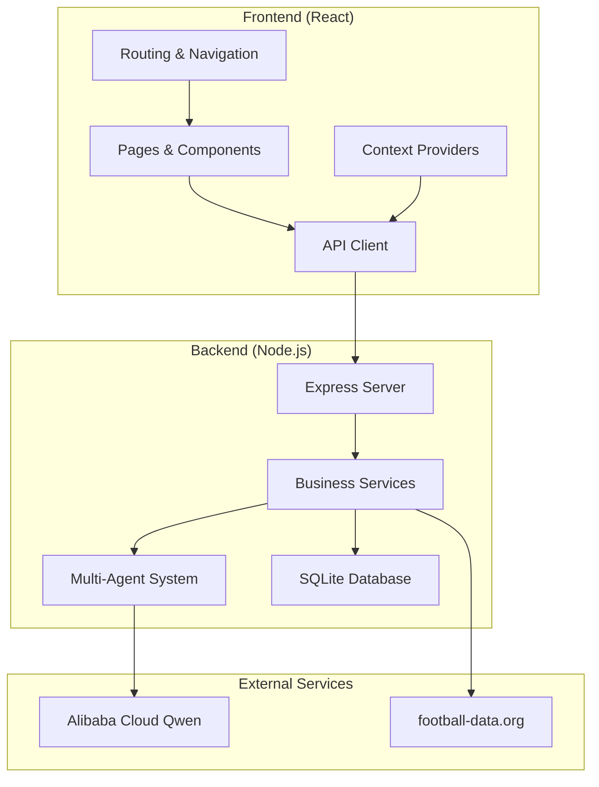
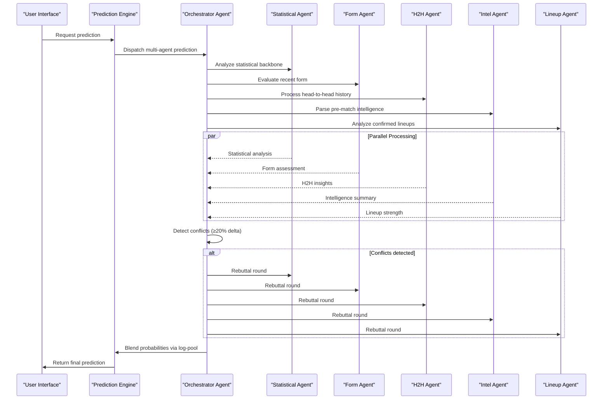
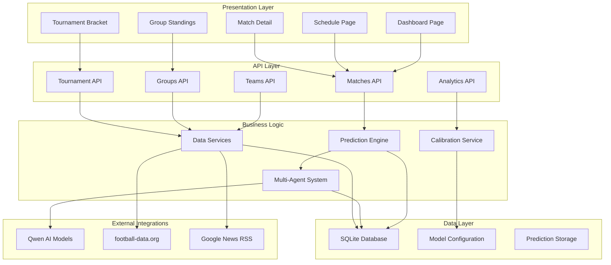
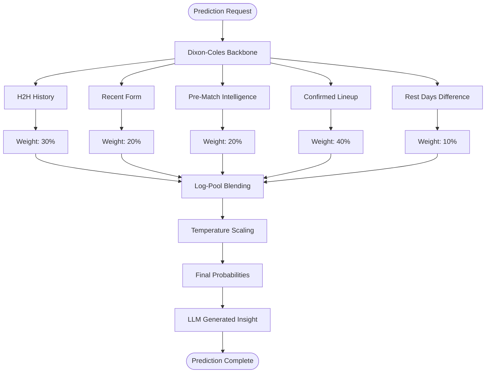
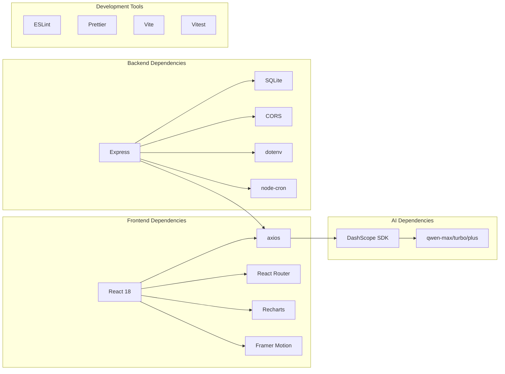

# Project Overview

<cite>
**Referenced Files in This Document**
- [README.md](file://README.md)
- [SPEC.md](file://specs/SPEC.md)
- [AGENTS.md](file://AGENTS.md)
- [backend/package.json](file://backend/package.json)
- [frontend/package.json](file://frontend/package.json)
- [backend/services/predictionEngine.js](file://backend/services/predictionEngine.js)
- [backend/services/agents/orchestratorAgent.js](file://backend/services/agents/orchestratorAgent.js)
- [backend/services/calibrationService.js](file://backend/services/calibrationService.js)
- [backend/data/teams.js](file://backend/data/teams.js)
- [frontend/src/pages/Dashboard.jsx](file://frontend/src/pages/Dashboard.jsx)
- [frontend/src/pages/Schedule.jsx](file://frontend/src/pages/Schedule.jsx)
- [frontend/src/pages/Groups.jsx](file://frontend/src/pages/Groups.jsx)
- [frontend/src/pages/Tournament.jsx](file://frontend/src/pages/Tournament.jsx)
- [frontend/src/api/client.js](file://frontend/src/api/client.js)
</cite>

## Table of Contents
1. [Introduction](#introduction)
2. [Project Structure](#project-structure)
3. [Core Components](#core-components)
4. [Architecture Overview](#architecture-overview)
5. [Detailed Component Analysis](#detailed-component-analysis)
6. [Dependency Analysis](#dependency-analysis)
7. [Performance Considerations](#performance-considerations)
8. [Troubleshooting Guide](#troubleshooting-guide)
9. [Conclusion](#conclusion)

## Introduction

WC26-Qwen-Qoder is a World Cup 2026 prediction application powered by Alibaba Cloud's Qwen multi-agent AI system. The platform provides comprehensive coverage of all 48 teams, 72 group stage fixtures, and the knockout bracket through to the final. Built as a full-stack web application, it combines advanced sports analytics with cutting-edge AI to deliver accurate, explainable match predictions and rich tournament insights.

The application serves football fans worldwide who want to track live results, understand group standings, explore the knockout bracket, and gain deep analytical insights powered by AI. It operates without requiring user registration, with data updated via automated systems.

**Section sources**
- [README.md:1-263](file://README.md#L1-L263)
- [SPEC.md:1-205](file://specs/SPEC.md#L1-L205)

## Project Structure

The project follows a modern full-stack architecture with clear separation between frontend and backend concerns:

**Diagram sources**
- [backend/package.json:1-32](file://backend/package.json#L1-L32)
- [frontend/package.json:1-72](file://frontend/package.json#L1-L72)

The frontend is built with React 18, Vite, and Tailwind CSS, while the backend uses Node.js with Express. Both packages share ESLint and Prettier for code quality enforcement.

**Section sources**
- [backend/package.json:1-32](file://backend/package.json#L1-L32)
- [frontend/package.json:1-72](file://frontend/package.json#L1-L72)

## Core Components

### AI-Powered Prediction Engine

The heart of WC26-Qwen-Qoder is its sophisticated prediction engine built on the Dixon-Coles bivariate Poisson model. This mathematical foundation provides realistic goal-scoring distributions while accounting for team strengths and home advantage effects.

Key prediction engine features include:
- **Dixon-Coles Poisson Model**: Advanced bivariate Poisson with low-score correction for more accurate goal probability calculations
- **Dynamic Rating Updates**: Online updating of attack/defense ratings after each match result
- **Signal Integration**: Multiple complementary signals integrated through log-pool blending
- **Calibration**: Temperature scaling for improved probability calibration

### Multi-Agent AI System

When enabled, the system employs a sophisticated 5-agent AI architecture that runs in parallel:

**Diagram sources**
- [backend/services/agents/orchestratorAgent.js:278-468](file://backend/services/agents/orchestratorAgent.js#L278-L468)

### User Interface Features

The application provides a comprehensive set of features designed for optimal user experience:

- **Dashboard**: Today's matches with win/draw/loss probabilities and tournament winner leaderboard
- **Schedule**: Complete chronological list of all 104 matches with filtering capabilities
- **Match Details**: Comprehensive prediction breakdown with multi-agent dialogue and historical analysis
- **Group Standings**: Live points tables with qualification indicators and what-if scenario calculator
- **Bracket Visualization**: Interactive knockout tree with winner probabilities and Road to Final view
- **Team Profiles**: Per-team pages with group context and ELO rating trajectories
- **Predictions Analytics**: Consolidated view of all predictions with accuracy metrics

**Section sources**
- [README.md:5-16](file://README.md#L5-L16)
- [SPEC.md:31-122](file://specs/SPEC.md#L31-L122)

## Architecture Overview

The system architecture demonstrates a clean separation of concerns with robust data flow:

**Diagram sources**
- [backend/services/predictionEngine.js:1-1020](file://backend/services/predictionEngine.js#L1-L1020)
- [backend/services/agents/orchestratorAgent.js:1-471](file://backend/services/agents/orchestratorAgent.js#L1-L471)
- [backend/services/calibrationService.js:1-132](file://backend/services/calibrationService.js#L1-L132)

## Detailed Component Analysis

### Prediction Engine Implementation

The prediction engine implements a sophisticated mathematical framework combining statistical rigor with machine learning insights:

#### Dixon-Coles Poisson Model

The core mathematical foundation uses the Dixon-Coles bivariate Poisson model with several key enhancements:

- **Low-Score Correction**: Addresses over-prediction of 1-1 and under-prediction of 0-0/1-0/0-1 outcomes
- **Dynamic Rating Updates**: Attack/defense ratings updated via regularized Poisson MLE after each match
- **Home Advantage Modeling**: Incorporates host nation advantages and venue-specific factors
- **Phase-Specific Scaling**: Different goal rates for group stage versus knockout rounds

#### Signal Integration Architecture

Multiple complementary signals are integrated through a sophisticated blending mechanism:

**Diagram sources**
- [backend/services/predictionEngine.js:214-238](file://backend/services/predictionEngine.js#L214-L238)

#### Multi-Agent Negotiation Protocol

When the multi-agent system is enabled, the prediction process becomes highly collaborative:

1. **Parallel Processing**: All five agents analyze the match simultaneously
2. **Conflict Detection**: Probability differences ≥ 20% trigger negotiation
3. **Rebuttal Rounds**: Conflicting agents challenge each other's reasoning
4. **Weight Adjustment**: Winners receive 1.3× weight boost, losers 0.6× reduction
5. **Final Blending**: Log-pool combination of all agent outputs

### Multi-Agent System Design

The multi-agent architecture consists of five specialized agents, each with distinct expertise:

| Agent | Model | Specialization | Data Source |
|-------|-------|----------------|-------------|
| **Statistical Agent** | qwen-plus | Interprets Dixon-Coles backbone output | Mathematical reasoning |
| **Form Agent** | qwen-turbo | Evaluates recent 10-match performance | football-data.org API |
| **H2H Agent** | qwen-turbo | Analyzes historical head-to-head record | 47k match dataset |
| **Intel Agent** | qwen-plus | Processes injuries, motivation, rotation | Google News RSS |
| **Lineup Agent** | qwen-plus | Assesses confirmed starting XI strength | Lineup service |

Each agent operates independently but collaboratively, with the orchestrator managing the negotiation process and final decision-making.

### Frontend Application Architecture

The frontend application provides a comprehensive user interface with responsive design and rich interactive features:

#### Dashboard Component

The dashboard serves as the primary entry point, showcasing:
- Current tournament phase and progress
- Upcoming matches with probability bars
- Top tournament winner probabilities
- Overall prediction accuracy metrics
- Host nation highlights

#### Schedule Management

The schedule page offers:
- Complete chronological listing of all 104 matches
- Advanced filtering by stage, group, status, and team
- Date-based grouping with collapsible sections
- Mobile-responsive design with touch-friendly controls

#### Group Standings System

Real-time group standings with:
- Standard football table format (position, played, won, drawn, lost, goal difference, points)
- Visual qualification indicators for top 2 and third-place contention
- What-if scenario calculator for remaining matches
- Team profile integration with historical context

#### Tournament Bracket Visualization

Interactive bracket system featuring:
- Horizontal layout showing progression from Round of 32 to Final
- Color-coded stages with actual vs predicted indicators
- Winner probability displays for each match
- Road to Final visualization with Monte Carlo simulations

**Section sources**
- [frontend/src/pages/Dashboard.jsx:137-706](file://frontend/src/pages/Dashboard.jsx#L137-L706)
- [frontend/src/pages/Schedule.jsx:135-494](file://frontend/src/pages/Schedule.jsx#L135-L494)
- [frontend/src/pages/Groups.jsx:11-160](file://frontend/src/pages/Groups.jsx#L11-L160)
- [frontend/src/pages/Tournament.jsx:376-444](file://frontend/src/pages/Tournament.jsx#L376-L444)

## Dependency Analysis

The system maintains clean dependency relationships with minimal coupling between components:

**Diagram sources**
- [backend/package.json:14-31](file://backend/package.json#L14-L31)
- [frontend/package.json:38-71](file://frontend/package.json#L38-L71)

### External Data Sources

The application integrates with multiple external services for comprehensive data coverage:

- **football-data.org**: Live scores, team statistics, and fixture data (optional)
- **Google News RSS**: Pre-match intelligence including injuries, suspensions, and motivation
- **Alibaba Cloud DashScope**: Qwen model access for AI-powered analysis

### Database Schema

The SQLite database maintains organized data structures for efficient querying and analysis:

- **Teams Table**: 48 participating teams with FIFA rankings and ELO ratings
- **Matches Table**: Complete fixture schedule with status tracking
- **Predictions Table**: Historical predictions with confidence metrics
- **Model Configuration**: Calibration parameters and system settings

**Section sources**
- [backend/package.json:14-31](file://backend/package.json#L14-L31)
- [frontend/package.json:38-71](file://frontend/package.json#L38-L71)
- [backend/data/teams.js:1-234](file://backend/data/teams.js#L1-L234)

## Performance Considerations

The application is designed with several performance optimization strategies:

### Prediction Caching Strategy

- **Cache Validation**: Predictions are validated against match status and cached timestamps
- **Selective Refresh**: Only active tournament stage predictions are regenerated nightly
- **Historical Preservation**: Prediction history is maintained for analysis and comparison

### Multi-Agent Optimization

- **Parallel Processing**: Agents operate concurrently to minimize response times
- **Conditional Activation**: Agents only process when relevant data is available
- **Conflict Minimization**: Weight adjustment system reduces negotiation frequency

### Frontend Performance

- **Code Splitting**: Route-based lazy loading for optimal bundle sizes
- **Responsive Design**: Mobile-first approach with progressive enhancement
- **State Management**: Efficient context providers with selective re-renders

### Database Optimization

- **WAL Mode**: SQLite Write-Ahead Logging for improved concurrency
- **Indexed Queries**: Strategic indexing for frequently accessed data
- **Connection Pooling**: Efficient database connection management

## Troubleshooting Guide

### Common Issues and Solutions

#### AI Model Access Problems

**Issue**: Qwen model calls failing or returning template responses
**Solution**: Verify DASHSCOPE_API_KEY environment variable is properly configured

#### Data Integration Failures

**Issue**: Missing live scores or form data
**Solution**: Check FOOTBALL_DATA_API_KEY configuration and API rate limits

#### Prediction Accuracy Concerns

**Issue**: Predictions not reflecting recent results
**Solution**: Monitor calibration service refitting and model configuration updates

#### Frontend Loading Issues

**Issue**: Slow page loads or missing data
**Solution**: Verify API endpoint accessibility and network connectivity

### Debugging Tools

The application includes comprehensive logging and monitoring capabilities:

- **Console Logging**: Detailed agent session logs and prediction traces
- **Error Boundaries**: Frontend error handling with user-friendly messaging
- **Health Checks**: Automated system health monitoring and alerting

**Section sources**
- [README.md:139-151](file://README.md#L139-L151)

## Conclusion

WC26-Qwen-Qoder represents a sophisticated fusion of advanced mathematics, artificial intelligence, and user-centric design. The application successfully combines the rigorous statistical foundation of the Dixon-Coles Poisson model with the interpretive power of Alibaba Cloud's Qwen multi-agent AI system to deliver accurate, explainable sports predictions.

Key achievements include:
- **Comprehensive Coverage**: Complete 48-team, 104-match tournament analysis
- **Advanced AI Integration**: Sophisticated multi-agent system with negotiation protocols
- **Rich User Experience**: Intuitive interfaces for all major user workflows
- **Technical Excellence**: Robust architecture with performance optimizations
- **Open Source Accessibility**: Transparent development process and community contribution

The platform serves as an exemplary demonstration of how modern AI technologies can enhance traditional sports analytics, providing fans with deeper insights into the beautiful game while maintaining accessibility and usability for audiences worldwide.