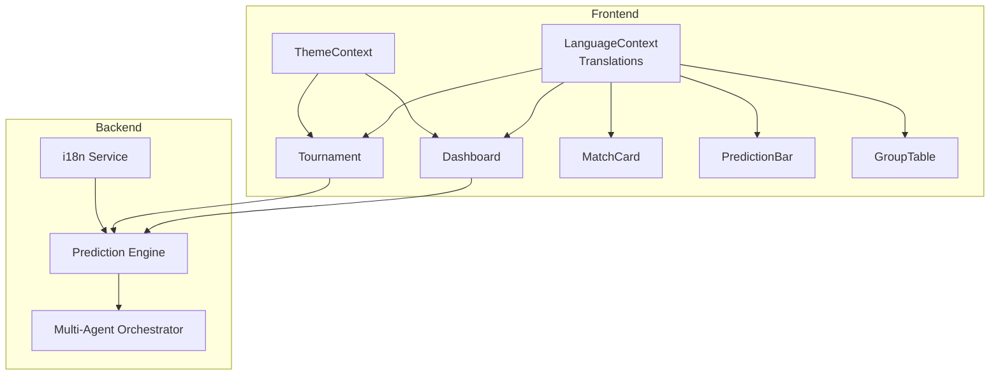
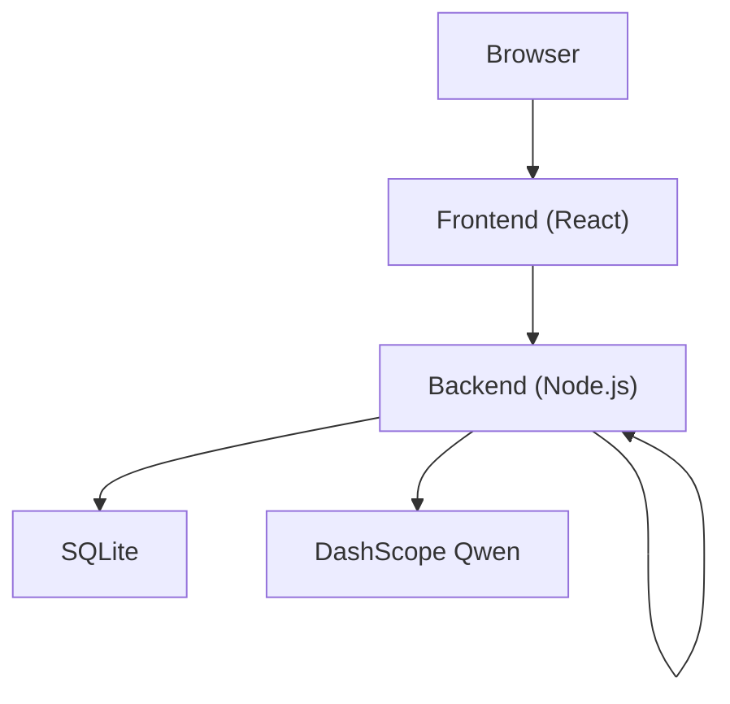
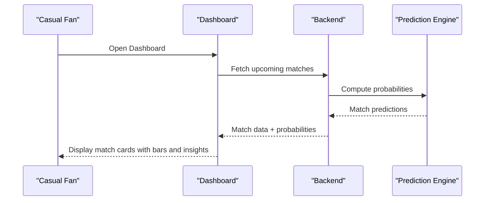
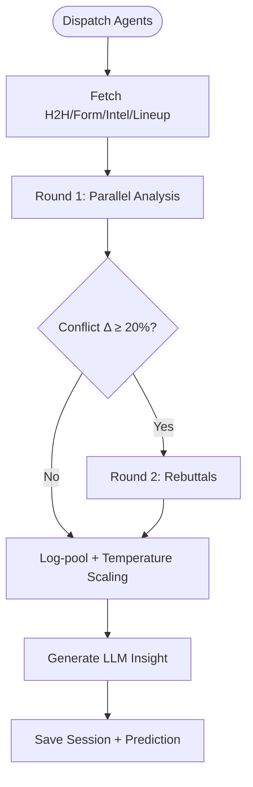
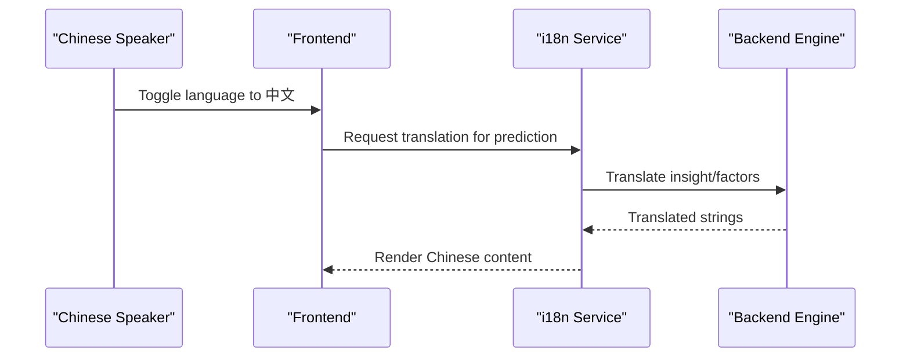
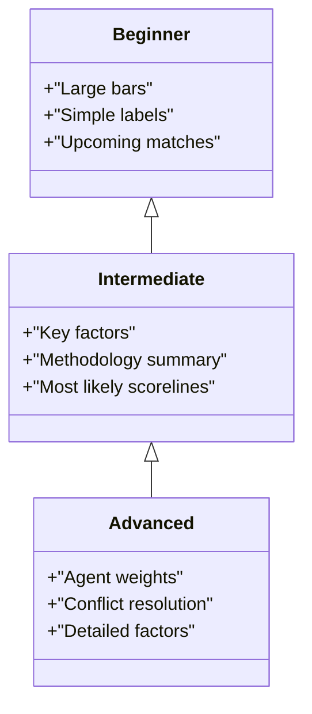
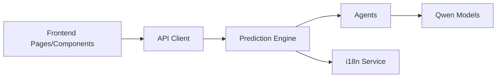

# Target Audience

<cite>
**Referenced Files in This Document**
- [README.md](file://README.md)
- [translations.js](file://frontend/src/i18n/translations.js)
- [LanguageContext.jsx](file://frontend/src/contexts/LanguageContext.jsx)
- [Dashboard.jsx](file://frontend/src/pages/Dashboard.jsx)
- [Tournament.jsx](file://frontend/src/pages/Tournament.jsx)
- [MatchCard.jsx](file://frontend/src/components/MatchCard.jsx)
- [PredictionBar.jsx](file://frontend/src/components/PredictionBar.jsx)
- [GroupTable.jsx](file://frontend/src/components/GroupTable.jsx)
- [ThemeContext.jsx](file://frontend/src/contexts/ThemeContext.jsx)
- [i18nService.js](file://backend/services/i18nService.js)
- [predictionEngine.js](file://backend/services/predictionEngine.js)
- [orchestratorAgent.js](file://backend/services/agents/orchestratorAgent.js)
- [sitemap.xml](file://frontend/public/sitemap.xml)
</cite>

## Table of Contents
1. [Introduction](#introduction)
2. [Project Structure](#project-structure)
3. [Core Components](#core-components)
4. [Architecture Overview](#architecture-overview)
5. [Detailed Component Analysis](#detailed-component-analysis)
6. [Dependency Analysis](#dependency-analysis)
7. [Performance Considerations](#performance-considerations)
8. [Troubleshooting Guide](#troubleshooting-guide)
9. [Conclusion](#conclusion)
10. [Appendices](#appendices)

## Introduction
The World Cup 2026 Prediction App targets a diverse global audience united by interest in soccer/football and the 2026 FIFA World Cup. The app serves three primary user segments:
- Primary: Soccer enthusiasts who want accurate match predictions and team analysis
- Secondary: Sports analysts and researchers interested in statistical methodologies and AI prediction models
- Casual fans: Users seeking engaging coverage, interactive tournament tracking, and accessible insights

The app expands its reach through bilingual support (English and Chinese), a clean interface suitable for beginners, and advanced analytical depth for experts. It also offers educational value for students studying sports analytics, machine learning, and data science.

## Project Structure
The app is organized into frontend and backend components:
- Frontend: React-based UI with internationalization, theming, and responsive design
- Backend: Node.js services including prediction engines, multi-agent orchestration, and data management
- Internationalization: Frontend translations and backend on-demand translation for Chinese

**Diagram sources**
- [LanguageContext.jsx:1-69](file://frontend/src/contexts/LanguageContext.jsx#L1-L69)
- [translations.js:1-630](file://frontend/src/i18n/translations.js#L1-L630)
- [Dashboard.jsx:1-706](file://frontend/src/pages/Dashboard.jsx#L1-L706)
- [Tournament.jsx:1-444](file://frontend/src/pages/Tournament.jsx#L1-L444)
- [MatchCard.jsx:1-175](file://frontend/src/components/MatchCard.jsx#L1-L175)
- [PredictionBar.jsx:1-51](file://frontend/src/components/PredictionBar.jsx#L1-L51)
- [GroupTable.jsx:1-78](file://frontend/src/components/GroupTable.jsx#L1-L78)
- [ThemeContext.jsx:1-27](file://frontend/src/contexts/ThemeContext.jsx#L1-L27)
- [predictionEngine.js:1-200](file://backend/services/predictionEngine.js#L1-L200)
- [orchestratorAgent.js:1-200](file://backend/services/agents/orchestratorAgent.js#L1-L200)
- [i18nService.js:1-116](file://backend/services/i18nService.js#L1-L116)

**Section sources**
- [README.md:1-263](file://README.md#L1-L263)
- [translations.js:1-630](file://frontend/src/i18n/translations.js#L1-L630)
- [LanguageContext.jsx:1-69](file://frontend/src/contexts/LanguageContext.jsx#L1-L69)
- [ThemeContext.jsx:1-27](file://frontend/src/contexts/ThemeContext.jsx#L1-L27)

## Core Components
- Bilingual interface: English and Chinese supported across navigation, stages, statuses, and content
- Interactive tournament tracking: Knockout bracket visualization with winner probabilities and Monte Carlo simulations
- Match-centric insights: Win/draw/loss probabilities, top scorelines, key factors, and AI-generated analyst insights
- Team profiles: ELO trends, historical records, and group context
- Accessibility and themes: Persistent dark/light theme toggle and localized date/time handling

These components collectively serve both casual fans and analysts, balancing simplicity with depth.

**Section sources**
- [README.md:5-16](file://README.md#L5-L16)
- [translations.js:1-630](file://frontend/src/i18n/translations.js#L1-L630)
- [Dashboard.jsx:1-706](file://frontend/src/pages/Dashboard.jsx#L1-L706)
- [Tournament.jsx:1-444](file://frontend/src/pages/Tournament.jsx#L1-L444)
- [MatchCard.jsx:1-175](file://frontend/src/components/MatchCard.jsx#L1-L175)
- [PredictionBar.jsx:1-51](file://frontend/src/components/PredictionBar.jsx#L1-L51)
- [GroupTable.jsx:1-78](file://frontend/src/components/GroupTable.jsx#L1-L78)
- [ThemeContext.jsx:1-27](file://frontend/src/contexts/ThemeContext.jsx#L1-L27)

## Architecture Overview
The app’s architecture supports a dual-layer approach:
- Frontend: Provides multilingual UI, theme persistence, and user-friendly visualizations
- Backend: Powers prediction engines, integrates AI agents, and manages data services

**Diagram sources**
- [README.md:106-112](file://README.md#L106-L112)
- [predictionEngine.js:1-200](file://backend/services/predictionEngine.js#L1-L200)
- [orchestratorAgent.js:1-200](file://backend/services/agents/orchestratorAgent.js#L1-L200)
- [i18nService.js:1-116](file://backend/services/i18nService.js#L1-L116)

## Detailed Component Analysis

### Primary Audience: Soccer Enthusiasts (Casual Fans)
- Needs: Easy-to-understand match previews, visual predictions, and engaging tournament tracking
- App features aligning with needs:
  - Dashboard highlights upcoming matches and top picks with clear probability bars
  - Tournament page visualizes the knockout bracket and winner odds
  - Match cards display most likely scorelines and confidence levels
  - Group tables show standings and advancement indicators
  - Bilingual interface supports English and Chinese speakers globally

**Diagram sources**
- [Dashboard.jsx:137-200](file://frontend/src/pages/Dashboard.jsx#L137-L200)
- [MatchCard.jsx:21-175](file://frontend/src/components/MatchCard.jsx#L21-L175)
- [predictionEngine.js:1-200](file://backend/services/predictionEngine.js#L1-L200)

**Section sources**
- [Dashboard.jsx:1-706](file://frontend/src/pages/Dashboard.jsx#L1-L706)
- [MatchCard.jsx:1-175](file://frontend/src/components/MatchCard.jsx#L1-L175)
- [PredictionBar.jsx:1-51](file://frontend/src/components/PredictionBar.jsx#L1-L51)
- [GroupTable.jsx:1-78](file://frontend/src/components/GroupTable.jsx#L1-L78)
- [translations.js:1-630](file://frontend/src/i18n/translations.js#L1-L630)

### Secondary Audience: Sports Analysts and Researchers
- Needs: Transparent methodology, agent weights, conflict resolution, and detailed factors
- App features aligning with needs:
  - Multi-agent orchestration with conflict detection and negotiation
  - Detailed methodology strings and factor lists
  - On-demand Chinese translation of insights and factors
  - Backtest and calibration references in the prediction engine

**Diagram sources**
- [orchestratorAgent.js:1-200](file://backend/services/agents/orchestratorAgent.js#L1-L200)
- [predictionEngine.js:1-200](file://backend/services/predictionEngine.js#L1-L200)
- [i18nService.js:1-116](file://backend/services/i18nService.js#L1-L116)

**Section sources**
- [orchestratorAgent.js:1-200](file://backend/services/agents/orchestratorAgent.js#L1-L200)
- [predictionEngine.js:1-200](file://backend/services/predictionEngine.js#L1-L200)
- [i18nService.js:1-116](file://backend/services/i18nService.js#L1-L116)

### Tertiary Audience: Students and Educators
- Needs: Educational examples of sports analytics, machine learning, and data science
- App features aligning with needs:
  - Clear separation between statistical backbone and AI interpretation
  - Step-by-step methodology and factor breakdown
  - Public sitemap indicating discoverability for research and teaching

**Section sources**
- [README.md:18-104](file://README.md#L18-L104)
- [sitemap.xml:1-53](file://frontend/public/sitemap.xml#L1-L53)

### Bilingual Support and Global Reach
- Frontend translations cover navigation, stages, statuses, and content
- Backend service translates insights and factors to Chinese on demand
- Locale-aware date/time formatting and team name localization

**Diagram sources**
- [LanguageContext.jsx:1-69](file://frontend/src/contexts/LanguageContext.jsx#L1-L69)
- [translations.js:1-630](file://frontend/src/i18n/translations.js#L1-L630)
- [i18nService.js:1-116](file://backend/services/i18nService.js#L1-L116)

**Section sources**
- [LanguageContext.jsx:1-69](file://frontend/src/contexts/LanguageContext.jsx#L1-L69)
- [translations.js:1-630](file://frontend/src/i18n/translations.js#L1-L630)
- [i18nService.js:1-116](file://backend/services/i18nService.js#L1-L116)

### Interface Accommodation Across Expertise Levels
- Beginners: Large, readable probability bars, clear labels, and simplified views
- Intermediate: Match details with key factors and methodology summaries
- Advanced: Full agent outputs, conflict details, and detailed factor weights

**Diagram sources**
- [MatchCard.jsx:1-175](file://frontend/src/components/MatchCard.jsx#L1-L175)
- [PredictionBar.jsx:1-51](file://frontend/src/components/PredictionBar.jsx#L1-L51)
- [Tournament.jsx:1-444](file://frontend/src/pages/Tournament.jsx#L1-L444)

**Section sources**
- [MatchCard.jsx:1-175](file://frontend/src/components/MatchCard.jsx#L1-L175)
- [PredictionBar.jsx:1-51](file://frontend/src/components/PredictionBar.jsx#L1-L51)
- [Tournament.jsx:1-444](file://frontend/src/pages/Tournament.jsx#L1-L444)

### Accessibility and Internationalization
- Theme persistence: Dark/light mode stored in local storage
- Locale-aware formatting: Dates and times adapt to user language
- Team name localization: Chinese team names available when language is set to 中文

**Section sources**
- [ThemeContext.jsx:1-27](file://frontend/src/contexts/ThemeContext.jsx#L1-L27)
- [LanguageContext.jsx:1-69](file://frontend/src/contexts/LanguageContext.jsx#L1-L69)
- [translations.js:614-627](file://frontend/src/i18n/translations.js#L614-L627)

## Dependency Analysis
The app’s dependencies connect frontend UI to backend prediction services and AI orchestration.

**Diagram sources**
- [Dashboard.jsx:1-706](file://frontend/src/pages/Dashboard.jsx#L1-L706)
- [Tournament.jsx:1-444](file://frontend/src/pages/Tournament.jsx#L1-L444)
- [predictionEngine.js:1-200](file://backend/services/predictionEngine.js#L1-L200)
- [orchestratorAgent.js:1-200](file://backend/services/agents/orchestratorAgent.js#L1-L200)
- [i18nService.js:1-116](file://backend/services/i18nService.js#L1-L116)

**Section sources**
- [README.md:106-112](file://README.md#L106-L112)
- [predictionEngine.js:1-200](file://backend/services/predictionEngine.js#L1-L200)
- [orchestratorAgent.js:1-200](file://backend/services/agents/orchestratorAgent.js#L1-L200)
- [i18nService.js:1-116](file://backend/services/i18nService.js#L1-L116)

## Performance Considerations
- Multi-agent system introduces latency; optional single-model fallback reduces computation time
- Backend caching for Chinese translations minimizes repeated LLM calls
- Frontend lazy-loading and responsive components optimize rendering

[No sources needed since this section provides general guidance]

## Troubleshooting Guide
- Missing DashScope key: Prediction engine falls back to template-generated insights
- Missing football-data.org key: Uses FIFA ratings and synthetic form data
- Language switching: Ensure language preference persists in local storage

**Section sources**
- [README.md:139-151](file://README.md#L139-L151)
- [LanguageContext.jsx:1-27](file://frontend/src/contexts/LanguageContext.jsx#L1-L27)

## Conclusion
The World Cup 2026 Prediction App successfully bridges casual engagement and advanced analytics through a robust bilingual interface, intuitive visualizations, and a sophisticated multi-agent prediction system. It serves soccer enthusiasts, analysts, and educators while maintaining accessibility and global reach.

[No sources needed since this section summarizes without analyzing specific files]

## Appendices

### User Persona Examples and Usage Scenarios
- Persona A: Soccer enthusiast
  - Scenario: Reviews daily match cards, checks top picks, and follows knockout bracket
  - Preferred features: Dashboard, MatchCard, PredictionBar, Tournament
- Persona B: Sports analyst
  - Scenario: Investigates agent weights, conflict resolution, and methodology
  - Preferred features: Multi-agent details, factor breakdown, Chinese translation
- Persona C: Student
  - Scenario: Learns sports analytics and machine learning through real predictions
  - Preferred features: Methodology, factor explanations, public sitemap for discovery

**Section sources**
- [Dashboard.jsx:1-706](file://frontend/src/pages/Dashboard.jsx#L1-L706)
- [Tournament.jsx:1-444](file://frontend/src/pages/Tournament.jsx#L1-L444)
- [MatchCard.jsx:1-175](file://frontend/src/components/MatchCard.jsx#L1-L175)
- [PredictionBar.jsx:1-51](file://frontend/src/components/PredictionBar.jsx#L1-L51)
- [orchestratorAgent.js:1-200](file://backend/services/agents/orchestratorAgent.js#L1-L200)
- [i18nService.js:1-116](file://backend/services/i18nService.js#L1-L116)
- [sitemap.xml:1-53](file://frontend/public/sitemap.xml#L1-L53)