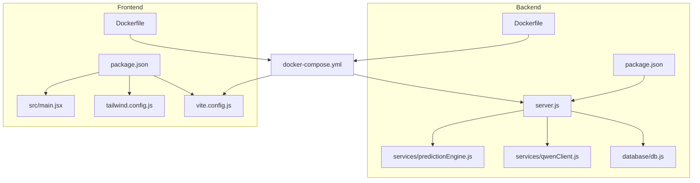
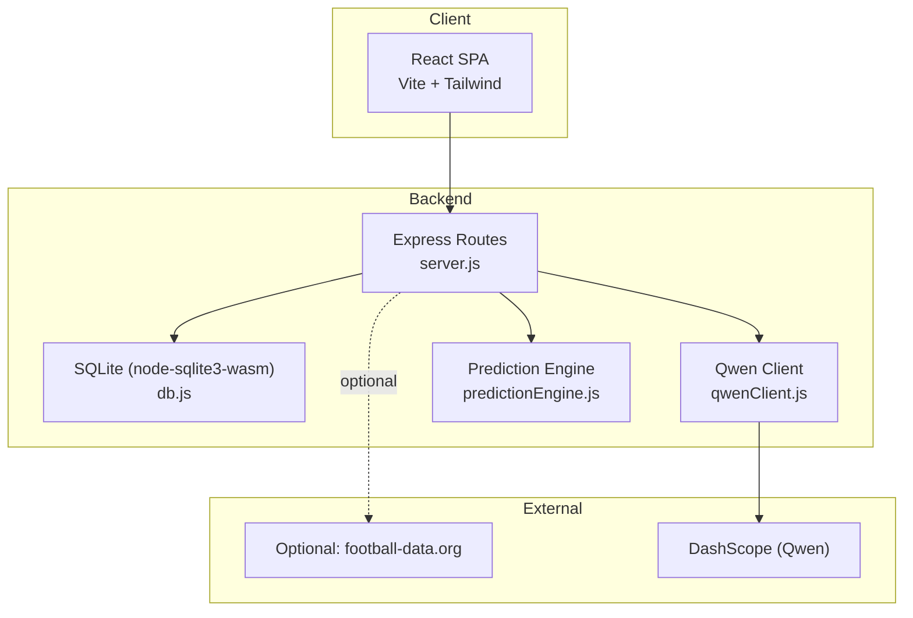
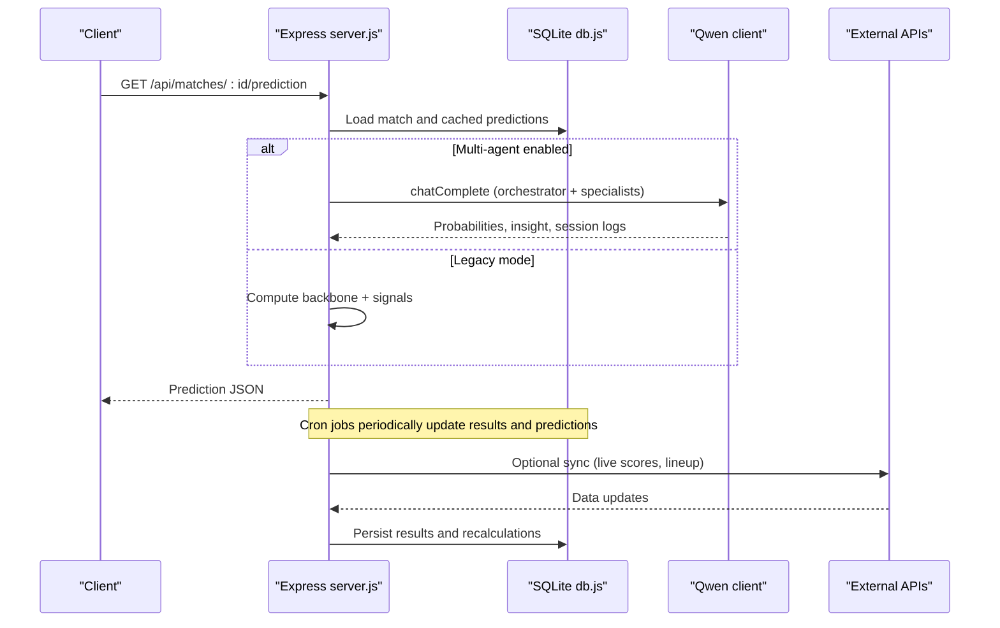
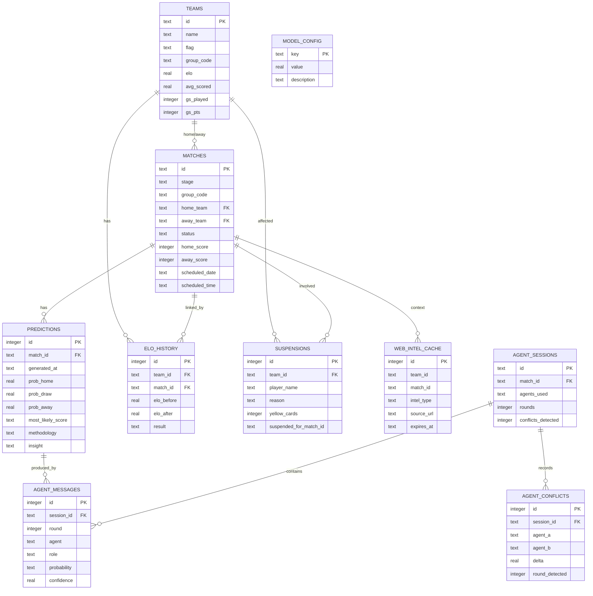
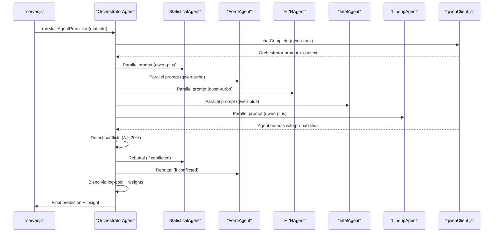
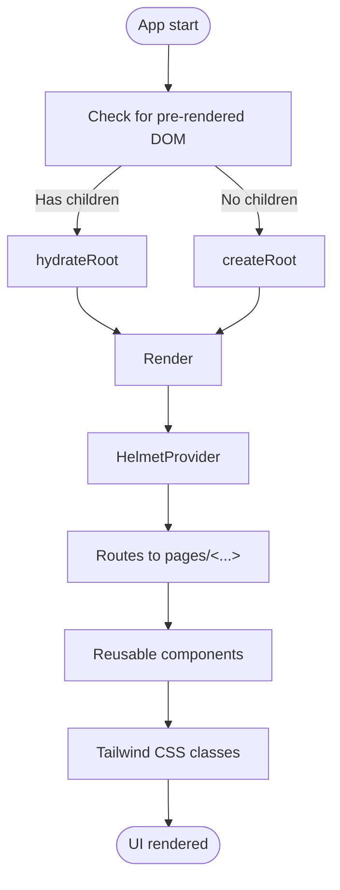
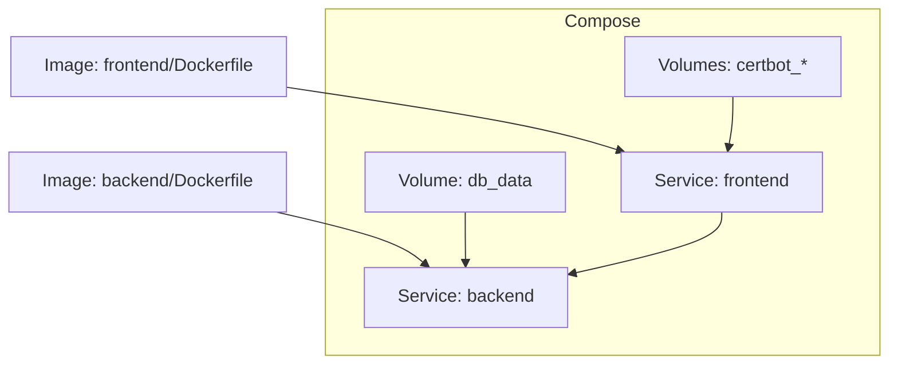
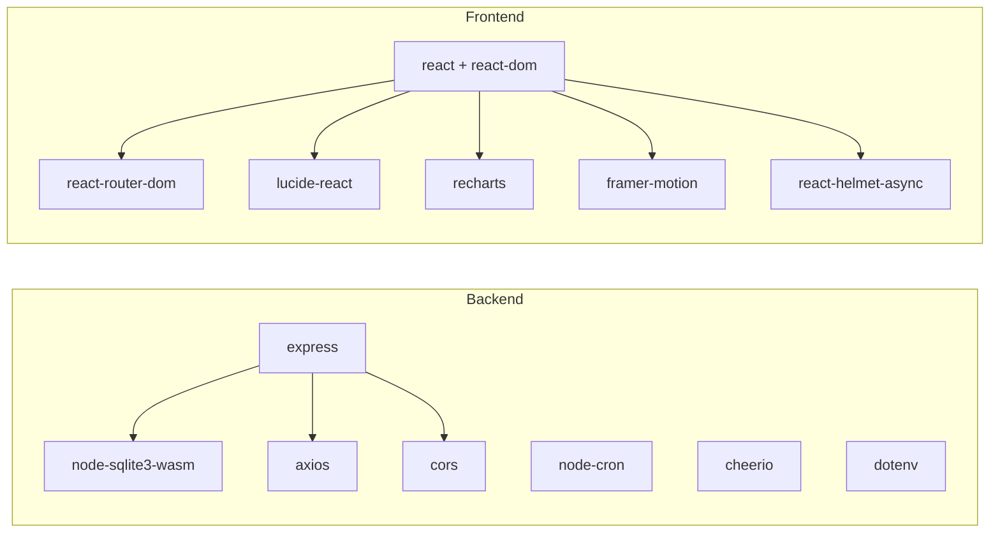

# Technology Stack

<cite>
**Referenced Files in This Document**
- [README.md](file://README.md)
- [SPEC.md](file://specs/SPEC.md)
- [docker-compose.yml](file://docker-compose.yml)
- [backend/package.json](file://backend/package.json)
- [backend/server.js](file://backend/server.js)
- [backend/database/db.js](file://backend/database/db.js)
- [backend/services/qwenClient.js](file://backend/services/qwenClient.js)
- [backend/services/predictionEngine.js](file://backend/services/predictionEngine.js)
- [backend/Dockerfile](file://backend/Dockerfile)
- [frontend/package.json](file://frontend/package.json)
- [frontend/vite.config.js](file://frontend/vite.config.js)
- [frontend/Dockerfile](file://frontend/Dockerfile)
- [frontend/tailwind.config.js](file://frontend/tailwind.config.js)
- [frontend/src/main.jsx](file://frontend/src/main.jsx)
- [backend/eslint.config.mjs](file://backend/eslint.config.mjs)
- [frontend/eslint.config.mjs](file://frontend/eslint.config.mjs)
- [backend/services/predictionEngine.test.js](file://backend/services/predictionEngine.test.js)
- [frontend/src/test/setup.js](file://frontend/src/test/setup.js)
</cite>

## Table of Contents
1. [Introduction](#introduction)
2. [Project Structure](#project-structure)
3. [Core Components](#core-components)
4. [Architecture Overview](#architecture-overview)
5. [Detailed Component Analysis](#detailed-component-analysis)
6. [Dependency Analysis](#dependency-analysis)
7. [Performance Considerations](#performance-considerations)
8. [Troubleshooting Guide](#troubleshooting-guide)
9. [Conclusion](#conclusion)
10. [Appendices](#appendices)

## Introduction
This document describes the technology stack powering the World Cup 2026 Prediction App. The backend is a Node.js/Express application with a SQLite database optimized for performance and reliability. The frontend is a React application built with Vite and styled with Tailwind CSS. Advanced prediction capabilities leverage Alibaba Cloud DashScope’s Qwen AI models (qwen-max, qwen-plus, qwen-turbo) through a multi-agent system. Containerization uses Docker and Docker Compose for production deployment. Real-time data synchronization is handled by cron jobs and optional external APIs. The document also covers build tools, testing frameworks, development environment setup, version compatibility, and notable customizations.

## Project Structure
The repository follows a monorepo layout with separate backend and frontend directories, each containing their own build, test, and configuration assets. Shared product specifications and deployment scripts reside at the repository root.

**Diagram sources**
- [backend/package.json:1-32](file://backend/package.json#L1-L32)
- [backend/server.js:1-723](file://backend/server.js#L1-L723)
- [backend/database/db.js:1-252](file://backend/database/db.js#L1-L252)
- [backend/services/qwenClient.js:1-123](file://backend/services/qwenClient.js#L1-L123)
- [backend/services/predictionEngine.js:1-200](file://backend/services/predictionEngine.js#L1-L200)
- [backend/Dockerfile:1-8](file://backend/Dockerfile#L1-L8)
- [frontend/package.json:1-72](file://frontend/package.json#L1-L72)
- [frontend/vite.config.js:1-26](file://frontend/vite.config.js#L1-L26)
- [frontend/Dockerfile:1-18](file://frontend/Dockerfile#L1-L18)
- [frontend/tailwind.config.js:1-161](file://frontend/tailwind.config.js#L1-L161)
- [frontend/src/main.jsx:1-22](file://frontend/src/main.jsx#L1-L22)
- [docker-compose.yml:1-34](file://docker-compose.yml#L1-L34)

**Section sources**
- [README.md:153-209](file://README.md#L153-L209)
- [docker-compose.yml:1-34](file://docker-compose.yml#L1-L34)

## Core Components
- Backend (Node.js + Express)
  - HTTP server with route handlers for teams, groups, matches, predictions, tournaments, suspensions, analytics, and synchronization.
  - Cron-based automation for live result sync, prediction regeneration, and lineup fetching.
  - SQLite database abstraction with node-sqlite3-wasm for WASM-enabled performance and concurrency-friendly pragmas.
- AI Integration (DashScope Qwen)
  - OpenAI-compatible client wrapper supporting qwen-max, qwen-plus, qwen-turbo with retry/backoff and latency tracking.
  - Multi-agent prediction pipeline with conflict detection and arbitration.
- Frontend (React + Vite + Tailwind)
  - SPA bootstrapped with React 18 and react-dom, using react-helmet-async for metadata and react-router-dom for navigation.
  - Vite-based build with proxy to backend API and test harness powered by Vitest and Testing Library.
  - Tailwind CSS with a custom theme aligned to Chinese landscape aesthetics and WC branding.
- Containerization (Docker + Docker Compose)
  - Separate multi-stage builds for backend and frontend, exposing appropriate ports and integrating Nginx for SSL/TLS with Certbot.
  - Compose orchestration with named volumes for persistence and environment-driven configuration.

**Section sources**
- [backend/server.js:1-723](file://backend/server.js#L1-L723)
- [backend/database/db.js:1-252](file://backend/database/db.js#L1-L252)
- [backend/services/qwenClient.js:1-123](file://backend/services/qwenClient.js#L1-L123)
- [backend/services/predictionEngine.js:1-200](file://backend/services/predictionEngine.js#L1-L200)
- [frontend/src/main.jsx:1-22](file://frontend/src/main.jsx#L1-L22)
- [frontend/vite.config.js:1-26](file://frontend/vite.config.js#L1-L26)
- [frontend/tailwind.config.js:1-161](file://frontend/tailwind.config.js#L1-L161)
- [backend/Dockerfile:1-8](file://backend/Dockerfile#L1-L8)
- [frontend/Dockerfile:1-18](file://frontend/Dockerfile#L1-L18)
- [docker-compose.yml:1-34](file://docker-compose.yml#L1-L34)

## Architecture Overview
The system comprises a backend API, a React frontend, and optional external integrations. The backend encapsulates the prediction engine, AI client, and data services, while the frontend consumes the API and renders interactive views. Docker Compose provisions backend and frontend services with shared volumes and environment configuration.

**Diagram sources**
- [backend/server.js:1-723](file://backend/server.js#L1-L723)
- [backend/database/db.js:1-252](file://backend/database/db.js#L1-L252)
- [backend/services/qwenClient.js:1-123](file://backend/services/qwenClient.js#L1-L123)
- [backend/services/predictionEngine.js:1-200](file://backend/services/predictionEngine.js#L1-L200)

## Detailed Component Analysis

### Backend: Express API and Data Services
- Routing and endpoints
  - Teams, groups, matches, predictions, tournament bracket, suspensions, analytics, and synchronization endpoints are implemented with Express.
  - Predictions endpoint supports refresh semantics and localization.
  - Tournament endpoints expose bracket data, winner probabilities, and simulation results.
- Cron automation
  - Live result sync every 5 minutes.
  - Hourly prediction regeneration window covering the next 3 match days.
  - Lineup fetch and re-prediction within 2 hours of kickoff.
- Static asset serving
  - In production, Express serves prebuilt frontend assets from the frontend dist directory.

**Diagram sources**
- [backend/server.js:326-341](file://backend/server.js#L326-L341)
- [backend/database/db.js:1-252](file://backend/database/db.js#L1-L252)
- [backend/services/qwenClient.js:1-123](file://backend/services/qwenClient.js#L1-L123)

**Section sources**
- [backend/server.js:24-723](file://backend/server.js#L24-L723)
- [backend/database/db.js:1-252](file://backend/database/db.js#L1-L252)

### Database: SQLite with node-sqlite3-wasm
- Design
  - Centralized schema with tables for teams, matches, predictions, model performance, ELO history, suspensions, web intelligence cache, model configuration, and multi-agent session artifacts.
  - Migrations add new columns and seed default model weights.
- Performance and reliability
  - Uses node-sqlite3-wasm for WASM-backed SQLite with explicit busy_timeout, synchronous mode tuning, and foreign keys enabled.
  - Lock cleanup for stale directory-based locks to prevent deadlocks.

**Diagram sources**
- [backend/database/db.js:23-208](file://backend/database/db.js#L23-L208)

**Section sources**
- [backend/database/db.js:1-252](file://backend/database/db.js#L1-L252)

### AI Integration: Qwen Client and Multi-Agent Prediction
- Qwen client
  - OpenAI-compatible axios client with base URL override, bearer token, and retry/backoff logic.
  - Supports three models: qwen-max (orchestrator), qwen-plus (statistical/intel/lineup), qwen-turbo (form/H2H).
- Multi-agent pipeline
  - Orchestrator coordinates specialists, detects conflicts (≥20% probability delta), negotiates, and blends results via log-pool with confidence-adjusted weights.
  - Stores agent session, messages, and conflicts for auditability.

**Diagram sources**
- [backend/services/qwenClient.js:1-123](file://backend/services/qwenClient.js#L1-L123)
- [backend/services/predictionEngine.js:1-200](file://backend/services/predictionEngine.js#L1-L200)

**Section sources**
- [backend/services/qwenClient.js:1-123](file://backend/services/qwenClient.js#L1-L123)
- [backend/services/predictionEngine.js:1-200](file://backend/services/predictionEngine.js#L1-L200)
- [SPEC.md:148-177](file://specs/SPEC.md#L148-L177)

### Frontend: React Application with Vite and Tailwind
- Bootstrapping and routing
  - Root renders App inside StrictMode and HelmetProvider; hydration logic adapts to pre-rendered content.
- Build and dev server
  - Vite config targets modern browsers, proxies /api to backend, and sets up Vitest with jsdom.
- Styling and theming
  - Tailwind theme extends fonts, colors, gradients, shadows, and spacing aligned to Chinese landscape and WC brand.
- Pages and components
  - Feature-rich pages for dashboard, schedule, match detail, groups, tournament, predictions, and team profiles.
  - Shared components for match cards, group tables, prediction bars, SEO metadata, and decorative elements.

**Diagram sources**
- [frontend/src/main.jsx:1-22](file://frontend/src/main.jsx#L1-L22)
- [frontend/vite.config.js:1-26](file://frontend/vite.config.js#L1-L26)
- [frontend/tailwind.config.js:1-161](file://frontend/tailwind.config.js#L1-L161)

**Section sources**
- [frontend/src/main.jsx:1-22](file://frontend/src/main.jsx#L1-L22)
- [frontend/vite.config.js:1-26](file://frontend/vite.config.js#L1-L26)
- [frontend/tailwind.config.js:1-161](file://frontend/tailwind.config.js#L1-L161)

### Containerization: Docker and Docker Compose
- Backend image
  - Alpine-based Node.js 20 image, installs dependencies excluding dev, copies source, exposes port, and starts via npm script.
- Frontend image
  - Multi-stage build: dev dependencies install, build runs, then Nginx serves static assets with templates for HTTP/HTTPS and Certbot.
- Compose orchestration
  - Two services: backend and frontend, with environment variables, volume mounts for DB persistence and SSL certs, and inter-service dependencies.

**Diagram sources**
- [backend/Dockerfile:1-8](file://backend/Dockerfile#L1-L8)
- [frontend/Dockerfile:1-18](file://frontend/Dockerfile#L1-L18)
- [docker-compose.yml:1-34](file://docker-compose.yml#L1-L34)

**Section sources**
- [backend/Dockerfile:1-8](file://backend/Dockerfile#L1-L8)
- [frontend/Dockerfile:1-18](file://frontend/Dockerfile#L1-L18)
- [docker-compose.yml:1-34](file://docker-compose.yml#L1-L34)

## Dependency Analysis
- Backend runtime dependencies
  - Express for HTTP routing, node-cron for scheduling, node-sqlite3-wasm for database, axios and cheerio for external integrations, dotenv for environment loading, cors for cross-origin allowance.
- Frontend dependencies
  - React ecosystem (react, react-dom), router (react-router-dom), UI libraries (lucide-react, recharts), animation (framer-motion), and SEO (react-helmet-async).
- Dev tooling
  - ESLint + Prettier for formatting and linting, with framework-specific configs for React and Node.js.

**Diagram sources**
- [backend/package.json:14-30](file://backend/package.json#L14-L30)
- [frontend/package.json:38-69](file://frontend/package.json#L38-L69)

**Section sources**
- [backend/package.json:1-32](file://backend/package.json#L1-L32)
- [frontend/package.json:1-72](file://frontend/package.json#L1-L72)
- [backend/eslint.config.mjs:1-24](file://backend/eslint.config.mjs#L1-L24)
- [frontend/eslint.config.mjs:1-54](file://frontend/eslint.config.mjs#L1-L54)

## Performance Considerations
- Database
  - node-sqlite3-wasm with tuned pragmas improves concurrency and reduces lock wait times; migrations ensure schema evolution without downtime.
- Prediction engine
  - Dixon-Coles bivariate Poisson backbone with low-score correction and log-pool blending avoids arithmetic averaging pitfalls and maintains coherent scoreline distributions.
- AI inference
  - Qwen client implements retry/backoff and tracks latency; model selection balances cost/performance (turbo for fast signals, plus for balanced tasks, max for orchestration).
- Frontend
  - Vite build targets modern browsers and enables pre-rendering via react-snap; Tailwind purges unused styles to reduce bundle size.
- Containerization
  - Alpine base images minimize footprint; multi-stage builds optimize production images; Nginx handles static assets efficiently.

[No sources needed since this section provides general guidance]

## Troubleshooting Guide
- Environment variables
  - Backend requires API keys for optional integrations; missing keys degrade functionality gracefully (fallback insights, synthetic form data).
- Database initialization
  - Schema creation and migrations occur on first connect; stale locks are removed automatically.
- Cron jobs
  - Verify timezone and schedule windows; ensure backend remains reachable by frontend for static asset serving.
- Frontend proxy
  - Confirm Vite proxy target matches backend port and CORS origin.
- Testing
  - Backend uses Node’s built-in test runner; frontend uses Vitest with jsdom. Setup files enable DOM assertions.

**Section sources**
- [README.md:139-151](file://README.md#L139-L151)
- [backend/database/db.js:10-21](file://backend/database/db.js#L10-L21)
- [backend/server.js:584-674](file://backend/server.js#L584-L674)
- [frontend/vite.config.js:11-19](file://frontend/vite.config.js#L11-L19)
- [backend/services/predictionEngine.test.js:1-200](file://backend/services/predictionEngine.test.js#L1-L200)
- [frontend/src/test/setup.js:1-2](file://frontend/src/test/setup.js#L1-L2)

## Conclusion
The World Cup 2026 Prediction App combines a robust Node.js/Express backend with a modern React frontend, delivering accurate, AI-enhanced predictions backed by a multi-agent Qwen system. SQLite with node-sqlite3-wasm ensures reliable, high-performance data persistence, while Docker and Docker Compose streamline production deployment. Cron-based automation keeps predictions fresh and synchronized with live events. The stack emphasizes maintainability through standardized tooling (ESLint/Prettier), comprehensive testing, and clear separation of concerns across backend, frontend, and infrastructure layers.

[No sources needed since this section summarizes without analyzing specific files]

## Appendices

### Version Compatibility and Tooling
- Backend
  - Node.js 20 (as used in Dockerfiles), CommonJS modules, ESLint 9.x, Prettier, and nodemon for development.
- Frontend
  - Node.js 20, Vite 5.x, React 18.x, Tailwind 3.x, Vitest, and Testing Library.
- AI
  - DashScope OpenAI-compatible API; Qwen models configured per agent specialization.

**Section sources**
- [backend/Dockerfile:1-8](file://backend/Dockerfile#L1-L8)
- [frontend/Dockerfile:1-18](file://frontend/Dockerfile#L1-L18)
- [backend/package.json:1-32](file://backend/package.json#L1-L32)
- [frontend/package.json:1-72](file://frontend/package.json#L1-L72)
- [backend/eslint.config.mjs:1-24](file://backend/eslint.config.mjs#L1-L24)
- [frontend/eslint.config.mjs:1-54](file://frontend/eslint.config.mjs#L1-L54)

### Custom Implementations and Modifications
- node-sqlite3-wasm integration with explicit busy_timeout and lock cleanup.
- Custom Qwen client wrapper with retry/backoff and ping utility.
- Multi-agent prediction pipeline with conflict detection, arbitration, and log-pool blending.
- Vite target set to support react-snap’s Chromium baseline; Tailwind theme customized for Chinese aesthetics and WC branding.

**Section sources**
- [backend/database/db.js:10-21](file://backend/database/db.js#L10-L21)
- [backend/services/qwenClient.js:1-123](file://backend/services/qwenClient.js#L1-L123)
- [backend/services/predictionEngine.js:1-200](file://backend/services/predictionEngine.js#L1-L200)
- [frontend/vite.config.js:7-9](file://frontend/vite.config.js#L7-L9)
- [frontend/tailwind.config.js:1-161](file://frontend/tailwind.config.js#L1-L161)