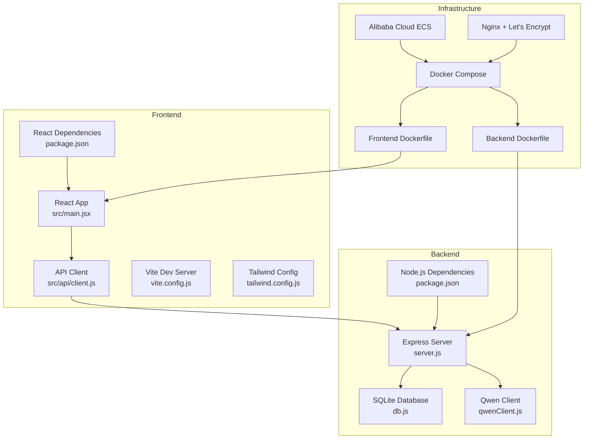
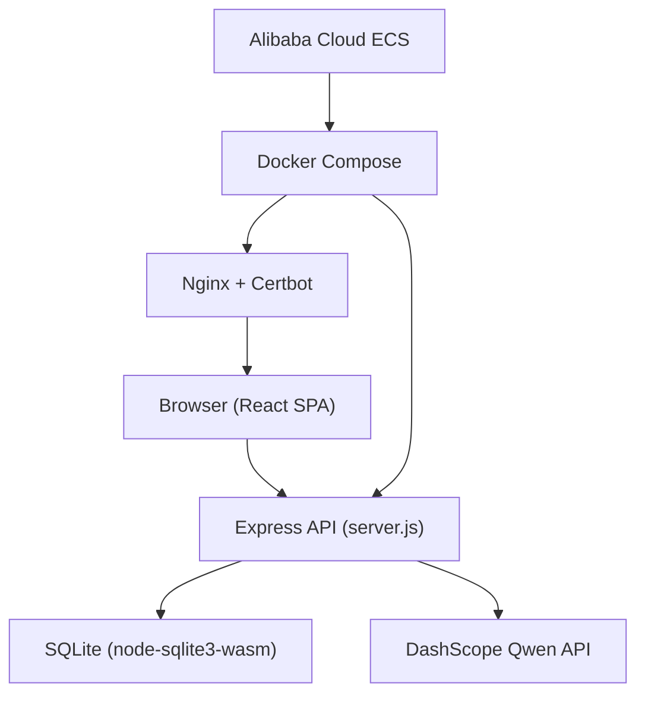
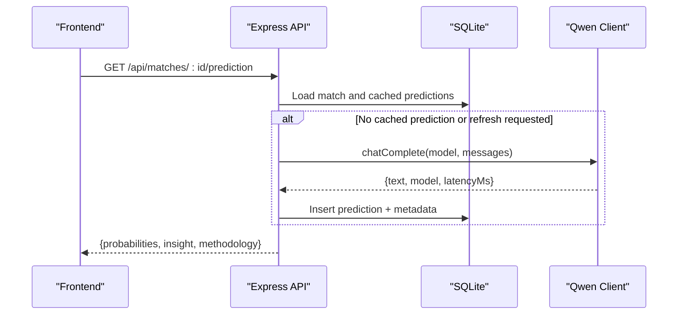
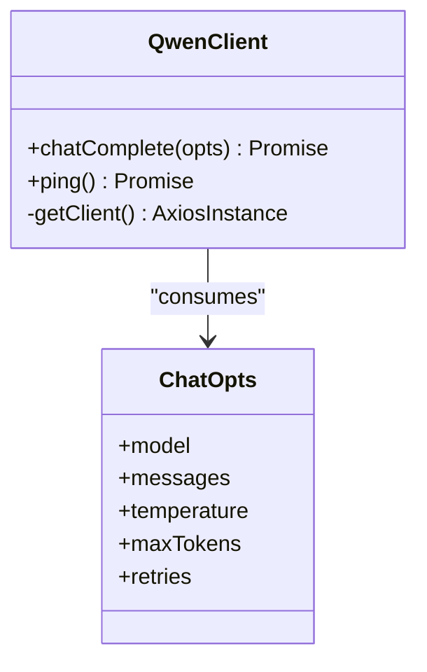
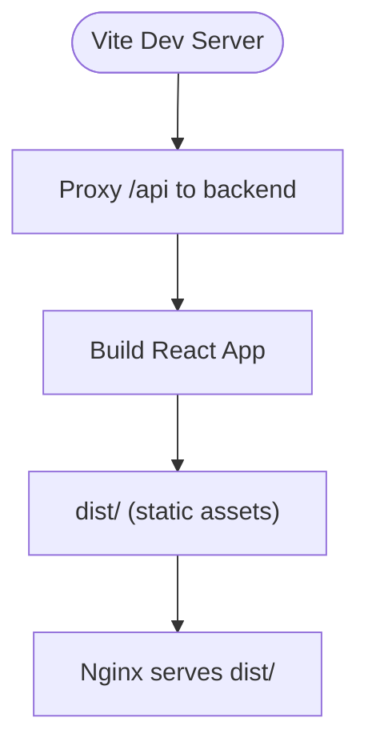
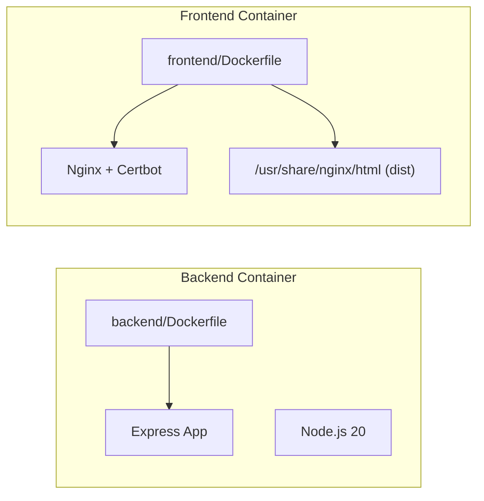
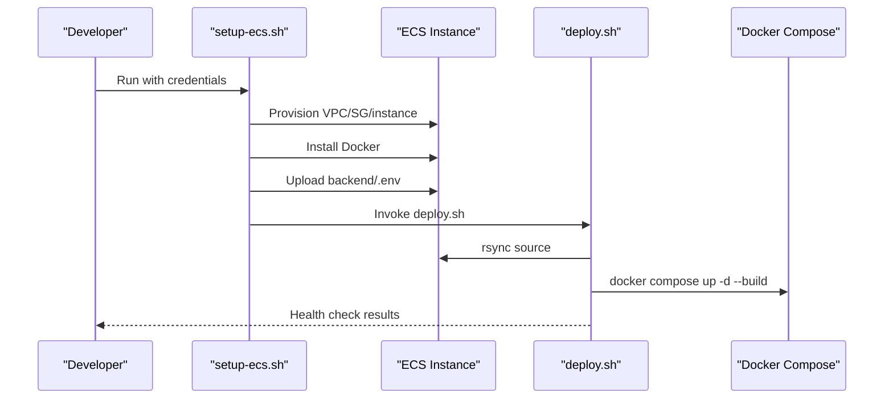
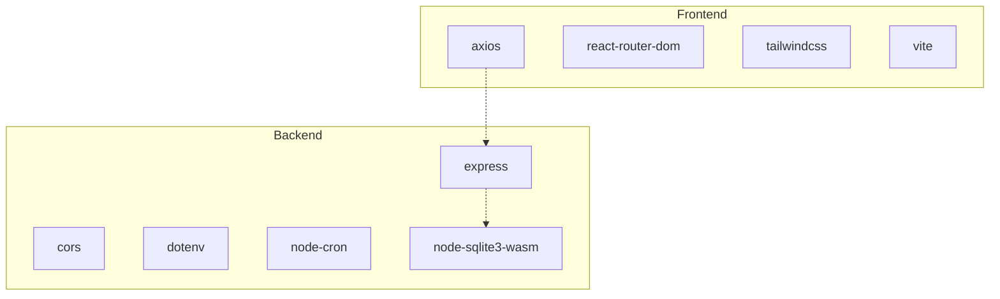

# Technology Stack

<cite>
**Referenced Files in This Document**
- [README.md](file://README.md)
- [backend/package.json](file://backend/package.json)
- [frontend/package.json](file://frontend/package.json)
- [docker-compose.yml](file://docker-compose.yml)
- [backend/Dockerfile](file://backend/Dockerfile)
- [frontend/Dockerfile](file://frontend/Dockerfile)
- [backend/server.js](file://backend/server.js)
- [backend/services/qwenClient.js](file://backend/services/qwenClient.js)
- [frontend/src/api/client.js](file://frontend/src/api/client.js)
- [backend/database/db.js](file://backend/database/db.js)
- [frontend/vite.config.js](file://frontend/vite.config.js)
- [frontend/tailwind.config.js](file://frontend/tailwind.config.js)
- [backend/eslint.config.mjs](file://backend/eslint.config.mjs)
- [frontend/eslint.config.mjs](file://frontend/eslint.config.mjs)
- [deploy.sh](file://deploy.sh)
- [setup-ecs.sh](file://setup-ecs.sh)
</cite>

## Table of Contents
1. [Introduction](#introduction)
2. [Project Structure](#project-structure)
3. [Core Components](#core-components)
4. [Architecture Overview](#architecture-overview)
5. [Detailed Component Analysis](#detailed-component-analysis)
6. [Dependency Analysis](#dependency-analysis)
7. [Performance Considerations](#performance-considerations)
8. [Troubleshooting Guide](#troubleshooting-guide)
9. [Conclusion](#conclusion)

## Introduction
This document describes the full-stack technology architecture of the WC26-Qwen-Qoder application. It covers the backend built with Node.js and Express.js using an SQLite database, the React 18 frontend with Vite, Alibaba Cloud Qwen AI models (qwen-max, qwen-plus, qwen-turbo), Docker containerization with multi-stage builds, Nginx with SSL/TLS via Let's Encrypt, and automated deployment pipelines on Alibaba Cloud ECS. It also explains the rationale behind each technology choice, version requirements, integration patterns, and operational tooling.

## Project Structure
The repository follows a monorepo layout with a clear separation between backend and frontend, plus shared deployment and infrastructure automation scripts:
- backend: Node.js/Express API, SQLite database, Qwen client, prediction engine, and services
- frontend: React 18 SPA with Vite, Tailwind CSS, and pre-rendering support
- Infrastructure: Docker multi-stage builds, Nginx templates, and Bash automation for ECS provisioning and deployment

**Diagram sources**
- [backend/server.js:1-681](file://backend/server.js#L1-L681)
- [backend/database/db.js:1-252](file://backend/database/db.js#L1-L252)
- [backend/services/qwenClient.js:1-123](file://backend/services/qwenClient.js#L1-L123)
- [frontend/src/api/client.js:1-50](file://frontend/src/api/client.js#L1-L50)
- [frontend/vite.config.js:1-26](file://frontend/vite.config.js#L1-L26)
- [frontend/tailwind.config.js:1-161](file://frontend/tailwind.config.js#L1-L161)
- [backend/Dockerfile:1-8](file://backend/Dockerfile#L1-L8)
- [frontend/Dockerfile:1-18](file://frontend/Dockerfile#L1-L18)
- [docker-compose.yml:1-34](file://docker-compose.yml#L1-L34)

**Section sources**
- [README.md:106-152](file://README.md#L106-L152)
- [docker-compose.yml:1-34](file://docker-compose.yml#L1-L34)

## Core Components
- Backend (Node.js/Express/SQLite): Provides REST APIs for teams, matches, predictions, tournaments, analytics, and scheduled tasks. Uses SQLite via node-sqlite3-wasm with WAL-like pragmas and migrations.
- Frontend (React 18/Vite): Single-page application with routing, theming, i18n, and pre-rendering. Built with Vite and served statically in production.
- Qwen AI (DashScope): OpenAI-compatible client integrated for multi-agent orchestration and specialized agents (statistical, form, H2H, intel, lineup).
- Containerization (Docker): Multi-stage builds for backend and frontend; Nginx with SSL/TLS and Let's Encrypt automation.
- Deployment (Alibaba Cloud ECS): Automated provisioning and deployment via Bash scripts and Docker Compose.

**Section sources**
- [backend/server.js:1-681](file://backend/server.js#L1-L681)
- [backend/database/db.js:1-252](file://backend/database/db.js#L1-L252)
- [frontend/src/api/client.js:1-50](file://frontend/src/api/client.js#L1-L50)
- [backend/services/qwenClient.js:1-123](file://backend/services/qwenClient.js#L1-L123)
- [backend/Dockerfile:1-8](file://backend/Dockerfile#L1-L8)
- [frontend/Dockerfile:1-18](file://frontend/Dockerfile#L1-L18)
- [docker-compose.yml:1-34](file://docker-compose.yml#L1-L34)
- [README.md:106-152](file://README.md#L106-L152)

## Architecture Overview
The system integrates a React frontend with a Node.js/Express backend, backed by an SQLite database. The backend exposes REST endpoints consumed by the frontend. Qwen models are invoked via DashScope’s OpenAI-compatible API. Docker Compose orchestrates backend and frontend containers, with Nginx serving static assets and handling HTTPS via Certbot/Let's Encrypt.

**Diagram sources**
- [backend/server.js:1-681](file://backend/server.js#L1-L681)
- [backend/database/db.js:1-252](file://backend/database/db.js#L1-L252)
- [backend/services/qwenClient.js:1-123](file://backend/services/qwenClient.js#L1-L123)
- [docker-compose.yml:1-34](file://docker-compose.yml#L1-L34)
- [frontend/Dockerfile:1-18](file://frontend/Dockerfile#L1-L18)

## Detailed Component Analysis

### Backend: Node.js/Express/SQLite
- Framework and middleware: Express with CORS and JSON body parsing.
- Database: node-sqlite3-wasm with initialization, migrations, and PRAGMAs for concurrency and integrity.
- Routes: Teams, groups, matches, predictions, tournament bracket, suspensions, analytics, and synchronization.
- Scheduling: node-cron jobs for live result sync and hourly prediction regeneration windows.
- Static serving: Serves the React frontend distribution in production.

**Diagram sources**
- [frontend/src/api/client.js:1-50](file://frontend/src/api/client.js#L1-L50)
- [backend/server.js:326-341](file://backend/server.js#L326-L341)
- [backend/services/qwenClient.js:53-101](file://backend/services/qwenClient.js#L53-L101)
- [backend/database/db.js:72-94](file://backend/database/db.js#L72-L94)

**Section sources**
- [backend/server.js:1-681](file://backend/server.js#L1-L681)
- [backend/database/db.js:1-252](file://backend/database/db.js#L1-L252)
- [backend/package.json:1-32](file://backend/package.json#L1-L32)

### Qwen AI Integration (DashScope)
- OpenAI-compatible axios client with Bearer token authentication.
- Supports three models: qwen-max (orchestrator), qwen-plus (balanced), qwen-turbo (fast).
- Includes retry logic and latency tracking; ping() validates connectivity.

**Diagram sources**
- [backend/services/qwenClient.js:1-123](file://backend/services/qwenClient.js#L1-L123)

**Section sources**
- [backend/services/qwenClient.js:1-123](file://backend/services/qwenClient.js#L1-L123)
- [README.md:18-105](file://README.md#L18-L105)

### Frontend: React 18 + Vite + Tailwind CSS
- React 18 with hooks, routing, theming, and i18n.
- Vite dev server with proxy to backend API.
- Tailwind CSS with custom color palettes inspired by Chinese landscape painting.
- Pre-rendering via react-snap for improved SEO.

**Diagram sources**
- [frontend/vite.config.js:1-26](file://frontend/vite.config.js#L1-L26)
- [frontend/tailwind.config.js:1-161](file://frontend/tailwind.config.js#L1-L161)
- [frontend/Dockerfile:1-18](file://frontend/Dockerfile#L1-L18)

**Section sources**
- [frontend/package.json:1-72](file://frontend/package.json#L1-L72)
- [frontend/vite.config.js:1-26](file://frontend/vite.config.js#L1-L26)
- [frontend/tailwind.config.js:1-161](file://frontend/tailwind.config.js#L1-L161)

### Containerization and Nginx with SSL/TLS
- Backend: Node.js 20 Alpine multi-stage build, installs production dependencies only, exposes port 5173.
- Frontend: Multi-stage build with Nginx Alpine; copies dist/, Nginx config templates, and entrypoint for Certbot.
- docker-compose: Defines backend and frontend services, environment variables, volumes for SQLite and Certbot, and inter-service networking.

**Diagram sources**
- [backend/Dockerfile:1-8](file://backend/Dockerfile#L1-L8)
- [frontend/Dockerfile:1-18](file://frontend/Dockerfile#L1-L18)
- [docker-compose.yml:1-34](file://docker-compose.yml#L1-L34)

**Section sources**
- [backend/Dockerfile:1-8](file://backend/Dockerfile#L1-L8)
- [frontend/Dockerfile:1-18](file://frontend/Dockerfile#L1-L18)
- [docker-compose.yml:1-34](file://docker-compose.yml#L1-L34)

### Automated Deployment Pipelines
- setup-ecs.sh: Automates Alibaba Cloud ECS provisioning (VPC, security group, instance), Docker installation, uploads .env, and triggers deploy.sh.
- deploy.sh: Rsyncs source to ECS, ensures .env exists, builds/restarts containers, performs health checks for backend and HTTPS.

**Diagram sources**
- [setup-ecs.sh:1-443](file://setup-ecs.sh#L1-L443)
- [deploy.sh:1-110](file://deploy.sh#L1-L110)
- [docker-compose.yml:1-34](file://docker-compose.yml#L1-L34)

**Section sources**
- [setup-ecs.sh:1-443](file://setup-ecs.sh#L1-L443)
- [deploy.sh:1-110](file://deploy.sh#L1-L110)

## Dependency Analysis
- Backend runtime dependencies include Express, CORS, dotenv, node-cron, and node-sqlite3-wasm.
- Frontend dependencies include React 18, React Router, Tailwind CSS, and Vite toolchain.
- Both packages integrate ESLint and Prettier for code quality and formatting.
- The backend API client in the frontend uses Axios and respects Vite environment variables for base URLs.

**Diagram sources**
- [backend/package.json:14-22](file://backend/package.json#L14-L22)
- [frontend/package.json:38-48](file://frontend/package.json#L38-L48)

**Section sources**
- [backend/package.json:1-32](file://backend/package.json#L1-L32)
- [frontend/package.json:1-72](file://frontend/package.json#L1-L72)

## Performance Considerations
- SQLite with node-sqlite3-wasm provides embedded persistence suitable for this workload; ensure adequate disk I/O and volume mounting for durability.
- Qwen calls are retried with exponential backoff; consider rate limiting and caching for repeated predictions.
- Frontend pre-rendering reduces initial load times; keep asset sizes optimized and leverage Tailwind purging in production.
- Cron scheduling targets tournament windows to minimize unnecessary work outside active periods.

[No sources needed since this section provides general guidance]

## Troubleshooting Guide
- Backend API not responding: Check container logs and health checks performed by deploy.sh.
- HTTPS not active: Confirm domain and certificate email variables and inspect Nginx logs for Certbot activity.
- Qwen connectivity errors: Verify DASHSCOPE_API_KEY and network reachability; use the ping() helper to validate.
- SQLite locking: Stale locks are removed on initialization; ensure only one writer and proper volume mounts.

**Section sources**
- [deploy.sh:81-96](file://deploy.sh#L81-L96)
- [backend/services/qwenClient.js:107-120](file://backend/services/qwenClient.js#L107-L120)
- [backend/database/db.js:10-21](file://backend/database/db.js#L10-L21)

## Conclusion
WC26-Qwen-Qoder combines a pragmatic full-stack architecture with modern tooling: Node.js/Express and SQLite for the backend, React 18/Vite for the frontend, and Alibaba Cloud Qwen for AI-powered predictions. Docker and Nginx deliver robust containerized deployments with automated HTTPS via Let's Encrypt. The provided scripts streamline provisioning and deployment on Alibaba Cloud ECS, enabling repeatable, production-grade operations.

[No sources needed since this section summarizes without analyzing specific files]