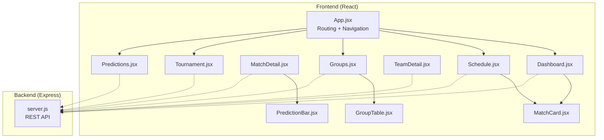
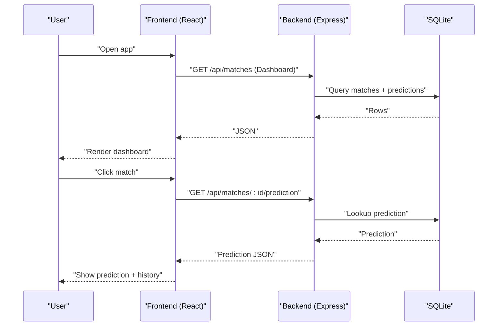
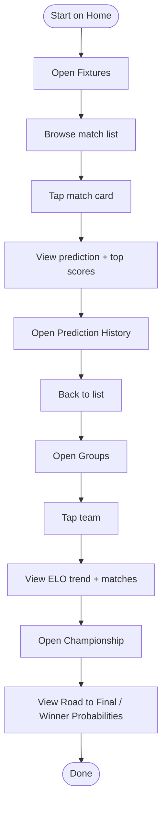
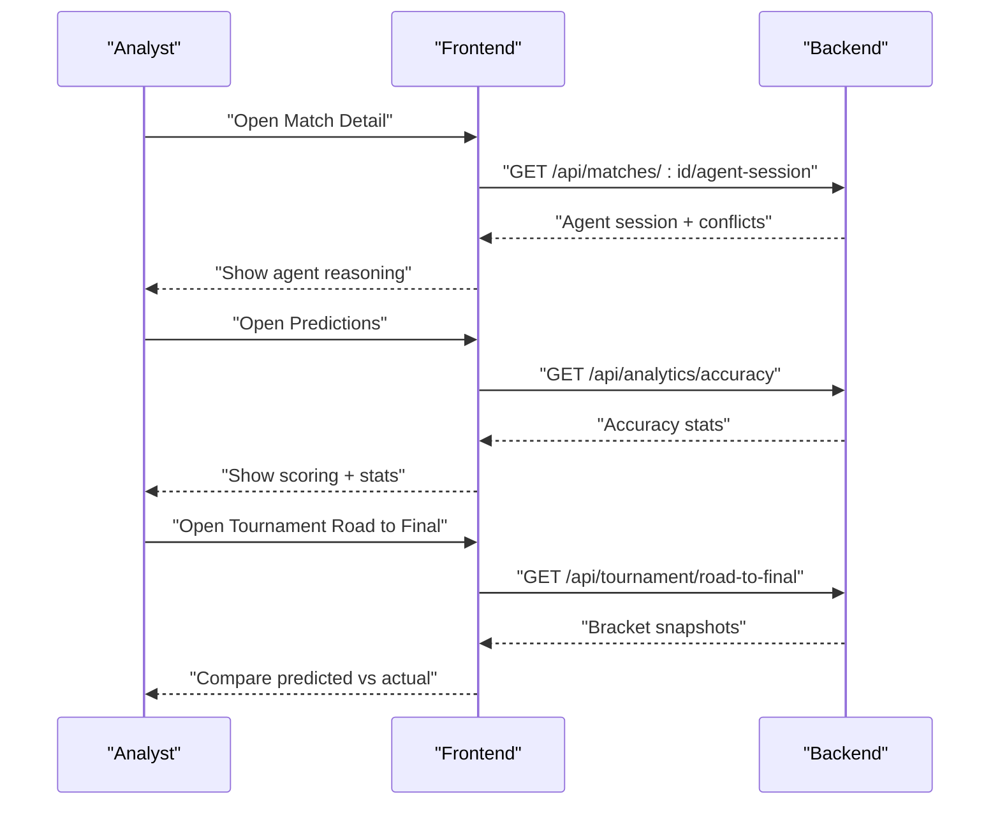
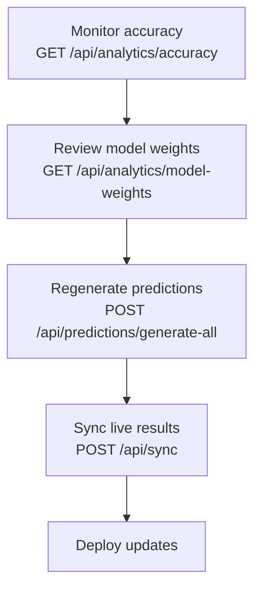
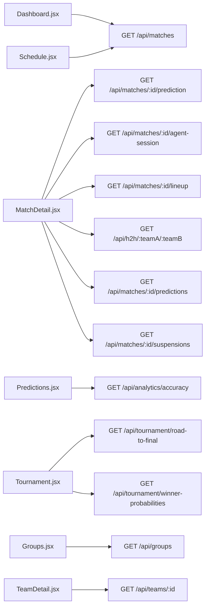

# User Workflows

<cite>
**Referenced Files in This Document**
- [README.md](file://README.md)
- [App.jsx](file://frontend/src/App.jsx)
- [Dashboard.jsx](file://frontend/src/pages/Dashboard.jsx)
- [Schedule.jsx](file://frontend/src/pages/Schedule.jsx)
- [MatchDetail.jsx](file://frontend/src/pages/MatchDetail.jsx)
- [Predictions.jsx](file://frontend/src/pages/Predictions.jsx)
- [TeamDetail.jsx](file://frontend/src/pages/TeamDetail.jsx)
- [Tournament.jsx](file://frontend/src/pages/Tournament.jsx)
- [Groups.jsx](file://frontend/src/pages/Groups.jsx)
- [MatchCard.jsx](file://frontend/src/components/MatchCard.jsx)
- [PredictionBar.jsx](file://frontend/src/components/PredictionBar.jsx)
- [GroupTable.jsx](file://frontend/src/components/GroupTable.jsx)
- [server.js](file://backend/server.js)
</cite>

## Table of Contents
1. [Introduction](#introduction)
2. [Project Structure](#project-structure)
3. [Core Components](#core-components)
4. [Architecture Overview](#architecture-overview)
5. [Detailed Component Analysis](#detailed-component-analysis)
6. [Dependency Analysis](#dependency-analysis)
7. [Performance Considerations](#performance-considerations)
8. [Troubleshooting Guide](#troubleshooting-guide)
9. [Conclusion](#conclusion)
10. [Appendices](#appendices)

## Introduction
This document describes the WC26-Qwen-Qoder user workflows for three roles: fan, analyst, and administrator. It explains the primary user journeys, navigation patterns, page interactions, and data visualization components. It also covers mobile-responsive design and accessibility features, and provides step-by-step examples for common tasks such as checking match predictions, exploring team statistics, analyzing tournament brackets, and accessing detailed analytics.

## Project Structure
The application is a React frontend with a Node.js/Express backend. The frontend defines the user-facing pages and components, while the backend exposes REST endpoints for matches, teams, predictions, analytics, and tournament simulations. Routing is handled client-side with React Router, and the backend serves static assets in production.

**Diagram sources**
- [App.jsx:1-284](file://frontend/src/App.jsx#L1-L284)
- [Dashboard.jsx:1-706](file://frontend/src/pages/Dashboard.jsx#L1-L706)
- [Schedule.jsx:1-494](file://frontend/src/pages/Schedule.jsx#L1-L494)
- [MatchDetail.jsx:1-800](file://frontend/src/pages/MatchDetail.jsx#L1-L800)
- [Predictions.jsx:1-514](file://frontend/src/pages/Predictions.jsx#L1-L514)
- [TeamDetail.jsx:1-392](file://frontend/src/pages/TeamDetail.jsx#L1-L392)
- [Tournament.jsx:1-444](file://frontend/src/pages/Tournament.jsx#L1-L444)
- [Groups.jsx:1-160](file://frontend/src/pages/Groups.jsx#L1-L160)
- [MatchCard.jsx:1-175](file://frontend/src/components/MatchCard.jsx#L1-L175)
- [PredictionBar.jsx:1-51](file://frontend/src/components/PredictionBar.jsx#L1-L51)
- [GroupTable.jsx:1-78](file://frontend/src/components/GroupTable.jsx#L1-L78)
- [server.js:1-681](file://backend/server.js#L1-L681)

**Section sources**
- [README.md:1-263](file://README.md#L1-L263)
- [App.jsx:1-284](file://frontend/src/App.jsx#L1-L284)
- [server.js:1-681](file://backend/server.js#L1-L681)

## Core Components
- Navigation and routing: Centralized in App.jsx with desktop and mobile navigation bars and bottom tab bar.
- Pages:
  - Dashboard: Today’s matches, top picks, tournament progress, and quick links.
  - Schedule: Chronological list of all matches with filtering and view modes.
  - Groups: Live group standings and match previews.
  - Tournament: Knockout bracket visualization and winner probabilities.
  - Predictions: Consolidated predictions vs actuals with accuracy metrics.
  - Team Detail: Team profile, ELO trajectory, group context, and match history.
  - Match Detail: Prediction breakdown, agent session viewer, H2H timeline, lineup, suspensions, and prediction history.
- Shared components:
  - MatchCard: Compact match preview with flags, names, probabilities, and outcomes.
  - PredictionBar: Horizontal segmented bar for win/draw/loss probabilities.
  - GroupTable: Standings table with qualification indicators.

**Section sources**
- [App.jsx:13-284](file://frontend/src/App.jsx#L13-L284)
- [Dashboard.jsx:137-706](file://frontend/src/pages/Dashboard.jsx#L137-L706)
- [Schedule.jsx:135-494](file://frontend/src/pages/Schedule.jsx#L135-L494)
- [Groups.jsx:11-160](file://frontend/src/pages/Groups.jsx#L11-L160)
- [Tournament.jsx:376-444](file://frontend/src/pages/Tournament.jsx#L376-L444)
- [Predictions.jsx:277-514](file://frontend/src/pages/Predictions.jsx#L277-L514)
- [TeamDetail.jsx:82-392](file://frontend/src/pages/TeamDetail.jsx#L82-L392)
- [MatchDetail.jsx:723-1345](file://frontend/src/pages/MatchDetail.jsx#L723-L1345)
- [MatchCard.jsx:21-175](file://frontend/src/components/MatchCard.jsx#L21-L175)
- [PredictionBar.jsx:3-51](file://frontend/src/components/PredictionBar.jsx#L3-L51)
- [GroupTable.jsx:7-78](file://frontend/src/components/GroupTable.jsx#L7-L78)

## Architecture Overview
The frontend consumes the backend API endpoints for data. The backend orchestrates prediction generation, live result synchronization, and analytics computation. Multi-agent prediction sessions are persisted and retrievable for inspection.

**Diagram sources**
- [server.js:110-165](file://backend/server.js#L110-L165)
- [MatchDetail.jsx:723-800](file://frontend/src/pages/MatchDetail.jsx#L723-L800)
- [Dashboard.jsx:137-200](file://frontend/src/pages/Dashboard.jsx#L137-L200)

**Section sources**
- [server.js:1-681](file://backend/server.js#L1-L681)
- [README.md:18-104](file://README.md#L18-L104)

## Detailed Component Analysis

### Fan Workflow: Browse Matches → View Predictions → Track Results
Primary goal: Discover upcoming matches, understand predictions, and track results as they happen.

- Navigation pattern:
  - Desktop: Top navigation bar with links to Home, Fixtures, Groups, Championship, Predictions.
  - Mobile: Bottom tab bar with the same destinations.
- Step-by-step example: Checking match predictions
  1. From Home, browse “Upcoming Matches” cards.
  2. Tap a match card to go to Match Detail.
  3. Review the predicted score, top 3 scorelines, and confidence level.
  4. Expand Prediction History to see how probabilities evolved over time.
- Step-by-step example: Exploring team statistics
  1. From Groups, tap a team to view Team Detail.
  2. Review ELO trend chart, group position, and all matches.
- Step-by-step example: Analyzing tournament brackets
  1. Go to Championship and switch tabs to Road to Final or Winner Probabilities.
  2. Visualize bracket progression and see top teams’ chances.
- Step-by-step example: Accessing detailed analytics
  1. Go to Predictions to see consolidated accuracy stats and scoring methodology.

**Diagram sources**
- [App.jsx:13-284](file://frontend/src/App.jsx#L13-L284)
- [Dashboard.jsx:454-595](file://frontend/src/pages/Dashboard.jsx#L454-L595)
- [Schedule.jsx:135-494](file://frontend/src/pages/Schedule.jsx#L135-L494)
- [MatchCard.jsx:40-175](file://frontend/src/components/MatchCard.jsx#L40-L175)
- [MatchDetail.jsx:70-248](file://frontend/src/pages/MatchDetail.jsx#L70-L248)
- [TeamDetail.jsx:82-392](file://frontend/src/pages/TeamDetail.jsx#L82-L392)
- [Tournament.jsx:376-444](file://frontend/src/pages/Tournament.jsx#L376-L444)
- [Predictions.jsx:277-514](file://frontend/src/pages/Predictions.jsx#L277-L514)

**Section sources**
- [App.jsx:13-284](file://frontend/src/App.jsx#L13-L284)
- [Dashboard.jsx:137-706](file://frontend/src/pages/Dashboard.jsx#L137-L706)
- [Schedule.jsx:135-494](file://frontend/src/pages/Schedule.jsx#L135-L494)
- [MatchCard.jsx:21-175](file://frontend/src/components/MatchCard.jsx#L21-L175)
- [MatchDetail.jsx:70-800](file://frontend/src/pages/MatchDetail.jsx#L70-L800)
- [TeamDetail.jsx:82-392](file://frontend/src/pages/TeamDetail.jsx#L82-L392)
- [Tournament.jsx:376-444](file://frontend/src/pages/Tournament.jsx#L376-L444)
- [Predictions.jsx:277-514](file://frontend/src/pages/Predictions.jsx#L277-L514)

### Analyst Workflow: Compare Agent Insights → Review Historical Accuracy → Export Analytics
Primary goal: Inspect multi-agent reasoning, evaluate model performance, and export analytics.

- Navigation pattern:
  - Use Championship → Road to Final to compare predicted vs actual brackets.
  - Use Predictions to review consolidated accuracy and scoring.
  - Use Match Detail → Agent Session Viewer to inspect reasoning and conflicts.
- Step-by-step example: Comparing agent insights
  1. Open a match in Match Detail.
  2. Expand Agent Session Viewer to see each agent’s probability estimates, confidence, and evidence.
  3. Review detected conflicts and rebuttal rounds.
- Step-by-step example: Reviewing historical accuracy
  1. Open Predictions page.
  2. Filter by status (SCHEDULED/LIVE/COMPLETED) and group.
  3. Review accuracy stats and scoring methodology.
- Step-by-step example: Exporting analytics
  - Use backend endpoints to retrieve analytics data (accuracy, model weights, agent performance).
  - Example endpoints: GET /api/analytics/accuracy, GET /api/analytics/model-weights, GET /api/analytics/agent-performance.

**Diagram sources**
- [MatchDetail.jsx:428-608](file://frontend/src/pages/MatchDetail.jsx#L428-L608)
- [server.js:343-382](file://backend/server.js#L343-L382)
- [Predictions.jsx:277-514](file://frontend/src/pages/Predictions.jsx#L277-L514)
- [server.js:527-570](file://backend/server.js#L527-L570)
- [Tournament.jsx:184-262](file://frontend/src/pages/Tournament.jsx#L184-L262)
- [server.js:491-499](file://backend/server.js#L491-L499)

**Section sources**
- [MatchDetail.jsx:428-608](file://frontend/src/pages/MatchDetail.jsx#L428-L608)
- [server.js:343-382](file://backend/server.js#L343-L382)
- [Predictions.jsx:277-514](file://frontend/src/pages/Predictions.jsx#L277-L514)
- [server.js:527-570](file://backend/server.js#L527-L570)
- [Tournament.jsx:184-262](file://frontend/src/pages/Tournament.jsx#L184-L262)
- [server.js:491-499](file://backend/server.js#L491-L499)

### Administrator Workflow: Monitor System Health → Update Model Parameters → Manage Deployments
Primary goal: Observe system status, adjust model configuration, and manage predictions.

- Monitoring:
  - Use backend analytics endpoints to monitor accuracy and agent performance.
  - Use sync endpoint to refresh live results.
- Updating model parameters:
  - Retrieve model configuration weights via GET /api/analytics/model-weights.
  - Use batch prediction endpoint to regenerate predictions for active stages.
- Managing deployments:
  - The backend includes deployment-related scripts and Docker configuration referenced in the repository.

**Diagram sources**
- [server.js:527-570](file://backend/server.js#L527-L570)
- [server.js:532-536](file://backend/server.js#L532-L536)
- [server.js:399-461](file://backend/server.js#L399-L461)
- [server.js:574-582](file://backend/server.js#L574-L582)

**Section sources**
- [server.js:527-582](file://backend/server.js#L527-L582)
- [server.js:399-461](file://backend/server.js#L399-L461)

## Dependency Analysis
- Frontend depends on backend REST endpoints for all data.
- Match Detail depends on multiple backend endpoints: match metadata, prediction, lineup, H2H, prediction history, suspensions, and agent session.
- Tournament page depends on road-to-final and winner probabilities endpoints.
- Predictions page depends on accuracy and match lists.

**Diagram sources**
- [Dashboard.jsx:137-156](file://frontend/src/pages/Dashboard.jsx#L137-L156)
- [Schedule.jsx:135-154](file://frontend/src/pages/Schedule.jsx#L135-L154)
- [MatchDetail.jsx:723-756](file://frontend/src/pages/MatchDetail.jsx#L723-L756)
- [server.js:325-341](file://backend/server.js#L325-L341)
- [server.js:343-382](file://backend/server.js#L343-L382)
- [server.js:304-312](file://backend/server.js#L304-L312)
- [server.js:314-322](file://backend/server.js#L314-L322)
- [server.js:384-397](file://backend/server.js#L384-L397)
- [server.js:514-525](file://backend/server.js#L514-L525)
- [Predictions.jsx:277-298](file://frontend/src/pages/Predictions.jsx#L277-L298)
- [server.js:527-530](file://backend/server.js#L527-L530)
- [Tournament.jsx:184-201](file://frontend/src/pages/Tournament.jsx#L184-L201)
- [server.js:491-499](file://backend/server.js#L491-L499)
- [Groups.jsx:11-23](file://frontend/src/pages/Groups.jsx#L11-L23)
- [server.js:77-107](file://backend/server.js#L77-L107)
- [TeamDetail.jsx:82-117](file://frontend/src/pages/TeamDetail.jsx#L82-L117)
- [server.js:38-75](file://backend/server.js#L38-L75)

**Section sources**
- [MatchDetail.jsx:723-800](file://frontend/src/pages/MatchDetail.jsx#L723-L800)
- [server.js:304-382](file://backend/server.js#L304-L382)
- [server.js:491-530](file://backend/server.js#L491-L530)
- [server.js:77-107](file://backend/server.js#L77-L107)

## Performance Considerations
- Client-side rendering with React Router minimizes server round-trips for navigation.
- Data fetching uses concurrent promises (e.g., Dashboard loads upcoming matches and winner probabilities in parallel).
- Charts and lists are virtualized or paginated where appropriate to reduce DOM size.
- Backend schedules periodic prediction regeneration and live result sync to keep data fresh without manual intervention.

[No sources needed since this section provides general guidance]

## Troubleshooting Guide
- If predictions do not appear:
  - Verify backend prediction endpoints are reachable and that predictions exist for the requested match.
  - Use Match Detail’s Agent Session Viewer to confirm whether a multi-agent session exists.
- If live results are stale:
  - Trigger a manual sync via POST /api/sync or wait for the cron job to run.
- If analytics are missing:
  - Confirm analytics endpoints are available and that model performance data is present in the database.

**Section sources**
- [MatchDetail.jsx:428-608](file://frontend/src/pages/MatchDetail.jsx#L428-L608)
- [server.js:574-582](file://backend/server.js#L574-L582)
- [server.js:527-570](file://backend/server.js#L527-L570)

## Conclusion
The WC26-Qwen-Qoder application offers distinct, role-focused workflows for fans, analysts, and administrators. Fans can quickly browse matches, view predictions, and track results. Analysts can inspect agent reasoning and historical accuracy. Administrators can monitor system health, tune model parameters, and manage deployments. The responsive design and accessible navigation ensure usability across devices.

[No sources needed since this section summarizes without analyzing specific files]

## Appendices

### Mobile-Responsive Design and Accessibility
- Navigation:
  - Desktop: Fixed top navigation bar with icons and labels.
  - Mobile: Sticky top bar and a bottom tab bar for primary destinations.
- Typography and contrast:
  - Uses semantic fonts and maintains readable sizes across breakpoints.
  - Color accents and gradients are used thoughtfully to maintain readability.
- Interaction affordances:
  - Hover and focus states are styled for keyboard and mouse users.
  - Buttons and links are appropriately sized for touch targets.
- Internationalization:
  - Language toggle switches between English and 中文.
- Theming:
  - Persistent theme toggle supports light/dark modes.

**Section sources**
- [App.jsx:99-284](file://frontend/src/App.jsx#L99-L284)
- [README.md:15-16](file://README.md#L15-L16)