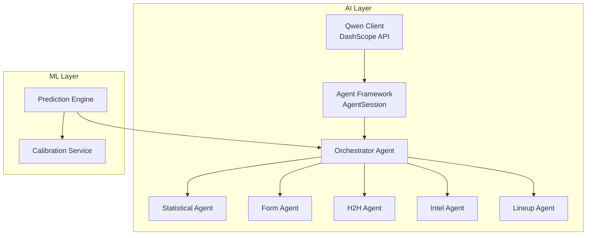
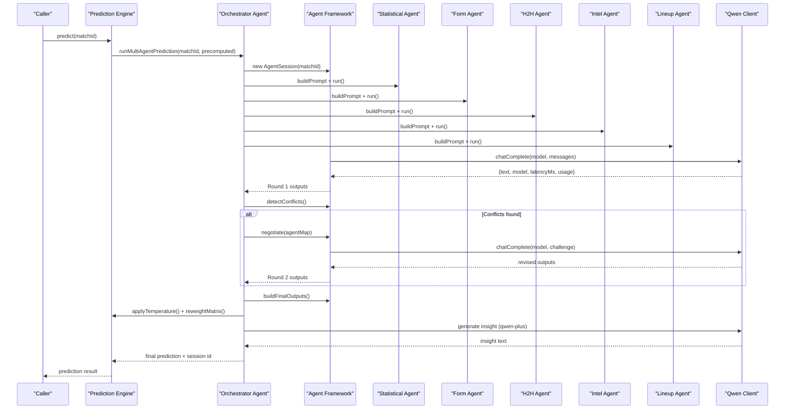
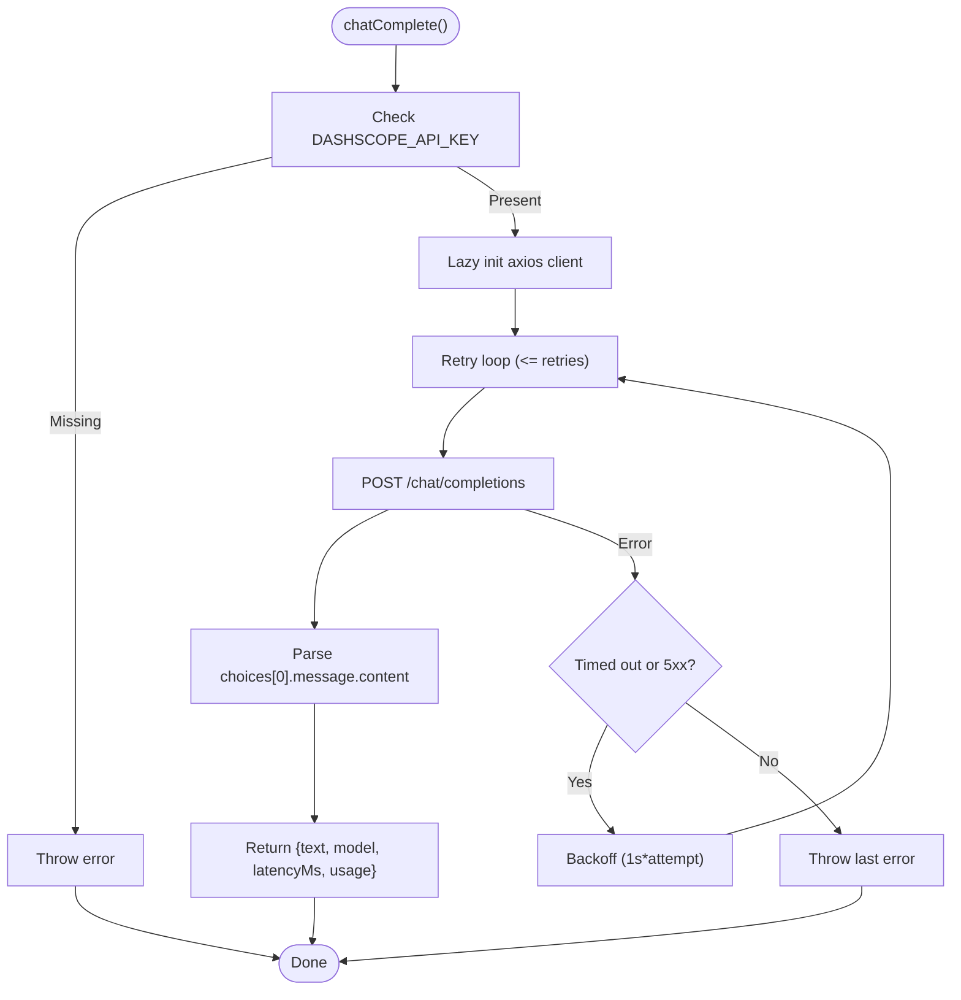
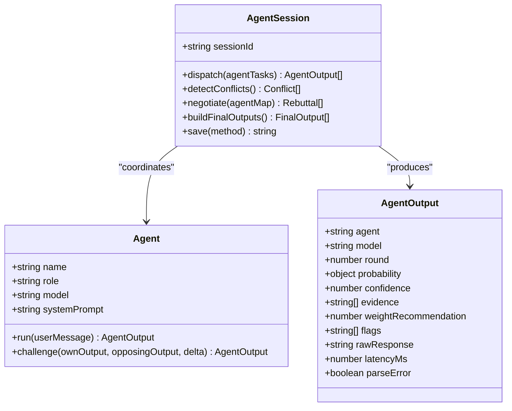
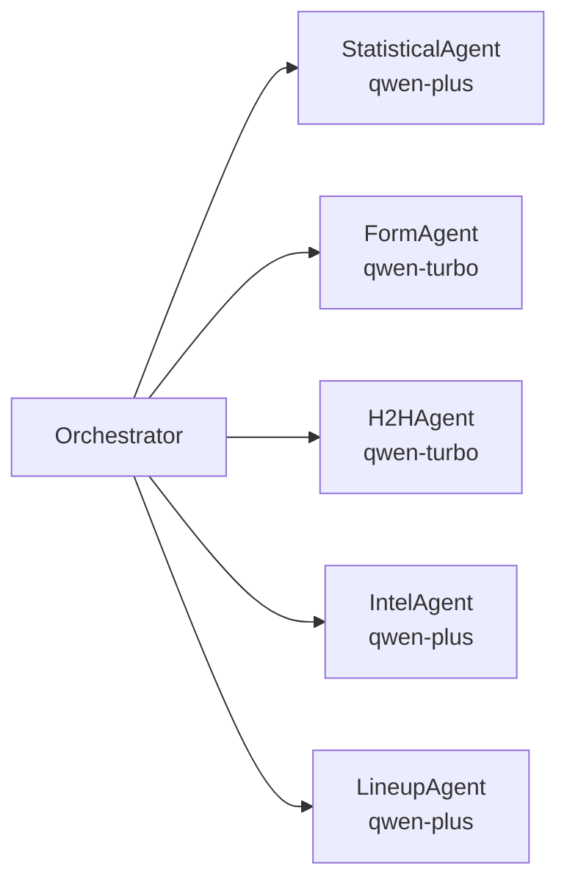
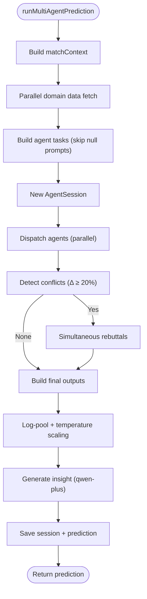
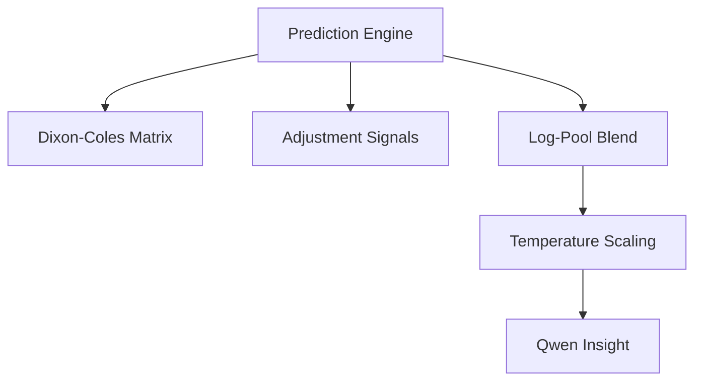
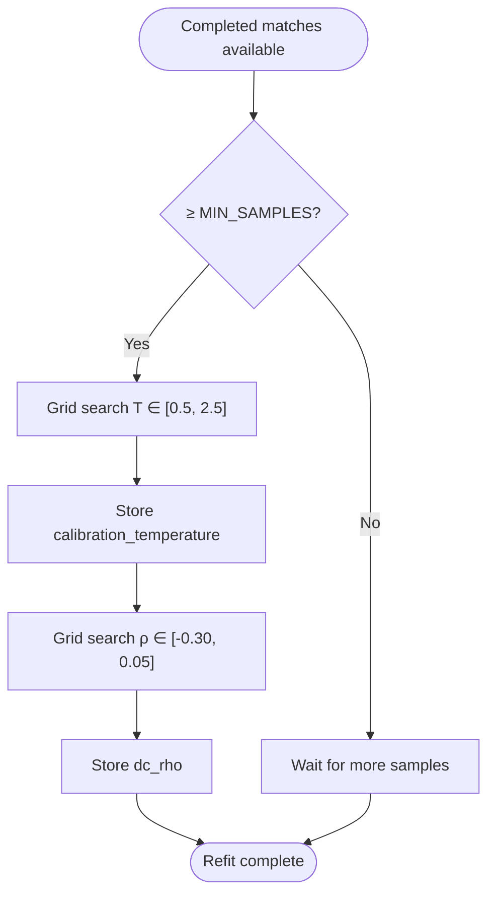
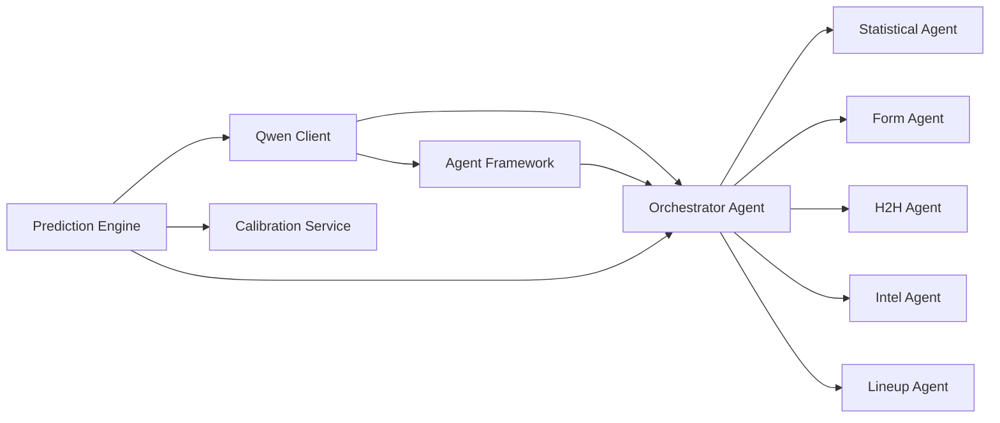

# AI Integration Architecture

<cite>
**Referenced Files in This Document**
- [qwenClient.js](file://backend/services/qwenClient.js)
- [predictionEngine.js](file://backend/services/predictionEngine.js)
- [orchestratorAgent.js](file://backend/services/agents/orchestratorAgent.js)
- [agentFramework.js](file://backend/services/agents/agentFramework.js)
- [statisticalAgent.js](file://backend/services/agents/statisticalAgent.js)
- [formAgent.js](file://backend/services/agents/formAgent.js)
- [h2hAgent.js](file://backend/services/agents/h2hAgent.js)
- [intelAgent.js](file://backend/services/agents/intelAgent.js)
- [lineupAgent.js](file://backend/services/agents/lineupAgent.js)
- [calibrationService.js](file://backend/services/calibrationService.js)
- [README.md](file://README.md)
- [SPEC.md](file://specs/SPEC.md)
- [SETUP.md](file://SETUP.md)
</cite>

## Table of Contents
1. [Introduction](#introduction)
2. [Project Structure](#project-structure)
3. [Core Components](#core-components)
4. [Architecture Overview](#architecture-overview)
5. [Detailed Component Analysis](#detailed-component-analysis)
6. [Dependency Analysis](#dependency-analysis)
7. [Performance Considerations](#performance-considerations)
8. [Troubleshooting Guide](#troubleshooting-guide)
9. [Conclusion](#conclusion)

## Introduction
This document describes the AI integration architecture for the WC26-Qwen-Qoder multi-agent system. It covers the Alibaba Cloud DashScope Qwen model integration, the multi-agent framework with specialized agents and an orchestrator, the prediction engine with temperature scaling and calibration, and operational aspects such as error handling, session management, and fallback strategies.

## Project Structure
The AI integration spans several backend services:
- Qwen client wrapper for DashScope API
- Multi-agent framework with specialized agents
- Orchestrator coordinating agent sessions
- Prediction engine combining deterministic modeling with AI agents
- Calibration service for temperature scaling and model parameters

**Diagram sources**
- [qwenClient.js:1-123](file://backend/services/qwenClient.js#L1-L123)
- [agentFramework.js:1-576](file://backend/services/agents/agentFramework.js#L1-L576)
- [orchestratorAgent.js:1-471](file://backend/services/agents/orchestratorAgent.js#L1-L471)
- [statisticalAgent.js:1-98](file://backend/services/agents/statisticalAgent.js#L1-L98)
- [formAgent.js:1-113](file://backend/services/agents/formAgent.js#L1-L113)
- [h2hAgent.js:1-107](file://backend/services/agents/h2hAgent.js#L1-L107)
- [intelAgent.js:1-126](file://backend/services/agents/intelAgent.js#L1-L126)
- [lineupAgent.js:1-118](file://backend/services/agents/lineupAgent.js#L1-L118)
- [predictionEngine.js:1-1020](file://backend/services/predictionEngine.js#L1-L1020)
- [calibrationService.js:1-132](file://backend/services/calibrationService.js#L1-L132)

**Section sources**
- [README.md:18-113](file://README.md#L18-L113)
- [SETUP.md:101-122](file://SETUP.md#L101-L122)

## Core Components
- Qwen Client: Provides a DashScope-compatible HTTP client with bearer token authentication, configurable timeouts, and retry logic for transient failures. Supports model selection (qwen-max, qwen-plus, qwen-turbo) and structured response parsing.
- Agent Framework: Defines the Agent and AgentSession classes, including JSON schema enforcement, conflict detection, negotiation protocol, and database persistence of agent sessions and messages.
- Specialized Agents: Statistical, Form, H2H, Intel, and Lineup agents, each with a dedicated system prompt and domain data pipeline.
- Orchestrator Agent: Coordinates multi-agent runs, dispatches tasks in parallel, detects conflicts, negotiates, merges outputs, applies temperature scaling, and generates insights.
- Prediction Engine: Implements the Dixon-Coles bivariate Poisson backbone, adjustment signals, log-pool blending, and temperature calibration. Can operate in single-model or multi-agent mode.
- Calibration Service: Performs temperature scaling and Dixon-Coles ρ parameter fitting via grid search on historical predictions.

**Section sources**
- [qwenClient.js:1-123](file://backend/services/qwenClient.js#L1-L123)
- [agentFramework.js:1-576](file://backend/services/agents/agentFramework.js#L1-L576)
- [orchestratorAgent.js:1-471](file://backend/services/agents/orchestratorAgent.js#L1-L471)
- [predictionEngine.js:1-1020](file://backend/services/predictionEngine.js#L1-L1020)
- [calibrationService.js:1-132](file://backend/services/calibrationService.js#L1-L132)

## Architecture Overview
The system integrates deterministic football modeling with Qwen-powered multi-agent reasoning. The orchestrator coordinates agents that analyze different aspects of a match (statistics, form, head-to-head, intelligence, lineup), then synthesizes their outputs using a log-pool blend and temperature scaling. Calibration refines model parameters over time.

**Diagram sources**
- [predictionEngine.js:664-729](file://backend/services/predictionEngine.js#L664-L729)
- [orchestratorAgent.js:288-468](file://backend/services/agents/orchestratorAgent.js#L288-L468)
- [agentFramework.js:345-562](file://backend/services/agents/agentFramework.js#L345-L562)
- [qwenClient.js:53-101](file://backend/services/qwenClient.js#L53-L101)

## Detailed Component Analysis

### Qwen Client Integration
- Authentication: Uses Bearer token from environment variable for DashScope API compatibility.
- Request Pattern: POST /chat/completions with model, messages, temperature, and max_tokens.
- Response Parsing: Extracts text content, latency, and optional usage metadata; validates presence of choices and message content.
- Retry Strategy: Retries on 5xx or timeout with exponential backoff; configurable retry count.
- Connectivity Check: Dedicated ping endpoint using qwen-turbo for fast health verification.

**Diagram sources**
- [qwenClient.js:53-101](file://backend/services/qwenClient.js#L53-L101)

**Section sources**
- [qwenClient.js:15-39](file://backend/services/qwenClient.js#L15-L39)
- [qwenClient.js:53-101](file://backend/services/qwenClient.js#L53-L101)
- [qwenClient.js:107-120](file://backend/services/qwenClient.js#L107-L120)

### Multi-Agent Framework
- Agent Class: Encapsulates system prompt and model; executes Round 1 and Round 2 challenges; enforces JSON schema; normalizes outputs; tracks latency and parse errors.
- AgentSession: Manages a full multi-agent run:
  - Parallel dispatch of tasks
  - Conflict detection using maximum probability delta
  - Simultaneous negotiation with challenge prompts
  - Weight adjustments based on concessions
  - Persistence of session, messages, conflicts, and resolutions
- JSON Schema: Strictly enforced with extraction helpers and fallbacks.

**Diagram sources**
- [agentFramework.js:201-320](file://backend/services/agents/agentFramework.js#L201-L320)
- [agentFramework.js:326-562](file://backend/services/agents/agentFramework.js#L326-L562)

**Section sources**
- [agentFramework.js:31-54](file://backend/services/agents/agentFramework.js#L31-L54)
- [agentFramework.js:112-146](file://backend/services/agents/agentFramework.js#L112-L146)
- [agentFramework.js:345-562](file://backend/services/agents/agentFramework.js#L345-L562)

### Specialized Agents
- Statistical Agent (qwen-plus): Interprets Dixon-Coles λ values, ELO ratings, and attack/defense parameters; provides probability assessment anchored to backbone.
- Form Agent (qwen-turbo): Analyzes recent results with competition weighting; flags data quality issues.
- H2H Agent (qwen-turbo): Uses a 47k-match dataset to compute weighted probabilities; auto-skips when insufficient meetings.
- Intel Agent (qwen-plus): Parses pre-match intelligence (injuries, rotation, motivation) and estimates probability shifts.
- Lineup Agent (qwen-plus): Assesses confirmed starting XI strength and formation; activates only when lineup is available.

**Diagram sources**
- [statisticalAgent.js:15-98](file://backend/services/agents/statisticalAgent.js#L15-L98)
- [formAgent.js:13-113](file://backend/services/agents/formAgent.js#L13-L113)
- [h2hAgent.js:14-107](file://backend/services/agents/h2hAgent.js#L14-L107)
- [intelAgent.js:16-126](file://backend/services/agents/intelAgent.js#L16-L126)
- [lineupAgent.js:14-118](file://backend/services/agents/lineupAgent.js#L14-L118)

**Section sources**
- [statisticalAgent.js:18-98](file://backend/services/agents/statisticalAgent.js#L18-L98)
- [formAgent.js:17-113](file://backend/services/agents/formAgent.js#L17-L113)
- [h2hAgent.js:18-107](file://backend/services/agents/h2hAgent.js#L18-L107)
- [intelAgent.js:20-126](file://backend/services/agents/intelAgent.js#L20-L126)
- [lineupAgent.js:18-118](file://backend/services/agents/lineupAgent.js#L18-L118)

### Orchestrator Agent
- Builds match context and pre-fetches domain data in parallel.
- Constructs agent tasks, skipping agents without sufficient data.
- Executes AgentSession lifecycle: dispatch, conflict detection, negotiation, final output building.
- Applies log-pool blending and temperature scaling.
- Generates a concise analyst insight using Qwen.
- Persists session and prediction to the database.

**Diagram sources**
- [orchestratorAgent.js:288-468](file://backend/services/agents/orchestratorAgent.js#L288-L468)

**Section sources**
- [orchestratorAgent.js:288-468](file://backend/services/agents/orchestratorAgent.js#L288-L468)

### Prediction Engine Integration
- Backbone: Dixon-Coles bivariate Poisson with λ-home, λ-away, home advantage, venue effects, and WC phase scaling.
- Adjustment Signals: Head-to-head, recent form, intelligence, lineup, rest days, with log-pool weights.
- Multi-Agent Path: When enabled, computes backbone only, then delegates orchestration to Orchestrator.
- Single-Model Path: Computes signals in-process, blends deterministically, and generates insight via Qwen with fallback.
- Temperature Scaling: Applied to final probabilities using fitted temperature from calibration.

**Diagram sources**
- [predictionEngine.js:664-729](file://backend/services/predictionEngine.js#L664-L729)
- [predictionEngine.js:214-238](file://backend/services/predictionEngine.js#L214-L238)
- [predictionEngine.js:637-662](file://backend/services/predictionEngine.js#L637-L662)

**Section sources**
- [predictionEngine.js:664-729](file://backend/services/predictionEngine.js#L664-L729)
- [predictionEngine.js:214-238](file://backend/services/predictionEngine.js#L214-L238)
- [predictionEngine.js:637-662](file://backend/services/predictionEngine.js#L637-L662)

### Calibration and Model Refitting
- Temperature Scaling: Grid search minimizes negative log-likelihood on completed predictions; stored in model_config.
- Dixon-Coles ρ Fit: Grid search maximizes likelihood over observed scorelines using stored λ values; stored in model_config.
- Trigger: Automatic refit every 10 new completed matches once minimum samples are met.

**Diagram sources**
- [calibrationService.js:53-82](file://backend/services/calibrationService.js#L53-L82)
- [calibrationService.js:88-129](file://backend/services/calibrationService.js#L88-L129)

**Section sources**
- [calibrationService.js:18-82](file://backend/services/calibrationService.js#L18-L82)
- [calibrationService.js:88-129](file://backend/services/calibrationService.js#L88-L129)

## Dependency Analysis
- Qwen Client is a shared dependency used by the Agent Framework and Orchestrator Agent for all LLM calls.
- Orchestrator Agent depends on Agent Framework and the specialized agents; it also depends on Prediction Engine for precomputed backbone data when multi-agent mode is enabled.
- Prediction Engine depends on Qwen Client for insight generation and on Calibration Service for temperature and ρ parameters.
- Agents depend on data services for domain data (form, H2H, intel, lineup) and on Qwen Client for reasoning.

**Diagram sources**
- [qwenClient.js:28-39](file://backend/services/qwenClient.js#L28-L39)
- [agentFramework.js:28-29](file://backend/services/agents/agentFramework.js#L28-L29)
- [orchestratorAgent.js:28-30](file://backend/services/agents/orchestratorAgent.js#L28-L30)
- [predictionEngine.js:43-53](file://backend/services/predictionEngine.js#L43-L53)
- [calibrationService.js:15-16](file://backend/services/calibrationService.js#L15-L16)

**Section sources**
- [qwenClient.js:28-39](file://backend/services/qwenClient.js#L28-L39)
- [agentFramework.js:28-29](file://backend/services/agents/agentFramework.js#L28-L29)
- [orchestratorAgent.js:28-30](file://backend/services/agents/orchestratorAgent.js#L28-L30)
- [predictionEngine.js:43-53](file://backend/services/predictionEngine.js#L43-L53)
- [calibrationService.js:15-16](file://backend/services/calibrationService.js#L15-L16)

## Performance Considerations
- Model Selection: qwen-max for orchestrator (complex reasoning), qwen-plus for agents requiring numerical reasoning, qwen-turbo for high-throughput tasks.
- Parallelization: Orchestrator dispatches agents concurrently; domain data fetches are parallelized.
- Cost Optimization: 
  - Use qwen-turbo for tasks not requiring deep reasoning.
  - Limit max_tokens per request.
  - Apply retry with backoff to reduce wasted requests on transient failures.
  - Persist agent sessions to avoid recomputation.
- Latency Monitoring: Track latencyMs from Qwen responses and session wall time for diagnostics.

[No sources needed since this section provides general guidance]

## Troubleshooting Guide
- Missing API Key: The Qwen client throws an error if the DashScope API key is not set; ensure environment variable is configured.
- LLM Call Failures: Agent.run and Agent.challenge catch exceptions and return fallback outputs with parseError flags; inspect rawResponse and latencyMs for debugging.
- JSON Parsing Errors: The framework attempts extraction from fenced code blocks, bare objects, and regex matches; if all fail, a uniform prior is returned with minimal confidence.
- Insight Generation Failures: Prediction Engine and Orchestrator Agent fall back to template-generated insights when LLM calls fail.
- Calibration Issues: If refit does not converge due to insufficient samples, the service reports a reason and waits for more data.

**Section sources**
- [qwenClient.js:60-62](file://backend/services/qwenClient.js#L60-L62)
- [agentFramework.js:235-238](file://backend/services/agents/agentFramework.js#L235-L238)
- [agentFramework.js:121-146](file://backend/services/agents/agentFramework.js#L121-L146)
- [predictionEngine.js:631-635](file://backend/services/predictionEngine.js#L631-L635)
- [orchestratorAgent.js:227-230](file://backend/services/agents/orchestratorAgent.js#L227-L230)
- [calibrationService.js:61-63](file://backend/services/calibrationService.js#L61-L63)

## Conclusion
The WC26-Qwen-Qoder system combines a robust Dixon-Coles probabilistic backbone with a multi-agent Qwen architecture. The Agent Framework enforces strict output contracts, conflict detection, and negotiation, while the Orchestrator coordinates specialized agents and synthesizes their outputs. Temperature scaling and DC ρ calibration refine predictions over time. The Qwen Client provides reliable, retryable access to DashScope APIs with clear error handling and fallback strategies.