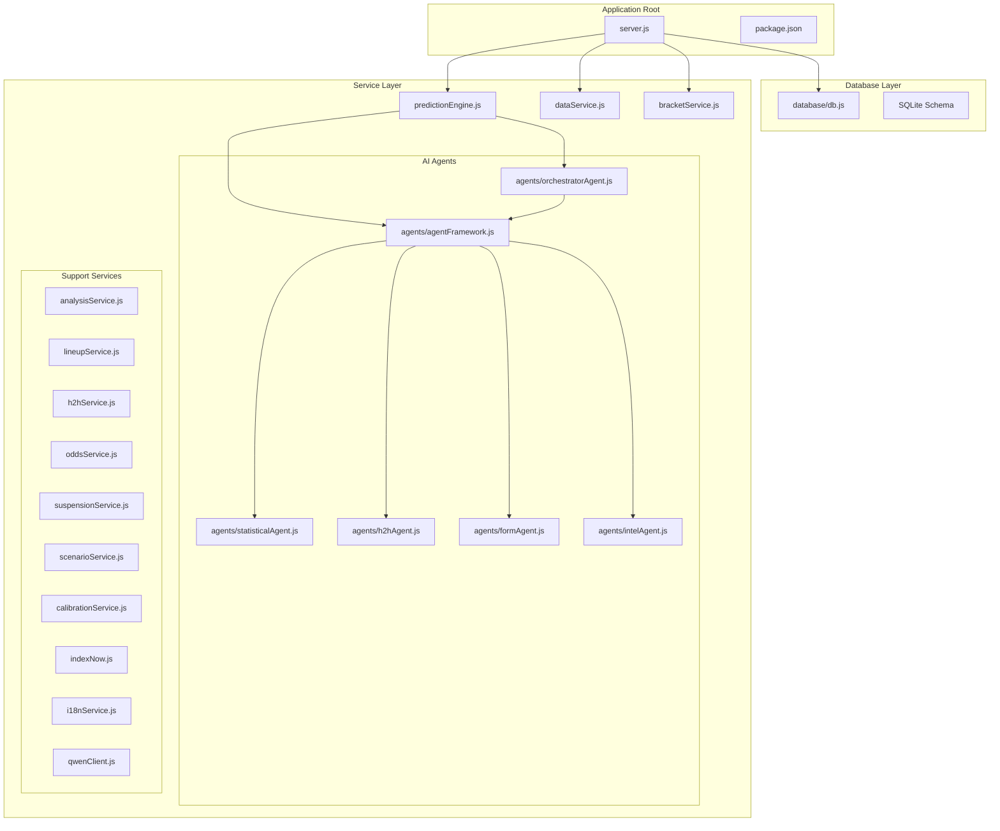
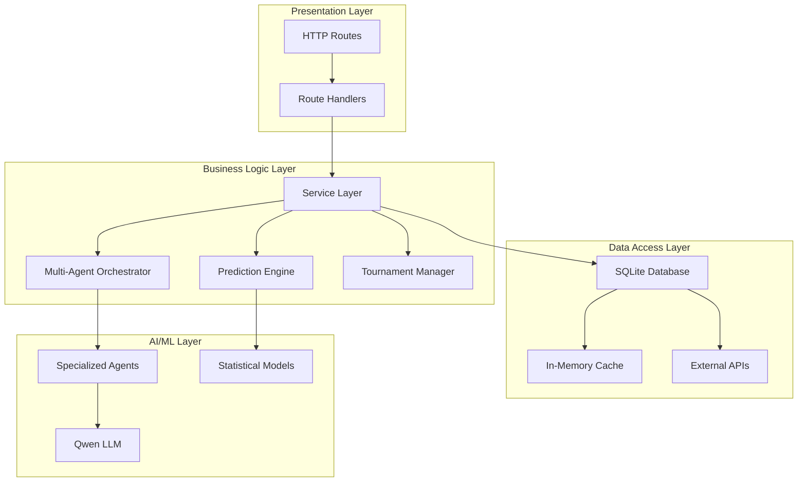
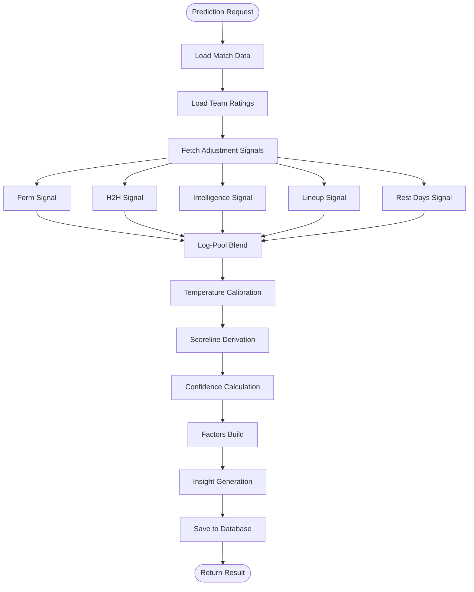
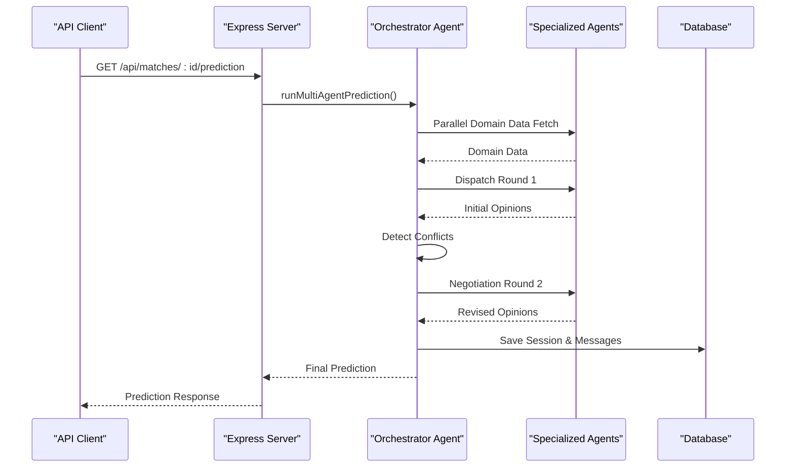
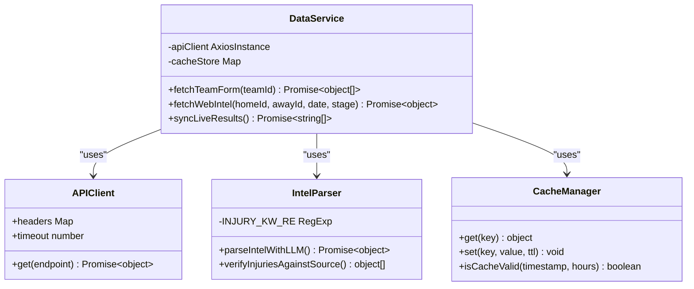
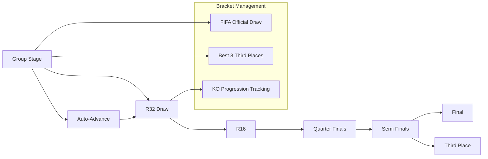
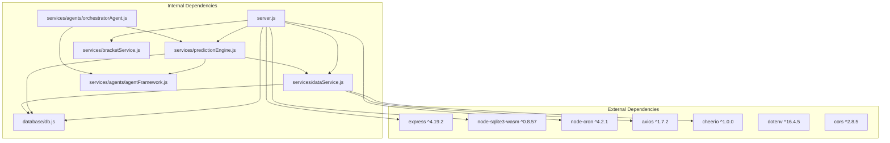
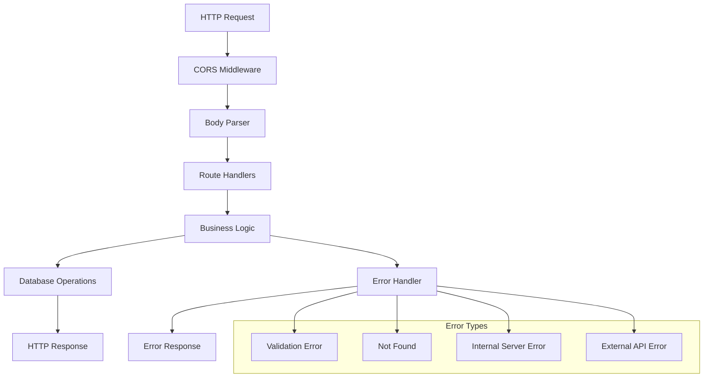
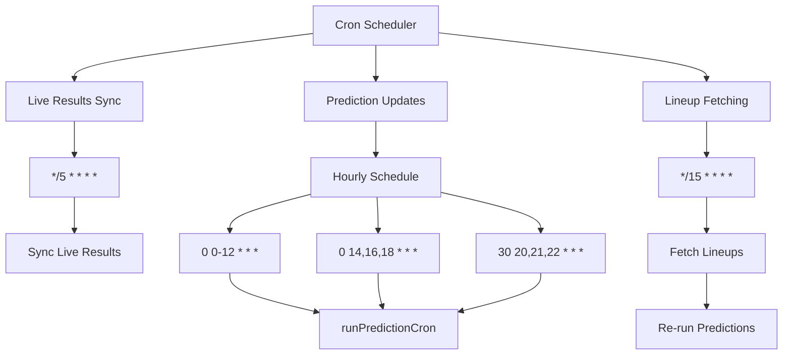
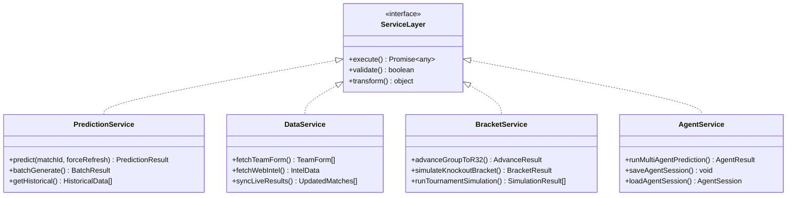

# Backend Architecture

<cite>
**Referenced Files in This Document**
- [server.js](file://backend/server.js)
- [package.json](file://backend/package.json)
- [db.js](file://backend/database/db.js)
- [predictionEngine.js](file://backend/services/predictionEngine.js)
- [orchestratorAgent.js](file://backend/services/agents/orchestratorAgent.js)
- [agentFramework.js](file://backend/services/agents/agentFramework.js)
- [dataService.js](file://backend/services/dataService.js)
- [bracketService.js](file://backend/services/bracketService.js)
- [statisticalAgent.js](file://backend/services/agents/statisticalAgent.js)
- [h2hAgent.js](file://backend/services/agents/h2hAgent.js)
- [formAgent.js](file://backend/services/agents/formAgent.js)
- [intelAgent.js](file://backend/services/agents/intelAgent.js)
</cite>

## Table of Contents
1. [Introduction](#introduction)
2. [Project Structure](#project-structure)
3. [Core Components](#core-components)
4. [Architecture Overview](#architecture-overview)
5. [Detailed Component Analysis](#detailed-component-analysis)
6. [Dependency Analysis](#dependency-analysis)
7. [Performance Considerations](#performance-considerations)
8. [Security Considerations](#security-considerations)
9. [Middleware Stack and Error Handling](#middleware-stack-and-error-handling)
10. [Database Integration](#database-integration)
11. [Cron Job System](#cron-job-system)
12. [Service Layer Architecture](#service-layer-architecture)
13. [API Versioning Strategy](#api-versioning-strategy)
14. [Configuration Management](#configuration-management)
15. [Troubleshooting Guide](#troubleshooting-guide)
16. [Conclusion](#conclusion)

## Introduction
This document provides comprehensive backend architecture documentation for the Express.js API server powering the World Cup 2026 prediction platform. The system integrates a sophisticated prediction engine, multi-agent AI coordination, real-time data synchronization, and tournament management capabilities. Built with Node.js and Express, it leverages SQLite via node-sqlite3-wasm for data persistence and employs a modular service layer architecture.

## Project Structure
The backend follows a clean, modular organization with clear separation of concerns:

**Diagram sources**
- [server.js:1-724](file://backend/server.js#L1-L724)
- [db.js:1-252](file://backend/database/db.js#L1-L252)
- [predictionEngine.js:1-1046](file://backend/services/predictionEngine.js#L1-L1046)
- [agentFramework.js:1-586](file://backend/services/agents/agentFramework.js#L1-L586)

**Section sources**
- [server.js:1-724](file://backend/server.js#L1-L724)
- [package.json:1-32](file://backend/package.json#L1-L32)

## Core Components
The backend consists of several interconnected core components:

### Express Server Application
The main application server handles HTTP requests, manages middleware, and exposes RESTful APIs for clients. It implements a comprehensive routing system covering teams, matches, tournaments, analytics, and administrative endpoints.

### Database Layer
Utilizes node-sqlite3-wasm for robust SQLite operations with proper locking mechanisms and schema initialization. The database manages all application data including teams, matches, predictions, tournament brackets, and AI agent sessions.

### Prediction Engine
A sophisticated machine learning-powered system implementing Dixon-Coles bivariate Poisson models with multiple adjustment signals including ELO ratings, head-to-head records, recent form, web intelligence, lineup strength, and rest days.

### Multi-Agent AI System
An advanced orchestration framework that coordinates specialized AI agents (statistical, H2H, form, intelligence) to provide diverse analytical perspectives and synthesize consensus predictions through conflict resolution and weighted aggregation.

**Section sources**
- [server.js:18-724](file://backend/server.js#L18-L724)
- [db.js:1-252](file://backend/database/db.js#L1-L252)
- [predictionEngine.js:1-1046](file://backend/services/predictionEngine.js#L1-L1046)

## Architecture Overview
The system employs a layered architecture with clear separation between presentation, business logic, and data access layers:

**Diagram sources**
- [server.js:24-582](file://backend/server.js#L24-L582)
- [predictionEngine.js:691-756](file://backend/services/predictionEngine.js#L691-L756)
- [orchestratorAgent.js:309-502](file://backend/services/agents/orchestratorAgent.js#L309-L502)

## Detailed Component Analysis

### Prediction Engine Component
The prediction engine implements a sophisticated mathematical model combining multiple data sources and adjustment signals:

**Diagram sources**
- [predictionEngine.js:691-800](file://backend/services/predictionEngine.js#L691-L800)
- [predictionEngine.js:462-583](file://backend/services/predictionEngine.js#L462-L583)

The engine uses Dixon-Coles bivariate Poisson models with:
- **Backbone Model**: λ_home = exp(log_α_home + log_β_away + home_adv)
- **Adjustment Signals**: H2H (0.30), Form (0.20), Intelligence (0.20), Lineup (0.40), Rest (0.10)
- **Confidence Calibration**: Temperature scaling and Brier score evaluation
- **Scoreline Derivation**: Expected points optimization for tournament scoring rules

**Section sources**
- [predictionEngine.js:1-1046](file://backend/services/predictionEngine.js#L1-L1046)

### Multi-Agent AI Coordination System
The orchestrator coordinates multiple specialized AI agents through a structured negotiation framework:

**Diagram sources**
- [orchestratorAgent.js:319-502](file://backend/services/agents/orchestratorAgent.js#L319-L502)
- [agentFramework.js:355-445](file://backend/services/agents/agentFramework.js#L355-L445)

**Section sources**
- [orchestratorAgent.js:1-502](file://backend/services/agents/orchestratorAgent.js#L1-L502)
- [agentFramework.js:1-586](file://backend/services/agents/agentFramework.js#L1-L586)

### Data Service Integration
The data service layer manages external data sources and caching strategies:

**Diagram sources**
- [dataService.js:1-602](file://backend/services/dataService.js#L1-L602)

**Section sources**
- [dataService.js:1-602](file://backend/services/dataService.js#L1-L602)

### Tournament Management System
The bracket service manages the complete tournament lifecycle from group stages to finals:

**Diagram sources**
- [bracketService.js:1-1080](file://backend/services/bracketService.js#L1-L1080)

**Section sources**
- [bracketService.js:1-1080](file://backend/services/bracketService.js#L1-L1080)

## Dependency Analysis
The system exhibits well-managed dependencies with clear inversion of control patterns:

**Diagram sources**
- [package.json:14-31](file://backend/package.json#L14-L31)
- [server.js:1-17](file://backend/server.js#L1-L17)

**Section sources**
- [package.json:1-32](file://backend/package.json#L1-L32)

## Performance Considerations
The system implements several performance optimization strategies:

### Database Optimization
- **Connection Pooling**: Single database connection with proper locking via node-sqlite3-wasm
- **Query Optimization**: Strategic use of prepared statements and indexed lookups
- **Schema Design**: Proper indexing on frequently queried columns (match_id, team_id, status)
- **Transaction Management**: Batch operations wrapped in transactions for consistency

### Caching Strategies
- **Web Intelligence Cache**: Separate cache tables for form, H2H, and intelligence data
- **Prediction Caching**: Cache mechanism to avoid recomputation for completed matches
- **Static Content**: Frontend assets served statically for reduced server load

### Asynchronous Processing
- **Parallel Data Fetching**: Multiple data sources queried concurrently
- **Background Jobs**: Cron jobs handle periodic maintenance tasks
- **Non-blocking Operations**: All I/O operations use async/await patterns

### Memory Management
- **Circular Dependency Breakers**: Lazy loading prevents require loops
- **Resource Cleanup**: Proper disposal of database connections and external API clients

## Security Considerations
The system implements several security measures:

### Authentication & Authorization
- **CORS Configuration**: Controlled cross-origin resource sharing
- **Environment Variables**: API keys and secrets managed via dotenv
- **Input Validation**: Route parameters validated before database queries

### Data Protection
- **SQL Injection Prevention**: All database queries use prepared statements
- **XSS Prevention**: Proper escaping of user-generated content
- **Rate Limiting**: Not implemented but can be added via middleware

### Secure Communication
- **HTTPS Support**: Production deployment requires HTTPS
- **API Key Management**: External API credentials stored securely
- **Audit Logging**: Comprehensive logging for debugging and security monitoring

## Middleware Stack and Error Handling
The Express server implements a structured middleware stack:

**Diagram sources**
- [server.js:21-22](file://backend/server.js#L21-L22)

**Section sources**
- [server.js:1-724](file://backend/server.js#L1-L724)

## Database Integration
The database layer uses node-sqlite3-wasm with comprehensive schema design:

### Database Schema Design
The schema supports the complete tournament lifecycle with 20+ tables covering:
- **Core Entities**: teams, matches, predictions, model performance
- **Tournament Management**: bracket slots, third place tracking
- **Historical Data**: ELO history, model configurations
- **AI Agent Sessions**: Multi-agent coordination tracking
- **Web Intelligence**: Cached data for form, H2H, and intelligence

### Migration Strategy
- **Schema Evolution**: ALTER TABLE statements for backward compatibility
- **Data Seeding**: Default model weights and initial configurations
- **Version Management**: Migration functions handle schema upgrades

### Connection Management
- **Locking Mechanisms**: Directory-based locks prevent concurrent access issues
- **Connection Pooling**: Single connection reused throughout application lifetime
- **Timeout Configuration**: Busy timeout and synchronous settings optimized for performance

**Section sources**
- [db.js:1-252](file://backend/database/db.js#L1-L252)

## Cron Job System
The system implements a comprehensive scheduling framework:

**Diagram sources**
- [server.js:585-675](file://backend/server.js#L585-L675)

**Section sources**
- [server.js:585-675](file://backend/server.js#L585-L675)

## Service Layer Architecture
The service layer follows clean architecture principles with clear boundaries:

**Diagram sources**
- [predictionEngine.js:691-756](file://backend/services/predictionEngine.js#L691-L756)
- [dataService.js:514-599](file://backend/services/dataService.js#L514-L599)
- [bracketService.js:485-704](file://backend/services/bracketService.js#L485-L704)

**Section sources**
- [predictionEngine.js:1-1046](file://backend/services/predictionEngine.js#L1-L1046)
- [dataService.js:1-602](file://backend/services/dataService.js#L1-L602)
- [bracketService.js:1-1080](file://backend/services/bracketService.js#L1-L1080)

## API Versioning Strategy
The API follows a simple versioning approach through endpoint structure:

### Current API Structure
All endpoints follow the `/api/*` pattern with clear resource organization:
- **Teams**: `/api/teams`, `/api/teams/:id`
- **Matches**: `/api/matches`, `/api/matches/:id`
- **Predictions**: `/api/matches/:id/prediction`, `/api/predictions/generate-all`
- **Tournaments**: `/api/tournament/*`
- **Analytics**: `/api/analytics/*`
- **Admin**: `/api/sync`, `/api/suspensions`

### Version Control Approach
- **Semantic Versioning**: Future major version changes would introduce `/api/v2/*` endpoints
- **Backward Compatibility**: Existing endpoints maintained during minor updates
- **Deprecation Policy**: Old endpoints supported with warning headers

## Configuration Management
The system uses a hierarchical configuration approach:

### Environment Configuration
- **Database**: DB_PATH environment variable for SQLite file location
- **API Keys**: FOOTBALL_DATA_API_KEY for external data access
- **Frontend**: FRONTEND_URL for CORS configuration
- **Port**: PORT environment variable for server binding

### Runtime Configuration
- **Model Weights**: Stored in model_config table for dynamic adjustment
- **Feature Flags**: USE_MULTI_AGENT environment variable controls AI features
- **Calibration**: Temperature scaling and Dixon-Coles parameters
- **Caching**: TTL values for different data types

### Service Initialization Patterns
- **Lazy Loading**: Services loaded on-demand to prevent circular dependencies
- **Singleton Pattern**: Database connections and external clients as singletons
- **Factory Functions**: Service creation with dependency injection

**Section sources**
- [server.js:1-22](file://backend/server.js#L1-L22)
- [db.js:5-6](file://backend/database/db.js#L5-L6)

## Troubleshooting Guide
Common issues and their resolutions:

### Database Issues
- **Lock File Problems**: Stale .lock files cause connection failures
- **Schema Migration**: Missing columns handled via ALTER TABLE statements
- **Connection Timeouts**: Adjust busy_timeout and synchronous PRAGMAs

### Prediction Engine Issues
- **Missing Team Ratings**: Automatic rating initialization from FIFA data
- **Incomplete Data**: Graceful fallback to default values and synthetic data
- **LLM Failures**: Fallback parsing strategies and error recovery

### API Issues
- **CORS Errors**: Verify FRONTEND_URL environment variable
- **Rate Limiting**: External API rate limits require careful request scheduling
- **Cache Invalidation**: Manual cache clearing for development

### Performance Issues
- **Slow Queries**: Database indexing and query optimization
- **Memory Leaks**: Proper cleanup of database connections and timers
- **External API Failures**: Circuit breaker patterns and retry logic

**Section sources**
- [server.js:585-675](file://backend/server.js#L585-L675)
- [predictionEngine.js:184-203](file://backend/services/predictionEngine.js#L184-L203)

## Conclusion
The backend architecture demonstrates enterprise-grade design with clear separation of concerns, robust data management, and sophisticated AI coordination. The modular service layer enables maintainability and extensibility, while the multi-agent system provides nuanced analytical insights. The comprehensive scheduling framework ensures real-time data freshness, and the SQLite integration provides reliable persistence with minimal operational overhead.

The system successfully balances performance requirements with maintainability, providing a solid foundation for the World Cup 2026 prediction platform with room for future enhancements and scaling.