# Backend Architecture

<cite>
**Referenced Files in This Document**
- [server.js](file://backend/server.js)
- [package.json](file://backend/package.json)
- [db.js](file://backend/database/db.js)
- [seed.js](file://backend/database/seed.js)
- [predictionEngine.js](file://backend/services/predictionEngine.js)
- [dataService.js](file://backend/services/dataService.js)
- [analysisService.js](file://backend/services/analysisService.js)
- [bracketService.js](file://backend/services/bracketService.js)
- [orchestratorAgent.js](file://backend/services/agents/orchestratorAgent.js)
- [agentFramework.js](file://backend/services/agents/agentFramework.js)
- [qwenClient.js](file://backend/services/qwenClient.js)
- [lineupService.js](file://backend/services/lineupService.js)
</cite>

## Update Summary
**Changes Made**
- Added comprehensive documentation for the new automatic prediction re-run mechanism triggered by lineup cron job
- Updated cron job scheduling section to include detailed coverage of the runLineupCron() function and its error handling
- Documented the predict() function call with lineup parameter and re-prediction workflows
- Enhanced the prediction engine section to show how lineup data triggers automatic re-runs
- Added error handling documentation for re-prediction workflows in cron jobs

## Table of Contents
1. [Introduction](#introduction)
2. [Project Structure](#project-structure)
3. [Core Components](#core-components)
4. [Architecture Overview](#architecture-overview)
5. [Detailed Component Analysis](#detailed-component-analysis)
6. [Dependency Analysis](#dependency-analysis)
7. [Performance Considerations](#performance-considerations)
8. [Troubleshooting Guide](#troubleshooting-guide)
9. [Conclusion](#conclusion)

## Introduction
This document describes the backend architecture of the WC26-Qwen-Qoder system, focusing on the Express.js server, middleware configuration, route organization, service layer, database abstraction, scheduling, API design, error handling, security, environment configuration, and performance characteristics. The backend integrates a sophisticated prediction engine powered by a multi-agent AI orchestration system and SQLite for data persistence.

## Project Structure
The backend is organized around a central Express server that exposes REST endpoints, delegates to specialized services, and persists data via a SQLite database abstraction. Key areas:
- Server and routing: Express server with CORS and JSON middleware, and route handlers for teams, groups, matches, predictions, tournaments, suspensions, analytics, and synchronization.
- Services: Prediction engine, data fetching, analysis and calibration, bracket progression, AI agents, and utility services.
- Database: SQLite abstraction with initialization, migrations, and schema management.
- Scheduling: node-cron jobs for live result sync, batch prediction regeneration, and automatic lineup fetching with prediction re-run capabilities.
- Environment and packaging: dotenv-based configuration, npm scripts, and dependencies.

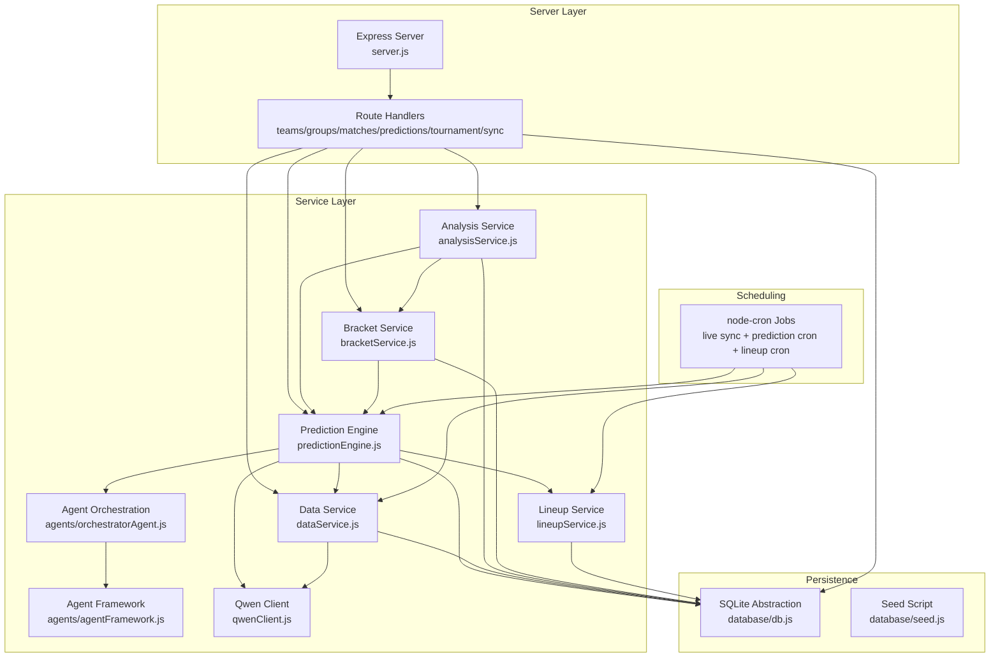

**Diagram sources**
- [server.js:18-724](file://backend/server.js#L18-L724)
- [predictionEngine.js:1-1046](file://backend/services/predictionEngine.js#L1-L1046)
- [dataService.js:1-583](file://backend/services/dataService.js#L1-L583)
- [analysisService.js:1-422](file://backend/services/analysisService.js#L1-L422)
- [bracketService.js:1-1080](file://backend/services/bracketService.js#L1-L1080)
- [orchestratorAgent.js:1-502](file://backend/services/agents/orchestratorAgent.js#L1-L502)
- [agentFramework.js:1-576](file://backend/services/agents/agentFramework.js#L1-L576)
- [qwenClient.js:1-123](file://backend/services/qwenClient.js#L1-L123)
- [lineupService.js:1-425](file://backend/services/lineupService.js#L1-L425)
- [db.js:1-252](file://backend/database/db.js#L1-L252)
- [seed.js:1-69](file://backend/database/seed.js#L1-L69)

**Section sources**
- [server.js:1-724](file://backend/server.js#L1-L724)
- [package.json:1-32](file://backend/package.json#L1-L32)

## Core Components
- Express server with CORS and JSON middleware, serving the React frontend in production and exposing REST endpoints.
- Database abstraction using node-sqlite3-wasm with PRAGMA tuning and schema initialization.
- Prediction engine implementing a Dixon-Coles bivariate Poisson backbone with multi-agent orchestration.
- Data service for live data fetching from APIs and web scraping, with caching and LLM-powered intelligence parsing.
- Analysis service for post-match grading, Brier score computation, model performance tracking, and ELO updates.
- Bracket service for group-to-KO advancement and full tournament simulation.
- Agent framework enabling multi-agent reasoning, conflict detection, and weighted aggregation.
- Qwen client for OpenAI-compatible API calls with retry/backoff and latency tracking.
- Lineup service for automatic lineup fetching and strength calculation with caching.
- Scheduling via node-cron for live result sync, batch prediction regeneration, and automatic lineup fetching with prediction re-run capabilities.

**Section sources**
- [server.js:18-724](file://backend/server.js#L18-L724)
- [db.js:1-252](file://backend/database/db.js#L1-L252)
- [predictionEngine.js:1-1046](file://backend/services/predictionEngine.js#L1-L1046)
- [dataService.js:1-583](file://backend/services/dataService.js#L1-L583)
- [analysisService.js:1-422](file://backend/services/analysisService.js#L1-L422)
- [bracketService.js:1-1080](file://backend/services/bracketService.js#L1-L1080)
- [orchestratorAgent.js:1-502](file://backend/services/agents/orchestratorAgent.js#L1-L502)
- [agentFramework.js:1-576](file://backend/services/agents/agentFramework.js#L1-L576)
- [qwenClient.js:1-123](file://backend/services/qwenClient.js#L1-L123)
- [lineupService.js:1-425](file://backend/services/lineupService.js#L1-L425)

## Architecture Overview
The backend follows a layered architecture:
- Presentation: Express routes expose endpoints for clients (frontend and external integrations).
- Application: Services encapsulate business logic for predictions, data ingestion, analysis, bracket progression, and lineup management.
- Persistence: SQLite database with migrations and seed script initializes schema and fixtures.
- Intelligence: Multi-agent orchestration augments the prediction engine with domain-specific agents and conflict resolution.

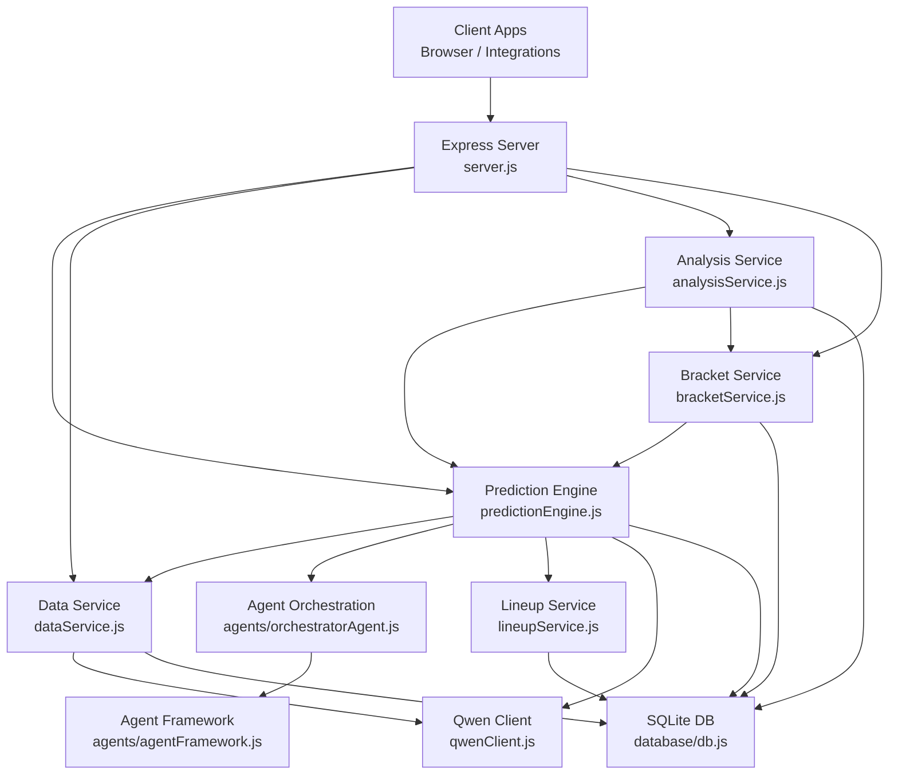

**Diagram sources**
- [server.js:18-724](file://backend/server.js#L18-L724)
- [predictionEngine.js:1-1046](file://backend/services/predictionEngine.js#L1-L1046)
- [dataService.js:1-583](file://backend/services/dataService.js#L1-L583)
- [analysisService.js:1-422](file://backend/services/analysisService.js#L1-L422)
- [bracketService.js:1-1080](file://backend/services/bracketService.js#L1-L1080)
- [orchestratorAgent.js:1-502](file://backend/services/agents/orchestratorAgent.js#L1-L502)
- [agentFramework.js:1-576](file://backend/services/agents/agentFramework.js#L1-L576)
- [qwenClient.js:1-123](file://backend/services/qwenClient.js#L1-L123)
- [lineupService.js:1-425](file://backend/services/lineupService.js#L1-L425)
- [db.js:1-252](file://backend/database/db.js#L1-L252)

## Detailed Component Analysis

### Express Server and Middleware
- Middleware stack: CORS configured from environment, JSON body parsing.
- Static asset serving for the React frontend in production.
- Route organization by domain: teams, groups, matches, predictions, tournament bracket, suspensions, analytics, and sync.
- Error handling: centralized try/catch blocks in routes returning JSON error responses with appropriate HTTP status codes.
- Security: CORS origin controlled by environment variable; JSON body size limits implicitly enforced by Express; no explicit rate limiting in the server code.

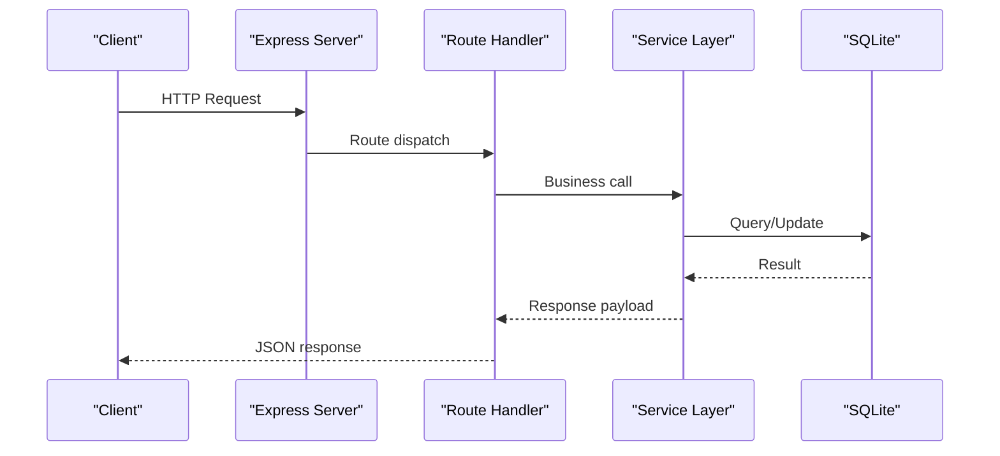

**Diagram sources**
- [server.js:21-724](file://backend/server.js#L21-L724)

**Section sources**
- [server.js:18-724](file://backend/server.js#L18-L724)

### Database Abstraction and Schema
- SQLite connection via node-sqlite3-wasm with path and lock handling.
- PRAGMA tuning for concurrency and integrity (busy_timeout, synchronous, foreign_keys).
- Schema initialization with migrations for model weights, agent tables, and prediction history.
- Seed script for teams and group-stage fixtures.
- Lineup table for storing team lineups with strength scores and caching.

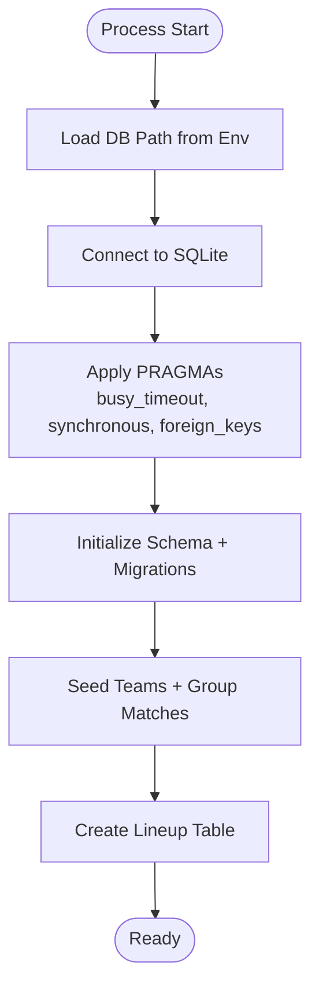

**Diagram sources**
- [db.js:5-252](file://backend/database/db.js#L5-L252)
- [seed.js:1-69](file://backend/database/seed.js#L1-L69)
- [lineupService.js:63-81](file://backend/services/lineupService.js#L63-L81)

**Section sources**
- [db.js:1-252](file://backend/database/db.js#L1-L252)
- [seed.js:1-69](file://backend/database/seed.js#L1-L69)
- [lineupService.js:63-81](file://backend/services/lineupService.js#L63-L81)

### Prediction Engine
- Backbone: Dixon-Coles bivariate Poisson with online attack/defense ratings and WC-specific goal scaling.
- Signals: H2H, form, web intelligence, lineup, rest days, venue effects, and host-nation advantage.
- Aggregation: Log-pool blending of signals with per-signal weights; temperature calibration; confidence tiers.
- Multi-agent augmentation: When enabled, orchestrator composes specialist agents, detects conflicts, negotiates, and merges outputs.
- Output: Probabilities, expected scores, top scorelines, insight, factors, and methodology.
- Lineup integration: Automatic fetching and conversion to probability adjustments when available, with automatic re-run capability.

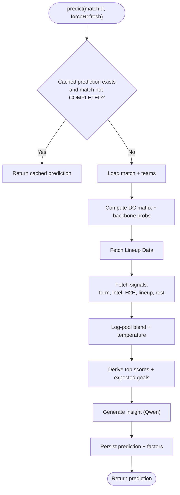

**Diagram sources**
- [predictionEngine.js:812-823](file://backend/services/predictionEngine.js#L812-L823)
- [predictionEngine.js:835-842](file://backend/services/predictionEngine.js#L835-L842)

**Section sources**
- [predictionEngine.js:1-1046](file://backend/services/predictionEngine.js#L1-L1046)

### Data Service
- Live data ingestion from football-data.org API with fallback to web scraping.
- Caching for form, H2H, and intelligence with TTLs.
- LLM-powered parsing of web content into structured intelligence with anti-hallucination checks.
- Live result synchronization: flips matches to LIVE and records final scores; handles API home/away reversal.

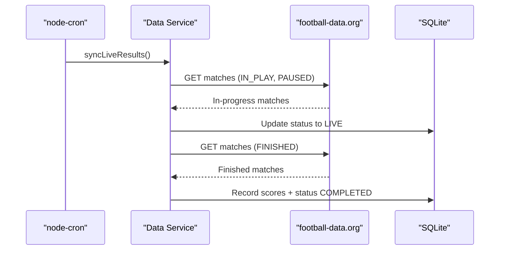

**Diagram sources**
- [dataService.js:495-580](file://backend/services/dataService.js#L495-L580)

**Section sources**
- [dataService.js:1-583](file://backend/services/dataService.js#L1-L583)

### Analysis and Calibration Service
- Post-match analysis: computes Brier score, outcome correctness, points scoring, and updates model performance logs.
- ELO and v2 rating updates after match results.
- Recalculation of group standings from completed matches to avoid double counting.
- Periodic calibration refits for output temperature and Dixon-Coles ρ.

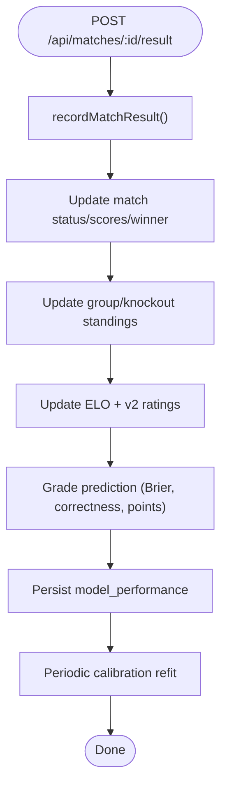

**Diagram sources**
- [analysisService.js:76-218](file://backend/services/analysisService.js#L76-L218)

**Section sources**
- [analysisService.js:1-422](file://backend/services/analysisService.js#L1-L422)

### Bracket and Tournament Services
- Ensures knockout match stubs and schedules; fills R32 from group standings and best third-placed teams.
- Advances winners through R16, QF, SF, and Final; supports third-place playoff.
- Prediction-based placement engine and Monte Carlo simulation for tournament winner probabilities.

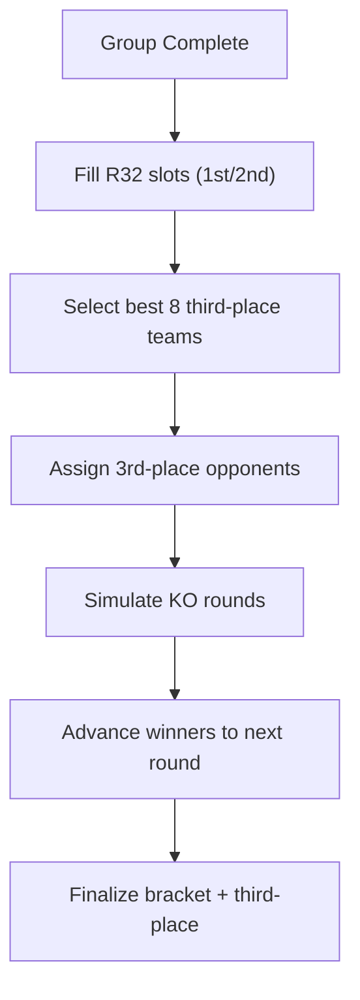

**Diagram sources**
- [bracketService.js:146-330](file://backend/services/bracketService.js#L146-L330)

**Section sources**
- [bracketService.js:1-1080](file://backend/services/bracketService.js#L1-L1080)

### Multi-Agent Orchestration
- Agent framework defines a strict JSON output schema, conflict detection, and negotiation mechanics.
- Orchestrator composes domain agents (statistical, H2H, form, intel, lineup), dispatches in parallel, detects conflicts, negotiates, and merges outputs via weighted log-pool.
- Saves agent sessions, messages, and conflicts to the database.

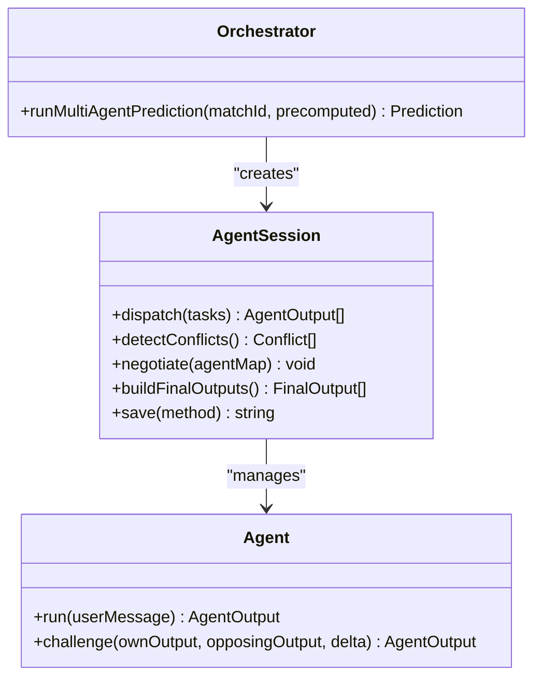

**Diagram sources**
- [agentFramework.js:201-576](file://backend/services/agents/agentFramework.js#L201-L576)
- [orchestratorAgent.js:288-502](file://backend/services/agents/orchestratorAgent.js#L288-L502)

**Section sources**
- [agentFramework.js:1-576](file://backend/services/agents/agentFramework.js#L1-L576)
- [orchestratorAgent.js:1-502](file://backend/services/agents/orchestratorAgent.js#L1-L502)

### Lineup Service
- Automatic lineup fetching from multiple sources: football-data.org API, ESPN, and manual submissions.
- Lineup caching with duplicate detection to avoid redundant API calls.
- Strength score calculation based on player positions and team ELO ratings.
- Key absence detection by comparing current starters with recent lineup patterns.
- Integration with prediction engine through lineup-to-probability conversion.

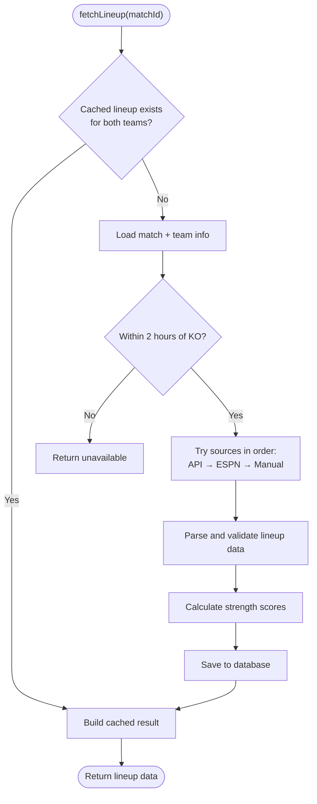

**Diagram sources**
- [lineupService.js:221-316](file://backend/services/lineupService.js#L221-L316)

**Section sources**
- [lineupService.js:1-425](file://backend/services/lineupService.js#L1-L425)

### Qwen Client
- OpenAI-compatible API client with bearer token authentication.
- Configurable base URL, retry/backoff on transient failures, and latency tracking.
- Ping endpoint for connectivity checks.

**Section sources**
- [qwenClient.js:1-123](file://backend/services/qwenClient.js#L1-L123)

### API Endpoint Organization and Patterns
- Teams: GET /api/teams and /api/teams/:id with related matches, ELO history, and group mates.
- Groups: GET /api/groups and /api/groups/:group with standings and qualification scenarios.
- Matches: GET /api/matches with filtering, /api/matches/today, /api/matches/upcoming, /api/matches/:id, and POST /api/matches/:id/result.
- Predictions: GET /api/matches/:id/prediction with refresh and language options, GET /api/matches/:id/agent-session, GET /api/matches/:id/predictions, POST /api/predictions/generate-all.
- Tournament: GET /api/tournament/bracket, GET /api/tournament/winner-probabilities, GET /api/tournament/road-to-final, POST /api/tournament/simulate-knockout.
- Suspensions: GET /api/suspensions, /api/matches/:id/suspensions, /api/teams/:id/suspensions.
- Analytics: GET /api/analytics/accuracy, /api/analytics/model-weights, /api/analytics/agent-performance.
- Sync: POST /api/sync.

Request/Response patterns:
- Validation: route handlers validate inputs and return 400 for invalid parameters.
- Error handling: try/catch blocks return 500 with error messages.
- Responses: JSON payloads; caching-aware predictions include a fromCache flag.

**Section sources**
- [server.js:24-724](file://backend/server.js#L24-L724)

### Cron Job Scheduling
- Live result sync: every 5 minutes during the tournament.
- Prediction regeneration: hourly during SGT daytime hours and selected evening slots, covering the next three match days, with WC end-date cutoff.
- **New**: Lineup fetching and prediction re-run: every 15 minutes for matches within 2 hours of kickoff, automatically retrieving team lineups from multiple sources, caching them, and triggering prediction re-runs with error handling for re-prediction workflows.

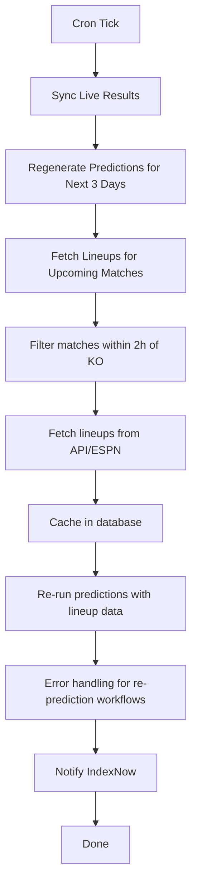

**Diagram sources**
- [server.js:585-676](file://backend/server.js#L585-L676)
- [server.js:634-676](file://backend/server.js#L634-L676)

**Section sources**
- [server.js:585-676](file://backend/server.js#L585-L676)

## Dependency Analysis
External dependencies include Express, node-cron, CORS, dotenv, node-sqlite3-wasm, axios, and cheerio. Internal dependencies are organized by service boundaries with clear import relationships.

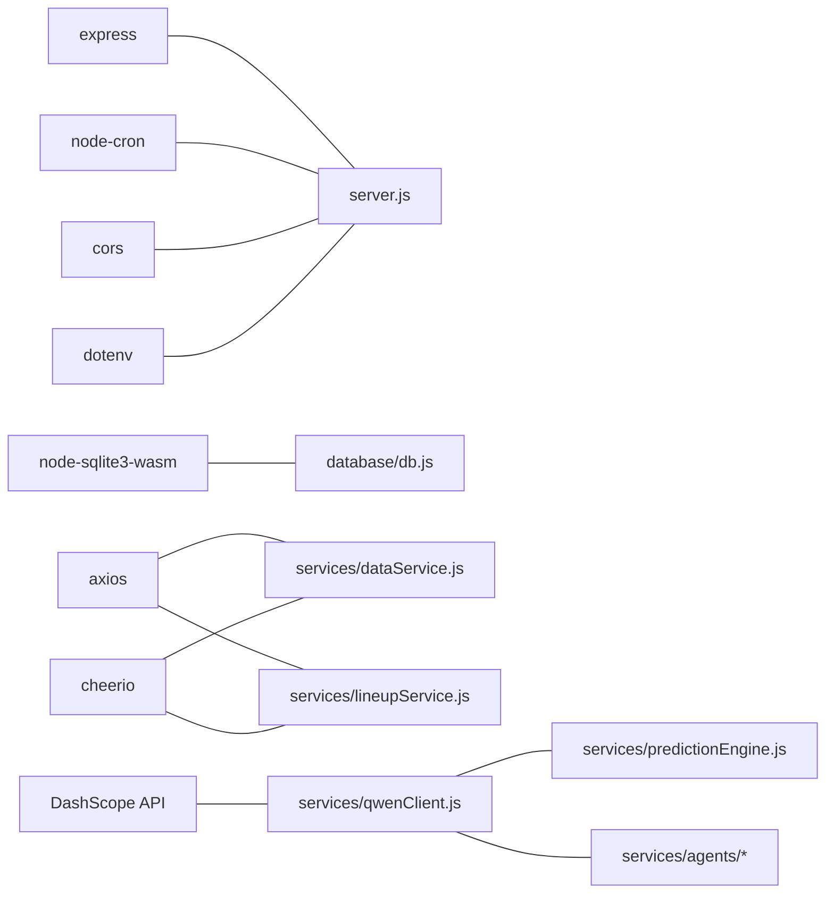

**Diagram sources**
- [package.json:14-31](file://backend/package.json#L14-L31)
- [server.js:1-20](file://backend/server.js#L1-L20)
- [db.js:1-10](file://backend/database/db.js#L1-L10)
- [dataService.js:7-28](file://backend/services/dataService.js#L7-L28)
- [lineupService.js:84-113](file://backend/services/lineupService.js#L84-L113)
- [qwenClient.js:13-40](file://backend/services/qwenClient.js#L13-L40)
- [predictionEngine.js:37-44](file://backend/services/predictionEngine.js#L37-L44)
- [orchestratorAgent.js:28-30](file://backend/services/agents/orchestratorAgent.js#L28-L30)

**Section sources**
- [package.json:1-32](file://backend/package.json#L1-L32)

## Performance Considerations
- Concurrency: SQLite PRAGMA busy_timeout and directory-based locking mitigate contention; ensure single writer pattern for predictions and bracket updates.
- Caching: Data service caches form, H2H, and intelligence to reduce network load and API throttling risk.
- Parallelism: Multi-agent orchestration and data fetching use Promise.allSettled for resilience; prediction batch generation enforces cooldowns.
- Predictions: Background prediction generation on startup for the next three match days reduces cold-start latency.
- Model calibration: Temperature and DC ρ refits improve reliability over time.
- **New**: Lineup caching and automatic re-run: Automatic caching prevents redundant API calls and reduces latency for prediction calculations, while the automatic re-run mechanism ensures predictions are updated when lineup data becomes available.
- **New**: Error handling in re-prediction workflows: Comprehensive error handling prevents cascade failures in cron jobs and maintains system stability.

## Troubleshooting Guide
Common issues and remedies:
- Missing environment variables: DASHSCOPE_API_KEY and optional FOOTBALL_DATA_API_KEY; configure .env or process environment.
- CORS errors: Verify FRONTEND_URL in environment matches the origin making requests.
- SQLite lock errors: Stale lock directory cleanup occurs on first connect; ensure filesystem permissions and path correctness.
- Prediction cache misses: Use refresh=true query param or wait for cron regeneration.
- Agent parsing failures: Agent output schema enforcement ensures fallbacks; inspect agent_messages for raw responses.
- Live sync failures: Cron logs errors; verify API keys and network connectivity.
- **New**: Lineup fetch failures: Check lineup availability window (60-75 minutes before kickoff); verify API keys for external sources; monitor cron logs for specific error messages including re-prediction failure details.
- **New**: Prediction re-run failures: The automatic re-run mechanism includes error handling that prevents individual match failures from affecting the entire cron job; check cron logs for specific re-prediction error messages.

**Section sources**
- [server.js:1-22](file://backend/server.js#L1-L22)
- [db.js:10-21](file://backend/database/db.js#L10-L21)
- [qwenClient.js:60-101](file://backend/services/qwenClient.js#L60-L101)
- [agentFramework.js:112-146](file://backend/services/agents/agentFramework.js#L112-L146)
- [lineupService.js:256-262](file://backend/services/lineupService.js#L256-L262)

## Conclusion
The WC26-Qwen-Qoder backend combines a robust Express server, a sophisticated SQLite-backed data layer, and a multi-agent prediction system to deliver accurate, explainable match outcomes. Its modular services, resilient scheduling, and performance-conscious design enable scalable operation during the tournament lifecycle while maintaining high-quality analytics and user experiences. The new automatic prediction re-run mechanism triggered by the lineup cron job enhances prediction accuracy by automatically fetching and caching team lineups for upcoming matches, providing crucial tactical insights that influence match outcome probabilities. The comprehensive error handling in re-prediction workflows ensures system stability and prevents cascade failures, while the automatic re-run capability provides real-time updates as lineup data becomes available.