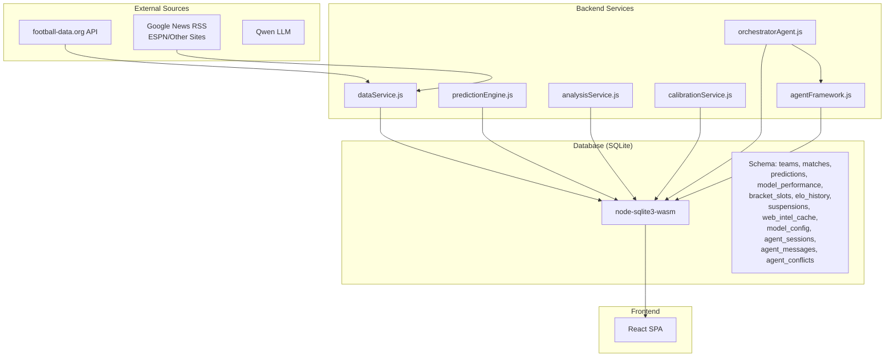
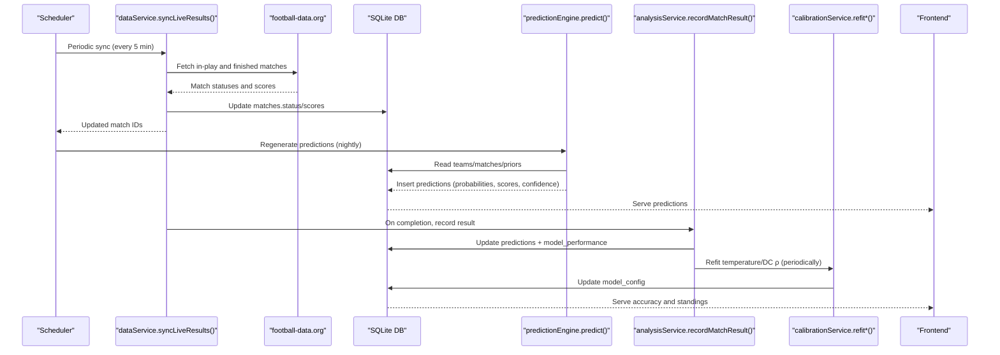
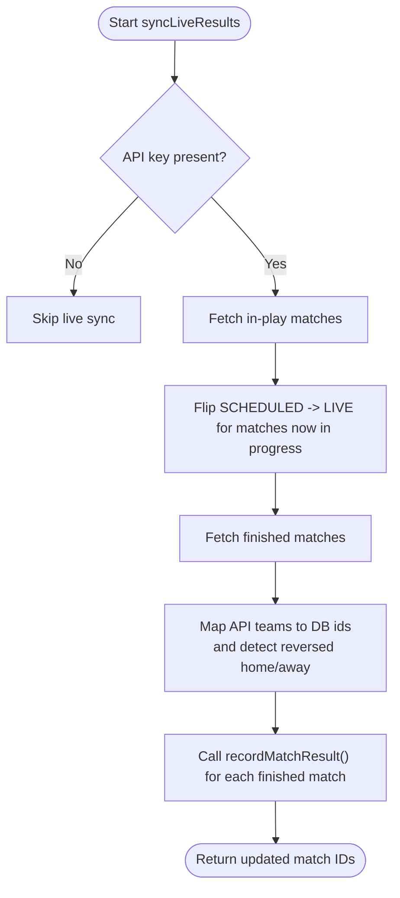
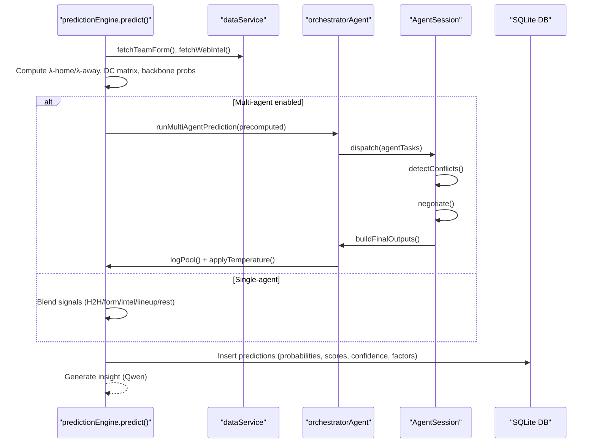
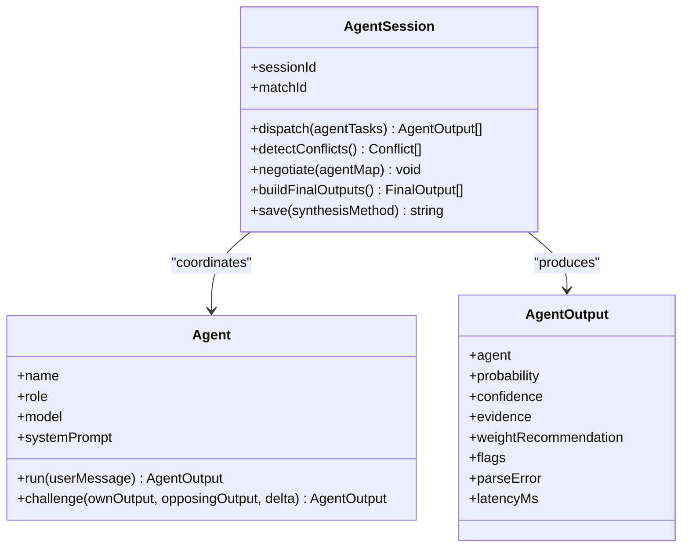
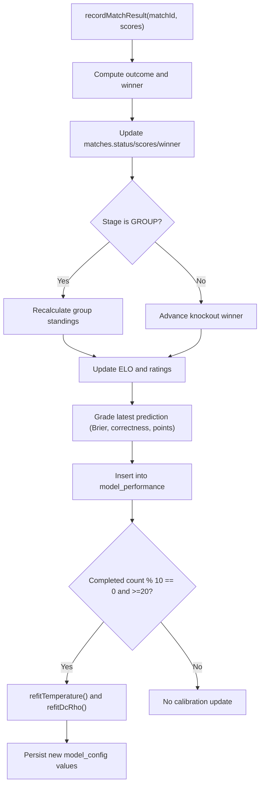
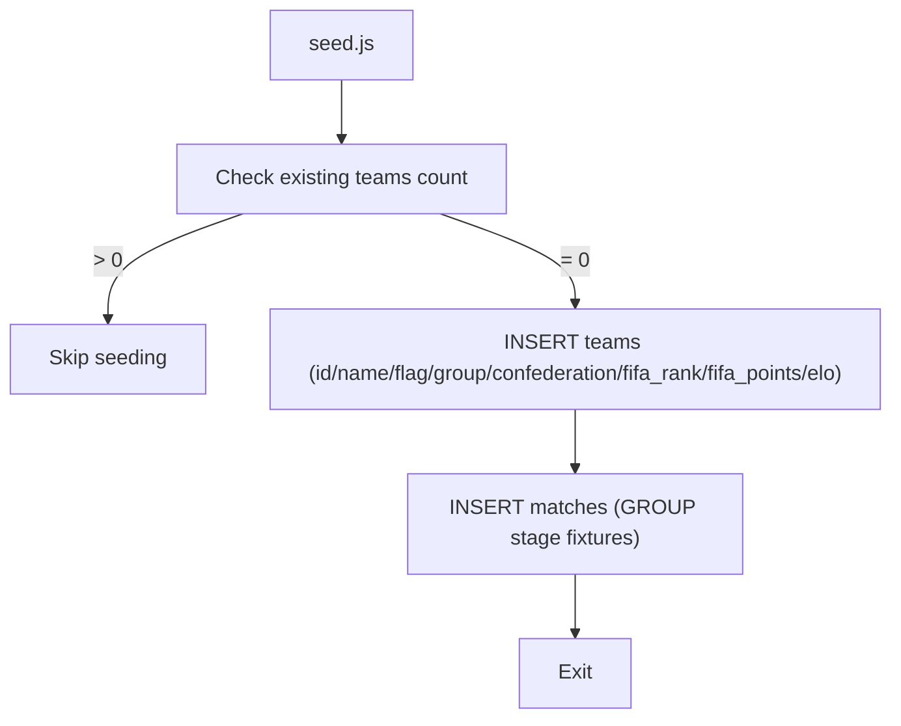
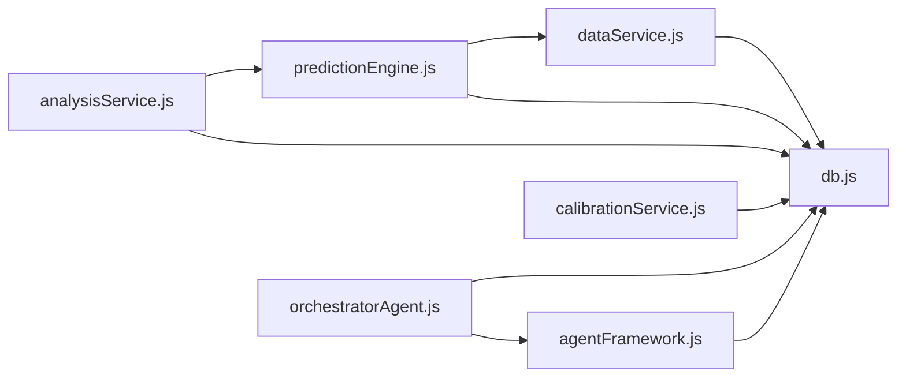

# Data Architecture

<cite>
**Referenced Files in This Document**
- [db.js](file://backend/database/db.js)
- [seed.js](file://backend/database/seed.js)
- [teams.js](file://backend/data/teams.js)
- [dataService.js](file://backend/services/dataService.js)
- [predictionEngine.js](file://backend/services/predictionEngine.js)
- [analysisService.js](file://backend/services/analysisService.js)
- [calibrationService.js](file://backend/services/calibrationService.js)
- [SPEC.md](file://specs/SPEC.md)
- [SPEC-PREDICT.md](file://specs/SPEC-PREDICT.md)
- [regen-predictions.js](file://backend/scripts/regen-predictions.js)
- [reprocessCompletedMatches.js](file://backend/scripts/reprocessCompletedMatches.js)
- [orchestratorAgent.js](file://backend/services/agents/orchestratorAgent.js)
- [agentFramework.js](file://backend/services/agents/agentFramework.js)
</cite>

## Table of Contents
1. [Introduction](#introduction)
2. [Project Structure](#project-structure)
3. [Core Components](#core-components)
4. [Architecture Overview](#architecture-overview)
5. [Detailed Component Analysis](#detailed-component-analysis)
6. [Dependency Analysis](#dependency-analysis)
7. [Performance Considerations](#performance-considerations)
8. [Troubleshooting Guide](#troubleshooting-guide)
9. [Conclusion](#conclusion)
10. [Appendices](#appendices)

## Introduction
This document describes the data architecture of the World Cup 2026 prediction system. It covers the SQLite schema, data flows from external APIs and web scraping into the local database and UI, synchronization strategies, prediction data models, multi-agent session storage, validation and integrity rules, backup and recovery, migrations, and security considerations.

## Project Structure
The system is organized around a central SQLite database with a schema designed to support:
- Team profiles and evolving ELO/attack-defense ratings
- Match lifecycle and outcomes
- Pre-match predictions with probability distributions and confidence
- Model performance tracking and calibration
- Bracket progression and group stage standings
- Web intelligence caching and player suspension records
- Multi-agent prediction sessions and message logs



**Diagram sources**
- [db.js:23-227](file://backend/database/db.js#L23-L227)
- [dataService.js:18-602](file://backend/services/dataService.js#L18-L602)
- [predictionEngine.js:691-800](file://backend/services/predictionEngine.js#L691-L800)
- [analysisService.js:76-218](file://backend/services/analysisService.js#L76-L218)
- [calibrationService.js:53-132](file://backend/services/calibrationService.js#L53-L132)
- [orchestratorAgent.js:309-502](file://backend/services/agents/orchestratorAgent.js#L309-L502)
- [agentFramework.js:208-586](file://backend/services/agents/agentFramework.js#L208-L586)

**Section sources**
- [db.js:1-252](file://backend/database/db.js#L1-L252)
- [SPEC.md:1-205](file://specs/SPEC.md#L1-L205)

## Core Components
- Database layer initializes SQLite, defines schema, seeds default model weights, and exposes a singleton connection.
- Data ingestion layer fetches live scores, team form, head-to-head data, and web intelligence; caches results; and synchronizes with the API.
- Prediction engine computes outcome probabilities, expected scores, confidence, and factors; supports single-agent and multi-agent modes.
- Analysis service grades predictions, updates model performance, recalculates group standings, advances brackets, and triggers calibration.
- Calibration service refits temperature scaling and Dixon-Coles ρ periodically.
- Multi-agent orchestration coordinates specialized agents, detects conflicts, negotiates, and synthesizes final outputs with session persistence.

**Section sources**
- [db.js:10-252](file://backend/database/db.js#L10-L252)
- [dataService.js:1-602](file://backend/services/dataService.js#L1-L602)
- [predictionEngine.js:1-800](file://backend/services/predictionEngine.js#L1-L800)
- [analysisService.js:1-422](file://backend/services/analysisService.js#L1-L422)
- [calibrationService.js:1-132](file://backend/services/calibrationService.js#L1-L132)
- [orchestratorAgent.js:1-502](file://backend/services/agents/orchestratorAgent.js#L1-L502)
- [agentFramework.js:1-586](file://backend/services/agents/agentFramework.js#L1-L586)

## Architecture Overview
End-to-end data flow:
- External API and web scraping populate caches and the matches table.
- Predictions are computed nightly and on demand; results are stored with confidence and factors.
- After match completion, analysis updates model performance, recalculates standings, advances brackets, and refits calibration.
- Frontend consumes aggregated endpoints for matches, analytics, and predictions.



**Diagram sources**
- [dataService.js:514-602](file://backend/services/dataService.js#L514-L602)
- [analysisService.js:76-218](file://backend/services/analysisService.js#L76-L218)
- [calibrationService.js:53-132](file://backend/services/calibrationService.js#L53-L132)
- [predictionEngine.js:691-800](file://backend/services/predictionEngine.js#L691-L800)

## Detailed Component Analysis

### Database Schema
Tables and relationships:
- teams: Team metadata, ELO, group stage stats, and attack/defense ratings.
- matches: All matches with stage, status, scores, and winner.
- predictions: Pre-match probabilities, expected scores, confidence, factors, insights, and post-match truth.
- model_performance: Graded predictions with outcome correctness, Brier score, confidence, and points.
- bracket_slots: Knockout bracket slot assignments linked to matches.
- elo_history: Per-match ELO updates with opponent and stage.
- suspensions: Player suspension records with reason and source.
- web_intel_cache: Structured web intelligence with TTL.
- model_config: Adjustable model weights and calibration parameters.
- agent_sessions: Multi-agent session metadata.
- agent_messages: Round 1 and rebuttal messages with probabilities and confidence.
- agent_conflicts: Conflict detection and resolution outcomes.

```mermaid
erDiagram
TEAMS {
text id PK
text name
text flag
text group_code
text confederation
int fifa_rank
float fifa_points
float elo
float avg_scored
float avg_conceded
int wc_appearances
text last_wc_round
int gs_played
int gs_won
int gs_drawn
int gs_lost
int gs_gf
int gs_ga
int gs_pts
int eliminated
text updated_at
}
MATCHES {
text id PK
text stage
text group_code
int match_number
text home_team FK
text away_team FK
text scheduled_date
text scheduled_time
text venue
text status
int home_score
int away_score
int home_score_pens
int away_score_pens
text winner
text created_at
text completed_at
}
PREDICTIONS {
int id PK
text match_id FK
text generated_at
float prob_home
float prob_draw
float prob_away
float expected_score_home
float expected_score_away
text most_likely_score
text top_scores
text confidence
text factors
text web_intel
text insight
text methodology
text actual_outcome
int was_correct
float brier_score
int upset
float lambda_home
float lambda_away
text agent_session_id
}
MODEL_PERFORMANCE {
int id PK
text match_id FK
text stage
text predicted_outcome
text actual_outcome
int was_correct
float brier_score
float prob_predicted
text confidence
int upset
text analysis_notes
int points
text created_at
}
BRACKET_SLOTS {
text match_id PK FK
text slot_home
text slot_away
text filled_at
}
ELO_HISTORY {
int id PK
text team_id FK
text match_id FK
float elo_before
float elo_after
text opponent_id
text result
text stage
text recorded_at
}
SUSPENSIONS {
int id PK
text team_id FK
text player_name
text reason
int yellow_cards
text suspended_for_match_id
text source
text notes
text created_at
text updated_at
}
WEB_INTEL_CACHE {
int id PK
text team_id
text match_id
text intel_type
text content
text source_url
text fetched_at
text expires_at
}
MODEL_CONFIG {
text key PK
float value
text description
text updated_at
}
AGENT_SESSIONS {
text id PK
text match_id FK
text agents_used
int rounds
int conflicts_detected
int conflicts_resolved
text synthesis_method
int wall_time_ms
text created_at
}
AGENT_MESSAGES {
int id PK
text session_id FK
int round
text agent
text role
text probability
float confidence
text evidence
text raw_response
int latency_ms
text created_at
}
AGENT_CONFLICTS {
int id PK
text session_id FK
text agent_a
text agent_b
float delta
int round_detected
text resolution
text winner
text resolution_reasoning
text created_at
}
TEAMS ||--o{ MATCHES : "home_team/away_team"
MATCHES ||--o{ PREDICTIONS : "produces"
MATCHES ||--o{ MODEL_PERFORMANCE : "grades"
MATCHES ||--o{ BRACKET_SLOTS : "slot assignments"
TEAMS ||--o{ ELO_HISTORY : "updates"
MATCHES ||--o{ ELO_HISTORY : "linked"
TEAMS ||--o{ SUSPENSIONS : "suspensions"
MATCHES ||--o{ WEB_INTEL_CACHE : "context"
AGENT_SESSIONS ||--o{ AGENT_MESSAGES : "contains"
AGENT_SESSIONS ||--o{ AGENT_CONFLICTS : "resolutions"
```

**Diagram sources**
- [db.js:23-227](file://backend/database/db.js#L23-L227)

**Section sources**
- [db.js:23-227](file://backend/database/db.js#L23-L227)

### Data Ingestion and Synchronization
- Live results sync: Queries API for in-play and finished matches, flips status to LIVE, records scores, and triggers post-match analysis.
- Team form and H2H: Fetches from API with fallback to web scraping; caches structured results with TTL.
- Web intelligence: Scrapes Google News RSS and ESPN for team news; validates LLM extractions against source text; caches structured intel.
- Cache invalidation: Uses fetched_at/expired_at timestamps to enforce TTL per intel type.



**Diagram sources**
- [dataService.js:514-602](file://backend/services/dataService.js#L514-L602)
- [analysisService.js:76-218](file://backend/services/analysisService.js#L76-L218)

**Section sources**
- [dataService.js:514-602](file://backend/services/dataService.js#L514-L602)
- [SPEC.md:180-198](file://specs/SPEC.md#L180-L198)

### Prediction Data Model
- Inputs: Team ratings (ELO/attack/defense), recent form, H2H, web intel, lineup, venue conditions, rest days, host-nation advantage.
- Backbone: Dixon-Coles bivariate Poisson with λ-home/λ-away derived from log-α/log-β and home advantage; low-score correction ρ.
- Signals: Weighted log-pool blending of outcome vectors from H2H, form, intel, lineup, and rest days.
- Outputs: Probabilities, expected goals, most likely scoreline, top-3 scorelines, confidence, factors, insight, methodology.
- Multi-agent mode: Specialized agents produce independent outputs; conflicts detected and resolved; final synthesis via log-pool with adjusted weights.



**Diagram sources**
- [predictionEngine.js:691-800](file://backend/services/predictionEngine.js#L691-L800)
- [dataService.js:68-509](file://backend/services/dataService.js#L68-L509)
- [orchestratorAgent.js:309-502](file://backend/services/agents/orchestratorAgent.js#L309-L502)
- [agentFramework.js:336-586](file://backend/services/agents/agentFramework.js#L336-L586)

**Section sources**
- [predictionEngine.js:1-800](file://backend/services/predictionEngine.js#L1-L800)
- [SPEC.md:125-178](file://specs/SPEC.md#L125-L178)

### Multi-Agent Session Management
- Sessions capture all agent outputs, conflicts, and resolutions.
- Stores Round 1 analysis and Round 2 rebuttals; persists conflict decisions and winner/loser adjustments.
- Final outputs are synthesized with log-pool blending and temperature scaling.



**Diagram sources**
- [agentFramework.js:208-586](file://backend/services/agents/agentFramework.js#L208-L586)

**Section sources**
- [agentFramework.js:1-586](file://backend/services/agents/agentFramework.js#L1-L586)
- [orchestratorAgent.js:1-502](file://backend/services/agents/orchestratorAgent.js#L1-L502)

### Post-Match Analysis and Calibration
- Grades predictions against 90-minute full-time result; computes Brier score and points.
- Updates model_performance, recalculates group standings, advances brackets, and updates ELO.
- Triggers temperature scaling and Dixon-Coles ρ refit every 10 completed matches after a minimum threshold.



**Diagram sources**
- [analysisService.js:76-218](file://backend/services/analysisService.js#L76-L218)
- [calibrationService.js:53-132](file://backend/services/calibrationService.js#L53-L132)

**Section sources**
- [analysisService.js:1-422](file://backend/services/analysisService.js#L1-L422)
- [calibrationService.js:1-132](file://backend/services/calibrationService.js#L1-L132)

### Seeding and Initial Data Population
- Seeds teams and group-stage fixtures from static data.
- Inserts team stats and sets ELO equal to FIFA points initially.
- Begins with clean slate; prevents duplicate seeding.



**Diagram sources**
- [seed.js:9-69](file://backend/database/seed.js#L9-L69)
- [teams.js:7-234](file://backend/data/teams.js#L7-L234)

**Section sources**
- [seed.js:1-69](file://backend/database/seed.js#L1-L69)
- [teams.js:1-234](file://backend/data/teams.js#L1-L234)

### Data Validation, Business Rules, and Integrity
- Foreign keys enforced; PRAGMA foreign_keys ON.
- Status transitions: SCHEDULED → LIVE → COMPLETED with immutable prediction lock upon kickoff.
- Outcome correctness uses 90-minute full-time result; penalties only for knockout winner determination.
- Brier score and points scoring align with headline scoreline and top-3 picks.
- Cache TTLs per intel type; cache entries expire deterministically.
- Multi-agent conflict threshold 0.20; weight adjustments based on concessions in rebuttals.

**Section sources**
- [db.js:15-18](file://backend/database/db.js#L15-L18)
- [SPEC.md:160-178](file://specs/SPEC.md#L160-L178)
- [analysisService.js:30-71](file://backend/services/analysisService.js#L30-L71)
- [dataService.js:31-41](file://backend/services/dataService.js#L31-L41)
- [agentFramework.js:32-34](file://backend/services/agents/agentFramework.js#L32-L34)

### Backup, Recovery, and Migration
- Backup: SQLite database file can be copied offline; consider WAL mode for improved concurrency if needed.
- Recovery: Stale locks removed on startup; schema initialization idempotent; migrations executed per existing DB state.
- Migrations: Adds columns and model weights as needed; inserts default weights if missing.

**Section sources**
- [db.js:10-21](file://backend/database/db.js#L10-L21)
- [db.js:210-249](file://backend/database/db.js#L210-L249)

### Security and Access Controls
- Environment variables for API keys and DB path.
- Read-only UI access; no user-write operations from the frontend.
- LLM prompts and outputs are logged; sensitive data is not stored beyond what is necessary for predictions and analytics.

**Section sources**
- [SPEC.md:27-28](file://specs/SPEC.md#L27-L28)
- [SPEC-PREDICT.md:131-147](file://specs/SPEC-PREDICT.md#L131-L147)

### Examples and Aggregation Patterns
- Model accuracy aggregation: latest model_performance per match deduplicated, then totals and averages computed.
- Group standings: recalculated from completed matches to avoid double counting.
- Points scoring: 3-2-1 based on headline scoreline, top-3 scorelines, and outcome alignment.

**Section sources**
- [analysisService.js:321-422](file://backend/services/analysisService.js#L321-L422)
- [analysisService.js:238-293](file://backend/services/analysisService.js#L238-L293)
- [SPEC-PREDICT.md:28-51](file://specs/SPEC-PREDICT.md#L28-L51)

### Operational Scripts
- Regenerate predictions for all scheduled matches with updated parameters.
- Reprocess completed matches to rebuild model_performance and side effects.

**Section sources**
- [regen-predictions.js:1-31](file://backend/scripts/regen-predictions.js#L1-L31)
- [reprocessCompletedMatches.js:1-65](file://backend/scripts/reprocessCompletedMatches.js#L1-L65)

## Dependency Analysis
- dataService depends on SQLite and Qwen client; uses axios and cheerio for API and scraping.
- predictionEngine depends on dataService and h2h/lineup services; optionally delegates to orchestratorAgent.
- analysisService depends on predictionEngine’s rating update logic and bracket services.
- calibrationService depends on model_config and predictions for refit.
- agentFramework and orchestratorAgent depend on Qwen client and share math helpers locally to avoid circular dependencies.



**Diagram sources**
- [dataService.js:1-602](file://backend/services/dataService.js#L1-L602)
- [predictionEngine.js:1-800](file://backend/services/predictionEngine.js#L1-L800)
- [analysisService.js:1-422](file://backend/services/analysisService.js#L1-L422)
- [calibrationService.js:1-132](file://backend/services/calibrationService.js#L1-L132)
- [orchestratorAgent.js:1-502](file://backend/services/agents/orchestratorAgent.js#L1-L502)
- [agentFramework.js:1-586](file://backend/services/agents/agentFramework.js#L1-L586)
- [db.js:1-252](file://backend/database/db.js#L1-L252)

**Section sources**
- [SPEC.md:1-205](file://specs/SPEC.md#L1-L205)

## Performance Considerations
- SQLite pragmas configured for reasonable concurrency and foreign key enforcement.
- Caching reduces repeated network calls; TTLs balance freshness and cost.
- Parallel fetches for team form, H2H, and intel improve responsiveness.
- Log-pool blending and temperature scaling reduce recomputation overhead.
- Batch operations (BEGIN/COMMIT) during seeding minimize transaction costs.

[No sources needed since this section provides general guidance]

## Troubleshooting Guide
- Live sync failures: Verify API key and team ID mapping; check for unknown API team IDs and reversed home/away.
- Prediction cache hits: Predictions are reused until match goes LIVE; force refresh to regenerate.
- Multi-agent parse errors: Outputs with JSON parse errors are downweighted; review agent prompts and retries.
- Calibration not updating: Requires sufficient completed matches and thresholds; inspect model_config entries.
- Seeding issues: Duplicate seeding prevented; clear DB or adjust seeding logic if needed.

**Section sources**
- [dataService.js:514-602](file://backend/services/dataService.js#L514-L602)
- [predictionEngine.js:691-721](file://backend/services/predictionEngine.js#L691-L721)
- [agentFramework.js:122-156](file://backend/services/agents/agentFramework.js#L122-L156)
- [calibrationService.js:53-82](file://backend/services/calibrationService.js#L53-L82)
- [seed.js:9-16](file://backend/database/seed.js#L9-L16)

## Conclusion
The system integrates external data sources with robust caching, a flexible prediction pipeline (single-agent and multi-agent), and rigorous post-match analysis with periodic calibration. The SQLite schema supports accurate historical tracking, model performance monitoring, and multi-agent session auditing. Operational scripts enable controlled regeneration and reprocessing, while validation rules and migrations maintain data integrity across the lifecycle.

[No sources needed since this section summarizes without analyzing specific files]

## Appendices

### Data Lifecycle Management
- Pre-match: ingest form/H2H/intel, compute prediction, store with confidence and factors.
- During match: flip to LIVE; predictions locked; no regeneration.
- Post-match: record result, grade prediction, update model_performance, recalibrate, update standings/bracket/ELO.

**Section sources**
- [SPEC.md:170-178](file://specs/SPEC.md#L170-L178)
- [analysisService.js:76-218](file://backend/services/analysisService.js#L76-L218)