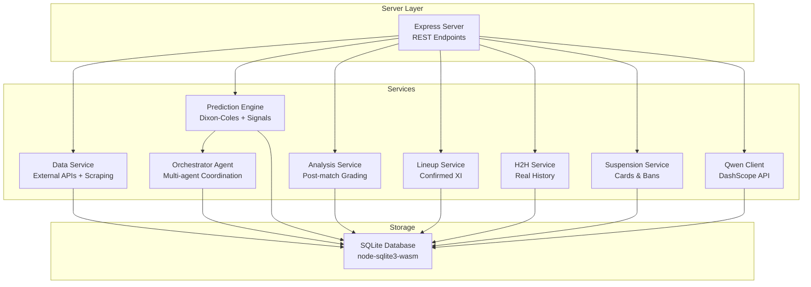
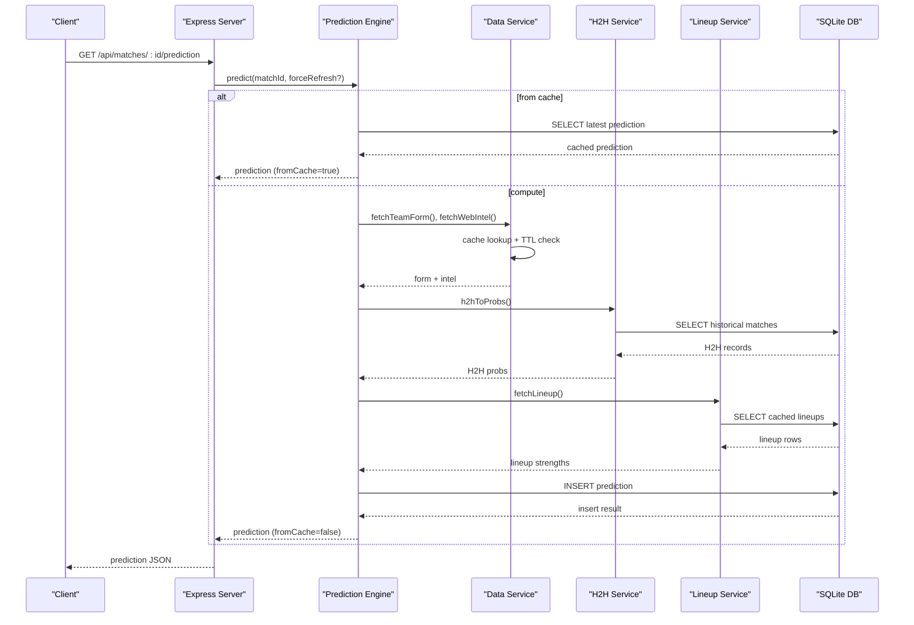
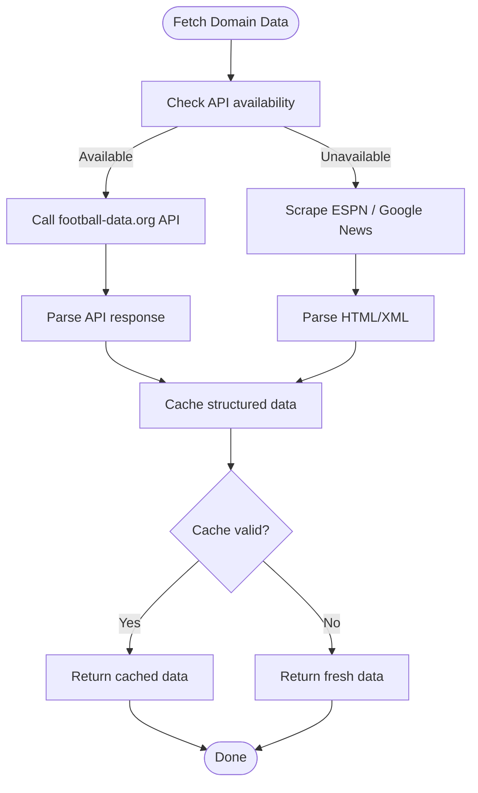
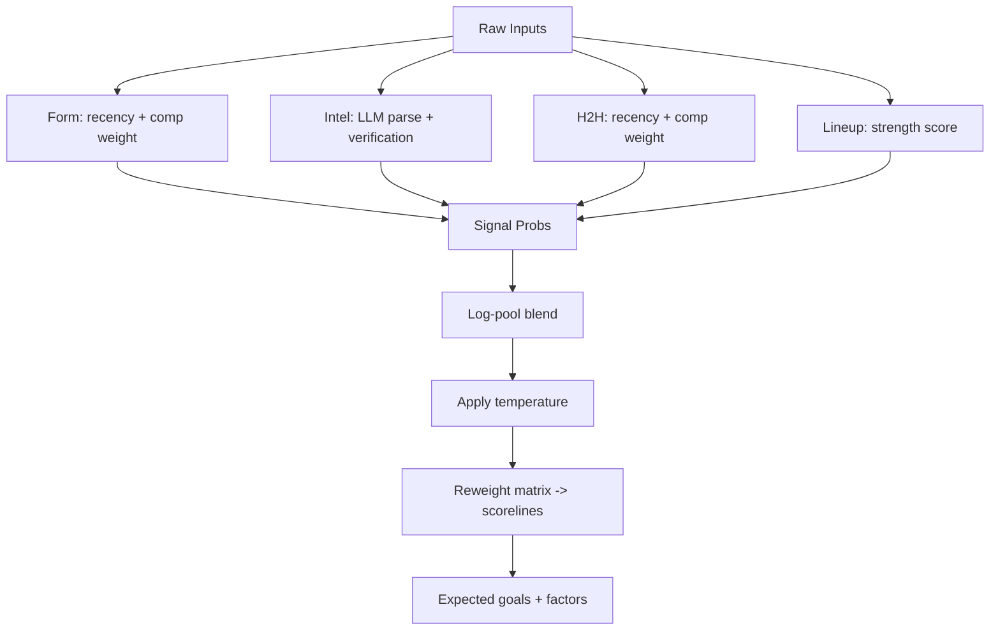
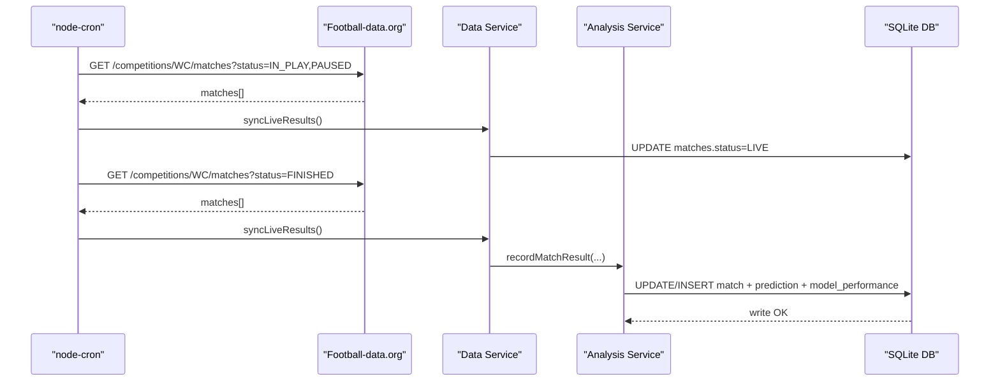
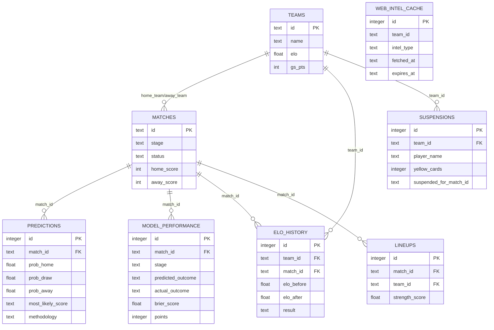
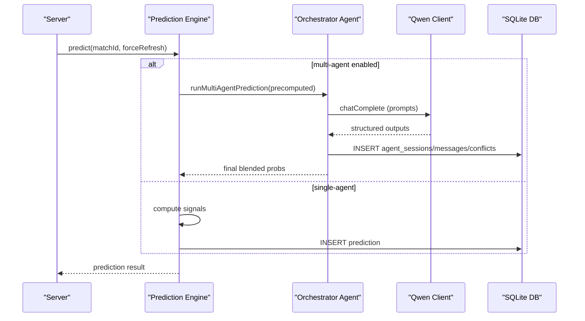
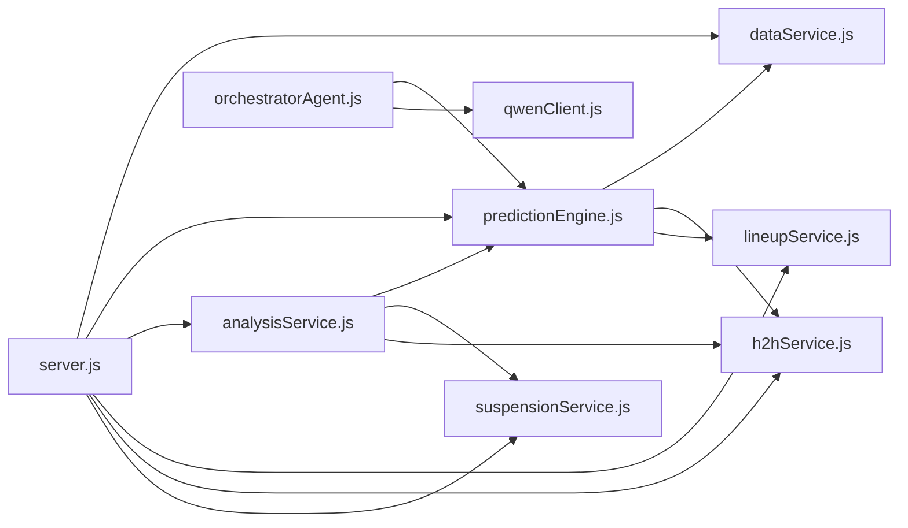

# Data Flow Architecture

<cite>
**Referenced Files in This Document**
- [server.js](file://backend/server.js)
- [db.js](file://backend/database/db.js)
- [dataService.js](file://backend/services/dataService.js)
- [predictionEngine.js](file://backend/services/predictionEngine.js)
- [analysisService.js](file://backend/services/analysisService.js)
- [qwenClient.js](file://backend/services/qwenClient.js)
- [lineupService.js](file://backend/services/lineupService.js)
- [h2hService.js](file://backend/services/h2hService.js)
- [suspensionService.js](file://backend/services/suspensionService.js)
- [orchestratorAgent.js](file://backend/services/agents/orchestratorAgent.js)
- [formAgent.js](file://backend/services/agents/formAgent.js)
- [statisticalAgent.js](file://backend/services/agents/statisticalAgent.js)
- [regen-predictions.js](file://backend/scripts/regen-predictions.js)
</cite>

## Table of Contents
1. [Introduction](#introduction)
2. [Project Structure](#project-structure)
3. [Core Components](#core-components)
4. [Architecture Overview](#architecture-overview)
5. [Detailed Component Analysis](#detailed-component-analysis)
6. [Dependency Analysis](#dependency-analysis)
7. [Performance Considerations](#performance-considerations)
8. [Troubleshooting Guide](#troubleshooting-guide)
9. [Conclusion](#conclusion)
10. [Appendices](#appendices)

## Introduction
This document describes the data flow architecture for WC26-Qwen-Qoder’s prediction platform. It covers external API integration patterns for football data, injury reports, and form data collection; data transformation workflows; caching strategies; synchronization mechanisms; database write operations and concurrency handling; prediction update pipeline; historical data management; batch processing jobs; real-time streaming and event-driven patterns; validation, sanitization, and error recovery; and data lineage and audit capabilities.

## Project Structure
The backend is organized around:
- Express server exposing REST endpoints
- SQLite database with node-sqlite3-wasm
- Services for data ingestion, transformations, predictions, analytics, and integrations
- Agents for multi-agent orchestration
- Scripts for batch operations and maintenance

**Diagram sources**
- [server.js:18-681](file://backend/server.js#L18-L681)
- [db.js:1-252](file://backend/database/db.js#L1-L252)
- [dataService.js:1-583](file://backend/services/dataService.js#L1-L583)
- [predictionEngine.js:1-1020](file://backend/services/predictionEngine.js#L1-L1020)
- [analysisService.js:1-422](file://backend/services/analysisService.js#L1-L422)
- [lineupService.js:1-425](file://backend/services/lineupService.js#L1-L425)
- [h2hService.js:1-315](file://backend/services/h2hService.js#L1-L315)
- [suspensionService.js:1-152](file://backend/services/suspensionService.js#L1-L152)
- [qwenClient.js:1-123](file://backend/services/qwenClient.js#L1-L123)
- [orchestratorAgent.js:1-473](file://backend/services/agents/orchestratorAgent.js#L1-L473)

**Section sources**
- [server.js:18-681](file://backend/server.js#L18-L681)
- [db.js:1-252](file://backend/database/db.js#L1-L252)

## Core Components
- Express server with CORS and JSON middleware, hosting REST endpoints for teams, groups, matches, predictions, tournaments, suspensions, analytics, and sync.
- SQLite database initialized with node-sqlite3-wasm, enabling WAL-like concurrency via directory-based locking and pragmas.
- Data ingestion pipeline integrating football-data.org API and web scraping for form, H2H, and injury news; structured with cache TTLs and fallbacks.
- Prediction engine implementing Dixon-Coles bivariate Poisson with log-pool blending of multiple signals (H2H, form, intel, lineup, rest).
- Multi-agent orchestration coordinating specialized agents (statistical, H2H, form, intel, lineup) with conflict detection and resolution.
- Post-match analysis service computing Brier score, updating model weights, recalculating group standings, advancing knockout brackets, and updating ELO/attack-defense ratings.
- Lineup service sourcing confirmed XIs from API or scrapers, computing strength deltas, and translating to probability adjustments.
- Historical H2H service seeding a 47k-match dataset and computing weighted head-to-head advantages.
- Suspension tracker managing yellow/red cards and match bans across the tournament.
- Qwen client wrapping DashScope-compatible API with retry/backoff and structured output validation.

**Section sources**
- [server.js:24-681](file://backend/server.js#L24-L681)
- [db.js:10-252](file://backend/database/db.js#L10-L252)
- [dataService.js:18-583](file://backend/services/dataService.js#L18-L583)
- [predictionEngine.js:1-1020](file://backend/services/predictionEngine.js#L1-L1020)
- [analysisService.js:76-218](file://backend/services/analysisService.js#L76-L218)
- [lineupService.js:221-425](file://backend/services/lineupService.js#L221-L425)
- [h2hService.js:95-315](file://backend/services/h2hService.js#L95-L315)
- [suspensionService.js:16-152](file://backend/services/suspensionService.js#L16-L152)
- [qwenClient.js:27-123](file://backend/services/qwenClient.js#L27-L123)
- [orchestratorAgent.js:290-473](file://backend/services/agents/orchestratorAgent.js#L290-L473)

## Architecture Overview
The system follows an event-driven, batch-oriented architecture:
- REST endpoints trigger computations or read cached/aggregated data.
- External APIs and scrapers feed real-time intelligence into caches.
- Predictions are generated on-demand or by scheduled cron jobs.
- Post-match events update model performance, standings, and ratings.
- Concurrency is handled via SQLite initialization pragmas and directory-based locks.

**Diagram sources**
- [server.js:326-341](file://backend/server.js#L326-L341)
- [predictionEngine.js:665-896](file://backend/services/predictionEngine.js#L665-L896)
- [dataService.js:68-133](file://backend/services/dataService.js#L68-L133)
- [h2hService.js:272-312](file://backend/services/h2hService.js#L272-L312)
- [lineupService.js:221-316](file://backend/services/lineupService.js#L221-L316)
- [db.js:857-872](file://backend/database/db.js#L857-L872)

**Section sources**
- [server.js:326-341](file://backend/server.js#L326-L341)
- [predictionEngine.js:665-896](file://backend/services/predictionEngine.js#L665-L896)

## Detailed Component Analysis

### External API Integration Patterns
- Football-data.org API:
  - Authentication via X-Auth-Token header.
  - Team form retrieval (FINISHED matches), H2H filtering by opponent, and match lineup extraction.
  - ID mapping ensures correct pairing despite API ID changes.
- Web scraping:
  - Team form via ESPN (fallback when API unavailable).
  - Injury news via Google News RSS (DuckDuckGo Lite-friendly).
  - Structured extraction with regex fallbacks.
- Qwen/DashScope integration:
  - OpenAI-compatible endpoint with bearer token.
  - Retry/backoff for transient failures; structured output validation via regex extraction.

**Diagram sources**
- [dataService.js:68-133](file://backend/services/dataService.js#L68-L133)
- [dataService.js:135-169](file://backend/services/dataService.js#L135-L169)
- [dataService.js:273-292](file://backend/services/dataService.js#L273-L292)
- [dataService.js:313-380](file://backend/services/dataService.js#L313-L380)
- [qwenClient.js:53-101](file://backend/services/qwenClient.js#L53-L101)

**Section sources**
- [dataService.js:18-583](file://backend/services/dataService.js#L18-L583)
- [qwenClient.js:13-123](file://backend/services/qwenClient.js#L13-L123)

### Data Transformation Workflows
- Form aggregation:
  - Weighted by recency and competition importance; normalized to form score.
- Injury and form parsing:
  - LLM extracts structured fields; anti-hallucination filter verifies claims against source text.
- H2H enrichment:
  - Competition and recency weights; shrinkage toward global base rates; computes weighted advantage.
- Lineup strength:
  - Position importance weights; player rating approximations; strength normalization to 0–10 scale.
- Confidence and scoreline derivation:
  - Log-pool blending of signals; reweighting of Dixon-Coles matrix; top-3 scorelines selection.

**Diagram sources**
- [predictionEngine.js:254-335](file://backend/services/predictionEngine.js#L254-L335)
- [predictionEngine.js:755-826](file://backend/services/predictionEngine.js#L755-L826)
- [h2hService.js:272-312](file://backend/services/h2hService.js#L272-L312)
- [lineupService.js:158-183](file://backend/services/lineupService.js#L158-L183)
- [lineupService.js:399-422](file://backend/services/lineupService.js#L399-L422)

**Section sources**
- [predictionEngine.js:254-335](file://backend/services/predictionEngine.js#L254-L335)
- [h2hService.js:272-312](file://backend/services/h2hService.js#L272-L312)
- [lineupService.js:158-183](file://backend/services/lineupService.js#L158-L183)
- [lineupService.js:399-422](file://backend/services/lineupService.js#L399-L422)

### Caching Strategies
- TTL-based cache for form (12h), H2H (24h), and web intelligence (4h).
- Cache keys include team IDs, match IDs, and composite keys for intel.
- Cache invalidation occurs on prediction generation and result recording.
- Lineup cache persists until next match; lineup table enforces per-match uniqueness.

**Section sources**
- [dataService.js:30-41](file://backend/services/dataService.js#L30-L41)
- [dataService.js:68-133](file://backend/services/dataService.js#L68-L133)
- [dataService.js:190-246](file://backend/services/dataService.js#L190-L246)
- [dataService.js:413-490](file://backend/services/dataService.js#L413-L490)
- [lineupService.js:225-237](file://backend/services/lineupService.js#L225-L237)

### Synchronization Mechanisms
- Live sync endpoint polls API for IN_PLAY/PAUSED and FINISHED matches, flips statuses, and records results.
- Cron job runs hourly during tournament to regenerate predictions for upcoming match days.
- IndexNow notifications triggered on prediction generation and result submission.

**Diagram sources**
- [server.js:585-592](file://backend/server.js#L585-L592)
- [server.js:596-632](file://backend/server.js#L596-L632)
- [dataService.js:495-580](file://backend/services/dataService.js#L495-L580)
- [analysisService.js:76-218](file://backend/services/analysisService.js#L76-L218)

**Section sources**
- [server.js:574-582](file://backend/server.js#L574-L582)
- [server.js:585-632](file://backend/server.js#L585-L632)
- [dataService.js:495-580](file://backend/services/dataService.js#L495-L580)
- [analysisService.js:76-218](file://backend/services/analysisService.js#L76-L218)

### Database Write Operations and Concurrency
- Initialization sets busy_timeout, synchronous mode, foreign_keys, and schema migration.
- Directory-based lock removal prevents stale lock stalls; schema creation includes migrations and default model weights.
- Transactions used for seeding H2H dataset; inserts for predictions, model performance, and ELO history.
- Concurrency: directory-based lock semantics with busy_timeout; no explicit WAL pragma used.

**Diagram sources**
- [db.js:23-227](file://backend/database/db.js#L23-L227)

**Section sources**
- [db.js:10-252](file://backend/database/db.js#L10-L252)
- [analysisService.js:108-132](file://backend/services/analysisService.js#L108-L132)
- [h2hService.js:115-159](file://backend/services/h2hService.js#L115-L159)

### Prediction Update Pipeline
- Single-agent path: fetches form/intel/H2H/lineup/rest, blends via log-pool, temperature calibration, and matrix reweighting.
- Multi-agent path: precomputes backbone, dispatches agents, detects conflicts, negotiates, and merges outputs.
- Endpoint supports force refresh and language translation.

**Diagram sources**
- [server.js:326-341](file://backend/server.js#L326-L341)
- [predictionEngine.js:665-896](file://backend/services/predictionEngine.js#L665-L896)
- [orchestratorAgent.js:290-473](file://backend/services/agents/orchestratorAgent.js#L290-L473)
- [qwenClient.js:53-101](file://backend/services/qwenClient.js#L53-L101)

**Section sources**
- [predictionEngine.js:665-896](file://backend/services/predictionEngine.js#L665-L896)
- [orchestratorAgent.js:290-473](file://backend/services/agents/orchestratorAgent.js#L290-L473)

### Historical Data Management and Batch Jobs
- H2H dataset seeding with CSV download and batch insert; transactional commit/rollback.
- Batch regeneration script iterates scheduled matches and regenerates predictions.
- Model performance aggregation and calibration refits occur after thresholds.

**Section sources**
- [h2hService.js:95-165](file://backend/services/h2hService.js#L95-L165)
- [regen-predictions.js:7-31](file://backend/scripts/regen-predictions.js#L7-L31)
- [analysisService.js:199-211](file://backend/services/analysisService.js#L199-L211)

### Real-Time Streaming and Event-Driven Architecture
- Scheduled cron jobs for live sync and hourly prediction regeneration.
- Webhook-like notifications via IndexNow on prediction and result updates.
- Event ordering: IN_PLAY status flip precedes result recording to prevent race conditions.

**Section sources**
- [server.js:585-632](file://backend/server.js#L585-L632)
- [server.js:282-302](file://backend/server.js#L282-L302)
- [dataService.js:528-577](file://backend/services/dataService.js#L528-L577)

### Validation, Sanitization, and Error Recovery
- Anti-hallucination filtering for injury claims using proximity to keywords.
- Retry/backoff for Qwen API calls; timeouts and circuit-like behavior on transient errors.
- Graceful fallbacks: scrape for form, static defaults for H2H, synthetic form generation.
- Idempotent post-match recording with duplicate score checks.

**Section sources**
- [dataService.js:294-311](file://backend/services/dataService.js#L294-L311)
- [qwenClient.js:67-101](file://backend/services/qwenClient.js#L67-L101)
- [dataService.js:171-185](file://backend/services/dataService.js#L171-L185)
- [analysisService.js:82-94](file://backend/services/analysisService.js#L82-L94)

### Data Lineage Tracking and Audit Trails
- Predictions include methodology breakdown, factors, and agent session linkage.
- model_performance captures predicted vs actual outcomes, Brier score, and points.
- elo_history tracks ELO before/after and match context.
- agent_sessions/messages/conflicts provide multi-agent reasoning traces.

**Section sources**
- [predictionEngine.js:857-872](file://backend/services/predictionEngine.js#L857-L872)
- [analysisService.js:172-187](file://backend/services/analysisService.js#L172-L187)
- [db.js:121-131](file://backend/database/db.js#L121-L131)
- [db.js:168-207](file://backend/database/db.js#L168-L207)

## Dependency Analysis
The system exhibits layered dependencies:
- Server depends on services for orchestration.
- Services depend on database for persistence and on each other for data.
- Prediction engine integrates data service, H2H, and lineup service; optionally delegates to orchestrator.
- Analysis service depends on prediction engine and bracket services.

**Diagram sources**
- [server.js:18-681](file://backend/server.js#L18-L681)
- [predictionEngine.js:37-53](file://backend/services/predictionEngine.js#L37-L53)
- [orchestratorAgent.js:28-37](file://backend/services/agents/orchestratorAgent.js#L28-L37)
- [qwenClient.js:27-39](file://backend/services/qwenClient.js#L27-L39)

**Section sources**
- [server.js:18-681](file://backend/server.js#L18-L681)
- [predictionEngine.js:37-53](file://backend/services/predictionEngine.js#L37-L53)
- [orchestratorAgent.js:28-37](file://backend/services/agents/orchestratorAgent.js#L28-L37)

## Performance Considerations
- Parallel data fetching for form and intel reduces latency.
- Log-pool blending avoids arithmetic averaging pitfalls and preserves confidence.
- Matrix reweighting aligns scoreline distribution with blended outcome probabilities.
- Busy timeout and foreign keys improve reliability under contention.
- Transactional H2H seeding prevents partial loads and speeds subsequent queries.

[No sources needed since this section provides general guidance]

## Troubleshooting Guide
Common issues and mitigations:
- Missing FOOTBALL_DATA_API_KEY:
  - Live sync disabled; form/H2H fallbacks activate; verify environment variable.
- Qwen API errors:
  - Check DASHSCOPE_API_KEY; client retries on 5xx and timeouts; inspect latencyMs and usage.
- Stale locks:
  - Directory-based lock cleanup on startup; ensure process termination is graceful.
- Race conditions:
  - IN_PLAY flip before result recording; idempotent post-match recording prevents double-counting.
- Agent failures:
  - Orchestrator continues with available outputs; conflicts detected and resolved via negotiation.

**Section sources**
- [dataService.js:496-499](file://backend/services/dataService.js#L496-L499)
- [qwenClient.js:60-62](file://backend/services/qwenClient.js#L60-L62)
- [db.js:12-14](file://backend/database/db.js#L12-L14)
- [dataService.js:531-542](file://backend/services/dataService.js#L531-L542)
- [analysisService.js:88-94](file://backend/services/analysisService.js#L88-L94)
- [orchestratorAgent.js:373-386](file://backend/services/agents/orchestratorAgent.js#L373-L386)

## Conclusion
WC26-Qwen-Qoder’s architecture combines robust external data ingestion, sophisticated prediction modeling, and event-driven orchestration. The system balances accuracy (multi-agent reasoning, real H2H, structured intel) with resilience (fallbacks, retries, idempotent writes). SQLite provides reliable persistence with concurrency safeguards, while scheduled jobs and real-time sync keep predictions fresh and accurate.

[No sources needed since this section summarizes without analyzing specific files]

## Appendices

### Compliance Considerations
- Data minimization: cache TTLs limit retention of sensitive web content.
- Transparency: predictions include methodology and factors; agent traces retained for auditability.
- Integrity: idempotent post-match writes and transactional H2H seeding prevent data corruption.
- Accessibility: REST endpoints expose standardized JSON for consumption by the frontend and external clients.

[No sources needed since this section provides general guidance]