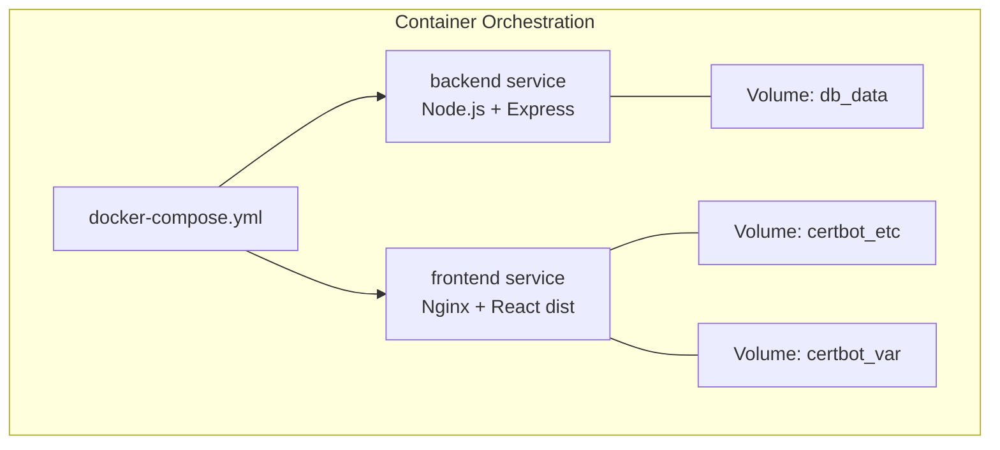
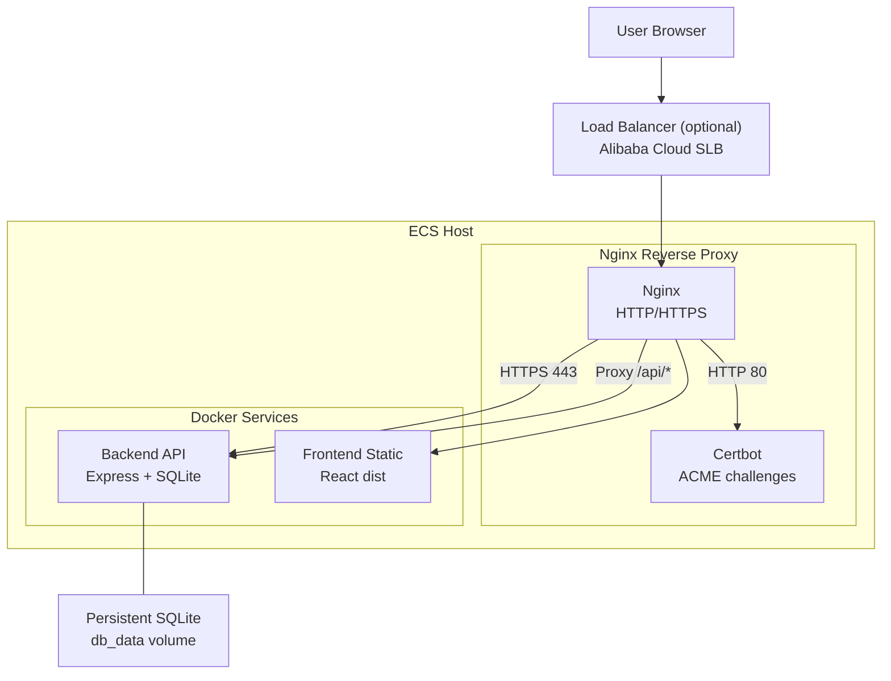
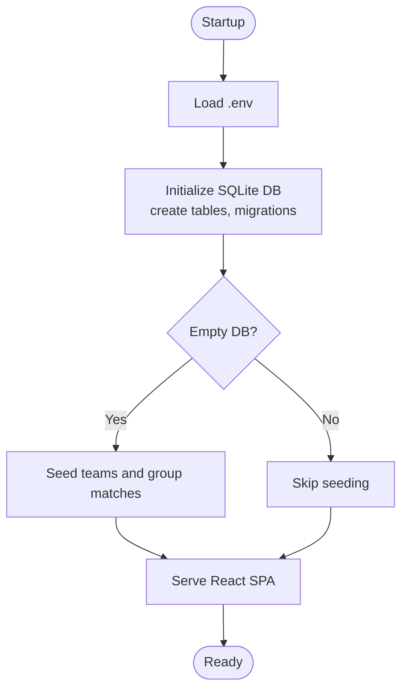
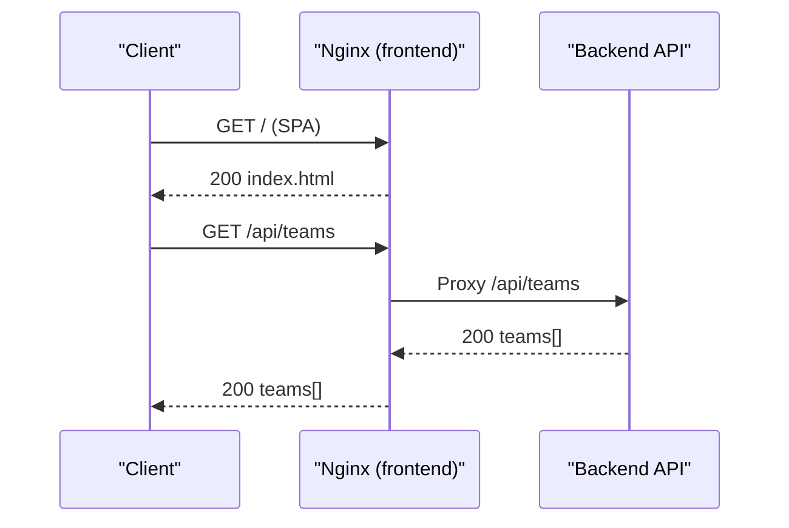
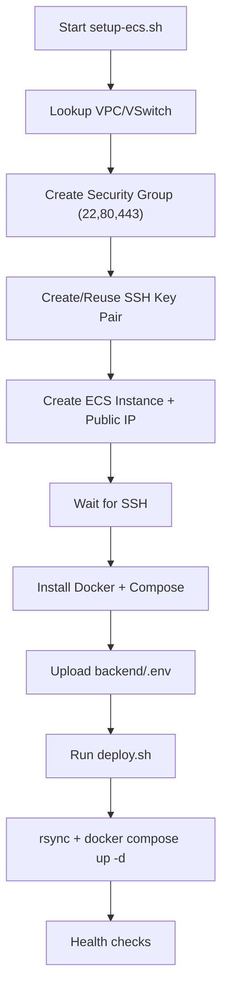
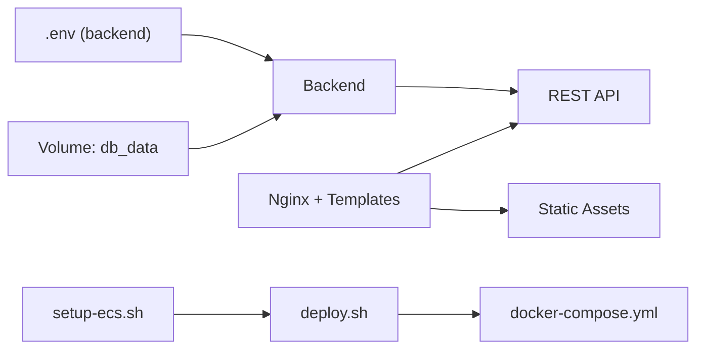

# Deployment & Infrastructure

<cite>
**Referenced Files in This Document**
- [docker-compose.yml](file://docker-compose.yml)
- [setup-ecs.sh](file://setup-ecs.sh)
- [deploy.sh](file://deploy.sh)
- [backend/Dockerfile](file://backend/Dockerfile)
- [frontend/Dockerfile](file://frontend/Dockerfile)
- [frontend/nginx.conf.template](file://frontend/nginx.conf.template)
- [frontend/nginx-ssl.conf.template](file://frontend/nginx-ssl.conf.template)
- [frontend/entrypoint.sh](file://frontend/entrypoint.sh)
- [backend/server.js](file://backend/server.js)
- [backend/database/db.js](file://backend/database/db.js)
- [backend/database/seed.js](file://backend/database/seed.js)
- [backend/package.json](file://backend/package.json)
- [frontend/package.json](file://frontend/package.json)
</cite>

## Table of Contents
1. [Introduction](#introduction)
2. [Project Structure](#project-structure)
3. [Core Components](#core-components)
4. [Architecture Overview](#architecture-overview)
5. [Detailed Component Analysis](#detailed-component-analysis)
6. [Dependency Analysis](#dependency-analysis)
7. [Performance Considerations](#performance-considerations)
8. [Troubleshooting Guide](#troubleshooting-guide)
9. [Conclusion](#conclusion)
10. [Appendices](#appendices)

## Introduction
This document describes the containerized deployment and infrastructure for WC26-Qwen-Qoder. It covers multi-container orchestration with Docker Compose, Nginx reverse proxy with SSL termination using Let’s Encrypt, ECS provisioning scripts for Alibaba Cloud, environment variable management and secrets handling, CI/CD integration points, monitoring and logging, health checks and alerting, scaling and load balancing, disaster recovery, and security/networking/compliance considerations for production.

## Project Structure
The deployment stack consists of:
- Backend service exposing a REST API and serving static assets in production
- Frontend service built with Nginx and a startup script to provision SSL
- Shared volumes for persistent SQLite data and Certbot storage
- ECS provisioning and deployment automation for Alibaba Cloud

**Diagram sources**
- [docker-compose.yml:1-34](file://docker-compose.yml#L1-L34)

**Section sources**
- [docker-compose.yml:1-34](file://docker-compose.yml#L1-L34)

## Core Components
- Backend service
  - Container image built from backend/Dockerfile
  - Exposes port 6173, serves API and static assets in production
  - Uses environment variables for DB path and runtime configuration
- Frontend service
  - Multi-stage build: build stage produces static assets, runtime stage runs Nginx
  - Template-driven Nginx configs for HTTP and HTTPS
  - Entrypoint script provisions SSL via Certbot and manages auto-renewal
- ECS provisioning and deployment
  - setup-ecs.sh automates Alibaba Cloud provisioning, Docker installation, and deploys the app
  - deploy.sh performs rsync and Docker Compose deployment on remote hosts

**Section sources**
- [backend/Dockerfile:1-8](file://backend/Dockerfile#L1-L8)
- [frontend/Dockerfile:1-18](file://frontend/Dockerfile#L1-L18)
- [frontend/nginx.conf.template:1-25](file://frontend/nginx.conf.template#L1-L25)
- [frontend/nginx-ssl.conf.template:1-45](file://frontend/nginx-ssl.conf.template#L1-L45)
- [frontend/entrypoint.sh:1-48](file://frontend/entrypoint.sh#L1-L48)
- [setup-ecs.sh:1-443](file://setup-ecs.sh#L1-L443)
- [deploy.sh:1-110](file://deploy.sh#L1-L110)

## Architecture Overview
The system uses Docker Compose to orchestrate two primary services behind a reverse proxy. The backend exposes a REST API and serves the React SPA in production. The frontend Nginx handles static delivery, API passthrough, and SSL termination with automatic certificate acquisition and renewal.

**Diagram sources**
- [frontend/nginx.conf.template:1-25](file://frontend/nginx.conf.template#L1-L25)
- [frontend/nginx-ssl.conf.template:1-45](file://frontend/nginx-ssl.conf.template#L1-L45)
- [frontend/entrypoint.sh:1-48](file://frontend/entrypoint.sh#L1-L48)
- [backend/server.js:18-22](file://backend/server.js#L18-L22)
- [docker-compose.yml:14-29](file://docker-compose.yml#L14-L29)

## Detailed Component Analysis

### Backend Service
- Purpose: REST API for teams, matches, predictions, analytics, and tournament simulations
- Runtime: Node.js 20 Alpine; listens on configurable port; serves React SPA in production
- Persistence: SQLite via node-sqlite3-wasm; DB path configured via environment variable
- Initialization: Seeds database on first run if empty; ensures knockout bracket stubs

**Diagram sources**
- [backend/server.js:644-680](file://backend/server.js#L644-L680)
- [backend/database/db.js:10-21](file://backend/database/db.js#L10-L21)
- [backend/database/seed.js:9-66](file://backend/database/seed.js#L9-L66)

**Section sources**
- [backend/server.js:18-22](file://backend/server.js#L18-L22)
- [backend/server.js:634-640](file://backend/server.js#L634-L640)
- [backend/database/db.js:5-6](file://backend/database/db.js#L5-L6)
- [backend/database/db.js:23-249](file://backend/database/db.js#L23-L249)
- [backend/database/seed.js:9-66](file://backend/database/seed.js#L9-L66)

### Frontend Service (Nginx + React)
- Build: Multi-stage Dockerfile; build stage compiles React app; runtime stage serves via Nginx
- Reverse proxy: Nginx proxies /api/* to backend service
- SSL: Automatic provisioning via Certbot with ACME HTTP-01 challenges; HTTPS config template supports TLSv1.2+ and HSTS-like redirect
- Auto-renewal: Cron job renews certificates and reloads Nginx

**Diagram sources**
- [frontend/nginx.conf.template:13-19](file://frontend/nginx.conf.template#L13-L19)
- [frontend/nginx-ssl.conf.template:33-39](file://frontend/nginx-ssl.conf.template#L33-L39)
- [backend/server.js:24-36](file://backend/server.js#L24-L36)

**Section sources**
- [frontend/Dockerfile:1-18](file://frontend/Dockerfile#L1-L18)
- [frontend/nginx.conf.template:1-25](file://frontend/nginx.conf.template#L1-L25)
- [frontend/nginx-ssl.conf.template:1-45](file://frontend/nginx-ssl.conf.template#L1-L45)
- [frontend/entrypoint.sh:11-38](file://frontend/entrypoint.sh#L11-L38)

### ECS Provisioning and Deployment
- setup-ecs.sh automates Alibaba Cloud provisioning:
  - Creates VPC/VSwitch if needed
  - Creates security group with ports 22, 80, 443
  - Creates ECS instance (Ubuntu 22.04), allocates public IP, waits for SSH
  - Installs Docker and Docker Compose
  - Uploads backend/.env and deploys via deploy.sh
- deploy.sh performs:
  - rsync excluding development artifacts and sensitive files
  - Ensures backend/.env exists remotely
  - Builds and starts services with Docker Compose
  - Health checks for backend API and HTTPS

**Diagram sources**
- [setup-ecs.sh:160-197](file://setup-ecs.sh#L160-L197)
- [setup-ecs.sh:200-230](file://setup-ecs.sh#L200-L230)
- [setup-ecs.sh:232-373](file://setup-ecs.sh#L232-L373)
- [setup-ecs.sh:375-392](file://setup-ecs.sh#L375-L392)
- [setup-ecs.sh:394-414](file://setup-ecs.sh#L394-L414)
- [setup-ecs.sh:415-425](file://setup-ecs.sh#L415-L425)
- [setup-ecs.sh:426-432](file://setup-ecs.sh#L426-L432)
- [deploy.sh:38-89](file://deploy.sh#L38-L89)

**Section sources**
- [setup-ecs.sh:13-20](file://setup-ecs.sh#L13-L20)
- [setup-ecs.sh:160-197](file://setup-ecs.sh#L160-L197)
- [setup-ecs.sh:232-373](file://setup-ecs.sh#L232-L373)
- [setup-ecs.sh:375-392](file://setup-ecs.sh#L375-L392)
- [setup-ecs.sh:394-414](file://setup-ecs.sh#L394-L414)
- [setup-ecs.sh:415-425](file://setup-ecs.sh#L415-L425)
- [setup-ecs.sh:426-432](file://setup-ecs.sh#L426-L432)
- [deploy.sh:38-89](file://deploy.sh#L38-L89)

### Environment Variables and Secrets Management
- Backend
  - DB_PATH controls SQLite file location inside the container
  - FRONTEND_URL enables CORS for the SPA origin
  - Additional keys (e.g., API credentials) are loaded from backend/.env
- Frontend
  - BACKEND_URL defines the backend proxy target
  - DOMAIN and CERT_EMAIL drive SSL provisioning and renewal
- ECS deployment
  - deploy.sh passes DOMAIN and CERT_EMAIL to the remote environment
  - setup-ecs.sh uploads backend/.env to the remote host prior to deployment

Best practices:
- Store secrets in backend/.env on the host and mount/copy to the remote ECS instance
- Exclude backend/.env from the rsync operation to prevent accidental overwrites
- Use CI/CD to inject secrets at build/deploy time when applicable

**Section sources**
- [docker-compose.yml:6-12](file://docker-compose.yml#L6-L12)
- [docker-compose.yml:20-24](file://docker-compose.yml#L20-L24)
- [backend/server.js:21](file://backend/server.js#L21)
- [backend/database/db.js:5](file://backend/database/db.js#L5)
- [frontend/entrypoint.sh:24-31](file://frontend/entrypoint.sh#L24-L31)
- [deploy.sh:55-65](file://deploy.sh#L55-L65)
- [setup-ecs.sh:415-425](file://setup-ecs.sh#L415-L425)

### CI/CD Pipeline Integration
- Current state: The repository includes deployment automation scripts suitable for manual or scripted CI/CD pipelines
- Recommended integration points:
  - Build stages: Build backend and frontend Docker images
  - Test stages: Run backend tests and frontend unit tests
  - Release stages: Push images to a registry and deploy via deploy.sh or ECS provisioning
  - Canary/blue-green: Use multiple ECS instances behind a load balancer for safer rollouts
- Automated testing:
  - Backend: npm test executes service tests
  - Frontend: vitest or similar testing framework configured in package.json

**Section sources**
- [backend/package.json:10](file://backend/package.json#L10)
- [frontend/package.json:11-14](file://frontend/package.json#L11-L14)

### Monitoring and Logging
- Health checks
  - Backend: curl against /api/teams endpoint after startup
  - HTTPS: curl against https://$DOMAIN for 200/301 responses
- Logs
  - Access logs: Nginx logs in /var/log/nginx (container filesystem)
  - Application logs: docker compose logs backend/frontend
- Alerting
  - Integrate with monitoring systems (Prometheus/Grafana, Datadog, New Relic) to track:
    - Backend uptime and response metrics
    - Nginx request rates and error codes
    - Disk usage for db_data volume
    - Certificate expiry reminders

**Section sources**
- [deploy.sh:81-96](file://deploy.sh#L81-L96)

### Scaling and Load Balancing
- Horizontal scaling
  - Scale backend replicas behind a load balancer (e.g., Alibaba Cloud SLB)
  - Use sticky sessions if needed; otherwise rely on stateless backend behavior
- Stateless design
  - Backend is stateless except for the SQLite file; scale horizontally with shared storage or a managed database
- CDN and caching
  - Nginx serves static assets efficiently; consider CDN for global distribution

[No sources needed since this section provides general guidance]

### Disaster Recovery
- Backup strategy
  - Regularly snapshot the db_data volume or export the SQLite database
  - Back up Certbot directories for certificate continuity
- Recovery procedure
  - Restore volume snapshots to a new ECS instance
  - Re-run deployment to rebuild containers and restore services

[No sources needed since this section provides general guidance]

### Security Configurations, Network Policies, and Compliance
- Network exposure
  - ECS security group opens ports 22, 80, 443; restrict SSH access to trusted IPs
  - Internal backend port 6173 is not exposed to the host; only frontend Nginx communicates externally
- SSL/TLS
  - HTTPS enforced via Nginx; TLS 1.2+ configured; automatic renewal via cron
- Secrets handling
  - Keep backend/.env out of version control; manage via CI/CD secret stores
- Compliance
  - Ensure data retention and deletion policies align with regional regulations
  - Audit access logs and monitor for anomalies

**Section sources**
- [setup-ecs.sh:182-193](file://setup-ecs.sh#L182-L193)
- [frontend/nginx-ssl.conf.template:27-31](file://frontend/nginx-ssl.conf.template#L27-L31)
- [frontend/entrypoint.sh:40-44](file://frontend/entrypoint.sh#L40-L44)

## Dependency Analysis
- Backend depends on:
  - SQLite database initialized at runtime
  - Environment variables for DB path and CORS origin
- Frontend depends on:
  - Nginx templates and Certbot for SSL
  - Backend service for API proxying
- ECS scripts depend on:
  - Alibaba Cloud CLI for provisioning
  - SSH access and rsync for deployment

**Diagram sources**
- [backend/database/db.js:5](file://backend/database/db.js#L5)
- [backend/server.js:21](file://backend/server.js#L21)
- [frontend/nginx.conf.template:13-19](file://frontend/nginx.conf.template#L13-L19)
- [frontend/nginx-ssl.conf.template:33-39](file://frontend/nginx-ssl.conf.template#L33-L39)
- [setup-ecs.sh:426-432](file://setup-ecs.sh#L426-L432)
- [deploy.sh:67-79](file://deploy.sh#L67-L79)
- [docker-compose.yml:1-34](file://docker-compose.yml#L1-L34)

**Section sources**
- [backend/database/db.js:5-6](file://backend/database/db.js#L5-L6)
- [backend/server.js:21](file://backend/server.js#L21)
- [frontend/nginx.conf.template:13-19](file://frontend/nginx.conf.template#L13-L19)
- [frontend/nginx-ssl.conf.template:33-39](file://frontend/nginx-ssl.conf.template#L33-L39)
- [setup-ecs.sh:426-432](file://setup-ecs.sh#L426-L432)
- [deploy.sh:67-79](file://deploy.sh#L67-L79)
- [docker-compose.yml:1-34](file://docker-compose.yml#L1-L34)

## Performance Considerations
- Database
  - SQLite is lightweight but not ideal for high concurrency; consider migrating to a managed database for scale
  - Tune PRAGMA settings and connection pooling appropriately
- API
  - Enable gzip/HTTP2 in Nginx for improved transfer speeds
  - Use caching headers for static assets
- Container sizing
  - Adjust ECS instance type based on traffic; start with burstable instances for cost efficiency
- CDN
  - Offload static assets to a CDN to reduce origin load

[No sources needed since this section provides general guidance]

## Troubleshooting Guide
- Backend not responding
  - Check docker compose logs backend
  - Verify environment variables and DB path
- HTTPS not active
  - Confirm DOMAIN and CERT_EMAIL are set
  - Inspect Certbot logs and cron entries
- SSL certificate errors
  - Renew certificates manually via certbot renew
  - Ensure DNS records resolve to the ECS public IP
- ECS connectivity
  - Verify security group rules and SSH key permissions
  - Confirm the instance is running and reachable

**Section sources**
- [deploy.sh:81-96](file://deploy.sh#L81-L96)
- [frontend/entrypoint.sh:24-31](file://frontend/entrypoint.sh#L24-L31)
- [frontend/entrypoint.sh:40-44](file://frontend/entrypoint.sh#L40-L44)
- [setup-ecs.sh:375-392](file://setup-ecs.sh#L375-L392)

## Conclusion
The WC26-Qwen-Qoder deployment leverages Docker Compose for local development and Alibaba Cloud ECS for production. Nginx terminates SSL and proxies API requests to the backend, while SQLite persists state. The provided scripts automate provisioning, deployment, and health verification. For production hardening, consider moving to a managed database, adding a load balancer, and integrating robust monitoring and alerting.

## Appendices
- Ports and services
  - Backend: TCP 6173 (internal)
  - Frontend: TCP 80/443 (external)
- Volumes
  - db_data: SQLite database persistence
  - certbot_etc and certbot_var: SSL certificate storage and ACME challenges

**Section sources**
- [docker-compose.yml:30-34](file://docker-compose.yml#L30-L34)
- [frontend/nginx.conf.template:8-11](file://frontend/nginx.conf.template#L8-L11)
- [frontend/nginx-ssl.conf.template:6-9](file://frontend/nginx-ssl.conf.template#L6-L9)