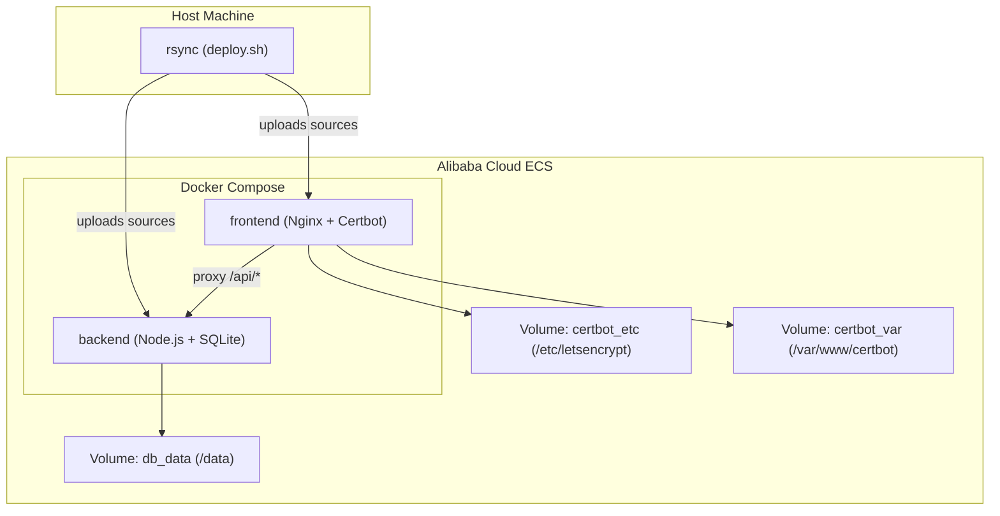
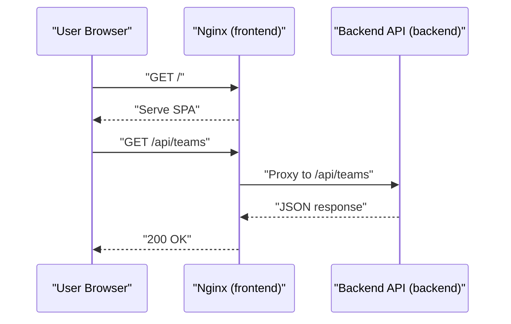
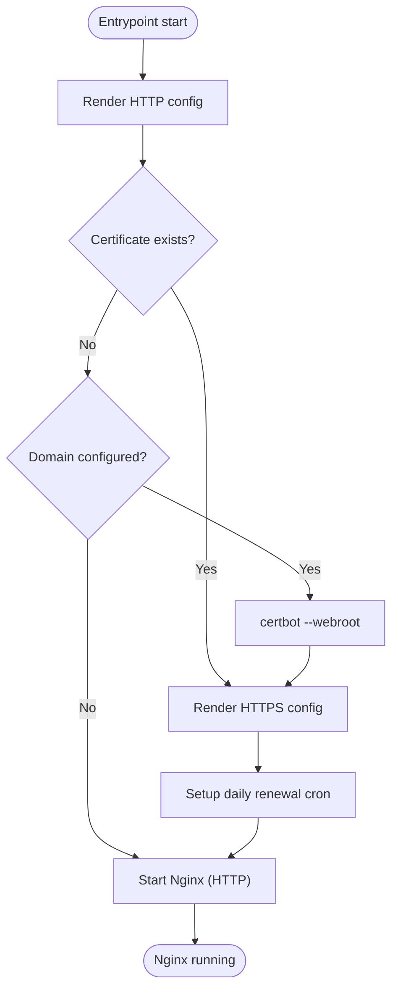
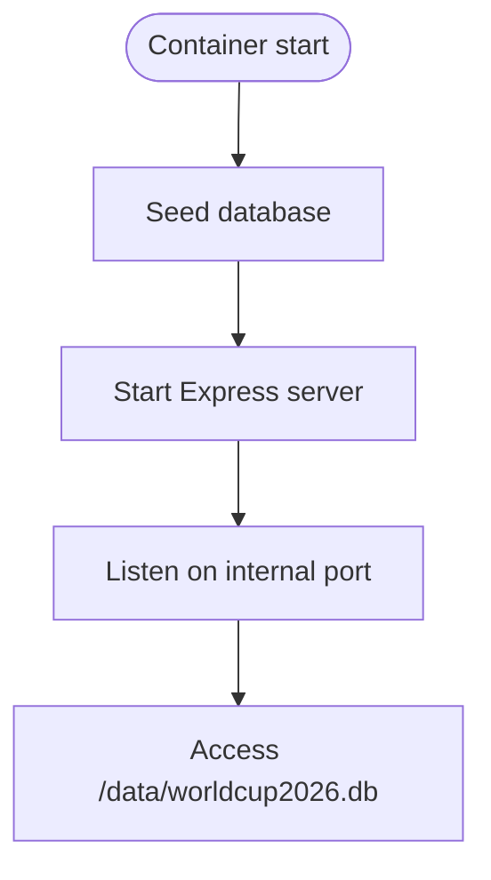
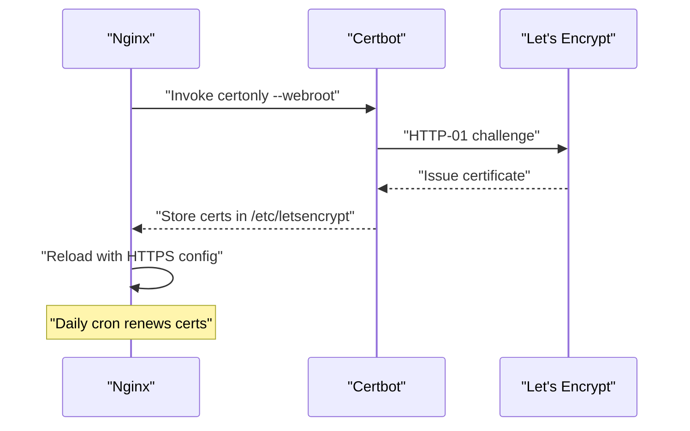
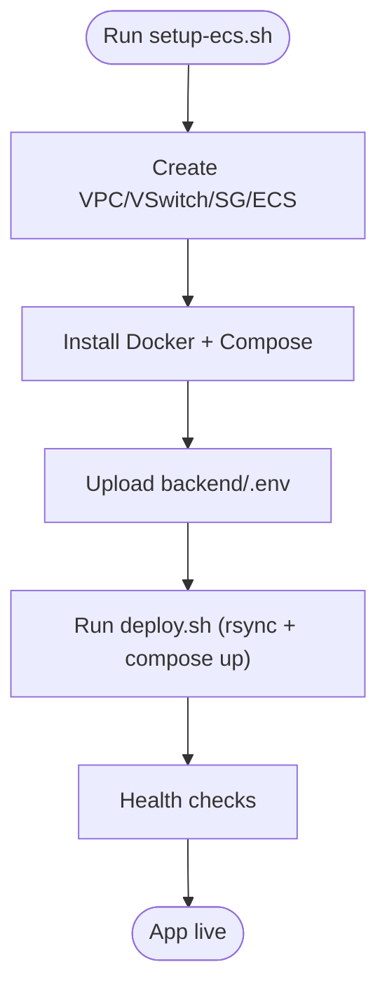
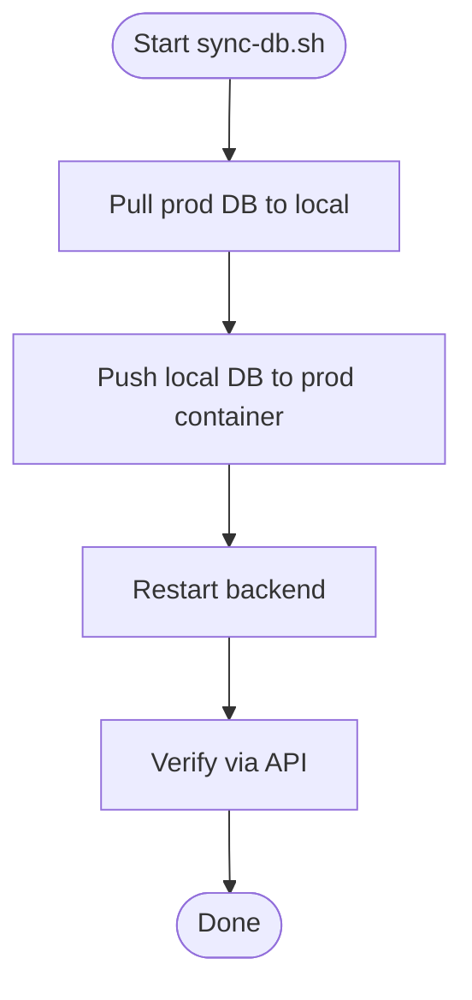
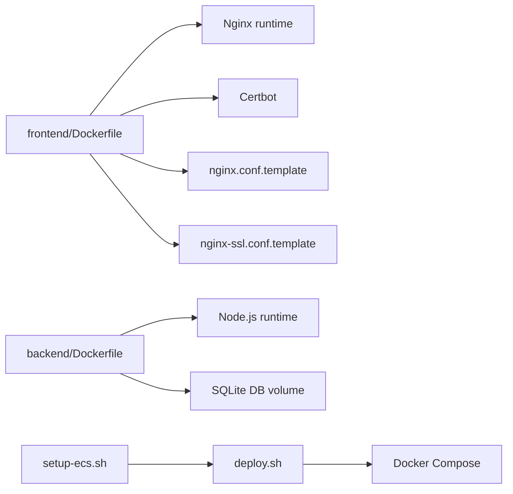

# Deployment Architecture

<cite>
**Referenced Files in This Document**
- [docker-compose.yml](file://docker-compose.yml)
- [deploy.sh](file://deploy.sh)
- [setup-ecs.sh](file://setup-ecs.sh)
- [sync-db.sh](file://sync-db.sh)
- [backend/Dockerfile](file://backend/Dockerfile)
- [frontend/Dockerfile](file://frontend/Dockerfile)
- [frontend/entrypoint.sh](file://frontend/entrypoint.sh)
- [frontend/nginx.conf.template](file://frontend/nginx.conf.template)
- [frontend/nginx-ssl.conf.template](file://frontend/nginx-ssl.conf.template)
- [backend/package.json](file://backend/package.json)
- [frontend/package.json](file://frontend/package.json)
</cite>

## Table of Contents
1. [Introduction](#introduction)
2. [Project Structure](#project-structure)
3. [Core Components](#core-components)
4. [Architecture Overview](#architecture-overview)
5. [Detailed Component Analysis](#detailed-component-analysis)
6. [Dependency Analysis](#dependency-analysis)
7. [Performance Considerations](#performance-considerations)
8. [Troubleshooting Guide](#troubleshooting-guide)
9. [Conclusion](#conclusion)
10. [Appendices](#appendices)

## Introduction
This document describes the deployment architecture for the containerized World Cup prediction application. It covers Docker Compose orchestration for local and ECS-based production deployments, multi-stage Docker builds for frontend and backend, SSL/TLS provisioning and renewal via Let's Encrypt, database backup and restore procedures, CI/CD automation, monitoring and health checks, disaster recovery and rollback strategies, and security hardening practices.

## Project Structure
The deployment stack consists of:
- Frontend service built with a multi-stage Dockerfile and served by Nginx
- Backend service exposing an API and SQLite database
- Shared volumes for persistent database storage
- Nginx-managed reverse proxy with dynamic configuration templating and automatic HTTPS via Certbot/Let's Encrypt
- Automation scripts for ECS provisioning, deployment, and database synchronization

**Diagram sources**
- [docker-compose.yml:1-34](file://docker-compose.yml#L1-L34)
- [frontend/Dockerfile:1-18](file://frontend/Dockerfile#L1-L18)
- [backend/Dockerfile:1-8](file://backend/Dockerfile#L1-L8)

**Section sources**
- [docker-compose.yml:1-34](file://docker-compose.yml#L1-L34)

## Core Components
- Frontend service
  - Multi-stage build: Node.js Alpine for building, Nginx Alpine for runtime
  - Entrypoint script generates Nginx configs, obtains/renews certificates, and starts Nginx
  - Template-based configuration supports HTTP-only and HTTPS redirection
- Backend service
  - Minimal Node.js Alpine image with production dependencies only
  - Exposes API on a non-standard port and persists SQLite database to a named volume
- Nginx and Certbot integration
  - Dynamic config rendering via environment substitution
  - Automatic certificate acquisition and renewal with cron
- ECS automation
  - Provisioning, Docker installation, secure key management, and deployment orchestration
- Database sync utility
  - Safe backup, overwrite, and verification workflow for production SQLite

**Section sources**
- [frontend/Dockerfile:1-18](file://frontend/Dockerfile#L1-L18)
- [backend/Dockerfile:1-8](file://backend/Dockerfile#L1-L8)
- [frontend/entrypoint.sh:1-48](file://frontend/entrypoint.sh#L1-L48)
- [frontend/nginx.conf.template:1-25](file://frontend/nginx.conf.template#L1-L25)
- [frontend/nginx-ssl.conf.template:1-45](file://frontend/nginx-ssl.conf.template#L1-L45)
- [backend/package.json:1-32](file://backend/package.json#L1-L32)
- [frontend/package.json:1-72](file://frontend/package.json#L1-L72)

## Architecture Overview
The system runs as two primary containers orchestrated by Docker Compose:
- Frontend container (Nginx) handles static assets, reverse proxy for API requests, and TLS termination
- Backend container (Node.js) serves the API and manages the SQLite database

**Diagram sources**
- [docker-compose.yml:14-28](file://docker-compose.yml#L14-L28)
- [frontend/nginx.conf.template:13-19](file://frontend/nginx.conf.template#L13-L19)
- [backend/package.json:6-12](file://backend/package.json#L6-L12)

## Detailed Component Analysis

### Frontend Container (Nginx + Certbot)
- Build stages
  - Build stage: Node.js Alpine with npm ci and build
  - Runtime stage: Nginx Alpine with Certbot and bash
- Entrypoint responsibilities
  - Render HTTP-only config by default
  - Switch to HTTPS config when certificate exists
  - Obtain certificate via HTTP webroot challenge if missing
  - Schedule daily renewal via cron
  - Start Nginx in foreground
- Configuration templates
  - HTTP template defines proxying to backend and ACME challenge path
  - HTTPS template enables TLS, redirects HTTP to HTTPS, and applies security headers

**Diagram sources**
- [frontend/entrypoint.sh:1-48](file://frontend/entrypoint.sh#L1-L48)
- [frontend/nginx.conf.template:1-25](file://frontend/nginx.conf.template#L1-L25)
- [frontend/nginx-ssl.conf.template:1-45](file://frontend/nginx-ssl.conf.template#L1-L45)

**Section sources**
- [frontend/Dockerfile:1-18](file://frontend/Dockerfile#L1-L18)
- [frontend/entrypoint.sh:1-48](file://frontend/entrypoint.sh#L1-L48)
- [frontend/nginx.conf.template:1-25](file://frontend/nginx.conf.template#L1-L25)
- [frontend/nginx-ssl.conf.template:1-45](file://frontend/nginx-ssl.conf.template#L1-L45)

### Backend Container (Node.js + SQLite)
- Image: Node.js 20 Alpine
- Startup: runs seeding script then starts server
- Persistence: writes SQLite database to a named volume mapped to a data path
- Port exposure: internal port used by Nginx proxy

**Diagram sources**
- [backend/Dockerfile:1-8](file://backend/Dockerfile#L1-L8)
- [backend/package.json:6-12](file://backend/package.json#L6-L12)

**Section sources**
- [backend/Dockerfile:1-8](file://backend/Dockerfile#L1-L8)
- [backend/package.json:6-12](file://backend/package.json#L6-L12)

### SSL/TLS and Certificate Management (Let's Encrypt)
- Certificate acquisition
  - Webroot challenge using Nginx serving the ACME path
  - Certificates stored in a named volume for persistence
- Renewal process
  - Daily cron job renews certificates and reloads Nginx
- Configuration
  - Separate HTTP and HTTPS Nginx templates
  - Environment-driven domain and email for certificate issuance

**Diagram sources**
- [frontend/entrypoint.sh:20-38](file://frontend/entrypoint.sh#L20-L38)
- [frontend/nginx-ssl.conf.template:24-25](file://frontend/nginx-ssl.conf.template#L24-L25)

**Section sources**
- [frontend/entrypoint.sh:11-44](file://frontend/entrypoint.sh#L11-L44)
- [frontend/nginx.conf.template:8-11](file://frontend/nginx.conf.template#L8-L11)
- [frontend/nginx-ssl.conf.template:1-45](file://frontend/nginx-ssl.conf.template#L1-L45)

### ECS Provisioning and Automated Deployment
- Provisioning
  - Creates VPC, VSwitch, security group (ports 22, 80, 443), and ECS instance
  - Installs Docker and Docker Compose
  - Uploads backend environment file
- Deployment
  - Synchronizes source code excluding unnecessary artifacts
  - Builds and starts containers with Docker Compose
  - Performs health checks against backend and HTTPS endpoint
  - Provides SSH access and log viewing commands

**Diagram sources**
- [setup-ecs.sh:160-431](file://setup-ecs.sh#L160-L431)
- [deploy.sh:38-96](file://deploy.sh#L38-L96)

**Section sources**
- [setup-ecs.sh:1-443](file://setup-ecs.sh#L1-L443)
- [deploy.sh:1-110](file://deploy.sh#L1-L110)

### Database Backup and Restore (sync-db.sh)
- Workflow
  - Back up production database to local temporary file
  - Push local database file to remote container
  - Restart backend service
  - Verify by querying a subset of data
- Safety
  - Preserves original production database as a backup
  - Allows restoration by pointing to the backed-up file

**Diagram sources**
- [sync-db.sh:28-49](file://sync-db.sh#L28-L49)

**Section sources**
- [sync-db.sh:1-56](file://sync-db.sh#L1-L56)

### CI/CD Pipeline Integration
- Current state
  - No explicit CI/CD YAML is present in the repository snapshot
- Recommended integration points
  - Trigger builds on commit to main branch
  - Build and push images to a registry
  - Execute ECS deployment script with environment variables
  - Run health checks and notify on failure

[No sources needed since this section provides general guidance]

### Monitoring and Logging
- Health checks
  - Backend: probe API endpoint after startup
  - Frontend: probe HTTPS endpoint when domain is configured
- Logging
  - Access logs via Nginx configuration templates
  - Application logs via Docker Compose logs on ECS

**Section sources**
- [deploy.sh:81-96](file://deploy.sh#L81-L96)

### Disaster Recovery and Rollback
- Database rollback
  - Restore from the preserved backup file generated during sync
- Application rollback
  - Re-run deployment with previous image tag or source revision
- Blue-green deployment (conceptual)
  - Maintain two identical environments behind a load balancer
  - Switch traffic to the new environment after validation

[No sources needed since this section provides general guidance]

### Security Hardening
- Network isolation
  - Internal-only backend port; Nginx proxies all external traffic
  - Security group opens only necessary ports (22, 80, 443)
- Secrets management
  - Environment file uploaded securely and excluded from rsync
- Vulnerability scanning
  - Use Docker Scout or Trivy to scan images
  - Keep base images updated (Alpine and Node LTS)

**Section sources**
- [docker-compose.yml:5-12](file://docker-compose.yml#L5-L12)
- [setup-ecs.sh:182-193](file://setup-ecs.sh#L182-L193)

## Dependency Analysis
- Frontend depends on backend for API responses
- Frontend depends on Certbot for TLS certificates
- Backend depends on SQLite database volume for persistence
- ECS automation depends on Alibaba Cloud CLI and SSH keys

**Diagram sources**
- [frontend/Dockerfile:1-18](file://frontend/Dockerfile#L1-L18)
- [backend/Dockerfile:1-8](file://backend/Dockerfile#L1-L8)
- [frontend/nginx.conf.template:1-25](file://frontend/nginx.conf.template#L1-L25)
- [frontend/nginx-ssl.conf.template:1-45](file://frontend/nginx-ssl.conf.template#L1-L45)
- [deploy.sh:68-78](file://deploy.sh#L68-L78)
- [setup-ecs.sh:401-413](file://setup-ecs.sh#L401-L413)

**Section sources**
- [docker-compose.yml:1-34](file://docker-compose.yml#L1-L34)
- [frontend/Dockerfile:1-18](file://frontend/Dockerfile#L1-L18)
- [backend/Dockerfile:1-8](file://backend/Dockerfile#L1-L8)

## Performance Considerations
- Image size and attack surface
  - Alpine Linux minimizes footprint and vulnerabilities
- Build optimization
  - Multi-stage build reduces final image size
  - Production-only dependencies for backend
- Resource planning
  - ECS instance type selection balances cost and performance
  - Disk sizing accommodates SQLite growth and logs

[No sources needed since this section provides general guidance]

## Troubleshooting Guide
- Backend not responding
  - Check backend logs via Docker Compose
  - Verify API endpoint health after deployment
- HTTPS not active
  - Confirm domain variable and certificate existence
  - Review Nginx reload after certificate acquisition
- Database corruption or inconsistency
  - Use the sync utility to restore from backup
  - Validate counts via API after restart

**Section sources**
- [deploy.sh:84-96](file://deploy.sh#L84-L96)
- [frontend/entrypoint.sh:33-38](file://frontend/entrypoint.sh#L33-L38)
- [sync-db.sh:47-49](file://sync-db.sh#L47-L49)

## Conclusion
The deployment architecture leverages Docker Compose for simplicity and scalability, with Nginx and Certbot managing TLS and reverse proxying. ECS automation streamlines provisioning and deployment, while the sync utility ensures safe database updates. The design emphasizes security, observability, and operational safety through backups and health checks.

## Appendices

### Appendix A: Docker Compose Orchestration
- Services
  - backend: builds from backend directory, sets environment, mounts database volume
  - frontend: builds from frontend directory, exposes ports 80/443, mounts certificate volumes, depends on backend
- Volumes
  - db_data: persistent SQLite storage
  - certbot_etc and certbot_var: certificate and webroot persistence

**Section sources**
- [docker-compose.yml:1-34](file://docker-compose.yml#L1-L34)

### Appendix B: Multi-stage Docker Builds
- Frontend
  - Build stage: Node.js Alpine with npm ci and build
  - Runtime stage: Nginx Alpine with Certbot and bash
- Backend
  - Node.js 20 Alpine with production dependencies only

**Section sources**
- [frontend/Dockerfile:1-18](file://frontend/Dockerfile#L1-L18)
- [backend/Dockerfile:1-8](file://backend/Dockerfile#L1-L8)

### Appendix C: SSL Certificate Management
- Templates
  - HTTP-only and HTTPS configurations
- Entrypoint logic
  - Conditional rendering, certificate acquisition, cron-based renewal

**Section sources**
- [frontend/nginx.conf.template:1-25](file://frontend/nginx.conf.template#L1-L25)
- [frontend/nginx-ssl.conf.template:1-45](file://frontend/nginx-ssl.conf.template#L1-L45)
- [frontend/entrypoint.sh:11-44](file://frontend/entrypoint.sh#L11-L44)

### Appendix D: ECS Provisioning Checklist
- Prerequisites
  - Alibaba Cloud CLI installed and configured
  - SSH key prepared
- Steps
  - Provision VPC, VSwitch, security group, ECS instance
  - Install Docker and upload backend environment
  - Run deployment script and verify health

**Section sources**
- [setup-ecs.sh:8-20](file://setup-ecs.sh#L8-L20)
- [setup-ecs.sh:160-431](file://setup-ecs.sh#L160-L431)