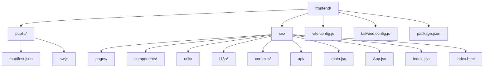
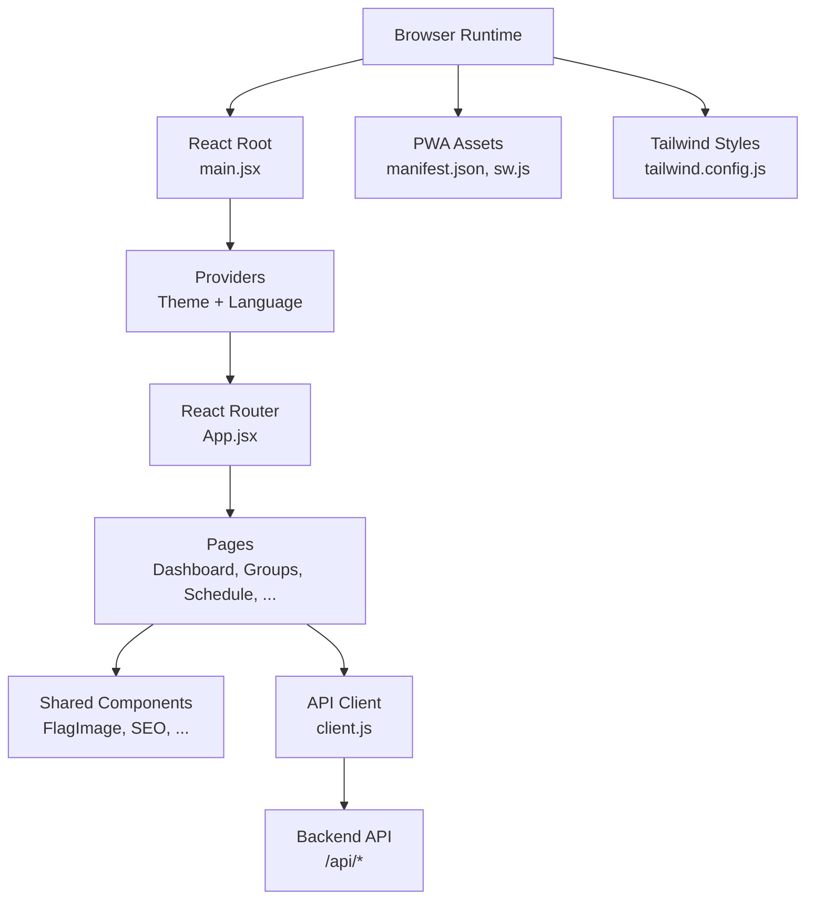
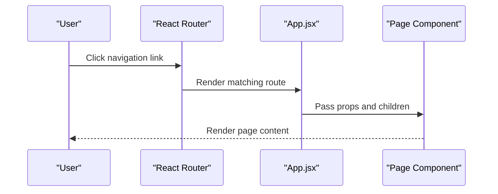
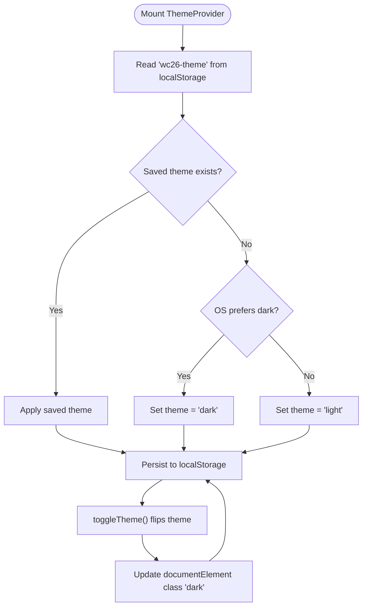
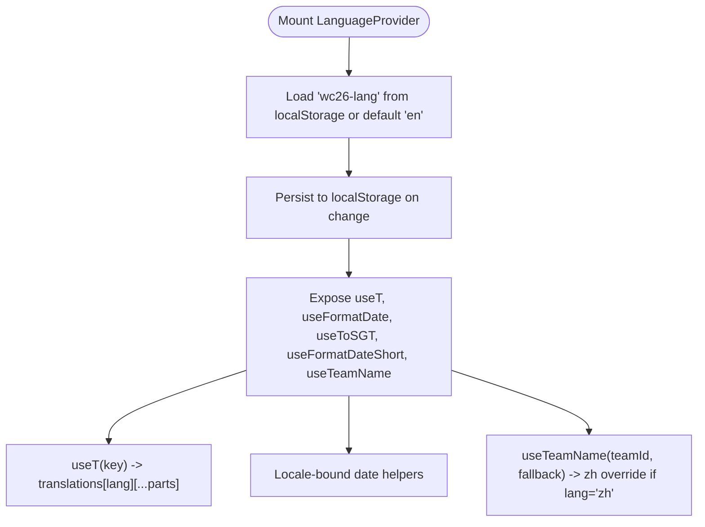
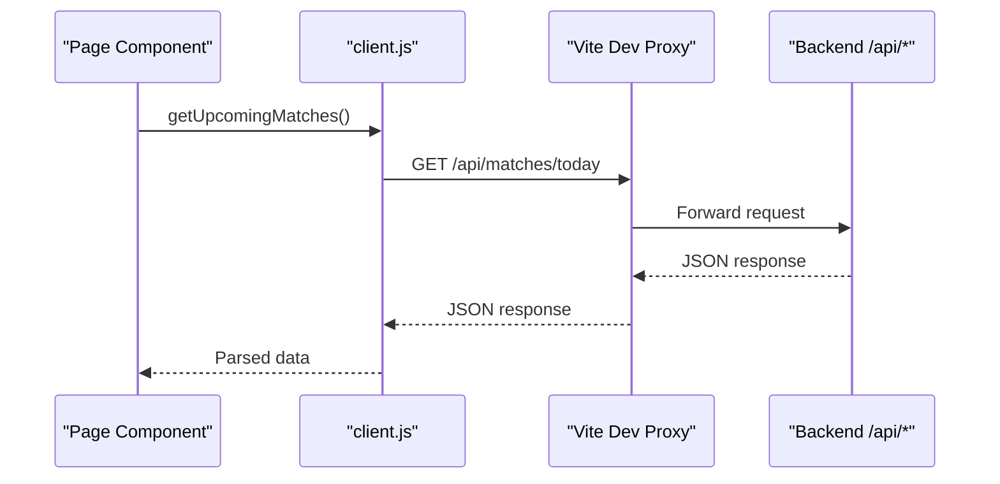
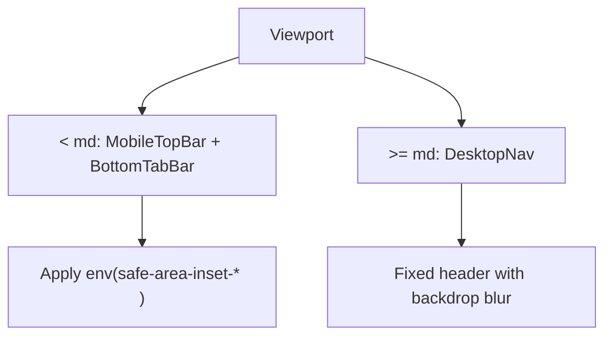
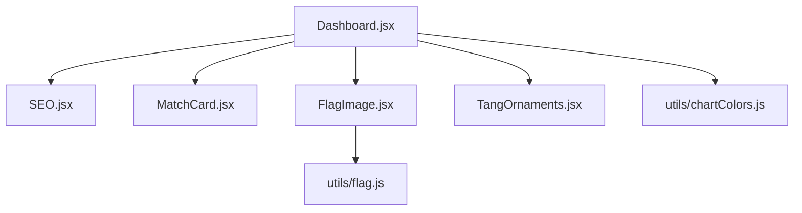
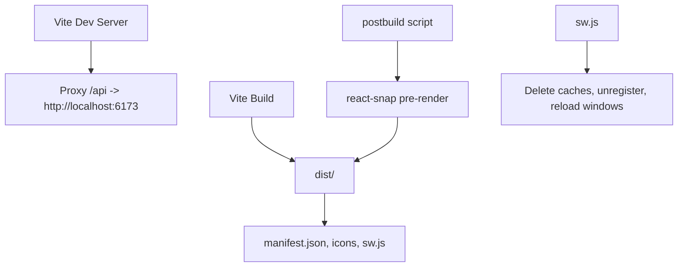
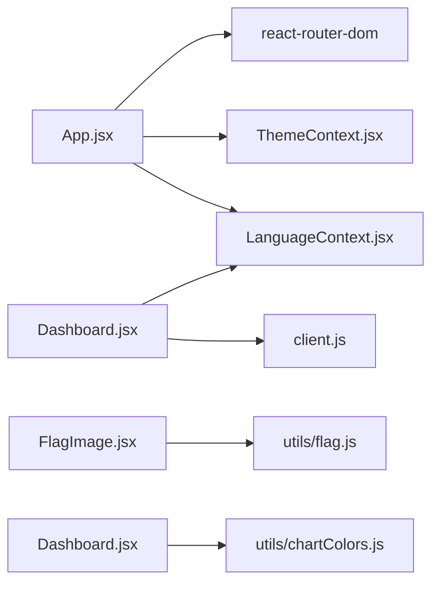

# Frontend Architecture

<cite>
**Referenced Files in This Document**
- [main.jsx](file://frontend/src/main.jsx)
- [index.html](file://frontend/index.html)
- [App.jsx](file://frontend/src/App.jsx)
- [ThemeContext.jsx](file://frontend/src/contexts/ThemeContext.jsx)
- [LanguageContext.jsx](file://frontend/src/contexts/LanguageContext.jsx)
- [translations.js](file://frontend/src/i18n/translations.js)
- [client.js](file://frontend/src/api/client.js)
- [vite.config.js](file://frontend/vite.config.js)
- [tailwind.config.js](file://frontend/tailwind.config.js)
- [package.json](file://frontend/package.json)
- [sw.js](file://frontend/public/sw.js)
- [manifest.json](file://frontend/public/manifest.json)
- [Dashboard.jsx](file://frontend/src/pages/Dashboard.jsx)
- [FlagImage.jsx](file://frontend/src/components/FlagImage.jsx)
- [chartColors.js](file://frontend/src/utils/chartColors.js)
</cite>

## Table of Contents
1. [Introduction](#introduction)
2. [Project Structure](#project-structure)
3. [Core Components](#core-components)
4. [Architecture Overview](#architecture-overview)
5. [Detailed Component Analysis](#detailed-component-analysis)
6. [Dependency Analysis](#dependency-analysis)
7. [Performance Considerations](#performance-considerations)
8. [Troubleshooting Guide](#troubleshooting-guide)
9. [Conclusion](#conclusion)
10. [Appendices](#appendices)

## Introduction
This document describes the frontend architecture of the WC26-Qwen-Qoder React application. It covers the component hierarchy, page structure, and routing system using React Router; state management patterns via context providers for theme and language; styling architecture with Tailwind CSS and custom themes; internationalization supporting English and Chinese; the build pipeline using Vite; asset and service worker management; responsive design patterns; accessibility considerations; performance optimization techniques; component reusability and prop drilling solutions; and state synchronization with backend APIs.

## Project Structure
The frontend is organized into modular directories:
- Public assets and PWA manifests under frontend/public
- Application bootstrap and HTML template under frontend/src
- Pages under frontend/src/pages
- Shared components under frontend/src/components
- Utilities under frontend/src/utils
- Internationalization under frontend/src/i18n
- Context providers under frontend/src/contexts
- API client under frontend/src/api



**Diagram sources**
- [main.jsx:1-22](file://frontend/src/main.jsx#L1-L22)
- [App.jsx:1-284](file://frontend/src/App.jsx#L1-L284)
- [vite.config.js:1-26](file://frontend/vite.config.js#L1-L26)
- [tailwind.config.js:1-161](file://frontend/tailwind.config.js#L1-L161)
- [package.json:1-72](file://frontend/package.json#L1-L72)

**Section sources**
- [main.jsx:1-22](file://frontend/src/main.jsx#L1-L22)
- [index.html:1-34](file://frontend/index.html#L1-L34)
- [vite.config.js:1-26](file://frontend/vite.config.js#L1-L26)
- [tailwind.config.js:1-161](file://frontend/tailwind.config.js#L1-L161)
- [package.json:1-72](file://frontend/package.json#L1-L72)

## Core Components
- Application bootstrap initializes React, Helmet provider, and hydration strategy.
- App wraps the routing tree with ThemeProvider and LanguageProvider, defines navigation, and renders pages.
- ThemeContext manages theme state and persistence.
- LanguageContext provides translation functions and locale-aware date/time helpers.
- API client encapsulates backend endpoints and request configuration.
- Tailwind config defines a custom Chinese landscape painting palette and gradients.

Key implementation references:
- Bootstrap and hydration: [main.jsx:1-22](file://frontend/src/main.jsx#L1-L22)
- Routing and layout: [App.jsx:1-284](file://frontend/src/App.jsx#L1-L284)
- Theme provider: [ThemeContext.jsx:1-27](file://frontend/src/contexts/ThemeContext.jsx#L1-L27)
- Language provider and hooks: [LanguageContext.jsx:1-69](file://frontend/src/contexts/LanguageContext.jsx#L1-L69)
- Translations registry: [translations.js:1-630](file://frontend/src/i18n/translations.js#L1-L630)
- API client: [client.js:1-50](file://frontend/src/api/client.js#L1-L50)
- Tailwind customization: [tailwind.config.js:1-161](file://frontend/tailwind.config.js#L1-L161)

**Section sources**
- [main.jsx:1-22](file://frontend/src/main.jsx#L1-L22)
- [App.jsx:1-284](file://frontend/src/App.jsx#L1-L284)
- [ThemeContext.jsx:1-27](file://frontend/src/contexts/ThemeContext.jsx#L1-L27)
- [LanguageContext.jsx:1-69](file://frontend/src/contexts/LanguageContext.jsx#L1-L69)
- [translations.js:1-630](file://frontend/src/i18n/translations.js#L1-L630)
- [client.js:1-50](file://frontend/src/api/client.js#L1-L50)
- [tailwind.config.js:1-161](file://frontend/tailwind.config.js#L1-L161)

## Architecture Overview
The frontend follows a layered architecture:
- Presentation layer: React components and pages
- Routing layer: React Router with nested routes and navigation
- State layer: Context providers for theme and language
- Services layer: Axios-based API client
- Styling layer: Tailwind CSS with custom theme tokens and gradients
- Build and deployment: Vite with pre-rendering and PWA assets



**Diagram sources**
- [main.jsx:1-22](file://frontend/src/main.jsx#L1-L22)
- [App.jsx:1-284](file://frontend/src/App.jsx#L1-L284)
- [client.js:1-50](file://frontend/src/api/client.js#L1-L50)
- [manifest.json:1-50](file://frontend/public/manifest.json#L1-L50)
- [sw.js:1-32](file://frontend/public/sw.js#L1-L32)
- [tailwind.config.js:1-161](file://frontend/tailwind.config.js#L1-L161)

## Detailed Component Analysis

### Routing and Navigation
- BrowserRouter wraps the app and defines routes for dashboard, schedule, groups, tournament, match/team detail, and legacy redirects.
- Navigation bar adapts to desktop and mobile with active state styling and localized labels.
- Navigation keys are centralized and localized via the language context.



**Diagram sources**
- [App.jsx:262-275](file://frontend/src/App.jsx#L262-L275)

**Section sources**
- [App.jsx:1-284](file://frontend/src/App.jsx#L1-L284)

### Theme Management
- ThemeProvider reads persisted preference or OS preference, toggles class on document element, and persists changes.
- Theme toggle button switches between light and dark modes.



**Diagram sources**
- [ThemeContext.jsx:5-15](file://frontend/src/contexts/ThemeContext.jsx#L5-L15)

**Section sources**
- [ThemeContext.jsx:1-27](file://frontend/src/contexts/ThemeContext.jsx#L1-L27)
- [index.html:9-17](file://frontend/index.html#L9-L17)

### Internationalization and Localization
- LanguageProvider stores language selection in localStorage and exposes toggle.
- useT resolves dot-notation keys against translations registry.
- Locale-aware helpers for date formatting and team name lookup.
- Translations include English and Chinese with team name overrides.



**Diagram sources**
- [LanguageContext.jsx:7-69](file://frontend/src/contexts/LanguageContext.jsx#L7-L69)
- [translations.js:1-630](file://frontend/src/i18n/translations.js#L1-L630)

**Section sources**
- [LanguageContext.jsx:1-69](file://frontend/src/contexts/LanguageContext.jsx#L1-L69)
- [translations.js:1-630](file://frontend/src/i18n/translations.js#L1-L630)

### API Client and Backend Synchronization
- API client constructs base URL from environment variable or local proxy, sets timeouts, and exports typed endpoints.
- Endpoints cover teams, matches, predictions, groups, tournament, analytics, suspensions, lineups, H2H, and agent sessions.
- Some endpoints accept language and refresh flags.



**Diagram sources**
- [client.js:1-50](file://frontend/src/api/client.js#L1-L50)
- [vite.config.js:11-19](file://frontend/vite.config.js#L11-L19)

**Section sources**
- [client.js:1-50](file://frontend/src/api/client.js#L1-L50)
- [vite.config.js:1-26](file://frontend/vite.config.js#L1-L26)

### Styling Architecture and Custom Themes
- Tailwind is configured with a custom Chinese landscape painting palette (cn, apple, wc, fifa) and gradients.
- Typography scales, border radii, shadows, and backdrop filters are extended for a cohesive design system.
- Color tokens align with imperial and Tang dynasty aesthetics.

```mermaid
classDiagram
class TailwindConfig {
+darkMode : "class"
+content : "./index.html, ./src/**/*.{js,ts,jsx,tsx}"
+theme.extend.fontFamily
+theme.extend.colors.cn/apple/wc/fifa
+theme.extend.backgroundImage.grad-*
+theme.extend.borderRadius
+theme.extend.boxShadow
+theme.extend.fontSize
}
class ThemeTokens {
+colors : cn, apple, wc, fifa
+gradients : grad-landscape, grad-tang, grad-sunrise, ...
+typography : display, h1, h2, eyebrow, caption
+radii : 2xl..5xl, pill, seal
+shadows : apple*, glow*, tang*
}
TailwindConfig --> ThemeTokens : "defines"
```

**Diagram sources**
- [tailwind.config.js:5-161](file://frontend/tailwind.config.js#L5-L161)

**Section sources**
- [tailwind.config.js:1-161](file://frontend/tailwind.config.js#L1-L161)

### Responsive Design Patterns
- Mobile-first approach with breakpoints targeting tablet and desktop layouts.
- Safe area insets handled for mobile browsers.
- Navigation adapts from desktop header links to a bottom tab bar on small screens.



**Diagram sources**
- [App.jsx:168-245](file://frontend/src/App.jsx#L168-L245)
- [index.html:6-6](file://frontend/index.html#L6-L6)

**Section sources**
- [App.jsx:168-245](file://frontend/src/App.jsx#L168-L245)
- [index.html:6-6](file://frontend/index.html#L6-L6)

### Accessibility Considerations
- Semantic markup and proper heading hierarchy in pages.
- Focusable interactive elements styled for visibility.
- Color contrast aligned with theme tokens for readability.
- ARIA-friendly navigation and landmarks via semantic HTML and roles.

[No sources needed since this section provides general guidance]

### Component Composition Strategies
- Shared components like FlagImage are reusable and accept size and lazy loading attributes.
- Pages compose smaller components and shared utilities.
- Chart-related colors are centralized for consistent visualization.



**Diagram sources**
- [Dashboard.jsx:1-200](file://frontend/src/pages/Dashboard.jsx#L1-L200)
- [FlagImage.jsx:1-31](file://frontend/src/components/FlagImage.jsx#L1-L31)
- [chartColors.js:1-11](file://frontend/src/utils/chartColors.js#L1-L11)

**Section sources**
- [Dashboard.jsx:1-200](file://frontend/src/pages/Dashboard.jsx#L1-L200)
- [FlagImage.jsx:1-31](file://frontend/src/components/FlagImage.jsx#L1-L31)
- [chartColors.js:1-11](file://frontend/src/utils/chartColors.js#L1-L11)

### Build Pipeline and Asset Management
- Vite dev server proxies /api to backend; targets modern browsers with transpilation.
- Pre-rendering via react-snap during postbuild for improved SEO and performance.
- PWA assets include manifest and service worker; sw.js implements a kill-switch to clean caches and unregister.



**Diagram sources**
- [vite.config.js:11-25](file://frontend/vite.config.js#L11-L25)
- [package.json:6-14](file://frontend/package.json#L6-L14)
- [manifest.json:1-50](file://frontend/public/manifest.json#L1-L50)
- [sw.js:1-32](file://frontend/public/sw.js#L1-L32)

**Section sources**
- [vite.config.js:1-26](file://frontend/vite.config.js#L1-L26)
- [package.json:1-72](file://frontend/package.json#L1-L72)
- [manifest.json:1-50](file://frontend/public/manifest.json#L1-L50)
- [sw.js:1-32](file://frontend/public/sw.js#L1-L32)

## Dependency Analysis
- App depends on React Router for navigation and on context providers for global state.
- Pages depend on the API client and context hooks for data and localization.
- Components depend on shared utilities and styling tokens.



**Diagram sources**
- [App.jsx:1-11](file://frontend/src/App.jsx#L1-L11)
- [Dashboard.jsx:1-11](file://frontend/src/pages/Dashboard.jsx#L1-L11)
- [client.js:1-50](file://frontend/src/api/client.js#L1-L50)
- [FlagImage.jsx:1-31](file://frontend/src/components/FlagImage.jsx#L1-L31)
- [chartColors.js:1-11](file://frontend/src/utils/chartColors.js#L1-L11)

**Section sources**
- [App.jsx:1-284](file://frontend/src/App.jsx#L1-L284)
- [Dashboard.jsx:1-200](file://frontend/src/pages/Dashboard.jsx#L1-L200)
- [client.js:1-50](file://frontend/src/api/client.js#L1-L50)

## Performance Considerations
- Pre-rendering with react-snap improves initial load performance and SEO.
- Lazy image loading in FlagImage reduces bandwidth and improves LCP.
- Efficient Tailwind utilities minimize CSS bloat while enabling rapid iteration.
- Framer Motion animations are scoped to enhance UX without heavy overhead.
- Vite’s fast refresh and optimized bundling reduce dev iteration time.

[No sources needed since this section provides general guidance]

## Troubleshooting Guide
- Theme not persisting: Verify localStorage key 'wc26-theme' and documentElement class updates.
- Language not switching: Confirm 'wc26-lang' storage and useT resolution chain.
- API requests failing: Check Vite proxy configuration and backend availability.
- Service worker caching issues: Review sw.js kill-switch behavior and cache clearing.
- Hydration mismatch: Ensure SSR hydration logic aligns with initial DOM and strict mode expectations.

**Section sources**
- [ThemeContext.jsx:5-15](file://frontend/src/contexts/ThemeContext.jsx#L5-L15)
- [LanguageContext.jsx:7-14](file://frontend/src/contexts/LanguageContext.jsx#L7-L14)
- [vite.config.js:11-19](file://frontend/vite.config.js#L11-L19)
- [sw.js:17-31](file://frontend/public/sw.js#L17-L31)
- [main.jsx:16-21](file://frontend/src/main.jsx#L16-L21)

## Conclusion
The WC26-Qwen-Qoder frontend employs a clean, modular architecture leveraging React Router for navigation, context providers for global state, and a comprehensive Tailwind customization for a culturally inspired design system. The Vite build pipeline, combined with pre-rendering and PWA assets, delivers strong performance and user experience. Internationalization and theme management are centralized and extensible, while the API client abstracts backend interactions for maintainability.

## Appendices

### API Endpoint Reference
- Teams: GET /api/teams, GET /api/teams/:id
- Matches: GET /api/matches, GET /api/matches/today, GET /api/matches/upcoming, GET /api/matches/upset-watch, GET /api/matches/:id, POST /api/matches/:id/result
- Predictions: GET /api/matches/:id/prediction?refresh&lang, GET /api/matches/:id/predictions, POST /api/predictions/generate-all
- Groups: GET /api/groups, GET /api/groups/:g, GET /api/groups/:g/scenarios
- Tournament: GET /api/tournament/bracket, GET /api/tournament/winner-probabilities, GET /api/tournament/road-to-final, POST /api/tournament/simulate-knockout
- Analytics: GET /api/analytics/accuracy
- Sync: POST /api/sync
- Match Details: GET /api/matches/:id/suspensions, GET /api/matches/:id/lineup, GET /api/h2h/:a/:b, GET /api/matches/:id/agent-session

**Section sources**
- [client.js:9-50](file://frontend/src/api/client.js#L9-L50)