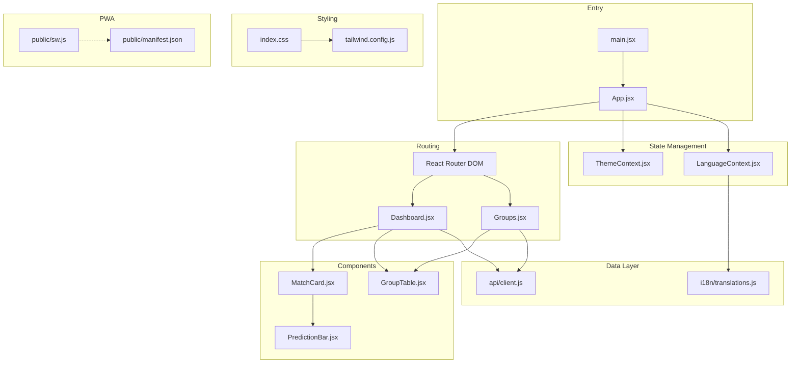
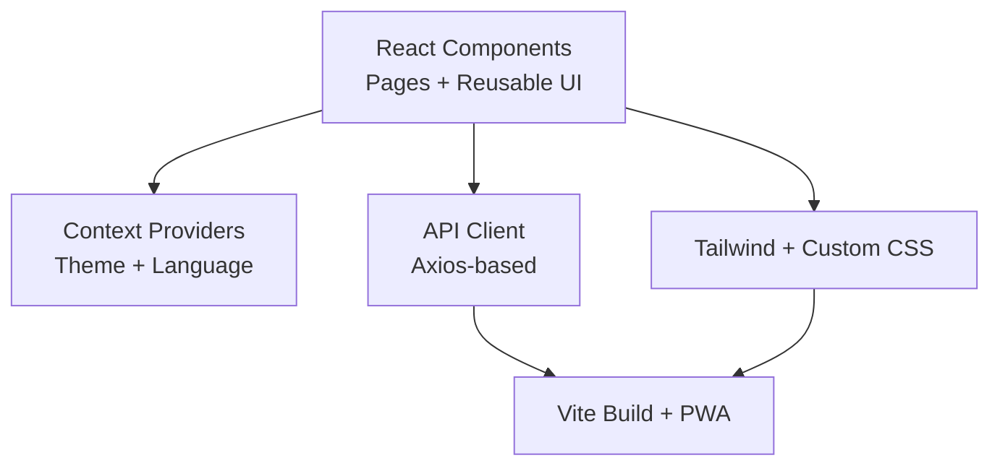
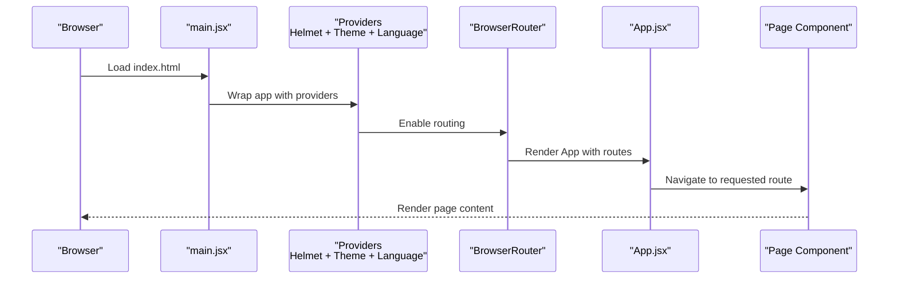
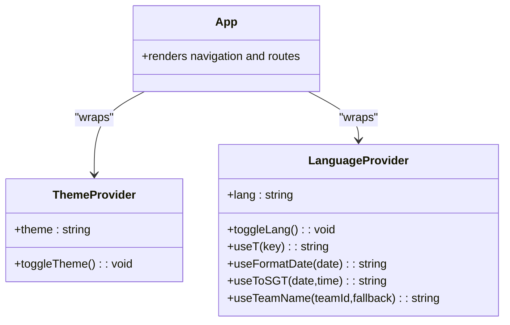
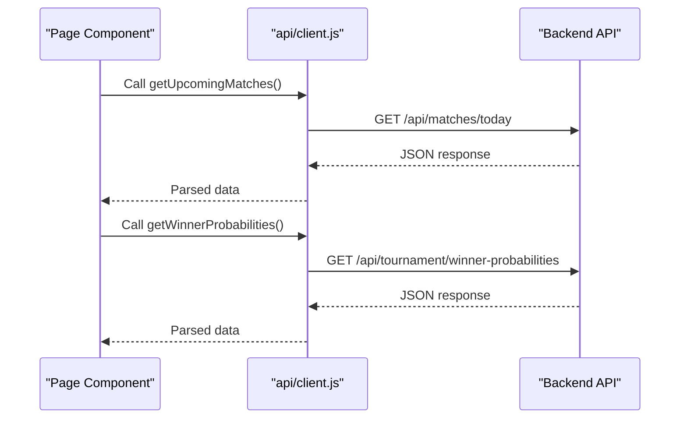
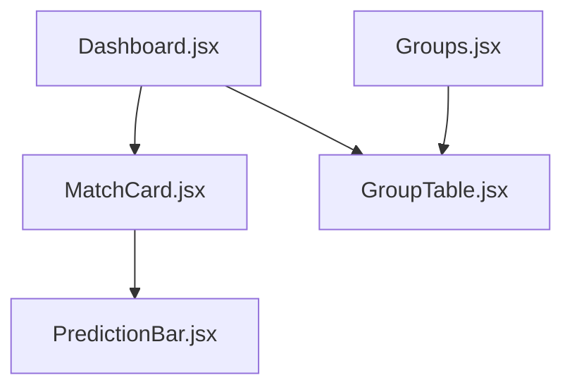
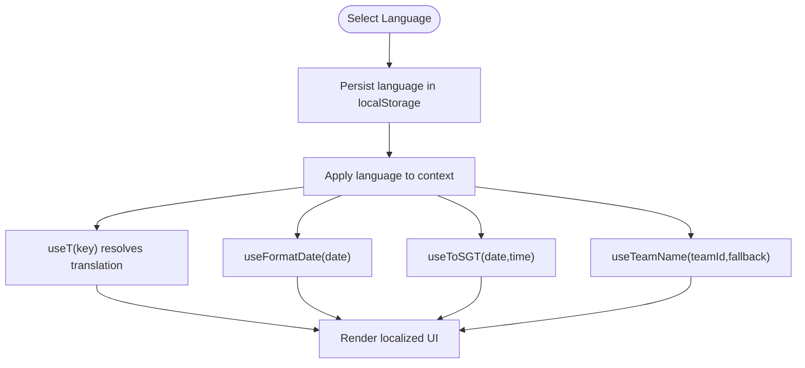
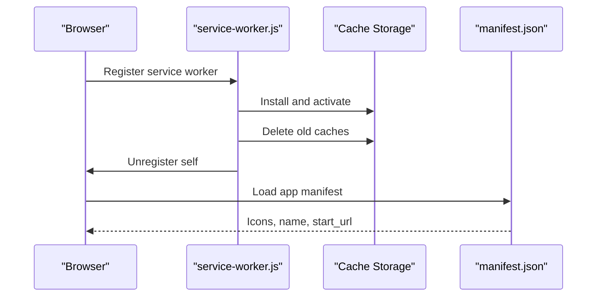
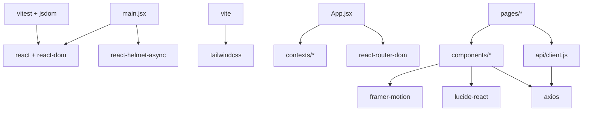

# Frontend Architecture

<cite>
**Referenced Files in This Document**
- [main.jsx](file://frontend/src/main.jsx)
- [App.jsx](file://frontend/src/App.jsx)
- [vite.config.js](file://frontend/vite.config.js)
- [tailwind.config.js](file://frontend/tailwind.config.js)
- [index.css](file://frontend/src/index.css)
- [ThemeContext.jsx](file://frontend/src/contexts/ThemeContext.jsx)
- [LanguageContext.jsx](file://frontend/src/contexts/LanguageContext.jsx)
- [client.js](file://frontend/src/api/client.js)
- [MatchCard.jsx](file://frontend/src/components/MatchCard.jsx)
- [GroupTable.jsx](file://frontend/src/components/GroupTable.jsx)
- [PredictionBar.jsx](file://frontend/src/components/PredictionBar.jsx)
- [Dashboard.jsx](file://frontend/src/pages/Dashboard.jsx)
- [Groups.jsx](file://frontend/src/pages/Groups.jsx)
- [translations.js](file://frontend/src/i18n/translations.js)
- [sw.js](file://frontend/public/sw.js)
- [manifest.json](file://frontend/public/manifest.json)
- [package.json](file://frontend/package.json)
</cite>

## Table of Contents
1. [Introduction](#introduction)
2. [Project Structure](#project-structure)
3. [Core Components](#core-components)
4. [Architecture Overview](#architecture-overview)
5. [Detailed Component Analysis](#detailed-component-analysis)
6. [Dependency Analysis](#dependency-analysis)
7. [Performance Considerations](#performance-considerations)
8. [Troubleshooting Guide](#troubleshooting-guide)
9. [Conclusion](#conclusion)

## Introduction
This document describes the frontend architecture of the React Single Page Application for the World Cup 2026 Predictor. It explains the component hierarchy starting from the application entry points, routing and page structure, reusable UI components, state management patterns, data fetching strategies, build configuration with Vite, styling approach using Tailwind CSS and custom themes, internationalization, service worker and PWA features, responsive design, accessibility, cross-browser compatibility, component composition patterns, and performance optimizations.

## Project Structure
The frontend is organized around a classic React SPA structure with clear separation of concerns:
- Entry points: main.jsx bootstraps the app with React Strict Mode, Helmet provider, and hydration logic for pre-rendering.
- Routing: App.jsx defines the navigation and route mapping using React Router DOM.
- Pages: Feature-specific pages under src/pages implement page-level logic and data fetching.
- Components: Reusable UI components under src/components encapsulate presentation and partial logic.
- Contexts: Theme and language contexts manage global state and utilities.
- API: A centralized client under src/api handles HTTP requests to the backend.
- Styling: Tailwind CSS with a custom theme extending colors, fonts, shadows, and utilities.
- Internationalization: Translations under src/i18n provide English and Chinese content.
- PWA: Service worker and manifest under public configure offline behavior and installability.

**Diagram sources**
- [main.jsx:1-22](file://frontend/src/main.jsx#L1-L22)
- [App.jsx:1-284](file://frontend/src/App.jsx#L1-L284)
- [Dashboard.jsx:1-706](file://frontend/src/pages/Dashboard.jsx#L1-L706)
- [Groups.jsx:1-160](file://frontend/src/pages/Groups.jsx#L1-L160)
- [MatchCard.jsx:1-175](file://frontend/src/components/MatchCard.jsx#L1-L175)
- [GroupTable.jsx:1-78](file://frontend/src/components/GroupTable.jsx#L1-L78)
- [PredictionBar.jsx:1-51](file://frontend/src/components/PredictionBar.jsx#L1-L51)
- [ThemeContext.jsx:1-27](file://frontend/src/contexts/ThemeContext.jsx#L1-L27)
- [LanguageContext.jsx:1-69](file://frontend/src/contexts/LanguageContext.jsx#L1-L69)
- [client.js:1-50](file://frontend/src/api/client.js#L1-L50)
- [tailwind.config.js:1-161](file://frontend/tailwind.config.js#L1-L161)
- [index.css:1-785](file://frontend/src/index.css#L1-L785)
- [sw.js:1-32](file://frontend/public/sw.js#L1-L32)
- [manifest.json:1-50](file://frontend/public/manifest.json#L1-L50)

**Section sources**
- [main.jsx:1-22](file://frontend/src/main.jsx#L1-L22)
- [App.jsx:1-284](file://frontend/src/App.jsx#L1-L284)

## Core Components
This section documents the primary building blocks of the application.

- App.jsx
  - Provides the top-level layout with desktop and mobile navigation, theme and language toggles, and route definitions.
  - Uses React Router DOM for declarative routing and nested layouts.
  - Wraps the app with ThemeProvider and LanguageProvider to enable global state and utilities.
  - Implements responsive navigation with a desktop header and a mobile bottom tab bar.

- ThemeContext.jsx
  - Manages theme state (light/dark) with persistence in localStorage.
  - Applies the 'dark' class to document.documentElement for Tailwind dark mode.
  - Exposes a toggle function and a hook for consuming components.

- LanguageContext.jsx
  - Manages language state (en/zh) with persistence in localStorage.
  - Exposes translation function useT() and helpers for date formatting and team name resolution.
  - Uses translations.js for localized strings.

- API Client (client.js)
  - Centralized HTTP client using Axios with a configurable base URL.
  - Exposes typed functions for teams, matches, groups, tournament data, analytics, and agent sessions.
  - Supports query parameters for prediction refresh and language selection.

- Component Library
  - MatchCard.jsx: Presents match metadata, scores, confidence chips, and prediction bar; integrates with language utilities and navigation.
  - GroupTable.jsx: Renders group standings with flags, points, and top-two indicators.
  - PredictionBar.jsx: Visualizes predicted outcome probabilities with gradient segments and labels.

- Pages
  - Dashboard.jsx: Orchestrates hero banners, stats cards, phase timeline, upcoming matches grid, and sidebar picks; performs parallel data fetching.
  - Groups.jsx: Loads groups, renders group selector tabs, standings table, and group matches.

**Section sources**
- [App.jsx:1-284](file://frontend/src/App.jsx#L1-L284)
- [ThemeContext.jsx:1-27](file://frontend/src/contexts/ThemeContext.jsx#L1-L27)
- [LanguageContext.jsx:1-69](file://frontend/src/contexts/LanguageContext.jsx#L1-L69)
- [client.js:1-50](file://frontend/src/api/client.js#L1-L50)
- [MatchCard.jsx:1-175](file://frontend/src/components/MatchCard.jsx#L1-L175)
- [GroupTable.jsx:1-78](file://frontend/src/components/GroupTable.jsx#L1-L78)
- [PredictionBar.jsx:1-51](file://frontend/src/components/PredictionBar.jsx#L1-L51)
- [Dashboard.jsx:1-706](file://frontend/src/pages/Dashboard.jsx#L1-L706)
- [Groups.jsx:1-160](file://frontend/src/pages/Groups.jsx#L1-L160)

## Architecture Overview
The application follows a layered architecture:
- Presentation Layer: React components (pages and reusable components) render UI and handle user interactions.
- State Management Layer: Context providers supply theme, language, and derived utilities to components.
- Data Access Layer: API client abstracts HTTP calls and exposes domain-specific functions.
- Styling Layer: Tailwind CSS with a custom theme and layered CSS utilities for dark mode and decorative elements.
- Infrastructure Layer: Vite build tooling, PWA configuration, and service worker for offline behavior.

[No sources needed since this diagram shows conceptual architecture, not a direct code mapping]

## Detailed Component Analysis

### Routing and Navigation Flow
The routing system is defined in App.jsx with nested providers and responsive navigation. The flow below illustrates how the application initializes and navigates between pages.

**Diagram sources**
- [main.jsx:1-22](file://frontend/src/main.jsx#L1-L22)
- [App.jsx:1-284](file://frontend/src/App.jsx#L1-L284)

**Section sources**
- [App.jsx:1-284](file://frontend/src/App.jsx#L1-L284)

### State Management Patterns
The application uses React Context for global state:
- ThemeContext manages theme preference and applies dark mode class to the document element.
- LanguageContext manages language preference, date formatting, and team name localization.

**Diagram sources**
- [ThemeContext.jsx:1-27](file://frontend/src/contexts/ThemeContext.jsx#L1-L27)
- [LanguageContext.jsx:1-69](file://frontend/src/contexts/LanguageContext.jsx#L1-L69)
- [App.jsx:1-284](file://frontend/src/App.jsx#L1-L284)

**Section sources**
- [ThemeContext.jsx:1-27](file://frontend/src/contexts/ThemeContext.jsx#L1-L27)
- [LanguageContext.jsx:1-69](file://frontend/src/contexts/LanguageContext.jsx#L1-L69)

### Data Fetching Strategy
The API client centralizes HTTP operations and exposes domain-specific functions. Pages orchestrate data fetching using React hooks and Promise-based patterns.

**Diagram sources**
- [Dashboard.jsx:147-158](file://frontend/src/pages/Dashboard.jsx#L147-L158)
- [client.js:9-38](file://frontend/src/api/client.js#L9-L38)

**Section sources**
- [Dashboard.jsx:147-158](file://frontend/src/pages/Dashboard.jsx#L147-L158)
- [client.js:1-50](file://frontend/src/api/client.js#L1-L50)

### Component Library Composition
Reusable components encapsulate presentation and partial logic, enabling composition across pages.

**Diagram sources**
- [Dashboard.jsx:1-706](file://frontend/src/pages/Dashboard.jsx#L1-L706)
- [Groups.jsx:1-160](file://frontend/src/pages/Groups.jsx#L1-L160)
- [MatchCard.jsx:1-175](file://frontend/src/components/MatchCard.jsx#L1-L175)
- [GroupTable.jsx:1-78](file://frontend/src/components/GroupTable.jsx#L1-L78)
- [PredictionBar.jsx:1-51](file://frontend/src/components/PredictionBar.jsx#L1-L51)

**Section sources**
- [MatchCard.jsx:1-175](file://frontend/src/components/MatchCard.jsx#L1-L175)
- [GroupTable.jsx:1-78](file://frontend/src/components/GroupTable.jsx#L1-L78)
- [PredictionBar.jsx:1-51](file://frontend/src/components/PredictionBar.jsx#L1-L51)

### Internationalization System
The i18n system supports English and Chinese with dynamic language switching and locale-aware formatting.

**Diagram sources**
- [LanguageContext.jsx:1-69](file://frontend/src/contexts/LanguageContext.jsx#L1-L69)
- [translations.js:1-630](file://frontend/src/i18n/translations.js#L1-L630)

**Section sources**
- [LanguageContext.jsx:1-69](file://frontend/src/contexts/LanguageContext.jsx#L1-L69)
- [translations.js:1-630](file://frontend/src/i18n/translations.js#L1-L630)

### PWA and Offline Functionality
The application includes a service worker and manifest for Progressive Web App capabilities.

**Diagram sources**
- [sw.js:1-32](file://frontend/public/sw.js#L1-L32)
- [manifest.json:1-50](file://frontend/public/manifest.json#L1-L50)

**Section sources**
- [sw.js:1-32](file://frontend/public/sw.js#L1-L32)
- [manifest.json:1-50](file://frontend/public/manifest.json#L1-L50)

## Dependency Analysis
The frontend relies on a set of core libraries and build tooling.

**Diagram sources**
- [package.json:38-71](file://frontend/package.json#L38-L71)
- [main.jsx:1-22](file://frontend/src/main.jsx#L1-L22)
- [App.jsx:1-284](file://frontend/src/App.jsx#L1-L284)
- [client.js:1-50](file://frontend/src/api/client.js#L1-L50)

**Section sources**
- [package.json:1-72](file://frontend/package.json#L1-L72)

## Performance Considerations
- Pre-rendering: react-snap generates static HTML for improved initial load performance and SEO.
- Build targets: Vite targets modern browsers with transpilation for compatibility.
- Lazy loading and code splitting: Recommended for large pages and heavy components.
- Image optimization: Use appropriate image sizes and formats; leverage responsive attributes.
- CSS optimization: Tailwind purging and custom utilities minimize bundle size.
- API caching: Implement caching strategies for repeated queries and reduce network overhead.
- Bundle analysis: Use Vite plugin for bundle visualization during development.

[No sources needed since this section provides general guidance]

## Troubleshooting Guide
Common issues and resolutions:
- Blank screen after navigation: Verify service worker activation and cache clearing behavior.
- Theme not persisting: Check localStorage availability and dark mode class application.
- Missing translations: Confirm language key exists in translations.js and useT resolves correctly.
- API errors: Inspect base URL configuration and network connectivity; validate endpoint responses.
- Hydration mismatch: Ensure server-side rendering and client hydration alignment.

**Section sources**
- [sw.js:17-31](file://frontend/public/sw.js#L17-L31)
- [ThemeContext.jsx:5-15](file://frontend/src/contexts/ThemeContext.jsx#L5-L15)
- [LanguageContext.jsx:7-14](file://frontend/src/contexts/LanguageContext.jsx#L7-L14)
- [client.js:3-7](file://frontend/src/api/client.js#L3-L7)

## Conclusion
The frontend architecture combines a clean component hierarchy, robust state management via React Context, a centralized API client, and a comprehensive styling system with Tailwind CSS. The routing structure, internationalization, and PWA features deliver a responsive, accessible, and performant user experience across devices and locales. Following the outlined patterns and best practices ensures maintainability and scalability as the application evolves.