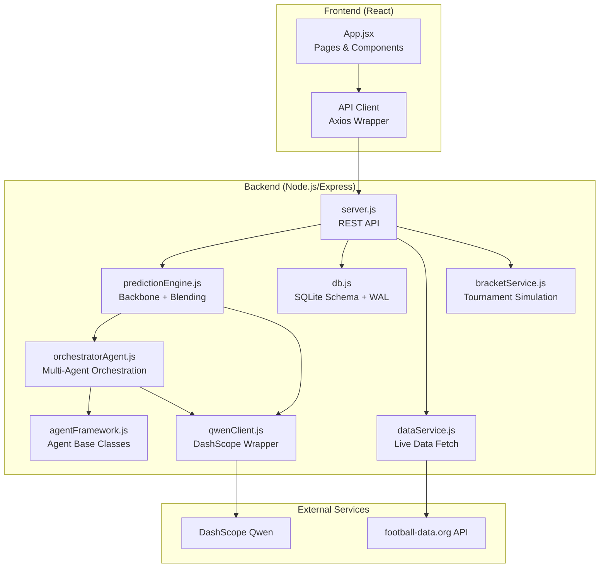
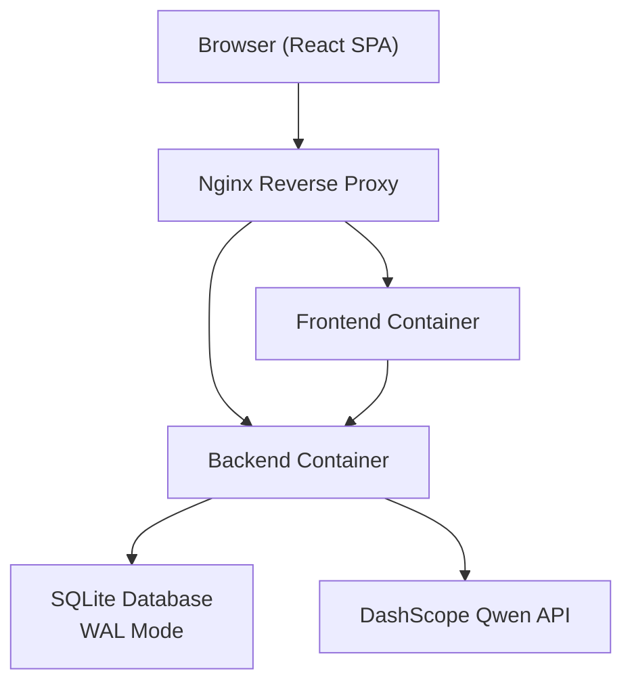
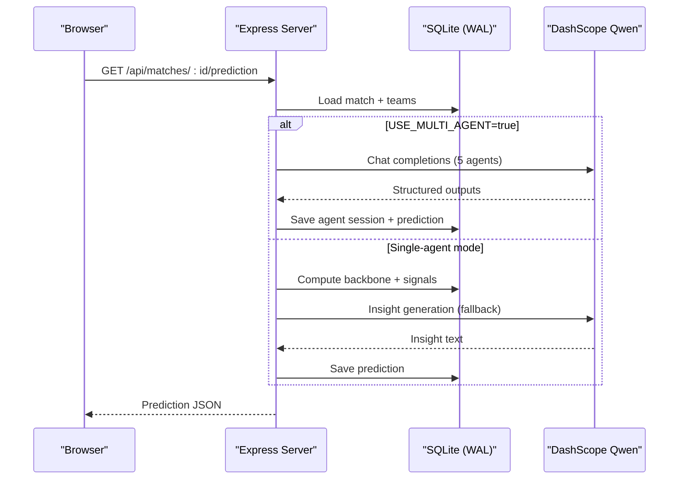
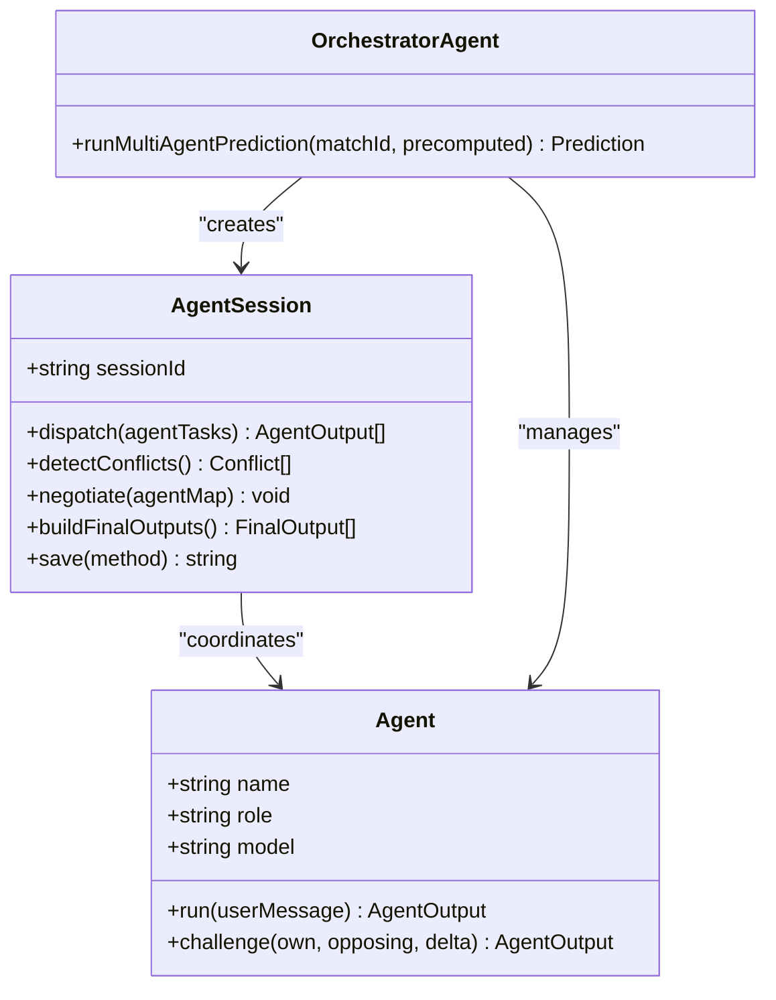
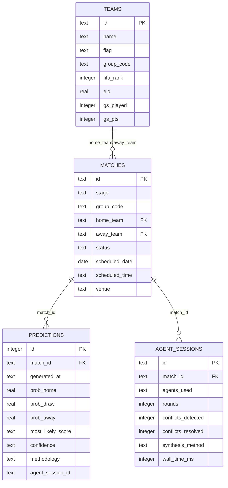
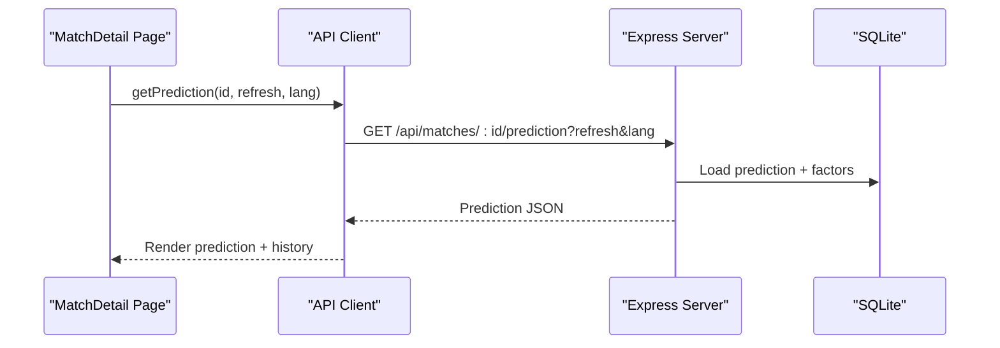
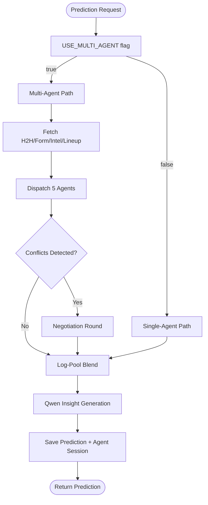
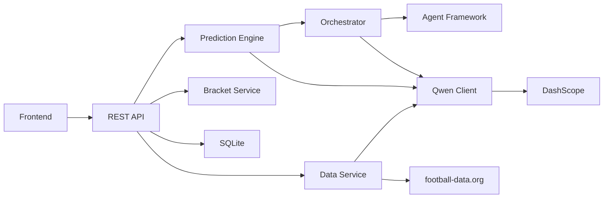

# System Architecture

<cite>
**Referenced Files in This Document**
- [README.md](file://README.md)
- [docker-compose.yml](file://docker-compose.yml)
- [backend/server.js](file://backend/server.js)
- [backend/package.json](file://backend/package.json)
- [frontend/package.json](file://frontend/package.json)
- [backend/services/predictionEngine.js](file://backend/services/predictionEngine.js)
- [backend/services/agents/orchestratorAgent.js](file://backend/services/agents/orchestratorAgent.js)
- [backend/services/agents/agentFramework.js](file://backend/services/agents/agentFramework.js)
- [backend/services/qwenClient.js](file://backend/services/qwenClient.js)
- [backend/database/db.js](file://backend/database/db.js)
- [frontend/src/api/client.js](file://frontend/src/api/client.js)
- [frontend/src/App.jsx](file://frontend/src/App.jsx)
- [frontend/src/pages/MatchDetail.jsx](file://frontend/src/pages/MatchDetail.jsx)
- [backend/services/dataService.js](file://backend/services/dataService.js)
- [backend/services/bracketService.js](file://backend/services/bracketService.js)
</cite>

## Table of Contents
1. [Introduction](#introduction)
2. [Project Structure](#project-structure)
3. [Core Components](#core-components)
4. [Architecture Overview](#architecture-overview)
5. [Detailed Component Analysis](#detailed-component-analysis)
6. [Dependency Analysis](#dependency-analysis)
7. [Performance Considerations](#performance-considerations)
8. [Troubleshooting Guide](#troubleshooting-guide)
9. [Conclusion](#conclusion)

## Introduction
WC26-Qwen-Qoder is a full-stack prediction application for the 2026 FIFA World Cup powered by Alibaba Cloud DashScope Qwen AI. The system integrates a multi-agent AI prediction engine with a React frontend and Node.js/Express backend, delivering match predictions, tournament brackets, and analytics. It uses SQLite with WAL mode for concurrent access, containerized deployment via Docker Compose with Nginx reverse proxy, and supports both single-model and multi-agent Qwen-powered predictions.

## Project Structure
The repository follows a clear separation of concerns:
- Frontend: React 18 with Vite, Tailwind CSS, and routing
- Backend: Node.js/Express REST API with modular services
- AI Integration: Qwen clients and multi-agent orchestration
- Data Layer: SQLite database with migration and seeding
- Deployment: Docker Compose with volume-backed storage

**Diagram sources**
- [backend/server.js:1-680](file://backend/server.js#L1-L680)
- [backend/services/predictionEngine.js:1-1020](file://backend/services/predictionEngine.js#L1-L1020)
- [backend/services/agents/orchestratorAgent.js:1-471](file://backend/services/agents/orchestratorAgent.js#L1-L471)
- [backend/services/agents/agentFramework.js:1-576](file://backend/services/agents/agentFramework.js#L1-L576)
- [backend/services/qwenClient.js:1-123](file://backend/services/qwenClient.js#L1-L123)
- [backend/database/db.js:1-252](file://backend/database/db.js#L1-L252)
- [backend/services/dataService.js:1-583](file://backend/services/dataService.js#L1-L583)
- [backend/services/bracketService.js:1-1080](file://backend/services/bracketService.js#L1-L1080)
- [frontend/src/api/client.js:1-50](file://frontend/src/api/client.js#L1-L50)
- [frontend/src/App.jsx:1-284](file://frontend/src/App.jsx#L1-L284)

**Section sources**
- [README.md:1-263](file://README.md#L1-L263)
- [docker-compose.yml:1-34](file://docker-compose.yml#L1-L34)

## Core Components
- REST API Server: Central Express server exposing endpoints for teams, matches, predictions, tournaments, analytics, and synchronization.
- Prediction Engine: Implements Dixon-Coles bivariate Poisson backbone with log-pool blending and optional multi-agent Qwen integration.
- Multi-Agent Orchestration: Coordinates five specialized agents (Statistical, Form, H2H, Intel, Lineup) with conflict detection and negotiation.
- Data Services: Integrates football-data.org API and web scraping for live data, with caching and anti-hallucination checks.
- Bracket Service: Manages group-to-knockout progression, third-place qualification, and Monte Carlo simulations.
- Frontend Application: React SPA with routing, theming, i18n, and real-time prediction visualization.
- Database: SQLite with WAL mode, migrations, and comprehensive schema for teams, matches, predictions, and agent sessions.

**Section sources**
- [backend/server.js:24-680](file://backend/server.js#L24-L680)
- [backend/services/predictionEngine.js:1-1020](file://backend/services/predictionEngine.js#L1-L1020)
- [backend/services/agents/orchestratorAgent.js:1-471](file://backend/services/agents/orchestratorAgent.js#L1-L471)
- [backend/services/agents/agentFramework.js:1-576](file://backend/services/agents/agentFramework.js#L1-L576)
- [backend/services/dataService.js:1-583](file://backend/services/dataService.js#L1-L583)
- [backend/services/bracketService.js:1-1080](file://backend/services/bracketService.js#L1-L1080)
- [backend/database/db.js:23-252](file://backend/database/db.js#L23-L252)
- [frontend/src/api/client.js:1-50](file://frontend/src/api/client.js#L1-L50)
- [frontend/src/App.jsx:1-284](file://frontend/src/App.jsx#L1-L284)

## Architecture Overview
The system employs a microservices-like separation:
- Prediction Engine: Core probabilistic model and blending logic
- Data Services: Live data ingestion and caching
- UI Layer: React SPA consuming REST endpoints

**Diagram sources**
- [docker-compose.yml:1-34](file://docker-compose.yml#L1-L34)
- [backend/server.js:1-680](file://backend/server.js#L1-L680)
- [backend/database/db.js:10-21](file://backend/database/db.js#L10-L21)

## Detailed Component Analysis

### REST API Layer
The backend exposes a comprehensive REST API with endpoints for:
- Teams and group standings
- Matches (list, today, upcoming, upset watch)
- Predictions (single match, batch generation)
- Tournament bracket and simulations
- Analytics (accuracy, agent performance)
- Live result synchronization

**Diagram sources**
- [backend/server.js:326-341](file://backend/server.js#L326-L341)
- [backend/services/predictionEngine.js:665-800](file://backend/services/predictionEngine.js#L665-L800)
- [backend/services/agents/orchestratorAgent.js:288-468](file://backend/services/agents/orchestratorAgent.js#L288-L468)
- [backend/services/qwenClient.js:53-101](file://backend/services/qwenClient.js#L53-L101)

**Section sources**
- [backend/server.js:24-680](file://backend/server.js#L24-L680)

### Multi-Agent Prediction System
The multi-agent system coordinates five specialized agents:
- Statistical Agent: Interprets Dixon-Coles backbone outputs
- Form Agent: Evaluates recent form with competition weighting
- H2H Agent: Head-to-head record analysis
- Intel Agent: Injuries, motivation, and squad rotation
- Lineup Agent: Confirmed starting XI strength

**Diagram sources**
- [backend/services/agents/agentFramework.js:201-576](file://backend/services/agents/agentFramework.js#L201-L576)
- [backend/services/agents/orchestratorAgent.js:288-468](file://backend/services/agents/orchestratorAgent.js#L288-L468)

**Section sources**
- [backend/services/agents/orchestratorAgent.js:1-471](file://backend/services/agents/orchestratorAgent.js#L1-L471)
- [backend/services/agents/agentFramework.js:1-576](file://backend/services/agents/agentFramework.js#L1-L576)

### Database Architecture
The database uses SQLite with WAL mode for concurrent access:
- Teams, Matches, Predictions, Model Performance, Elo History, Suspensions
- Agent Sessions, Messages, and Conflicts for multi-agent tracing
- Model Config for tunable weights and flags
- Migrations for evolving schema

**Diagram sources**
- [backend/database/db.js:23-209](file://backend/database/db.js#L23-L209)

**Section sources**
- [backend/database/db.js:1-252](file://backend/database/db.js#L1-L252)

### Frontend Integration
The React frontend consumes the REST API through a typed client:
- Pages: Dashboard, Schedule, MatchDetail, Groups, Tournament, Predictions, TeamDetail
- Components: Reusable UI elements with theming and i18n
- API Client: Axios wrapper with environment-driven base URL

**Diagram sources**
- [frontend/src/pages/MatchDetail.jsx:723-760](file://frontend/src/pages/MatchDetail.jsx#L723-L760)
- [frontend/src/api/client.js:19-25](file://frontend/src/api/client.js#L19-L25)
- [backend/server.js:326-341](file://backend/server.js#L326-L341)

**Section sources**
- [frontend/src/api/client.js:1-50](file://frontend/src/api/client.js#L1-L50)
- [frontend/src/App.jsx:1-284](file://frontend/src/App.jsx#L1-L284)
- [frontend/src/pages/MatchDetail.jsx:1-800](file://frontend/src/pages/MatchDetail.jsx#L1-L800)

### AI Integration and External APIs
- DashScope Qwen: OpenAI-compatible endpoint for chat completions
- Football-data.org: Optional live scores and form data
- Web Scraping: Fallback for injuries, form, and lineups with anti-hallucination filtering

**Diagram sources**
- [backend/services/predictionEngine.js:55-62](file://backend/services/predictionEngine.js#L55-L62)
- [backend/services/agents/orchestratorAgent.js:300-382](file://backend/services/agents/orchestratorAgent.js#L300-L382)
- [backend/services/dataService.js:413-490](file://backend/services/dataService.js#L413-L490)
- [backend/services/qwenClient.js:53-101](file://backend/services/qwenClient.js#L53-L101)

**Section sources**
- [backend/services/qwenClient.js:1-123](file://backend/services/qwenClient.js#L1-L123)
- [backend/services/dataService.js:1-583](file://backend/services/dataService.js#L1-L583)

## Dependency Analysis
The system exhibits clean modularity with explicit dependencies:
- Frontend depends on backend REST endpoints
- Backend depends on SQLite for persistence
- Backend depends on DashScope Qwen for AI inference
- Backend depends on football-data.org for live data (optional)
- Multi-agent orchestration depends on prediction engine and Qwen client

**Diagram sources**
- [frontend/src/api/client.js:1-50](file://frontend/src/api/client.js#L1-L50)
- [backend/server.js:1-680](file://backend/server.js#L1-L680)
- [backend/services/predictionEngine.js:1-1020](file://backend/services/predictionEngine.js#L1-L1020)
- [backend/services/agents/orchestratorAgent.js:1-471](file://backend/services/agents/orchestratorAgent.js#L1-L471)
- [backend/services/agents/agentFramework.js:1-576](file://backend/services/agents/agentFramework.js#L1-L576)
- [backend/services/qwenClient.js:1-123](file://backend/services/qwenClient.js#L1-L123)
- [backend/services/dataService.js:1-583](file://backend/services/dataService.js#L1-L583)
- [backend/services/bracketService.js:1-1080](file://backend/services/bracketService.js#L1-L1080)
- [backend/database/db.js:1-252](file://backend/database/db.js#L1-L252)

**Section sources**
- [backend/package.json:14-31](file://backend/package.json#L14-L31)
- [frontend/package.json:38-71](file://frontend/package.json#L38-L71)

## Performance Considerations
- SQLite WAL Mode: Improves concurrency for read-heavy prediction workloads
- Caching: Web intelligence cache with configurable TTLs reduces external API calls
- Parallelization: Multi-agent orchestration executes agents concurrently
- Background Jobs: Scheduled tasks for prediction regeneration and live result sync
- CDN/Reverse Proxy: Nginx optimizes static assets and SSL termination
- Containerization: Isolates services and enables horizontal scaling

[No sources needed since this section provides general guidance]

## Troubleshooting Guide
Common issues and resolutions:
- Missing DashScope API Key: Falls back to template-generated insights; multi-agent disabled
- Missing football-data.org API Key: Uses synthetic form data and static H2H defaults
- SQLite Lock Issues: WAL mode and busy_timeout configured; ensure proper volume mounting
- CORS Errors: Configure FRONTEND_URL environment variable
- Agent Session Failures: Check Qwen model availability and retry logic
- Live Sync Failures: Verify API key and team ID mappings

**Section sources**
- [backend/services/qwenClient.js:60-101](file://backend/services/qwenClient.js#L60-L101)
- [backend/services/dataService.js:495-580](file://backend/services/dataService.js#L495-L580)
- [backend/database/db.js:10-21](file://backend/database/db.js#L10-L21)
- [backend/server.js:21-22](file://backend/server.js#L21-L22)

## Conclusion
WC26-Qwen-Qoder demonstrates a robust, scalable architecture combining a React frontend, Node.js/Express backend, SQLite persistence, and a powerful multi-agent Qwen prediction system. The modular design, containerized deployment, and comprehensive AI integration deliver accurate, explainable predictions for the 2026 FIFA World Cup while maintaining maintainability and performance.