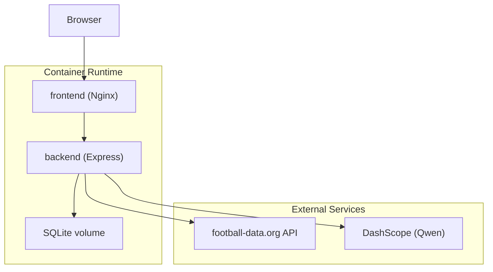
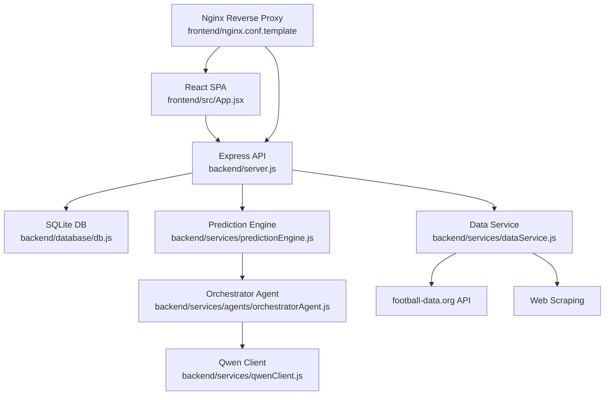
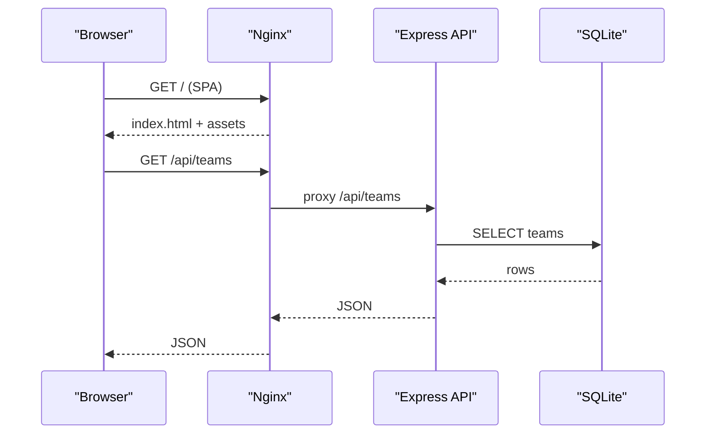
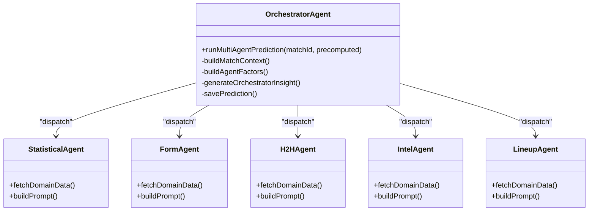
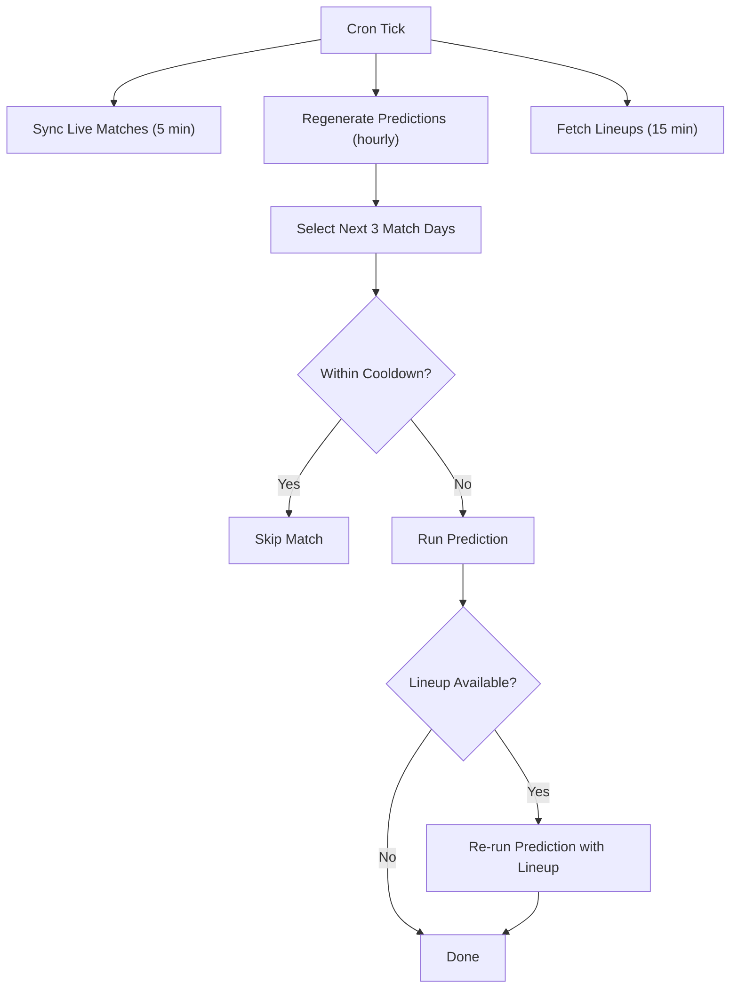
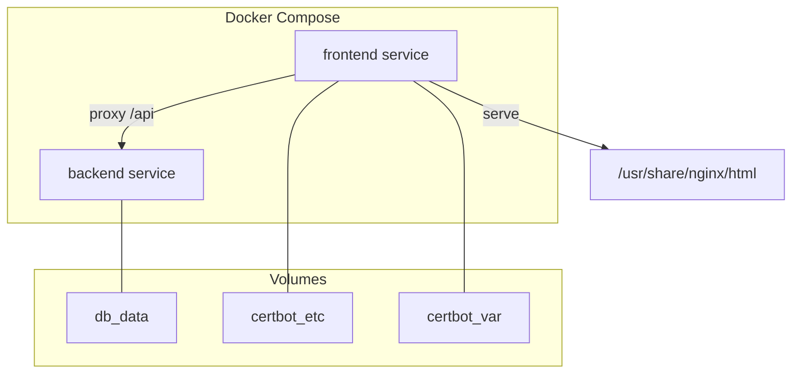
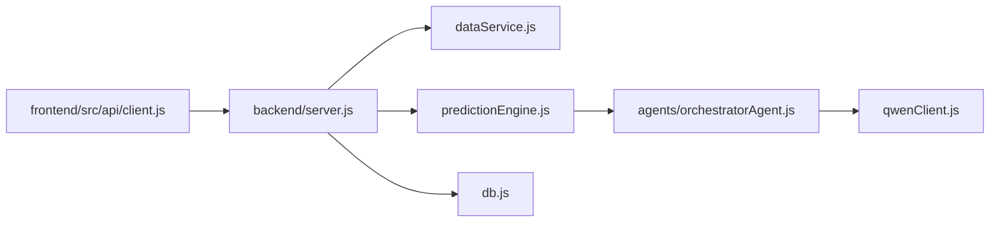
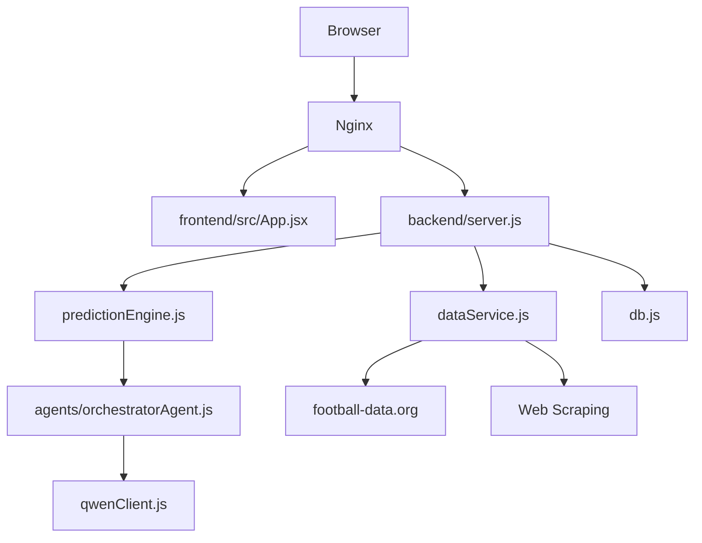
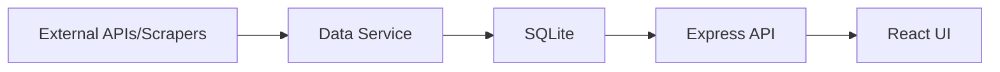

# System Architecture

<cite>
**Referenced Files in This Document**
- [README.md](file://README.md)
- [docker-compose.yml](file://docker-compose.yml)
- [backend/package.json](file://backend/package.json)
- [frontend/package.json](file://frontend/package.json)
- [backend/server.js](file://backend/server.js)
- [frontend/src/App.jsx](file://frontend/src/App.jsx)
- [frontend/src/api/client.js](file://frontend/src/api/client.js)
- [backend/services/predictionEngine.js](file://backend/services/predictionEngine.js)
- [backend/services/agents/orchestratorAgent.js](file://backend/services/agents/orchestratorAgent.js)
- [backend/services/qwenClient.js](file://backend/services/qwenClient.js)
- [backend/database/db.js](file://backend/database/db.js)
- [backend/services/dataService.js](file://backend/services/dataService.js)
- [frontend/nginx.conf.template](file://frontend/nginx.conf.template)
- [backend/Dockerfile](file://backend/Dockerfile)
- [frontend/Dockerfile](file://frontend/Dockerfile)
- [backend/scripts/regen-predictions.js](file://backend/scripts/regen-predictions.js)
</cite>

## Table of Contents
1. [Introduction](#introduction)
2. [Project Structure](#project-structure)
3. [Core Components](#core-components)
4. [Architecture Overview](#architecture-overview)
5. [Detailed Component Analysis](#detailed-component-analysis)
6. [Dependency Analysis](#dependency-analysis)
7. [Performance Considerations](#performance-considerations)
8. [Troubleshooting Guide](#troubleshooting-guide)
9. [Conclusion](#conclusion)
10. [Appendices](#appendices)

## Introduction
This document describes the system architecture of the World Cup 2026 Prediction App. It covers the microservice-style separation between a React frontend and an Express.js backend, containerized deployment with Docker Compose and Nginx reverse proxy, data flow from external APIs and web scraping to SQLite storage and the UI, the AI integration layer using Alibaba Cloud Qwen models orchestrated by a multi-agent system, and the automated cron-based synchronization pipeline. Cross-cutting concerns such as security, monitoring, and disaster recovery are addressed alongside technology stack choices and third-party dependencies.

## Project Structure
The repository follows a clear separation of concerns:
- Frontend: React SPA built with Vite, served by Nginx inside a container.
- Backend: Node.js/Express API server with SQLite database, cron jobs, and AI orchestration.
- Infrastructure: Docker Compose defines services and volumes; Nginx handles reverse proxy and optional HTTPS via Certbot/Let’s Encrypt.

**Diagram sources**
- [docker-compose.yml:1-34](file://docker-compose.yml#L1-L34)
- [frontend/nginx.conf.template:1-25](file://frontend/nginx.conf.template#L1-L25)
- [backend/server.js:1-724](file://backend/server.js#L1-L724)
- [backend/services/dataService.js:1-602](file://backend/services/dataService.js#L1-L602)
- [backend/services/qwenClient.js:1-123](file://backend/services/qwenClient.js#L1-L123)

**Section sources**
- [README.md:153-209](file://README.md#L153-L209)
- [docker-compose.yml:1-34](file://docker-compose.yml#L1-L34)

## Core Components
- Frontend (React SPA)
  - Routing and navigation handled by React Router.
  - API client wraps Axios with a base URL pointing to the backend /api.
  - Theme and language toggles managed via React Context providers.
- Backend (Express API)
  - REST endpoints for teams, groups, matches, predictions, tournament bracket, analytics, and admin-like sync endpoints.
  - SQLite database with WAL mode and migrations for schema and model configuration.
  - Cron jobs for live result synchronization, prediction regeneration, and lineup fetching.
  - Prediction engine with a single-model backbone and multi-agent extension.
  - Qwen client for DashScope API calls with retry logic and ping health checks.
  - Data service orchestrating live data fetching from football-data.org and web scraping.
- AI Orchestration
  - Orchestrator coordinates five specialized agents (Statistical, Form, H2H, Intel, Lineup) in parallel.
  - Conflict detection and negotiation with weight adjustments and log-pool blending.
  - Session logging for reproducibility and transparency.
- Infrastructure
  - Docker Compose builds and runs backend and frontend containers.
  - Nginx reverse proxy forwards /api to backend and serves static assets.
  - Optional HTTPS via Certbot/Let’s Encrypt using ACME challenges.

**Section sources**
- [frontend/src/App.jsx:1-284](file://frontend/src/App.jsx#L1-L284)
- [frontend/src/api/client.js:1-50](file://frontend/src/api/client.js#L1-L50)
- [backend/server.js:1-724](file://backend/server.js#L1-L724)
- [backend/database/db.js:1-252](file://backend/database/db.js#L1-L252)
- [backend/services/predictionEngine.js:1-1046](file://backend/services/predictionEngine.js#L1-L1046)
- [backend/services/agents/orchestratorAgent.js:1-502](file://backend/services/agents/orchestratorAgent.js#L1-L502)
- [backend/services/qwenClient.js:1-123](file://backend/services/qwenClient.js#L1-L123)
- [backend/services/dataService.js:1-602](file://backend/services/dataService.js#L1-L602)
- [frontend/nginx.conf.template:1-25](file://frontend/nginx.conf.template#L1-L25)
- [backend/Dockerfile:1-8](file://backend/Dockerfile#L1-L8)
- [frontend/Dockerfile:1-18](file://frontend/Dockerfile#L1-L18)

## Architecture Overview
The system employs a microservice-style backend with a React frontend, connected through a reverse proxy. The backend encapsulates business logic, data orchestration, AI prediction, and persistence. External integrations include a football-data.org API (optional) and Alibaba Cloud DashScope Qwen models. A cron-driven pipeline keeps predictions fresh and synchronized with live results.

**Diagram sources**
- [frontend/src/App.jsx:1-284](file://frontend/src/App.jsx#L1-L284)
- [backend/server.js:1-724](file://backend/server.js#L1-L724)
- [backend/database/db.js:1-252](file://backend/database/db.js#L1-L252)
- [backend/services/dataService.js:1-602](file://backend/services/dataService.js#L1-L602)
- [backend/services/predictionEngine.js:1-1046](file://backend/services/predictionEngine.js#L1-L1046)
- [backend/services/agents/orchestratorAgent.js:1-502](file://backend/services/agents/orchestratorAgent.js#L1-L502)
- [backend/services/qwenClient.js:1-123](file://backend/services/qwenClient.js#L1-L123)
- [frontend/nginx.conf.template:1-25](file://frontend/nginx.conf.template#L1-L25)

## Detailed Component Analysis

### Microservice Separation: Frontend and Backend
- Frontend
  - SPA with routing for dashboard, schedule, groups, tournament, predictions, and team detail.
  - API client constructs URLs under /api and supports refresh and language parameters.
- Backend
  - Express server with CORS configured to the frontend origin.
  - Static serving of built frontend assets in production.
  - Comprehensive REST API for all UI needs.

**Diagram sources**
- [frontend/nginx.conf.template:13-19](file://frontend/nginx.conf.template#L13-L19)
- [backend/server.js:24-36](file://backend/server.js#L24-L36)
- [backend/database/db.js:1-252](file://backend/database/db.js#L1-L252)

**Section sources**
- [frontend/src/App.jsx:1-284](file://frontend/src/App.jsx#L1-L284)
- [frontend/src/api/client.js:1-50](file://frontend/src/api/client.js#L1-L50)
- [backend/server.js:18-682](file://backend/server.js#L18-L682)
- [frontend/nginx.conf.template:1-25](file://frontend/nginx.conf.template#L1-L25)

### Data Flow Architecture
- External APIs and Web Scraping
  - Data service fetches team form and head-to-head records from football-data.org when available.
  - Falls back to web scraping and synthetic generation when API keys are absent.
  - Parses injury and motivation intelligence using Qwen with anti-hallucination verification.
- Internal Processing
  - Prediction engine computes Dixon-Coles backbone probabilities and blends adjustment signals.
  - Multi-agent system orchestrates specialists and negotiates differences.
- Persistence
  - SQLite schema includes teams, matches, predictions, model performance, ELO history, suspensions, web intel cache, model configuration, and multi-agent session tables.
- UI Consumption
  - Frontend queries the backend for teams, matches, predictions, and analytics.

```mermaid
flowchart TD
Start(["Request Prediction"]) --> Fetch["Fetch Domain Data<br/>Form/H2H/Intel/Lineup"]
Fetch --> Backbone["Compute Backboneprobs (DC Poisson)"]
Backbone --> Agents["Dispatch Specialized Agents"]
Agents --> Conflicts{"Conflicts Detected?"}
Conflicts --> |Yes| Negotiate["Negotiation Round"]
Conflicts --> |No| Blend["Log-Pool Blend"]
Negotiate --> Blend
Blend --> Insight["Generate Insight (Qwen)"]
Insight --> Persist["Persist Prediction + Session"]
Persist --> End(["Return Prediction"])
```

**Diagram sources**
- [backend/services/dataService.js:1-602](file://backend/services/dataService.js#L1-L602)
- [backend/services/predictionEngine.js:1-1046](file://backend/services/predictionEngine.js#L1-L1046)
- [backend/services/agents/orchestratorAgent.js:1-502](file://backend/services/agents/orchestratorAgent.js#L1-L502)
- [backend/database/db.js:167-207](file://backend/database/db.js#L167-L207)

**Section sources**
- [backend/services/dataService.js:1-602](file://backend/services/dataService.js#L1-L602)
- [backend/services/predictionEngine.js:1-1046](file://backend/services/predictionEngine.js#L1-L1046)
- [backend/database/db.js:23-207](file://backend/database/db.js#L23-L207)

### AI Integration Layer: Multi-Agent Orchestration
- Agents
  - Statistical: interprets precomputed DC backbone outputs.
  - Form: evaluates recent form with competition weighting.
  - H2H: real 47k match dataset interpretation.
  - Intel: injury/news parsing with anti-hallucination filtering.
  - Lineup: confirmed XI strength analysis (~60 min before kickoff).
- Orchestrator
  - Builds match context, pre-fetches data, dispatches agents in parallel, detects conflicts (≥20% delta), negotiates, adjusts weights, blends with log-pool, applies temperature scaling, reweights score matrix, generates insight, and persists session and prediction.
- Qwen Models
  - Orchestrator uses qwen-plus; agents use qwen-plus or qwen-turbo depending on workload.

**Diagram sources**
- [backend/services/agents/orchestratorAgent.js:1-502](file://backend/services/agents/orchestratorAgent.js#L1-L502)
- [backend/services/agents/statisticalAgent.js](file://backend/services/agents/statisticalAgent.js)
- [backend/services/agents/formAgent.js](file://backend/services/agents/formAgent.js)
- [backend/services/agents/h2hAgent.js](file://backend/services/agents/h2hAgent.js)
- [backend/services/agents/intelAgent.js](file://backend/services/agents/intelAgent.js)
- [backend/services/agents/lineupAgent.js](file://backend/services/agents/lineupAgent.js)

**Section sources**
- [README.md:18-104](file://README.md#L18-L104)
- [backend/services/agents/orchestratorAgent.js:1-502](file://backend/services/agents/orchestratorAgent.js#L1-L502)
- [backend/services/qwenClient.js:1-123](file://backend/services/qwenClient.js#L1-L123)

### Cron Job System for Automated Data Synchronization and Prediction Updates
- Live Results Sync
  - Every 5 minutes during tournament: flips in-progress matches to LIVE and records final scores for finished matches.
- Prediction Regeneration
  - Hourly cron runs across SGT daytime windows to regenerate predictions for the next three match days, respecting cooldowns and tournament end date.
- Lineup Fetching
  - Every 15 minutes, fetches lineups for matches within 2 hours of kickoff and re-runs predictions incorporating lineup signals.
- Startup Behavior
  - On startup, fills missing predictions for the next three match days.

**Diagram sources**
- [backend/server.js:584-675](file://backend/server.js#L584-L675)

**Section sources**
- [backend/server.js:584-675](file://backend/server.js#L584-L675)

### Containerized Deployment with Docker Compose and Nginx Reverse Proxy
- Services
  - backend: Node.js app with production environment and DB volume mounted at /data.
  - frontend: Nginx serving static assets, reverse proxy to backend, with optional HTTPS via Certbot volumes.
- Ports
  - Frontend exposes 80/443; backend is internal to the frontend container.
- Environment
  - FRONTEND_URL controls CORS; BACKEND_URL points from frontend to backend service.
- Build and Entrypoint
  - Backend Dockerfile installs deps and starts with npm start.
  - Frontend Dockerfile builds SPA, installs Nginx + Certbot, copies templates and entrypoint script.

**Diagram sources**
- [docker-compose.yml:1-34](file://docker-compose.yml#L1-L34)
- [backend/Dockerfile:1-8](file://backend/Dockerfile#L1-L8)
- [frontend/Dockerfile:1-18](file://frontend/Dockerfile#L1-L18)

**Section sources**
- [docker-compose.yml:1-34](file://docker-compose.yml#L1-L34)
- [frontend/nginx.conf.template:1-25](file://frontend/nginx.conf.template#L1-L25)
- [backend/Dockerfile:1-8](file://backend/Dockerfile#L1-L8)
- [frontend/Dockerfile:1-18](file://frontend/Dockerfile#L1-L18)

## Dependency Analysis
- Technology Stack
  - Backend: Node.js, Express, SQLite (node-sqlite3-wasm), axios, cheerio, cors, dotenv, node-cron.
  - Frontend: React 18, Vite, Tailwind CSS, axios, react-router-dom, recharts.
  - AI: DashScope (Qwen) via OpenAI-compatible endpoint.
  - Data: football-data.org API (optional), web scraping.
  - Deployment: Docker, Docker Compose, Nginx, Certbot.
- External Dependencies
  - Qwen models: qwen-max, qwen-plus, qwen-turbo.
  - Third-party APIs: football-data.org.
- Coupling and Cohesion
  - Backend maintains high cohesion around prediction, data, and orchestration; clear separation from frontend.
  - Data service isolates external integrations and caching.
  - Orchestrator decouples agent logic while coordinating shared resources.

**Diagram sources**
- [frontend/src/api/client.js:1-50](file://frontend/src/api/client.js#L1-L50)
- [backend/server.js:1-724](file://backend/server.js#L1-L724)
- [backend/services/dataService.js:1-602](file://backend/services/dataService.js#L1-L602)
- [backend/services/predictionEngine.js:1-1046](file://backend/services/predictionEngine.js#L1-L1046)
- [backend/services/agents/orchestratorAgent.js:1-502](file://backend/services/agents/orchestratorAgent.js#L1-L502)
- [backend/services/qwenClient.js:1-123](file://backend/services/qwenClient.js#L1-L123)
- [backend/database/db.js:1-252](file://backend/database/db.js#L1-L252)

**Section sources**
- [backend/package.json:14-30](file://backend/package.json#L14-L30)
- [frontend/package.json:38-68](file://frontend/package.json#L38-L68)

## Performance Considerations
- Prediction Engine
  - Log-pool blending preserves confidence and avoids arithmetic averaging pitfalls.
  - Temperature scaling and Dixon-Coles ρ calibration improve reliability.
- Multi-Agent Orchestration
  - Parallel agent dispatch reduces latency; negotiation is bounded and optional.
- Data Fetching
  - Caching reduces repeated network calls; fallbacks maintain availability.
- Database
  - WAL mode and foreign keys tuned for concurrent access; migrations ensure schema evolution.
- Frontend
  - Static asset delivery via Nginx; SPA routing handled by Nginx try_files.

[No sources needed since this section provides general guidance]

## Troubleshooting Guide
- CORS Issues
  - Verify FRONTEND_URL environment variable matches the browser origin.
- Qwen API Failures
  - Ensure DASHSCOPE_API_KEY is set; use ping() to validate connectivity.
- Live Sync Failures
  - Confirm FOOTBALL_DATA_API_KEY is configured; check API rate limits and team ID mapping.
- Prediction Stagnation
  - Use generate-all endpoint or inspect cron logs; verify tournament end date guard.
- Database Locks
  - node-sqlite3-wasm removes stale locks; ensure sufficient disk space and permissions.

**Section sources**
- [backend/server.js:21-22](file://backend/server.js#L21-L22)
- [backend/services/qwenClient.js:60-101](file://backend/services/qwenClient.js#L60-L101)
- [backend/services/dataService.js:18-28](file://backend/services/dataService.js#L18-L28)
- [backend/server.js:584-675](file://backend/server.js#L584-L675)
- [backend/database/db.js:10-21](file://backend/database/db.js#L10-L21)

## Conclusion
The World Cup 2026 Prediction App combines a modern React frontend with a robust Node.js/Express backend, a SQLite-backed data layer, and a sophisticated multi-agent AI system powered by Qwen. The Docker Compose deployment with Nginx reverse proxy enables straightforward production rollout, while cron jobs automate data synchronization and prediction maintenance. The architecture balances modularity, reliability, and extensibility, with clear separation of concerns and strong operational safeguards.

[No sources needed since this section summarizes without analyzing specific files]

## Appendices

### System Context Diagrams
- Component Interactions

- Data Flow

**Diagram sources**
- [frontend/src/App.jsx:1-284](file://frontend/src/App.jsx#L1-L284)
- [frontend/nginx.conf.template:1-25](file://frontend/nginx.conf.template#L1-L25)
- [backend/server.js:1-724](file://backend/server.js#L1-L724)
- [backend/services/dataService.js:1-602](file://backend/services/dataService.js#L1-L602)
- [backend/services/predictionEngine.js:1-1046](file://backend/services/predictionEngine.js#L1-L1046)
- [backend/services/agents/orchestratorAgent.js:1-502](file://backend/services/agents/orchestratorAgent.js#L1-L502)
- [backend/services/qwenClient.js:1-123](file://backend/services/qwenClient.js#L1-L123)
- [backend/database/db.js:1-252](file://backend/database/db.js#L1-L252)

### Deployment Topology
- Single-host ECS deployment via Docker Compose with Nginx reverse proxy and optional HTTPS via Certbot/Let’s Encrypt.
- Environment variables for API keys, CORS, and backend port.
- Automated provisioning and deployment scripts for Alibaba Cloud ECS.

**Section sources**
- [README.md:231-262](file://README.md#L231-L262)
- [docker-compose.yml:1-34](file://docker-compose.yml#L1-L34)

### Scalability Considerations
- Horizontal Scaling
  - Stateless backend allows load balancing behind Nginx; persist state in SQLite volume.
- Caching
  - Web intel cache TTLs reduce upstream load; consider Redis cache for high-traffic periods.
- AI Throughput
  - Use qwen-turbo for high-throughput agents; reserve qwen-plus for complex reasoning; monitor QPS and latency.
- Database
  - Monitor WAL growth and vacuum periodically; consider read replicas for analytics queries.

[No sources needed since this section provides general guidance]

### Security, Monitoring, and Disaster Recovery
- Security
  - CORS restricted to FRONTEND_URL; API keys injected via environment variables; Qwen client validates presence.
- Monitoring
  - Enable logging for cron tasks and prediction runs; track Qwen latency and error rates.
- Disaster Recovery
  - Persistent volumes for DB and Certbot; backup SQLite database regularly; redeploy from image layers.

**Section sources**
- [backend/server.js:21-22](file://backend/server.js#L21-L22)
- [backend/services/qwenClient.js:60-101](file://backend/services/qwenClient.js#L60-L101)
- [docker-compose.yml:11-12](file://docker-compose.yml#L11-L12)
- [frontend/Dockerfile:13-14](file://frontend/Dockerfile#L13-L14)

### Technology Stack and Third-Party Dependencies
- Backend: Node.js, Express, SQLite (node-sqlite3-wasm), axios, cheerio, cors, dotenv, node-cron.
- Frontend: React 18, Vite, Tailwind CSS, axios, react-router-dom, recharts.
- AI: DashScope (Qwen) models (qwen-max, qwen-plus, qwen-turbo).
- Data: football-data.org API (optional), web scraping.
- Infrastructure: Docker, Docker Compose, Nginx, Certbot/Let’s Encrypt.

**Section sources**
- [backend/package.json:14-30](file://backend/package.json#L14-L30)
- [frontend/package.json:38-68](file://frontend/package.json#L38-L68)
- [README.md:106-112](file://README.md#L106-L112)