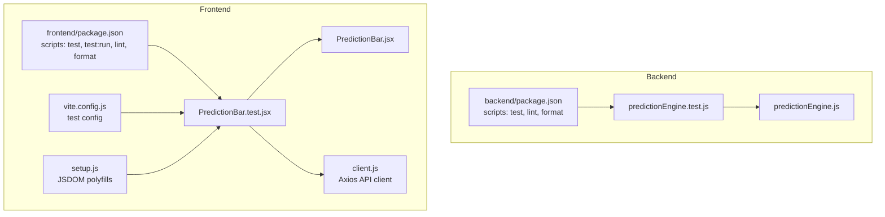
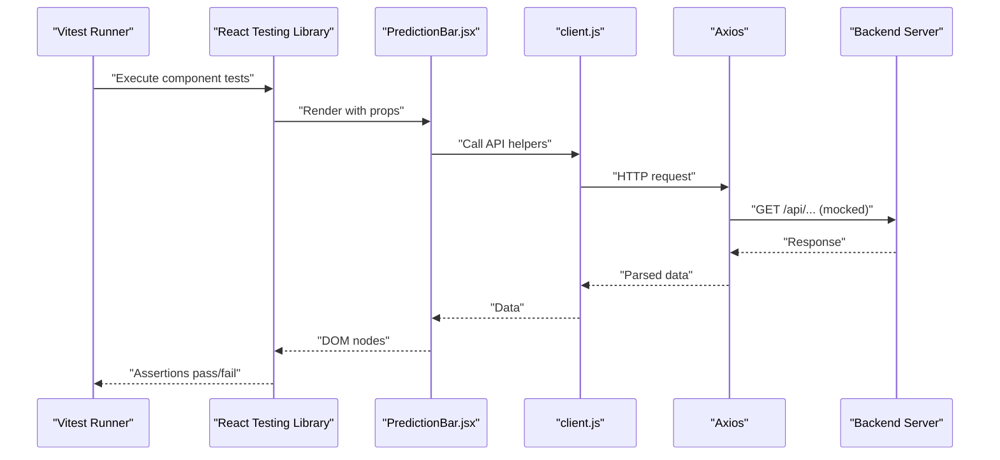
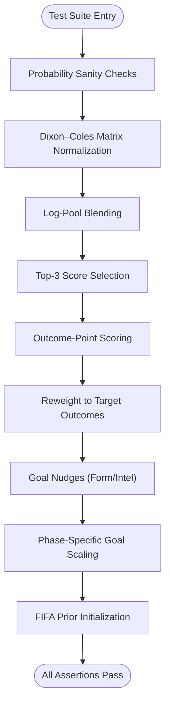
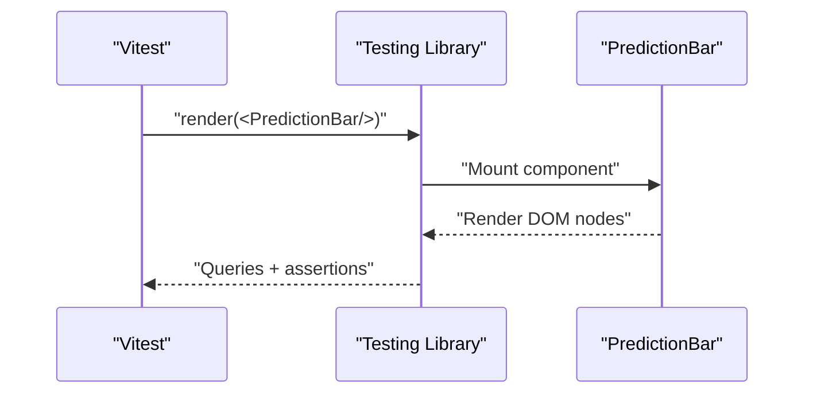
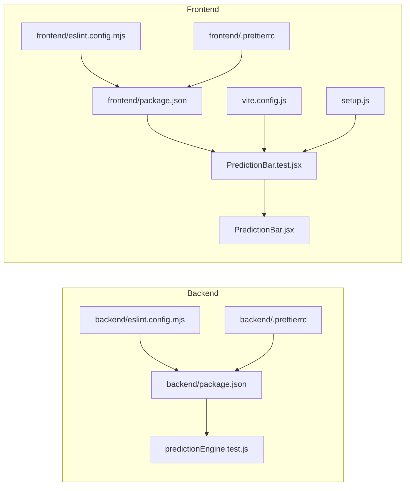

# Testing & Quality Assurance

<cite>
**Referenced Files in This Document**
- [backend/services/predictionEngine.test.js](file://backend/services/predictionEngine.test.js)
- [backend/services/predictionEngine.js](file://backend/services/predictionEngine.js)
- [frontend/src/components/PredictionBar.test.jsx](file://frontend/src/components/PredictionBar.test.jsx)
- [frontend/src/components/PredictionBar.jsx](file://frontend/src/components/PredictionBar.jsx)
- [frontend/src/api/client.js](file://frontend/src/api/client.js)
- [frontend/vite.config.js](file://frontend/vite.config.js)
- [frontend/src/test/setup.js](file://frontend/src/test/setup.js)
- [backend/eslint.config.mjs](file://backend/eslint.config.mjs)
- [frontend/eslint.config.mjs](file://frontend/eslint.config.mjs)
- [backend/.prettierrc](file://backend/.prettierrc)
- [frontend/.prettierrc](file://frontend/.prettierrc)
- [backend/package.json](file://backend/package.json)
- [frontend/package.json](file://frontend/package.json)
</cite>

## Table of Contents
1. [Introduction](#introduction)
2. [Project Structure](#project-structure)
3. [Core Components](#core-components)
4. [Architecture Overview](#architecture-overview)
5. [Detailed Component Analysis](#detailed-component-analysis)
6. [Dependency Analysis](#dependency-analysis)
7. [Performance Considerations](#performance-considerations)
8. [Troubleshooting Guide](#troubleshooting-guide)
9. [Conclusion](#conclusion)
10. [Appendices](#appendices)

## Introduction
This document defines the testing and quality assurance strategy for WC26-Qwen-Qoder. It covers:
- Unit tests for the prediction engine
- Frontend component tests using Vitest and Testing Library
- Code quality enforcement via ESLint and Prettier
- Test coverage expectations and mocking strategies for external APIs
- Continuous integration testing considerations
- Guidelines for writing effective tests, debugging failures, and maintaining test suites
- Performance and load testing considerations and quality gates for production

## Project Structure
The repository is split into a backend (Node.js) and a frontend (React/Vite). Testing is organized per package with dedicated tooling:
- Backend: Node’s built-in test runner executes unit tests for the prediction engine.
- Frontend: Vitest runs component and integration tests with JSDOM environment and React Testing Library.

**Diagram sources**
- [backend/package.json:1-32](file://backend/package.json#L1-L32)
- [backend/services/predictionEngine.test.js:1-333](file://backend/services/predictionEngine.test.js#L1-L333)
- [backend/services/predictionEngine.js:1-200](file://backend/services/predictionEngine.js#L1-L200)
- [frontend/package.json:1-72](file://frontend/package.json#L1-L72)
- [frontend/vite.config.js:1-26](file://frontend/vite.config.js#L1-L26)
- [frontend/src/test/setup.js:1-2](file://frontend/src/test/setup.js#L1-L2)
- [frontend/src/components/PredictionBar.jsx](file://frontend/src/components/PredictionBar.jsx)
- [frontend/src/components/PredictionBar.test.jsx:1-32](file://frontend/src/components/PredictionBar.test.jsx#L1-L32)
- [frontend/src/api/client.js:1-50](file://frontend/src/api/client.js#L1-L50)

**Section sources**
- [backend/package.json:1-32](file://backend/package.json#L1-L32)
- [frontend/package.json:1-72](file://frontend/package.json#L1-L72)
- [frontend/vite.config.js:1-26](file://frontend/vite.config.js#L1-L26)
- [frontend/src/test/setup.js:1-2](file://frontend/src/test/setup.js#L1-L2)

## Core Components
- Backend prediction engine unit tests validate core math and logic:
  - Probability computations (Poisson, Dixon–Coles correction)
  - Signal blending via log pooling
  - Scoring and outcome derivation
  - Goal nudges (form, intelligence)
  - Phase-specific goal scaling
  - FIFA prior initialization
- Frontend component tests validate rendering and behavior of PredictionBar using React Testing Library.
- API client encapsulates backend endpoints for consumption by frontend components.

**Section sources**
- [backend/services/predictionEngine.test.js:1-333](file://backend/services/predictionEngine.test.js#L1-L333)
- [frontend/src/components/PredictionBar.test.jsx:1-32](file://frontend/src/components/PredictionBar.test.jsx#L1-L32)
- [frontend/src/api/client.js:1-50](file://frontend/src/api/client.js#L1-L50)

## Architecture Overview
End-to-end testing spans unit logic, component rendering, and API interactions.

**Diagram sources**
- [frontend/vite.config.js:20-24](file://frontend/vite.config.js#L20-L24)
- [frontend/src/test/setup.js:1-2](file://frontend/src/test/setup.js#L1-L2)
- [frontend/src/components/PredictionBar.jsx](file://frontend/src/components/PredictionBar.jsx)
- [frontend/src/components/PredictionBar.test.jsx:1-32](file://frontend/src/components/PredictionBar.test.jsx#L1-L32)
- [frontend/src/api/client.js:1-50](file://frontend/src/api/client.js#L1-L50)

## Detailed Component Analysis

### Backend Prediction Engine Tests
These tests validate the mathematical backbone and adjustment mechanisms of the prediction engine:
- Probability sanity checks (sum to 1, symmetry, monotonicity)
- Dixon–Coles normalization and outcome-class aggregation
- Log-pool blending behavior and edge cases
- Top-3 score selection optimizing expected points
- Outcome-point scoring scheme
- Matrix reweighting to target W/D/L
- Form and intelligence goal nudges
- WC phase-specific goal scaling
- FIFA prior initialization

**Diagram sources**
- [backend/services/predictionEngine.test.js:21-333](file://backend/services/predictionEngine.test.js#L21-L333)

**Section sources**
- [backend/services/predictionEngine.test.js:1-333](file://backend/services/predictionEngine.test.js#L1-L333)

### Frontend Component Tests (Vitest + Testing Library)
Component-level tests for PredictionBar verify:
- Rendering of team names and draw label
- Percentage display correctness
- Variant sizing behavior

**Diagram sources**
- [frontend/src/components/PredictionBar.test.jsx:1-32](file://frontend/src/components/PredictionBar.test.jsx#L1-L32)
- [frontend/vite.config.js:20-24](file://frontend/vite.config.js#L20-L24)
- [frontend/src/test/setup.js:1-2](file://frontend/src/test/setup.js#L1-L2)

**Section sources**
- [frontend/src/components/PredictionBar.test.jsx:1-32](file://frontend/src/components/PredictionBar.test.jsx#L1-L32)

### API Client and Mocking Strategy
The frontend API client centralizes HTTP requests. For tests:
- Use a testing-friendly baseURL via environment variables
- Configure Axios with a reasonable timeout
- Mock network responses at the Axios adapter or interceptor level to avoid real HTTP calls during unit tests

Recommended mocking approach:
- Replace Axios instance with a mock in test setup
- Stub endpoint functions (e.g., getPrediction) to return deterministic fixtures
- Isolate network-dependent logic behind the client module for easier mocking

**Section sources**
- [frontend/src/api/client.js:1-50](file://frontend/src/api/client.js#L1-L50)

## Dependency Analysis
Testing stack and configuration dependencies:

**Diagram sources**
- [backend/package.json:1-32](file://backend/package.json#L1-L32)
- [backend/eslint.config.mjs:1-24](file://backend/eslint.config.mjs#L1-L24)
- [backend/.prettierrc:1-7](file://backend/.prettierrc#L1-L7)
- [backend/services/predictionEngine.test.js:1-333](file://backend/services/predictionEngine.test.js#L1-L333)
- [frontend/package.json:1-72](file://frontend/package.json#L1-L72)
- [frontend/eslint.config.mjs:1-54](file://frontend/eslint.config.mjs#L1-L54)
- [frontend/.prettierrc:1-7](file://frontend/.prettierrc#L1-L7)
- [frontend/vite.config.js:1-26](file://frontend/vite.config.js#L1-L26)
- [frontend/src/test/setup.js:1-2](file://frontend/src/test/setup.js#L1-L2)
- [frontend/src/components/PredictionBar.jsx](file://frontend/src/components/PredictionBar.jsx)
- [frontend/src/components/PredictionBar.test.jsx:1-32](file://frontend/src/components/PredictionBar.test.jsx#L1-L32)

**Section sources**
- [backend/package.json:1-32](file://backend/package.json#L1-L32)
- [frontend/package.json:1-72](file://frontend/package.json#L1-L72)
- [frontend/vite.config.js:1-26](file://frontend/vite.config.js#L1-L26)

## Performance Considerations
- Unit tests should remain fast; avoid real I/O and network calls. Use mocks and deterministic fixtures.
- For backend math-heavy modules, prefer numeric tolerance checks rather than exact equality to account for floating-point precision.
- Frontend tests should minimize rerenders and use targeted queries (e.g., getByText) to reduce flakiness.
- Keep test fixtures small and focused to improve maintainability and speed.

[No sources needed since this section provides general guidance]

## Troubleshooting Guide
Common issues and resolutions:
- Node test runner not discovering tests:
  - Ensure test script targets the correct glob pattern and files exist.
- Vitest environment issues:
  - Confirm jsdom environment is enabled and setup file registers jest-dom matchers.
- ESLint/Prettier conflicts:
  - Use prettier configs consistently across packages; disable incompatible rules via eslint-config-prettier.
- Mocking network calls:
  - Centralize HTTP logic in a single module (already present) and replace it with a mock in test environments.

**Section sources**
- [backend/package.json:10-12](file://backend/package.json#L10-L12)
- [frontend/package.json:11-14](file://frontend/package.json#L11-L14)
- [frontend/vite.config.js:20-24](file://frontend/vite.config.js#L20-L24)
- [frontend/src/test/setup.js:1-2](file://frontend/src/test/setup.js#L1-L2)
- [backend/eslint.config.mjs:19](file://backend/eslint.config.mjs#L19)
- [frontend/eslint.config.mjs:40](file://frontend/eslint.config.mjs#L40)

## Conclusion
The project employs a clear separation of concerns for testing:
- Backend: robust unit tests for the prediction engine logic
- Frontend: component tests with Vitest and Testing Library
- Code quality: shared ESLint and Prettier configurations across packages
Adhering to the guidelines herein will ensure reliable, maintainable, and high-quality tests across the system.

[No sources needed since this section summarizes without analyzing specific files]

## Appendices

### Code Quality Enforcement (ESLint and Prettier)
- Backend
  - ESLint configuration extends recommended rules, sets Node globals, ignores specific folders, and disables conflict rules via eslint-config-prettier.
  - Prettier configuration enforces consistent formatting across the backend.
- Frontend
  - ESLint configuration enables React and hooks rules, JSX support, and browser globals for tests.
  - Prettier configuration mirrors backend settings for consistency.

**Section sources**
- [backend/eslint.config.mjs:1-24](file://backend/eslint.config.mjs#L1-L24)
- [backend/.prettierrc:1-7](file://backend/.prettierrc#L1-L7)
- [frontend/eslint.config.mjs:1-54](file://frontend/eslint.config.mjs#L1-L54)
- [frontend/.prettierrc:1-7](file://frontend/.prettierrc#L1-L7)

### Test Coverage Requirements
- Aim for high coverage in critical modules (prediction engine, API client, and core components).
- Prioritize branch coverage for conditionals and decision points (e.g., goal scaling, nudges).
- Maintain coverage reports in CI to track regressions.

[No sources needed since this section provides general guidance]

### Mocking Strategies for External APIs
- Centralize HTTP logic in a single module (already present) to simplify mocking.
- Use a testing-friendly baseURL and environment variable overrides.
- Mock Axios at the adapter or module level to avoid real network calls.

**Section sources**
- [frontend/src/api/client.js:1-50](file://frontend/src/api/client.js#L1-L50)

### Continuous Integration Testing
- Backend
  - Run Node tests via the existing script.
  - Integrate linting and formatting checks in CI.
- Frontend
  - Run Vitest via the existing script.
  - Optionally add coverage collection and report generation in CI pipelines.

**Section sources**
- [backend/package.json:10-12](file://backend/package.json#L10-L12)
- [frontend/package.json:11-14](file://frontend/package.json#L11-L14)

### Guidelines for Writing Effective Tests
- Use descriptive test names and group related assertions.
- Prefer numeric tolerances for floating-point comparisons.
- Keep tests isolated and deterministic; avoid shared mutable state.
- Use fixtures for complex data and stub external dependencies.

[No sources needed since this section provides general guidance]

### Debugging Test Failures
- Enable verbose logging in Vitest and Node test runner.
- Narrow failing tests to minimal reproducers.
- Inspect diffs in assertion messages and confirm environment variables are set correctly.

[No sources needed since this section provides general guidance]

### Maintaining Test Suites
- Regularly review and refactor outdated tests.
- Keep fixtures updated alongside data models.
- Add regression tests for bug fixes.

[No sources needed since this section provides general guidance]

### Performance and Load Testing Considerations
- Use the prediction engine’s deterministic logic to validate performance characteristics without external systems.
- For frontend, measure render performance using Testing Library queries and avoid unnecessary re-renders.
- Introduce synthetic load tests in CI using headless browsers or specialized tools if needed.

[No sources needed since this section provides general guidance]

### Quality Gates for Production Deployments
- Enforce passing tests and lint/format checks in CI.
- Gate merges on coverage thresholds for critical modules.
- Validate API client behavior against contract tests or schema validation.

[No sources needed since this section provides general guidance]