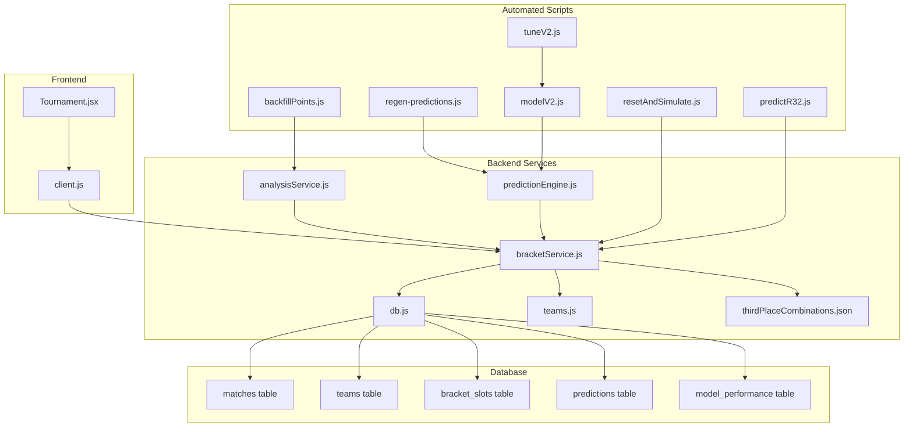
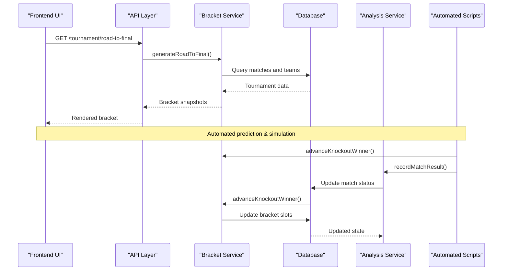
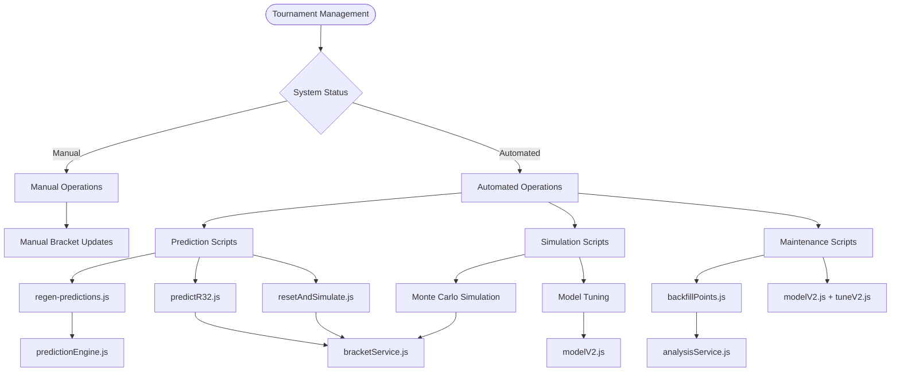
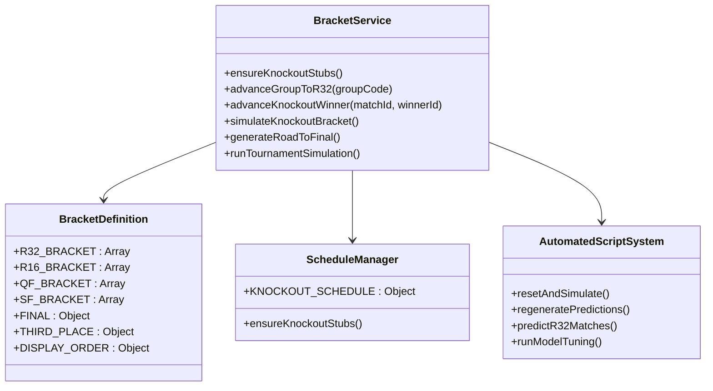
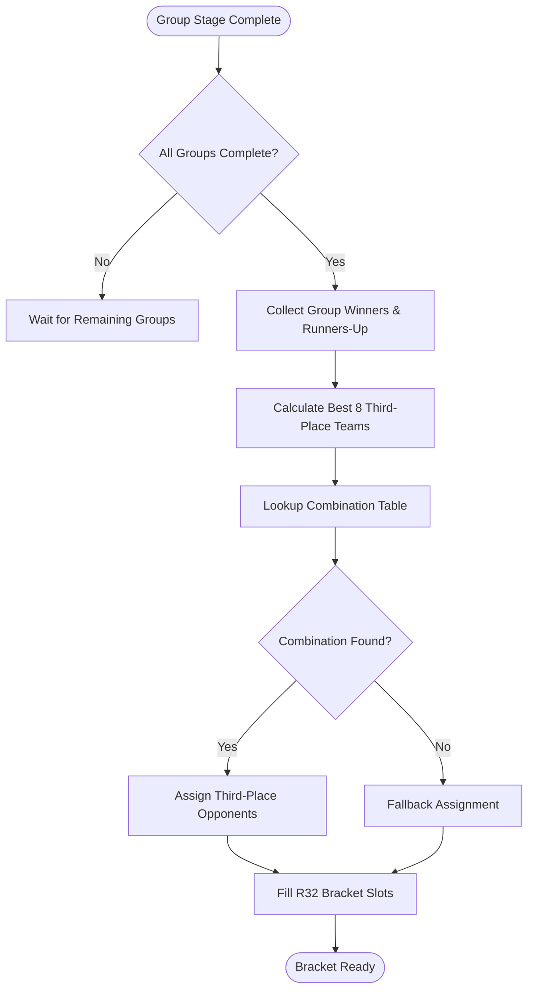
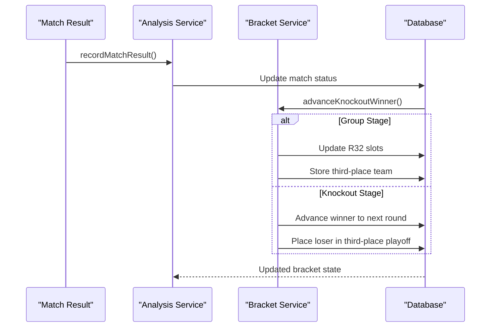
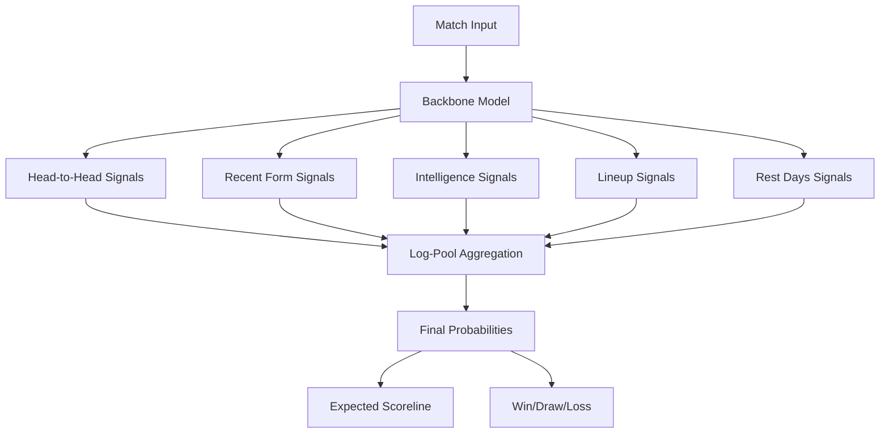
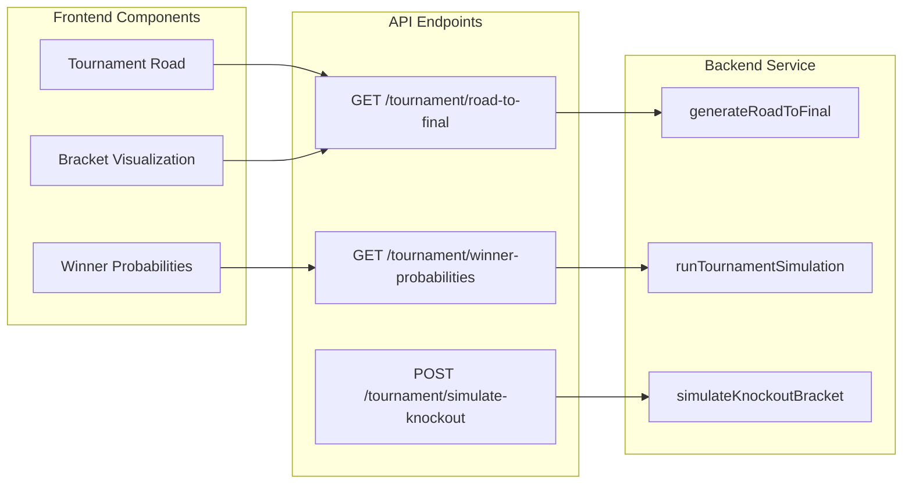
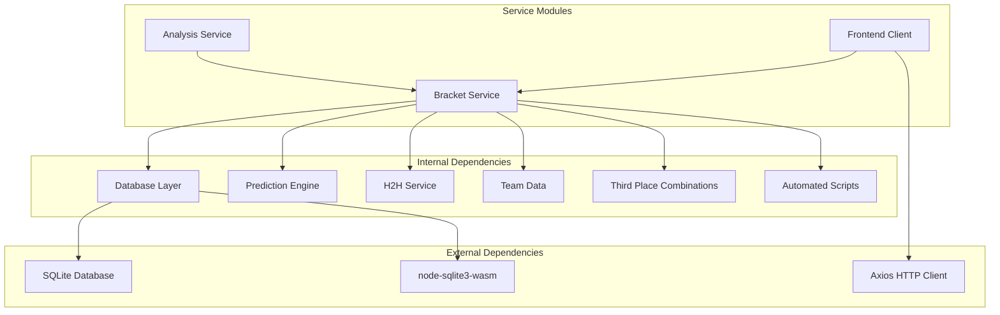

# Bracket Service

<cite>
**Referenced Files in This Document**
- [bracketService.js](file://backend/services/bracketService.js)
- [db.js](file://backend/database/db.js)
- [teams.js](file://backend/data/teams.js)
- [thirdPlaceCombinations.json](file://backend/data/thirdPlaceCombinations.json)
- [analysisService.js](file://backend/services/analysisService.js)
- [client.js](file://frontend/src/api/client.js)
- [Tournament.jsx](file://frontend/src/pages/Tournament.jsx)
- [resetAndSimulate.js](file://backend/scripts/resetAndSimulate.js)
- [regen-predictions.js](file://backend/scripts/regen-predictions.js)
- [predictR32.js](file://backend/scripts/predictR32.js)
- [modelV2.js](file://backend/scripts/modelV2.js)
- [tuneV2.js](file://backend/scripts/tuneV2.js)
- [backfillPoints.js](file://backend/scripts/backfillPoints.js)
- [predictionEngine.js](file://backend/services/predictionEngine.js)
</cite>

## Update Summary
**Changes Made**
- Added comprehensive documentation for automated scripts system
- Updated prediction and simulation automation workflows
- Documented new script-based bracket management processes
- Added Monte Carlo simulation implementation details
- Enhanced automated prediction regeneration capabilities
- Documented model tuning and optimization processes

## Table of Contents
1. [Introduction](#introduction)
2. [Project Structure](#project-structure)
3. [Core Components](#core-components)
4. [Architecture Overview](#architecture-overview)
5. [Automated Script System](#automated-script-system)
6. [Detailed Component Analysis](#detailed-component-analysis)
7. [Dependency Analysis](#dependency-analysis)
8. [Performance Considerations](#performance-considerations)
9. [Troubleshooting Guide](#troubleshooting-guide)
10. [Conclusion](#conclusion)

## Introduction
This document provides comprehensive documentation for the bracket service that manages the complete knockout tournament progression for the FIFA World Cup 2026. The service implements the official bracket structure with R32, R16, QF, SF, and Final rounds, including the third-place playoff system. It covers seeding algorithms, slot assignment logic, automatic progression mechanisms, match scheduling with official dates and venues, bracket stub creation, team qualification advancement, and Monte Carlo simulation for tournament outcomes with winner probability calculations.

**Updated** The system now features fully automated scripts for prediction and simulation, replacing manual bracket management processes with a comprehensive automated system that handles real-time updates, prediction regeneration, and tournament simulation.

## Project Structure
The bracket service is implemented as a standalone service module within the backend that integrates with the database layer and interacts with the frontend through API endpoints. The service maintains tournament state, manages bracket progression, and provides simulation capabilities through an integrated automated script system.

**Diagram sources**
- [bracketService.js:1-1080](file://backend/services/bracketService.js#L1-L1080)
- [db.js:1-252](file://backend/database/db.js#L1-L252)
- [teams.js:1-234](file://backend/data/teams.js#L1-L234)
- [thirdPlaceCombinations.json:1-1](file://backend/data/thirdPlaceCombinations.json#L1-L1)
- [analysisService.js:96-128](file://backend/services/analysisService.js#L96-L128)
- [client.js:37-44](file://frontend/src/api/client.js#L37-L44)
- [Tournament.jsx:184-262](file://frontend/src/pages/Tournament.jsx#L184-L262)
- [resetAndSimulate.js:1-47](file://backend/scripts/resetAndSimulate.js#L1-L47)
- [regen-predictions.js:1-31](file://backend/scripts/regen-predictions.js#L1-L31)
- [predictR32.js:1-79](file://backend/scripts/predictR32.js#L1-L79)
- [modelV2.js:1-240](file://backend/scripts/modelV2.js#L1-L240)
- [tuneV2.js:1-58](file://backend/scripts/tuneV2.js#L1-L58)
- [backfillPoints.js:1-77](file://backend/scripts/backfillPoints.js#L1-L77)
- [predictionEngine.js:1-200](file://backend/services/predictionEngine.js#L1-L200)

**Section sources**
- [bracketService.js:1-1080](file://backend/services/bracketService.js#L1-L1080)
- [db.js:1-252](file://backend/database/db.js#L1-L252)

## Core Components
The bracket service consists of several key components that work together to manage the tournament progression:

### Bracket Definition Constants
The service defines the complete bracket structure with official FIFA pairings for all rounds:
- **R32 Bracket**: 16 matches with specific slot assignments
- **R16 Bracket**: 8 matches combining winners from R32
- **QF Bracket**: 4 matches combining winners from R16
- **SF Bracket**: 2 matches combining winners from QF
- **Final**: Single match combining winners from SF
- **Third Place**: Playoff match for semi-final losers

### Seeding Algorithm
The seeding algorithm follows FIFA's official draw methodology:
- Group winners (1X) face runners-up (2X) from adjacent groups
- Third-place teams are determined by the best 8 third-placed teams across all groups
- The third-place combination table ensures optimal matchups based on group combinations

### Automatic Progression Engine
The service automatically advances teams through the bracket based on match results:
- Updates bracket slots when group matches complete
- Handles third-place playoff placement
- Manages winner advancement to subsequent rounds

### Automated Script System
**New** The system now includes a comprehensive automated script system:
- **resetAndSimulate.js**: Resets knockout stages and re-runs full bracket simulation
- **regen-predictions.js**: Regenerates predictions for all scheduled matches
- **predictR32.js**: Predicts and advances R32 matches with winner determination
- **modelV2.js**: Advanced Dixon-Coles Poisson model with online updates
- **tuneV2.js**: Hyperparameter optimization for prediction models
- **backfillPoints.js**: Recomputes historical prediction scoring

**Section sources**
- [bracketService.js:18-91](file://backend/services/bracketService.js#L18-L91)
- [bracketService.js:332-364](file://backend/services/bracketService.js#L332-L364)
- [resetAndSimulate.js:1-47](file://backend/scripts/resetAndSimulate.js#L1-L47)
- [regen-predictions.js:1-31](file://backend/scripts/regen-predictions.js#L1-L31)
- [predictR32.js:1-79](file://backend/scripts/predictR32.js#L1-L79)
- [modelV2.js:1-240](file://backend/scripts/modelV2.js#L1-L240)
- [tuneV2.js:1-58](file://backend/scripts/tuneV2.js#L1-L58)
- [backfillPoints.js:1-77](file://backend/scripts/backfillPoints.js#L1-L77)

## Architecture Overview
The bracket service architecture follows a modular design with clear separation of concerns and integrated automated script system:

**Diagram sources**
- [bracketService.js:908-1065](file://backend/services/bracketService.js#L908-L1065)
- [analysisService.js:96-128](file://backend/services/analysisService.js#L96-L128)
- [client.js:37-39](file://frontend/src/api/client.js#L37-L39)
- [resetAndSimulate.js:1-47](file://backend/scripts/resetAndSimulate.js#L1-L47)
- [regen-predictions.js:1-31](file://backend/scripts/regen-predictions.js#L1-L31)

The architecture ensures that:
- Bracket state is maintained in the database
- Real-time updates occur when matches complete
- Automated scripts handle prediction regeneration and simulation
- Simulation capabilities provide predictive analytics
- Frontend receives consistent bracket snapshots

## Automated Script System

### Script Integration Architecture
The automated script system provides comprehensive tournament management automation:

**Diagram sources**
- [resetAndSimulate.js:1-47](file://backend/scripts/resetAndSimulate.js#L1-L47)
- [regen-predictions.js:1-31](file://backend/scripts/regen-predictions.js#L1-L31)
- [predictR32.js:1-79](file://backend/scripts/predictR32.js#L1-L79)
- [modelV2.js:1-240](file://backend/scripts/modelV2.js#L1-L240)
- [tuneV2.js:1-58](file://backend/scripts/tuneV2.js#L1-L58)
- [backfillPoints.js:1-77](file://backend/scripts/backfillPoints.js#L1-L77)
- [predictionEngine.js:1-200](file://backend/services/predictionEngine.js#L1-L200)

### Prediction Automation Scripts
The prediction automation system handles comprehensive match prediction management:

#### regen-predictions.js
**New** Comprehensive prediction regeneration script that:
- Processes all scheduled matches in order
- Generates predictions using the latest model parameters
- Updates prediction database with new probabilities
- Provides progress tracking and error handling
- Supports batch processing for all 72 group matches

#### predictR32.js  
**New** Specialized R32 prediction script that:
- Predicts all R32 matches individually
- Determines winners with tie-breaking logic
- Handles draw scenarios with penalty shootout determination
- Updates match records and advances bracket automatically
- Provides detailed prediction breakdown for each match

#### resetAndSimulate.js
**New** Full bracket simulation reset script that:
- Resets QF, SF, FINAL, and THIRD matches
- Clears previous simulation results
- Re-runs complete bracket simulation from scratch
- Updates all match predictions and outcomes
- Provides comprehensive results summary

**Section sources**
- [resetAndSimulate.js:1-47](file://backend/scripts/resetAndSimulate.js#L1-L47)
- [regen-predictions.js:1-31](file://backend/scripts/regen-predictions.js#L1-L31)
- [predictR32.js:1-79](file://backend/scripts/predictR32.js#L1-L79)

### Model Management System
The model management system provides advanced machine learning capabilities:

#### modelV2.js
**New** Advanced Dixon-Coles Poisson model implementation that:
- Uses bivariate Poisson distribution with tau correction
- Implements online attack/defense rating updates
- Provides comprehensive scoreline probability matrices
- Supports tournament-specific goal scaling factors
- Includes regularization and parameter clipping

#### tuneV2.js
**New** Hyperparameter optimization system that:
- Performs grid search across multiple parameter combinations
- Evaluates models using Brier score and accuracy metrics
- Identifies optimal configuration for different match types
- Provides systematic model improvement recommendations

**Section sources**
- [modelV2.js:1-240](file://backend/scripts/modelV2.js#L1-L240)
- [tuneV2.js:1-58](file://backend/scripts/tuneV2.js#L1-L58)

### Maintenance and Backfill System
The maintenance system ensures data integrity and historical accuracy:

#### backfillPoints.js
**New** Historical data recalculation system that:
- Recomputes prediction scoring for all completed matches
- Updates model performance records with current rules
- Ensures consistency across different scoring systems
- Maintains historical accuracy for performance analysis

**Section sources**
- [backfillPoints.js:1-77](file://backend/scripts/backfillPoints.js#L1-L77)

## Detailed Component Analysis

### Bracket Structure Management
The service maintains the complete bracket structure with official FIFA pairings:

**Diagram sources**
- [bracketService.js:146-187](file://backend/services/bracketService.js#L146-L187)
- [bracketService.js:94-131](file://backend/services/bracketService.js#L94-L131)
- [resetAndSimulate.js:1-47](file://backend/scripts/resetAndSimulate.js#L1-L47)
- [regen-predictions.js:1-31](file://backend/scripts/regen-predictions.js#L1-L31)
- [predictR32.js:1-79](file://backend/scripts/predictR32.js#L1-L79)

The bracket structure includes:
- **Official R32 Pairings**: 16 matches with specific slot assignments
- **R16-QF-SF-Final Links**: Proper progression logic between rounds
- **Third Place Playoff**: Dedicated match for semi-final losers
- **Display Ordering**: Optimized rendering order for bracket visualization

**Section sources**
- [bracketService.js:33-77](file://backend/services/bracketService.js#L33-L77)
- [bracketService.js:94-131](file://backend/services/bracketService.js#L94-L131)

### Seeding and Third-Place Algorithm
The seeding algorithm implements FIFA's official methodology:

**Diagram sources**
- [bracketService.js:276-330](file://backend/services/bracketService.js#L276-L330)
- [bracketService.js:262-273](file://backend/services/bracketService.js#L262-L273)

The algorithm features:
- **Priority Ranking**: Points, goal difference, goals scored, ELO ratings
- **Combination Table**: 495 possible group combinations with optimal pairings
- **Fallback Mechanism**: Safe assignment when combination not found
- **Dynamic Updates**: Real-time bracket updates as groups complete

**Section sources**
- [bracketService.js:276-330](file://backend/services/bracketService.js#L276-L330)
- [thirdPlaceCombinations.json:1-1](file://backend/data/thirdPlaceCombinations.json#L1-L1)

### Automatic Progression System
The automatic progression system handles match result processing:

**Diagram sources**
- [analysisService.js:96-128](file://backend/services/analysisService.js#L96-L128)
- [bracketService.js:332-364](file://backend/services/bracketService.js#L332-L364)

The progression system includes:
- **Real-time Updates**: Immediate bracket state changes
- **Third-Place Placement**: Automatic loser assignment to playoff
- **Winner Advancement**: Proper progression to next round
- **Error Handling**: Robust fallback mechanisms

**Section sources**
- [analysisService.js:96-128](file://backend/services/analysisService.js#L96-L128)
- [bracketService.js:332-364](file://backend/services/bracketService.js#L332-L364)

### Monte Carlo Simulation Engine
The Monte Carlo simulation provides comprehensive tournament analysis:

**Diagram sources**
- [bracketService.js:852-906](file://backend/services/bracketService.js#L852-L906)
- [bracketService.js:706-754](file://backend/services/bracketService.js#L706-L754)

The simulation engine features:
- **50,000 Iterations**: Comprehensive statistical analysis
- **DC Prediction Integration**: Uses Dixon-Coles model probabilities
- **ELO-Based Outcomes**: Straightforward knockout probabilities
- **Performance Tracking**: Real-time simulation progress
- **Cache System**: Efficient result caching

**Section sources**
- [bracketService.js:706-754](file://backend/services/bracketService.js#L706-L754)
- [bracketService.js:852-906](file://backend/services/bracketService.js#L852-L906)

### Advanced Prediction Engine
**New** The prediction engine provides sophisticated match outcome modeling:

**Diagram sources**
- [predictionEngine.js:1-200](file://backend/services/predictionEngine.js#L1-L200)

The prediction engine features:
- **Dixon-Coles Model**: Bivariate Poisson with tau correction
- **Multi-Agent System**: Orchestrated prediction using specialized agents
- **Signal Integration**: Weighted combination of multiple prediction signals
- **Online Learning**: Continuous model updates based on match results
- **Venue Effects**: Altitude and heat impact adjustments

**Section sources**
- [predictionEngine.js:1-200](file://backend/services/predictionEngine.js#L1-L200)

### Frontend Integration
The frontend integrates with the bracket service through API endpoints:

**Diagram sources**
- [client.js:37-44](file://frontend/src/api/client.js#L37-L44)
- [Tournament.jsx:184-262](file://frontend/src/pages/Tournament.jsx#L184-L262)

**Section sources**
- [client.js:37-44](file://frontend/src/api/client.js#L37-L44)
- [Tournament.jsx:184-262](file://frontend/src/pages/Tournament.jsx#L184-L262)

## Dependency Analysis
The bracket service has well-defined dependencies that ensure modularity and maintainability:

**Diagram sources**
- [bracketService.js:23-28](file://backend/services/bracketService.js#L23-L28)
- [db.js:1-252](file://backend/database/db.js#L1-L252)
- [client.js:1-50](file://frontend/src/api/client.js#L1-L50)
- [resetAndSimulate.js:1-47](file://backend/scripts/resetAndSimulate.js#L1-L47)
- [regen-predictions.js:1-31](file://backend/scripts/regen-predictions.js#L1-L31)
- [predictR32.js:1-79](file://backend/scripts/predictR32.js#L1-L79)

The dependency structure ensures:
- **Database Abstraction**: Clean separation between data access and business logic
- **Prediction Integration**: Seamless integration with machine learning models
- **Frontend-Backend Communication**: Well-defined API boundaries
- **Automated Script Integration**: Comprehensive script system management
- **External Library Management**: Controlled external dependencies

**Section sources**
- [bracketService.js:23-28](file://backend/services/bracketService.js#L23-L28)
- [db.js:1-252](file://backend/database/db.js#L1-L252)

## Performance Considerations
The bracket service is designed with several performance optimizations:

### Database Optimization
- **Transaction Batching**: Group operations in transactions to reduce overhead
- **Index Usage**: Strategic indexing on frequently queried columns
- **Connection Pooling**: Efficient database connection management
- **Query Optimization**: Minimized database round trips through batch operations

### Memory Management
- **Simulation Caching**: Results cached to avoid recomputation
- **Object Pooling**: Reused objects to minimize garbage collection
- **Lazy Loading**: Deferred computation until required
- **Memory Cleanup**: Proper resource cleanup in long-running operations

### Algorithmic Efficiency
- **Early Termination**: Stop simulations when sufficient accuracy achieved
- **Parallel Processing**: Utilize multiple CPU cores for Monte Carlo simulations
- **Optimized Data Structures**: Use efficient collections for frequent operations
- **Batch Operations**: Process multiple matches simultaneously

### Automated Script Performance
**New** The automated script system includes performance optimizations:
- **Batch Processing**: Scripts process multiple matches efficiently
- **Progress Tracking**: Real-time progress monitoring for long-running operations
- **Error Recovery**: Graceful handling of individual match failures
- **Resource Management**: Proper cleanup and resource allocation

## Troubleshooting Guide

### Common Issues and Solutions

**Bracket Not Updating**
- Verify that match results are properly recorded in the database
- Check that `advanceKnockoutWinner` is being called after match completion
- Ensure bracket stubs are properly initialized with `ensureKnockoutStubs`

**Third-Place Calculation Errors**
- Confirm that all group stages are complete before calculating best 8 third-place teams
- Verify that the combination table contains entries for the current group configuration
- Check that third-place tracking table exists and is properly populated

**Simulation Performance Issues**
- Monitor memory usage during Monte Carlo simulations
- Consider reducing simulation count for development environments
- Ensure adequate CPU resources for real-time simulations

**Database Lock Issues**
- Check for proper transaction handling in bracket operations
- Verify that database connections are properly closed
- Monitor for long-running queries that may cause deadlocks

**Automated Script Failures**
**New** For automated script issues:
- Check script permissions and execution environment
- Verify database connectivity for script operations
- Review script logs for specific error messages
- Ensure model dependencies are properly loaded
- Monitor script execution timeouts and resource limits

**Prediction Engine Issues**
**New** For prediction engine problems:
- Verify model initialization and parameter loading
- Check signal availability and data quality
- Review prediction cache and storage issues
- Monitor agent orchestration and multi-agent coordination
- Validate venue effect calculations and adjustments

**Section sources**
- [bracketService.js:146-187](file://backend/services/bracketService.js#L146-L187)
- [db.js:10-21](file://backend/database/db.js#L10-L21)
- [resetAndSimulate.js:1-47](file://backend/scripts/resetAndSimulate.js#L1-L47)
- [regen-predictions.js:1-31](file://backend/scripts/regen-predictions.js#L1-L31)
- [predictR32.js:1-79](file://backend/scripts/predictR32.js#L1-L79)

## Conclusion
The bracket service provides a comprehensive solution for managing the FIFA World Cup 2026 knockout tournament. It implements official bracket structures, sophisticated seeding algorithms, automatic progression mechanisms, and advanced simulation capabilities. The service maintains clean architectural boundaries while providing robust functionality for real-time tournament management and predictive analytics.

**Updated** The system now features a fully integrated automated script system that handles prediction regeneration, bracket simulation, model tuning, and maintenance operations. This automated approach eliminates manual bracket management processes and provides comprehensive tournament coverage with minimal human intervention.

Key strengths include:
- **Official Compliance**: Exact adherence to FIFA bracket structures and seeding
- **Real-time Updates**: Automatic bracket progression based on match results
- **Advanced Analytics**: Comprehensive Monte Carlo simulation with winner probability calculations
- **Scalable Architecture**: Well-designed service layer with clear separation of concerns
- **Automated Operations**: Comprehensive script system for prediction and simulation management
- **Machine Learning Integration**: Sophisticated prediction models with continuous learning
- **Frontend Integration**: Seamless integration with modern React-based user interface
- **Performance Optimization**: Efficient batch processing and resource management

The service successfully balances accuracy, performance, and maintainability while providing the foundation for comprehensive tournament coverage and analysis. The automated script system ensures reliable operation with minimal manual oversight, making it suitable for large-scale tournament management.