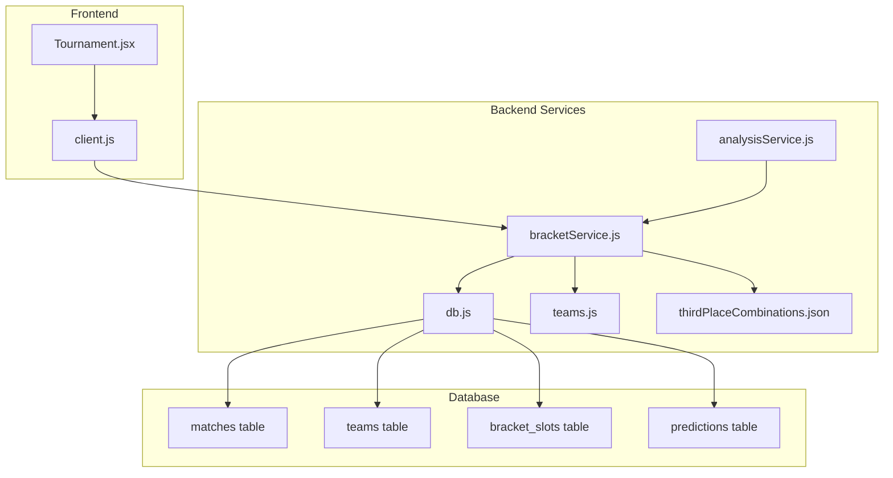
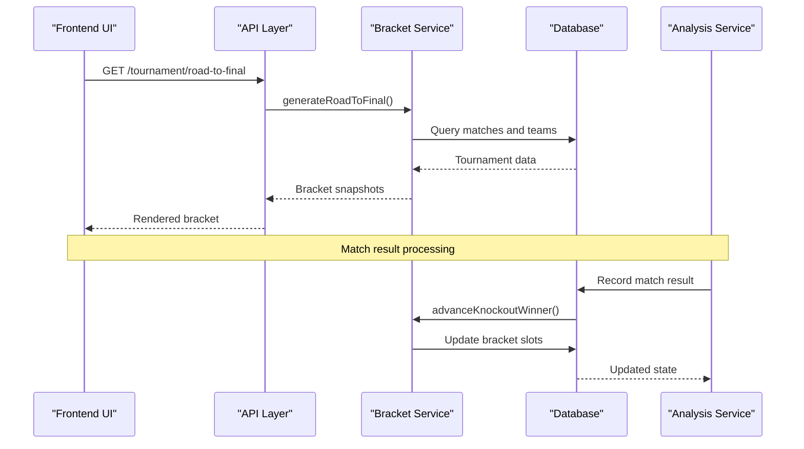
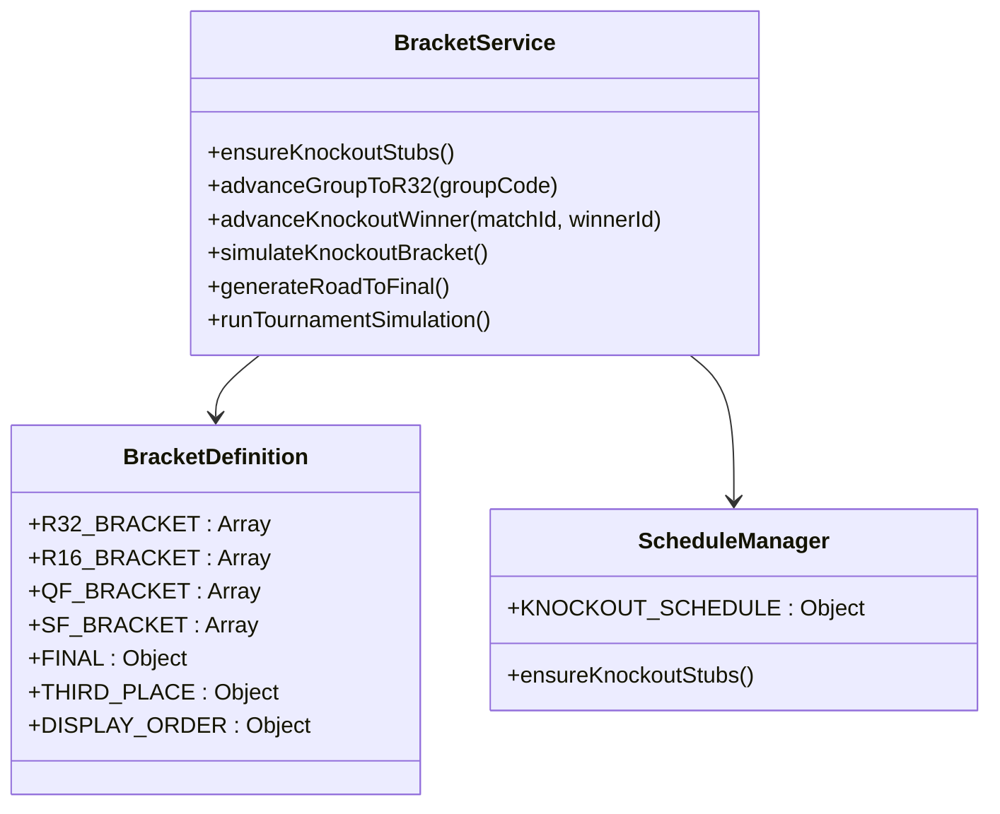
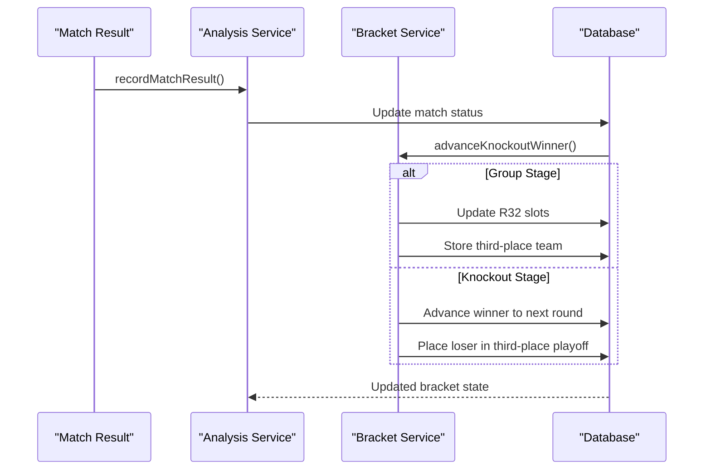
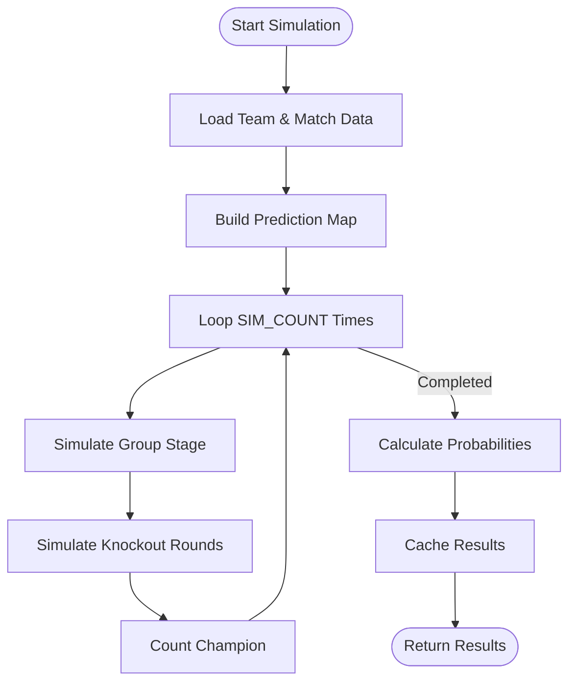
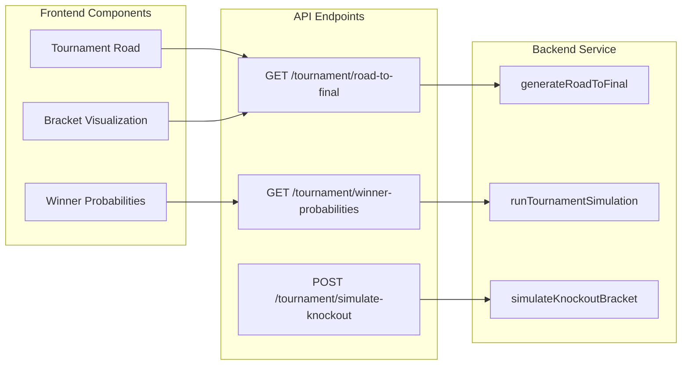
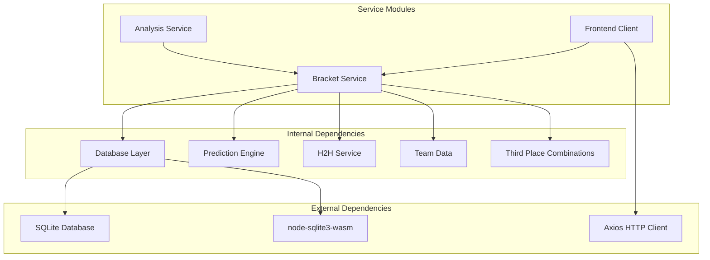

# Bracket Service

<cite>
**Referenced Files in This Document**
- [bracketService.js](file://backend/services/bracketService.js)
- [db.js](file://backend/database/db.js)
- [teams.js](file://backend/data/teams.js)
- [thirdPlaceCombinations.json](file://backend/data/thirdPlaceCombinations.json)
- [analysisService.js](file://backend/services/analysisService.js)
- [client.js](file://frontend/src/api/client.js)
- [Tournament.jsx](file://frontend/src/pages/Tournament.jsx)
</cite>

## Table of Contents
1. [Introduction](#introduction)
2. [Project Structure](#project-structure)
3. [Core Components](#core-components)
4. [Architecture Overview](#architecture-overview)
5. [Detailed Component Analysis](#detailed-component-analysis)
6. [Dependency Analysis](#dependency-analysis)
7. [Performance Considerations](#performance-considerations)
8. [Troubleshooting Guide](#troubleshooting-guide)
9. [Conclusion](#conclusion)

## Introduction
This document provides comprehensive documentation for the bracket service that manages the complete knockout tournament progression for the FIFA World Cup 2026. The service implements the official bracket structure with R32, R16, QF, SF, and Final rounds, including the third-place playoff system. It covers seeding algorithms, slot assignment logic, automatic progression mechanisms, match scheduling with official dates and venues, bracket stub creation, team qualification advancement, and Monte Carlo simulation for tournament outcomes with winner probability calculations.

## Project Structure
The bracket service is implemented as a standalone service module within the backend that integrates with the database layer and interacts with the frontend through API endpoints. The service maintains tournament state, manages bracket progression, and provides simulation capabilities.

**Diagram sources**
- [bracketService.js:1-1080](file://backend/services/bracketService.js#L1-L1080)
- [db.js:1-252](file://backend/database/db.js#L1-L252)
- [teams.js:1-234](file://backend/data/teams.js#L1-L234)
- [thirdPlaceCombinations.json:1-1](file://backend/data/thirdPlaceCombinations.json#L1-L1)
- [analysisService.js:96-128](file://backend/services/analysisService.js#L96-L128)
- [client.js:37-44](file://frontend/src/api/client.js#L37-L44)
- [Tournament.jsx:184-262](file://frontend/src/pages/Tournament.jsx#L184-L262)

**Section sources**
- [bracketService.js:1-1080](file://backend/services/bracketService.js#L1-L1080)
- [db.js:1-252](file://backend/database/db.js#L1-L252)

## Core Components
The bracket service consists of several key components that work together to manage the tournament progression:

### Bracket Definition Constants
The service defines the complete bracket structure with official FIFA pairings for all rounds:
- **R32 Bracket**: 16 matches with specific slot assignments
- **R16 Bracket**: 8 matches combining winners from R32
- **QF Bracket**: 4 matches combining winners from R16
- **SF Bracket**: 2 matches combining winners from QF
- **Final**: Single match combining winners from SF
- **Third Place**: Playoff match for semi-final losers

### Seeding Algorithm
The seeding algorithm follows FIFA's official draw methodology:
- Group winners (1X) face runners-up (2X) from adjacent groups
- Third-place teams are determined by the best 8 third-placed teams across all groups
- The third-place combination table ensures optimal matchups based on group combinations

### Automatic Progression Engine
The service automatically advances teams through the bracket based on match results:
- Updates bracket slots when group matches complete
- Handles third-place playoff placement
- Manages winner advancement to subsequent rounds

**Section sources**
- [bracketService.js:18-91](file://backend/services/bracketService.js#L18-L91)
- [bracketService.js:332-364](file://backend/services/bracketService.js#L332-L364)

## Architecture Overview
The bracket service architecture follows a modular design with clear separation of concerns:

**Diagram sources**
- [bracketService.js:908-1065](file://backend/services/bracketService.js#L908-L1065)
- [analysisService.js:96-128](file://backend/services/analysisService.js#L96-L128)
- [client.js:37-39](file://frontend/src/api/client.js#L37-L39)

The architecture ensures that:
- Bracket state is maintained in the database
- Real-time updates occur when matches complete
- Simulation capabilities provide predictive analytics
- Frontend receives consistent bracket snapshots

## Detailed Component Analysis

### Bracket Structure Management
The service maintains the complete bracket structure with official FIFA pairings:

**Diagram sources**
- [bracketService.js:146-187](file://backend/services/bracketService.js#L146-L187)
- [bracketService.js:94-131](file://backend/services/bracketService.js#L94-L131)

The bracket structure includes:
- **Official R32 Pairings**: 16 matches with specific slot assignments
- **R16-QF-SF-Final Links**: Proper progression logic between rounds
- **Third Place Playoff**: Dedicated match for semi-final losers
- **Display Ordering**: Optimized rendering order for bracket visualization

**Section sources**
- [bracketService.js:33-77](file://backend/services/bracketService.js#L33-L77)
- [bracketService.js:94-131](file://backend/services/bracketService.js#L94-L131)

### Seeding and Third-Place Algorithm
The seeding algorithm implements FIFA's official methodology:

**Diagram sources**
- [bracketService.js:276-330](file://backend/services/bracketService.js#L276-L330)
- [bracketService.js:262-273](file://backend/services/bracketService.js#L262-L273)

The algorithm features:
- **Priority Ranking**: Points, goal difference, goals scored, ELO ratings
- **Combination Table**: 495 possible group combinations with optimal pairings
- **Fallback Mechanism**: Safe assignment when combination not found
- **Dynamic Updates**: Real-time bracket updates as groups complete

**Section sources**
- [bracketService.js:276-330](file://backend/services/bracketService.js#L276-L330)
- [thirdPlaceCombinations.json:1-1](file://backend/data/thirdPlaceCombinations.json#L1-L1)

### Automatic Progression System
The automatic progression system handles match result processing:

**Diagram sources**
- [analysisService.js:96-128](file://backend/services/analysisService.js#L96-L128)
- [bracketService.js:332-364](file://backend/services/bracketService.js#L332-L364)

The progression system includes:
- **Real-time Updates**: Immediate bracket state changes
- **Third-Place Placement**: Automatic loser assignment to playoff
- **Winner Advancement**: Proper progression to next round
- **Error Handling**: Robust fallback mechanisms

**Section sources**
- [analysisService.js:96-128](file://backend/services/analysisService.js#L96-L128)
- [bracketService.js:332-364](file://backend/services/bracketService.js#L332-L364)

### Monte Carlo Simulation Engine
The Monte Carlo simulation provides comprehensive tournament analysis:

**Diagram sources**
- [bracketService.js:852-906](file://backend/services/bracketService.js#L852-L906)
- [bracketService.js:706-754](file://backend/services/bracketService.js#L706-L754)

The simulation engine features:
- **50,000 Iterations**: Comprehensive statistical analysis
- **DC Prediction Integration**: Uses Dixon-Coles model probabilities
- **ELO-Based Outcomes**: Straightforward knockout probabilities
- **Performance Tracking**: Real-time simulation progress
- **Cache System**: Efficient result caching

**Section sources**
- [bracketService.js:706-754](file://backend/services/bracketService.js#L706-L754)
- [bracketService.js:852-906](file://backend/services/bracketService.js#L852-L906)

### Frontend Integration
The frontend integrates with the bracket service through API endpoints:

**Diagram sources**
- [client.js:37-44](file://frontend/src/api/client.js#L37-L44)
- [Tournament.jsx:184-262](file://frontend/src/pages/Tournament.jsx#L184-L262)

**Section sources**
- [client.js:37-44](file://frontend/src/api/client.js#L37-L44)
- [Tournament.jsx:184-262](file://frontend/src/pages/Tournament.jsx#L184-L262)

## Dependency Analysis
The bracket service has well-defined dependencies that ensure modularity and maintainability:

**Diagram sources**
- [bracketService.js:23-28](file://backend/services/bracketService.js#L23-L28)
- [db.js:1-252](file://backend/database/db.js#L1-L252)
- [client.js:1-50](file://frontend/src/api/client.js#L1-L50)

The dependency structure ensures:
- **Database Abstraction**: Clean separation between data access and business logic
- **Prediction Integration**: Seamless integration with machine learning models
- **Frontend-Backend Communication**: Well-defined API boundaries
- **External Library Management**: Controlled external dependencies

**Section sources**
- [bracketService.js:23-28](file://backend/services/bracketService.js#L23-L28)
- [db.js:1-252](file://backend/database/db.js#L1-L252)

## Performance Considerations
The bracket service is designed with several performance optimizations:

### Database Optimization
- **Transaction Batching**: Group operations in transactions to reduce overhead
- **Index Usage**: Strategic indexing on frequently queried columns
- **Connection Pooling**: Efficient database connection management
- **Query Optimization**: Minimized database round trips through batch operations

### Memory Management
- **Simulation Caching**: Results cached to avoid recomputation
- **Object Pooling**: Reused objects to minimize garbage collection
- **Lazy Loading**: Deferred computation until required
- **Memory Cleanup**: Proper resource cleanup in long-running operations

### Algorithmic Efficiency
- **Early Termination**: Stop simulations when sufficient accuracy achieved
- **Parallel Processing**: Utilize multiple CPU cores for Monte Carlo simulations
- **Optimized Data Structures**: Use efficient collections for frequent operations
- **Batch Operations**: Process multiple matches simultaneously

## Troubleshooting Guide

### Common Issues and Solutions

**Bracket Not Updating**
- Verify that match results are properly recorded in the database
- Check that `advanceKnockoutWinner` is being called after match completion
- Ensure bracket stubs are properly initialized with `ensureKnockoutStubs`

**Third-Place Calculation Errors**
- Confirm that all group stages are complete before calculating best 8 third-place teams
- Verify that the combination table contains entries for the current group configuration
- Check that third-place tracking table exists and is properly populated

**Simulation Performance Issues**
- Monitor memory usage during Monte Carlo simulations
- Consider reducing simulation count for development environments
- Ensure adequate CPU resources for real-time simulations

**Database Lock Issues**
- Check for proper transaction handling in bracket operations
- Verify that database connections are properly closed
- Monitor for long-running queries that may cause deadlocks

**Section sources**
- [bracketService.js:146-187](file://backend/services/bracketService.js#L146-L187)
- [db.js:10-21](file://backend/database/db.js#L10-L21)

## Conclusion
The bracket service provides a comprehensive solution for managing the FIFA World Cup 2026 knockout tournament. It implements official bracket structures, sophisticated seeding algorithms, automatic progression mechanisms, and advanced simulation capabilities. The service maintains clean architectural boundaries while providing robust functionality for real-time tournament management and predictive analytics.

Key strengths include:
- **Official Compliance**: Exact adherence to FIFA bracket structures and seeding
- **Real-time Updates**: Automatic bracket progression based on match results
- **Advanced Analytics**: Comprehensive Monte Carlo simulation with winner probability calculations
- **Scalable Architecture**: Well-designed service layer with clear separation of concerns
- **Frontend Integration**: Seamless integration with modern React-based user interface

The service successfully balances accuracy, performance, and maintainability while providing the foundation for comprehensive tournament coverage and analysis.