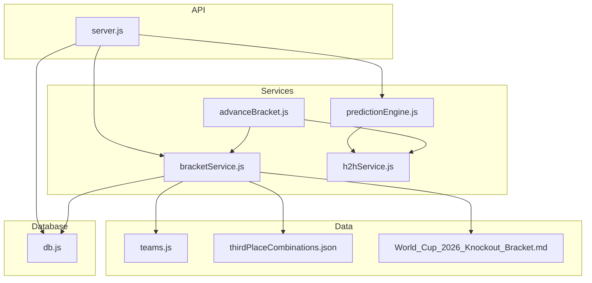
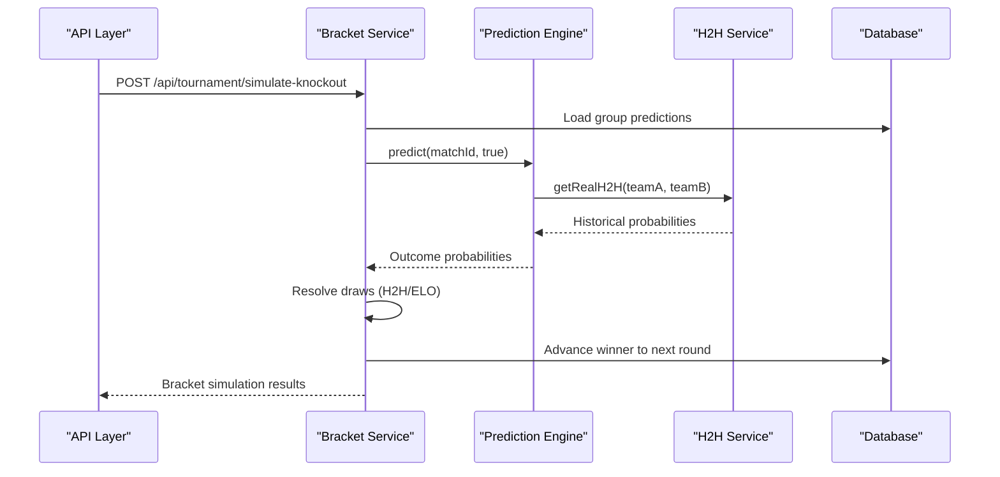
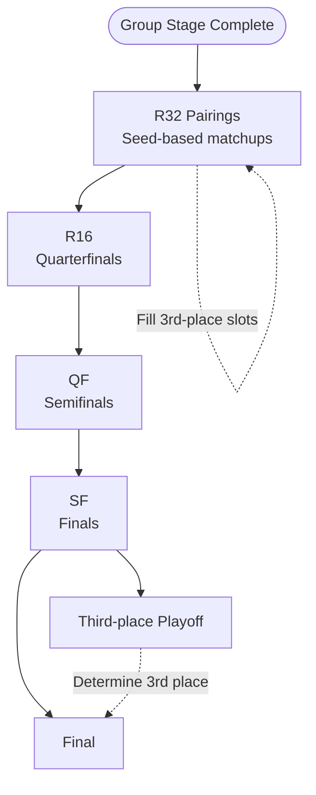
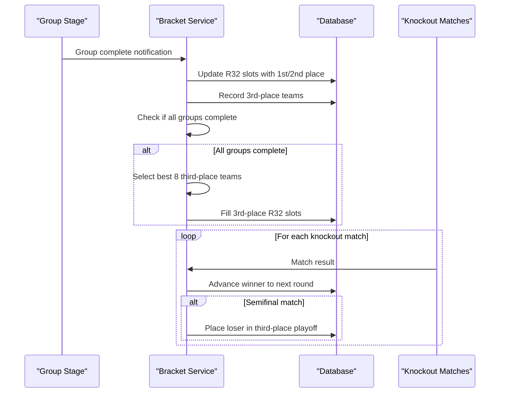
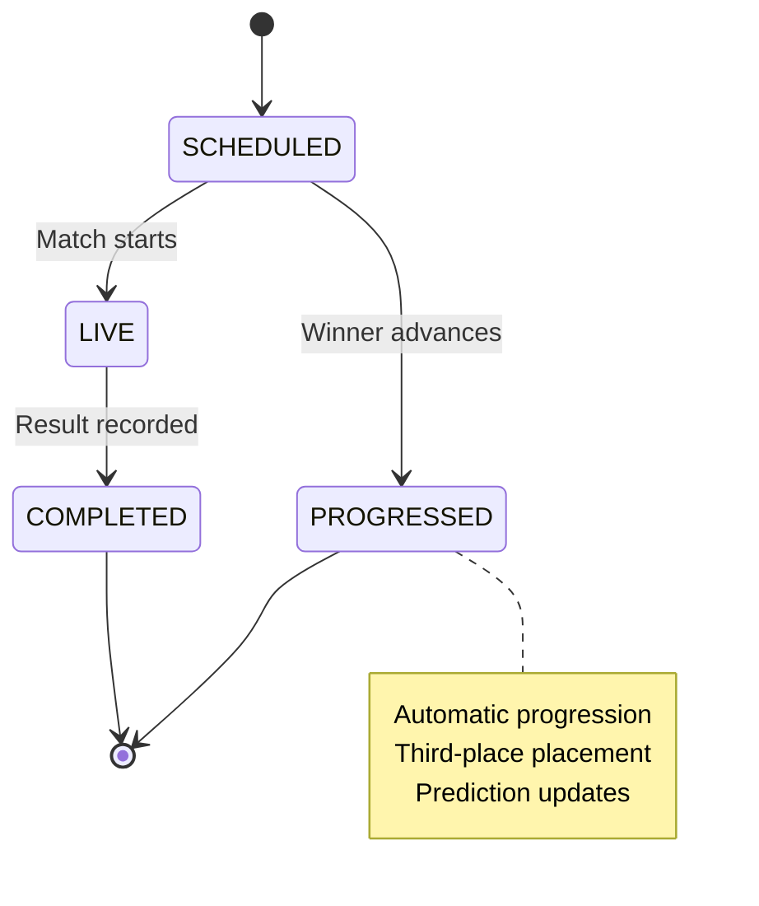
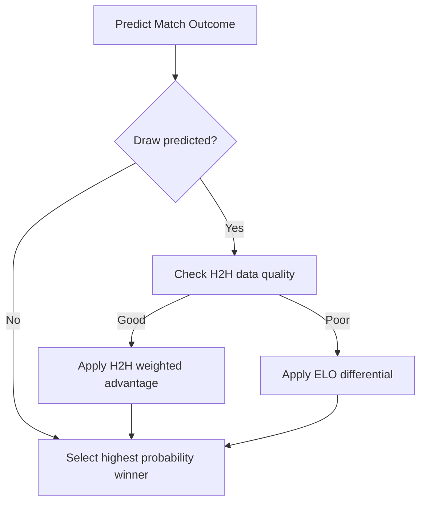
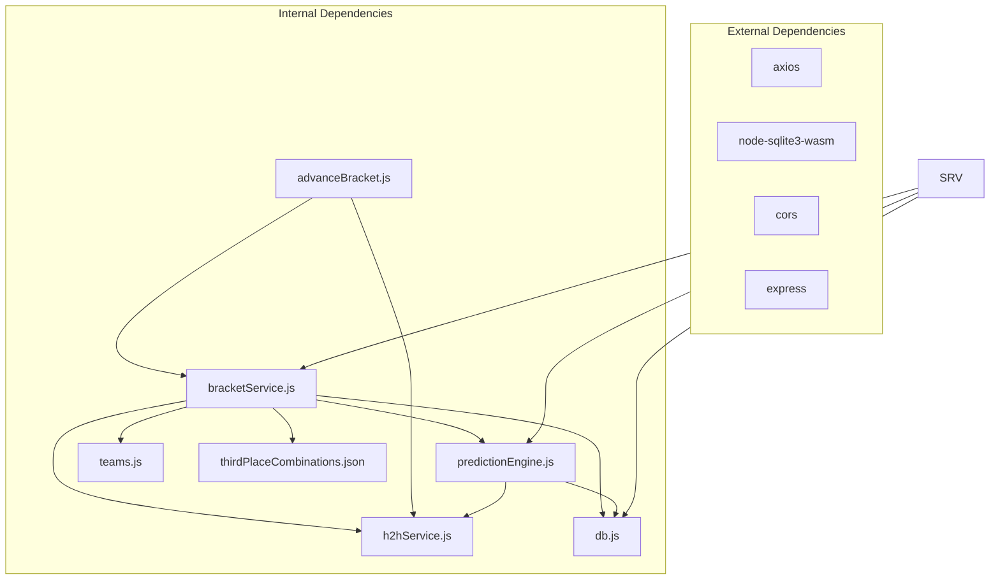

# Knockout Bracket System

<cite>
**Referenced Files in This Document**
- [bracketService.js](file://backend/services/bracketService.js)
- [advanceBracket.js](file://backend/scripts/advanceBracket.js)
- [teams.js](file://backend/data/teams.js)
- [db.js](file://backend/database/db.js)
- [predictionEngine.js](file://backend/services/predictionEngine.js)
- [h2hService.js](file://backend/services/h2hService.js)
- [server.js](file://backend/server.js)
- [World_Cup_2026_Knockout_Bracket.md](file://World_Cup_2026_Knockout_Bracket.md)
- [thirdPlaceCombinations.json](file://backend/data/thirdPlaceCombinations.json)
</cite>

## Table of Contents
1. [Introduction](#introduction)
2. [Project Structure](#project-structure)
3. [Core Components](#core-components)
4. [Architecture Overview](#architecture-overview)
5. [Detailed Component Analysis](#detailed-component-analysis)
6. [Dependency Analysis](#dependency-analysis)
7. [Performance Considerations](#performance-considerations)
8. [Troubleshooting Guide](#troubleshooting-guide)
9. [Conclusion](#conclusion)

## Introduction
This document provides comprehensive documentation for the knockout bracket system used in the 2026 FIFA World Cup simulation platform. It covers the complete tournament progression from Round of 32 through finals, including bracket structure with official FIFA 2026 pairings, seeding rules, automatic progression algorithms, third-place playoff mechanism, real-time updates, prediction engine integration, display ordering, official schedule, tiebreaker models, and database schema.

## Project Structure
The knockout bracket system spans several backend modules:
- Services: bracket progression logic, prediction engine, head-to-head service
- Data: team rosters, third-place combinations, schedule
- Database: schema for matches, teams, predictions, bracket slots
- Scripts: automated bracket advancement
- API: endpoints for bracket data, simulations, and real-time updates



**Diagram sources**
- [bracketService.js:1-1080](file://backend/services/bracketService.js#L1-L1080)
- [advanceBracket.js:1-212](file://backend/scripts/advanceBracket.js#L1-L212)
- [teams.js:1-234](file://backend/data/teams.js#L1-L234)
- [db.js:1-252](file://backend/database/db.js#L1-L252)
- [predictionEngine.js:1-1046](file://backend/services/predictionEngine.js#L1-L1046)
- [h2hService.js:1-315](file://backend/services/h2hService.js#L1-L315)
- [server.js:1-724](file://backend/server.js#L1-L724)

**Section sources**
- [bracketService.js:1-1080](file://backend/services/bracketService.js#L1-L1080)
- [server.js:463-512](file://backend/server.js#L463-L512)

## Core Components
The knockout bracket system consists of five primary components:

### Bracket Service
Handles bracket initialization, group-to-R32 advancement, third-place selection, knockout progression, and simulation workflows. Implements official FIFA 2026 pairings with seed-based matchups and maintains bracket slot definitions.

### Prediction Engine
Provides probabilistic match outcomes using a Dixon-Coles bivariate Poisson model with adjustment signals (H2H, form, lineup, rest days). Powers both real-time predictions and bracket simulations.

### Head-to-Head Service
Maintains historical international results database and computes weighted probabilities based on competition importance and recency.

### Third-Place Combinations
JSON mapping defining which third-place teams face which winner slots in R32, ensuring optimal cross-group matchups.

### Database Schema
SQLite schema supporting teams, matches, predictions, bracket slots, and progress tracking with proper constraints and indexes.

**Section sources**
- [bracketService.js:1-1080](file://backend/services/bracketService.js#L1-L1080)
- [predictionEngine.js:1-1046](file://backend/services/predictionEngine.js#L1-L1046)
- [h2hService.js:1-315](file://backend/services/h2hService.js#L1-L315)
- [db.js:23-209](file://backend/database/db.js#L23-L209)
- [thirdPlaceCombinations.json:1-1](file://backend/data/thirdPlaceCombinations.json#L1-L1)

## Architecture Overview
The system follows a layered architecture with clear separation between data access, business logic, and presentation:



**Diagram sources**
- [server.js:501-512](file://backend/server.js#L501-L512)
- [bracketService.js:485-704](file://backend/services/bracketService.js#L485-L704)
- [predictionEngine.js:691-800](file://backend/services/predictionEngine.js#L691-L800)
- [h2hService.js:272-312](file://backend/services/h2hService.js#L272-L312)

## Detailed Component Analysis

### Bracket Structure and Seeding
The system implements FIFA 2026 official bracket with seed-based pairings:

#### R32 Pairings
- Winner vs Runner-up from adjacent groups
- Third-place slots assigned via official combination table
- Fixed bracket with no reseeding after group stage completion

#### Knockout Rounds
- R16: Winners from R32 pairings
- QF: Winners from R16 pairings  
- SF: Winners from QF pairings
- Final: Winners from SF pairings
- Third-place: Losers from SF pairings



**Diagram sources**
- [bracketService.js:33-77](file://backend/services/bracketService.js#L33-L77)
- [World_Cup_2026_Knockout_Bracket.md:1-51](file://World_Cup_2026_Knockout_Bracket.md#L1-L51)

**Section sources**
- [bracketService.js:33-131](file://backend/services/bracketService.js#L33-L131)
- [World_Cup_2026_Knockout_Bracket.md:1-51](file://World_Cup_2026_Knockout_Bracket.md#L1-L51)

### Automatic Progression Algorithms
The system automates bracket progression through three key mechanisms:

#### Group-to-R32 Advancement
- Detects completed groups and advances first/second place teams
- Records third-place teams for later selection
- Updates R32 match slots with qualified teams

#### Knockout Match Resolution
- Advances winners to next round automatically
- Places losers in third-place playoff for semifinal matches
- Respects existing results when reprocessing

#### Third-Place Selection
- Ranks third-place teams by points, goal difference, goals scored, and ELO
- Uses official combination table for optimal matchups
- Falls back to ranking order when combination not found



**Diagram sources**
- [bracketService.js:209-364](file://backend/services/bracketService.js#L209-L364)
- [bracketService.js:275-330](file://backend/services/bracketService.js#L275-L330)

**Section sources**
- [bracketService.js:209-364](file://backend/services/bracketService.js#L209-L364)
- [bracketService.js:275-330](file://backend/services/bracketService.js#L275-L330)

### Third-Place Playoff Mechanism
The third-place playoff serves as a consolation match for semifinal losers:

#### Implementation Details
- Automatically places semifinal losers into third-place match
- Uses same prediction engine as other knockout rounds
- Determined by match result rather than separate tiebreaker logic

#### Display and Scheduling
- Scheduled for July 18, 2026 at Hard Rock Stadium, Miami
- Listed as "THIRD" match in bracket structure
- Receives same prediction treatment as other knockout rounds

**Section sources**
- [bracketService.js:77-131](file://backend/services/bracketService.js#L77-L131)
- [bracketService.js:635-641](file://backend/services/bracketService.js#L635-L641)

### Real-Time Bracket Updates
The system provides real-time bracket updates through multiple channels:

#### API Endpoints
- `/api/tournament/bracket`: Returns current bracket state with predictions
- `/api/tournament/road-to-final`: Provides predicted progression snapshots
- `/api/tournament/winner-probabilities`: Monte Carlo simulation results

#### Event-Driven Updates
- Automatic advancement when match results are recorded
- Prediction regeneration for upcoming matches
- Lineup integration 2 hours before kickoff



**Diagram sources**
- [server.js:463-512](file://backend/server.js#L463-L512)
- [db.js:51-70](file://backend/database/db.js#L51-L70)

**Section sources**
- [server.js:463-512](file://backend/server.js#L463-L512)
- [db.js:51-70](file://backend/database/db.js#L51-L70)

### Prediction Engine Integration
The system integrates advanced prediction models for realistic bracket simulations:

#### Dixon-Coles Model
- Bivariate Poisson with τ low-score correction
- Attack/defense ratings with online updates
- Goal-rate scaling for knockout phase (lower scoring than group stage)

#### Adjustment Signals
- Head-to-head history with competition weighting
- Recent form with opponent-quality weighting
- Pre-match intelligence and lineup strength
- Rest days and venue conditions

#### Tiebreaker Resolution
- Predicted draws resolved via H2H comparison (minimum 2 meetings, weighted advantage > 0.1)
- Fallback to ELO rating differential
- Consistent with knockout format (no extra time in simulation)



**Diagram sources**
- [predictionEngine.js:691-800](file://backend/services/predictionEngine.js#L691-L800)
- [h2hService.js:272-312](file://backend/services/h2hService.js#L272-L312)
- [bracketService.js:490-517](file://backend/services/bracketService.js#L490-L517)

**Section sources**
- [predictionEngine.js:1-1046](file://backend/services/predictionEngine.js#L1-L1046)
- [h2hService.js:272-312](file://backend/services/h2hService.js#L272-L312)
- [bracketService.js:490-517](file://backend/services/bracketService.js#L490-L517)

### Display Ordering System
The system maintains proper visual bracket rendering through strategic display ordering:

#### Non-Adjacent Wiring
- R32 to R16 wiring creates non-adjacent match pairings
- Requires special display order to prevent crossed lines
- Backward traversal from final to determine proper rendering order

#### Display Order Definition
- R32: Specific order to maintain visual clarity
- R16: Interleaved pairing for bracket aesthetics
- QF, SF, Final: Straightforward sequential ordering

**Section sources**
- [bracketService.js:79-91](file://backend/services/bracketService.js#L79-L91)

### Official Knockout Schedule
The system embeds official FIFA 2026 scheduling:

#### Venue and Timing
- R32: June 28 - July 3 (multiple US venues)
- R16: July 4 - 7 (various US stadiums)
- QF: July 9 - 11 (primarily US venues)
- SF: July 14 - 15 (AT&T Stadium, Mercedes-Benz Stadium)
- Third-place: July 18 (Hard Rock Stadium)
- Final: July 19 (MetLife Stadium)

#### Geographic Distribution
- All matches held in USA, Canada, Mexico
- Multiple venues across major metropolitan areas
- Staggered scheduling to maximize viewership

**Section sources**
- [bracketService.js:93-131](file://backend/services/bracketService.js#L93-L131)
- [World_Cup_2026_Knockout_Bracket.md:29-48](file://World_Cup_2026_Knockout_Bracket.md#L29-L48)

### Mathematical Models for Tiebreakers
The system employs sophisticated tiebreaker resolution:

#### Three-Level Hierarchy
1. **Head-to-Head Comparison**: Minimum 2 meetings, weighted advantage > 0.1
2. **ELO Rating Differential**: Standard 400-scale probability calculation
3. **Historical Fallback**: Direct ELO comparison when H2H insufficient

#### Weighted Historical Data
- Competition importance weighting (World Cup ×4.0, qualifiers ×2.5)
- Recency weighting (most recent = 1.0, oldest = 0.3)
- Shrinkage toward base rates to prevent overfitting

**Section sources**
- [h2hService.js:272-312](file://backend/services/h2hService.js#L272-L312)
- [predictionEngine.js:717-733](file://backend/services/predictionEngine.js#L717-L733)

### Database Schema for Bracket Management
The database schema supports comprehensive bracket tracking:

#### Core Tables
- **teams**: Team information with ELO ratings and group statistics
- **matches**: Complete match lifecycle (GROUP, R32, R16, QF, SF, F, THIRD)
- **predictions**: Pre-match probability distributions
- **bracket_slots**: Slot definitions and assignments
- **elo_history**: Rating change tracking

#### Bracket Tracking
- Slot assignments for each match (1A, 2B, 3rd-1E, etc.)
- Winner tracking through progression chain
- Third-place team recording and retrieval

```mermaid
erDiagram
TEAMS {
string id PK
string name
string flag
string group_code
float elo
int gs_pts
}
MATCHES {
string id PK
string stage
string home_team FK
string away_team FK
string winner FK
date scheduled_date
string venue
string status
}
PREDICTIONS {
int id PK
string match_id FK
float prob_home
float prob_draw
float prob_away
string most_likely_score
string confidence
}
BRACKET_SLOTS {
string match_id PK FK
string slot_home
string slot_away
}
TEAMS ||--o{ MATCHES : "home_team/away_team"
TEAMS ||--o{ PREDICTIONS : "team participation"
MATCHES ||--o{ PREDICTIONS : "predictions"
MATCHES ||--|| BRACKET_SLOTS : "slot definitions"
```

**Diagram sources**
- [db.js:23-209](file://backend/database/db.js#L23-L209)

**Section sources**
- [db.js:23-209](file://backend/database/db.js#L23-L209)

## Dependency Analysis
The knockout bracket system exhibits strong modularity with clear dependency boundaries:



**Diagram sources**
- [server.js:1-17](file://backend/server.js#L1-L17)
- [bracketService.js:23-28](file://backend/services/bracketService.js#L23-L28)
- [predictionEngine.js:37-43](file://backend/services/predictionEngine.js#L37-L43)

**Section sources**
- [server.js:1-17](file://backend/server.js#L1-L17)
- [bracketService.js:23-28](file://backend/services/bracketService.js#L23-L28)

## Performance Considerations
The system incorporates several performance optimizations:

### Database Efficiency
- Proper indexing on frequently queried columns (match_id, stage, status)
- Batch operations for bracket initialization
- Transaction wrapping for atomic updates

### Prediction Caching
- Prediction caching to avoid redundant calculations
- Temperature calibration for probability refinement
- Multi-agent session caching for complex scenarios

### Memory Management
- Lazy loading of prediction engine dependencies
- Efficient JSON parsing for large datasets
- Optimized SQL queries with prepared statements

## Troubleshooting Guide
Common issues and their resolutions:

### Bracket Initialization Failures
- **Issue**: Bracket stubs not created properly
- **Solution**: Run `ensureKnockoutStubs()` or restart service
- **Prevention**: Verify database initialization sequence

### Third-Place Selection Errors
- **Issue**: Missing combination table entries
- **Solution**: Fallback to ranking order implementation
- **Monitoring**: Check combination table completeness

### Prediction Engine Issues
- **Issue**: H2H data not available
- **Solution**: Use ELO fallback probabilities
- **Setup**: Ensure H2H dataset is downloaded and indexed

### Real-Time Update Delays
- **Issue**: Bracket not updating immediately
- **Solution**: Trigger manual refresh or wait for cron job
- **Monitoring**: Check prediction cache invalidation

**Section sources**
- [bracketService.js:133-187](file://backend/services/bracketService.js#L133-L187)
- [h2hService.js:92-165](file://backend/services/h2hService.js#L92-L165)

## Conclusion
The knockout bracket system provides a robust, scalable solution for managing World Cup 2026 bracket progression. Its architecture balances accuracy with performance, incorporating advanced prediction models, official seeding rules, and real-time updates. The system's modular design facilitates maintenance and extension while maintaining data integrity through comprehensive database schema and transaction management.

The integration of multiple prediction signals, sophisticated tiebreaker resolution, and automated progression algorithms ensures both entertainment value and analytical depth for users tracking the tournament progression.