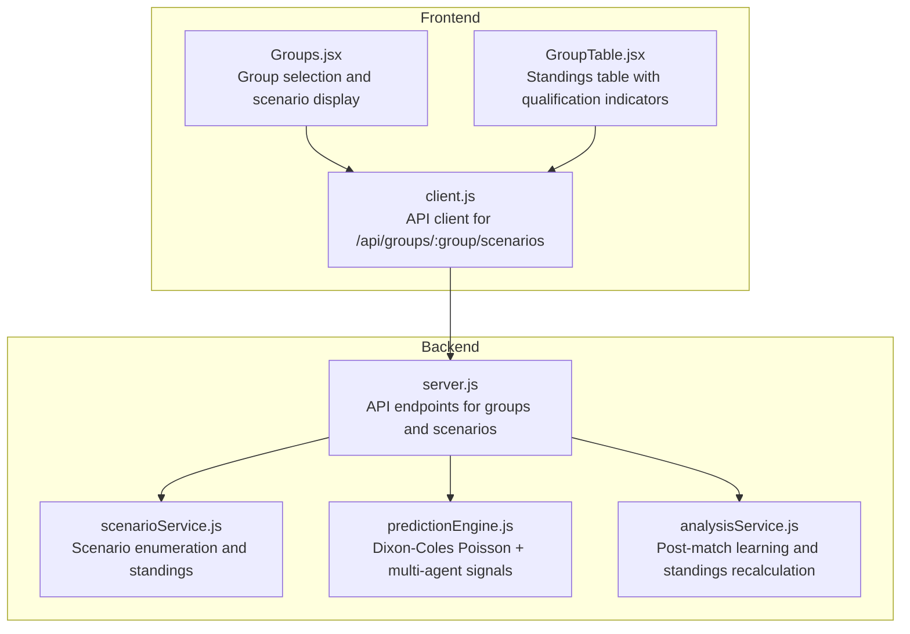
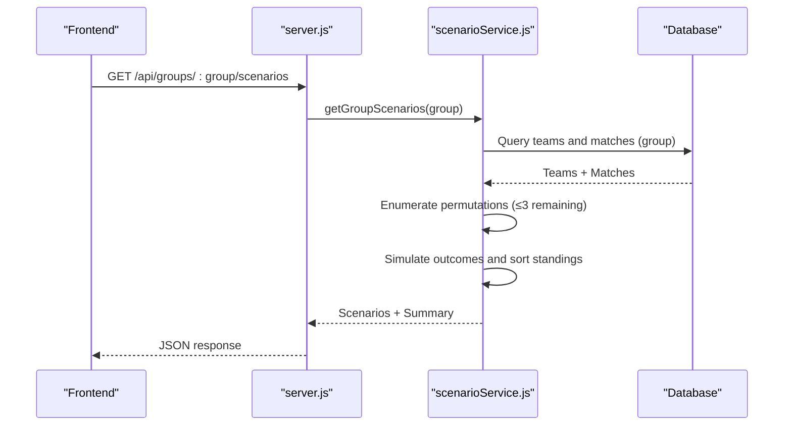
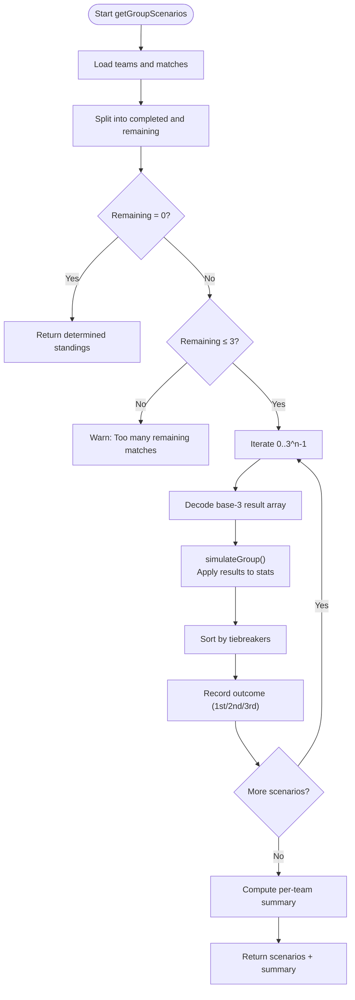
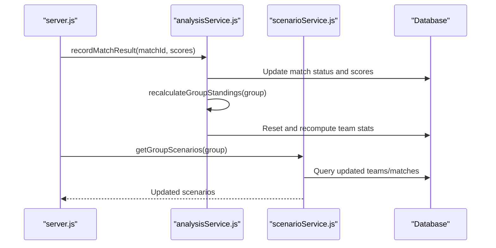
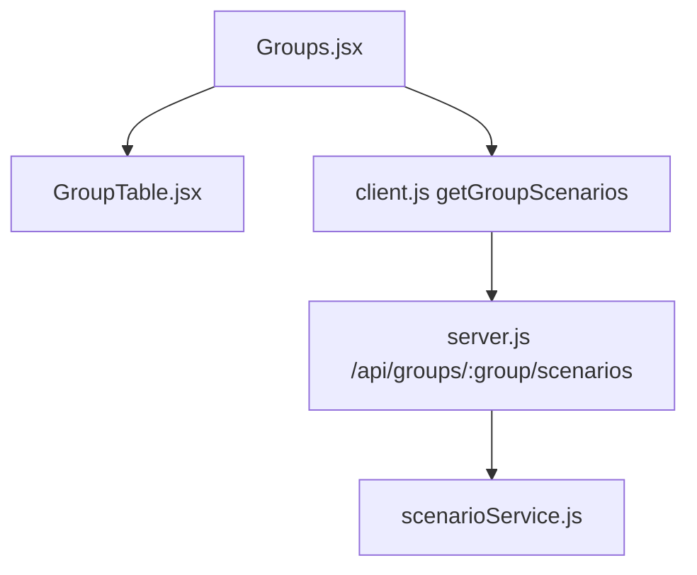
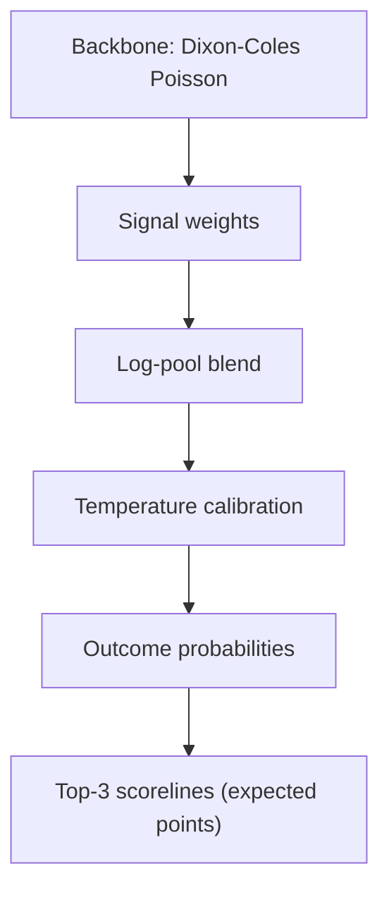

# Qualification Scenario Analysis

<cite>
**Referenced Files in This Document**
- [scenarioService.js](file://backend/services/scenarioService.js)
- [predictionEngine.js](file://backend/services/predictionEngine.js)
- [analysisService.js](file://backend/services/analysisService.js)
- [server.js](file://backend/server.js)
- [client.js](file://frontend/src/api/client.js)
- [Groups.jsx](file://frontend/src/pages/Groups.jsx)
- [GroupTable.jsx](file://frontend/src/components/GroupTable.jsx)
</cite>

## Table of Contents
1. [Introduction](#introduction)
2. [Project Structure](#project-structure)
3. [Core Components](#core-components)
4. [Architecture Overview](#architecture-overview)
5. [Detailed Component Analysis](#detailed-component-analysis)
6. [Dependency Analysis](#dependency-analysis)
7. [Performance Considerations](#performance-considerations)
8. [Troubleshooting Guide](#troubleshooting-guide)
9. [Conclusion](#conclusion)

## Introduction
This document explains the qualification scenario analysis system that computes group stage advancement possibilities for the World Cup 2026 tournament. It covers:
- What-if scenario calculations for qualification pathways, elimination scenarios, and best/worst-case outcomes
- Algorithm for enumerating all permutations of remaining matches and computing final standings
- Tiebreaker resolution (points, goal difference, goals scored, FIFA ranking)
- Third-place team qualification analysis and combination table system
- Real-time scenario updates triggered by match results
- Integration with the prediction engine for future match outcomes
- User interface components for displaying qualification probabilities, scenario trees, and advancement charts
- Mathematical models for probability calculations and statistical significance testing

## Project Structure
The qualification scenario analysis spans backend services, API endpoints, and frontend components:
- Backend services implement scenario enumeration, tiebreakers, and integration with the prediction engine
- API endpoints expose group standings and scenarios
- Frontend pages consume the API to render group tables and scenario summaries



**Diagram sources**
- [scenarioService.js:1-180](file://backend/services/scenarioService.js#L1-L180)
- [predictionEngine.js:1-1046](file://backend/services/predictionEngine.js#L1-L1046)
- [analysisService.js:1-422](file://backend/services/analysisService.js#L1-L422)
- [server.js:96-107](file://backend/server.js#L96-L107)
- [client.js](file://frontend/src/api/client.js#L35)
- [Groups.jsx:1-160](file://frontend/src/pages/Groups.jsx#L1-L160)
- [GroupTable.jsx:1-78](file://frontend/src/components/GroupTable.jsx#L1-L78)

**Section sources**
- [scenarioService.js:1-180](file://backend/services/scenarioService.js#L1-L180)
- [server.js:96-107](file://backend/server.js#L96-L107)
- [client.js](file://frontend/src/api/client.js#L35)
- [Groups.jsx:1-160](file://frontend/src/pages/Groups.jsx#L1-L160)
- [GroupTable.jsx:1-78](file://frontend/src/components/GroupTable.jsx#L1-L78)

## Core Components
- Scenario Service: Enumerates all possible result combinations for remaining matches, simulates outcomes, and computes qualification summaries per team
- Prediction Engine: Provides probabilistic match outcomes and scorelines, integrates multiple signals (form, head-to-head, lineup, rest days)
- Analysis Service: Updates group standings after match results and recalculates from completed matches
- API Layer: Exposes group standings and scenarios via REST endpoints
- Frontend: Renders group tables, scenario summaries, and links to match details

**Section sources**
- [scenarioService.js:17-61](file://backend/services/scenarioService.js#L17-L61)
- [scenarioService.js:71-177](file://backend/services/scenarioService.js#L71-L177)
- [predictionEngine.js:691-922](file://backend/services/predictionEngine.js#L691-L922)
- [analysisService.js:223-293](file://backend/services/analysisService.js#L223-L293)
- [server.js:96-107](file://backend/server.js#L96-L107)

## Architecture Overview
The system follows a pipeline:
- Data ingestion: Completed matches update group standings and trigger scenario recomputation
- Scenario computation: For each group, remaining matches are enumerated up to a threshold; each permutation yields final standings and qualification outcomes
- Prediction integration: Future match outcomes are informed by the prediction engine’s probabilistic model
- UI exposure: API endpoints serve scenario data; frontend renders tables and scenario summaries



**Diagram sources**
- [server.js:96-107](file://backend/server.js#L96-L107)
- [scenarioService.js:71-177](file://backend/services/scenarioService.js#L71-L177)

## Detailed Component Analysis

### Scenario Enumeration and Simulation
The scenario service:
- Loads current group teams and matches
- Identifies remaining matches (non-completed)
- Limits enumeration to groups with three or fewer remaining matches (total scenarios ≤ 27)
- For each scenario permutation:
  - Updates hypothetical team stats (played, points, goals for/against)
  - Applies tiebreakers: points, goal difference, goals scored, FIFA rank
  - Records first, second, and third place winners
- Aggregates per-team qualification statistics: always qualifies, never qualifies, qualify count, percentages



**Diagram sources**
- [scenarioService.js:71-177](file://backend/services/scenarioService.js#L71-L177)
- [scenarioService.js:17-61](file://backend/services/scenarioService.js#L17-L61)

**Section sources**
- [scenarioService.js:1-180](file://backend/services/scenarioService.js#L1-L180)

### Tiebreaker Resolution System
Final standings are sorted using:
1. Points
2. Goal difference
3. Goals scored
4. FIFA rank (ascending order for ranking)

This deterministic ordering ensures consistent qualification outcomes across scenarios.

**Section sources**
- [scenarioService.js:52-58](file://backend/services/scenarioService.js#L52-L58)

### Third-Place Team Qualification Analysis
The scenario service captures the third-place team in each scenario outcome. The summary includes:
- Current points and goal difference
- Total scenarios evaluated
- Counts and percentages for qualification likelihood

Third-place advancement depends on the combination table system (external to this codebase), which determines which third-place teams advance based on predefined criteria.

**Section sources**
- [scenarioService.js:134-149](file://backend/services/scenarioService.js#L134-L149)
- [scenarioService.js:152-164](file://backend/services/scenarioService.js#L152-L164)

### Real-Time Scenario Updates and Prediction Engine Integration
- Real-time updates: After a match result is recorded, group standings are recalculated from completed matches, ensuring scenarios reflect current state
- Prediction engine integration: Future match outcomes leverage the prediction engine’s probabilistic model, which informs scenario permutations and outcome probabilities



**Diagram sources**
- [analysisService.js:76-218](file://backend/services/analysisService.js#L76-L218)
- [analysisService.js:238-293](file://backend/services/analysisService.js#L238-L293)
- [scenarioService.js:71-111](file://backend/services/scenarioService.js#L71-L111)

**Section sources**
- [analysisService.js:223-293](file://backend/services/analysisService.js#L223-L293)
- [predictionEngine.js:691-922](file://backend/services/predictionEngine.js#L691-L922)

### User Interface Components
- Groups page: Displays group tabs, standings table, and upcoming matches
- Group table: Shows positions, points, goal difference, and highlights top-two qualifiers
- API client: Fetches scenarios via `/api/groups/:group/scenarios`



**Diagram sources**
- [Groups.jsx:95-113](file://frontend/src/pages/Groups.jsx#L95-L113)
- [GroupTable.jsx:1-78](file://frontend/src/components/GroupTable.jsx#L1-L78)
- [client.js](file://frontend/src/api/client.js#L35)
- [server.js:96-107](file://backend/server.js#L96-L107)
- [scenarioService.js:71-177](file://backend/services/scenarioService.js#L71-L177)

**Section sources**
- [Groups.jsx:1-160](file://frontend/src/pages/Groups.jsx#L1-L160)
- [GroupTable.jsx:1-78](file://frontend/src/components/GroupTable.jsx#L1-L78)
- [client.js](file://frontend/src/api/client.js#L35)

### Mathematical Models and Statistical Significance
- Probability model: Dixon-Coles bivariate Poisson with online attack/defense rating updates
- Signal blending: Log-pool aggregation of multiple signals (head-to-head, form, intelligence, lineup, rest days)
- Confidence calibration: Temperature scaling applied to outcome probabilities
- Accuracy metrics: Brier score, outcome correctness, and expected points scoring rule for evaluation



**Diagram sources**
- [predictionEngine.js:67-100](file://backend/services/predictionEngine.js#L67-L100)
- [predictionEngine.js:218-238](file://backend/services/predictionEngine.js#L218-L238)
- [predictionEngine.js:663-688](file://backend/services/predictionEngine.js#L663-L688)
- [predictionEngine.js:401-460](file://backend/services/predictionEngine.js#L401-L460)

**Section sources**
- [predictionEngine.js:1-1046](file://backend/services/predictionEngine.js#L1-L1046)
- [analysisService.js:37-71](file://backend/services/analysisService.js#L37-L71)

## Dependency Analysis
- scenarioService.js depends on database queries for teams and matches and performs sorting with explicit tiebreakers
- server.js exposes the scenarios endpoint and delegates to scenarioService.js
- analysisService.js updates group standings and triggers scenario recomputation after match results
- predictionEngine.js provides the probabilistic foundation for future match outcomes and influences scenario weighting indirectly

```mermaid
graph LR
DB["Database"] <- --> SCN["scenarioService.js"]
API["server.js"] --> SCN
API --> ANA["analysisService.js"]
SCN --> API
ANA --> DB
```

**Diagram sources**
- [scenarioService.js:71-177](file://backend/services/scenarioService.js#L71-L177)
- [server.js:96-107](file://backend/server.js#L96-L107)
- [analysisService.js:223-293](file://backend/services/analysisService.js#L223-L293)

**Section sources**
- [scenarioService.js:1-180](file://backend/services/scenarioService.js#L1-L180)
- [server.js:96-107](file://backend/server.js#L96-L107)
- [analysisService.js:223-293](file://backend/services/analysisService.js#L223-L293)

## Performance Considerations
- Scenario enumeration threshold: Limited to groups with three or fewer remaining matches to keep computational cost manageable
- Sorting complexity: O(k log k) per scenario where k is four teams; repeated per scenario
- Database queries: Efficiently filter completed vs remaining matches per group
- Prediction engine: Probabilistic computations are centralized and reused for scenario inputs

[No sources needed since this section provides general guidance]

## Troubleshooting Guide
- Invalid group parameter: API validates group letters and returns an error for invalid inputs
- No scenarios returned: Occurs when a group has zero remaining matches; the system returns determined standings
- Unexpected ties: Tiebreakers are deterministic; verify team stats and ordering logic if discrepancies arise
- Prediction vs scenario mismatch: Ensure post-match updates have recalculated standings before requesting scenarios

**Section sources**
- [server.js:96-107](file://backend/server.js#L96-L107)
- [scenarioService.js:94-111](file://backend/services/scenarioService.js#L94-L111)
- [analysisService.js:223-293](file://backend/services/analysisService.js#L223-L293)

## Conclusion
The qualification scenario analysis system provides a robust framework for computing group stage advancement possibilities. By combining deterministic tiebreakers with probabilistic future outcomes, it delivers accurate and timely insights into qualification pathways, elimination scenarios, and best/worst-case projections for each team. The modular architecture supports real-time updates and scalable UI rendering, enabling fans and analysts to track evolving qualification dynamics throughout the group stage.