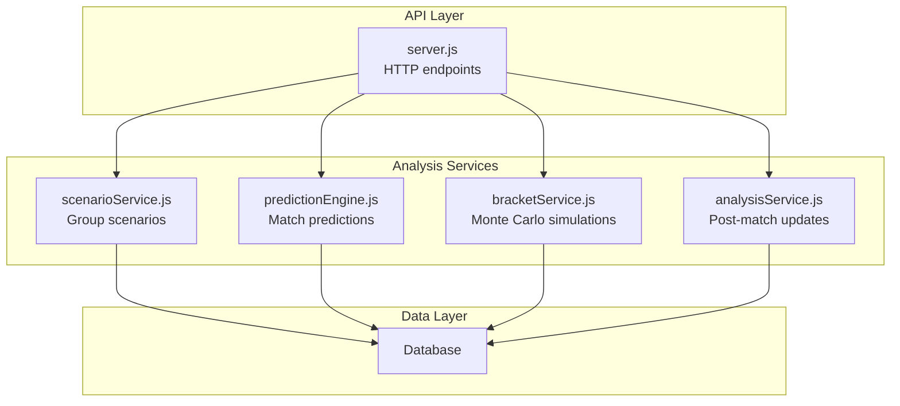
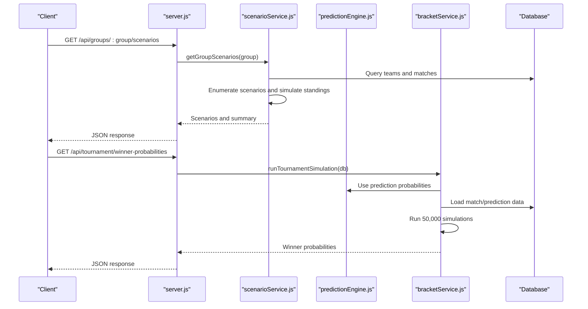
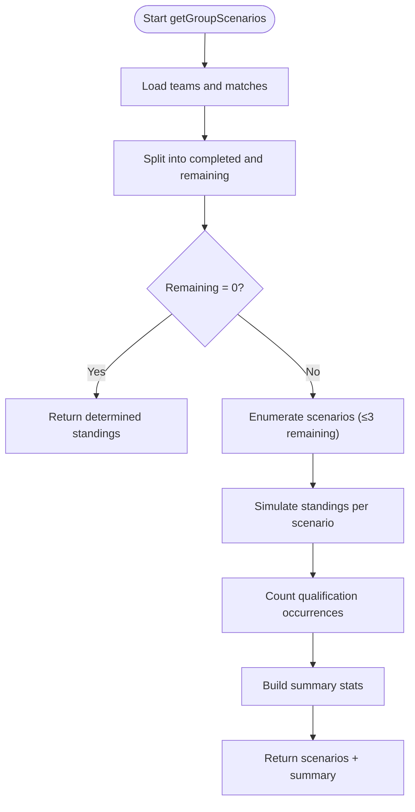
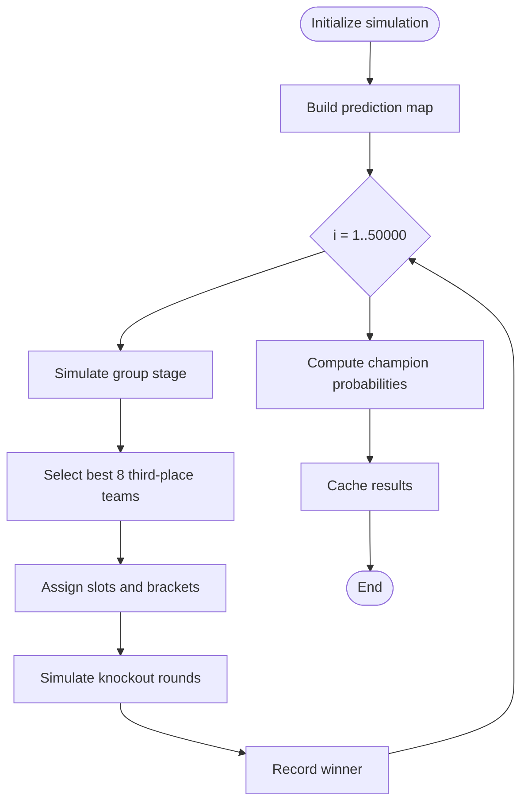
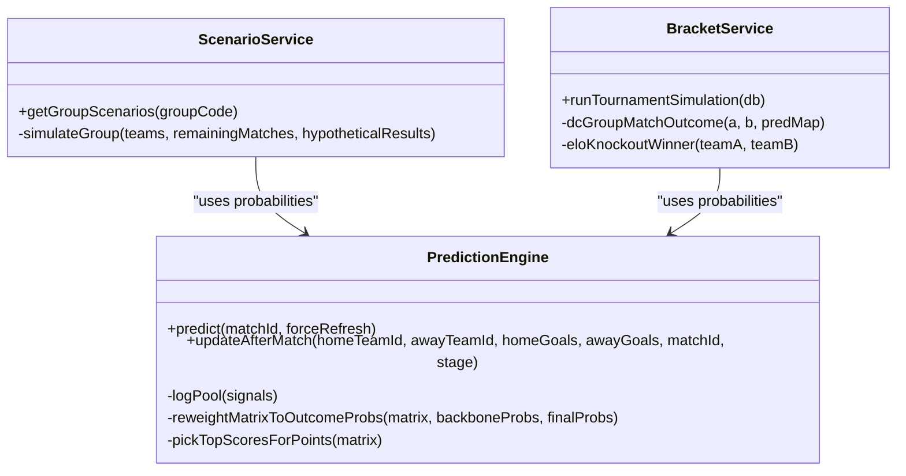
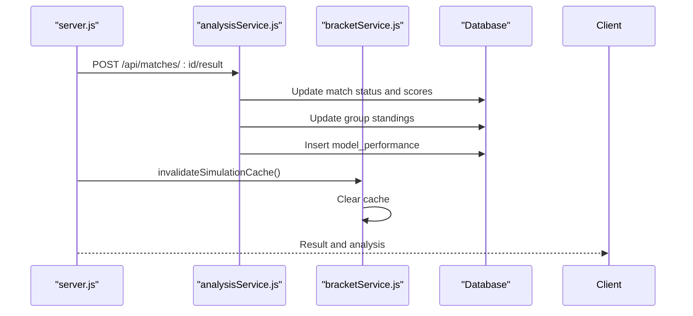
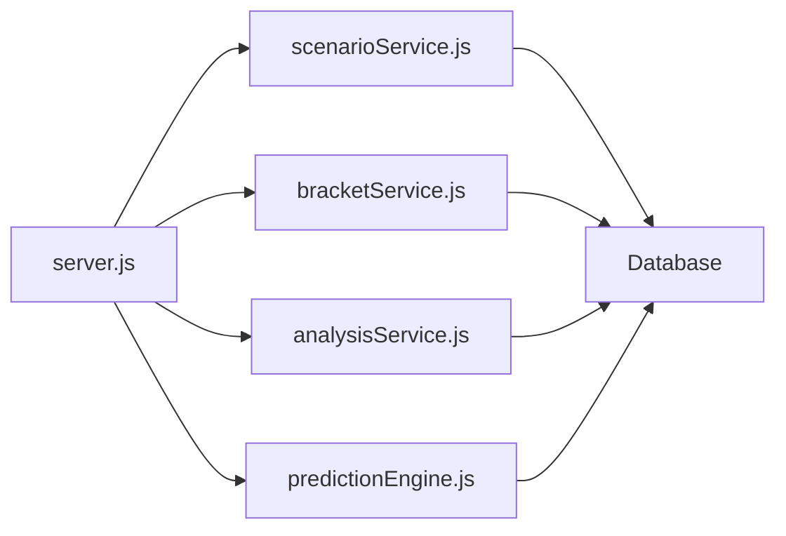

# Scenario Analysis

<cite>
**Referenced Files in This Document**
- [scenarioService.js](file://backend/services/scenarioService.js)
- [predictionEngine.js](file://backend/services/predictionEngine.js)
- [bracketService.js](file://backend/services/bracketService.js)
- [analysisService.js](file://backend/services/analysisService.js)
- [server.js](file://backend/server.js)
</cite>

## Table of Contents
1. [Introduction](#introduction)
2. [Project Structure](#project-structure)
3. [Core Components](#core-components)
4. [Architecture Overview](#architecture-overview)
5. [Detailed Component Analysis](#detailed-component-analysis)
6. [Dependency Analysis](#dependency-analysis)
7. [Performance Considerations](#performance-considerations)
8. [Troubleshooting Guide](#troubleshooting-guide)
9. [Conclusion](#conclusion)

## Introduction
This document explains the scenario analysis service that computes qualification possibilities and elimination probabilities throughout the tournament. It covers:
- What-if scenario calculations for group stage positions and third-place qualification
- Monte Carlo simulation algorithms for knockout stage advancement probabilities
- Real-time scenario updates triggered by match results
- Integration with the prediction engine for dynamic probability calculations

The service enumerates all possible outcomes for remaining group matches, simulates final standings, and derives qualification and elimination probabilities. It also powers the 50,000-run Monte Carlo simulations for knockout-stage champion probabilities.

## Project Structure
The scenario analysis spans several backend services:
- Scenario service: enumerates group-stage scenarios and computes qualification/elimination statistics
- Prediction engine: probabilistic match outcomes and scoreline derivations
- Bracket service: Monte Carlo simulations for knockout-stage probabilities
- Analysis service: post-match updates and recalculations
- Server: API endpoints exposing scenario and simulation results

**Diagram sources**
- [server.js:96-107](file://backend/server.js#L96-L107)
- [scenarioService.js:71-177](file://backend/services/scenarioService.js#L71-L177)
- [predictionEngine.js:665-896](file://backend/services/predictionEngine.js#L665-L896)
- [bracketService.js:706-906](file://backend/services/bracketService.js#L706-L906)
- [analysisService.js:76-218](file://backend/services/analysisService.js#L76-L218)

**Section sources**
- [server.js:96-107](file://backend/server.js#L96-L107)
- [scenarioService.js:71-177](file://backend/services/scenarioService.js#L71-L177)
- [predictionEngine.js:665-896](file://backend/services/predictionEngine.js#L665-L896)
- [bracketService.js:706-906](file://backend/services/bracketService.js#L706-L906)
- [analysisService.js:76-218](file://backend/services/analysisService.js#L76-L218)

## Core Components
- Group scenario enumeration: For each group with remaining matches, the service generates all possible result combinations (limited to ≤3 remaining matches) and computes final standings for each scenario. It tracks qualification counts and derives probabilities.
- Monte Carlo simulations: The bracket service runs 50,000 tournament simulations using Dixon-Coles probabilities for group matches and ELO-based knockout outcomes to estimate champion probabilities.
- Real-time updates: Upon match results, the analysis service recalculates group standings and invalidates simulation caches to keep probabilities fresh.

**Section sources**
- [scenarioService.js:17-61](file://backend/services/scenarioService.js#L17-L61)
- [scenarioService.js:71-177](file://backend/services/scenarioService.js#L71-L177)
- [bracketService.js:706-906](file://backend/services/bracketService.js#L706-L906)
- [analysisService.js:76-218](file://backend/services/analysisService.js#L76-L218)

## Architecture Overview
The scenario analysis pipeline integrates prediction probabilities with simulation logic to produce dynamic tournament insights.

**Diagram sources**
- [server.js:96-107](file://backend/server.js#L96-L107)
- [scenarioService.js:71-177](file://backend/services/scenarioService.js#L71-L177)
- [predictionEngine.js:665-896](file://backend/services/predictionEngine.js#L665-L896)
- [bracketService.js:852-906](file://backend/services/bracketService.js#L852-L906)

## Detailed Component Analysis

### Group Scenario Analysis Service
This service computes qualification and elimination probabilities for each team in a group by:
- Fetching current group standings and remaining fixtures
- Enumerating all possible result combinations for remaining matches (≤3 remaining matches)
- Simulating final standings for each scenario and counting qualification occurrences
- Deriving summary statistics: qualify percentage, always qualifies, never qualifies, eliminated

**Diagram sources**
- [scenarioService.js:71-177](file://backend/services/scenarioService.js#L71-L177)

**Section sources**
- [scenarioService.js:17-61](file://backend/services/scenarioService.js#L17-L61)
- [scenarioService.js:71-177](file://backend/services/scenarioService.js#L71-L177)

### Monte Carlo Simulation Engine
The bracket service performs 50,000 tournament simulations:
- Builds a prediction map from Dixon-Coles probabilities for group matches
- Uses deterministic outcomes for completed matches
- Simulates group stage round-robin outcomes using the prediction map
- Selects best 8 third-place teams and assigns slots according to predefined combinations
- Advances through knockout rounds using ELO-based outcomes
- Aggregates champion probabilities across simulations

**Diagram sources**
- [bracketService.js:706-906](file://backend/services/bracketService.js#L706-L906)
- [bracketService.js:738-754](file://backend/services/bracketService.js#L738-L754)

**Section sources**
- [bracketService.js:706-906](file://backend/services/bracketService.js#L706-L906)
- [bracketService.js:738-754](file://backend/services/bracketService.js#L738-L754)

### Prediction Engine Integration
The scenario analysis leverages the prediction engine’s Dixon-Coles backbone with adjustments:
- Backbonelambda computation using attack/defense ratings, home advantage, venue effects, and goal-rate scaling
- Log-pool blending of multiple signals (H2H, form, intelligence, lineup, rest days)
- Temperature calibration and scoreline derivation via expected points optimization
- Outputs probabilities and top scorelines used by downstream services

**Diagram sources**
- [predictionEngine.js:665-896](file://backend/services/predictionEngine.js#L665-L896)
- [scenarioService.js:71-177](file://backend/services/scenarioService.js#L71-L177)
- [bracketService.js:852-906](file://backend/services/bracketService.js#L852-L906)

**Section sources**
- [predictionEngine.js:665-896](file://backend/services/predictionEngine.js#L665-L896)
- [scenarioService.js:71-177](file://backend/services/scenarioService.js#L71-L177)
- [bracketService.js:852-906](file://backend/services/bracketService.js#L852-L906)

### Real-Time Scenario Updates
Match results trigger immediate recalculations:
- Post-match analysis updates group standings and model performance
- Simulation cache invalidation ensures subsequent Monte Carlo queries reflect new data
- Prediction regeneration refreshes probabilities for upcoming matches

**Diagram sources**
- [server.js:282-302](file://backend/server.js#L282-L302)
- [analysisService.js:76-218](file://backend/services/analysisService.js#L76-L218)
- [bracketService.js:711-713](file://backend/services/bracketService.js#L711-L713)

**Section sources**
- [server.js:282-302](file://backend/server.js#L282-L302)
- [analysisService.js:76-218](file://backend/services/analysisService.js#L76-L218)
- [bracketService.js:711-713](file://backend/services/bracketService.js#L711-L713)

## Dependency Analysis
- scenarioService depends on the database to fetch teams and matches, and on simulateGroup to compute standings
- bracketService depends on predictionEngine-derived probabilities and ELO for knockout outcomes
- analysisService updates group standings and triggers cache invalidation
- server.js exposes endpoints that route to these services

**Diagram sources**
- [scenarioService.js:71-177](file://backend/services/scenarioService.js#L71-L177)
- [bracketService.js:852-906](file://backend/services/bracketService.js#L852-L906)
- [analysisService.js:76-218](file://backend/services/analysisService.js#L76-L218)
- [predictionEngine.js:665-896](file://backend/services/predictionEngine.js#L665-L896)
- [server.js:96-107](file://backend/server.js#L96-L107)

**Section sources**
- [scenarioService.js:71-177](file://backend/services/scenarioService.js#L71-L177)
- [bracketService.js:852-906](file://backend/services/bracketService.js#L852-L906)
- [analysisService.js:76-218](file://backend/services/analysisService.js#L76-L218)
- [predictionEngine.js:665-896](file://backend/services/predictionEngine.js#L665-L896)
- [server.js:96-107](file://backend/server.js#L96-L107)

## Performance Considerations
- Scenario enumeration is capped at ≤3 remaining matches to maintain tractability (3^n combinations)
- Monte Carlo simulations run 50,000 iterations to achieve stable champion probability estimates
- Caching and cache invalidation minimize redundant computations while keeping results fresh
- Prediction engine uses efficient matrix operations and log-pool blending to derive probabilities quickly

[No sources needed since this section provides general guidance]

## Troubleshooting Guide
Common issues and resolutions:
- Empty or stale scenario results: Verify group has remaining matches and database records are accurate
- Outdated simulation probabilities: Ensure cache invalidation occurs after match results are recorded
- Prediction inconsistencies: Confirm prediction engine is generating probabilities and that model calibration is applied

**Section sources**
- [server.js:282-302](file://backend/server.js#L282-L302)
- [analysisService.js:76-218](file://backend/services/analysisService.js#L76-L218)
- [bracketService.js:711-713](file://backend/services/bracketService.js#L711-L713)

## Conclusion
The scenario analysis service provides comprehensive qualification and elimination insights for group-stage teams and champion probabilities for the knockout phase. By combining deterministic scenario enumeration with Monte Carlo simulations and integrating tightly with the prediction engine, it delivers robust, real-time tournament analytics that update automatically as results come in.