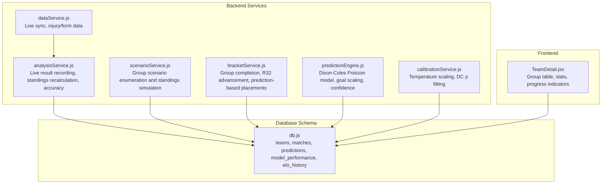
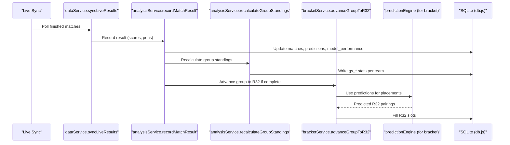
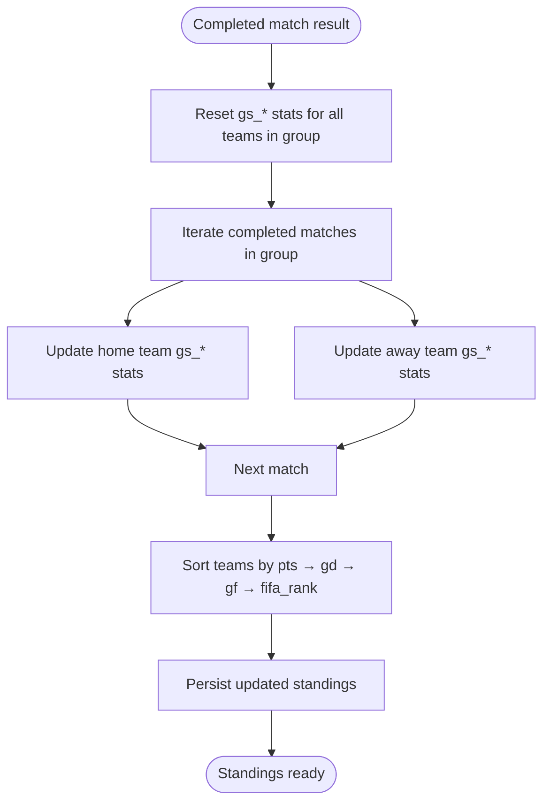
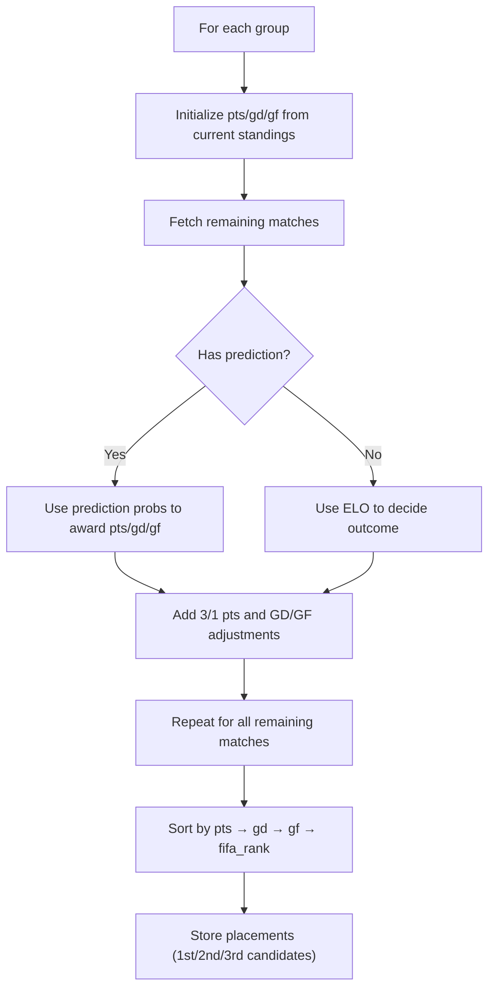
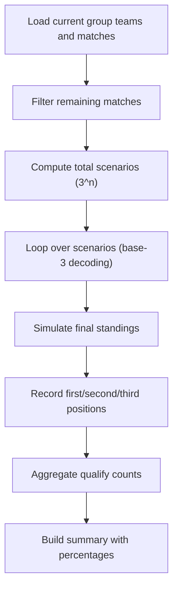
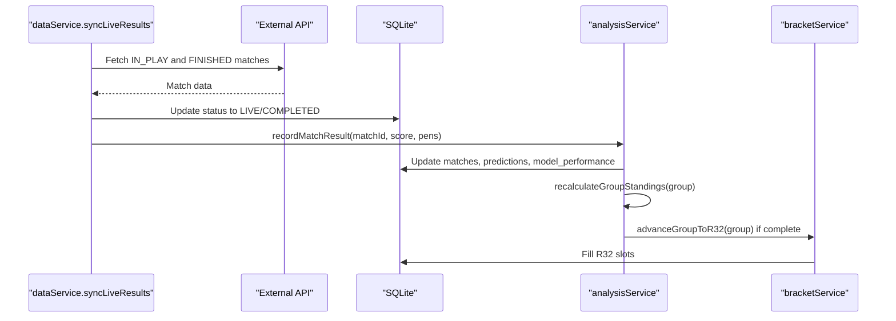
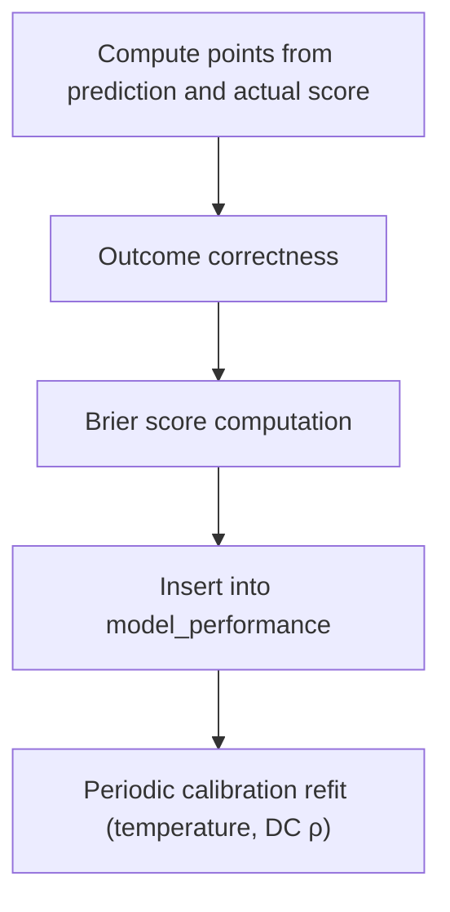
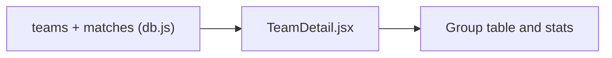
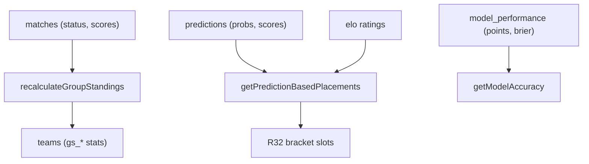

# Standings Calculation

<cite>
**Referenced Files in This Document**
- [scenarioService.js](file://backend/services/scenarioService.js)
- [bracketService.js](file://backend/services/bracketService.js)
- [analysisService.js](file://backend/services/analysisService.js)
- [predictionEngine.js](file://backend/services/predictionEngine.js)
- [calibrationService.js](file://backend/services/calibrationService.js)
- [db.js](file://backend/database/db.js)
- [teams.js](file://backend/data/teams.js)
- [dryRunCompare.js](file://backend/scripts/dryRunCompare.js)
- [backtestHarness.js](file://backend/scripts/backtestHarness.js)
- [dataService.js](file://backend/services/dataService.js)
- [TeamDetail.jsx](file://frontend/src/pages/TeamDetail.jsx)
</cite>

## Table of Contents
1. [Introduction](#introduction)
2. [Project Structure](#project-structure)
3. [Core Components](#core-components)
4. [Architecture Overview](#architecture-overview)
5. [Detailed Component Analysis](#detailed-component-analysis)
6. [Dependency Analysis](#dependency-analysis)
7. [Performance Considerations](#performance-considerations)
8. [Troubleshooting Guide](#troubleshooting-guide)
9. [Conclusion](#conclusion)

## Introduction
This document explains the standings calculation system that maintains real-time group stage and tournament rankings for the World Cup 2026 predictor. It covers point calculation algorithms, goal difference computations, goal scoring statistics tracking, tiebreaker hierarchies, performance tracking, and the integration between live match results and automatic standings updates—including prediction-based placement for incomplete matches and accuracy metrics for analytical purposes.

## Project Structure
The standings system spans backend services, database schema, and frontend presentation:
- Backend services handle live result ingestion, prediction-based placements, group stage recalculations, and accuracy analytics.
- The database schema defines team and match tables with group-stage statistics and performance tracking.
- Frontend components render group tables and team statistics.

**Diagram sources**
- [analysisService.js:1-422](file://backend/services/analysisService.js#L1-L422)
- [scenarioService.js:1-180](file://backend/services/scenarioService.js#L1-L180)
- [bracketService.js:1-1080](file://backend/services/bracketService.js#L1-L1080)
- [predictionEngine.js:1-1020](file://backend/services/predictionEngine.js#L1-L1020)
- [calibrationService.js:1-132](file://backend/services/calibrationService.js#L1-L132)
- [db.js:23-252](file://backend/database/db.js#L23-L252)
- [TeamDetail.jsx:211-279](file://frontend/src/pages/TeamDetail.jsx#L211-L279)

**Section sources**
- [db.js:23-252](file://backend/database/db.js#L23-L252)
- [TeamDetail.jsx:211-279](file://frontend/src/pages/TeamDetail.jsx#L211-L279)

## Core Components
- Group stage standings: Points, goal difference (GD), goals for (GF), and FIFA ranking tiebreakers.
- Prediction-based placements: Automatic group rankings using match predictions for remaining fixtures.
- Live result integration: Real-time updates to standings and bracket progression.
- Accuracy metrics: Outcome correctness, Brier score, and points scoring rules.

**Section sources**
- [scenarioService.js:17-61](file://backend/services/scenarioService.js#L17-L61)
- [bracketService.js:366-476](file://backend/services/bracketService.js#L366-L476)
- [analysisService.js:223-293](file://backend/services/analysisService.js#L223-L293)
- [calibrationService.js:53-129](file://backend/services/calibrationService.js#L53-L129)

## Architecture Overview
The system integrates live results with prediction models to maintain accurate standings and bracket placements. Live results trigger group recalculations and bracket advancement; prediction engines inform placements for incomplete matches; calibration services refine model outputs; and analytics track performance.

**Diagram sources**
- [dataService.js:495-582](file://backend/services/dataService.js#L495-L582)
- [analysisService.js:76-218](file://backend/services/analysisService.js#L76-L218)
- [analysisService.js:238-293](file://backend/services/analysisService.js#L238-L293)
- [bracketService.js:209-260](file://backend/services/bracketService.js#L209-L260)
- [predictionEngine.js:1-1020](file://backend/services/predictionEngine.js#L1-L1020)
- [db.js:23-252](file://backend/database/db.js#L23-L252)

## Detailed Component Analysis

### Group Stage Standings and Tiebreakers
- Point calculation: 3 points for a win, 1 for a draw, 0 for a loss.
- Goal difference: (goals for) minus (goals against).
- Goals for: Total goals scored in group matches.
- FIFA ranking: Used as the final tiebreaker when other criteria are equal.
- Recalculation: After each completed group match, the entire group is recomputed from scratch to prevent double counting.

**Diagram sources**
- [analysisService.js:238-293](file://backend/services/analysisService.js#L238-L293)
- [db.js:25-49](file://backend/database/db.js#L25-L49)

**Section sources**
- [analysisService.js:223-293](file://backend/services/analysisService.js#L223-L293)
- [db.js:25-49](file://backend/database/db.js#L25-L49)

### Prediction-Based Group Placements (Incomplete Matches)
- For groups with remaining matches, the system computes hypothetical outcomes using prediction probabilities or ELO when predictions are unavailable.
- Points, goal difference, and goals for are tallied per hypothetical result; teams are ranked accordingly.
- These placements are used to fill R32 slots and to estimate third-best teams.

**Diagram sources**
- [bracketService.js:366-476](file://backend/services/bracketService.js#L366-L476)
- [bracketService.js:408-458](file://backend/services/bracketService.js#L408-L458)

**Section sources**
- [bracketService.js:366-476](file://backend/services/bracketService.js#L366-L476)

### Scenario Enumeration and Qualification Probabilities
- Enumerates all possible result combinations for remaining matches (limited to manageable numbers).
- For each scenario, simulates final standings and records qualification outcomes.
- Produces summary statistics showing qualification percentages and elimination status.

**Diagram sources**
- [scenarioService.js:71-177](file://backend/services/scenarioService.js#L71-L177)

**Section sources**
- [scenarioService.js:17-61](file://backend/services/scenarioService.js#L17-L61)
- [scenarioService.js:71-177](file://backend/services/scenarioService.js#L71-L177)

### Live Result Integration and Automatic Updates
- Live sync detects in-progress and finished matches, flips status to LIVE and records final scores.
- On completion, group standings are recalculated and bracket advancement is attempted.
- Knockout winners advance automatically; third-place playoff is handled separately.

**Diagram sources**
- [dataService.js:495-582](file://backend/services/dataService.js#L495-L582)
- [analysisService.js:76-218](file://backend/services/analysisService.js#L76-L218)
- [analysisService.js:238-293](file://backend/services/analysisService.js#L238-L293)
- [bracketService.js:209-260](file://backend/services/bracketService.js#L209-L260)

**Section sources**
- [dataService.js:495-582](file://backend/services/dataService.js#L495-L582)
- [analysisService.js:76-218](file://backend/services/analysisService.js#L76-L218)

### Accuracy Metrics and Points Scoring
- Points scoring rules: 3 for exact scoreline match, 2 for top-3 scorelines, 1 for correct outcome, 0 otherwise.
- Outcome correctness and Brier score are tracked per match.
- Model accuracy aggregates outcomes, points, and calibration metrics.

**Diagram sources**
- [analysisService.js:37-57](file://backend/services/analysisService.js#L37-L57)
- [analysisService.js:142-176](file://backend/services/analysisService.js#L142-L176)
- [calibrationService.js:53-129](file://backend/services/calibrationService.js#L53-L129)

**Section sources**
- [analysisService.js:18-57](file://backend/services/analysisService.js#L18-L57)
- [analysisService.js:321-384](file://backend/services/analysisService.js#L321-L384)
- [calibrationService.js:53-129](file://backend/services/calibrationService.js#L53-L129)

### Frontend Presentation of Standings and Progression
- Team detail page shows group position, points, goal difference, and progression indicators.
- Group tables reflect real-time standings and team statistics.

**Diagram sources**
- [db.js:25-49](file://backend/database/db.js#L25-L49)
- [TeamDetail.jsx:211-279](file://frontend/src/pages/TeamDetail.jsx#L211-L279)

**Section sources**
- [TeamDetail.jsx:211-279](file://frontend/src/pages/TeamDetail.jsx#L211-L279)
- [db.js:25-49](file://backend/database/db.js#L25-L49)

## Dependency Analysis
- Standings depend on match statuses and scores; group recalculations reset and rebuild stats from completed matches.
- Prediction-based placements depend on stored predictions and ELO when predictions are absent.
- Accuracy metrics depend on predictions and outcomes recorded in model_performance.

**Diagram sources**
- [analysisService.js:238-293](file://backend/services/analysisService.js#L238-L293)
- [bracketService.js:366-476](file://backend/services/bracketService.js#L366-L476)
- [analysisService.js:321-384](file://backend/services/analysisService.js#L321-L384)

**Section sources**
- [analysisService.js:238-293](file://backend/services/analysisService.js#L238-L293)
- [bracketService.js:366-476](file://backend/services/bracketService.js#L366-L476)
- [analysisService.js:321-384](file://backend/services/analysisService.js#L321-L384)

## Performance Considerations
- Scenario enumeration is bounded by remaining matches (≤3 for feasibility).
- Recalculation is idempotent and safe to rerun; it resets and rebuilds stats from completed matches.
- Prediction-based placements leverage stored predictions to avoid repeated computation for incomplete groups.
- Calibration refits occur periodically to maintain probability reliability.

[No sources needed since this section provides general guidance]

## Troubleshooting Guide
- Duplicate results: The system guards against reprocessing identical scores by checking status and score equality.
- Incomplete predictions: Falls back to ELO-based outcomes for remaining matches when predictions are missing.
- Bracket completeness: Ensures all groups are complete before filling third-place slots; otherwise defers assignment.
- Accuracy drift: Periodic calibration refits adjust temperature and DC ρ to improve reliability.

**Section sources**
- [analysisService.js:87-94](file://backend/services/analysisService.js#L87-L94)
- [bracketService.js:254-257](file://backend/services/bracketService.js#L254-L257)
- [calibrationService.js:53-82](file://backend/services/calibrationService.js#L53-L82)

## Conclusion
The standings system combines live result ingestion, prediction-driven projections, and robust recalculations to maintain accurate and real-time group and tournament rankings. It employs clear tiebreakers, tracks performance via multiple metrics, and integrates seamlessly with bracket progression and frontend presentation.