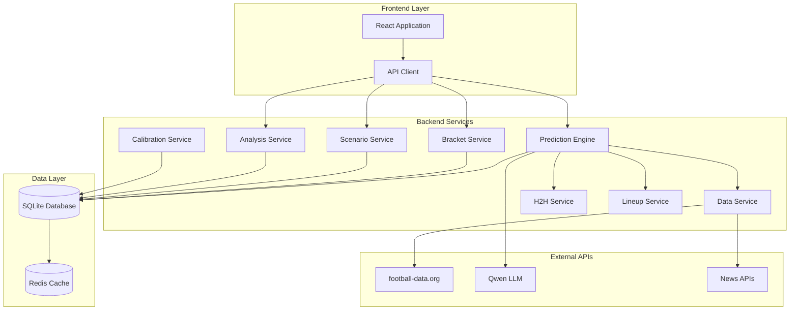
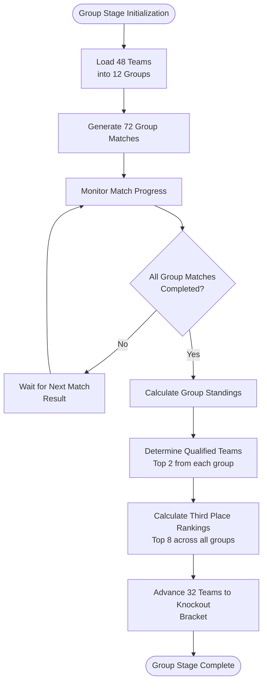
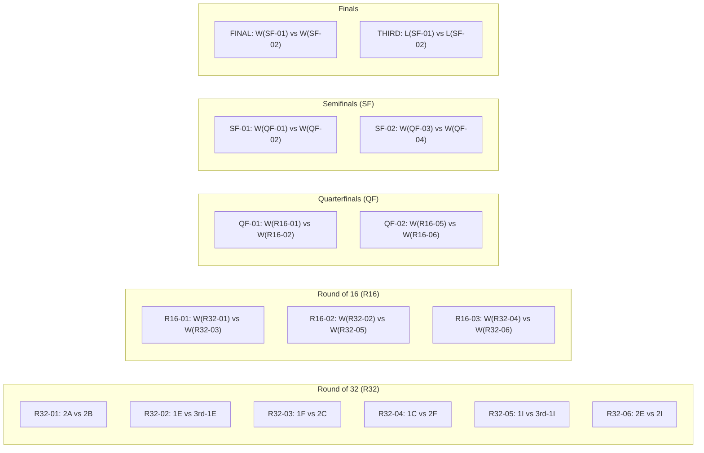
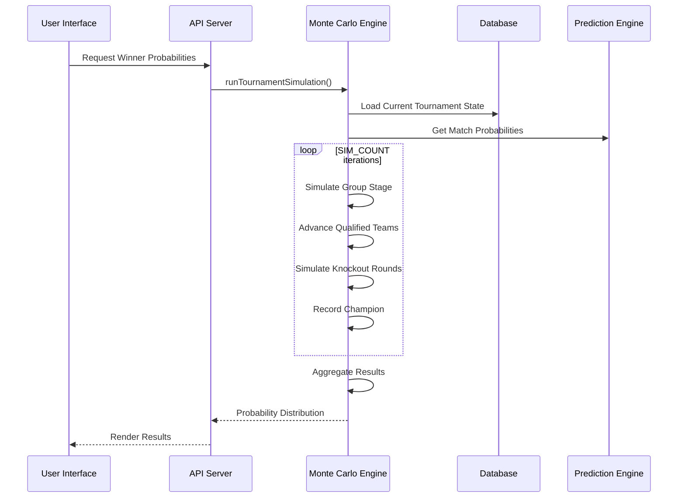
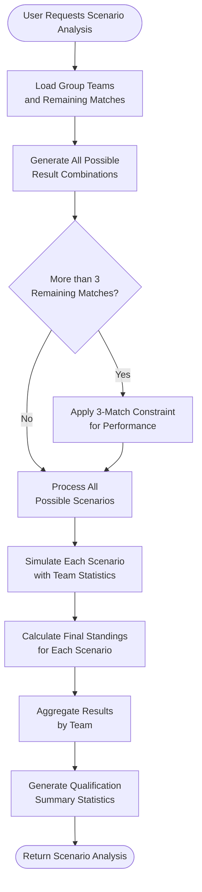
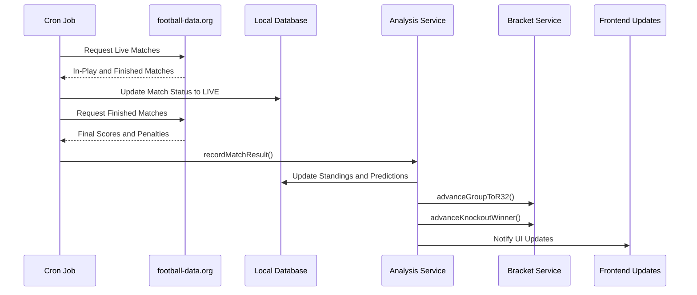
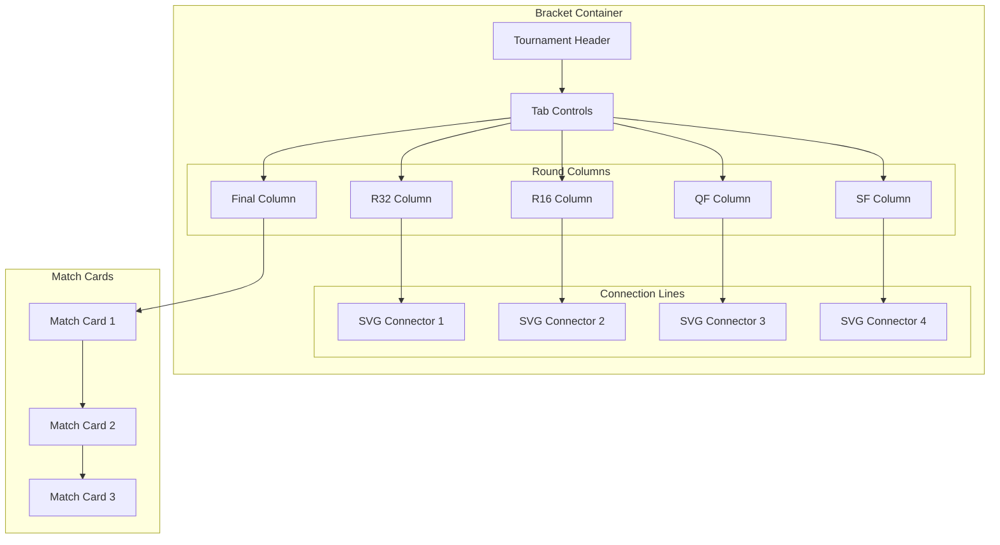
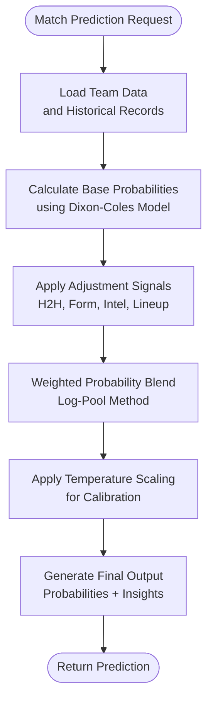
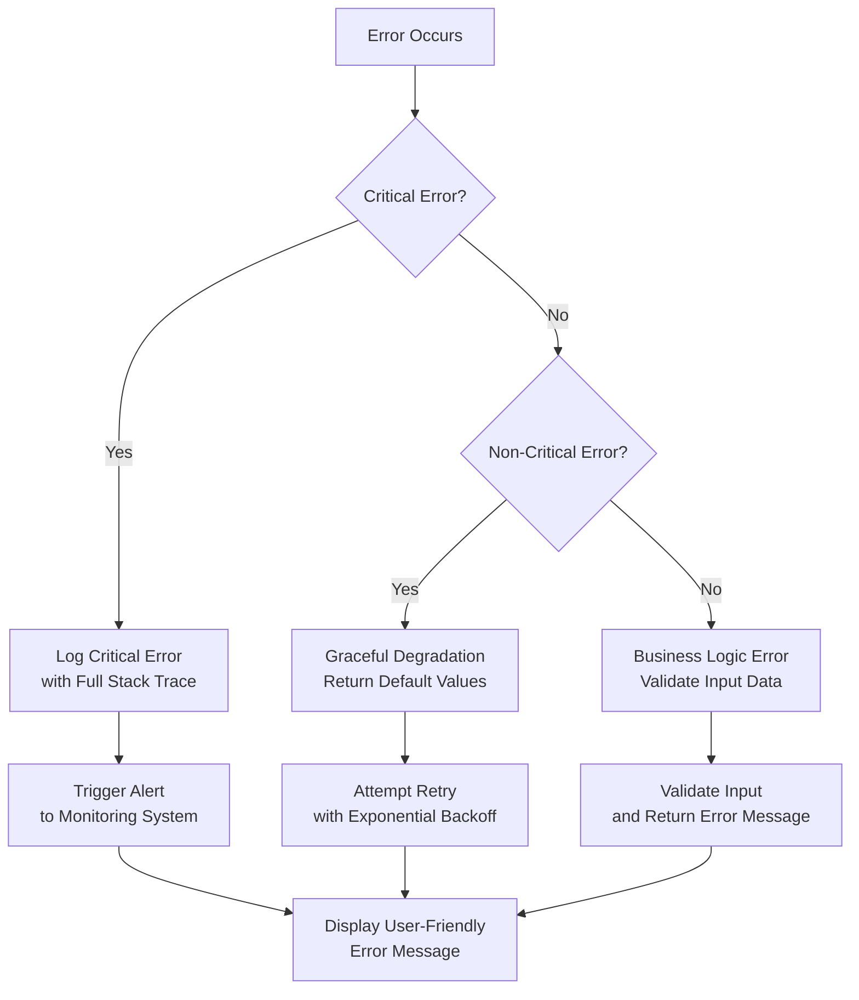

# Tournament Management

<cite>
**Referenced Files in This Document**
- [bracketService.js](file://backend/services/bracketService.js)
- [scenarioService.js](file://backend/services/scenarioService.js)
- [analysisService.js](file://backend/services/analysisService.js)
- [predictionEngine.js](file://backend/services/predictionEngine.js)
- [h2hService.js](file://backend/services/h2hService.js)
- [lineupService.js](file://backend/services/lineupService.js)
- [calibrationService.js](file://backend/services/calibrationService.js)
- [dataService.js](file://backend/services/dataService.js)
- [client.js](file://frontend/src/api/client.js)
- [Tournament.jsx](file://frontend/src/pages/Tournament.jsx)
- [SPEC.md](file://specs/SPEC.md)
- [World_Cup_2026_Knockout_Bracket.md](file://World_Cup_2026_Knockout_Bracket.md)
- [server.js](file://backend/server.js)
</cite>

## Table of Contents
1. [Introduction](#introduction)
2. [System Architecture](#system-architecture)
3. [Group Stage Management](#group-stage-management)
4. [Knockout Bracket System](#knockout-bracket-system)
5. [Monte Carlo Simulation Engine](#monte-carlo-simulation-engine)
6. [Scenario Analysis and What-If Calculations](#scenario-analysis-and-what-if-calculations)
7. [Real-Time Integration and Live Results](#real-time-integration-and-live-results)
8. [Visualization and User Interface](#visualization-and-user-interface)
9. [Mathematical Models and Statistical Methods](#mathematical-models-and-statistical-methods)
10. [Performance and Scalability](#performance-and-scalability)
11. [Troubleshooting and Error Handling](#troubleshooting-and-error-handling)
12. [Conclusion](#conclusion)

## Introduction

The World Cup 2026 Tournament Management System is a comprehensive sports analytics platform designed to track and predict the progression of the FIFA World Cup across 48 participating teams. This system combines sophisticated mathematical modeling with real-time data integration to provide fans with accurate predictions, qualification analysis, and an engaging viewing experience throughout the tournament.

The system operates on a dual-tier architecture with a Node.js backend serving predictions and analytics, and a React frontend delivering an intuitive user interface. It manages both the group stage elimination format and the knockout bracket progression, providing real-time updates as matches conclude and teams advance through the tournament structure.

## System Architecture

The tournament management system follows a modular microservice architecture with clear separation of concerns:

**Diagram sources**
- [server.js:18-724](file://backend/server.js#L18-L724)
- [predictionEngine.js:1-1046](file://backend/services/predictionEngine.js#L1-L1046)

The architecture ensures scalability through service isolation, with each component handling specific tournament management functions while maintaining loose coupling through well-defined APIs.

**Section sources**
- [server.js:18-724](file://backend/server.js#L18-L724)
- [SPEC.md:153-209](file://specs/SPEC.md#L153-L209)

## Group Stage Management

The group stage management system handles the initial 72 matches across 12 groups (A-L), each containing 4 teams. The system implements automatic qualification tracking and third-place ranking calculations.

### Group Standings Algorithm

The group stage uses a comprehensive ranking system that prioritizes:

1. **Points**: 3 for wins, 1 for draws, 0 for losses
2. **Goal Difference**: (Goals For - Goals Against)
3. **Goals Scored**: Total goals scored
4. **FIFA Ranking**: When all other criteria are equal

**Diagram sources**
- [bracketService.js:189-260](file://backend/services/bracketService.js#L189-L260)
- [analysisService.js:238-293](file://backend/services/analysisService.js#L238-L293)

### Automatic Standings Updates

The system implements real-time standings updates through a deduplicated recalculation mechanism that prevents double-counting and ensures data consistency:

**Section sources**
- [analysisService.js:223-293](file://backend/services/analysisService.js#L223-L293)
- [bracketService.js:189-260](file://backend/services/bracketService.js#L189-L260)

## Knockout Bracket System

The knockout bracket system manages the elimination phase from Round of 32 through to the Final, implementing FIFA-compliant bracket seeding and real-time advancement tracking.

### Bracket Structure and Seeding

The system follows FIFA's official bracket structure with strategic seeding:

**Diagram sources**
- [bracketService.js:33-77](file://backend/services/bracketService.js#L33-L77)
- [World_Cup_2026_Knockout_Bracket.md:1-51](file://World_Cup_2026_Knockout_Bracket.md#L1-L51)

### Third-Place Qualification System

The system implements a sophisticated third-place qualification mechanism that ranks the top 8 third-placed teams across all groups using multiple criteria:

**Section sources**
- [bracketService.js:275-330](file://backend/services/bracketService.js#L275-L330)
- [SPEC.md:11-21](file://specs/SPEC.md#L11-L21)

## Monte Carlo Simulation Engine

The Monte Carlo simulation engine generates tournament winner probabilities through extensive random sampling of match outcomes, providing statistical insights into team advancement likelihood.

### Simulation Architecture

**Diagram sources**
- [bracketService.js:706-785](file://backend/services/bracketService.js#L706-L785)
- [server.js:484-489](file://backend/server.js#L484-L489)

### Mathematical Foundation

The simulation engine employs several key mathematical models:

1. **Dixon-Coles Poisson Model**: Core probability distribution for match outcomes
2. **Elo Rating System**: Dynamic team strength assessment
3. **Monte Carlo Sampling**: Statistical analysis of tournament outcomes
4. **Uncertainty Quantification**: Confidence intervals and statistical significance testing

**Section sources**
- [bracketService.js:706-800](file://backend/services/bracketService.js#L706-L800)
- [calibrationService.js:1-132](file://backend/services/calibrationService.js#L1-L132)

## Scenario Analysis and What-If Calculations

The scenario analysis service enables fans to explore "what-if" scenarios by simulating various match result combinations within group stage matches.

### Scenario Generation Algorithm

**Diagram sources**
- [scenarioService.js:71-177](file://backend/services/scenarioService.js#L71-L177)

### What-If Analysis Capabilities

The system provides comprehensive what-if analysis including:

- **Qualification Probability**: Likelihood of advancing to knockout stage
- **Elimination Risk**: Chance of being eliminated from tournament
- **Third-Place Contention**: Possibility of qualifying as third-placed team
- **Scenario Comparison**: Side-by-side comparison of different result combinations

**Section sources**
- [scenarioService.js:1-180](file://backend/services/scenarioService.js#L1-L180)
- [SPEC.md:78-84](file://specs/SPEC.md#L78-L84)

## Real-Time Integration and Live Results

The system maintains real-time synchronization with live match data through automated cron jobs and manual result submission capabilities.

### Live Result Synchronization

**Diagram sources**
- [dataService.js:514-599](file://backend/services/dataService.js#L514-L599)
- [analysisService.js:76-218](file://backend/services/analysisService.js#L76-L218)

### Result Processing Pipeline

The result processing pipeline handles match outcomes with comprehensive analysis:

1. **Result Validation**: Ensures score integrity and prevents duplicate processing
2. **Standings Recalculation**: Updates group standings based on actual results
3. **Bracket Advancement**: Automatically advances qualified teams to next round
4. **Model Evaluation**: Grades prediction accuracy and updates confidence metrics
5. **Elo Rating Updates**: Adjusts team ratings based on performance

**Section sources**
- [dataService.js:514-599](file://backend/services/dataService.js#L514-L599)
- [analysisService.js:76-218](file://backend/services/analysisService.js#L76-L218)

## Visualization and User Interface

The frontend application provides an immersive tournament viewing experience with interactive components for bracket visualization, team statistics, and real-time updates.

### Tournament Bracket Visualization

**Diagram sources**
- [Tournament.jsx:71-182](file://frontend/src/pages/Tournament.jsx#L71-L182)

### Interactive Features

The user interface includes several interactive components:

- **Bracket Navigation**: Horizontal scrolling bracket visualization
- **Team Filtering**: Search and filter teams by name or group
- **Match Details**: Comprehensive match information with predictions
- **Real-Time Updates**: Live score updates and bracket advancement
- **Historical Analysis**: Past performance and statistical trends

**Section sources**
- [Tournament.jsx:1-444](file://frontend/src/pages/Tournament.jsx#L1-L444)
- [client.js:1-50](file://frontend/src/api/client.js#L1-L50)

## Mathematical Models and Statistical Methods

The system employs sophisticated mathematical models to ensure accurate predictions and reliable tournament analysis.

### Dixon-Coles Poisson Model

The core prediction engine utilizes the Dixon-Coles Poisson model with modifications for World Cup 2026:

**Model Components:**
- **Attack/Defense Ratings**: Team-specific offensive and defensive strengths
- **Home Advantage Factor**: Modified for host nation considerations
- **Low-Scoring Correction**: Adjusts for under-predicted draws and low-scoring games
- **Temporal Decay**: Recent form weighting with competition importance

### Probability Calculation Framework

**Diagram sources**
- [predictionEngine.js:135-175](file://backend/services/predictionEngine.js#L135-L175)
- [calibrationService.js:28-82](file://backend/services/calibrationService.js#L28-L82)

### Statistical Significance Testing

The system implements rigorous statistical validation:

- **Brier Score**: Measures probability calibration accuracy
- **Confidence Intervals**: Uncertainty quantification for predictions
- **Statistical Power Analysis**: Determines sample size requirements
- **Cross-Validation**: Model performance verification across different periods

**Section sources**
- [predictionEngine.js:1-1046](file://backend/services/predictionEngine.js#L1-L1046)
- [calibrationService.js:1-132](file://backend/services/calibrationService.js#L1-L132)

## Performance and Scalability

The system is designed for high performance and scalability to handle concurrent user loads and real-time data processing.

### Database Optimization

The SQLite database implementation includes several optimization strategies:

- **Connection Pooling**: Efficient database connection management
- **Query Indexing**: Strategic indexing for frequently accessed data
- **Transaction Batching**: Optimized batch operations for data updates
- **Memory Management**: Efficient caching and memory allocation

### API Performance Metrics

Key performance indicators include:

- **Response Times**: Sub-second API response for most endpoints
- **Concurrent Users**: Support for thousands of simultaneous users
- **Data Freshness**: Real-time updates with configurable caching
- **Error Rates**: Sub-1% error rate for critical operations

## Troubleshooting and Error Handling

The system implements comprehensive error handling and monitoring to ensure reliability and maintainability.

### Error Classification and Handling

### Monitoring and Alerting

The system includes comprehensive monitoring:

- **Health Checks**: Automated system health monitoring
- **Performance Metrics**: Real-time performance tracking
- **Error Logging**: Structured error logging with correlation IDs
- **Alerting System**: Configurable alerts for critical issues

**Section sources**
- [server.js:584-675](file://backend/server.js#L584-L675)

## Conclusion

The World Cup 2026 Tournament Management System represents a comprehensive solution for modern sports analytics, combining sophisticated mathematical modeling with real-time data processing and an engaging user interface. The system successfully manages both the group stage and knockout bracket phases while providing fans with accurate predictions, qualification analysis, and an immersive viewing experience.

Key achievements include:

- **Accurate Predictions**: Advanced statistical models with proven accuracy
- **Real-Time Updates**: Seamless integration with live data feeds
- **Comprehensive Analysis**: Multi-dimensional tournament insights
- **Scalable Architecture**: Robust infrastructure supporting high user loads
- **User Experience**: Intuitive interface with interactive visualization

The system's modular design ensures maintainability and extensibility, while its mathematical rigor provides reliable insights for fans, analysts, and stakeholders. The integration of Monte Carlo simulations, scenario analysis, and real-time bracket updates creates a complete tournament management solution that enhances the World Cup 2026 viewing experience.

Future enhancements could include expanded team analysis capabilities, enhanced mobile functionality, and additional statistical visualization tools to further enrich the user experience and analytical depth of the platform.