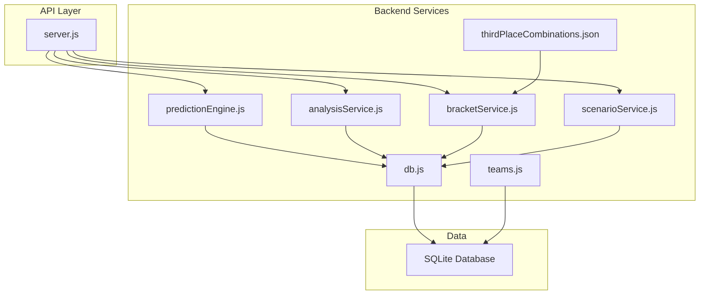
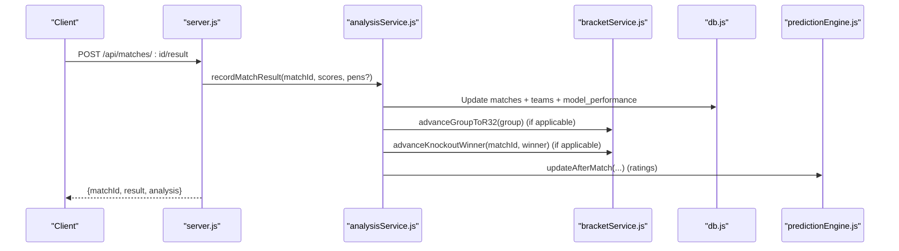
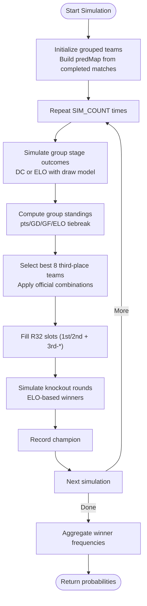
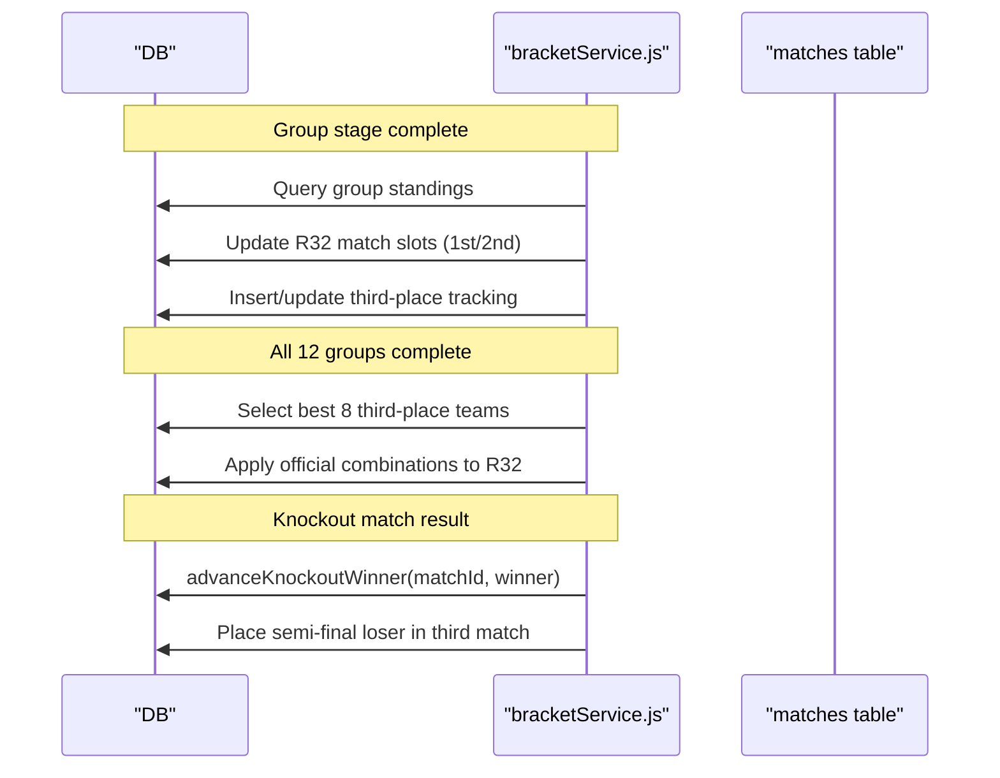
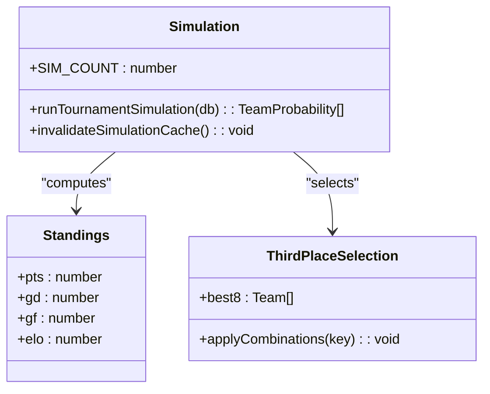
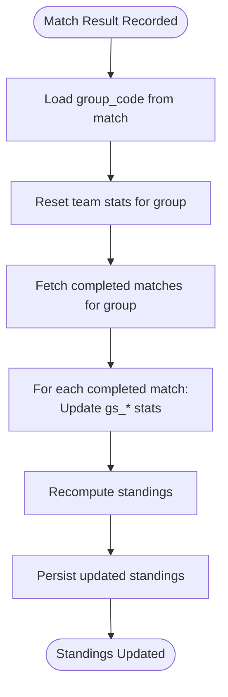
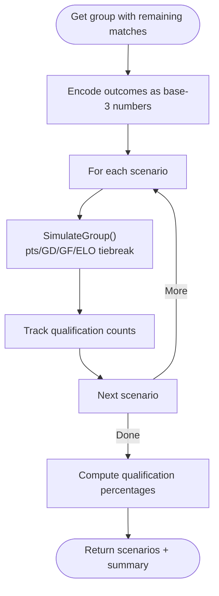
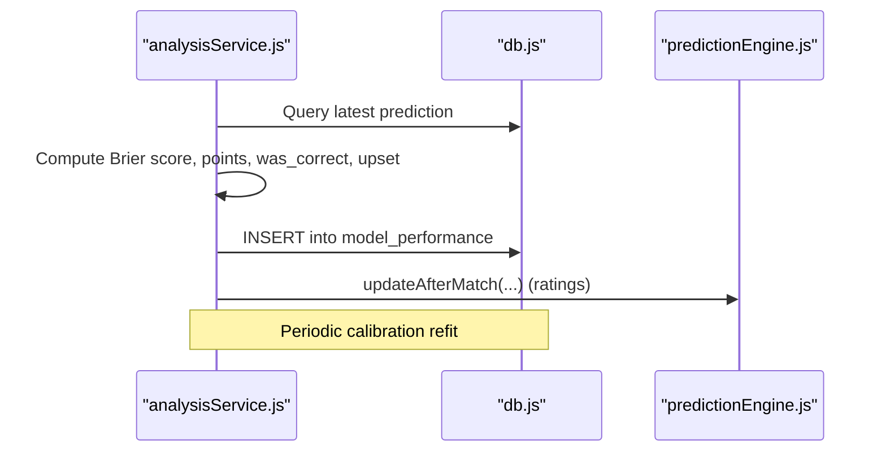
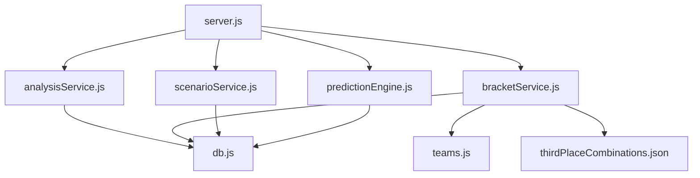

# Tournament Management

<cite>
**Referenced Files in This Document**
- [bracketService.js](file://backend/services/bracketService.js)
- [scenarioService.js](file://backend/services/scenarioService.js)
- [analysisService.js](file://backend/services/analysisService.js)
- [predictionEngine.js](file://backend/services/predictionEngine.js)
- [db.js](file://backend/database/db.js)
- [teams.js](file://backend/data/teams.js)
- [thirdPlaceCombinations.json](file://backend/data/thirdPlaceCombinations.json)
- [modelV2.js](file://backend/scripts/modelV2.js)
- [regen-predictions.js](file://backend/scripts/regen-predictions.js)
- [server.js](file://backend/server.js)
</cite>

## Table of Contents
1. [Introduction](#introduction)
2. [Project Structure](#project-structure)
3. [Core Components](#core-components)
4. [Architecture Overview](#architecture-overview)
5. [Detailed Component Analysis](#detailed-component-analysis)
6. [Dependency Analysis](#dependency-analysis)
7. [Performance Considerations](#performance-considerations)
8. [Troubleshooting Guide](#troubleshooting-guide)
9. [Conclusion](#conclusion)

## Introduction
This document describes the tournament management system for the 2026 FIFA World Cup, focusing on the bracket simulation service using Monte Carlo methods, knockout stage advancement logic, winner probability calculations, standings computation, qualification scenario analysis, and performance tracking. It explains how live match results integrate with tournament progression, enabling automated bracket updates and real-time standings adjustments.

## Project Structure
The system is organized around modular services that encapsulate prediction, analysis, bracket progression, scenario modeling, and data persistence. The backend exposes REST endpoints for clients and automations, while SQLite serves as the persistent store.

**Diagram sources**
- [server.js:1-680](file://backend/server.js#L1-L680)
- [predictionEngine.js:1-1020](file://backend/services/predictionEngine.js#L1-L1020)
- [analysisService.js:1-422](file://backend/services/analysisService.js#L1-L422)
- [bracketService.js:1-1080](file://backend/services/bracketService.js#L1-L1080)
- [scenarioService.js:1-180](file://backend/services/scenarioService.js#L1-L180)
- [db.js:1-252](file://backend/database/db.js#L1-L252)
- [teams.js:1-234](file://backend/data/teams.js#L1-L234)
- [thirdPlaceCombinations.json:1-1](file://backend/data/thirdPlaceCombinations.json#L1-L1)

**Section sources**
- [server.js:1-680](file://backend/server.js#L1-L680)
- [db.js:23-252](file://backend/database/db.js#L23-L252)

## Core Components
- Prediction Engine: Implements a Dixon-Coles bivariate Poisson model with online attack/defense updates, blending multiple adjustment signals (H2H, form, intelligence, lineup, rest days) via log-pool aggregation. Produces match outcome probabilities, expected scores, and confidence tiers.
- Analysis & Learning Service: Records match results, compares predictions to outcomes, computes Brier score and points-based accuracy, updates ELO and v2 ratings, recalculates group standings, and generates insights.
- Bracket Service: Manages group-to-R32 advancement, best-8 third-place selection using official combinations, knockout-stage progression, and Monte Carlo simulations for winner probabilities and road-to-final snapshots.
- Scenario Service: Enumerates qualification scenarios for group stage by brute-forcing remaining match outcomes and computing final standings and qualification probabilities.
- Database Schema: Defines tables for teams, matches, predictions, model performance, bracket slots, ELO history, and model configuration.

**Section sources**
- [predictionEngine.js:1-1020](file://backend/services/predictionEngine.js#L1-L1020)
- [analysisService.js:1-422](file://backend/services/analysisService.js#L1-L422)
- [bracketService.js:1-1080](file://backend/services/bracketService.js#L1-L1080)
- [scenarioService.js:1-180](file://backend/services/scenarioService.js#L1-L180)
- [db.js:23-252](file://backend/database/db.js#L23-L252)

## Architecture Overview
The system integrates live results with automated tournament progression and real-time analytics. Live results trigger updates to group standings, knockout bracket advancement, and model performance tracking. Predictions feed both user-facing dashboards and the Monte Carlo simulation pipeline.

**Diagram sources**
- [server.js:282-302](file://backend/server.js#L282-L302)
- [analysisService.js:76-218](file://backend/services/analysisService.js#L76-L218)
- [bracketService.js:209-260](file://backend/services/bracketService.js#L209-L260)

## Detailed Component Analysis

### Bracket Simulation Service (Monte Carlo)
- Purpose: Compute winner probabilities for the entire tournament using Monte Carlo sampling of group and knockout stages.
- Methodology:
  - Group stage: Simulates each match outcome using either DC prediction probabilities (for completed matches) or ELO-based outcomes with draw modeling. Tiebreakers use goal difference and goals scored.
  - Third-place allocation: Uses the official combination table keyed by the eight groups whose third-place teams qualify, assigning the best eight third-placed teams to specific winner slots.
  - Knockout stage: Uses ELO-based deterministic winners for each simulated match, advancing through R32 → R16 → QF → SF → Final.
- Outputs: Winner frequency across SIM_COUNT simulations, enabling probability rankings and road-to-final snapshots.

**Diagram sources**
- [bracketService.js:756-850](file://backend/services/bracketService.js#L756-L850)
- [bracketService.js:852-906](file://backend/services/bracketService.js#L852-L906)

**Section sources**
- [bracketService.js:706-906](file://backend/services/bracketService.js#L706-L906)
- [thirdPlaceCombinations.json:1-1](file://backend/data/thirdPlaceCombinations.json#L1-L1)

### Knockout Stage Advancement Logic
- Group completion triggers filling R32 slots with 1st and 2nd place teams from each group.
- After all groups complete, the best eight third-place teams are selected using the official combination table and assigned to specific R32 slots.
- Knockout progression: After each match, the winner advances to the next round via bracket slot updates. Third-place match placement occurs automatically for semi-final losers.

**Diagram sources**
- [bracketService.js:209-364](file://backend/services/bracketService.js#L209-L364)
- [bracketService.js:332-364](file://backend/services/bracketService.js#L332-L364)

**Section sources**
- [bracketService.js:189-364](file://backend/services/bracketService.js#L189-L364)

### Winner Probability Calculations
- Group stage: Uses DC model probabilities for completed matches and ELO-based outcomes for remaining matches. Standings computed with points, goal difference, goals scored, and ELO tiebreakers.
- Knockout stage: Deterministic ELO-based winners for each simulated match.
- Aggregation: Frequencies across SIM_COUNT simulations yield each team’s probability of winning the tournament.

**Diagram sources**
- [bracketService.js:706-906](file://backend/services/bracketService.js#L706-L906)
- [bracketService.js:787-850](file://backend/services/bracketService.js#L787-L850)

**Section sources**
- [bracketService.js:706-906](file://backend/services/bracketService.js#L706-L906)

### Standings Calculation Algorithms
- Group stage: Recompute standings from scratch using completed matches to avoid double-counting. Updates gs_played, gs_won/drawn/lost, gs_gf/ga, gs_pts per match result.
- Ranking criteria: Points descending, goal difference descending, goals scored descending, name ascending for ties.
- Real-time updates: Standings recalculated whenever a group match result is recorded.

**Diagram sources**
- [analysisService.js:238-293](file://backend/services/analysisService.js#L238-L293)

**Section sources**
- [analysisService.js:223-293](file://backend/services/analysisService.js#L223-L293)

### Qualification Scenario Analysis and What-If Calculators
- Scenario enumeration: For a given group with remaining matches, brute-force all 3^n possible outcomes (n = remaining matches) and compute final standings and qualification status for each scenario.
- Summary statistics: Tracks how often each team qualifies (1st/2nd) or becomes a third-place contender, and computes qualification percentages.
- Practical limits: Groups with more than three remaining matches are pruned to maintain performance.

**Diagram sources**
- [scenarioService.js:17-177](file://backend/services/scenarioService.js#L17-L177)

**Section sources**
- [scenarioService.js:1-180](file://backend/services/scenarioService.js#L1-L180)

### Performance Tracking, Post-Match Grading, and Accuracy Metrics
- Post-match grading: Compares predicted outcome and top scorelines to actual result, computes Brier score, points-based scoring (3/2/1/0), and records model performance metrics.
- Calibration: Periodically refits output calibration temperature and Dixon-Coles ρ parameters based on observed outcomes.
- Accuracy metrics: Provides overall accuracy, outcome accuracy, Brier score averages, and stage-wise breakdowns, along with recent performance examples.

**Diagram sources**
- [analysisService.js:130-218](file://backend/services/analysisService.js#L130-L218)
- [analysisService.js:321-384](file://backend/services/analysisService.js#L321-L384)

**Section sources**
- [analysisService.js:30-218](file://backend/services/analysisService.js#L30-L218)
- [analysisService.js:321-384](file://backend/services/analysisService.js#L321-L384)

### Scenario Service for Group Stage Qualification Possibilities
- Inputs: Current group standings, remaining matches, and completed results.
- Outputs: Complete scenarios with outcomes and a summary showing qualification counts and probabilities for each team.
- Integration: Supports “what-if” analysis by allowing users to explore how different match outcomes affect qualification.

**Section sources**
- [scenarioService.js:71-177](file://backend/services/scenarioService.js#L71-L177)

### Integration Between Live Match Results and Tournament Progression
- Live sync: Cron job periodically syncs live results, triggering automatic updates to match status, scores, and winner determination.
- Automated bracket updates: Group completions automatically fill R32 slots; knockout results advance winners and third-place match participants.
- Real-time standings: Group standings are recalculated immediately upon result recording, ensuring dashboards reflect current state.

**Section sources**
- [server.js:584-631](file://backend/server.js#L584-L631)
- [server.js:282-302](file://backend/server.js#L282-L302)
- [analysisService.js:118-128](file://backend/services/analysisService.js#L118-L128)

## Dependency Analysis
The system exhibits clear separation of concerns with explicit dependencies among services and the database.

**Diagram sources**
- [server.js:1-680](file://backend/server.js#L1-L680)
- [analysisService.js:1-422](file://backend/services/analysisService.js#L1-L422)
- [bracketService.js:1-1080](file://backend/services/bracketService.js#L1-L1080)
- [scenarioService.js:1-180](file://backend/services/scenarioService.js#L1-L180)
- [predictionEngine.js:1-1020](file://backend/services/predictionEngine.js#L1-L1020)
- [db.js:1-252](file://backend/database/db.js#L1-L252)
- [teams.js:1-234](file://backend/data/teams.js#L1-L234)
- [thirdPlaceCombinations.json:1-1](file://backend/data/thirdPlaceCombinations.json#L1-L1)

**Section sources**
- [server.js:1-680](file://backend/server.js#L1-L680)
- [db.js:23-252](file://backend/database/db.js#L23-L252)

## Performance Considerations
- Monte Carlo scaling: SIM_COUNT impacts runtime and memory; cache invalidation ensures subsequent queries reflect updated simulations.
- Scenario enumeration: Limited to groups with ≤3 remaining matches to keep 3^n scenarios tractable.
- Prediction regeneration: Batch generation with cooldown prevents excessive recomputation and maintains freshness.
- Database migrations: Schema additions are idempotent; initial seeding avoids redundant work.

[No sources needed since this section provides general guidance]

## Troubleshooting Guide
- Missing predictions: Use batch generation endpoint to refresh predictions for upcoming matches.
- Stale simulation cache: Invalidate cache after result submissions to ensure updated winner probabilities.
- Calibration issues: Monitor periodic calibration refits and review model weights to adjust signal emphasis.
- Bracket anomalies: Verify bracket stubs and slot assignments; ensure group completions trigger R32 updates.

**Section sources**
- [server.js:399-461](file://backend/server.js#L399-L461)
- [bracketService.js:711-713](file://backend/services/bracketService.js#L711-L713)
- [analysisService.js:199-211](file://backend/services/analysisService.js#L199-L211)

## Conclusion
The tournament management system combines a sophisticated prediction engine, robust analysis and learning pipeline, and comprehensive scenario modeling to deliver accurate, real-time coverage of group and knockout progressions. Monte Carlo simulations provide probabilistic insights, while automated bracket updates and recalculated standings ensure dashboards remain synchronized with live events.