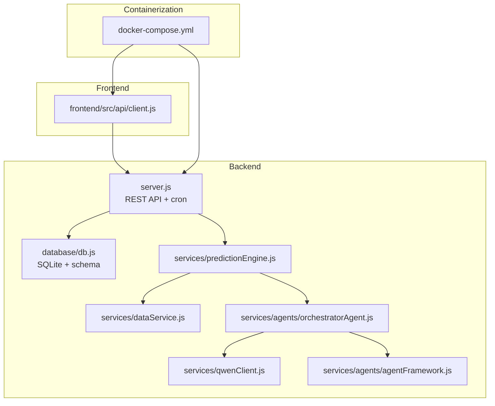
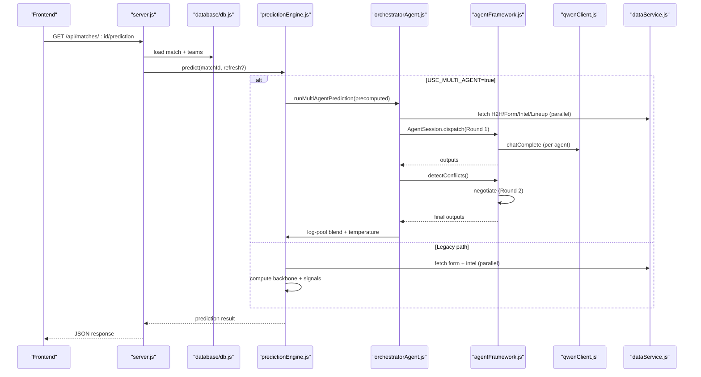
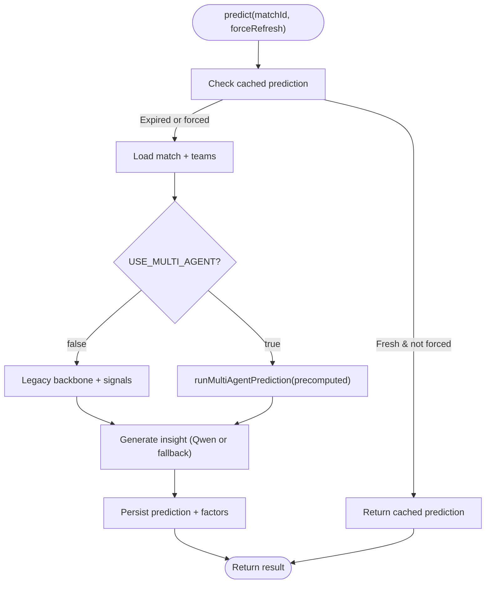
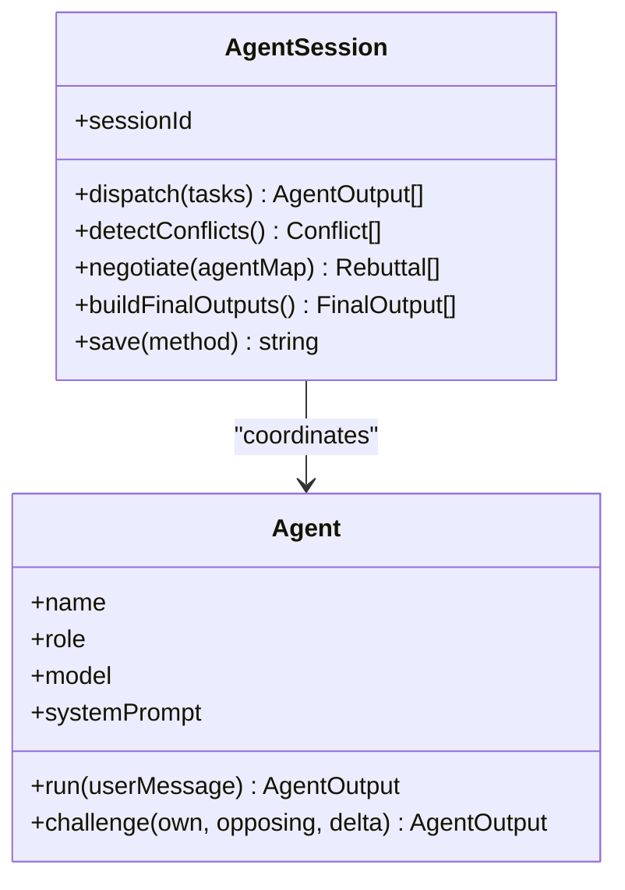
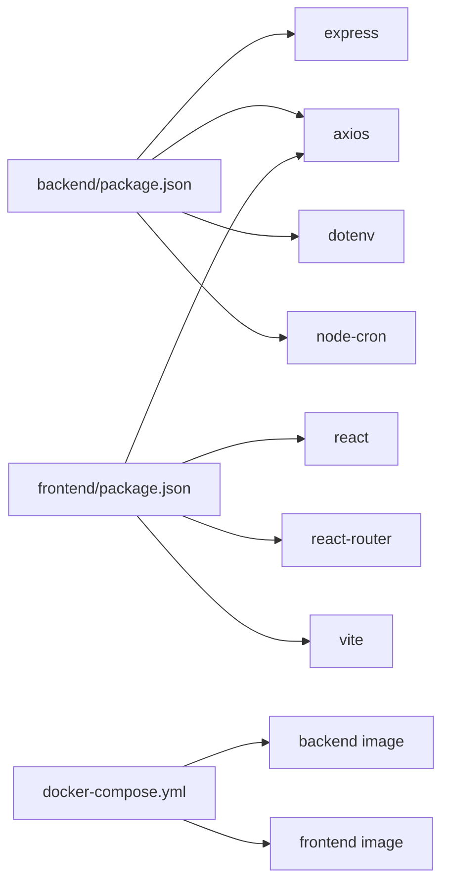

# Troubleshooting & FAQ

<cite>
**Referenced Files in This Document**
- [README.md](file://README.md)
- [SETUP.md](file://SETUP.md)
- [backend/.env.example](file://backend/.env.example)
- [docker-compose.yml](file://docker-compose.yml)
- [backend/package.json](file://backend/package.json)
- [frontend/package.json](file://frontend/package.json)
- [backend/server.js](file://backend/server.js)
- [backend/database/db.js](file://backend/database/db.js)
- [backend/services/qwenClient.js](file://backend/services/qwenClient.js)
- [backend/services/dataService.js](file://backend/services/dataService.js)
- [backend/services/predictionEngine.js](file://backend/services/predictionEngine.js)
- [backend/services/agents/orchestratorAgent.js](file://backend/services/agents/orchestratorAgent.js)
- [backend/services/agents/agentFramework.js](file://backend/services/agents/agentFramework.js)
- [frontend/src/api/client.js](file://frontend/src/api/client.js)
- [backend/services/predictionEngine.test.js](file://backend/services/predictionEngine.test.js)
</cite>

## Table of Contents
1. [Introduction](#introduction)
2. [Project Structure](#project-structure)
3. [Core Components](#core-components)
4. [Architecture Overview](#architecture-overview)
5. [Detailed Component Analysis](#detailed-component-analysis)
6. [Dependency Analysis](#dependency-analysis)
7. [Performance Considerations](#performance-considerations)
8. [Troubleshooting Guide](#troubleshooting-guide)
9. [Conclusion](#conclusion)
10. [Appendices](#appendices)

## Introduction
This document provides comprehensive troubleshooting guidance for WC26-Qwen-Qoder. It covers environment configuration, API key issues, database connectivity, prediction engine debugging, multi-agent system failures, frontend rendering issues, Docker and networking problems, performance tuning, error interpretation, log analysis, and production incident response.

## Project Structure
The project consists of:
- Backend (Node.js/Express) serving predictions, managing SQLite, orchestrating multi-agent inference, and exposing REST APIs.
- Frontend (React/Vite) consuming the backend API and rendering tournament data.
- Docker Compose for containerized deployment with a backend service and an nginx-based frontend service.

**Diagram sources**
- [backend/server.js:1-681](file://backend/server.js#L1-L681)
- [backend/database/db.js:1-252](file://backend/database/db.js#L1-L252)
- [backend/services/predictionEngine.js:1-1020](file://backend/services/predictionEngine.js#L1-L1020)
- [backend/services/qwenClient.js:1-123](file://backend/services/qwenClient.js#L1-L123)
- [backend/services/dataService.js:1-583](file://backend/services/dataService.js#L1-L583)
- [backend/services/agents/orchestratorAgent.js:1-471](file://backend/services/agents/orchestratorAgent.js#L1-L471)
- [backend/services/agents/agentFramework.js:1-576](file://backend/services/agents/agentFramework.js#L1-L576)
- [frontend/src/api/client.js:1-50](file://frontend/src/api/client.js#L1-L50)
- [docker-compose.yml:1-34](file://docker-compose.yml#L1-L34)

**Section sources**
- [README.md:106-263](file://README.md#L106-L263)
- [SETUP.md:163-224](file://SETUP.md#L163-L224)
- [docker-compose.yml:1-34](file://docker-compose.yml#L1-L34)

## Core Components
- Environment variables: API keys, feature flags, CORS origins, and ports.
- Prediction engine: Single-model (Dixon-Coles) and multi-agent modes.
- Multi-agent framework: Agent orchestration, conflict detection, negotiation, and persistence.
- Data services: Live results sync, form/intel ingestion, and caching.
- Qwen client: OpenAI-compatible DashScope wrapper with retry/backoff.
- Database: SQLite with WAL mode, migrations, and agent session storage.
- Frontend API client: Axios-based client with environment-driven base URL.

**Section sources**
- [backend/.env.example:1-17](file://backend/.env.example#L1-L17)
- [README.md:139-151](file://README.md#L139-L151)
- [backend/services/predictionEngine.js:55-61](file://backend/services/predictionEngine.js#L55-L61)
- [backend/services/agents/orchestratorAgent.js:288-471](file://backend/services/agents/orchestratorAgent.js#L288-L471)
- [backend/services/agents/agentFramework.js:32-576](file://backend/services/agents/agentFramework.js#L32-L576)
- [backend/services/dataService.js:18-583](file://backend/services/dataService.js#L18-L583)
- [backend/services/qwenClient.js:1-123](file://backend/services/qwenClient.js#L1-L123)
- [backend/database/db.js:1-252](file://backend/database/db.js#L1-L252)
- [frontend/src/api/client.js:1-50](file://frontend/src/api/client.js#L1-L50)

## Architecture Overview
End-to-end flow from frontend to prediction and multi-agent orchestration.

**Diagram sources**
- [backend/server.js:326-341](file://backend/server.js#L326-L341)
- [backend/services/predictionEngine.js:665-730](file://backend/services/predictionEngine.js#L665-L730)
- [backend/services/agents/orchestratorAgent.js:300-471](file://backend/services/agents/orchestratorAgent.js#L300-L471)
- [backend/services/agents/agentFramework.js:340-493](file://backend/services/agents/agentFramework.js#L340-L493)
- [backend/services/qwenClient.js:53-101](file://backend/services/qwenClient.js#L53-L101)
- [backend/services/dataService.js:68-133](file://backend/services/dataService.js#L68-L133)

## Detailed Component Analysis

### Environment Variables and Configuration
Common misconfigurations and remedies:
- Missing or invalid API keys:
  - DASHSCOPE_API_KEY must be set for multi-agent and insight generation.
  - FOOTBALL_DATA_API_KEY enables live scores and form; without it, synthetic data is used.
- Feature flags:
  - USE_MULTI_AGENT toggles multi-agent mode; defaults to false.
- CORS and ports:
  - FRONTEND_URL must match the frontend origin.
  - PORT controls the backend port; default is 6173.
- Database path:
  - DB_PATH must point to a writable location inside the backend container for Docker deployments.

**Section sources**
- [backend/.env.example:1-17](file://backend/.env.example#L1-L17)
- [README.md:139-151](file://README.md#L139-L151)
- [backend/server.js:19-21](file://backend/server.js#L19-L21)
- [docker-compose.yml:8-12](file://docker-compose.yml#L8-L12)

### Prediction Engine Debugging
Symptoms and checks:
- Single-model vs multi-agent:
  - Verify USE_MULTI_AGENT via environment and DB model_config.
  - Legacy path computes backbone + signals; multi-agent path delegates to orchestrator.
- Backpressure and timeouts:
  - Legacy path uses Promise.all for parallel fetches; ensure adequate CPU/memory.
- Insight generation fallback:
  - If Qwen fails, engine falls back to template text.

**Diagram sources**
- [backend/services/predictionEngine.js:665-800](file://backend/services/predictionEngine.js#L665-L800)
- [backend/services/agents/orchestratorAgent.js:288-471](file://backend/services/agents/orchestratorAgent.js#L288-L471)

**Section sources**
- [backend/services/predictionEngine.js:55-61](file://backend/services/predictionEngine.js#L55-L61)
- [backend/services/predictionEngine.js:665-730](file://backend/services/predictionEngine.js#L665-L730)
- [backend/services/predictionEngine.js:606-635](file://backend/services/predictionEngine.js#L606-L635)

### Multi-Agent System Failures
Common issues and diagnostics:
- Agent output parsing:
  - Outputs must conform to a strict JSON schema; otherwise fallbacks are applied.
- Conflict detection and negotiation:
  - Threshold is 0.20; if no conflicts, negotiation is skipped.
  - Weight adjustments penalize overconfident agents who concede more.
- Persistence:
  - Sessions, messages, and conflicts are saved to DB for auditability.

**Diagram sources**
- [backend/services/agents/agentFramework.js:201-320](file://backend/services/agents/agentFramework.js#L201-L320)
- [backend/services/agents/agentFramework.js:326-562](file://backend/services/agents/agentFramework.js#L326-L562)

**Section sources**
- [backend/services/agents/agentFramework.js:32-576](file://backend/services/agents/agentFramework.js#L32-L576)
- [backend/services/agents/orchestratorAgent.js:367-471](file://backend/services/agents/orchestratorAgent.js#L367-L471)

### Data Services and Live Results Sync
- Live sync:
  - Requires FOOTBALL_DATA_API_KEY; otherwise logs a warning and skips.
  - Updates match statuses and records results, invoking post-match analysis.
- Form and intel:
  - Parallel fetches with caching; fallbacks to web scraping and synthetic data.

**Section sources**
- [backend/services/dataService.js:495-583](file://backend/services/dataService.js#L495-L583)
- [backend/services/dataService.js:68-133](file://backend/services/dataService.js#L68-L133)
- [backend/services/dataService.js:413-490](file://backend/services/dataService.js#L413-L490)

### Qwen/DashScope Client
- Connectivity:
  - Throws if DASHSCOPE_API_KEY is missing.
  - Implements retry/backoff for transient errors.
- Ping utility:
  - Quick health check using a short turbo model call.

**Section sources**
- [backend/services/qwenClient.js:60-101](file://backend/services/qwenClient.js#L60-L101)
- [backend/services/qwenClient.js:107-120](file://backend/services/qwenClient.js#L107-L120)

### Database Connectivity and Schema
- SQLite initialization:
  - Lock cleanup, pragmas, foreign keys, and migrations.
- Container path:
  - DB_PATH must be mapped to a writable volume in Docker.

**Section sources**
- [backend/database/db.js:10-21](file://backend/database/db.js#L10-L21)
- [backend/database/db.js:23-252](file://backend/database/db.js#L23-L252)
- [docker-compose.yml:11-12](file://docker-compose.yml#L11-L12)

### Frontend Rendering Issues
- Base URL:
  - API base URL is derived from VITE_API_URL or defaults to /api.
- Network timeouts:
  - Frontend sets a 15s timeout; long-running operations may exceed this.

**Section sources**
- [frontend/src/api/client.js:3-7](file://frontend/src/api/client.js#L3-L7)
- [frontend/src/api/client.js:19-25](file://frontend/src/api/client.js#L19-L25)

## Dependency Analysis
- Backend dependencies:
  - Express, SQLite WASM, axios, cheerio, dotenv, cors, node-cron.
- Frontend dependencies:
  - React, axios, react-router, recharts, vite, testing libraries.
- Docker Compose:
  - Builds backend and frontend images, mounts volumes, and exposes ports.

**Diagram sources**
- [backend/package.json:14-31](file://backend/package.json#L14-L31)
- [frontend/package.json:38-71](file://frontend/package.json#L38-L71)
- [docker-compose.yml:1-34](file://docker-compose.yml#L1-L34)

**Section sources**
- [backend/package.json:14-31](file://backend/package.json#L14-L31)
- [frontend/package.json:38-71](file://frontend/package.json#L38-L71)
- [docker-compose.yml:1-34](file://docker-compose.yml#L1-L34)

## Performance Considerations
- Prediction latency:
  - Multi-agent increases latency due to parallel LLM calls and negotiation.
  - Consider reducing concurrent agents or enabling only essential ones.
- Database:
  - SQLite WAL mode improves concurrency; ensure adequate disk I/O and file permissions in containers.
- Network:
  - DashScope and football-data.org calls can throttle; implement backoff and caching.
- Frontend:
  - Large datasets (predictions, analytics) benefit from pagination and lazy loading.

[No sources needed since this section provides general guidance]

## Troubleshooting Guide

### Environment Variable Configuration
- Symptoms:
  - Qwen insight generation fails with “DASHSCOPE_API_KEY is not set”.
  - Live results sync logs “No FOOTBALL_DATA_API_KEY set — skipping live sync”.
- Remediation:
  - Set DASHSCOPE_API_KEY and optionally FOOTBALL_DATA_API_KEY.
  - Confirm FRONTEND_URL and PORT align with your deployment.
  - For Docker, ensure DB_PATH points to a mounted volume.

**Section sources**
- [backend/services/qwenClient.js:60-62](file://backend/services/qwenClient.js#L60-L62)
- [backend/services/dataService.js:496-499](file://backend/services/dataService.js#L496-L499)
- [backend/.env.example:1-17](file://backend/.env.example#L1-L17)
- [docker-compose.yml:8-12](file://docker-compose.yml#L8-L12)

### API Key Problems
- Symptoms:
  - 5xx errors from LLM calls or timeouts.
  - Agent parsing errors due to malformed JSON.
- Remediation:
  - Validate DASHSCOPE_API_KEY and region/base URL if applicable.
  - Use the ping utility to test connectivity.
  - Reduce concurrency or enable retries strategically.

**Section sources**
- [backend/services/qwenClient.js:107-120](file://backend/services/qwenClient.js#L107-L120)
- [backend/services/agents/agentFramework.js:112-146](file://backend/services/agents/agentFramework.js#L112-L146)

### Database Connection Errors
- Symptoms:
  - SQLite lock errors or inability to write to DB.
  - Schema mismatches after updates.
- Remediation:
  - Remove stale lock directories if the process crashed.
  - Ensure DB_PATH is writable and persisted via Docker volumes.
  - Allow migrations to run on startup.

**Section sources**
- [backend/database/db.js:10-21](file://backend/database/db.js#L10-L21)
- [backend/database/db.js:209-252](file://backend/database/db.js#L209-L252)
- [docker-compose.yml:11-12](file://docker-compose.yml#L11-L12)

### Prediction Engine Failures
- Symptoms:
  - Empty predictions or fallback insights.
  - Unexpected confidence levels.
- Remediation:
  - Verify USE_MULTI_AGENT setting and DB model_config.
  - Check signal fetches (form, intel, lineup) and their caches.
  - Review legacy vs multi-agent paths and adjust feature flags.

**Section sources**
- [backend/services/predictionEngine.js:55-61](file://backend/services/predictionEngine.js#L55-L61)
- [backend/services/predictionEngine.js:732-800](file://backend/services/predictionEngine.js#L732-L800)

### Multi-Agent System Failures
- Symptoms:
  - All agents fail; “cannot produce prediction”.
  - JSON parse errors in agent outputs.
  - No negotiation despite large probability deltas.
- Remediation:
  - Inspect agent session logs in DB (agent_sessions/messages/conflicts).
  - Confirm agent output schema compliance.
  - Lower conflict threshold or reduce agent count if needed.

**Section sources**
- [backend/services/agents/orchestratorAgent.js:382-384](file://backend/services/agents/orchestratorAgent.js#L382-L384)
- [backend/services/agents/agentFramework.js:367-394](file://backend/services/agents/agentFramework.js#L367-L394)
- [backend/services/agents/agentFramework.js:112-146](file://backend/services/agents/agentFramework.js#L112-L146)

### Frontend Rendering Issues
- Symptoms:
  - Blank pages or “Network Error”.
  - Predictions not loading.
- Remediation:
  - Verify VITE_API_URL points to the backend API.
  - Check CORS headers and origin alignment.
  - Increase frontend timeout for long-running endpoints.

**Section sources**
- [frontend/src/api/client.js:3-7](file://frontend/src/api/client.js#L3-L7)
- [backend/server.js:21-21](file://backend/server.js#L21-L21)

### Docker Container Problems
- Symptoms:
  - Containers fail to start or exit immediately.
  - Port conflicts on 80/443.
  - Frontend cannot reach backend.
- Remediation:
  - Ensure ports 80/443 are free on the host or change docker-compose ports.
  - Confirm DB_PATH volume is mounted and writable.
  - Verify BACKEND_URL in frontend service points to backend service name and port.

**Section sources**
- [docker-compose.yml:17-25](file://docker-compose.yml#L17-L25)
- [docker-compose.yml:8-12](file://docker-compose.yml#L8-L12)

### Port Conflicts and Network Connectivity
- Symptoms:
  - Backend fails to bind to PORT.
  - Frontend cannot connect to /api.
- Remediation:
  - Change PORT in .env or expose a different host port.
  - Confirm CORS origin matches FRONTEND_URL.
  - Test connectivity between frontend and backend containers.

**Section sources**
- [backend/server.js:19-21](file://backend/server.js#L19-L21)
- [backend/.env.example:5-9](file://backend/.env.example#L5-L9)

### Performance Troubleshooting
- Slow predictions:
  - Disable multi-agent temporarily to isolate LLM cost.
  - Tune signal weights and caching TTLs.
- Memory leaks:
  - Monitor Node process memory; restart workers periodically.
- Database bottlenecks:
  - Use WAL mode and ensure file system performance.
  - Avoid excessive writes during batch prediction regeneration.

**Section sources**
- [backend/services/predictionEngine.js:428-467](file://backend/services/predictionEngine.js#L428-L467)
- [backend/database/db.js:15-17](file://backend/database/db.js#L15-L17)

### Error Message Interpretations and Log Analysis
- Common messages:
  - “DASHSCOPE_API_KEY is not set” — set the key or disable multi-agent.
  - “No FOOTBALL_DATA_API_KEY set — skipping live sync” — add API key or expect synthetic data.
  - “All agents failed — cannot produce prediction” — inspect agent session DB records.
  - JSON parse errors — agent output schema violation.
- Logs:
  - Backend logs include agent session IDs, wall time, and conflict counts.
  - Use /api/analytics/agent-performance to review recent sessions.

**Section sources**
- [backend/services/qwenClient.js:60-62](file://backend/services/qwenClient.js#L60-L62)
- [backend/services/dataService.js:496-499](file://backend/services/dataService.js#L496-L499)
- [backend/services/agents/orchestratorAgent.js:382-384](file://backend/services/agents/orchestratorAgent.js#L382-L384)
- [backend/server.js:539-570](file://backend/server.js#L539-L570)

### Recovery Procedures
- Immediate:
  - Restart backend to clear transient state.
  - Re-run prediction regeneration for upcoming matches.
- Long-term:
  - Validate environment variables and API keys.
  - Inspect and prune agent session DB entries if bloated.
  - Scale resources or reduce concurrent LLM calls.

**Section sources**
- [backend/server.js:428-461](file://backend/server.js#L428-L461)
- [backend/database/db.js:168-207](file://backend/database/db.js#L168-L207)

### Production-Specific Issues, Monitoring, and Incident Response
- Monitoring:
  - Track backend logs, agent performance metrics, and database write throughput.
  - Use /api/analytics/agent-performance and /api/analytics/accuracy.
- Incident response:
  - Isolate failing agents, disable multi-agent temporarily, and revert to legacy path.
  - Rotate API keys if throttled; implement exponential backoff.
  - Validate CORS and reverse proxy configuration for HTTPS.

**Section sources**
- [backend/server.js:528-570](file://backend/server.js#L528-L570)
- [backend/services/agents/orchestratorAgent.js:539-570](file://backend/services/agents/orchestratorAgent.js#L539-L570)

## Conclusion
This guide consolidates practical steps to diagnose and resolve common issues across environment configuration, prediction engines, multi-agent orchestration, data services, Qwen/DashScope integration, database connectivity, frontend rendering, Docker deployments, and performance. Use the provided references to locate relevant code and configuration for targeted fixes.

## Appendices

### Quick Checks Checklist
- Environment:
  - DASHSCOPE_API_KEY set? Multi-agent enabled?
  - FOOTBALL_DATA_API_KEY set? Live sync expected?
  - FRONTEND_URL and PORT correct?
- Database:
  - DB_PATH writable and persisted?
  - Schema migrations applied?
- Docker:
  - Ports 80/443 free?
  - BACKEND_URL and volumes configured?
- Frontend:
  - VITE_API_URL correct?
  - Timeout adequate for long operations?

**Section sources**
- [backend/.env.example:1-17](file://backend/.env.example#L1-L17)
- [docker-compose.yml:17-25](file://docker-compose.yml#L17-L25)
- [frontend/src/api/client.js:3-7](file://frontend/src/api/client.js#L3-L7)