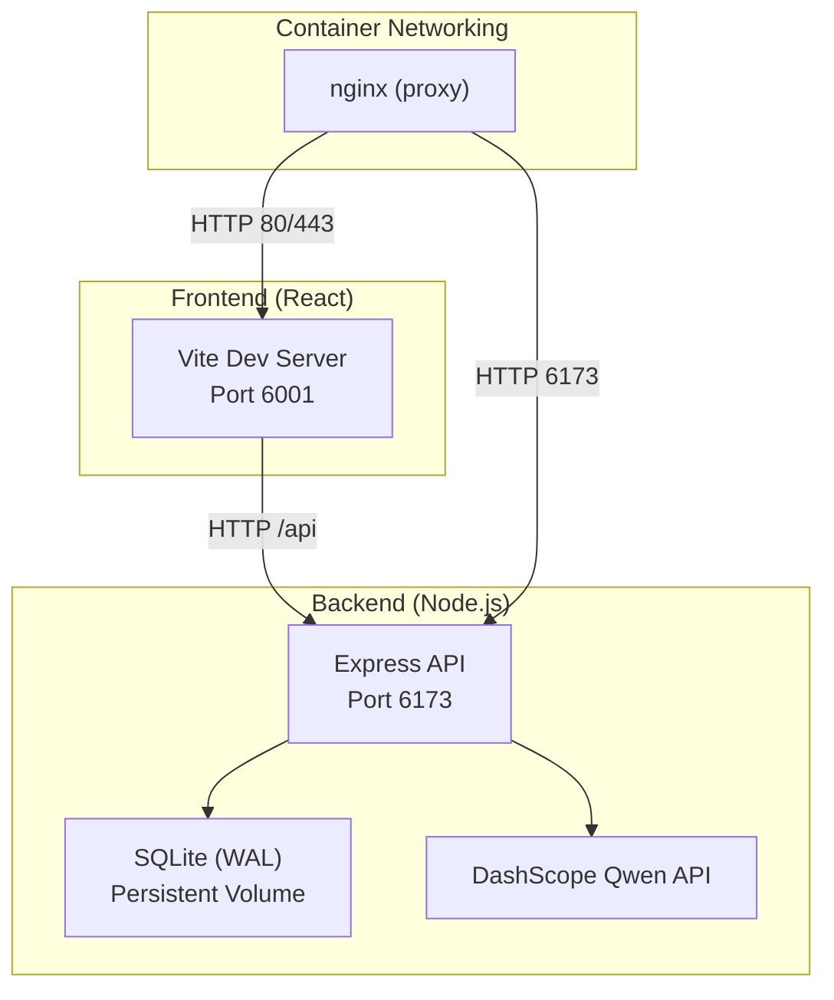
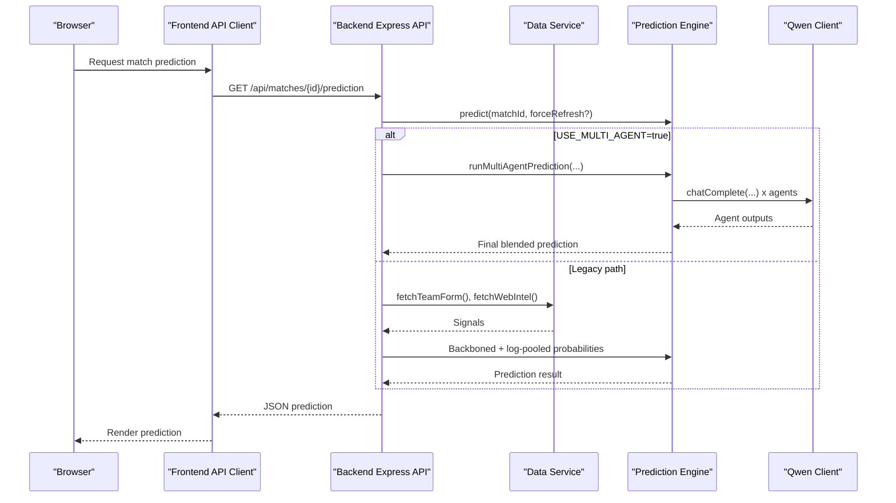
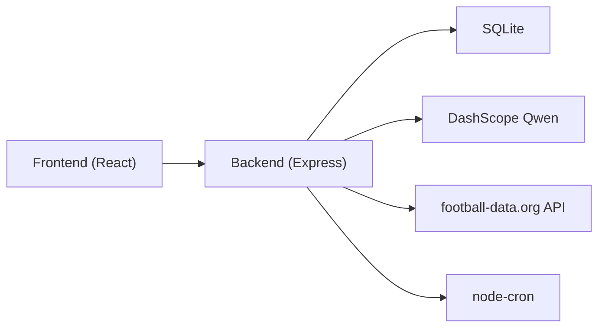

# Troubleshooting and FAQ

<cite>
**Referenced Files in This Document**
- [README.md](file://README.md)
- [SETUP.md](file://SETUP.md)
- [docker-compose.yml](file://docker-compose.yml)
- [backend/package.json](file://backend/package.json)
- [frontend/package.json](file://frontend/package.json)
- [backend/server.js](file://backend/server.js)
- [frontend/vite.config.js](file://frontend/vite.config.js)
- [backend/services/predictionEngine.js](file://backend/services/predictionEngine.js)
- [backend/services/qwenClient.js](file://backend/services/qwenClient.js)
- [backend/database/db.js](file://backend/database/db.js)
- [backend/services/dataService.js](file://backend/services/dataService.js)
- [backend/services/agents/orchestratorAgent.js](file://backend/services/agents/orchestratorAgent.js)
- [backend/services/agents/agentFramework.js](file://backend/services/agents/agentFramework.js)
- [deploy.sh](file://deploy.sh)
- [setup-ecs.sh](file://setup-ecs.sh)
</cite>

## Table of Contents
1. [Introduction](#introduction)
2. [Project Structure](#project-structure)
3. [Core Components](#core-components)
4. [Architecture Overview](#architecture-overview)
5. [Detailed Component Analysis](#detailed-component-analysis)
6. [Dependency Analysis](#dependency-analysis)
7. [Performance Considerations](#performance-considerations)
8. [Troubleshooting Guide](#troubleshooting-guide)
9. [Conclusion](#conclusion)
10. [Appendices](#appendices)

## Introduction
This document provides comprehensive troubleshooting and FAQ guidance for the World Cup 2026 Prediction App. It covers installation and setup issues (Docker configuration, API keys, port conflicts), prediction engine and multi-agent system failures, data synchronization problems, frontend performance and API connectivity issues, database access errors, performance optimization tips, deployment and SSL certificate problems, container networking failures, maintenance procedures, and extension guidance. It also answers common user questions about prediction accuracy, model limitations, and data freshness.

## Project Structure
The application consists of:
- Backend (Node.js + Express) serving predictions, managing the SQLite database, orchestrating multi-agent AI, and exposing REST APIs consumed by the frontend.
- Frontend (React + Vite) rendering the dashboard, schedule, match details, predictions, and tournament bracket.
- Docker Compose for containerized deployment on Alibaba Cloud ECS with automatic HTTPS provisioning.

**Diagram sources**
- [docker-compose.yml:1-34](file://docker-compose.yml#L1-L34)
- [frontend/vite.config.js:11-19](file://frontend/vite.config.js#L11-L19)
- [backend/server.js:18-22](file://backend/server.js#L18-L22)

**Section sources**
- [README.md:106-160](file://README.md#L106-L160)
- [docker-compose.yml:1-34](file://docker-compose.yml#L1-L34)
- [frontend/vite.config.js:11-19](file://frontend/vite.config.js#L11-L19)

## Core Components
- Prediction Engine: Computes match outcomes using a Dixon-Coles bivariate Poisson backbone, blending signals (H2H, form, intel, lineup, rest) with log-pool blending. Supports a multi-agent system that coordinates five specialized agents with negotiation.
- Multi-Agent Orchestration: Manages parallel agent execution, conflict detection, negotiation rounds, and final synthesis with weight adjustments.
- Data Services: Integrates football-data.org API and web scraping for live scores, form, H2H, and pre-match intelligence; caches results to reduce load.
- Qwen Client: Wraps DashScope API calls with retries and timeouts; provides health checks.
- Database: SQLite with WAL mode, migrations, and tables for teams, matches, predictions, model performance, suspensions, and multi-agent session logs.
- Frontend API Client: Axios-based client with environment-driven base URLs and timeouts.

**Section sources**
- [backend/services/predictionEngine.js:1-120](file://backend/services/predictionEngine.js#L1-L120)
- [backend/services/agents/orchestratorAgent.js:1-60](file://backend/services/agents/orchestratorAgent.js#L1-L60)
- [backend/services/dataService.js:1-60](file://backend/services/dataService.js#L1-L60)
- [backend/services/qwenClient.js:1-40](file://backend/services/qwenClient.js#L1-L40)
- [backend/database/db.js:23-50](file://backend/database/db.js#L23-L50)
- [frontend/src/api/client.js:1-10](file://frontend/src/api/client.js#L1-L10)

## Architecture Overview
The system integrates real-time data and AI to produce match predictions. The backend exposes REST endpoints for teams, matches, predictions, analytics, and synchronization. The frontend consumes these endpoints and renders the UI. Docker Compose orchestrates backend and frontend containers behind nginx, enabling HTTPS via Certbot.

**Diagram sources**
- [backend/server.js:326-341](file://backend/server.js#L326-L341)
- [backend/services/predictionEngine.js:690-755](file://backend/services/predictionEngine.js#L690-L755)
- [backend/services/agents/orchestratorAgent.js:309-325](file://backend/services/agents/orchestratorAgent.js#L309-L325)
- [backend/services/qwenClient.js:53-101](file://backend/services/qwenClient.js#L53-L101)
- [backend/services/dataService.js:68-133](file://backend/services/dataService.js#L68-L133)

## Detailed Component Analysis

### Prediction Engine Failures
Common symptoms:
- Empty or stale predictions.
- Errors when generating predictions for upcoming matches.
- Missing insight or factors.

Root causes and fixes:
- Missing or invalid environment variables (DASHSCOPE_API_KEY, FOOTBALL_DATA_API_KEY, USE_MULTI_AGENT).
  - Ensure keys are set in backend/.env and loaded by the backend process.
  - Verify PORT and FRONTEND_URL are correct.
- Multi-agent disabled or failing:
  - If USE_MULTI_AGENT=false, expect single-model predictions without LLM insights.
  - If USE_MULTI_AGENT=true, confirm DASHSCOPE_API_KEY is set; otherwise, the multi-agent path will fail.
- Data fetch failures:
  - football-data.org API key missing or rate-limited; fallback to web scraping may return default forms.
- Database initialization issues:
  - Ensure DB_PATH points to a writable location and the SQLite file exists or is created by seeding.

**Section sources**
- [backend/services/predictionEngine.js:55-61](file://backend/services/predictionEngine.js#L55-L61)
- [backend/services/dataService.js:18-28](file://backend/services/dataService.js#L18-L28)
- [backend/database/db.js:5-21](file://backend/database/db.js#L5-L21)

### Multi-Agent System Issues
Symptoms:
- Predictions hang or timeout during multi-agent runs.
- Agent outputs not saved; missing agent-session logs.
- JSON parsing errors from agents.

Root causes and fixes:
- LLM parsing failures:
  - Agent output schema mismatches cause parse errors; the framework injects a retry prompt to enforce JSON output.
  - If repeated failures occur, inspect agent logs and adjust prompts or disable problematic agents.
- Conflict detection and negotiation:
  - If conflicts exceed threshold, agents negotiate; if both fail to converge, the system falls back to Round 1 outputs with penalties applied.
- Session persistence:
  - Ensure agent_sessions, agent_messages, and agent_conflicts tables exist and are migrated.

**Section sources**
- [backend/services/agents/agentFramework.js:121-156](file://backend/services/agents/agentFramework.js#L121-L156)
- [backend/services/agents/agentFramework.js:350-374](file://backend/services/agents/agentFramework.js#L350-L374)
- [backend/services/agents/agentFramework.js:406-445](file://backend/services/agents/agentFramework.js#L406-L445)
- [backend/services/agents/orchestratorAgent.js:402-408](file://backend/services/agents/orchestratorAgent.js#L402-L408)

### Data Synchronization Problems
Symptoms:
- Live scores not updating.
- Finished matches not recorded.
- Inconsistent home/away pairing from API.

Root causes and fixes:
- Missing FOOTBALL_DATA_API_KEY prevents live sync.
- API response parsing errors or null scores skip updates.
- API home/away pairing may differ from DB; the sync routine swaps scores when reversed.

**Section sources**
- [backend/services/dataService.js:514-599](file://backend/services/dataService.js#L514-L599)

### Frontend Performance and API Connectivity
Symptoms:
- Slow loading of predictions or match lists.
- CORS errors between frontend and backend.
- Proxy misconfiguration causing 404s for /api endpoints.

Root causes and fixes:
- Vite proxy targets the backend on port 6173; ensure FRONTEND_URL matches the frontend origin.
- Increase axios timeout for long-running operations (e.g., batch prediction generation).
- Confirm nginx forwards /api to backend and that backend CORS allows the frontend origin.

**Section sources**
- [frontend/vite.config.js:11-19](file://frontend/vite.config.js#L11-L19)
- [backend/server.js:21-22](file://backend/server.js#L21-L22)
- [frontend/src/api/client.js:7-7](file://frontend/src/api/client.js#L7-L7)

### Database Access Errors
Symptoms:
- SQLite busy timeout errors.
- Schema migration failures.
- Stale locks preventing DB access.

Root causes and fixes:
- Busy timeout and foreign keys are enabled; ensure concurrent writes are minimized.
- The DB initializes schema and performs migrations on first connect; verify DB_PATH permissions.
- Stale lock files are removed on connect; if corruption persists, clear the .lock directory.

**Section sources**
- [backend/database/db.js:10-21](file://backend/database/db.js#L10-L21)
- [backend/database/db.js:23-250](file://backend/database/db.js#L23-L250)

### Deployment and SSL Certificate Problems
Symptoms:
- Backend responds but frontend shows blank page.
- HTTPS not working or certificate provisioning pending.
- Port conflicts on ECS.

Root causes and fixes:
- Ensure ports 80, 443, and 22 are open in the security group.
- Use deploy.sh to rsync and rebuild containers; health checks verify backend and frontend readiness.
- For HTTPS, provide DOMAIN and CERT_EMAIL; nginx config is templated and mounted via volumes.

**Section sources**
- [deploy.sh:1-110](file://deploy.sh#L1-L110)
- [docker-compose.yml:17-28](file://docker-compose.yml#L17-L28)

### Container Networking Failures
Symptoms:
- Frontend cannot reach /api endpoints.
- Internal DNS resolution issues between containers.

Root causes and fixes:
- backend service is not exposed to host; frontend communicates via nginx reverse proxy.
- BACKEND_URL in frontend environment must point to backend service name and port.
- Verify depends_on ordering and that backend is healthy before frontend starts.

**Section sources**
- [docker-compose.yml:14-26](file://docker-compose.yml#L14-L26)

## Dependency Analysis
The backend depends on:
- SQLite for persistence.
- DashScope Qwen for multi-agent reasoning.
- football-data.org for live scores and form data.
- node-cron for scheduled tasks.

The frontend depends on:
- Axios for API calls.
- React and Vite for building and development.

**Diagram sources**
- [backend/package.json:14-31](file://backend/package.json#L14-L31)
- [frontend/package.json:38-48](file://frontend/package.json#L38-L48)

**Section sources**
- [backend/package.json:14-31](file://backend/package.json#L14-L31)
- [frontend/package.json:38-48](file://frontend/package.json#L38-L48)

## Performance Considerations
- Prediction latency:
  - Multi-agent predictions are slower due to parallel LLM calls; consider disabling multi-agent for rapid previews.
  - Use cache-aware prediction logic to avoid recomputation for completed or frozen matches.
- Memory usage:
  - SQLite WAL mode improves concurrency; monitor DB growth and vacuum periodically.
  - Limit concurrent agent runs and reduce agent count if needed.
- CPU utilization:
  - Adjust cron frequencies for prediction regeneration and lineup fetches.
  - Reduce model token limits or temperature for faster responses.
- Frontend:
  - Enable production builds and pre-rendering; optimize chart rendering and image assets.

[No sources needed since this section provides general guidance]

## Troubleshooting Guide

### Installation and Setup
- Docker configuration problems:
  - Ensure docker-compose.yml is present and env_file points to backend/.env.
  - Confirm DB_PATH volume mapping and certbot volumes are declared.
- API key setup errors:
  - DASHSCOPE_API_KEY is mandatory for multi-agent; optional for single-agent.
  - FOOTBALL_DATA_API_KEY enables live scores; without it, fallbacks are used.
- Port conflicts:
  - Backend listens on PORT (default 6173).
  - Frontend development server uses 6001; ensure it is free.
  - ECS requires ports 80, 443, 22 open in the security group.

**Section sources**
- [SETUP.md:53-63](file://SETUP.md#L53-L63)
- [README.md:139-151](file://README.md#L139-L151)
- [docker-compose.yml:6-12](file://docker-compose.yml#L6-L12)
- [frontend/vite.config.js:11-13](file://frontend/vite.config.js#L11-L13)

### Prediction Engine Failures
- Symptoms: Blank predictions, missing insight, or errors.
- Checks:
  - Verify USE_MULTI_AGENT and DASHSCOPE_API_KEY.
  - Confirm data fetches succeed (form, intel, lineup).
  - Inspect database for predictions and model_config entries.
- Actions:
  - Re-seed database if schema is missing.
  - Temporarily disable multi-agent to isolate issues.

**Section sources**
- [backend/services/predictionEngine.js:55-61](file://backend/services/predictionEngine.js#L55-L61)
- [backend/database/db.js:228-249](file://backend/database/db.js#L228-L249)

### Multi-Agent System Issues
- Symptoms: Hangs, JSON parse errors, missing agent logs.
- Checks:
  - Review agent session tables for persisted messages and conflicts.
  - Confirm agent output schema compliance.
- Actions:
  - Retry failed agent calls; adjust prompts to improve JSON consistency.
  - Reduce conflict threshold or agent count if negotiation overhead is excessive.

**Section sources**
- [backend/services/agents/agentFramework.js:376-404](file://backend/services/agents/agentFramework.js#L376-L404)
- [backend/services/agents/orchestratorAgent.js:406-408](file://backend/services/agents/orchestratorAgent.js#L406-L408)

### Data Synchronization Problems
- Symptoms: Live scores not updating, finished matches not recorded.
- Checks:
  - Confirm FOOTBALL_DATA_API_KEY is set.
  - Inspect syncLiveResults logs for API errors or null scores.
- Actions:
  - Retry sync after API quota resets.
  - Manually trigger sync endpoint if needed.

**Section sources**
- [backend/services/dataService.js:514-599](file://backend/services/dataService.js#L514-L599)

### Frontend Performance and API Connectivity
- Symptoms: CORS errors, proxy 404s, slow loads.
- Checks:
  - FRONTEND_URL must match the origin served by Vite/nginx.
  - /api requests must be proxied to backend port 6173.
- Actions:
  - Update Vite proxy target and CORS origin.
  - Increase axios timeout for long operations.

**Section sources**
- [backend/server.js:21-22](file://backend/server.js#L21-L22)
- [frontend/vite.config.js:11-19](file://frontend/vite.config.js#L11-L19)
- [frontend/src/api/client.js:7-7](file://frontend/src/api/client.js#L7-L7)

### Database Access Errors
- Symptoms: SQLite busy timeout, migration failures, stale locks.
- Checks:
  - Verify DB_PATH is writable and accessible.
  - Ensure migrations executed successfully.
- Actions:
  - Restart backend to clear stale locks.
  - Backup and recreate DB if corrupted.

**Section sources**
- [backend/database/db.js:10-21](file://backend/database/db.js#L10-L21)
- [backend/database/db.js:210-227](file://backend/database/db.js#L210-L227)

### Deployment and SSL Certificate Problems
- Symptoms: Blank frontend, HTTPS not active.
- Checks:
  - Confirm deploy.sh ran successfully and containers are up.
  - Health checks verify backend and frontend.
- Actions:
  - Re-run deploy.sh with DOMAIN and CERT_EMAIL for HTTPS.
  - Check nginx logs and certbot status.

**Section sources**
- [deploy.sh:67-96](file://deploy.sh#L67-L96)
- [docker-compose.yml:17-28](file://docker-compose.yml#L17-L28)

### Container Networking Failures
- Symptoms: 404 on /api, DNS resolution issues.
- Checks:
  - BACKEND_URL must point to backend service and port.
  - depends_on ensures backend starts before frontend.
- Actions:
  - Align BACKEND_URL with docker-compose service names.
  - Verify container logs for startup order and errors.

**Section sources**
- [docker-compose.yml:21-26](file://docker-compose.yml#L21-L26)

### Maintenance Procedures
- Database cleanup:
  - Vacuum and checkpoint SQLite as needed; prune old predictions if storage constrained.
- Log file management:
  - Monitor backend logs for cron failures and LLM errors.
- System updates:
  - Rebuild containers after code changes; update environment variables as needed.

**Section sources**
- [backend/server.js:585-675](file://backend/server.js#L585-L675)

### Extending Functionality and Integrating Additional Data Sources
- Add new prediction signals:
  - Extend dataService to fetch and cache new sources; integrate into predictionEngine blending.
- New agents:
  - Implement a new agent module following the Agent interface and register it in the orchestrator.
- Additional endpoints:
  - Define new routes in server.js and expose them via the frontend API client.

**Section sources**
- [backend/services/dataService.js:68-133](file://backend/services/dataService.js#L68-L133)
- [backend/services/agents/orchestratorAgent.js:345-396](file://backend/services/agents/orchestratorAgent.js#L345-L396)

## Conclusion
This guide consolidates actionable steps to resolve common issues across installation, prediction engine operation, multi-agent orchestration, data synchronization, frontend performance, database access, deployment, and maintenance. Use the section sources to locate precise configurations and code paths for deeper investigation.

## Appendices

### Frequently Asked Questions

- Why are predictions not updating live?
  - Ensure FOOTBALL_DATA_API_KEY is set and the API is reachable. Check sync logs and retry after quota resets.

- Why is the multi-agent prediction taking long?
  - Multi-agent runs multiple LLM calls concurrently; disable multi-agent or reduce agent count for faster results.

- Why do I see “JSON parse error” in agent logs?
  - Agents must return strict JSON; ensure prompts enforce schema compliance. Retry logic applies fallbacks.

- How fresh is the data?
  - Form and H2H are cached; intel refreshes more frequently. Live scores update via API sync.

- Can I disable AI features?
  - Yes, set USE_MULTI_AGENT=false to use the single-model prediction path.

**Section sources**
- [backend/services/dataService.js:30-41](file://backend/services/dataService.js#L30-L41)
- [backend/services/predictionEngine.js:55-61](file://backend/services/predictionEngine.js#L55-L61)

### Support and Community Resources
- For deployment automation, use the provided scripts and ensure prerequisites are met.
- Report issues with reproducible steps and relevant logs.

**Section sources**
- [setup-ecs.sh:1-443](file://setup-ecs.sh#L1-L443)
- [deploy.sh:1-110](file://deploy.sh#L1-L110)